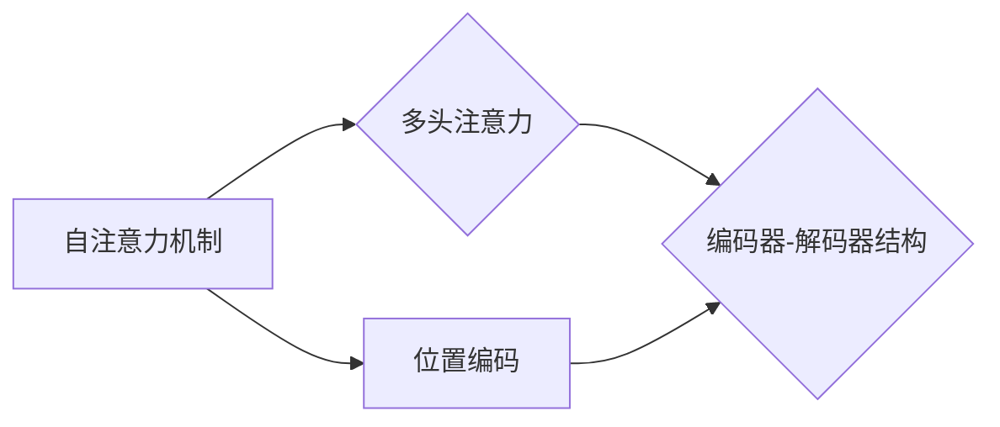

# transformer 原理与代码实例讲解

作者：禅与计算机程序设计艺术 / Zen and the Art of Computer Programming


## 1. 背景介绍
### 1.1 问题的由来

自2017年Google提出Transformer模型以来，自然语言处理（NLP）领域发生了翻天覆地的变化。传统的循环神经网络（RNN）和卷积神经网络（CNN）在处理长序列任务时表现出色，但在并行计算方面存在瓶颈。Transformer模型的提出，彻底改变了这一格局，其基于自注意力机制（Self-Attention）的架构，使得并行计算成为可能，并推动了NLP领域多个任务的性能突破。

### 1.2 研究现状

Transformer模型及其变体（如BERT、T5等）在多个NLP任务上取得了SOTA（State-of-the-Art）性能，包括文本分类、问答、机器翻译、文本摘要等。本文将深入探讨Transformer模型的原理，并通过代码实例进行详细讲解。

### 1.3 研究意义

Transformer模型的成功，不仅推动了NLP领域的发展，也为其他人工智能领域的研究提供了新的思路和方法。本文旨在帮助读者全面理解Transformer模型，并掌握其核心原理和实践技巧。

### 1.4 本文结构

本文将按照以下结构展开：

- 第2部分：介绍Transformer模型的核心概念和联系。
- 第3部分：详细讲解Transformer模型的原理和具体操作步骤。
- 第4部分：分析Transformer模型的优缺点，并探讨其应用领域。
- 第5部分：通过代码实例和详细解释说明，展示Transformer模型的实现过程。
- 第6部分：介绍Transformer模型在实际应用场景中的应用，并展望未来发展趋势。
- 第7部分：推荐学习资源和开发工具。
- 第8部分：总结研究成果，展望未来发展趋势与挑战。

## 2. 核心概念与联系

在介绍Transformer模型之前，我们需要先了解一些核心概念和联系：

- **自注意力机制（Self-Attention）**：自注意力机制是Transformer模型的核心，它能够捕捉序列中不同位置之间的相互关系。
- **位置编码（Positional Encoding）**：由于Transformer模型没有循环结构，无法直接处理序列的顺序信息，因此引入位置编码来表示每个位置的相对位置。
- **多头注意力（Multi-Head Attention）**：多头注意力机制将自注意力分解成多个子任务，每个子任务关注序列的不同部分，从而提高模型的性能。
- **编码器-解码器结构（Encoder-Decoder）**：编码器负责对输入序列进行编码，解码器负责解码编码器输出的表示，生成输出序列。

这些概念之间的关系可以表示为以下Mermaid流程图：



## 3. 核心算法原理 & 具体操作步骤
### 3.1 算法原理概述

Transformer模型主要由编码器（Encoder）和解码器（Decoder）两部分组成。编码器负责对输入序列进行编码，解码器负责解码编码器输出的表示，生成输出序列。

**编码器**：

1. 输入序列经过嵌入层（Embedding Layer）转换为词向量。
2. 将词向量与位置编码（Positional Encoding）相加，得到编码器的输入序列。
3. 经过多头自注意力层（Multi-Head Self-Attention）和前馈神经网络（Feed-Forward Neural Network）的堆叠，得到编码器的输出序列。

**解码器**：

1. 输入序列经过嵌入层和位置编码转换为词向量。
2. 使用编码器的输出序列作为解码器的输入序列。
3. 经过编码器-解码器注意力层（Encoder-Decoder Attention）和多头自注意力层，以及前馈神经网络的堆叠，得到解码器的输出序列。

### 3.2 算法步骤详解

**1. 嵌入层（Embedding Layer）**：

$$
\text{Embedding Layer}(x) = W_e x
$$

其中，$x \in \mathbb{R}^n$ 为输入序列，$W_e$ 为嵌入矩阵。

**2. 位置编码（Positional Encoding）**：

位置编码为每个词向量添加位置信息，使其包含序列的顺序信息。常见的位置编码方法包括正弦和余弦函数。

$$
\text{PE}(pos, 2i) = \sin(\frac{pos}{10000^{2i/d_{\text{model}}}})
$$

$$
\text{PE}(pos, 2i+1) = \cos(\frac{pos}{10000^{2i/d_{\text{model}}}})
$$

其中，$pos \in [0, \text{seq\_length}-1]$ 为位置索引，$d_{\text{model}}$ 为模型的最大隐藏层维度。

**3. 多头自注意力层（Multi-Head Self-Attention）**：

多头自注意力层将自注意力分解成多个子任务，每个子任务关注序列的不同部分。

$$
\text{Multi-Head Self-Attention}(Q, K, V) = \text{Concat}(\text{Head}_1, \text{Head}_2, ..., \text{Head}_h)W_o
$$

其中，$Q, K, V$ 分别为查询、键、值矩阵，$W_o$ 为输出矩阵。

**4. 前馈神经网络（Feed-Forward Neural Network）**：

前馈神经网络对每个位置的特征进行非线性变换。

$$
\text{FFN}(x) = \max(0, xW_1 + b_1)W_2 + b_2
$$

其中，$x \in \mathbb{R}^{d_{\text{model}}}$ 为输入特征，$W_1, W_2, b_1, b_2$ 为参数。

**5. 编码器-解码器注意力层（Encoder-Decoder Attention）**：

编码器-解码器注意力层使解码器能够关注编码器的特定部分。

$$
\text{Encoder-Decoder Attention}(Q, K, V) = \text{Concat}(\text{Head}_1, \text{Head}_2, ..., \text{Head}_h)W_o
$$

### 3.3 算法优缺点

**优点**：

- 并行计算：自注意力机制允许并行计算，显著提高了模型的训练和推理速度。
- 上下文感知：自注意力机制能够捕捉序列中不同位置之间的相互关系，使模型具有更强的上下文感知能力。
- 灵活性：Transformer模型结构简单，易于扩展和改进。

**缺点**：

- 计算复杂度高：自注意力机制的计算复杂度较高，尤其是在序列长度较长时。
- 需要大量计算资源：Transformer模型需要大量的计算资源进行训练和推理。

### 3.4 算法应用领域

Transformer模型及其变体在多个NLP任务上取得了SOTA性能，包括：

- 文本分类
- 问答
- 机器翻译
- 文本摘要
- 文本生成
- 文本相似度

## 4. 数学模型和公式 & 详细讲解 & 举例说明
### 4.1 数学模型构建

本节将使用数学语言对Transformer模型进行更加严格的刻画。

**1. 嵌入层（Embedding Layer）**：

$$
\text{Embedding Layer}(x) = W_e x
$$

其中，$x \in \mathbb{R}^n$ 为输入序列，$W_e$ 为嵌入矩阵。

**2. 位置编码（Positional Encoding）**：

$$
\text{PE}(pos, 2i) = \sin(\frac{pos}{10000^{2i/d_{\text{model}}}})
$$

$$
\text{PE}(pos, 2i+1) = \cos(\frac{pos}{10000^{2i/d_{\text{model}}}})
$$

**3. 多头自注意力层（Multi-Head Self-Attention）**：

$$
\text{Multi-Head Self-Attention}(Q, K, V) = \text{Concat}(\text{Head}_1, \text{Head}_2, ..., \text{Head}_h)W_o
$$

其中，$Q, K, V$ 分别为查询、键、值矩阵，$W_o$ 为输出矩阵。

**4. 前馈神经网络（Feed-Forward Neural Network）**：

$$
\text{FFN}(x) = \max(0, xW_1 + b_1)W_2 + b_2
$$

其中，$x \in \mathbb{R}^{d_{\text{model}}}$ 为输入特征，$W_1, W_2, b_1, b_2$ 为参数。

**5. 编码器-解码器注意力层（Encoder-Decoder Attention）**：

$$
\text{Encoder-Decoder Attention}(Q, K, V) = \text{Concat}(\text{Head}_1, \text{Head}_2, ..., \text{Head}_h)W_o
$$

### 4.2 公式推导过程

以下以多头自注意力层为例，进行公式推导。

假设多头自注意力层包含 $h$ 个头，每个头由线性层和softmax层组成。则多头自注意力层的计算过程如下：

1. 将输入序列 $x$ 通过线性层转换为查询（Query）矩阵 $Q$、键（Key）矩阵 $K$ 和值（Value）矩阵 $V$：

$$
Q = W_Q x
$$

$$
K = W_K x
$$

$$
V = W_V x
$$

2. 对每个头分别进行自注意力计算：

$$
\text{Head}_i(Q_i, K_i, V_i) = \text{Concat}(\text{softmax}(\frac{Q_iK_i^T}{\sqrt{d_k}})V_iW_i^T)W_o^T
$$

其中，$\text{softmax}(\cdot)$ 表示softmax函数，$W_i^T$ 为线性层的转置矩阵。

3. 将所有头的结果拼接起来，得到多头自注意力层的输出：

$$
\text{Multi-Head Self-Attention}(Q, K, V) = \text{Concat}(\text{Head}_1, \text{Head}_2, ..., \text{Head}_h)W_o
$$

### 4.3 案例分析与讲解

以下以BERT模型为例，分析其实现过程中的关键技术和细节。

BERT模型由Google提出，是Transformer模型的一个变体。BERT模型的主要贡献包括：

1. 使用双向Transformer编码器，能够捕捉序列中单词的上下文信息。
2. 引入掩码语言模型（Masked Language Model，MLM）作为预训练任务，学习语言知识和上下文关系。

BERT模型的预训练过程如下：

1. 将输入序列随机打乱，并使用特殊的[MASK]标记替换其中的部分单词。
2. 将打乱后的序列输入到Transformer编码器，得到编码器的输出序列。
3. 对于每个单词，根据其对应的输出序列预测其原始单词。

BERT模型的微调过程如下：

1. 将标注数据输入到BERT模型，得到编码器的输出序列。
2. 对每个单词，根据其对应的输出序列预测其标签。

BERT模型在多个NLP任务上取得了SOTA性能，成为NLP领域的一个里程碑。

### 4.4 常见问题解答

**Q1：为什么Transformer模型需要引入位置编码？**

A：由于Transformer模型没有循环结构，无法直接处理序列的顺序信息。因此，引入位置编码来表示每个位置的相对位置，使模型能够捕捉序列的顺序信息。

**Q2：多头自注意力机制有什么作用？**

A：多头自注意力机制将自注意力分解成多个子任务，每个子任务关注序列的不同部分，从而提高模型的性能。

**Q3：如何选择合适的Transformer模型架构？**

A：选择合适的Transformer模型架构需要根据具体任务和数据特点进行考虑，例如序列长度、计算资源、模型复杂度等。

## 5. 项目实践：代码实例和详细解释说明
### 5.1 开发环境搭建

在进行Transformer模型开发之前，我们需要准备好开发环境。以下是使用Python进行PyTorch开发的环境配置流程：

1. 安装Anaconda：从官网下载并安装Anaconda，用于创建独立的Python环境。

2. 创建并激活虚拟环境：
```bash
conda create -n pytorch-env python=3.8
conda activate pytorch-env
```

3. 安装PyTorch：根据CUDA版本，从官网获取对应的安装命令。例如：
```bash
conda install pytorch torchvision torchaudio cudatoolkit=11.1 -c pytorch -c conda-forge
```

4. 安装Transformers库：
```bash
pip install transformers
```

5. 安装各类工具包：
```bash
pip install numpy pandas scikit-learn matplotlib tqdm jupyter notebook ipython
```

完成上述步骤后，即可在`pytorch-env`环境中开始Transformer模型的开发。

### 5.2 源代码详细实现

以下是一个使用PyTorch和Transformers库实现BERT模型的简单示例。

```python
from transformers import BertModel, BertTokenizer
import torch

# 加载预训练的BERT模型和分词器
model = BertModel.from_pretrained('bert-base-uncased')
tokenizer = BertTokenizer.from_pretrained('bert-base-uncased')

# 加载文本数据
text = "Hello, how are you?"

# 将文本转换为BERT模型的输入格式
encoded_input = tokenizer(text, return_tensors='pt', padding=True, truncation=True)

# 将输入数据输入BERT模型
outputs = model(**encoded_input)

# 获取编码器的输出序列
encoded_output = outputs.last_hidden_state

# 将编码器的输出序列转换为numpy数组
encoded_output = encoded_output.squeeze(0).numpy()
```

以上代码展示了如何加载预训练的BERT模型和分词器，将文本数据转换为BERT模型的输入格式，并将输入数据输入BERT模型，最后获取编码器的输出序列。

### 5.3 代码解读与分析

以上代码展示了使用PyTorch和Transformers库实现BERT模型的基本流程：

1. 加载预训练的BERT模型和分词器：使用`BertModel.from_pretrained()`和`BertTokenizer.from_pretrained()`函数，可以快速加载预训练的BERT模型和分词器。

2. 加载文本数据：将待处理的文本数据存储在变量`text`中。

3. 将文本转换为BERT模型的输入格式：使用`BertTokenizer`的`encode_plus()`函数，可以将文本转换为BERT模型的输入格式，包括词向量、位置编码和注意力掩码。

4. 将输入数据输入BERT模型：使用`BertModel`的`(**encoded_input)`函数，可以将输入数据输入BERT模型，得到编码器的输出序列。

5. 获取编码器的输出序列：从`outputs`对象中获取编码器的输出序列，它包含每个单词的上下文特征。

6. 将编码器的输出序列转换为numpy数组：将编码器的输出序列转换为numpy数组，方便进行后续处理和分析。

### 5.4 运行结果展示

以上代码运行后，可以得到编码器的输出序列。该序列包含了每个单词的上下文特征，可以用于下游任务，如文本分类、情感分析等。

## 6. 实际应用场景
### 6.1 文本分类

文本分类是将文本数据划分为预定义的类别。Transformer模型可以用于文本分类任务，例如：

- 情感分析：根据文本内容判断其情感倾向（正面、负面、中性）。
- 主题分类：根据文本内容判断其所属的主题类别。
- 垃圾邮件检测：判断邮件是否为垃圾邮件。

### 6.2 问答

问答是将问题转换为答案的过程。Transformer模型可以用于问答任务，例如：

- 机器翻译：将源语言问题翻译成目标语言。
- 机器阅读理解：根据给定的问题和文章内容，生成对应的答案。
- 开放域问答：根据用户的问题，从知识库中检索并生成答案。

### 6.3 机器翻译

机器翻译是将一种自然语言翻译成另一种自然语言的过程。Transformer模型可以用于机器翻译任务，例如：

- 翻译文本：将一种语言的文本翻译成另一种语言。
- 翻译摘要：将长文本翻译成摘要。
- 翻译对话：将对话翻译成其他语言。

### 6.4 未来应用展望

随着Transformer模型的不断发展，其在NLP领域的应用将更加广泛。以下是一些未来应用展望：

- 知识图谱构建：利用Transformer模型分析文本数据，提取实体和关系，构建知识图谱。
- 代码生成：利用Transformer模型生成代码，提高代码开发效率。
- 语音合成：利用Transformer模型将文本转换为语音，实现更自然的语音合成。

## 7. 工具和资源推荐
### 7.1 学习资源推荐

为了帮助读者更好地学习和理解Transformer模型，以下推荐一些学习资源：

1. 《Transformer: Attention is All You Need》原论文：介绍了Transformer模型的原理和设计思路。
2. 《BERT: Pre-training of Deep Bidirectional Transformers for Language Understanding》原论文：介绍了BERT模型的原理和应用。
3. 《T5: Text-to-Text Transfer Transformer》原论文：介绍了T5模型的原理和应用。
4. 《Attention Is All You Need》系列博文：介绍了Transformer模型、BERT模型、T5模型等前沿技术。
5. 《Natural Language Processing with Transformers》书籍：详细介绍了Transformers库的使用方法和应用案例。

### 7.2 开发工具推荐

为了方便开发者进行Transformer模型的开发，以下推荐一些开发工具：

1. PyTorch：一个开源的深度学习框架，用于实现Transformer模型。
2. TensorFlow：另一个开源的深度学习框架，也支持Transformer模型的开发。
3. Transformers库：一个开源的Transformers模型库，提供大量预训练模型和API。
4. Hugging Face：一个开源平台，提供大量NLP数据集、模型和工具。
5. Colab：一个在线Jupyter Notebook环境，提供GPU/TPU算力，方便开发者和研究者进行实验。

### 7.3 相关论文推荐

以下是一些与Transformer模型相关的研究论文：

1. 《Attention Is All You Need》
2. 《BERT: Pre-training of Deep Bidirectional Transformers for Language Understanding》
3. 《Transformers: State-of-the-Art General Language Modeling》
4. 《T5: Text-to-Text Transfer Transformer》
5. 《BERT-for-Sequence-Labeling》

### 7.4 其他资源推荐

以下是一些其他资源，可以帮助读者了解Transformer模型的最新进展和应用：

1. arXiv：一个开源的论文预印本平台，可以找到最新的Transformer模型研究成果。
2. Google AI Blog：Google AI团队的博客，分享最新的AI技术研究和应用。
3. Hugging Face Blog：Hugging Face团队的博客，分享Transformers库的最新进展和应用案例。
4. OpenAI Blog：OpenAI团队的博客，分享最新的AI研究成果和应用。

## 8. 总结：未来发展趋势与挑战
### 8.1 研究成果总结

本文深入探讨了Transformer模型的原理、实现方法和应用场景，并通过代码实例进行了详细讲解。Transformer模型在NLP领域取得了显著的成果，推动了NLP技术的发展。

### 8.2 未来发展趋势

未来，Transformer模型将在以下方面继续发展：

1. 模型规模和参数量将进一步增长，以处理更复杂的任务。
2. 多模态融合将成为趋势，结合图像、视频等多模态信息。
3. 可解释性和可信赖性将成为重要研究方向。
4. 跨语言和跨领域迁移能力将得到提升。

### 8.3 面临的挑战

Transformer模型在发展过程中也面临着以下挑战：

1. 计算复杂度和资源消耗较大。
2. 模型的可解释性和可信赖性不足。
3. 需要大量标注数据。
4. 难以应对对抗攻击。

### 8.4 研究展望

为了应对这些挑战，未来的研究需要在以下方面进行探索：

1. 开发更轻量级的模型，降低计算复杂度和资源消耗。
2. 提高模型的可解释性和可信赖性。
3. 探索无监督和半监督学习，降低对标注数据的依赖。
4. 发展更有效的防御策略，提高模型的鲁棒性。

相信通过不断的研究和探索，Transformer模型将会在NLP领域取得更大的突破，为人类社会带来更多福祉。

## 9. 附录：常见问题与解答

**Q1：什么是Transformer模型？**

A：Transformer模型是一种基于自注意力机制的深度神经网络模型，用于处理序列数据。

**Q2：什么是自注意力机制？**

A：自注意力机制是一种能够捕捉序列中不同位置之间相互关系的机制。

**Q3：什么是位置编码？**

A：位置编码是为了使模型能够捕捉序列的顺序信息而引入的一种编码方式。

**Q4：什么是多头注意力机制？**

A：多头注意力机制将自注意力分解成多个子任务，每个子任务关注序列的不同部分。

**Q5：Transformer模型有哪些应用场景？**

A：Transformer模型可以应用于文本分类、问答、机器翻译、文本摘要等多个NLP任务。

**Q6：如何选择合适的Transformer模型架构？**

A：选择合适的Transformer模型架构需要根据具体任务和数据特点进行考虑，例如序列长度、计算资源、模型复杂度等。

**Q7：如何提高Transformer模型的性能？**

A：提高Transformer模型的性能可以通过以下方法：增加模型规模、优化模型结构、引入新的训练技巧等。

**Q8：如何降低Transformer模型的计算复杂度和资源消耗？**

A：降低Transformer模型的计算复杂度和资源消耗可以通过以下方法：模型压缩、量化加速、剪枝等。

**Q9：如何提高Transformer模型的鲁棒性？**

A：提高Transformer模型的鲁棒性可以通过以下方法：引入对抗训练、数据增强、正则化等。

**Q10：如何提高Transformer模型的可解释性和可信赖性？**

A：提高Transformer模型的可解释性和可信赖性可以通过以下方法：可视化模型内部结构、引入因果推理、建立评估指标等。

希望以上常见问题与解答能够帮助读者更好地理解和应用Transformer模型。