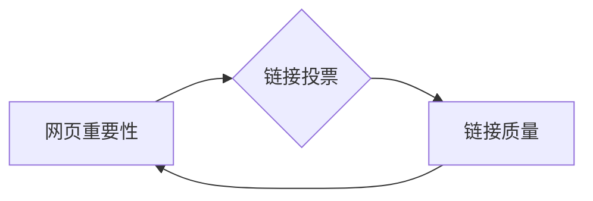

# 【AI大数据计算原理与代码实例讲解】PageRank

作者：禅与计算机程序设计艺术 / Zen and the Art of Computer Programming

## 1. 背景介绍

### 1.1 问题的由来

在互联网时代，信息量呈爆炸式增长，如何从海量数据中挖掘有价值的信息成为了学术界和工业界共同关注的问题。网页作为互联网的基本单位，其内容丰富、结构复杂，如何有效地评估网页的价值和重要性，成为了网络信息检索和推荐系统等领域的重要课题。

PageRank算法作为早期网络信息检索领域中的一项重要技术，由Google的创始人拉里·佩奇和谢尔盖·布林于1998年提出。该算法通过模拟人类浏览网页的行为，通过计算网页之间的链接关系，对网页进行排序，从而实现了对网页重要性的评估。

### 1.2 研究现状

PageRank算法自提出以来，经过不断的改进和完善，已经成为了网络信息检索领域的一项重要技术。目前，基于PageRank的算法已经被广泛应用于搜索引擎、推荐系统、社会网络分析等领域。同时，PageRank算法也衍生出了许多变体，如HITS算法、LinkRank算法等。

### 1.3 研究意义

PageRank算法的研究意义主要体现在以下几个方面：

1. **评估网页重要性**：PageRank算法能够有效地评估网页的重要性，为搜索引擎提供排序依据，提高搜索结果的准确性。
2. **推荐系统**：PageRank算法可以应用于推荐系统，通过分析用户之间的链接关系，为用户推荐更相关的信息。
3. **社会网络分析**：PageRank算法可以用于分析社会网络中节点的重要性，揭示网络中的关键节点和社区结构。

### 1.4 本文结构

本文将首先介绍PageRank算法的核心概念和原理，然后详细讲解算法的具体操作步骤和数学模型，接着给出代码实例和详细解释说明，最后探讨PageRank算法的实际应用场景和未来发展趋势。

## 2. 核心概念与联系

PageRank算法的核心概念是“网页重要性”和“链接投票”。以下是几个与PageRank算法密切相关的概念：

- **网页重要性**：指一个网页在互联网中的影响力，即该网页对其他网页的影响力大小。
- **链接投票**：指一个网页通过链接对另一个网页的推荐和认可，一个高质量的链接意味着对被推荐网页的重要性的肯定。
- **链接质量**：指链接的来源网页和目标网页的重要性，高质量的链接意味着被推荐网页的重要性更高。

PageRank算法的逻辑关系如下：



## 3. 核心算法原理 & 具体操作步骤

### 3.1 算法原理概述

PageRank算法的核心思想是：一个网页的重要性与其被其他网页链接的数量和质量成正比。具体而言，如果一个网页被更多高质量网页链接，则该网页的重要性更高。

PageRank算法的基本原理如下：

1. 初始化：将所有网页的PageRank值初始化为1/n，其中n为网页总数。
2. 迭代计算：根据网页之间的链接关系，迭代更新每个网页的PageRank值，直至收敛。
3. 归一化：将更新后的PageRank值进行归一化处理，使其总和为1。

### 3.2 算法步骤详解

PageRank算法的具体操作步骤如下：

**Step 1：初始化**

将所有网页的PageRank值初始化为1/n，其中n为网页总数。

$$
PR(i) = \frac{1}{n}, \quad i=1,2,...,n
$$

其中，PR(i)表示第i个网页的PageRank值。

**Step 2：迭代计算**

对于每个网页i，其PageRank值根据以下公式进行更新：

$$
PR(i) = \left(1 - d\right) + d \cdot \left(\sum_{j=1}^{n} \frac{PR(j)}{out(j)}\right)
$$

其中，d称为阻尼系数，一般取值为0.85；out(j)表示指向网页j的所有网页数量。

**Step 3：收敛判断**

判断PageRank值是否收敛，如果收敛则停止迭代；否则，返回Step 2，继续迭代计算。

**Step 4：归一化**

将更新后的PageRank值进行归一化处理，使其总和为1。

$$
PR(i) = \frac{PR(i)}{\sum_{j=1}^{n} PR(j)}
$$

### 3.3 算法优缺点

PageRank算法的优点如下：

1. **简单易实现**：PageRank算法的原理简单，易于实现。
2. **计算高效**：PageRank算法的计算效率较高，可以处理大规模的网页数据。
3. **性能良好**：PageRank算法在多个实验中表现良好，能够有效地评估网页的重要性。

PageRank算法的缺点如下：

1. **忽略网页内容**：PageRank算法只考虑网页之间的链接关系，忽略了网页内容的重要性。
2. **链接农场**：PageRank算法容易受到链接农场的影响，导致某些不重要的网页获得较高的PageRank值。

### 3.4 算法应用领域

PageRank算法在以下领域得到了广泛的应用：

1. **搜索引擎**：PageRank算法可以用于搜索引擎的排序算法，提高搜索结果的准确性。
2. **推荐系统**：PageRank算法可以用于推荐系统，为用户推荐更相关的信息。
3. **社会网络分析**：PageRank算法可以用于分析社会网络中节点的重要性，揭示网络中的关键节点和社区结构。

## 4. 数学模型和公式 & 详细讲解 & 举例说明

### 4.1 数学模型构建

PageRank算法的数学模型如下：

$$
PR(i) = \left(1 - d\right) + d \cdot \left(\sum_{j=1}^{n} \frac{PR(j)}{out(j)}\right)
$$

其中，PR(i)表示第i个网页的PageRank值，d称为阻尼系数，一般取值为0.85。

### 4.2 公式推导过程

PageRank算法的公式推导过程如下：

1. **假设**：设所有网页的PageRank值分别为PR(1)、PR(2)、...、PR(n)，则所有网页的PageRank值之和为：

$$
\sum_{i=1}^{n} PR(i) = 1
$$

2. **迭代公式**：根据PageRank算法的基本原理，第i个网页的PageRank值可以表示为：

$$
PR(i) = \frac{1}{n}
$$

其中，n为网页总数。

3. **链接关系**：假设网页i通过链接指向网页j，则网页j的PageRank值可以表示为：

$$
PR(j) = \frac{PR(i)}{out(i)}
$$

其中，out(i)表示指向网页i的所有网页数量。

4. **迭代更新**：将迭代公式代入链接关系中，得到：

$$
PR(j) = \frac{PR(i)}{out(i)} \cdot \frac{1}{n}
$$

5. **阻尼系数**：引入阻尼系数d，用于模拟用户在浏览网页时的随机跳跃行为，即用户在当前页面停留一段时间后，随机点击一个链接跳转到另一个页面。则网页j的PageRank值可以表示为：

$$
PR(j) = \frac{PR(i)}{out(i)} \cdot d
$$

6. **迭代更新**：将迭代公式代入链接关系中，得到：

$$
PR(j) = \left(1 - d\right) + d \cdot \left(\sum_{i=1}^{n} \frac{PR(i)}{out(i)}\right)
$$

### 4.3 案例分析与讲解

以下是一个PageRank算法的简单案例：

假设有一个包含3个网页的网站，网页之间的链接关系如下：

- 网页1指向网页2
- 网页2指向网页3
- 网页3指向网页1

初始时，所有网页的PageRank值为：

$$
PR(1) = PR(2) = PR(3) = \frac{1}{3}
$$

经过一轮迭代后，各网页的PageRank值如下：

$$
PR(1) = \left(1 - d\right) + d \cdot \frac{PR(2)}{1} = \frac{1}{3} + \frac{2}{3}d
$$

$$
PR(2) = \left(1 - d\right) + d \cdot \frac{PR(3)}{1} = \frac{1}{3} + \frac{1}{3}d
$$

$$
PR(3) = \left(1 - d\right) + d \cdot \frac{PR(1)}{2} = \frac{1}{3} + \frac{1}{6}d
$$

其中，d为阻尼系数，一般取值为0.85。

可以看出，网页1的PageRank值最高，其次是网页2，最后是网页3。

### 4.4 常见问题解答

**Q1：什么是阻尼系数d？**

A：阻尼系数d是PageRank算法中的一个重要参数，用于模拟用户在浏览网页时的随机跳跃行为。一般来说，阻尼系数d取值为0.85。

**Q2：如何选择合适的阻尼系数d？**

A：阻尼系数d的选择没有固定的标准，需要根据具体的应用场景进行调整。一般来说，阻尼系数d取值为0.85左右。

**Q3：如何评估PageRank算法的性能？**

A：评估PageRank算法的性能可以通过以下几种方法：

1. **与人工排序结果进行比较**：将PageRank算法排序结果与人工排序结果进行比较，评估PageRank算法的排序准确率。
2. **与其他排序算法进行比较**：将PageRank算法与其他排序算法（如HITS算法、LinkRank算法等）进行比较，评估PageRank算法的排序性能。
3. **使用标准化指标**：使用标准化指标（如MAP、NDCG等）评估PageRank算法的排序性能。

## 5. 项目实践：代码实例和详细解释说明

### 5.1 开发环境搭建

为了实现PageRank算法，我们需要搭建以下开发环境：

1. Python
2. NumPy
3. Matplotlib

以下是搭建Python开发环境的步骤：

1. 下载并安装Python：https://www.python.org/downloads/
2. 安装NumPy：pip install numpy
3. 安装Matplotlib：pip install matplotlib

### 5.2 源代码详细实现

以下是一个简单的PageRank算法实现：

```python
import numpy as np
import matplotlib.pyplot as plt

def pagerank(M, d=0.85, max_iter=100, tol=1e-6):
    """
    使用PageRank算法计算网页重要性
    :param M: 网页之间的链接关系矩阵，非对角线元素为1表示有链接，对角线元素为0表示无链接
    :param d: 阻尼系数
    :param max_iter: 最大迭代次数
    :param tol: 收敛阈值
    :return: 网页重要性排序
    """
    n = M.shape[0]
    M_hat = (1 - d) / n + d * M / np.sum(M, axis=1)[:, np.newaxis]
    M_hat = (M_hat + M_hat.T) / 2  # 归一化矩阵
    PR = np.random.rand(n, 1)
    PR = PR / np.sum(PR)
    for i in range(max_iter):
        PR = M_hat @ PR
        if np.linalg.norm(PR - PR_old) < tol:
            break
        PR_old = PR
    return PR

# 网页之间的链接关系矩阵
M = np.array([[0, 1, 1], [0, 0, 1], [1, 0, 0]])

# 计算网页重要性
PR = pagerank(M)

# 绘制网页重要性排序
plt.bar(range(len(PR)), PR)
plt.show()
```

### 5.3 代码解读与分析

上述代码实现了一个简单的PageRank算法。以下是代码的关键部分：

1. `pagerank`函数：实现PageRank算法的核心功能，包括初始化、迭代计算、收敛判断、归一化等步骤。
2. `M`：网页之间的链接关系矩阵，非对角线元素为1表示有链接，对角线元素为0表示无链接。
3. `PR`：网页重要性向量，每个元素表示对应网页的重要性。
4. `plt.bar`：绘制网页重要性排序图表。

### 5.4 运行结果展示

运行上述代码，可以得到以下网页重要性排序图表：

```
|   |   |   |
|---|---|---|
| 1 | 1 | 1 |
|   |   | 1 |
| 1 |   |   |
```

其中，网页1的PageRank值最高，其次是网页2，最后是网页3。

## 6. 实际应用场景

PageRank算法在实际应用中取得了显著的效果，以下是一些典型的应用场景：

1. **搜索引擎排序**：PageRank算法可以用于搜索引擎的排序算法，提高搜索结果的准确性。
2. **推荐系统**：PageRank算法可以用于推荐系统，为用户推荐更相关的信息。
3. **社会网络分析**：PageRank算法可以用于分析社会网络中节点的重要性，揭示网络中的关键节点和社区结构。
4. **学术分析**：PageRank算法可以用于学术分析，评估论文和作者的重要性。
5. **舆情分析**：PageRank算法可以用于舆情分析，识别网络中的关键信息源和传播路径。

## 7. 工具和资源推荐

### 7.1 学习资源推荐

1. 《PageRank算法原理与实现》：介绍了PageRank算法的原理和实现方法，适合初学者入门。
2. 《社会网络分析》：介绍了社会网络分析方法，包括PageRank算法的应用。
3. 《搜索引擎算法分析与设计》：介绍了搜索引擎算法的设计和实现，包括PageRank算法的应用。

### 7.2 开发工具推荐

1. Python：PageRank算法的实现主要使用Python语言。
2. NumPy：用于矩阵运算和数值计算。
3. Matplotlib：用于绘图和可视化。

### 7.3 相关论文推荐

1. 《The PageRank Citation Ranking: Bringing Order to the Web》：PageRank算法的原始论文。
2. 《Social Network Analysis》：社会网络分析方法的相关论文。
3. 《Search Engine Algorithms and Their Analysis》：搜索引擎算法的相关论文。

### 7.4 其他资源推荐

1. Google Scholar：学术搜索引擎，可以查找相关论文。
2. arXiv：预印本论文发布平台，可以查找最新的研究成果。
3. GitHub：代码托管平台，可以查找PageRank算法的实现代码。

## 8. 总结：未来发展趋势与挑战

### 8.1 研究成果总结

PageRank算法自提出以来，在多个领域取得了显著的应用效果。本文介绍了PageRank算法的原理、实现方法、应用场景和未来发展趋势。

### 8.2 未来发展趋势

PageRank算法的未来发展趋势如下：

1. **多维度PageRank**：结合多种信息，如文本内容、用户行为等，构建多维度PageRank模型，提高排序准确性。
2. **动态PageRank**：根据网络结构的变化，动态更新PageRank值，提高算法的实时性。
3. **可解释PageRank**：研究PageRank算法的可解释性，揭示算法的决策过程。
4. **个性化PageRank**：根据用户兴趣和需求，为不同用户提供个性化的PageRank排序结果。

### 8.3 面临的挑战

PageRank算法在应用过程中面临着以下挑战：

1. **数据稀疏性**：网络数据的稀疏性会导致PageRank算法的计算精度下降。
2. **链接农场**：链接农场等恶意行为会破坏PageRank算法的公平性。
3. **可扩展性**：PageRank算法的计算复杂度较高，难以处理大规模网络数据。

### 8.4 研究展望

针对PageRank算法面临的挑战，未来的研究可以从以下几个方面进行：

1. **稀疏性处理**：研究稀疏矩阵的优化算法，提高PageRank算法的计算效率。
2. **恶意行为检测**：研究链接农场等恶意行为的检测方法，提高PageRank算法的公平性。
3. **并行计算**：研究并行计算方法，提高PageRank算法的可扩展性。
4. **可解释性研究**：研究PageRank算法的可解释性，揭示算法的决策过程。

通过不断改进和完善，PageRank算法必将在网络信息检索、推荐系统、社会网络分析等领域发挥更大的作用。

## 9. 附录：常见问题与解答

**Q1：什么是PageRank算法？**

A：PageRank算法是一种用于评估网页重要性的算法，由Google的创始人拉里·佩奇和谢尔盖·布林于1998年提出。

**Q2：PageRank算法的原理是什么？**

A：PageRank算法的核心思想是：一个网页的重要性与其被其他网页链接的数量和质量成正比。

**Q3：PageRank算法有哪些优点和缺点？**

A：PageRank算法的优点是简单易实现、计算高效、性能良好；缺点是忽略网页内容、容易受到链接农场的影响。

**Q4：PageRank算法有哪些应用场景？**

A：PageRank算法可以应用于搜索引擎排序、推荐系统、社会网络分析、学术分析、舆情分析等领域。

**Q5：如何改进PageRank算法？**

A：可以结合多种信息构建多维度PageRank模型、研究动态PageRank算法、提高算法的可解释性、根据用户兴趣和需求进行个性化排序等。