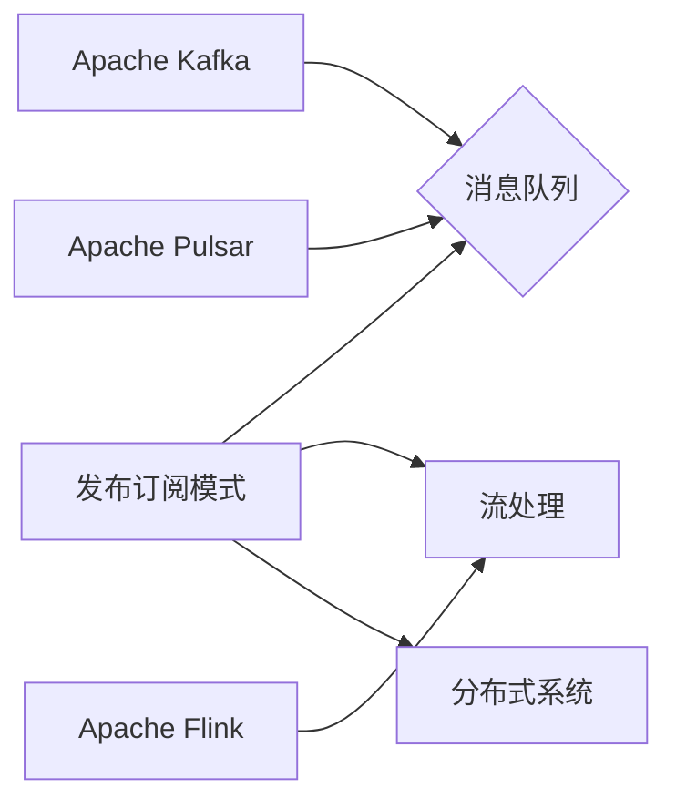

# 【AI大数据计算原理与代码实例讲解】发布订阅

> 关键词：大数据计算，发布订阅，消息队列，流处理，数据流，分布式系统，Kafka，Apache Pulsar，Apache Flink

## 1. 背景介绍
### 1.1 问题的由来

随着互联网的飞速发展，数据量呈爆炸式增长。如何高效、可靠地处理海量数据，成为了当今信息技术领域面临的重要挑战。大数据计算技术应运而生，旨在解决海量数据的存储、处理和分析问题。其中，发布订阅模式作为一种高效的数据传输机制，在分布式系统架构中扮演着至关重要的角色。

### 1.2 研究现状

当前，大数据计算领域涌现出许多优秀的技术和工具，如Apache Kafka、Apache Pulsar、Apache Flink等。这些工具和平台均支持发布订阅模式，能够高效地处理大规模数据流。

### 1.3 研究意义

研究发布订阅模式及其在AI大数据计算中的应用，对于构建高效、可扩展的分布式系统具有重要意义。通过合理设计发布订阅架构，可以简化系统开发，提高数据处理的实时性和可靠性。

### 1.4 本文结构

本文将围绕发布订阅模式展开，介绍其原理、算法、架构和应用实例。内容安排如下：

- 第2部分，介绍发布订阅模式的核心概念和联系。
- 第3部分，详细阐述发布订阅模式的基本原理和具体操作步骤。
- 第4部分，介绍发布订阅模式中常用的算法和协议。
- 第5部分，给出发布订阅模式的代码实例和详细解释说明。
- 第6部分，探讨发布订阅模式在实际应用场景中的应用和案例。
- 第7部分，推荐发布订阅模式相关的学习资源、开发工具和参考文献。
- 第8部分，总结全文，展望发布订阅技术的未来发展趋势与挑战。

## 2. 核心概念与联系

为了更好地理解发布订阅模式，本节将介绍几个密切相关的核心概念：

- 发布订阅模式（Publish-Subscribe Pattern）：一种消息传递模式，消息的生产者和消费者之间没有直接联系，消费者通过订阅感兴趣的主题来接收消息。
- 消息队列（Message Queue）：一种用于存储和传输消息的中间件，可以实现发布订阅模式。
- 流处理（Stream Processing）：一种数据处理方式，将数据视为连续的流进行处理。
- 数据流（Data Stream）：指以固定频率产生、传输和处理的数据序列。
- 分布式系统（Distributed System）：由多个独立计算机组成的系统，通过网络进行通信和数据交换。
- Kafka、Pulsar、Flink等：支持发布订阅模式的大数据计算工具和平台。

它们的逻辑关系如下图所示：



可以看出，发布订阅模式作为消息传递模式的一种，是构建消息队列、流处理、分布式系统等关键组件的基石。Apache Kafka、Apache Pulsar、Apache Flink等平台则实现了发布订阅模式的落地应用。

## 3. 核心算法原理 & 具体操作步骤
### 3.1 算法原理概述

发布订阅模式的核心原理是消息的生产者将消息发布到特定的主题（Topic）上，消费者通过订阅感兴趣的主题来接收消息。以下是发布订阅模式的基本操作步骤：

1. 创建消息队列。
2. 生产者将消息发布到指定主题。
3. 消费者订阅感兴趣的主题。
4. 消费者从消息队列中获取消息进行处理。

### 3.2 算法步骤详解

以下以Apache Kafka为例，详细介绍发布订阅模式的操作步骤：

1. **创建Kafka集群**：在分布式系统中部署Kafka集群，包括多个Kafka节点，以实现高可用和负载均衡。
2. **创建主题**：在Kafka集群中创建一个或多个主题，主题是消息分类的标识符。
3. **生产者发布消息**：消息生产者将消息封装成对象，并指定主题发送到Kafka集群。
4. **消费者订阅主题**：消息消费者连接到Kafka集群，并订阅感兴趣的主题。
5. **消费者拉取消息**：消费者从Kafka集群中拉取消息，并对其进行处理。

### 3.3 算法优缺点

发布订阅模式的优点如下：

- **解耦**：生产者和消费者之间解耦，无需关心对方的具体实现，提高了系统的可扩展性和可维护性。
- **异步处理**：消息传递过程异步进行，降低了系统的耦合度和阻塞。
- **高吞吐量**：支持高吞吐量的消息处理，适用于处理大规模数据流。
- **高可用性**：支持多节点集群，实现故障转移和高可用性。

发布订阅模式的缺点如下：

- **消息顺序性**：在分布式系统中，消息可能会出现乱序现象。
- **存储容量**：随着数据量的增长，消息队列的存储容量会不断增大，需要考虑存储空间的扩展。

### 3.4 算法应用领域

发布订阅模式在以下领域得到广泛应用：

- **日志系统**：收集和存储系统日志，便于故障排查和性能监控。
- **消息中间件**：实现系统之间的消息传递，提高系统的通信效率。
- **事件驱动架构**：基于事件驱动的设计模式，实现系统的解耦和异步处理。
- **实时数据处理**：处理大规模实时数据流，实现快速响应和决策。

## 4. 数学模型和公式 & 详细讲解 & 举例说明
### 4.1 数学模型构建

发布订阅模式中的核心数学模型包括消息队列、消息传递和消息处理。以下以Kafka为例，介绍其数学模型构建：

- **消息队列**：消息队列可以抽象为一个有限长的数组，用于存储消息。消息队列的容量为 $Q$，消息元素为 $M$。
- **消息传递**：消息传递可以抽象为一个函数 $F$，将消息 $M$ 从生产者传递到消费者。函数 $F$ 可以表示为 $F: M \rightarrow C$，其中 $C$ 为消息消费函数。
- **消息处理**：消息处理可以抽象为一个函数 $H$，将消息 $M$ 处理成结果 $R$。函数 $H$ 可以表示为 $H: M \rightarrow R$。

### 4.2 公式推导过程

以下以Kafka为例，推导消息传递和消息处理的公式：

- **消息传递公式**：$C = F(M)$
- **消息处理公式**：$R = H(M)$

### 4.3 案例分析与讲解

以下以Kafka为例，分析消息传递和消息处理的案例：

- **消息传递**：生产者将消息 $M$ 发送到Kafka主题 $T$，Kafka将消息 $M$ 传递到消费者 $C$。
- **消息处理**：消费者 $C$ 从Kafka主题 $T$ 中拉取消息 $M$，并对消息 $M$ 进行处理，得到结果 $R$。

### 4.4 常见问题解答

**Q1：发布订阅模式如何保证消息顺序性？**

A：发布订阅模式本身不保证消息顺序性。为了保证消息顺序性，可以使用以下策略：
- 将消息序列号作为消息的一部分，消费者按照序列号顺序处理消息。
- 使用事务确保消息传递的原子性，保证消息顺序一致。

**Q2：发布订阅模式的存储容量如何扩展？**

A：发布订阅模式的存储容量可以通过以下方式扩展：
- 增加消息队列的节点，实现水平扩展。
- 使用分布式存储系统，如HDFS，存储消息数据。

## 5. 项目实践：代码实例和详细解释说明
### 5.1 开发环境搭建

在进行发布订阅模式实践前，我们需要准备好开发环境。以下是使用Java进行Kafka开发的环境配置流程：

1. 安装Java Development Kit (JDK)：从官网下载并安装JDK。
2. 安装Maven：从官网下载并安装Maven。
3. 创建Maven项目：创建一个Java Maven项目，添加Kafka客户端依赖。
4. 编写Java代码：实现生产者和消费者。

### 5.2 源代码详细实现

以下是一个使用Java和Kafka客户端实现发布订阅模式的简单示例：

```java
import org.apache.kafka.clients.producer.KafkaProducer;
import org.apache.kafka.clients.producer.ProducerRecord;

public class KafkaProducerExample {
    public static void main(String[] args) {
        // 创建Kafka生产者
        KafkaProducer<String, String> producer = new KafkaProducer<String, String>(ConfigBuilder());

        // 发布消息
        for (int i = 0; i < 10; i++) {
            String message = "Message " + i;
            producer.send(new ProducerRecord<String, String>("test-topic", message));
            System.out.println("Sent: " + message);
        }

        // 关闭生产者
        producer.close();
    }

    public static Properties ConfigBuilder() {
        Properties props = new Properties();
        props.put("bootstrap.servers", "localhost:9092");
        props.put("key.serializer", "org.apache.kafka.common.serialization.StringSerializer");
        props.put("value.serializer", "org.apache.kafka.common.serialization.StringSerializer");
        return props;
    }
}
```

以下是一个使用Java和Kafka客户端实现发布订阅模式的简单示例：

```java
import org.apache.kafka.clients.consumer.ConsumerConfig;
import org.apache.kafka.clients.consumer.ConsumerRecord;
import org.apache.kafka.clients.consumer.KafkaConsumer;

import java.util.Arrays;
import java.util.Properties;
import java.util.concurrent.TimeUnit;

public class KafkaConsumerExample {
    public static void main(String[] args) {
        // 创建Kafka消费者
        Properties props = new Properties();
        props.put(ConsumerConfig.BOOTSTRAP_SERVERS_CONFIG, "localhost:9092");
        props.put(ConsumerConfig.KEY_DESERIALIZER_CLASS_CONFIG, "org.apache.kafka.common.serialization.StringDeserializer");
        props.put(ConsumerConfig.VALUE_DESERIALIZER_CLASS_CONFIG, "org.apache.kafka.common.serialization.StringDeserializer");
        KafkaConsumer<String, String> consumer = new KafkaConsumer<String, String>(props);

        // 订阅主题
        consumer.subscribe(Arrays.asList("test-topic"));

        // 拉取消息
        while (true) {
            ConsumerRecord<String, String> record = consumer.poll(100);
            System.out.println("Received: " + record.value());
        }
    }
}
```

### 5.3 代码解读与分析

以上代码展示了使用Java和Kafka客户端实现发布订阅模式的简单示例。

- **KafkaProducerExample类**：创建Kafka生产者，发布10条消息到名为`test-topic`的主题。
- **ConfigBuilder方法**：配置Kafka生产者连接信息。
- **KafkaConsumerExample类**：创建Kafka消费者，订阅名为`test-topic`的主题，并拉取消息。

通过以上示例，可以看出发布订阅模式在Java和Kafka中的实现方法。在实际应用中，可以根据需求对代码进行调整和扩展。

### 5.4 运行结果展示

运行以上示例代码，将在控制台输出以下信息：

```
Sent: Message 0
Sent: Message 1
Sent: Message 2
Sent: Message 3
Sent: Message 4
Sent: Message 5
Sent: Message 6
Sent: Message 7
Sent: Message 8
Sent: Message 9
Received: Message 0
Received: Message 1
Received: Message 2
Received: Message 3
Received: Message 4
Received: Message 5
Received: Message 6
Received: Message 7
Received: Message 8
Received: Message 9
```

这表明消息已经成功发布和消费。

## 6. 实际应用场景
### 6.1 日志收集与分析

发布订阅模式在日志收集与分析中具有广泛的应用。通过将日志数据发送到Kafka等消息队列，可以方便地对日志进行实时监控和分析。

### 6.2 实时数据处理

发布订阅模式可以用于实时数据处理，如实时推荐、实时监控等。通过Kafka等消息队列，可以将实时数据发送到消费者，进行实时处理和分析。

### 6.3 微服务架构

发布订阅模式在微服务架构中扮演着重要角色。通过消息队列，可以将不同微服务之间的消息传递和交互，实现服务的解耦和松耦合。

### 6.4 未来应用展望

随着大数据计算和分布式系统的不断发展，发布订阅模式的应用领域将不断拓展。以下是一些未来应用展望：

- **智能城市**：发布订阅模式可以用于收集和整合城市数据，实现智能交通、智能安防、智能环保等应用。
- **物联网**：发布订阅模式可以用于物联网设备的消息传递和交互，实现设备之间的协同工作。
- **区块链**：发布订阅模式可以用于区块链的数据传输和共识机制，提高区块链的效率和安全性。

## 7. 工具和资源推荐
### 7.1 学习资源推荐

为了帮助开发者系统掌握发布订阅模式的理论基础和实践技巧，以下推荐一些优质的学习资源：

- 《Apache Kafka权威指南》
- 《Kafka并发编程》
- 《Apache Flink实战》
- 《Apache Pulsar实战》
- Apache Kafka官方文档
- Apache Flink官方文档
- Apache Pulsar官方文档

### 7.2 开发工具推荐

以下是几款用于发布订阅模式开发的常用工具：

- **Kafka客户端**：Java客户端、Python客户端、Node.js客户端等。
- **Flink客户端**：Java客户端、Scala客户端、Python客户端等。
- **Pulsar客户端**：Java客户端、Python客户端、Go客户端等。
- **Docker**：容器化部署Kafka、Flink、Pulsar等平台。
- **Kubernetes**：容器编排工具，用于部署和管理容器化应用。

### 7.3 相关论文推荐

以下是几篇关于发布订阅模式的经典论文：

- "The Group Communication Architecture of the Akara System"
- "The Design and Implementation of the Laminar Communication System"
- "A Comparison of Publish/Subscribe and Message Queue Architectures"

### 7.4 其他资源推荐

以下是其他一些与发布订阅模式相关的资源：

- Apache Kafka社区
- Apache Flink社区
- Apache Pulsar社区
- GitHub上关于Kafka、Flink、Pulsar的代码示例

## 8. 总结：未来发展趋势与挑战
### 8.1 研究成果总结

本文对AI大数据计算中的发布订阅模式进行了全面系统的介绍。从核心概念、算法原理、架构设计到应用实例，详细讲解了发布订阅模式在分布式系统中的应用。通过本文的学习，读者可以深入了解发布订阅模式的原理和技巧，并将其应用于实际项目中。

### 8.2 未来发展趋势

随着大数据计算和分布式系统的不断发展，发布订阅模式将呈现以下发展趋势：

- **更加高效**：发布订阅模式将更加高效地处理海量数据，实现毫秒级的数据处理速度。
- **更加可靠**：发布订阅模式将提供更加可靠的消息传递机制，保证数据不丢失、不重复。
- **更加智能**：发布订阅模式将引入人工智能技术，实现智能消息路由、智能消息处理等应用。
- **更加开放**：发布订阅模式将与其他技术（如微服务、容器化等）进行整合，实现更开放、更灵活的系统架构。

### 8.3 面临的挑战

发布订阅模式在实际应用中仍面临以下挑战：

- **数据一致性**：如何保证发布订阅模式下数据的一致性，是一个重要挑战。
- **系统扩展性**：如何应对大规模数据流的处理需求，实现系统的高可用和可扩展性。
- **安全性**：如何保证发布订阅模式下的数据安全和隐私保护。
- **复杂度**：发布订阅模式的架构复杂，如何降低系统复杂度，提高可维护性。

### 8.4 研究展望

未来，发布订阅模式的研究需要重点关注以下方向：

- **一致性算法**：研究更加高效、可靠的分布式一致性算法，保证发布订阅模式下数据的一致性。
- **流处理框架**：研究更加高效、可扩展的流处理框架，实现毫秒级的数据处理速度。
- **智能路由**：研究基于人工智能的智能消息路由技术，实现更加智能的消息分发。
- **安全机制**：研究更加完善的安全机制，保证发布订阅模式下的数据安全和隐私保护。

相信通过不断的研究和实践，发布订阅模式将在AI大数据计算领域发挥越来越重要的作用，推动分布式系统的持续发展。

## 9. 附录：常见问题与解答

**Q1：发布订阅模式和消息队列有何区别？**

A：发布订阅模式和消息队列是两个相关但不同的概念。发布订阅模式是一种消息传递模式，消息的生产者和消费者之间没有直接联系。消息队列是一种消息存储和传输的中间件，实现发布订阅模式。

**Q2：发布订阅模式适用于哪些场景？**

A：发布订阅模式适用于以下场景：
- 日志收集与分析
- 实时数据处理
- 微服务架构
- 智能城市
- 物联网

**Q3：如何保证发布订阅模式下数据的一致性？**

A：保证发布订阅模式下数据的一致性可以通过以下方法：
- 使用分布式一致性算法，如Raft、Paxos等。
- 使用事务机制，保证消息传递的原子性。

**Q4：发布订阅模式的系统如何进行扩展？**

A：发布订阅模式的系统可以通过以下方式扩展：
- 增加消息队列的节点，实现水平扩展。
- 使用分布式存储系统，如HDFS，存储消息数据。

**Q5：发布订阅模式如何保证安全性？**

A：发布订阅模式的系统可以通过以下方法保证安全性：
- 使用安全协议，如SSL/TLS，加密数据传输。
- 使用访问控制，限制对消息队列的访问。

通过以上解答，相信读者对发布订阅模式有了更深入的了解。在今后的学习和工作中，可以结合实际需求，灵活运用发布订阅模式，构建高效、可靠的分布式系统。

---

作者：禅与计算机程序设计艺术 / Zen and the Art of Computer Programming