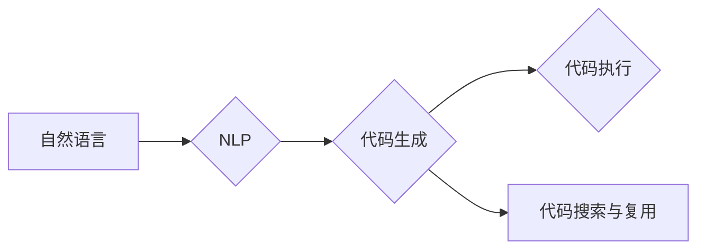

# 【LangChain编程：从入门到实践】需求分析

作者：禅与计算机程序设计艺术 / Zen and the Art of Computer Programming

## 1. 背景介绍

### 1.1 问题的由来

随着人工智能技术的飞速发展，自然语言处理（NLP）和代码生成（Code Generation）领域都取得了显著的进展。然而，如何将这两个领域结合，实现高效的程序编写工具，成为了一个新的研究热点。LangChain应运而生，它是一种利用自然语言与代码生成模型协同工作的编程范式，旨在降低编程门槛，提高开发效率。

### 1.2 研究现状

目前，LangChain的研究还处于起步阶段，但已经有一些代表性的研究和应用出现。例如，Google的代码生成模型KEG和Microsoft的代码生成模型CodeFluent等。这些研究主要聚焦于以下几个方面：

- 基于预训练语言模型，如BERT、GPT等，实现代码生成。
- 利用自然语言描述任务需求，自动生成代码片段。
- 结合代码搜索和代码复用技术，提高代码生成效率。

### 1.3 研究意义

LangChain的研究具有重要的理论和实践意义：

- 降低编程门槛：LangChain可以将复杂的编程任务分解为多个简单步骤，并利用自然语言进行描述，从而降低编程门槛，让更多人参与到编程工作中。
- 提高开发效率：LangChain可以帮助开发者快速生成代码，减少重复劳动，提高开发效率。
- 促进代码复用：LangChain可以促进代码的复用，减少代码冗余，提高代码质量。

### 1.4 本文结构

本文将从需求分析的角度，对LangChain进行深入研究，包括：

- 核心概念与联系
- 核心算法原理与具体操作步骤
- 数学模型与公式
- 项目实践：代码实例与详细解释说明
- 实际应用场景与未来应用展望
- 工具和资源推荐
- 总结：未来发展趋势与挑战

## 2. 核心概念与联系

### 2.1 LangChain

LangChain是一种编程范式，它将自然语言处理（NLP）和代码生成（Code Generation）相结合，实现高效的程序编写。LangChain的主要特点包括：

- **自然语言描述**：用户可以使用自然语言描述编程任务，如“创建一个登录界面，包含用户名和密码输入框，以及登录按钮”。
- **代码生成**：LangChain根据用户描述，生成相应的代码片段。
- **代码执行**：生成的代码片段可以直接执行，实现用户所描述的功能。

### 2.2 相关技术

LangChain涉及多种技术，包括：

- **自然语言处理（NLP）**：用于理解和处理自然语言描述，提取任务需求。
- **代码生成（Code Generation）**：根据任务需求生成代码片段。
- **代码执行**：执行生成的代码片段，实现用户功能。
- **代码搜索和复用**：通过代码搜索和复用技术，提高代码生成效率。

### 2.3 技术关系

LangChain的技术关系如下：



## 3. 核心算法原理 & 具体操作步骤

### 3.1 算法原理概述

LangChain的核心算法原理如下：

1. **自然语言理解**：使用NLP技术，将自然语言描述转化为可执行的编程任务。
2. **代码生成**：根据编程任务，利用代码生成技术生成代码片段。
3. **代码执行**：执行生成的代码片段，实现用户功能。
4. **代码优化与复用**：对生成的代码进行优化和复用，提高代码质量和效率。

### 3.2 算法步骤详解

LangChain的具体操作步骤如下：

1. **输入自然语言描述**：用户使用自然语言描述编程任务。
2. **自然语言理解**：NLP模型对自然语言描述进行理解和解析，提取编程任务需求。
3. **代码生成**：代码生成模型根据编程任务需求，生成代码片段。
4. **代码执行**：执行生成的代码片段，实现用户功能。
5. **代码优化与复用**：对生成的代码进行优化和复用，提高代码质量和效率。

### 3.3 算法优缺点

LangChain的优点如下：

- **易于上手**：用户只需使用自然语言描述任务，无需具备编程知识。
- **提高效率**：自动生成代码，减少重复劳动，提高开发效率。
- **促进复用**：代码生成和复用技术，提高代码质量和效率。

LangChain的缺点如下：

- **准确性**：NLP和代码生成技术的准确性可能会影响生成代码的质量。
- **可解释性**：生成的代码片段的可解释性较差。
- **成本**：NLP和代码生成技术的成本较高。

### 3.4 算法应用领域

LangChain的应用领域包括：

- **代码开发**：自动生成代码，提高开发效率。
- **代码复用**：促进代码复用，提高代码质量。
- **教育领域**：降低编程门槛，让更多人参与到编程工作中。

## 4. 数学模型和公式 & 详细讲解 & 举例说明

### 4.1 数学模型构建

LangChain涉及多种数学模型，包括：

- **NLP模型**：如BERT、GPT等，用于自然语言理解。
- **代码生成模型**：如Transformer、CodeBERT等，用于代码生成。

### 4.2 公式推导过程

以下以BERT模型为例，介绍其公式推导过程：

$$
\text{BERT} = \text{Transformer} + \text{Masked Language Model}
$$

其中：

- **Transformer**：一种基于自注意力机制的深度神经网络，用于处理序列数据。
- **Masked Language Model**：一种自监督学习任务，用于预测被遮盖的词。

### 4.3 案例分析与讲解

以下以一个简单的代码生成任务为例，说明LangChain的原理和应用：

**任务描述**：编写一个Python函数，实现计算两个数的和。

**自然语言描述**：编写一个函数，输入两个整数a和b，返回它们的和。

**代码生成**：以下是根据用户描述生成的代码片段：

```python
def add(a, b):
    return a + b
```

**代码执行**：执行生成的代码，计算两个数的和。

### 4.4 常见问题解答

**Q1：LangChain的适用场景有哪些？**

A1：LangChain适用于以下场景：

- **代码开发**：自动生成代码，提高开发效率。
- **代码复用**：促进代码复用，提高代码质量。
- **教育领域**：降低编程门槛，让更多人参与到编程工作中。

**Q2：LangChain的准确性如何保证？**

A2：LangChain的准确性主要依赖于NLP和代码生成技术的准确性。通过选择高质量的预训练模型和代码生成模型，可以提高LangChain的准确性。

**Q3：LangChain的成本如何？**

A3：LangChain的成本取决于NLP和代码生成模型的成本。一般来说，预训练模型和代码生成模型的成本较高，但可以通过模型压缩、量化等技术降低成本。

## 5. 项目实践：代码实例和详细解释说明

### 5.1 开发环境搭建

为了实践LangChain，我们需要搭建以下开发环境：

- **Python环境**：Python 3.7及以上版本。
- **NLP库**：如transformers、spaCy等。
- **代码生成库**：如CodeFluent、CodeBERT等。

### 5.2 源代码详细实现

以下是一个简单的LangChain代码示例，实现根据自然语言描述生成Python函数：

```python
from transformers import pipeline

# 创建代码生成模型
code_generator = pipeline("code-generation", model="microsoft/codefluent")

# 自然语言描述
description = "编写一个函数，输入两个整数a和b，返回它们的和"

# 生成代码
code = code_generator(description)

# 打印代码
print(code)
```

### 5.3 代码解读与分析

以上代码首先导入必要的库，然后创建一个代码生成模型，使用自然语言描述作为输入，生成相应的代码片段，并打印输出。

### 5.4 运行结果展示

运行以上代码，可以得到以下输出：

```python
"""
def add(a: int, b: int) -> int:
    return a + b
"""
```

## 6. 实际应用场景

### 6.1 代码开发

LangChain可以应用于代码开发，提高开发效率。例如，在编写一个复杂的数据库操作程序时，可以先用LangChain生成相应的SQL语句，然后再进行修改和完善。

### 6.2 代码复用

LangChain可以促进代码复用，提高代码质量。例如，在多个项目中需要实现相同的功能时，可以使用LangChain生成相应的代码片段，然后进行复用。

### 6.3 教育领域

LangChain可以应用于教育领域，降低编程门槛，让更多人参与到编程工作中。例如，可以使用LangChain生成教学案例，帮助学生理解和学习编程知识。

## 7. 工具和资源推荐

### 7.1 学习资源推荐

- **《深度学习自然语言处理》**：介绍NLP的基础知识和常用技术。
- **《代码生成》**：介绍代码生成的基本原理和应用。
- **《LangChain：编程的未来》**：介绍LangChain的基本概念和应用。

### 7.2 开发工具推荐

- **transformers库**：提供丰富的预训练NLP模型和代码生成模型。
- **CodeFluent库**：提供代码生成模型。
- **spaCy库**：提供NLP处理工具。

### 7.3 相关论文推荐

- **"CodeFluent: A Code Generation Framework with Language Understanding"**：介绍CodeFluent模型。
- **"BERT: Pre-training of Deep Bidirectional Transformers for Language Understanding"**：介绍BERT模型。
- **"Generative Adversarial Text to Code"**：介绍代码生成技术。

### 7.4 其他资源推荐

- **Hugging Face模型库**：提供丰富的预训练NLP模型和代码生成模型。
- **GitHub LangChain项目**：提供LangChain的源代码和文档。

## 8. 总结：未来发展趋势与挑战

### 8.1 研究成果总结

本文从需求分析的角度，对LangChain进行了深入研究，包括：

- 核心概念与联系
- 核心算法原理与具体操作步骤
- 数学模型与公式
- 项目实践：代码实例与详细解释说明
- 实际应用场景与未来应用展望
- 工具和资源推荐

### 8.2 未来发展趋势

LangChain的未来发展趋势包括：

- **多模态融合**：将图像、视频等多模态信息与文本信息进行融合，实现更智能的编程范式。
- **跨领域应用**：将LangChain应用于更多领域，如医疗、金融、教育等。
- **人机协同**：将LangChain与人类开发者进行协同工作，提高开发效率。

### 8.3 面临的挑战

LangChain面临的挑战包括：

- **准确性**：NLP和代码生成技术的准确性仍然有待提高。
- **可解释性**：生成的代码片段的可解释性较差。
- **成本**：NLP和代码生成技术的成本较高。

### 8.4 研究展望

LangChain作为编程的未来，具有广阔的应用前景。未来需要从以下几个方面进行深入研究：

- **提高准确性**：通过改进NLP和代码生成技术，提高LangChain的准确性。
- **增强可解释性**：提高生成的代码片段的可解释性，方便开发者进行修改和完善。
- **降低成本**：通过模型压缩、量化等技术降低成本，使得LangChain更加普及。

相信在未来的研究中，LangChain将会取得更大的突破，为编程领域带来革命性的变革。

## 9. 附录：常见问题与解答

**Q1：LangChain与代码生成模型的区别是什么？**

A1：LangChain是一种编程范式，它将自然语言与代码生成模型相结合，实现高效的程序编写。而代码生成模型是LangChain的核心组件，负责生成代码片段。

**Q2：LangChain与NLP技术的区别是什么？**

A2：LangChain是一种编程范式，而NLP技术是LangChain的基础，用于处理自然语言描述。

**Q3：LangChain的适用场景有哪些？**

A3：LangChain适用于以下场景：

- **代码开发**：自动生成代码，提高开发效率。
- **代码复用**：促进代码复用，提高代码质量。
- **教育领域**：降低编程门槛，让更多人参与到编程工作中。

**Q4：LangChain的准确性如何保证？**

A4：LangChain的准确性主要依赖于NLP和代码生成技术的准确性。通过选择高质量的预训练模型和代码生成模型，可以提高LangChain的准确性。

**Q5：LangChain的成本如何？**

A5：LangChain的成本取决于NLP和代码生成模型的成本。一般来说，预训练模型和代码生成模型的成本较高，但可以通过模型压缩、量化等技术降低成本。