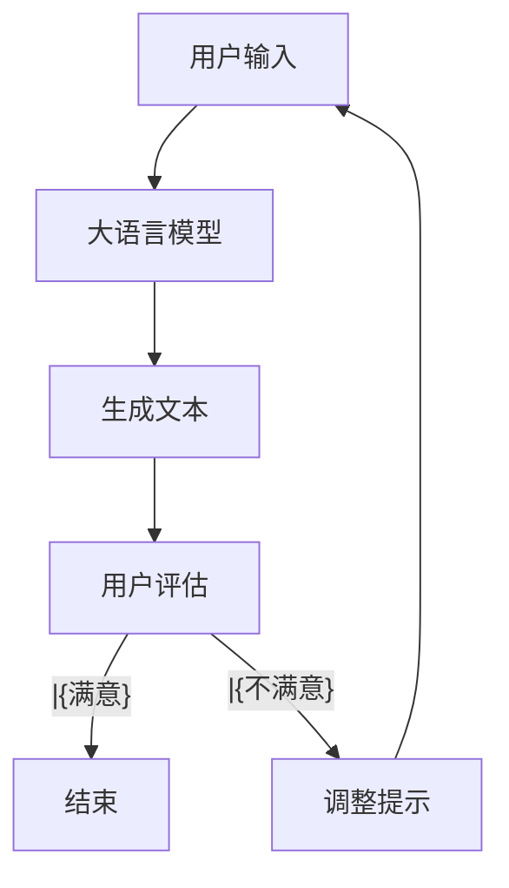

                 

**大语言模型应用指南：Completion交互格式**

**作者：禅与计算机程序设计艺术 / Zen and the Art of Computer Programming**

## 1. 背景介绍

在当今的数字时代，人工智能（AI）和自然语言处理（NLP）技术已经渗透到我们的日常生活中，从虚拟助手到智能搜索引擎，再到自动化客户服务。其中，大语言模型（LLM）扮演着关键角色，它们能够理解、生成和翻译人类语言。本指南将重点介绍大语言模型的一种应用：Completion交互格式，并提供实用的指南和示例。

## 2. 核心概念与联系

### 2.1 核心概念

- **大语言模型（LLM）**：一种NLP模型，能够理解和生成人类语言，通过学习大量文本数据来掌握语言规则和上下文。
- **Completion（补全）**：一种交互格式，模型根据输入的上下文生成后续文本。
- **Prompt（提示）**：用于引导模型生成特定类型输出的输入文本。

### 2.2 核心概念联系 Mermaid 流程图



## 3. 核心算法原理 & 具体操作步骤

### 3.1 算法原理概述

Completion交互格式基于大语言模型的生成能力。模型接受用户输入（prompt）并生成相关文本。用户可以根据生成的文本调整prompt，以改善输出结果。

### 3.2 算法步骤详解

1. 用户输入prompt。
2. 模型生成文本。
3. 用户评估输出。
4. 根据需要调整prompt。
5. 重复步骤2-4，直到用户满意。

### 3.3 算法优缺点

**优点**：

- 灵活：可以生成各种类型的文本，从翻译到创意写作。
- 交互式：用户可以控制输出结果。

**缺点**：

- 需要大量计算资源。
- 生成的文本可能包含错误或不相关信息。

### 3.4 算法应用领域

- 文本生成：创意写作、新闻写作、营销文案等。
- 翻译：多语言翻译。
- 客户服务：自动化客户互动。
- 编程助手：代码生成和调试。

## 4. 数学模型和公式 & 详细讲解 & 举例说明

### 4.1 数学模型构建

大语言模型通常基于Transformer架构，使用自注意力机制（Self-Attention）和Transformer编码器-解码器结构。数学模型可以表示为：

$$P(w_{t+1}|w_1,..., w_t) = \text{Softmax}(f(w_1,..., w_t; \theta))$$

其中，$w_1,..., w_t$表示输入序列，$w_{t+1}$表示下一个生成的单词，$f$是一个神经网络，$θ$是模型的参数。

### 4.2 公式推导过程

推导过程涉及到注意力机制、位置编码和Transformer编码器-解码器结构。由于篇幅限制，请参考相关论文（如"Attention is All You Need"）获取详细信息。

### 4.3 案例分析与讲解

假设我们想要生成一段描述自然景色的文本。我们可以输入如下prompt：

> "描述一个美丽的乡村景色。"

大语言模型可能会生成类似以下文本：

> "在一个晴朗的早晨，我醒来时听到鸟儿的歌唱。我打开窗户，看到一片绿色的田野，点缀着金色的小麦。远处，一座古老的教堂矗立在山丘上，周围环绕着绿树。"

## 5. 项目实践：代码实例和详细解释说明

### 5.1 开发环境搭建

要使用Completion交互格式，您需要一个支持大语言模型的开发环境。您可以使用云端服务（如Google Colab、Hugging Face Spaces）或本地环境（如Python和Transformers库）。

### 5.2 源代码详细实现

以下是一个简单的Python示例，使用Hugging Face的Transformers库和BLOOM模型：

```python
from transformers import pipeline

# 初始化大语言模型
model = pipeline('text-generation', model='bigscience/bloom-560m')

# 定义prompt
prompt = "描述一个美丽的乡村景色。"

# 生成文本
output = model(prompt, max_length=50, num_return_sequences=1, pad_token_id=50256)[0]

# 打印结果
print(output['generated_text'])
```

### 5.3 代码解读与分析

我们首先导入所需的库和模型。然后，我们定义一个prompt，并使用模型生成文本。我们设置`max_length`以限制生成的文本长度，`num_return_sequences`以指定生成的文本数量，`pad_token_id`以指定填充令牌。

### 5.4 运行结果展示

运行上述代码后，您应该会看到类似于4.3节中的文本输出。

## 6. 实际应用场景

### 6.1 当前应用

Completion交互格式已广泛应用于各种NLP任务，从文本生成到翻译，再到客户服务。

### 6.2 未来应用展望

未来，大语言模型可能会变得更加智能和通用，能够理解和生成更复杂的文本。它们可能会应用于更多领域，如医疗、金融和法律。

## 7. 工具和资源推荐

### 7.1 学习资源推荐

- "Attention is All You Need"：https://arxiv.org/abs/1706.03762
- "Language Models are Few-Shot Learners"：https://arxiv.org/abs/2005.14165
- Hugging Face Transformers库：https://huggingface.co/transformers/

### 7.2 开发工具推荐

- Google Colab：https://colab.research.google.com/
- Hugging Face Spaces：https://huggingface.co/spaces
- Jupyter Notebook：https://jupyter.org/

### 7.3 相关论文推荐

- "BLOOM: A Large Language Model for Many Tasks"：https://arxiv.org/abs/2211.05100
- "T5: Text-to-Text Transfer Transformer"：https://arxiv.org/abs/1910.10683

## 8. 总结：未来发展趋势与挑战

### 8.1 研究成果总结

大语言模型和Completion交互格式已经取得了显著的进展，并广泛应用于各种NLP任务。

### 8.2 未来发展趋势

未来，大语言模型可能会变得更加智能和通用，能够理解和生成更复杂的文本。它们可能会应用于更多领域，如医疗、金融和法律。

### 8.3 面临的挑战

- **计算资源**：大语言模型需要大量计算资源。
- **数据偏见**：模型可能会受到训练数据的偏见影响。
- **解释性**：模型的决策过程通常是不透明的。

### 8.4 研究展望

未来的研究可能会关注模型的解释性、数据偏见和计算资源需求。

## 9. 附录：常见问题与解答

**Q：大语言模型是如何学习的？**

A：大语言模型通过学习大量文本数据来掌握语言规则和上下文。它们使用监督学习算法，如Transformer架构，来预测下一个单词。

**Q：Completion交互格式有哪些优缺点？**

A：优点包括灵活性和交互式特性。缺点包括计算资源需求和可能的错误或不相关输出。

**Q：大语言模型有哪些应用领域？**

A：大语言模型已广泛应用于各种NLP任务，从文本生成到翻译，再到客户服务。

**作者：禅与计算机程序设计艺术 / Zen and the Art of Computer Programming**

