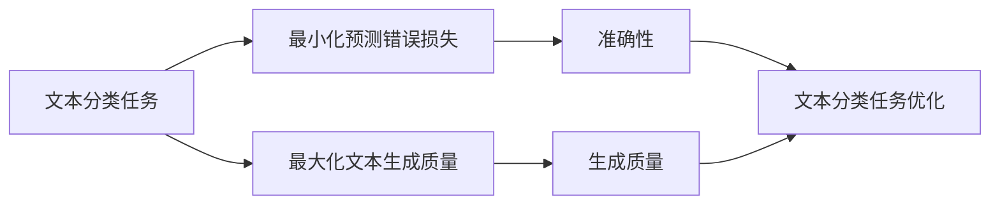

                 

- 大语言模型 (LLM)
- 目标冲突 (Conflict of Objectives)
- 泛化不匹配 (Mismatched Generalization)
- 微调 (Fine-tuning)
- 反向传播 (Backpropagation)
- 交叉熵损失 (Cross-Entropy Loss)
- 文本分类 (Text Classification)
- 文本生成 (Text Generation)
- 知识蒸馏 (Knowledge Distillation)
- 少样本学习 (Few-shot Learning)

## 1. 背景介绍

大语言模型（LLM）是一种用于理解和生成人类语言的深度学习模型。它们通过处理大量文本数据来学习语言的结构和规则，从而能够执行各种自然语言处理（NLP）任务，如文本分类、文本生成和问答系统。然而，LLM在应用中面临着两个主要挑战：目标冲突和泛化不匹配。

## 2. 核心概念与联系

### 2.1 目标冲突

目标冲突指的是在训练LLM时，模型需要同时优化多个目标，这些目标可能会相互冲突。例如，在文本分类任务中，模型需要同时最小化预测错误的损失和最大化文本生成的质量。这两个目标可能会相互竞争，因为优化文本生成质量可能会导致模型忽略文本分类任务的准确性。



### 2.2 泛化不匹配

泛化不匹配指的是LLM在训练数据和测试数据之间存在分布差异时的性能下降。这种情况可能发生在数据集不平衡、域适应或少样本学习的情况下。例如，如果模型在包含大量新闻文章的数据集上训练，但需要在包含大量社交媒体帖子的数据集上测试，那么模型可能会表现不佳，因为这两种数据分布不同。

## 3. 核心算法原理 & 具体操作步骤

### 3.1 算法原理概述

LLM通常基于Transformer架构构建，使用自注意力机制和位置编码来处理序列数据。模型通过最小化交叉熵损失来训练，该损失度量模型预测的分布与真实分布之间的差异。

### 3.2 算法步骤详解

1. **预训练**：收集大量文本数据，并使用无监督学习算法（如自监督学习）预训练LLM，以学习语言的结构和规则。
2. **微调**：在特定的下游任务上，使用监督学习算法（如反向传播）微调预训练的LLM，以优化特定任务的性能。
3. **评估**：在测试数据集上评估模型的性能，并调整模型参数以最小化目标冲突和泛化不匹配。

### 3.3 算法优缺点

**优点**：

* LLM可以处理各种NLP任务，并生成人类可读的文本。
* 通过预训练和微调，模型可以在新任务上快速适应。

**缺点**：

* LLM需要大量计算资源和数据来训练。
* 目标冲突和泛化不匹配可能会导致模型性能下降。

### 3.4 算法应用领域

LLM在各种NLP任务中得到广泛应用，包括文本分类、文本生成、问答系统、机器翻译和信息检索等。

## 4. 数学模型和公式 & 详细讲解 & 举例说明

### 4.1 数学模型构建

给定输入序列$x=(x_1, x_2,..., x_n)$，LLM的目标是学习参数$\theta$以最大化对数似然$L(\theta; x, y)$，其中$y$是目标输出。交叉熵损失可以表示为：

$$L(\theta; x, y) = -\log P(y|x; \theta)$$

### 4.2 公式推导过程

LLM使用softmax函数生成目标分布$P(y|x; \theta)$：

$$P(y|x; \theta) = \frac{e^{z_y}}{\sum_{k=1}^{K}e^{z_k}}$$

其中$z=(z_1, z_2,..., z_K)$是模型的输出，表示每个可能输出的分数，$K$是可能输出的数量。

### 4.3 案例分析与讲解

例如，在文本分类任务中，$x$是输入文本，$y$是文本的类别。模型的目标是学习参数$\theta$以最大化对数似然$L(\theta; x, y)$，即最小化交叉熵损失：

$$L(\theta; x, y) = -\log P(y|x; \theta) = -\log \frac{e^{z_y}}{\sum_{k=1}^{K}e^{z_k}}$$

## 5. 项目实践：代码实例和详细解释说明

### 5.1 开发环境搭建

要训练和使用LLM，需要安装Python、PyTorch或TensorFlow等深度学习框架，以及Transformers库等NLP库。

### 5.2 源代码详细实现

以下是使用Transformers库微调LLM以执行文本分类任务的示例代码：

```python
from transformers import AutoTokenizer, AutoModelForSequenceClassification, Trainer, TrainingArguments

# 加载预训练模型和分词器
model_name = "bert-base-uncased"
tokenizer = AutoTokenizer.from_pretrained(model_name)
model = AutoModelForSequenceClassification.from_pretrained(model_name, num_labels=2)

# 准备数据
train_encodings = tokenizer(train_texts, truncation=True, padding=True)
val_encodings = tokenizer(val_texts, truncation=True, padding=True)

# 定义训练参数
training_args = TrainingArguments(
    output_dir="./results",
    num_train_epochs=3,
    per_device_train_batch_size=16,
    per_device_eval_batch_size=64,
    warmup_steps=500,
    weight_decay=0.01,
    logging_dir="./logs",
)

# 定义训练器
trainer = Trainer(
    model=model,
    args=training_args,
    train_dataset=train_encodings,
    eval_dataset=val_encodings,
)

# 训练模型
trainer.train()

# 保存模型
model.save_pretrained("./saved_model")
```

### 5.3 代码解读与分析

代码首先加载预训练的BERT模型和分词器。然后，它准备训练数据并定义训练参数。最后，它创建一个训练器并训练模型，然后保存模型。

### 5.4 运行结果展示

在训练完成后，模型的性能可以在测试数据集上评估。通常，模型的准确性、精确度、召回率和F1分数等指标会被记录下来。

## 6. 实际应用场景

### 6.1 目标冲突

在文本生成任务中，模型需要同时最小化预测错误的损失和最大化文本生成的质量。这两个目标可能会相互竞争，因为优化文本生成质量可能会导致模型忽略文本分类任务的准确性。一种解决方法是使用知识蒸馏，将文本生成任务的知识传递给文本分类任务。

### 6.2 泛化不匹配

在少样本学习的情况下，模型可能会在训练数据和测试数据之间存在分布差异。一种解决方法是使用数据增强技术，如数据扩充或对抗训练，来生成新的训练样本，从而帮助模型泛化到新的数据分布。

### 6.3 未来应用展望

LLM在各种NLP任务中得到广泛应用，并不断发展以适应新的挑战。未来，LLM可能会被用于更复杂的任务，如多模式NLP任务或跨语言NLP任务。此外，模型可能会被集成到更大的系统中，如自动驾驶汽车或虚拟助手，以提供更智能和更人性化的体验。

## 7. 工具和资源推荐

### 7.1 学习资源推荐

* "Attention is All You Need"：https://arxiv.org/abs/1706.03762
* "BERT: Pre-training of Deep Bidirectional Transformers for Language Understanding"：https://arxiv.org/abs/1810.04805
* "The Illustrated Transformer"：https://illustrated-transformer.com/

### 7.2 开发工具推荐

* Hugging Face Transformers库：https://huggingface.co/transformers/
* PyTorch：https://pytorch.org/
* TensorFlow：https://www.tensorflow.org/

### 7.3 相关论文推荐

* "Fine-tuning Pre-trained Models for Text Classification"：https://arxiv.org/abs/1801.06146
* "Knowledge Distillation"：https://arxiv.org/abs/1503.02531
* "Few-shot Learning: A Survey"：https://arxiv.org/abs/1803.07004

## 8. 总结：未来发展趋势与挑战

### 8.1 研究成果总结

LLM在NLP任务中取得了显著的成功，并不断发展以适应新的挑战。然而，目标冲突和泛化不匹配等挑战仍然需要解决。

### 8.2 未来发展趋势

未来，LLM可能会被用于更复杂的任务，如多模式NLP任务或跨语言NLP任务。此外，模型可能会被集成到更大的系统中，以提供更智能和更人性化的体验。

### 8.3 面临的挑战

* **计算资源**：LLM需要大量计算资源和数据来训练。
* **目标冲突**：模型需要同时优化多个目标，这些目标可能会相互冲突。
* **泛化不匹配**：模型在训练数据和测试数据之间存在分布差异时的性能下降。

### 8.4 研究展望

未来的研究可能会关注解决目标冲突和泛化不匹配等挑战，并开发新的算法和技术以提高LLM的性能和泛化能力。

## 9. 附录：常见问题与解答

**Q：LLM需要多少计算资源来训练？**

A：LLM需要大量计算资源和数据来训练。例如，训练一个BERT-base模型需要数千个GPU小时。

**Q：如何解决目标冲突？**

A：一种解决方法是使用知识蒸馏，将文本生成任务的知识传递给文本分类任务。

**Q：如何解决泛化不匹配？**

A：一种解决方法是使用数据增强技术，如数据扩充或对抗训练，来生成新的训练样本，从而帮助模型泛化到新的数据分布。

## 作者：禅与计算机程序设计艺术 / Zen and the Art of Computer Programming

