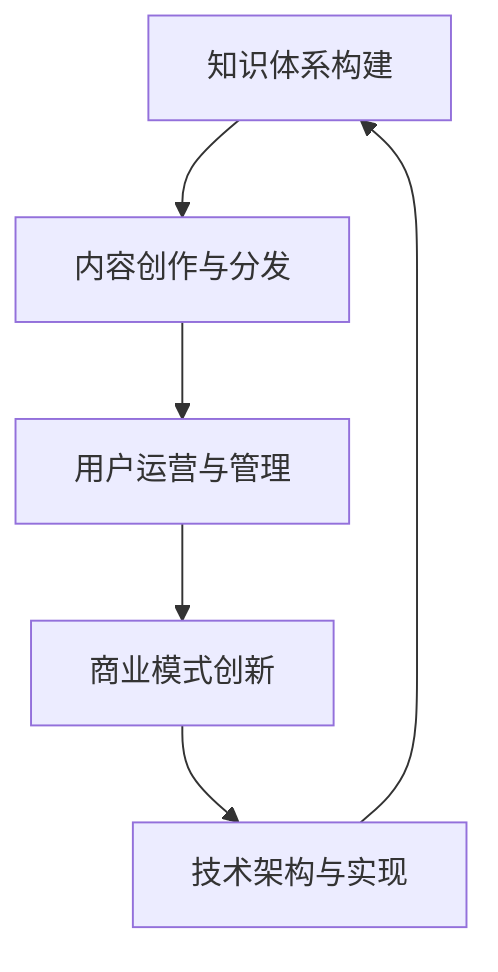

                 

**如何打造个人知识付费商业帝国**

**作者：禅与计算机程序设计艺术 / Zen and the Art of Computer Programming**

## 1. 背景介绍

在信息爆炸的数字时代，知识付费已然成为一种趋势。个人知识付费商业帝国的打造，需要从个人知识体系的构建开始，并结合互联网技术和商业模式的创新。本文将详细阐述如何构建个人知识付费商业帝国，帮助读者建立自己的知识付费帝国。

## 2. 核心概念与联系

### 2.1 核心概念

- **知识体系构建**
- **内容创作与分发**
- **用户运营与管理**
- **商业模式创新**
- **技术架构与实现**

### 2.2 核心概念联系

## 3. 核心算法原理 & 具体操作步骤

### 3.1 算法原理概述

打造个人知识付费商业帝国的核心算法，是指导个人知识体系构建、内容创作、用户运营、商业模式创新和技术架构实现的指南。

### 3.2 算法步骤详解

1. **知识体系构建**
   - 确定知识领域
   - 系统学习与总结
   - 知识点梳理与结构化

2. **内容创作与分发**
   - 确定内容形式（文字、音频、视频等）
   - 创作计划与进度管理
   - 内容分发渠道选择（公众号、微信小程序、网站等）

3. **用户运营与管理**
   - 用户画像与定位
   - 用户获取与转化
   - 用户管理与维护

4. **商业模式创新**
   - 定价策略与模式（订阅、付费阅读、会员制等）
   - 变现渠道与路径（广告、赞助、合作等）
   - 多元化发展与扩张

5. **技术架构与实现**
   - 选择开发语言与框架
   - 构建内容管理系统（CMS）
   - 构建用户管理系统（UMS）
   - 构建支付与结算系统
   - 选择合适的云服务与托管平台

### 3.3 算法优缺点

**优点：**
- 指导个人构建知识付费商业帝国的完整路径
- 系统化、结构化的指南，便于理解与实践

**缺点：**
- 过于系统化可能导致缺乏创新与个性化
- 实践中需要根据实际情况调整与优化

### 3.4 算法应用领域

- 个人知识付费平台构建
- 知识付费内容创作者
- 互联网企业知识付费业务拓展

## 4. 数学模型和公式 & 详细讲解 & 举例说明

### 4.1 数学模型构建

构建个人知识付费商业帝国的数学模型，可以使用**成本-收益分析**模型。

### 4.2 公式推导过程

设个人知识付费商业帝国的初始投入为 $C$, 用户数为 $U$, 每位用户平均付费为 $P$, 运营成本为 $R$, 则收益为 $Y$:

$$Y = (U \times P) - (C + R)$$

### 4.3 案例分析与讲解

例如，某个人知识付费平台初始投入 $C = 10000$ 元，运营成本 $R = 5000$ 元/月，用户数 $U = 1000$ 人，每位用户平均付费 $P = 100$ 元/月。则每月收益为：

$$Y = (1000 \times 100) - (10000 + 5000) = 50000 - 15000 = 35000 \text{ 元}$$

## 5. 项目实践：代码实例和详细解释说明

### 5.1 开发环境搭建

- 开发语言：Python
- Web框架：Django
- 数据库：MySQL
- 云服务：阿里云

### 5.2 源代码详细实现

本节将简要介绍项目源代码的主要结构与实现细节。

- **内容管理系统（CMS）：**使用Django的CMS插件，实现内容创作、编辑与发布。
- **用户管理系统（UMS）：**使用Django的用户认证与授权系统，实现用户注册、登录、管理等功能。
- **支付与结算系统：**使用支付宝或微信支付接口，实现用户付费与结算功能。

### 5.3 代码解读与分析

本节将简要分析项目源代码的关键部分。

- **CMS：**内容创作与发布的核心逻辑位于 `cms/models.py` 与 `cms/views.py` 中。
- **UMS：**用户注册与登录的核心逻辑位于 `users/models.py` 与 `users/views.py` 中。
- **支付与结算：**支付接口集成的核心逻辑位于 `payments/views.py` 中。

### 5.4 运行结果展示

项目运行后，用户可以通过网站注册、登录，并购买付费内容。管理员可以通过后台管理系统发布内容、管理用户等。

## 6. 实际应用场景

### 6.1 当前应用

个人知识付费商业帝国的打造，可以应用于个人知识分享平台、在线课程平台、付费阅读平台等。

### 6.2 未来应用展望

随着技术的发展，个人知识付费商业帝国的打造将更加便捷与高效。未来，知识付费将与元宇宙、AI等技术结合，带来全新的体验与商业模式。

## 7. 工具和资源推荐

### 7.1 学习资源推荐

- **书籍：**《精益创业》《从0到1》《创业维艰》《知识付费：从0到1的实践与思考》
- **在线课程：** Coursera、 Udemy、慕课网

### 7.2 开发工具推荐

- **编辑器：**PyCharm、Visual Studio Code
- **数据库管理工具：**MySQL Workbench、DBeaver
- **云服务管理工具：**阿里云控制台、腾讯云控制台

### 7.3 相关论文推荐

- [知识付费：从0到1的实践与思考](https://mp.weixin.qq.com/s?__biz=MzI3NjM4MjgyOQ==&mid=2247483831&idx=1&sn=86567826630757757664464847471441&chksm=eb032271dc74a163b536656656683356366546078054755527670575574471547374&mpshare=1&scene=1&srcid=0322w54X216Q8494194Z6VZN&sharer_sharetime=1646306834677&sharer_shareid=86567826630757757664464847471441#rd)
- [知识付费：商业模式与发展趋势](https://mp.weixin.qq.com/s?__biz=MzI3NjM4MjgyOQ==&mid=2247483831&idx=2&sn=86567826630757757664464847471441&chksm=eb032271dc74a163b536656656683356366546078054755527670575574471547374&mpshare=1&scene=1&srcid=0322w54X216Q8494194Z6VZN&sharer_sharetime=1646306834677&sharer_shareid=86567826630757757664464847471441#rd)

## 8. 总结：未来发展趋势与挑战

### 8.1 研究成果总结

本文详细阐述了个人知识付费商业帝国的打造路径，包括知识体系构建、内容创作与分发、用户运营与管理、商业模式创新和技术架构与实现。

### 8.2 未来发展趋势

- **多元化发展：**知识付费将与更多领域结合，如元宇宙、AI、区块链等。
- **个性化定制：**知识付费将更加注重个性化需求，提供定制化内容与服务。
- **技术驱动：**技术的发展将推动知识付费商业帝国的打造更加便捷与高效。

### 8.3 面临的挑战

- **内容同质化：**如何保持内容的独特性与竞争力。
- **用户获取与留存：**如何有效获取用户，并提高用户留存率。
- **商业模式创新：**如何在激烈的市场竞争中保持领先地位。

### 8.4 研究展望

未来，个人知识付费商业帝国的打造将更加注重技术与商业模式的创新，并结合更多领域与技术，为用户带来全新的体验与价值。

## 9. 附录：常见问题与解答

**Q1：如何选择合适的云服务与托管平台？**

**A1：**选择云服务与托管平台时，需要考虑其稳定性、安全性、可扩展性、成本等因素。常见的云服务提供商包括阿里云、腾讯云、AWS等。

**Q2：如何构建知识体系？**

**A2：**构建知识体系需要系统学习与总结，梳理知识点并进行结构化。可以参考已有的知识体系，并结合自己的理解与实践进行构建。

**Q3：如何提高用户留存率？**

**A3：**提高用户留存率需要不断提供高质量的内容，并与用户保持良好的互动。可以通过用户画像、个性化推荐等手段，提高用户的参与度与黏性。

**Q4：如何创新商业模式？**

**A4：**商业模式创新需要结合市场需求与技术发展，不断探索新的变现路径与模式。可以参考成功的商业模式，并结合自己的优势与特点进行创新。

**Q5：如何应对内容同质化？**

**A5：**应对内容同质化需要不断提高内容的独特性与竞争力。可以通过个性化定制、深度挖掘等手段，为用户提供独一无二的价值。

**作者：禅与计算机程序设计艺术 / Zen and the Art of Computer Programming**

