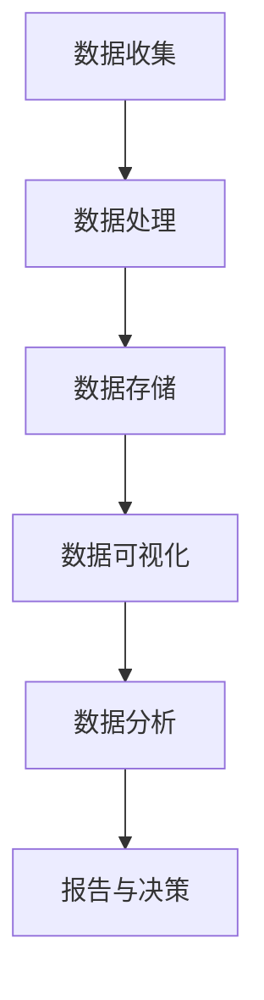

                 

## 1. 背景介绍

用户行为分析（Web Analytics）是一种评估和理解用户在网站或应用程序上活动的方法。它帮助我们理解用户的需求、偏好和行为模式，从而改进产品、提高用户体验和增加转化率。随着数字化转型的加速，用户行为分析变得越来越重要，因为它提供了宝贵的见解，帮助企业做出数据驱动的决策。

## 2. 核心概念与联系

### 2.1 关键概念

- **用户行为**：用户在网站或应用程序上执行的活动，如点击、滚动、搜索、购买等。
- **指标（Metrics）**：衡量用户行为的量化值，如访问量、跳出率、平均访问时长等。
- **维度（Dimensions）**：用于分类和过滤指标的属性，如设备类型、地区、渠道等。
- **转化（Conversion）**：用户执行的有价值的活动，如注册、购买或提交表单。

### 2.2 核心架构

用户行为分析通常遵循以下架构：



## 3. 核心算法原理 & 具体操作步骤

### 3.1 算法原理概述

用户行为分析的核心是数据收集、处理和分析。常用的算法包括：

- **A/B测试**：比较两个版本（A和B）的性能，以确定哪个版本表现更好。
- **回归分析**：确定两个或更多变量之间的关系。
- **聚类分析**：将用户分组，以便于研究和营销。

### 3.2 算法步骤详解

1. **数据收集**：使用日志文件、标签管理系统（如Google Analytics）或客户关系管理（CRM）系统收集用户行为数据。
2. **数据清洗**：处理缺失值、异常值和不一致的数据。
3. **数据转换**：将数据转换为合适的格式，以便于分析。
4. **数据建模**：使用选择的算法（如A/B测试、回归分析或聚类分析）对数据进行建模。
5. **结果解释**：解释模型的结果，得出结论。

### 3.3 算法优缺点

- **A/B测试**：优点是简单易行，缺点是需要大量数据才能得出有意义的结论。
- **回归分析**：优点是可以确定因果关系，缺点是需要大量数据和假设检验。
- **聚类分析**：优点是可以发现隐藏的模式，缺点是结果可能不直观，需要专业知识解释。

### 3.4 算法应用领域

- **网站优化**：改进网站设计和布局，提高转化率。
- **营销策略**：根据用户行为调整营销策略，提高投资回报率。
- **产品开发**：根据用户需求和偏好开发新产品或改进现有产品。

## 4. 数学模型和公式 & 详细讲解 & 举例说明

### 4.1 数学模型构建

用户行为分析的数学模型通常基于概率统计和线性代数。例如，回归分析的数学模型是：

$$Y = β_0 + β_1X_1 + β_2X_2 +... + β_nX_n + ε$$

其中，$Y$是因变量（预测变量），$X_1, X_2,..., X_n$是自变量（解释变量），$β_0, β_1,..., β_n$是回归系数，$\varepsilon$是误差项。

### 4.2 公式推导过程

回归分析的回归系数可以通过最小平方法推导出来。目标是最小化误差平方和：

$$\min \sum_{i=1}^{n} (Y_i - \hat{Y}_i)^2$$

其中，$Y_i$是实际值，$ \hat{Y}_i$是预测值。推导过程涉及到矩阵运算和线性代数。

### 4.3 案例分析与讲解

假设我们想要预测网站的跳出率（$Y$），并将其与两个自变量相关联：网站访问时长（$X_1$）和页面加载时间（$X_2$）。我们可以构建如下回归模型：

$$Y = β_0 + β_1X_1 + β_2X_2 + ε$$

通过收集数据并应用最小平方法，我们可以估计回归系数$β_0, β_1, β_2$。然后，我们可以使用这个模型预测跳出率，并根据结果做出决策。

## 5. 项目实践：代码实例和详细解释说明

### 5.1 开发环境搭建

我们将使用Python和其数据分析库（如Pandas、NumPy、Scikit-learn）来实现用户行为分析。我们需要安装这些库，并设置开发环境。

### 5.2 源代码详细实现

以下是一个简单的回归分析示例：

```python
import pandas as pd
from sklearn.linear_model import LinearRegression

# 加载数据
data = pd.read_csv('user_behavior.csv')

# 定义自变量和因变量
X = data[['visit_duration', 'load_time']]
Y = data['bounce_rate']

# 创建回归模型
model = LinearRegression()

# 拟合模型
model.fit(X, Y)

# 打印回归系数
print('Intercept:', model.intercept_)
print('Coefficients:', model.coef_)
```

### 5.3 代码解读与分析

我们首先加载用户行为数据，然后定义自变量和因变量。我们使用Scikit-learn库中的线性回归模型，并拟合模型。最后，我们打印回归系数。

### 5.4 运行结果展示

运行代码后，我们会得到回归系数$β_0, β_1, β_2$。我们可以使用这些系数预测跳出率，并根据结果做出决策。

## 6. 实际应用场景

### 6.1 网站优化

用户行为分析可以帮助我们改进网站设计和布局。例如，如果我们发现用户在特定页面上花费的时间很短，我们可以调整页面布局，以便更好地展示关键信息。

### 6.2 营销策略

用户行为分析可以帮助我们调整营销策略。例如，如果我们发现某个渠道的转化率很低，我们可以减少在这个渠道上的投入，并将资源转移到表现更好的渠道。

### 6.3 未来应用展望

未来，用户行为分析将越来越多地与人工智能和机器学习结合，以发现更复杂的模式和预测用户行为。此外，随着隐私保护法规的加强，匿名化和差异化数据处理将变得越来越重要。

## 7. 工具和资源推荐

### 7.1 学习资源推荐

- **书籍**："Web Analytics: An Hour a Day" by Avinash Kaushik
- **在线课程**：Coursera的"Digital Marketing Specialization"由University of Illinois提供

### 7.2 开发工具推荐

- **数据分析**：Python（Pandas、NumPy、Scikit-learn）、R（tidyverse包）
- **可视化**：Tableau、Power BI、Matplotlib、Seaborn
- **用户行为分析平台**：Google Analytics、Mixpanel、Hotjar

### 7.3 相关论文推荐

- "Web Usage Mining: Discovering and Mining Usage Patterns from Web Data" by Cooley et al.
- "A Survey of Web Analytics Research" by Tan et al.

## 8. 总结：未来发展趋势与挑战

### 8.1 研究成果总结

用户行为分析是一种强大的工具，可以帮助我们理解用户需求和偏好，从而改进产品和服务。它涉及到数据收集、处理和分析，通常使用回归分析、聚类分析和A/B测试等算法。

### 8.2 未来发展趋势

未来，用户行为分析将越来越多地与人工智能和机器学习结合，以发现更复杂的模式和预测用户行为。此外，随着隐私保护法规的加强，匿名化和差异化数据处理将变得越来越重要。

### 8.3 面临的挑战

用户行为分析面临的挑战包括数据质量问题、隐私保护和数据安全问题。此外，解释模型结果并做出决策也需要专业知识和判断。

### 8.4 研究展望

未来的研究将关注更复杂的模型和算法，以发现更深层次的用户行为模式。此外，研究将关注如何在保护隐私的同时提高数据分析的准确性。

## 9. 附录：常见问题与解答

**Q：用户行为分析需要什么技能？**

A：用户行为分析需要数据分析、统计学、编程（通常是Python或R）和可视化技能。此外，理解用户体验和营销原理也很有帮助。

**Q：用户行为分析的数据从哪里来？**

A：用户行为分析的数据通常来自网站日志文件、标签管理系统（如Google Analytics）或客户关系管理（CRM）系统。

**Q：用户行为分析的结果如何应用？**

A：用户行为分析的结果可以用于改进网站设计和布局、调整营销策略、开发新产品或改进现有产品。

---

作者：禅与计算机程序设计艺术 / Zen and the Art of Computer Programming

