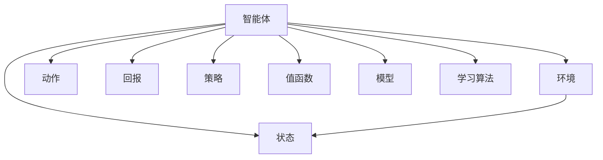

                 

**强化学习(Reinforcement Learning) - 原理与代码实例讲解**

**作者：禅与计算机程序设计艺术 / Zen and the Art of Computer Programming**

## 1. 背景介绍

强化学习（Reinforcement Learning, RL）是一种机器学习方法，它允许智能体（agent）在与环境（environment）交互的过程中学习一系列动作（actions），以最大化某种形式的回报（reward）。与监督学习和非监督学习不同，强化学习没有明确的监督信号，智能体必须通过试错来学习。

强化学习的起源可以追溯到1952年，阿瑟·塞缪尔（Arthur Samuel）首次使用了“机器学习”（machine learning）一词，并提出了强化学习的概念。自那时以来，强化学习在各种领域，如游戏、机器人控制、自动驾驶、自然语言处理等，取得了显著的成功。

## 2. 核心概念与联系

强化学习的核心概念包括智能体、环境、状态、动作、回报、策略、值函数、模型，以及学习算法。这些概念是相互关联的，构成了强化学习的框架。



### 2.1 智能体（Agent）

智能体是学习的主体，它感知环境，选择动作，并接收回报。智能体的目标是学习一系列动作，以最大化累积回报。

### 2.2 环境（Environment）

环境是智能体所处的世界，它根据智能体的动作产生状态转换和回报。环境可以是完全可观察的（fully observable），也可以是部分可观察的（partially observable）。

### 2.3 状态（State）、动作（Action）、回报（Reward）

状态是环境的当前情况，动作是智能体可以采取的行为，回报是环境给出的反馈，指示动作的好坏。

### 2.4 策略（Policy）

策略是智能体根据当前状态选择动作的规则。策略可以是确定性的（deterministic），也可以是随机的（stochastic）。

### 2.5 值函数（Value Function）

值函数评估给定策略下的状态或状态-动作对的好坏。状态值函数（state-value function）评估状态的好坏，动作值函数（action-value function）评估状态-动作对的好坏。

### 2.6 模型（Model）

模型描述环境的转移概率和回报。智能体可以使用模型预测环境的行为，从而规划动作序列。

### 2.7 学习算法（Learning Algorithm）

学习算法是智能体用来学习策略的方法。常见的学习算法包括动态规划（dynamic programming）、时序差分学习（temporal difference learning）、Q学习（Q-learning）、SARSA（State-Action-Reward-State-Action）等。

## 3. 核心算法原理 & 具体操作步骤

### 3.1 算法原理概述

强化学习算法的核心原理是通过试错学习。智能体通过尝试不同的动作，观察环境的反应，并根据回报调整策略，最终学习到最优策略。

### 3.2 算法步骤详解

强化学习算法的一般步骤如下：

1. 初始化智能体的策略和值函数。
2. 智能体感知环境的当前状态。
3. 根据当前状态和策略，智能体选择动作。
4. 环境根据智能体的动作产生下一个状态和回报。
5. 智能体更新策略和值函数，根据新的状态和回报调整学习。
6. 重复步骤2-5，直到智能体学习到最优策略。

### 3.3 算法优缺点

强化学习算法的优点包括：

- 可以学习到最优策略，无需人工设计。
- 可以处理连续的、高维的状态和动作空间。
- 可以处理不确定性和不完美信息。

缺点包括：

- 学习速度慢，需要大量的试错。
- 可能陷入局部最优解。
- 可能无法学习到最优策略，如果环境是非 Markov 的（non-Markovian）或非 stationary 的（non-stationary）。

### 3.4 算法应用领域

强化学习在各种领域都有应用，包括：

- 游戏：AlphaGo 使用强化学习击败了围棋世界冠军李世石。
- 机器人控制：强化学习可以学习到控制机器人动作的最优策略。
- 自动驾驶：强化学习可以学习到控制汽车的最优策略。
- 自然语言处理：强化学习可以学习到生成文本的最优策略。
- 股票交易：强化学习可以学习到买卖股票的最优策略。

## 4. 数学模型和公式 & 详细讲解 & 举例说明

### 4.1 数学模型构建

强化学习的数学模型包括环境模型和学习算法模型。

环境模型描述环境的转移概率和回报。给定当前状态 $s_t$ 和动作 $a_t$，下一个状态 $s_{t+1}$ 和回报 $r_{t+1}$ 服从分布 $P(s_{t+1}, r_{t+1} | s_t, a_t)$。

学习算法模型描述智能体的学习过程。给定当前状态 $s_t$ 和动作 $a_t$，智能体更新策略 $\pi$ 和值函数 $V$ 或 $Q$ 根据学习规则。

### 4.2 公式推导过程

强化学习的数学模型可以使用动态规划原理推导。给定环境模型，我们可以推导出最优策略和最优值函数。

最优策略 $\pi^*$ 是使期望回报最大化的策略，即 $\pi^*(s) = \arg\max_a \sum_{s',r} P(s',r|s,a) [r + \gamma V^*(s')]$，其中 $\gamma$ 是折扣因子。

最优值函数 $V^*(s)$ 是给定状态 $s$ 下的最优期望回报，即 $V^*(s) = \max_a \sum_{s',r} P(s',r|s,a) [r + \gamma V^*(s')]$。

### 4.3 案例分析与讲解

例如，考虑一个简单的环境，智能体需要学习到从起点到终点的最短路径。环境模型描述了从每个状态到每个邻居状态的转移概率和回报（距离）。智能体使用动态规划推导出最优值函数，然后根据最优值函数选择最短路径。

## 5. 项目实践：代码实例和详细解释说明

### 5.1 开发环境搭建

我们将使用 Python 和 Gym 环境来实现一个简单的强化学习算法。Gym 提供了各种环境，如 CartPole、MountainCar、LunarLander 等，我们可以在其中测试我们的算法。

### 5.2 源代码详细实现

以下是 Q 学习算法的 Python 实现：

```python
import numpy as np
import gym

# 定义 Q 学习参数
learning_rate = 0.1
discount_factor = 0.95
episodes = 1000

# 创建环境
env = gym.make('CartPole-v0')

# 初始化 Q 表
q_table = np.zeros((env.observation_space.n, env.action_space.n))

# 学习过程
for episode in range(episodes):
    state = env.reset()
    done = False
    while not done:
        action = np.argmax(q_table[state])
        next_state, reward, done, _ = env.step(action)
        old_value = q_table[state, action]
        next_max = np.max(q_table[next_state])
        new_value = (1 - learning_rate) * old_value + learning_rate * (reward + discount_factor * next_max)
        q_table[state, action] = new_value
        state = next_state

# 打印 Q 表
print(q_table)
```

### 5.3 代码解读与分析

这段代码实现了 Q 学习算法。它首先定义了 Q 学习参数，然后创建了 CartPole 环境。它初始化了 Q 表，然后进入学习循环。在每个episode中，它选择动作，根据环境的反馈更新 Q 表，然后转移到下一个状态。学习结束后，它打印出 Q 表。

### 5.4 运行结果展示

运行这段代码后，我们会得到一个 Q 表，它描述了每个状态-动作对的期望回报。我们可以使用这个 Q 表来选择最优动作，从而控制 CartPole 系统。

## 6. 实际应用场景

强化学习在各种实际应用场景中都有成功的应用，包括：

- **自动驾驶**：强化学习可以学习到控制汽车的最优策略，从而实现自动驾驶。
- **机器人控制**：强化学习可以学习到控制机器人动作的最优策略，从而实现机器人的自主控制。
- **游戏**：强化学习可以学习到玩游戏的最优策略，从而实现游戏的自动化。
- **自然语言处理**：强化学习可以学习到生成文本的最优策略，从而实现文本生成任务。

### 6.4 未来应用展望

未来，强化学习有望在更多领域取得成功，包括：

- **医疗保健**：强化学习可以学习到最优的治疗策略，从而改善病人的治疗效果。
- **能源管理**：强化学习可以学习到最优的能源管理策略，从而提高能源效率。
- **金融**：强化学习可以学习到最优的交易策略，从而提高交易收益。

## 7. 工具和资源推荐

### 7.1 学习资源推荐

- **书籍**："Reinforcement Learning: An Introduction" by Richard S. Sutton and Andrew G. Barto
- **在线课程**：Coursera 的 "Reinforcement Learning" 课程
- **博客**：[Distill.pub](https://distill.pub/) 上的强化学习文章

### 7.2 开发工具推荐

- **Gym**：一个开源的强化学习环境库。
- **Stable Baselines3**：一个开源的强化学习算法库。
- **TensorFlow Reinforcement Learning**：TensorFlow 的强化学习库。

### 7.3 相关论文推荐

- "Deep Reinforcement Learning Hands-On" by Maxim Lapan
- "Mastering Chess and Shogi by Self-Play with a General Reinforcement Learning Algorithm" by AlphaGo Zero

## 8. 总结：未来发展趋势与挑战

### 8.1 研究成果总结

强化学习在过去几十年取得了显著的进展，从简单的 Q 学习算法到深度强化学习，强化学习已经成功应用于各种领域。

### 8.2 未来发展趋势

未来，强化学习的发展趋势包括：

- **多智能体系统**：研究多智能体系统中的协作和竞争。
- **不确定性**：研究不确定性和不完美信息下的强化学习。
- **深度强化学习**：研究深度神经网络在强化学习中的应用。

### 8.3 面临的挑战

强化学习面临的挑战包括：

- **样本效率**：如何提高学习速度，减少试错次数。
- **一般化能力**：如何使强化学习算法在未见过的环境中表现良好。
- **解释性**：如何使强化学习算法更容易理解和解释。

### 8.4 研究展望

未来，强化学习的研究将继续关注样本效率、一般化能力和解释性等挑战。此外，强化学习与其他人工智能领域的结合，如计算机视觉和自然语言处理，也将是未来研究的热点。

## 9. 附录：常见问题与解答

**Q1：强化学习与监督学习有何不同？**

A1：强化学习没有明确的监督信号，智能体必须通过试错来学习。监督学习则有明确的监督信号，学习目标是预测这些信号。

**Q2：强化学习的学习速度慢是否可以改进？**

A2：是的，样本效率是强化学习的一个活跃研究领域。通过使用更智能的探索策略、更复杂的模型或更先进的算法，可以提高学习速度。

**Q3：强化学习可以应用于哪些领域？**

A3：强化学习可以应用于各种领域，包括游戏、机器人控制、自动驾驶、自然语言处理等。

**Q4：强化学习的未来发展趋势是什么？**

A4：未来，强化学习的发展趋势包括多智能体系统、不确定性、深度强化学习等方向。

**Q5：强化学习面临的挑战是什么？**

A5：强化学习面临的挑战包括样本效率、一般化能力、解释性等。

## 结束语

强化学习是一种强大的机器学习方法，它允许智能体在与环境交互的过程中学习一系列动作，以最大化某种形式的回报。强化学习在各种领域都有成功的应用，未来有望取得更大的进展。

