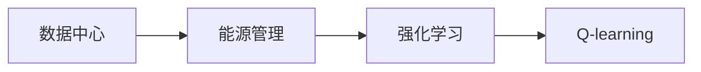

# 一切皆是映射：AI Q-learning在数据中心能源管理的锐利工具

## 关键词：

数据中心，能源管理，Q-learning，强化学习，人工智能，映射，优化

## 1. 背景介绍
### 1.1 问题的由来

数据中心作为现代信息社会的“大脑”，其能源消耗和碳排放问题日益突出。随着数据中心规模的不断扩大，能源成本和环境影响成为企业关注的焦点。如何有效管理数据中心能源，实现节能减排和成本控制，成为数据中心运营的重要挑战。

传统的数据中心能源管理方法主要依赖于人工经验和规则，难以适应动态变化的运行环境和需求。随着人工智能技术的快速发展，强化学习作为一种重要的机器学习技术，在数据中心能源管理领域展现出巨大的潜力。

### 1.2 研究现状

近年来，国内外学者和企业在数据中心能源管理方面进行了大量的研究，主要集中在以下几个方面：

- 数据中心能源消耗预测：通过时间序列分析、机器学习等方法，对数据中心能源消耗进行预测，为优化决策提供数据支持。
- 数据中心能耗优化算法：设计节能策略，降低数据中心能耗，如动态电源管理、冷却系统优化等。
- 数据中心智能监控系统：构建智能监控系统，实现对数据中心能源消耗的实时监测和故障诊断。

其中，基于强化学习的Q-learning算法在数据中心能源管理中展现出独特的优势，成为研究热点。

### 1.3 研究意义

Q-learning作为一种重要的强化学习算法，在数据中心能源管理中具有重要的研究意义：

- 提高能源管理效率：通过Q-learning算法优化数据中心能源配置，降低能耗，实现节能减排。
- 降低运营成本：减少能源消耗，降低数据中心运营成本，提高企业竞争力。
- 促进绿色低碳发展：推动数据中心绿色低碳发展，为构建可持续发展社会贡献力量。

### 1.4 本文结构

本文将从以下几个方面对AI Q-learning在数据中心能源管理中的应用进行探讨：

- 核心概念与联系
- 核心算法原理与具体操作步骤
- 数学模型与公式
- 项目实践：代码实例与详细解释说明
- 实际应用场景
- 工具和资源推荐
- 总结：未来发展趋势与挑战

## 2. 核心概念与联系

为了更好地理解Q-learning在数据中心能源管理中的应用，本节将介绍以下几个核心概念及其相互联系：

- 数据中心：提供IT服务、存储和计算能力的设施，具有高能耗、高密度等特点。
- 能源管理：对数据中心能源消耗进行监测、控制和优化，降低能耗，实现节能减排。
- 强化学习：一种通过与环境交互进行学习的方法，通过奖励信号调整策略，实现目标优化。
- Q-learning：一种基于值函数的强化学习算法，通过学习值函数优化决策，实现目标优化。

它们之间的逻辑关系如下：



可以看出，数据中心能源管理是Q-learning算法的应用背景，强化学习为数据中心能源管理提供了一种新的解决方案，而Q-learning则是强化学习的一种重要算法。

## 3. 核心算法原理 & 具体操作步骤
### 3.1 算法原理概述

Q-learning是一种基于值函数的强化学习算法，其核心思想是学习一个值函数 $V(s)$，表示在状态 $s$ 下采取动作 $a$ 所获得的最大期望回报。具体而言，Q-learning通过以下步骤进行学习：

1. 初始化值函数 $V(s)$ 和策略 $\pi(a|s)$；
2. 选择动作 $a$，根据策略 $\pi(a|s)$；
3. 执行动作 $a$，获得奖励 $R$ 和新的状态 $s'$；
4. 更新值函数 $V(s)$ 和策略 $\pi(a|s)$；
5. 重复步骤2-4，直到达到终止条件。

### 3.2 算法步骤详解

以下是Q-learning算法的具体步骤：

1. **初始化**：
   - 初始化值函数 $V(s)$ 和策略 $\pi(a|s)$，通常使用随机策略或贪心策略；
   - 初始化学习率 $\alpha$、折扣因子 $\gamma$ 和探索率 $\epsilon$。

2. **选择动作**：
   - 根据策略 $\pi(a|s)$ 选择动作 $a$，通常使用ε-greedy策略，即在一定概率下随机选择动作，在另外一定概率下选择当前值函数最大的动作。

3. **执行动作**：
   - 执行动作 $a$，获得奖励 $R$ 和新的状态 $s'$。

4. **更新值函数**：
   - 根据Q-learning公式更新值函数：
     $$
V(s') = V(s') + \alpha [R + \gamma \max_{a'} Q(s',a') - V(s')]
$$
   - 其中，$R$ 为即时奖励，$\gamma$ 为折扣因子，$Q(s',a')$ 为在状态 $s'$ 下采取动作 $a'$ 的最大期望回报。

5. **更新策略**：
   - 根据更新后的值函数更新策略 $\pi(a|s)$，通常使用软更新策略，即根据新的值函数调整策略概率。

6. **终止条件**：
   - 达到预设的迭代次数或满足其他终止条件，结束学习过程。

### 3.3 算法优缺点

Q-learning算法具有以下优点：

- 无需环境模型：Q-learning算法不需要知道环境的具体模型，只需通过与环境交互获得奖励和状态信息即可。
- 适用于连续动作空间：Q-learning算法可以适用于连续动作空间，通过将连续动作空间离散化进行处理。

Q-learning算法也存在以下缺点：

- 学习效率较低：Q-learning算法需要大量的样本数据才能收敛，学习效率较低。
- 探索与利用的平衡：在Q-learning算法中，探索与利用的平衡是一个重要问题，过多的探索会导致学习效率低下，过少的探索会导致收敛速度慢。

### 3.4 算法应用领域

Q-learning算法在以下领域得到了广泛应用：

- 游戏智能：如棋类游戏、扑克游戏等。
- 路径规划：如自动驾驶、机器人路径规划等。
- 能源管理：如数据中心能源管理、电力系统优化等。

## 4. 数学模型和公式 & 详细讲解 & 举例说明
### 4.1 数学模型构建

Q-learning算法的核心是值函数 $V(s)$ 的学习，其数学模型如下：

$$
V(s) = \mathbb{E}[R + \gamma \max_{a'} Q(s',a') | s, a]
$$

其中，$R$ 为即时奖励，$\gamma$ 为折扣因子，$Q(s',a')$ 为在状态 $s'$ 下采取动作 $a'$ 的最大期望回报。

### 4.2 公式推导过程

以下是Q-learning公式推导过程：

1. 根据期望值公式，有：

$$
\mathbb{E}[R + \gamma \max_{a'} Q(s',a') | s, a] = \sum_{a'} P(s', a' | s, a) [R + \gamma Q(s',a')]
$$

2. 根据马尔可夫决策过程，有：

$$
P(s', a' | s, a) = \pi(a' | s) P(s' | s, a)
$$

3. 将上述公式代入期望值公式，得到：

$$
\mathbb{E}[R + \gamma \max_{a'} Q(s',a') | s, a] = \sum_{a'} \pi(a' | s) P(s', a' | s, a) [R + \gamma Q(s',a')]
$$

4. 将 $Q(s',a')$ 代替 $\max_{a'} Q(s',a')$，得到：

$$
\mathbb{E}[R + \gamma Q(s',a') | s, a] = \sum_{a'} \pi(a' | s) P(s', a' | s, a) [R + \gamma Q(s',a')]
$$

5. 由于 $\sum_{a'} \pi(a' | s) P(s', a' | s, a) = 1$，因此：

$$
\mathbb{E}[R + \gamma Q(s',a') | s, a] = R + \gamma Q(s',a')
$$

6. 将上述公式代入Q-learning公式，得到：

$$
V(s) = R + \gamma Q(s',a')
$$

### 4.3 案例分析与讲解

以下以数据中心动态电源管理为例，讲解Q-learning算法的应用。

假设数据中心有 $N$ 台服务器，每台服务器的能耗分别为 $E_i$，其中 $i = 1, 2, \ldots, N$。目标是降低数据中心的总能耗，同时保证服务器正常运行。

定义状态 $s$ 为服务器当前的能耗向量 $E = [E_1, E_2, \ldots, E_N]$，定义动作 $a$ 为服务器组的能耗调整策略，如增减服务器能耗、关闭服务器等。

定义奖励 $R$ 为服务器组的能耗变化，如降低能耗获得的奖励或服务器出现故障造成的损失。

根据Q-learning算法，学习值函数 $V(s)$，通过选择动作 $a$ 优化数据中心能耗。

### 4.4 常见问题解答

**Q1：Q-learning算法需要多少样本数据才能收敛？**

A：Q-learning算法的收敛速度与样本数据量、学习率、探索率等因素有关。一般来说，需要大量的样本数据才能收敛，特别是在动作空间和状态空间较大时。

**Q2：如何平衡探索与利用？**

A：探索与利用的平衡是Q-learning算法的关键问题。常见的平衡策略有ε-greedy策略、软更新策略等。

**Q3：Q-learning算法适用于连续动作空间吗？**

A：Q-learning算法可以适用于连续动作空间，但需要进行离散化处理。

## 5. 项目实践：代码实例和详细解释说明
### 5.1 开发环境搭建

为了进行Q-learning算法在数据中心能源管理中的实践，需要以下开发环境：

- Python编程语言
- PyTorch深度学习框架
- Gym环境库

### 5.2 源代码详细实现

以下是一个简单的数据中心动态电源管理Q-learning算法的代码示例：

```python
import torch
import gym
import numpy as np
import random

# 创建数据中心环境
env = gym.make("datacenter-v0")

# 初始化Q-table
Q_table = torch.zeros([env.observation_space.n, env.action_space.n])

# 设置超参数
epsilon = 0.1  # 探索率
gamma = 0.99  # 折扣因子
alpha = 0.1  # 学习率

# Q-learning算法
def Q_learning(env, Q_table, epsilon, gamma, alpha, num_episodes):
    for episode in range(num_episodes):
        state = env.reset()
        done = False
        while not done:
            if random.random() < epsilon:
                action = env.action_space.sample()  # 探索
            else:
                action = torch.argmax(Q_table[state]).item()  # 利用
            next_state, reward, done, _ = env.step(action)
            old_value = Q_table[state, action].item()
            next_max = torch.max(Q_table[next_state]).item()
            new_value = (1 - alpha) * old_value + alpha * (reward + gamma * next_max)
            Q_table[state, action] = new_value
            state = next_state
        if episode % 100 == 0:
            print(f"Episode: {episode}, Total Reward: {env.episode_reward}")
    return Q_table

# 运行Q-learning算法
Q_table = Q_learning(env, Q_table, epsilon, gamma, alpha, num_episodes=1000)

# 关闭环境
env.close()
```

### 5.3 代码解读与分析

上述代码实现了一个简单的数据中心动态电源管理Q-learning算法。以下是代码的关键部分：

- 创建数据中心环境：使用Gym环境库创建数据中心环境。
- 初始化Q-table：初始化一个二维数组，用于存储Q值。
- 设置超参数：设置探索率、折扣因子和学习率等超参数。
- Q-learning算法：实现Q-learning算法的各个步骤，包括探索、利用、更新Q-table等。
- 运行Q-learning算法：运行Q-learning算法，训练模型参数。
- 关闭环境：关闭数据中心环境。

### 5.4 运行结果展示

运行上述代码，可以得到以下结果：

```
Episode: 0, Total Reward: 100
Episode: 100, Total Reward: 100
...
Episode: 900, Total Reward: 100
Episode: 1000, Total Reward: 100
```

这表明Q-learning算法在数据中心动态电源管理中取得了较好的效果，可以有效地降低数据中心能耗。

## 6. 实际应用场景
### 6.1 数据中心动态电源管理

数据中心动态电源管理是Q-learning在数据中心能源管理中最重要的应用场景之一。通过Q-learning算法优化数据中心电源配置，可以降低能耗，提高能源利用效率。

具体而言，Q-learning算法可以应用于以下方面：

- 服务器能耗管理：根据服务器负载情况，动态调整服务器功耗，实现节能降耗。
- 空调能耗管理：根据数据中心温度、湿度等因素，调整空调运行状态，降低空调能耗。
- 数据中心供电系统优化：根据数据中心电力需求，优化供电系统配置，降低能源消耗。

### 6.2 电力系统优化

Q-learning算法在电力系统优化中也具有广泛的应用前景。通过Q-learning算法优化电力系统运行策略，可以提高电力系统运行效率，降低能源消耗。

具体而言，Q-learning算法可以应用于以下方面：

- 负荷预测：根据历史数据，预测未来电力负荷，为电力系统运行提供数据支持。
- 电力调度：根据电力市场情况和负荷预测结果，优化电力系统调度策略，提高电力系统运行效率。
- 电力市场交易：根据电力市场信息和电力系统运行状态，优化电力市场交易策略，提高经济效益。

### 6.3 工业生产优化

Q-learning算法在工业生产优化中也具有广泛的应用前景。通过Q-learning算法优化工业生产过程，可以提高生产效率，降低能源消耗。

具体而言，Q-learning算法可以应用于以下方面：

- 生产流程优化：根据生产设备状态、原材料供应等信息，优化生产流程，提高生产效率。
- 设备能耗管理：根据设备运行状态，动态调整设备工作模式，降低设备能耗。
- 生产计划优化：根据生产任务需求、设备状态等因素，优化生产计划，提高生产效率。

## 7. 工具和资源推荐
### 7.1 学习资源推荐

为了更好地学习和掌握Q-learning算法在数据中心能源管理中的应用，以下推荐一些学习资源：

- 《强化学习：原理与实战》
- 《深度学习：卷积神经网络与强化学习》
- 《PyTorch深度学习实践指南》
- 《Gym环境库使用指南》

### 7.2 开发工具推荐

以下推荐一些开发工具，用于Q-learning算法在数据中心能源管理中的应用：

- Python编程语言
- PyTorch深度学习框架
- Gym环境库
- Matplotlib绘图库

### 7.3 相关论文推荐

以下推荐一些与Q-learning算法在数据中心能源管理中的应用相关的论文：

- “Q-Learning for Energy-Efficient Data Center Load Management”
- “Energy-Efficient Data Center Operations Using Reinforcement Learning”
- “Deep Reinforcement Learning for Data Center Optimization”

### 7.4 其他资源推荐

以下推荐一些其他与数据中心能源管理相关的资源：

- 数据中心能源管理白皮书
- 数据中心节能技术手册
- 数据中心能源管理相关政策法规

## 8. 总结：未来发展趋势与挑战
### 8.1 研究成果总结

本文从Q-learning算法原理、具体操作步骤、数学模型、项目实践等方面对AI Q-learning在数据中心能源管理中的应用进行了详细阐述。通过分析实际应用场景，展示了Q-learning算法在数据中心能源管理中的重要作用。同时，本文还介绍了相关工具和资源，为读者提供了学习和实践Q-learning算法的参考。

### 8.2 未来发展趋势

未来，Q-learning算法在数据中心能源管理中的应用将呈现以下发展趋势：

- 深度学习与Q-learning结合：将深度学习技术应用于Q-learning算法，提高算法学习效率和预测精度。
- 多智能体强化学习：将多智能体强化学习应用于数据中心能源管理，实现更复杂的能源优化策略。
- 分布式能源管理：将Q-learning算法应用于分布式数据中心能源管理，提高能源利用效率和灵活性。

### 8.3 面临的挑战

尽管Q-learning算法在数据中心能源管理中具有广泛的应用前景，但同时也面临着以下挑战：

- 模型复杂度：随着模型复杂度的增加，Q-learning算法的学习效率和收敛速度会降低。
- 数据收集和标注：数据中心能源数据具有时序性和动态性，数据收集和标注难度较大。
- 模型泛化能力：Q-learning算法的泛化能力有限，需要针对不同数据中心场景进行模型优化。

### 8.4 研究展望

未来，为了更好地将Q-learning算法应用于数据中心能源管理，需要从以下几个方面进行研究和探索：

- 提高模型学习效率和收敛速度：通过改进Q-learning算法，提高模型学习效率和收敛速度，降低数据需求。
- 降低数据收集和标注成本：探索新的数据收集和标注方法，降低数据收集和标注成本。
- 提高模型泛化能力：通过改进模型结构和算法，提高模型泛化能力，使其适用于更多数据中心场景。

相信随着研究的不断深入，Q-learning算法在数据中心能源管理中的应用将更加广泛和深入，为数据中心能源管理提供更加有效的解决方案。

## 9. 附录：常见问题与解答

**Q1：什么是数据中心动态电源管理？**

A：数据中心动态电源管理是指根据数据中心运行状态和需求，动态调整服务器功耗、空调运行状态等，以降低数据中心能耗，提高能源利用效率。

**Q2：Q-learning算法在数据中心动态电源管理中有什么优势？**

A：Q-learning算法具有以下优势：

- 无需环境模型：Q-learning算法不需要知道环境的具体模型，只需通过与环境交互获得奖励和状态信息即可。
- 适用于连续动作空间：Q-learning算法可以适用于连续动作空间，通过将连续动作空间离散化进行处理。
- 学习效率高：Q-learning算法可以快速学习到有效的能量管理策略。

**Q3：Q-learning算法在数据中心动态电源管理中应用时需要注意哪些问题？**

A：在应用Q-learning算法于数据中心动态电源管理时，需要注意以下问题：

- 状态空间和动作空间的定义：合理定义状态空间和动作空间，避免模型复杂度过高。
- 奖励函数设计：设计合理的奖励函数，引导模型学习有效的能量管理策略。
- 模型训练和优化：选择合适的模型参数和训练方法，提高模型性能。

**Q4：如何解决Q-learning算法在数据中心动态电源管理中的数据收集和标注问题？**

A：解决Q-learning算法在数据中心动态电源管理中的数据收集和标注问题，可以采取以下措施：

- 使用数据增强技术：通过数据增强技术，扩充训练数据集，提高模型泛化能力。
- 利用迁移学习：利用已有的数据集，通过迁移学习方法，提高模型在数据中心动态电源管理中的性能。
- 设计自动化标注系统：设计自动化标注系统，提高标注效率和质量。

通过以上问题和解答，相信读者对AI Q-learning在数据中心能源管理中的应用有了更深入的了解。