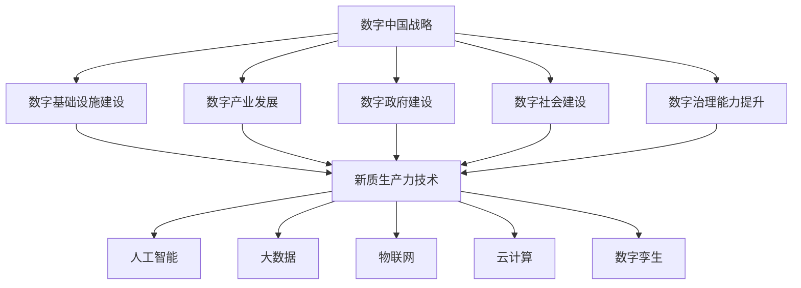

                 

数字中国、新质生产力、人工智能、大数据、物联网、云计算、数字孪生、数字化转型

## 1. 背景介绍

随着信息技术的飞速发展，数字化转型已经成为各国竞争的关键。中国政府提出的“数字中国”战略，旨在推动我国从制造大国向制造强国转变，实现高质量发展。本文将探讨数字中国战略与新质生产力的结合点，重点分析人工智能、大数据、物联网、云计算、数字孪生等技术在数字中国战略中的作用，并提供相关项目实践和工具资源推荐。

## 2. 核心概念与联系

### 2.1 数字中国战略

数字中国战略是指以信息化带动工业化，以工业化促进信息化，推动我国从制造大国向制造强国转变的战略。它包括数字基础设施建设、数字产业发展、数字政府建设、数字社会建设和数字治理能力提升等方面。

### 2.2 新质生产力

新质生产力是指以信息技术为核心的新型生产力，包括人工智能、大数据、物联网、云计算等技术。这些技术的结合，可以创造出新的生产力形态，推动经济社会发展。

### 2.3 核心概念联系

数字中国战略与新质生产力的结合点，体现在新质生产力技术在数字中国战略中的应用。新质生产力技术可以为数字中国战略提供强大的支撑，推动数字基础设施建设、数字产业发展、数字政府建设、数字社会建设和数字治理能力提升。



## 3. 核心算法原理 & 具体操作步骤

### 3.1 算法原理概述

新质生产力技术涉及多种算法，如机器学习算法、数据挖掘算法、物联网协议、云计算架构等。本节将重点介绍人工智能和大数据的核心算法原理。

### 3.2 算法步骤详解

#### 3.2.1 人工智能算法

人工智能算法包括监督学习、无监督学习和强化学习等类型。以监督学习为例，其步骤如下：

1. 数据收集：收集包含特征和标签的数据集。
2. 数据预处理：清洗数据，处理缺失值，进行特征工程。
3. 模型选择：选择适合问题的算法，如线性回归、决策树、支持向量机等。
4. 模型训练：使用训练集训练模型，调整模型参数。
5. 模型评估：使用验证集评估模型性能，调整模型参数。
6. 模型预测：使用测试集评估模型性能，进行预测。

#### 3.2.2 大数据算法

大数据算法包括数据挖掘、聚类、关联规则等。以Apriori算法为例，其步骤如下：

1. 数据预处理：清洗数据，处理缺失值，进行数据转换。
2. 频繁项集挖掘：设置最小支持度，挖掘频繁项集。
3. 关联规则生成：生成关联规则，设置最小置信度。
4. 关联规则评估：评估关联规则，剪枝关联规则。

### 3.3 算法优缺点

#### 3.3.1 人工智能算法优缺点

优点：

* 可以从数据中学习，自动提取特征。
* 可以处理复杂的非线性关系。
* 可以适应新数据，进行预测和决策。

缺点：

* 训练数据要求量大，质量高。
* 算法复杂，计算资源要求高。
* 结果解释性差，缺乏可解释性。

#### 3.3.2 大数据算法优缺点

优点：

* 可以处理大规模数据。
* 可以发现数据中的隐藏模式和关系。
* 可以支持决策和预测。

缺点：

* 计算资源要求高。
* 数据质量要求高。
* 结果解释性差，缺乏可解释性。

### 3.4 算法应用领域

人工智能和大数据算法在数字中国战略中的应用领域包括：

* 智能制造：用于质量检测、预测维护、柔性生产等。
* 智慧城市：用于交通管理、环境监测、公共服务等。
* 智慧农业：用于病虫害监测、精准灌溉、智能收割等。
* 智慧医疗：用于疾病诊断、药物研发、远程医疗等。
* 智慧金融：用于风险评估、信用评级、反欺诈等。

## 4. 数学模型和公式 & 详细讲解 & 举例说明

### 4.1 数学模型构建

数学模型是描述系统行为的数学表示。例如，线性回归模型可以表示为：

$$y = \beta_0 + \beta_1x_1 + \beta_2x_2 + \ldots + \beta_nx_n + \epsilon$$

其中，$y$是目标变量，$x_1, x_2, \ldots, x_n$是特征变量，$\beta_0, \beta_1, \ldots, \beta_n$是模型参数，$\epsilon$是误差项。

### 4.2 公式推导过程

以线性回归模型为例，其参数可以通过最小二乘法推导：

$$\hat{\beta} = (X^TX)^{-1}X^Ty$$

其中，$X$是特征矩阵，$y$是目标向量，$\hat{\beta}$是估计参数向量。

### 4.3 案例分析与讲解

例如，在智能制造领域，可以使用线性回归模型预测设备故障。特征变量可以选择设备运行参数，如温度、压力、振动等。目标变量是故障标签，即故障或无故障。通过收集数据，构建模型，训练模型，可以预测设备故障的可能性，实现预测维护。

## 5. 项目实践：代码实例和详细解释说明

### 5.1 开发环境搭建

本项目实践使用Python语言，开发环境包括：

* Python 3.8
* Jupyter Notebook
* Pandas
* NumPy
* Scikit-learn
* Matplotlib

### 5.2 源代码详细实现

以下是线性回归模型的Python实现代码：

```python
import numpy as np
import pandas as pd
from sklearn.model_selection import train_test_split
from sklearn.linear_model import LinearRegression
from sklearn.metrics import mean_squared_error

# 加载数据
data = pd.read_csv('data.csv')

# 特征变量和目标变量
X = data[['feature1', 'feature2', 'feature3']]
y = data['target']

# 数据分割
X_train, X_test, y_train, y_test = train_test_split(X, y, test_size=0.2, random_state=42)

# 模型训练
model = LinearRegression()
model.fit(X_train, y_train)

# 模型预测
y_pred = model.predict(X_test)

# 模型评估
mse = mean_squared_error(y_test, y_pred)
print(f'Mean Squared Error: {mse}')
```

### 5.3 代码解读与分析

代码首先加载数据，然后将特征变量和目标变量分割。使用训练集训练模型，并使用测试集进行预测。最后，使用均方误差评估模型性能。

### 5.4 运行结果展示

运行结果将显示均方误差，表示模型的预测误差。均方误差越小，表示模型性能越好。

## 6. 实际应用场景

### 6.1 数字政府建设

数字政府建设可以应用人工智能和大数据技术，实现智能化管理和决策。例如，智能化城市管理可以通过物联网收集数据，使用大数据算法发现隐藏模式，使用人工智能算法进行预测和决策。

### 6.2 数字产业发展

数字产业发展可以应用人工智能和大数据技术，实现智能化制造和服务。例如，智能制造可以通过物联网收集数据，使用大数据算法发现隐藏模式，使用人工智能算法进行预测和决策。智能服务可以通过自然语言处理技术实现智能客服，通过推荐算法实现个性化推荐。

### 6.3 数字社会建设

数字社会建设可以应用人工智能和大数据技术，实现智能化服务和管理。例如，智能化医疗可以通过物联网收集数据，使用大数据算法发现隐藏模式，使用人工智能算法进行疾病诊断和药物研发。智能化教育可以通过自然语言处理技术实现智能辅导，通过推荐算法实现个性化学习。

### 6.4 未来应用展望

未来，人工智能和大数据技术将更加广泛地应用于数字中国战略。例如，数字孪生技术可以实现虚拟仿真，推动智能制造和智慧城市发展。边缘计算技术可以实现低时延高带宽的数据处理，推动物联网和智能交通发展。量子计算技术可以实现超高速数据处理，推动大数据和人工智能发展。

## 7. 工具和资源推荐

### 7.1 学习资源推荐

* 书籍：《人工智能：一种现代方法》作者：斯图尔特·罗素、彼得·诺维格
* 课程：《机器学习》作者：Andrew Ng（ Coursera）
* 课程：《大数据分析》作者：Jeff Smith（Coursera）

### 7.2 开发工具推荐

* Python：数据分析和机器学习开发语言。
* TensorFlow：深度学习开发框架。
* Apache Spark：大数据处理框架。
* Jupyter Notebook：数据分析和机器学习开发环境。

### 7.3 相关论文推荐

* 论文：《End-to-End Deep Learning for Self-Driving Cars》作者：N. Karpathy、T. Chen、C. Fei-Fei
* 论文：《Deep Residual Learning for Image Recognition》作者：K. He、X. Zhang、S. Ren、J. Sun
* 论文：《Distributed Deep Learning on Apache Spark》作者：J. Chen、J. Zhang、J. Liu、J. Han

## 8. 总结：未来发展趋势与挑战

### 8.1 研究成果总结

本文介绍了数字中国战略与新质生产力的结合点，重点分析了人工智能、大数据、物联网、云计算、数字孪生等技术在数字中国战略中的作用。通过项目实践，展示了这些技术的应用。通过工具和资源推荐，提供了学习和开发的路径。

### 8.2 未来发展趋势

未来，数字中国战略将继续推进，新质生产力技术将不断发展。人工智能、大数据、物联网、云计算、数字孪生等技术将更加广泛地应用于各个领域，推动经济社会发展。此外，量子计算、边缘计算、区块链等新兴技术也将为数字中国战略提供新的动力。

### 8.3 面临的挑战

然而，数字中国战略和新质生产力技术的发展也面临着挑战。例如，数据安全和隐私保护问题，算法偏见和可解释性问题，技术和人才短缺问题等。这些挑战需要通过政策、技术和教育等手段来解决。

### 8.4 研究展望

未来的研究方向包括：

* 研究新兴技术在数字中国战略中的应用，如量子计算、边缘计算、区块链等。
* 研究人工智能和大数据技术的可解释性和偏见问题，提高技术的可信度和公平性。
* 研究数据安全和隐私保护技术，提高数据处理的安全性和合法性。
* 研究技术和人才短缺问题，推动技术和人才培养，提高数字中国战略的可持续性。

## 9. 附录：常见问题与解答

**Q1：数字中国战略与新质生产力有什么关系？**

A1：数字中国战略需要新质生产力技术的支撑，新质生产力技术可以为数字中国战略提供强大的动力。二者的结合点在于新质生产力技术在数字中国战略中的应用。

**Q2：人工智能和大数据有什么区别？**

A2：人工智能和大数据都是新质生产力技术，但二者侧重点不同。人工智能侧重于从数据中学习，进行预测和决策。大数据侧重于处理大规模数据，发现隐藏模式和关系。

**Q3：数字孪生技术有什么应用？**

A3：数字孪生技术可以实现虚拟仿真，推动智能制造和智慧城市发展。例如，可以通过数字孪生技术模拟城市交通，优化交通路线。

**Q4：未来数字中国战略的发展方向是什么？**

A4：未来数字中国战略的发展方向包括推动新兴技术应用，提高技术和人才培养，加强数据安全和隐私保护，提高技术的可信度和公平性。

**Q5：数字中国战略面临哪些挑战？**

A5：数字中国战略面临的挑战包括数据安全和隐私保护问题，算法偏见和可解释性问题，技术和人才短缺问题等。

## 作者：禅与计算机程序设计艺术 / Zen and the Art of Computer Programming

