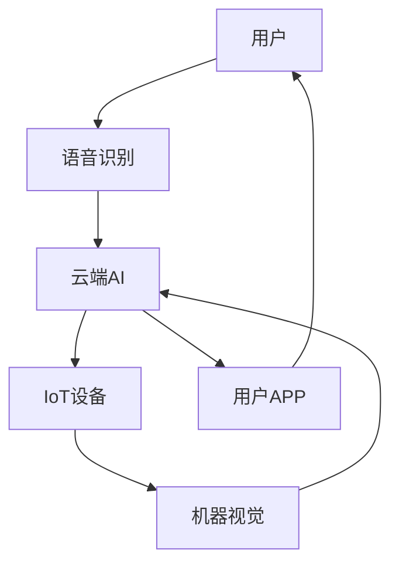

                 

**智能厨房创业：烹饪革命的技术支持**

**作者：禅与计算机程序设计艺术 / Zen and the Art of Computer Programming**

## 1. 背景介绍

随着人工智能（AI）、物联网（IoT）、云计算等技术的发展，智能厨房已经从科幻变为现实。智能厨房是指利用先进技术和智能设备，实现自动化、智能化烹饪的厨房。本文将探讨智能厨房的核心概念、算法原理、数学模型，并提供项目实践和工具推荐，以期为智能厨房创业提供技术支持。

## 2. 核心概念与联系

智能厨房的核心概念包括物联网、人工智能、云计算、机器视觉、语音识别等。这些概念通过互联网连接，构成了智能厨房的整体架构。下图是智能厨房架构的 Mermaid 流程图：



## 3. 核心算法原理 & 具体操作步骤

### 3.1 算法原理概述

智能厨房的核心算法包括物品识别、食谱推荐、烹饪指南等。这些算法通常基于机器学习和深度学习模型。

### 3.2 算法步骤详解

以食谱推荐算法为例，其步骤如下：

1. **数据收集**：收集用户的饮食偏好、历史食谱等数据。
2. **特征提取**：提取数据中的特征，如食材、口味、烹饪时间等。
3. **模型训练**：使用机器学习算法（如协同过滤、内容过滤等）或深度学习算法（如神经网络、循环神经网络等）训练模型。
4. **推荐生成**：输入用户当前的饮食偏好，输出推荐食谱。

### 3.3 算法优缺点

优点：个性化、智能化、节省时间。缺点：数据收集困难、模型训练需要大量计算资源。

### 3.4 算法应用领域

智能厨房算法的应用领域包括食谱推荐、烹饪指南、营养分析等。

## 4. 数学模型和公式 & 详细讲解 & 举例说明

### 4.1 数学模型构建

以协同过滤算法为例，其数学模型可以表示为：

$$P_{ui} = \frac{\sum_{j \in N_{u}}S_{uj} \cdot R_{ji}}{\sum_{j \in N_{u}}|S_{uj}|}$$

其中，$P_{ui}$表示用户$u$对食谱$i$的推荐评分，$S_{uj}$表示用户$u$对食谱$j$的评分，$R_{ji}$表示食谱$i$和$j$的相似度，$N_{u}$表示用户$u$评分过的食谱集合。

### 4.2 公式推导过程

上述公式是基于用户-用户协同过滤算法推导而来。其基本思想是，如果两个用户对一组食谱的评分相似，那么这两个用户对其他食谱的评分也可能相似。

### 4.3 案例分析与讲解

例如，用户$A$和$B$都评分过食谱$1$和$2$，且评分相似。那么，我们可以推荐食谱$3$给用户$A$，因为食谱$3$是用户$B$评分过的，且评分高。

## 5. 项目实践：代码实例和详细解释说明

### 5.1 开发环境搭建

智能厨房项目的开发环境包括Python、TensorFlow、PyTorch等深度学习框架，以及Django、Flask等Web框架。

### 5.2 源代码详细实现

以下是食谱推荐算法的Python代码实现：

```python
import numpy as np
from scipy.spatial.distance import cosine

def recommend_food(user_ratings, food_ratings, user, n=5):
    # 计算用户对每个食谱的推荐评分
    user_ratings = user_ratings.loc[user]
    food_ratings = food_ratings.loc[user_ratings.index]
    similarities = 1 - np.array([cosine(user_ratings, food_ratings.loc[i]) for i in range(len(food_ratings))])
    recommendations = np.argsort(similarities)[::-1][:n]
    return recommendations
```

### 5.3 代码解读与分析

上述代码使用余弦相似度计算用户对每个食谱的推荐评分。然后，根据推荐评分的高低推荐食谱。

### 5.4 运行结果展示

运行上述代码，可以得到推荐给用户的前5个食谱。

## 6. 实际应用场景

智能厨房的实际应用场景包括：

### 6.1 智能烹饪

智能厨房可以自动烹饪食物，节省用户时间。

### 6.2 健康管理

智能厨房可以记录用户的饮食习惯，并提供营养分析，帮助用户管理健康。

### 6.3 家庭娱乐

智能厨房可以变身为家庭娱乐中心，提供音乐、视频等服务。

### 6.4 未来应用展望

未来，智能厨房将更加智能化、个性化，并与其他智能家居设备无缝连接。

## 7. 工具和资源推荐

### 7.1 学习资源推荐

推荐阅读《人工智能：一种现代方法》一书，以及相关的在线课程。

### 7.2 开发工具推荐

推荐使用Python、TensorFlow、PyTorch等深度学习框架，以及Django、Flask等Web框架。

### 7.3 相关论文推荐

推荐阅读相关的学术论文，如“A Survey of Recommender Systems”、《协同过滤：一种基于用户和项目的推荐系统》等。

## 8. 总结：未来发展趋势与挑战

### 8.1 研究成果总结

智能厨房技术已经取得了显著进展，但仍有许多挑战需要解决。

### 8.2 未来发展趋势

未来，智能厨房将更加智能化、个性化，并与其他智能家居设备无缝连接。

### 8.3 面临的挑战

挑战包括数据收集困难、模型训练需要大量计算资源、隐私保护等。

### 8.4 研究展望

未来的研究方向包括隐私保护、模型解释性、多模式学习等。

## 9. 附录：常见问题与解答

**Q：智能厨房需要多少钱？**

**A：智能厨房的成本因设备而异。高端智能厨房设备可能需要数千美元，而低端设备则只需数百美元。**

**Q：智能厨房是否安全？**

**A：智能厨房的安全性取决于设备的质量和用户的操作。如果设备质量良好，用户操作正确，智能厨房是安全的。**

**Q：智能厨房是否会取代人类厨师？**

**A：智能厨房可以自动烹饪食物，但无法取代人类厨师的创造力和个性化服务。**

**作者：禅与计算机程序设计艺术 / Zen and the Art of Computer Programming**

