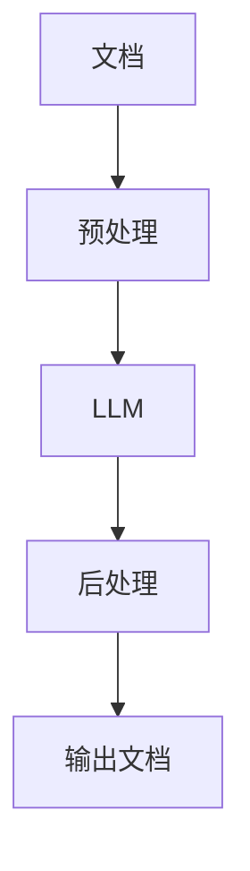

                 

**大语言模型（LLM）在办公自动化中的应用：智能文档处理**

## 1. 背景介绍

在当今信息爆炸的时代，文档处理已成为办公自动化中的一项关键任务。然而，传统的文档处理方法往往费时费力，效率低下。大语言模型（LLM）的出现为文档处理带来了革命性的变化。本文将深入探讨LLM在办公自动化中的应用，重点介绍其在智能文档处理中的作用。

## 2. 核心概念与联系

### 2.1 大语言模型（LLM）

大语言模型是一种深度学习模型，能够理解和生成人类语言。它通过学习大量文本数据，掌握语言规则和上下文，从而能够生成相似的文本。LLM的核心是Transformer模型，它使用自注意力机制来处理输入序列，能够同时关注序列中的所有元素。

### 2.2 文档处理

文档处理是指对文档进行分析、提取、转换和生成等操作。它包括但不限于文本提取、文本分类、文本摘要、文本翻译等任务。

### 2.3 LLM在文档处理中的应用

LLM可以在文档处理的各个环节发挥作用。它可以帮助提取文档中的关键信息，自动生成文档摘要，甚至可以根据给定的指令生成新的文档。

### 2.4 系统架构

下图是LLM在文档处理中的系统架构：



## 3. 核心算法原理 & 具体操作步骤

### 3.1 算法原理概述

LLM在文档处理中的核心算法是Transformer模型。它使用自注意力机制来处理输入序列，能够同时关注序列中的所有元素。具体来说，Transformer模型包含编码器和解码器两个部分。编码器负责理解输入序列，解码器负责生成输出序列。

### 3.2 算法步骤详解

1. **预处理**：将文档转换为LLM可以理解的格式，通常是 token IDs。
2. **编码**：将输入序列编码为表示向量。
3. **解码**：根据表示向量生成输出序列。
4. **后处理**：将输出序列转换为最终的文档格式。

### 3.3 算法优缺点

**优点**：LLM可以理解上下文，生成的文本更加连贯和流畅。它可以处理长序列，适合于文档处理任务。

**缺点**：LLM训练和推理需要大量的计算资源。它可能会生成不准确或不相关的文本，需要后续的过滤和校验。

### 3.4 算法应用领域

LLM在文档处理中的应用包括但不限于文本提取、文本分类、文本摘要、文本翻译等任务。它还可以用于自动生成报告、合同、邮件等文档。

## 4. 数学模型和公式 & 详细讲解 & 举例说明

### 4.1 数学模型构建

LLM的数学模型是Transformer模型。它使用自注意力机制来处理输入序列。自注意力机制的数学表达式如下：

$$ \text{Attention}(Q, K, V) = \text{softmax}\left(\frac{QK^T}{\sqrt{d_k}}\right)V $$

其中，$Q$, $K$, $V$分别是查询、键、值向量，$d_k$是键向量的维度。

### 4.2 公式推导过程

自注意力机制的推导过程如下：

1. 将输入序列转换为查询、键、值向量。
2. 计算查询和键向量的点积，并除以键向量的维度的平方根。
3. 使用 softmax 函数对上一步的结果进行缩放，得到注意力权重。
4. 将注意力权重与值向量相乘，得到输出向量。

### 4.3 案例分析与讲解

例如，在文本摘要任务中，LLM需要理解输入文档的内容，并生成一个简短的摘要。LLM使用自注意力机制来处理输入序列，理解文档的结构和关键信息，然后生成摘要。

## 5. 项目实践：代码实例和详细解释说明

### 5.1 开发环境搭建

要使用LLM进行文档处理，需要安装相关的库和环境。推荐使用Python语言，并安装-transformers库。

### 5.2 源代码详细实现

以下是一个简单的文本摘要示例：

```python
from transformers import pipeline

# 初始化文本摘要 pipeline
summarizer = pipeline('summarization')

# 输入文档
document = "..."

# 生成摘要
summary = summarizer(document, max_length=130, min_length=56, do_sample=False)[0]['summary_text']

print(summary)
```

### 5.3 代码解读与分析

这段代码使用transformers库初始化了一个文本摘要 pipeline。然后，它使用这个 pipeline 来生成输入文档的摘要。max_length和min_length参数用于控制摘要的长度。

### 5.4 运行结果展示

运行这段代码将生成输入文档的摘要。摘要的长度和质量取决于LLM的能力和参数的设置。

## 6. 实际应用场景

LLM在文档处理中的应用场景包括但不限于：

### 6.1 文本提取

LLM可以帮助提取文档中的关键信息，如名称、日期、地址等。

### 6.2 文本分类

LLM可以根据文档的内容将其分类，如将文档分类为新闻、科技、体育等。

### 6.3 文本翻译

LLM可以将文档从一种语言翻译为另一种语言。

### 6.4 未来应用展望

随着LLM能力的提高和计算资源的增强，LLM在文档处理中的应用将会更加广泛。它可能会用于自动生成报告、合同、邮件等文档，从而提高办公自动化的效率。

## 7. 工具和资源推荐

### 7.1 学习资源推荐

- "Attention is All You Need"：这篇论文介绍了Transformer模型和自注意力机制。
- "BERT: Pre-training of Deep Bidirectional Transformers for Language Understanding"：这篇论文介绍了BERT模型，它是LLM的一种。

### 7.2 开发工具推荐

- transformers库：这是一个开源的Python库，提供了LLM的实现。
- Hugging Face Spaces：这是一个在线平台，提供了LLM的示例和应用。

### 7.3 相关论文推荐

- "Longformer: The Long-Document Transformer"：这篇论文介绍了Longformer模型，它是LLM的一种，可以处理长序列。
- "T5: Text-to-Text Transfer Transformer"：这篇论文介绍了T5模型，它是LLM的一种，可以将文本转换为其他文本。

## 8. 总结：未来发展趋势与挑战

### 8.1 研究成果总结

LLM在文档处理中的应用取得了显著的成果。它可以理解上下文，生成连贯和流畅的文本，从而提高了文档处理的效率。

### 8.2 未来发展趋势

随着计算资源的增强和数据的丰富，LLM的能力将会进一步提高。它可能会用于更复杂的文档处理任务，如自动生成报告、合同、邮件等文档。

### 8.3 面临的挑战

LLM在文档处理中的应用面临着几个挑战。首先，LLM需要大量的计算资源。其次，LLM可能会生成不准确或不相关的文本，需要后续的过滤和校验。最后，LLM的训练数据可能会包含偏见，从而导致生成的文本也带有偏见。

### 8.4 研究展望

未来的研究将会关注如何提高LLM的能力，如何减少其对计算资源的需求，如何减少其生成的文本中的偏见。此外，研究还将关注如何将LLM集成到办公自动化系统中，从而提高办公自动化的效率。

## 9. 附录：常见问题与解答

**Q：LLM可以理解上下文吗？**

**A：**是的，LLM可以理解上下文。它使用自注意力机制来处理输入序列，能够同时关注序列中的所有元素。

**Q：LLM需要大量的计算资源吗？**

**A：**是的，LLM需要大量的计算资源。它的训练和推理需要大量的GPU资源。

**Q：LLM可能会生成不准确或不相关的文本吗？**

**A：**是的，LLM可能会生成不准确或不相关的文本。它的生成结果需要后续的过滤和校验。

**作者：禅与计算机程序设计艺术 / Zen and the Art of Computer Programming**

