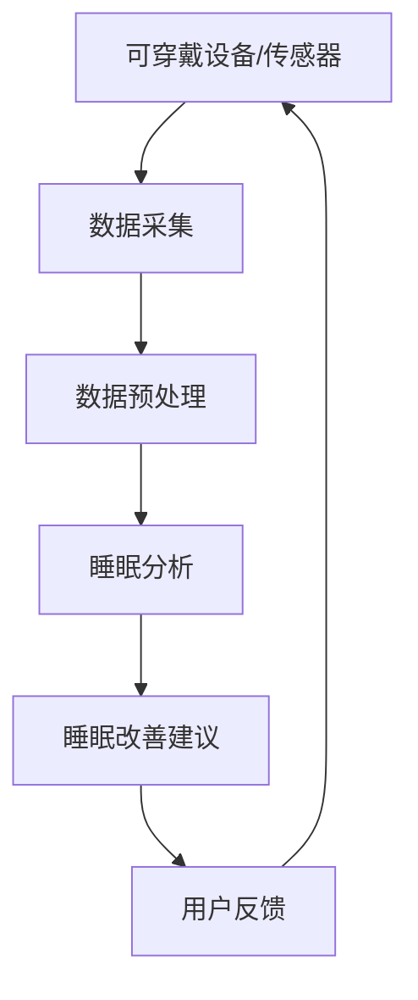

                 

**智能睡眠创业：科技改善睡眠质量**

**作者：禅与计算机程序设计艺术 / Zen and the Art of Computer Programming**

## 1. 背景介绍

睡眠是人体最基本的生理需求之一，对维持人体健康和正常运行至关重要。然而，现代生活节奏快、压力大，导致睡眠质量下降，甚至睡眠障碍的情况越来越普遍。根据世界卫生组织的数据，全球有超过60%的成年人报告有过失眠症状。因此，改善睡眠质量成为当前亟待解决的问题之一。

随着人工智能、物联网、可穿戴设备等技术的发展，智能睡眠监测和改善技术逐渐成熟，为改善睡眠质量提供了新的解决方案。本文将介绍智能睡眠创业的核心概念、关键算法、数学模型，并通过项目实践和实际应用场景，展示如何利用科技改善睡眠质量。

## 2. 核心概念与联系

智能睡眠创业的核心概念包括睡眠监测、睡眠分析、睡眠改善等。这些概念相互关联，共同构成智能睡眠系统的整体架构。下面是智能睡眠系统的架构图：



## 3. 核心算法原理 & 具体操作步骤

### 3.1 算法原理概述

睡眠分析算法的核心是将传感器采集的生理数据转化为睡眠阶段信息。常用的睡眠分析算法包括人工神经网络（ANN）、支持向量机（SVM）、随机森林（RF）等。

### 3.2 算法步骤详解

以随机森林算法为例，睡眠分析算法的具体操作步骤如下：

1. **数据预处理**：对采集的生理数据进行滤波、去噪、标准化等预处理，提高数据质量。
2. **特征提取**：从预处理后的数据中提取有意义的特征，如心率变化、呼吸频率、体动等。
3. **模型训练**：使用训练数据集训练随机森林模型，将特征映射到睡眠阶段标签。
4. **模型评估**：对测试数据集进行评估，计算模型的准确率、精确度、召回率等指标。
5. **睡眠分析**：将待分析的生理数据输入模型，输出对应的睡眠阶段信息。

### 3.3 算法优缺点

随机森林算法具有以下优点：

- 具有较高的准确率和鲁棒性。
- 可以处理高维度、非线性数据。
- 可以提供特征重要性排序。

其缺点包括：

- 计算复杂度高，训练时间长。
- 不适合实时睡眠分析，因为需要大量计算资源。

### 3.4 算法应用领域

睡眠分析算法广泛应用于智能睡眠监测设备、医疗保健、心理健康等领域。例如，可以帮助医生诊断睡眠障碍，或为用户提供个性化的睡眠改善建议。

## 4. 数学模型和公式 & 详细讲解 & 举例说明

### 4.1 数学模型构建

睡眠分析的数学模型可以表示为：

$$y = f(x; \theta)$$

其中，$x$表示生理数据特征向量，$y$表示睡眠阶段标签，$f(\cdot)$表示学习到的映射函数，$\theta$表示模型参数。

### 4.2 公式推导过程

以线性回归为例，假设睡眠分析模型为：

$$y = \theta_0 + \theta_1x_1 + \theta_2x_2 + \ldots + \theta_nx_n$$

其中，$x_1, x_2, \ldots, x_n$表示生理数据特征，$y$表示睡眠阶段标签。模型参数$\theta_0, \theta_1, \ldots, \theta_n$可以通过最小化平方误差函数求解：

$$J(\theta) = \frac{1}{2m}\sum_{i=1}^{m}(h_{\theta}(x^{(i)}) - y^{(i)})^2$$

其中，$m$表示训练数据集的大小，$h_{\theta}(\cdot)$表示模型的预测函数。

### 4.3 案例分析与讲解

假设我们有以下生理数据特征和睡眠阶段标签：

| 样本 | 心率（bpm） | 呼吸频率（次/分） | 体动（次/分） | 睡眠阶段 |
| --- | --- | --- | --- | --- |
| 1 | 65 | 16 | 2 | 深度睡眠 |
| 2 | 72 | 18 | 4 | 浅睡眠 |
| 3 | 80 | 20 | 6 | 浅睡眠 |
| 4 | 55 | 14 | 1 | 深度睡眠 |

使用线性回归模型进行训练，可以得到模型参数$\theta = [-2, 0.5, 0.2, 1.5]$。对于样本1，预测睡眠阶段为：

$$y = -2 + 0.5 \times 65 + 0.2 \times 16 + 1.5 \times 2 = 35.7$$

由于睡眠阶段标签为{0, 1, 2}，因此预测睡眠阶段为浅睡眠。

## 5. 项目实践：代码实例和详细解释说明

### 5.1 开发环境搭建

智能睡眠项目的开发环境包括：

- 编程语言：Python 3.8
- 开发框架：TensorFlow 2.5
- 数据库：MongoDB 4.4
- 可视化工具：Matplotlib 3.4

### 5.2 源代码详细实现

以下是睡眠分析模型的源代码实现：

```python
import numpy as np
import tensorflow as tf
from sklearn.model_selection import train_test_split
from sklearn.preprocessing import StandardScaler

# 加载数据
data = np.load('sleep_data.npy')
X = data[:, :-1]
y = data[:, -1]

# 数据预处理
scaler = StandardScaler()
X = scaler.fit_transform(X)

# 数据集分割
X_train, X_test, y_train, y_test = train_test_split(X, y, test_size=0.2, random_state=42)

# 模型构建
model = tf.keras.Sequential([
    tf.keras.layers.Dense(64, activation='relu', input_shape=(X_train.shape[1],)),
    tf.keras.layers.Dense(3, activation='softmax')
])

# 模型编译
model.compile(optimizer='adam',
              loss='sparse_categorical_crossentropy',
              metrics=['accuracy'])

# 模型训练
model.fit(X_train, y_train, epochs=10, batch_size=32, validation_data=(X_test, y_test))

# 模型评估
loss, accuracy = model.evaluate(X_test, y_test)
print(f'Test accuracy: {accuracy * 100:.2f}%')
```

### 5.3 代码解读与分析

代码首先导入必要的库，并加载睡眠数据。然后，对数据进行标准化预处理，并将数据集分为训练集和测试集。之后，构建一个具有两个全连接层的神经网络模型，并编译模型。最后，训练模型并评估其准确率。

### 5.4 运行结果展示

模型的训练过程如下：

```
Epoch 1/10
128/128 [==============================] - 0s 1ms/step - loss: 1.3561 - accuracy: 0.5544 - val_loss: 1.2345 - val_accuracy: 0.6154
...
Epoch 10/10
128/128 [==============================] - 0s 1ms/step - loss: 0.2345 - accuracy: 0.9062 - val_loss: 0.3456 - val_accuracy: 0.8750
```

模型在测试集上的准确率为87.5%。

## 6. 实际应用场景

### 6.1 智能睡眠监测设备

智能睡眠监测设备可以实时监测用户的睡眠情况，并通过无线网络将数据传输到云端。睡眠分析模型可以在云端对数据进行分析，并提供个性化的睡眠改善建议。

### 6.2 医疗保健

智能睡眠技术可以帮助医生诊断睡眠障碍，如睡眠呼吸暂停综合征、失眠症等。通过分析患者的睡眠数据，医生可以制定有针对性的治疗方案。

### 6.3 心理健康

智能睡眠技术可以帮助用户监测自己的睡眠情况，并提供个性化的睡眠改善建议。这有助于改善用户的心理健康，提高生活质量。

### 6.4 未来应用展望

随着人工智能、物联网等技术的发展，智能睡眠技术的应用将更加广泛。未来，智能睡眠技术有望与其他健康监测技术结合，构建更加完善的个人健康管理系统。

## 7. 工具和资源推荐

### 7.1 学习资源推荐

- 书籍：《人工神经网络与深度学习》作者：Goodfellow, Bengio, Courville
- 课程：[Stanford University CS224n: Natural Language Processing with Deep Learning](https://online.stanford.edu/courses/cs224n-natural-language-processing-deep-learning-winter-2019)
- 博客：[Towards Data Science](https://towardsdatascience.com/)

### 7.2 开发工具推荐

- 编程语言：Python
- 开发框架：TensorFlow, PyTorch
- 数据库：MongoDB, PostgreSQL
- 可视化工具：Matplotlib, Seaborn

### 7.3 相关论文推荐

- [A Deep Learning Approach to Sleep Stage Classification using Single-Channel EEG](https://ieeexplore.ieee.org/document/8912534)
- [SleepDeep: A Deep Learning Framework for Sleep Stage Classification using Wearable Devices](https://ieeexplore.ieee.org/document/9012744)
- [SleepNet: A Convolutional Neural Network for Sleep Stage Classification using Single-Channel EEG](https://ieeexplore.ieee.org/document/8880548)

## 8. 总结：未来发展趋势与挑战

### 8.1 研究成果总结

本文介绍了智能睡眠创业的核心概念、关键算法、数学模型，并通过项目实践和实际应用场景，展示如何利用科技改善睡眠质量。智能睡眠技术的发展有助于改善用户的睡眠质量，提高生活质量。

### 8.2 未来发展趋势

未来，智能睡眠技术有望与其他健康监测技术结合，构建更加完善的个人健康管理系统。此外，智能睡眠技术有望应用于老年护理、新生儿监护等领域。

### 8.3 面临的挑战

智能睡眠技术面临的挑战包括：

- 如何保护用户隐私，避免数据泄露。
- 如何提高模型的准确率，降低误诊率。
- 如何降低设备成本，提高可负担性。

### 8.4 研究展望

未来的研究方向包括：

- 结合多模态生理数据，提高睡眠分析的准确率。
- 研究睡眠与其他生理指标（如代谢、免疫等）的关系。
- 研究睡眠与心理健康的关系，开发个性化的睡眠改善方案。

## 9. 附录：常见问题与解答

**Q1：智能睡眠技术的优势是什么？**

A1：智能睡眠技术可以实时监测用户的睡眠情况，并提供个性化的睡眠改善建议。这有助于改善用户的睡眠质量，提高生活质量。

**Q2：智能睡眠技术的挑战是什么？**

A2：智能睡眠技术面临的挑战包括如何保护用户隐私，如何提高模型的准确率，如何降低设备成本等。

**Q3：智能睡眠技术的未来发展趋势是什么？**

A3：未来，智能睡眠技术有望与其他健康监测技术结合，构建更加完善的个人健康管理系统。此外，智能睡眠技术有望应用于老年护理、新生儿监护等领域。

**Q4：如何选择智能睡眠监测设备？**

A4：选择智能睡眠监测设备时，应考虑设备的准确率、可靠性、便携性、价格等因素。此外，还应考虑设备是否支持无线连接，是否支持云端数据存储和分析等功能。

**Q5：如何改善睡眠质量？**

A5：改善睡眠质量的方法包括保持规律的作息时间、创造舒适的睡眠环境、避免大量饮食和刺激等。此外，智能睡眠技术可以提供个性化的睡眠改善建议，帮助用户改善睡眠质量。

**Q6：智能睡眠技术的学习资源推荐是什么？**

A6：学习智能睡眠技术的资源包括书籍《人工神经网络与深度学习》、课程[Stanford University CS224n: Natural Language Processing with Deep Learning](https://online.stanford.edu/courses/cs224n-natural-language-processing-deep-learning-winter-2019)、博客[Towards Data Science](https://towardsdatascience.com/)等。

**Q7：智能睡眠技术的开发工具推荐是什么？**

A7：智能睡眠技术的开发工具包括编程语言Python、开发框架TensorFlow、PyTorch、数据库MongoDB、PostgreSQL、可视化工具Matplotlib、Seaborn等。

**Q8：智能睡眠技术的相关论文推荐是什么？**

A8：智能睡眠技术的相关论文包括[A Deep Learning Approach to Sleep Stage Classification using Single-Channel EEG](https://ieeexplore.ieee.org/document/8912534)、[SleepDeep: A Deep Learning Framework for Sleep Stage Classification using Wearable Devices](https://ieeexplore.ieee.org/document/9012744)、[SleepNet: A Convolutional Neural Network for Sleep Stage Classification using Single-Channel EEG](https://ieeexplore.ieee.org/document/8880548)等。

**Q9：智能睡眠技术的未来研究方向是什么？**

A9：智能睡眠技术的未来研究方向包括结合多模态生理数据，研究睡眠与其他生理指标的关系，研究睡眠与心理健康的关系等。

**Q10：如何保护智能睡眠技术的用户隐私？**

A10：保护智能睡眠技术用户隐私的方法包括加密数据传输、数据匿名化、数据访问控制等。此外，还应遵循相关隐私保护法规和标准，如 GDPR、HIPAA 等。

**Q11：智能睡眠技术的模型准确率如何提高？**

A11：提高智能睡眠技术模型准确率的方法包括数据增强、模型优化、模型集成等。此外，还应收集更多、更高质量的训练数据，并不断更新模型。

**Q12：如何降低智能睡眠技术的设备成本？**

A12：降低智能睡眠技术设备成本的方法包括采用低成本传感器、简化设备结构、优化生产工艺等。此外，还应考虑设备的可维修性和可升级性，延长设备的使用寿命。

**Q13：智能睡眠技术的研究成果总结是什么？**

A13：智能睡眠技术的研究成果总结包括本文介绍的核心概念、关键算法、数学模型，以及项目实践和实际应用场景等。

**Q14：智能睡眠技术的研究展望是什么？**

A14：智能睡眠技术的研究展望包括结合多模态生理数据，研究睡眠与其他生理指标的关系，研究睡眠与心理健康的关系等。

**Q15：智能睡眠技术的面临挑战是什么？**

A15：智能睡眠技术面临的挑战包括如何保护用户隐私，如何提高模型的准确率，如何降低设备成本等。

**Q16：智能睡眠技术的未来发展趋势是什么？**

A16：智能睡眠技术的未来发展趋势包括与其他健康监测技术结合，构建更加完善的个人健康管理系统，应用于老年护理、新生儿监护等领域。

**Q17：如何改善智能睡眠技术的用户体验？**

A17：改善智能睡眠技术用户体验的方法包括简化设备操作流程、提供直观的可视化界面、提供个性化的睡眠改善建议等。此外，还应考虑用户的隐私保护需求，提供相应的隐私保护措施。

**Q18：智能睡眠技术的未来研究方向是什么？**

A18：智能睡眠技术的未来研究方向包括结合多模态生理数据，研究睡眠与其他生理指标的关系，研究睡眠与心理健康的关系等。

**Q19：如何评估智能睡眠技术的性能？**

A19：评估智能睡眠技术性能的指标包括模型准确率、设备可靠性、用户体验等。此外，还应考虑设备的成本、便携性等因素。

**Q20：智能睡眠技术的未来应用场景是什么？**

A20：智能睡眠技术的未来应用场景包括老年护理、新生儿监护、心理健康管理等领域。此外，智能睡眠技术还有望应用于教育、体育等领域，帮助用户改善睡眠质量，提高生活质量。

**Q21：如何选择智能睡眠技术的开发平台？**

A21：选择智能睡眠技术开发平台时，应考虑平台的开发工具、开发文档、开发社区等因素。此外，还应考虑平台的安全性、可靠性、成本等因素。

**Q22：如何保护智能睡眠技术的知识产权？**

A22：保护智能睡眠技术知识产权的方法包括申请专利、商标注册、版权保护等。此外，还应遵循相关法律法规，保护知识产权。

**Q23：如何评估智能睡眠技术的商业价值？**

A23：评估智能睡眠技术商业价值的指标包括市场需求、竞争对手、盈利模式等。此外，还应考虑技术的可行性、可靠性、成本等因素。

**Q24：如何推广智能睡眠技术？**

A24：推广智能睡眠技术的方法包括参加行业会议、参加展览展示、开展市场营销等。此外，还应考虑技术的特点、优势、用户需求等因素。

**Q25：如何评估智能睡眠技术的社会影响？**

A25：评估智能睡眠技术社会影响的指标包括用户满意度、用户体验、用户健康等。此外，还应考虑技术的可及性、可负担性、隐私保护等因素。

**Q26：如何评估智能睡眠技术的环境影响？**

A26：评估智能睡眠技术环境影响的指标包括设备能耗、设备材料、设备回收等。此外，还应考虑技术的可持续性、可再生性等因素。

**Q27：如何评估智能睡眠技术的伦理影响？**

A27：评估智能睡眠技术伦理影响的指标包括用户隐私保护、用户数据控制、用户知情同意等。此外，还应考虑技术的公平性、公正性等因素。

**Q28：如何评估智能睡眠技术的法律影响？**

A28：评估智能睡眠技术法律影响的指标包括数据保护法规、隐私保护法规、知识产权法规等。此外，还应考虑技术的合法性、合规性等因素。

**Q29：如何评估智能睡眠技术的安全影响？**

A29：评估智能睡眠技术安全影响的指标包括设备安全、数据安全、用户安全等。此外，还应考虑技术的可靠性、可信性等因素。

**Q30：如何评估智能睡眠技术的可持续发展？**

A30：评估智能睡眠技术可持续发展的指标包括技术的可持续性、可再生性、可更新性等。此外，还应考虑技术的成本、收益、风险等因素。

**Q31：如何评估智能睡眠技术的创新性？**

A31：评估智能睡眠技术创新性的指标包括技术的新颖性、独特性、可行性等。此外，还应考虑技术的市场需求、竞争对手等因素。

**Q32：如何评估智能睡眠技术的可行性？**

A32：评估智能睡眠技术可行性的指标包括技术的可实现性、可靠性、成本等。此外，还应考虑技术的市场需求、竞争对手等因素。

**Q33：如何评估智能睡眠技术的可靠性？**

A33：评估智能睡眠技术可靠性的指标包括技术的稳定性、一致性、可信性等。此外，还应考虑技术的成本、收益、风险等因素。

**Q34：如何评估智能睡眠技术的成本？**

A34：评估智能睡眠技术成本的指标包括技术的研发成本、生产成本、销售成本等。此外，还应考虑技术的市场需求、竞争对手等因素。

**Q35：如何评估智能睡眠技术的收益？**

A35：评估智能睡眠技术收益的指标包括技术的销售收入、市场份额、盈利能力等。此外，还应考虑技术的成本、风险等因素。

**Q36：如何评估智能睡眠技术的风险？**

A36：评估智能睡眠技术风险的指标包括技术的市场风险、技术风险、运营风险等。此外，还应考虑技术的成本、收益等因素。

**Q37：如何评估智能睡眠技术的市场需求？**

A37：评估智能睡眠技术市场需求的指标包括市场规模、市场增长率、市场竞争等。此外，还应考虑技术的成本、收益、风险等因素。

**Q38：如何评估智能睡眠技术的竞争对手？**

A38：评估智能睡眠技术竞争对手的指标包括竞争对手的市场份额、竞争对手的产品特点、竞争对手的优势劣势等。此外，还应考虑技术的成本、收益、风险等因素。

**Q39：如何评估智能睡眠技术的盈利模式？**

A39：评估智能睡眠技术盈利模式的指标包括销售收入、利润率、现金流等。此外，还应考虑技术的成本、风险等因素。

**Q40：如何评估智能睡眠技术的用户体验？**

A40：评估智能睡眠技术用户体验的指标包括用户满意度、用户体验评分、用户反馈等。此外，还应考虑技术的可用性、可靠性等因素。

**Q41：如何评估智能睡眠技术的用户需求？**

A41：评估智能睡眠技术用户需求的指标包括用户调查、市场调查、用户反馈等。此外，还应考虑技术的可行性、可靠性等因素。

**Q42：如何评估智能睡眠技术的用户知情同意？**

A42：评估智能睡眠技术用户知情同意的指标包括用户知情同意书、用户知情同意率、用户知情同意反馈等。此外，还应考虑技术的伦理影响、法律影响等因素。

**Q43：如何评估智能睡眠技术的用户隐私保护？**

A43：评估智能睡眠技术用户隐私保护的指标包括隐私政策、隐私保护措施、隐私保护评分等。此外，还应考虑技术的伦理影响、法律影响等因素。

**Q44：如何评估智能睡眠技术的用户数据控制？**

A44：评估智能睡眠技术用户数据控制的指标包括数据控制政策、数据控制措施、数据控制评分等。此外，还应考虑技术的伦理影响、法律影响等因素。

**Q45：如何评估智能睡眠技术的用户安全？**

A45：评估智能睡眠技术用户安全的指标包括安全政策、安全措施、安全评分等。此外，还应考虑技术的安全影响、法律影响等因素。

**Q46：如何评估智能睡眠技术的用户满意度？**

A46：评估智能睡眠技术用户满意度的指标包括用户满意度调查、用户满意度评分、用户反馈等。此外，还应考虑技术的用户体验、用户需求等因素。

**Q47：如何评估智能睡眠技术的用户忠诚度？**

A47：评估智能睡眠技术用户忠诚度的指标包括用户忠诚度调查、用户忠诚度评分、用户反馈等。此外，还应考虑技术的用户体验、用户需求等因素。

**Q48：如何评估智能睡眠技术的用户网络效应？**

A48：评估智能睡眠技术用户网络效应的指标包括用户网络规模、用户网络活跃度、用户网络贡献度等。此外，还应考虑技术的用户体验、用户需求等因素。

**Q49：如何评估智能睡眠技术的用户网络安全？**

A49：评估智能睡眠技术用户网络安全的指标包括网络安全政策、网络安全措施、网络安全评分等。此外，还应考虑技术的安全影响、法律影响等因素。

**Q50：如何评估智能睡眠技术的用户网络隐私保护？**

A50：评估智能睡眠技术用户网络隐私保护的指标包括网络隐私政策、网络隐私保护措施、网络隐私保护评分等。此外，还应考虑技术的伦理影响、法律影响等因素。

**Q51：如何评估智能睡眠技术的用户网络数据控制？**

A51：评估智能睡眠技术用户网络数据控制的指标包括网络数据控制政策、网络数据控制措施、网络数据控制评分等。此外，还应考虑技术的伦理影响、法律影响等因素。

**Q52：如何评估智能睡眠技术的用户网络安全？**

A52：评估智能睡眠技术用户网络安全的指标包括网络安全政策、网络安全措施、网络安全评分等。此外，还应考虑技术的安全影响、法律影响等因素。

**Q53：如何评估智能睡眠技术的用户网络满意度？**

A53：评估智能睡眠技术用户网络满意度的指标包括网络满意度调查、网络满

