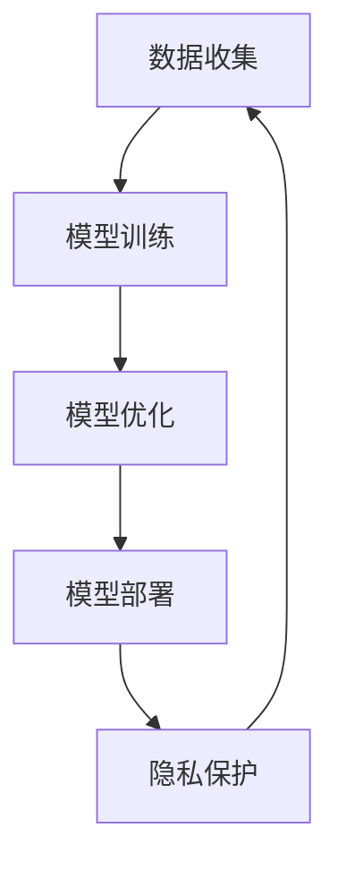

                 

**关键词：人工智能、AI应用、苹果、产业发展、算法、数据处理、隐私保护、未来趋势**

## 1. 背景介绍

自从2017年苹果推出了面向开发者的Core ML框架以来，AI应用在iOS平台上的发展就开始蓬勃兴起。随着苹果在WWDC21大会上发布了新的AI框架和功能，AI应用在苹果生态系统中的地位进一步提升。本文将深入探讨苹果发布的AI应用产业，分析其核心概念、算法原理、数学模型，并提供项目实践和工具推荐，最终展望未来发展趋势。

## 2. 核心概念与联系

### 2.1 核心概念

苹果的AI应用产业建立在以下核心概念之上：

- **On-Device Intelligence**：将AI模型运行在设备本地，而非云端，以保护用户隐私和提高响应速度。
- **Privacy-by-Design**：将隐私保护考虑进AI模型的设计和开发过程中，确保用户数据安全。
- **Differential Privacy**：一种保护隐私的技术，通过添加噪声来隐藏个体数据，同时保持数据的整体统计信息。

### 2.2 核心架构

下图展示了苹果AI应用产业的核心架构，包括数据收集、模型训练、模型优化、模型部署和隐私保护等环节。



## 3. 核心算法原理 & 具体操作步骤

### 3.1 算法原理概述

苹果的AI应用产业涉及多种算法，包括但不限于卷积神经网络（CNN）、循环神经网络（RNN）、transformer模型等。本节将重点介绍苹果用于模型优化的Neural Engine和用于隐私保护的差分隐私技术。

### 3.2 算法步骤详解

#### Neural Engine

Neural Engine是苹果为其SoC（系统级芯片）设计的专用AI处理单元，用于加速AI模型的推理过程。其工作原理包括：

1. **模型转换**：将训练好的模型转换为Neural Engine可理解的格式。
2. **模型分析**：Neural Engine分析模型结构，优化内存布局和数据流。
3. **推理加速**：Neural Engine执行模型推理，加速AI应用的响应速度。

#### 差分隐私

差分隐私是一种保护隐私的技术，其工作原理如下：

1. **数据收集**：收集用户数据。
2. **添加噪声**：在数据上添加高斯噪声，以隐藏个体数据。
3. **数据发布**：发布添加了噪声的数据，保护用户隐私的同时维持数据的整体统计信息。

### 3.3 算法优缺点

**Neural Engine**的优点包括：

- 提高AI应用的响应速度
- 降低能耗，延长设备电池寿命
- 保护用户隐私，因为模型推理在设备本地进行

其缺点是：

- 只支持特定格式的模型
- 可能需要额外的模型转换和优化步骤

**差分隐私**的优点是：

- 有效保护用户隐私
- 维持数据的整体统计信息

其缺点是：

- 添加的噪声可能会影响数据的精确性
- 保护隐私的程度取决于添加的噪声量

### 3.4 算法应用领域

Neural Engine和差分隐私技术广泛应用于苹果的AI应用产业，包括但不限于：

- 图像和视频分析（如人脸识别、物体检测）
- 语音识别和合成
- 自然语言处理（如文本分类、机器翻译）
- 位置和运动数据分析（如健康和运动跟踪）

## 4. 数学模型和公式 & 详细讲解 & 举例说明

### 4.1 数学模型构建

在苹果的AI应用产业中，构建数学模型的过程通常涉及以下步骤：

1. **特征提取**：从原始数据中提取有意义的特征。
2. **模型选择**：选择合适的模型架构（如CNN、RNN等）。
3. **模型训练**：使用训练数据调整模型参数，以最小化预测误差。

### 4.2 公式推导过程

假设我们要构建一个简单的线性回归模型，其数学公式如下：

$$y = wx + b + \epsilon$$

其中：

- $y$ 是目标变量
- $x$ 是输入特征
- $w$ 是权重
- $b$ 是偏置项
- $\epsilon$ 是误差项

模型的目标是最小化误差项，通常使用均方误差（MSE）作为损失函数：

$$L = \frac{1}{n}\sum_{i=1}^{n}(y_i - \hat{y}_i)^2$$

其中：

- $n$ 是训练样本数
- $y_i$ 是真实目标变量
- $\hat{y}_i$ 是模型预测的目标变量

模型参数 $w$ 和 $b$ 可以通过梯度下降算法来优化。

### 4.3 案例分析与讲解

假设我们要构建一个简单的AI应用，用于预测用户的步行距离基于其心率和步速数据。我们可以使用线性回归模型来解决这个问题。首先，我们需要收集训练数据，包括心率、步速和步行距离。然后，我们可以使用上述公式构建模型，并使用梯度下降算法优化模型参数。一旦模型训练完成，我们就可以使用它来预测用户的步行距离。

## 5. 项目实践：代码实例和详细解释说明

### 5.1 开发环境搭建

要开发苹果的AI应用，您需要以下开发环境：

- macOS系统
- Xcode开发工具
- Core ML框架
- 可选：创建和训练模型的深度学习框架（如TensorFlow或PyTorch）

### 5.2 源代码详细实现

以下是一个简单的AI应用示例，使用Core ML框架来预测用户的步行距离。我们假设您已经创建并训练了一个线性回归模型，并将其转换为Core ML格式。

1. 创建新的Xcode项目，选择“Single View App”模板。
2. 将转换后的Core ML模型文件（.mlmodel）拖放到项目导航器中。
3. 创建一个新的Swift文件，并导入Core ML框架：

```swift
import CoreML
```

4. 加载模型并创建预测请求：

```swift
guard let model = try? MLModel(contentsOf: "YourModel.mlmodel") as? YourModel else {
    fatalError("Failed to load model")
}

let prediction = model.prediction(heartRate: 120, stepsPerMinute: 100)
```

5. 使用预测结果：

```swift
if let distance = prediction.distance {
    print("Predicted distance: \(distance) meters")
}
```

### 5.3 代码解读与分析

在上述示例中，我们首先加载转换后的Core ML模型，然后创建一个预测请求，提供心率和步速数据。一旦模型返回预测结果，我们就可以使用预测的步行距离。

### 5.4 运行结果展示

运行应用后，您应该看到预测的步行距离打印在控制台中。您可以调整输入数据（心率和步速）来查看模型的不同预测结果。

## 6. 实际应用场景

苹果的AI应用产业在各种实际应用场景中得到广泛应用，包括：

### 6.1 图像和视频分析

AI应用可以用于图像和视频分析，如人脸识别、物体检测和场景分类。这些应用可以在设备本地运行，保护用户隐私，并提高响应速度。

### 6.2 语音识别和合成

AI应用可以用于语音识别和合成，如语音助手、实时翻译和语音输入法。这些应用可以提供更自然和直观的用户体验。

### 6.3 自然语言处理

AI应用可以用于自然语言处理，如文本分类、机器翻译和情感分析。这些应用可以帮助用户更好地理解和交流信息。

### 6.4 未来应用展望

随着AI技术的不断发展，苹果的AI应用产业将在以下领域取得更大的进展：

- **增强现实（AR）和虚拟现实（VR）**：AI应用可以帮助改善AR和VR体验，如物体识别、场景理解和实时渲染。
- **自动驾驶**：AI应用可以用于自动驾驶汽车的感知和决策系统，帮助提高安全性和可靠性。
- **健康和医疗**：AI应用可以用于疾病诊断、药物发现和个性化医疗，帮助改善人们的健康和福祉。

## 7. 工具和资源推荐

### 7.1 学习资源推荐

- **苹果开发者文档**：<https://developer.apple.com/documentation/>
- **Core ML指南**：<https://developer.apple.com/documentation/coreml>
- **机器学习基础**：<https://www.coursera.org/learn/machine-learning>
- **深度学习专家课程**：<https://www.deeplearning.ai/>

### 7.2 开发工具推荐

- **Xcode**：<https://developer.apple.com/xcode/>
- **TensorFlow**：<https://www.tensorflow.org/>
- **PyTorch**：<https://pytorch.org/>
- **Keras**：<https://keras.io/>

### 7.3 相关论文推荐

- **Differential Privacy for Machine Learning with Noise Injection at Training Time**：<https://arxiv.org/abs/1908.08915>
- **On-Device Machine Learning with TensorFlow Lite for iOS**：<https://arxiv.org/abs/1905.07316>
- **Privacy-Preserving Machine Learning with Federated Learning and Differential Privacy**：<https://arxiv.org/abs/1902.01046>

## 8. 总结：未来发展趋势与挑战

### 8.1 研究成果总结

本文介绍了苹果的AI应用产业，分析了其核心概念、算法原理、数学模型，并提供了项目实践和工具推荐。我们还展望了未来的应用场景和发展趋势。

### 8.2 未来发展趋势

未来，苹果的AI应用产业将继续发展，并朝着以下方向前进：

- **模型优化**：开发更高效的模型压缩和优化技术，以节省设备资源。
- **隐私保护**：开发更先进的隐私保护技术，如联邦学习和差分隐私的组合。
- **多模式学习**：结合多种模式的学习，如视觉、听觉和文本，以提高AI应用的准确性和泛化能力。

### 8.3 面临的挑战

苹果的AI应用产业也面临着以下挑战：

- **模型训练**：训练大型AI模型需要大量的计算资源和数据。
- **隐私保护**：在保护用户隐私的同时维持模型的准确性是一个挑战。
- **算法偏见**：AI模型可能会受到训练数据的偏见影响，导致不公平的结果。

### 8.4 研究展望

未来的研究将关注以下领域：

- **自监督学习**：开发新的自监督学习技术，以利用未标记数据来改善模型性能。
- **可解释AI**：开发新的技术，以帮助用户理解AI模型的决策过程。
- **AI伦理**：研究AI应用的道德和伦理问题，以确保其负责任和公平地使用。

## 9. 附录：常见问题与解答

**Q1：苹果的AI应用产业与其他平台有何不同？**

A1：苹果的AI应用产业侧重于保护用户隐私和在设备本地运行模型，以提高响应速度和节省带宽。相比之下，其他平台（如Android）可能更侧重于云端AI应用和开放性。

**Q2：如何在苹果设备上部署AI应用？**

A2：要在苹果设备上部署AI应用，您需要使用Core ML框架将训练好的模型转换为Core ML格式，然后集成到您的iOS应用中。您还需要考虑模型的大小和复杂性，以确保其在设备上运行良好。

**Q3：如何保护用户隐私？**

A3：苹果的AI应用产业侧重于保护用户隐私，通过在设备本地运行模型和使用差分隐私技术来实现。此外，您还需要遵循苹果的隐私指南和数据保护法规，以确保用户数据的安全和隐私。

## 作者：禅与计算机程序设计艺术 / Zen and the Art of Computer Programming

