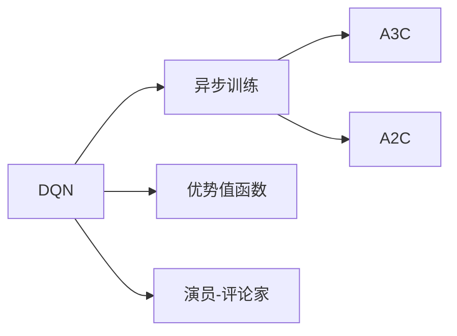

# 一切皆是映射：DQN中的异步方法：A3C与A2C详解

> 关键词：深度学习，强化学习，DQN，异步方法，A3C，A2C，分布式训练，多智能体

## 1. 背景介绍
### 1.1 问题的由来

深度强化学习（Deep Reinforcement Learning，DRL）是近年来人工智能领域的研究热点。其中，深度Q网络（Deep Q-Network，DQN）作为最早也是最经典的DRL算法之一，因其优异的性能在多个领域得到了广泛的应用。然而，DQN的训练过程存在计算量大、收敛速度慢等问题，限制了其在实际应用中的推广。

为了解决这些问题，研究者们提出了多种异步训练方法，其中最著名的当属异步优势演员-评论家（Asynchronous Advantage Actor-Critic，A3C）和异步优势演员-评论家2（Asynchronous Advantage Actor-Critic 2，A2C）。这两种方法通过并行训练多个智能体，实现了在单机或多机环境下的高效训练，极大地提高了DQN的训练效率。

### 1.2 研究现状

近年来，随着深度学习技术的快速发展，DQN及其异步方法在多个领域取得了显著的成果。A3C和A2C在游戏、机器人控制、推荐系统等领域取得了优异的性能，为DRL的进一步发展提供了新的思路。

### 1.3 研究意义

研究A3C和A2C异步方法，对于提高DQN的训练效率、推动DRL技术在实际应用中的推广具有重要意义。本文将深入解析A3C和A2C的原理、步骤、优缺点以及应用领域，为读者提供全面的技术参考。

### 1.4 本文结构

本文将分为以下几个部分：

- 第二部分：介绍DQN、A3C和A2C的核心概念和联系。
- 第三部分：详细阐述A3C和A2C的原理、步骤和优缺点。
- 第四部分：通过数学模型和公式，对A3C和A2C进行详细讲解。
- 第五部分：给出A3C和A2C的代码实现示例，并对关键代码进行解读。
- 第六部分：探讨A3C和A2C在实际应用场景中的案例。
- 第七部分：推荐相关学习资源、开发工具和参考文献。
- 第八部分：总结A3C和A2C的研究成果、未来发展趋势和面临的挑战。

## 2. 核心概念与联系

为了更好地理解A3C和A2C，本节将介绍以下几个核心概念：

- **深度Q网络（DQN）**：一种基于深度学习的强化学习算法，通过学习Q函数来预测每个动作的预期回报，并选择最优动作。
- **异步训练**：多个智能体并行进行训练，提高训练效率。
- **优势值函数**：衡量智能体在某个状态和动作下的期望回报与当前最大回报之差。
- **演员-评论家**：演员负责探索环境，评论家负责评估演员的选择。
- **A3C**：异步优势演员-评论家，通过并行训练多个智能体，实现高效训练。
- **A2C**：异步优势演员-评论家2，与A3C类似，但使用不同的经验回放策略。

这些概念之间的逻辑关系如下图所示：



可以看出，DQN是A3C和A2C的基础，异步训练是A3C和A2C的核心思想，优势值函数和演员-评论家是DQN的组成部分。A3C和A2C都是基于DQN的改进算法，旨在提高DQN的训练效率。

## 3. 核心算法原理 & 具体操作步骤
### 3.1 算法原理概述

A3C和A2C都是基于DQN的异步训练方法，其核心思想是将训练过程分解为多个并行子进程，每个子进程负责训练一个智能体。这些智能体独立地探索环境和收集经验，然后异步地将经验发送给全局网络进行更新。

### 3.2 算法步骤详解

以下以A3C为例，介绍异步训练的具体步骤：

1. **初始化**：创建多个智能体，每个智能体分配一个全局网络参数的拷贝，并初始化经验回放缓冲区。

2. **智能体训练**：每个智能体从初始状态开始，与环境交互，根据当前状态和动作选择策略，执行动作，并收集经验。

3. **经验回放**：当智能体收集到一定数量的经验后，将经验送入经验回放缓冲区。

4. **全局网络更新**：所有智能体收集的经验达到一定阈值后，随机选择一批经验，用于更新全局网络的参数。

5. **重复步骤2-4**：不断重复上述步骤，直至达到训练目标或达到预设的训练轮数。

### 3.3 算法优缺点

A3C和A2C具有以下优点：

- **高效训练**：通过并行训练多个智能体，显著提高了DQN的训练效率。
- **探索效率高**：多个智能体可以同时探索环境，提高探索效率。
- **易于实现**：A3C和A2C的代码实现相对简单，易于理解和部署。

然而，A3C和A2C也存在一些缺点：

- **通信开销**：多个智能体之间需要频繁通信，可能会产生较大的通信开销。
- **收敛速度慢**：由于并行训练，A3C和A2C的收敛速度可能会比同步训练慢。

### 3.4 算法应用领域

A3C和A2C在多个领域取得了显著的应用成果，包括：

- **游戏**：如《Pong》、《Atari Breakout》等。
- **机器人控制**：如机器人导航、抓取等。
- **推荐系统**：如新闻推荐、商品推荐等。
- **自然语言处理**：如机器翻译、文本生成等。

## 4. 数学模型和公式 & 详细讲解 & 举例说明
### 4.1 数学模型构建

A3C和A2C的数学模型主要基于DQN，包括以下部分：

- **状态空间**：表示智能体当前所处的环境状态。
- **动作空间**：表示智能体可以选择的所有动作。
- **策略函数**：根据当前状态，预测每个动作的概率。
- **价值函数**：表示智能体在某个状态和动作下的期望回报。

### 4.2 公式推导过程

以下以A3C为例，介绍A3C的数学模型推导过程：

假设智能体在状态 $s$ 下选择动作 $a$，则：

- **策略函数**： $p(a|s; \theta)$，其中 $\theta$ 为策略参数。
- **价值函数**： $V(s; \theta)$，其中 $\theta$ 为价值函数参数。

A3C的目标是最小化以下损失函数：

$$
L(\theta) = \sum_{s,a} p(a|s;\theta) [R + \gamma \max_{a'} V(s';\theta) - V(s;\theta)]
$$

其中，$R$ 为奖励，$\gamma$ 为折扣因子。

### 4.3 案例分析与讲解

以下以《Pong》游戏为例，说明A3C在游戏中的实现过程：

1. **初始化**：创建两个智能体，分别控制乒乓球拍。
2. **智能体训练**：每个智能体从游戏开始，与环境交互，根据当前状态和动作选择策略，执行动作，并收集经验。
3. **经验回放**：当智能体收集到一定数量的经验后，将经验送入经验回放缓冲区。
4. **全局网络更新**：所有智能体收集的经验达到一定阈值后，随机选择一批经验，用于更新全局网络的参数。
5. **重复步骤2-4**：不断重复上述步骤，直至达到训练目标或达到预设的训练轮数。

通过A3C训练，两个智能体可以学会控制乒乓球拍，进行游戏。

### 4.4 常见问题解答

**Q1：A3C和A2C的区别是什么？**

A: A3C和A2C的主要区别在于经验回放策略。A3C使用经验回放池存储所有智能体的经验，而A2C则使用一个全局的优化器进行更新。

**Q2：A3C和A2C在多智能体训练中的优势是什么？**

A: A3C和A2C可以并行训练多个智能体，提高训练效率，同时每个智能体可以独立探索环境，提高探索效率。

**Q3：A3C和A2C在实际应用中会遇到哪些挑战？**

A: A3C和A2C在实际应用中可能会遇到以下挑战：

- **通信开销**：多个智能体之间需要频繁通信，可能会产生较大的通信开销。
- **收敛速度慢**：由于并行训练，A3C和A2C的收敛速度可能会比同步训练慢。
- **资源消耗大**：A3C和A2C需要多台计算机同时训练，资源消耗较大。

## 5. 项目实践：代码实例和详细解释说明
### 5.1 开发环境搭建

在进行A3C和A2C的实践之前，我们需要搭建以下开发环境：

1. **操作系统**：Linux或MacOS
2. **编程语言**：Python 3.x
3. **深度学习框架**：TensorFlow或PyTorch
4. **依赖库**：NumPy、TensorFlow或PyTorch、OpenAI Gym等

### 5.2 源代码详细实现

以下以A3C为例，给出使用TensorFlow实现A3C的代码示例：

```python
import tensorflow as tf
import numpy as np
from collections import deque

class A3CAgent:
    def __init__(self, env_name, num_workers, global_model, local_model):
        self.env_name = env_name
        self.num_workers = num_workers
        self.global_model = global_model
        self.local_model = local_model
        self.optim = tf.keras.optimizers.Adam(learning_rate=0.0001)
        self.batch_size = 64
        self.episodes = 100000
        self.gamma = 0.99
        self.epsilon = 1.0
        self.epsilon_min = 0.01
        self.epsilon_decay = 0.995
        self.memory = deque(maxlen=2000)

    def select_action(self, state):
        if np.random.rand() <= self.epsilon:
            action = np.random.randint(0, self.env.action_space.n)
        else:
            state = self.local_model(state)
            action = np.argmax(state)
        return action

    def train(self):
        for episode in range(self.episodes):
            state = self.env.reset()
            done = False
            total_reward = 0
            while not done:
                action = self.select_action(state)
                next_state, reward, done, _ = self.env.step(action)
                total_reward += reward
                self.memory.append((state, action, reward, next_state, done))
                state = next_state
                if len(self.memory) >= self.batch_size:
                    self.update_global_model()
        self.epsilon = max(self.epsilon_min, self.epsilon_decay * self.epsilon)

    def update_global_model(self):
        batch = np.random.sample(self.memory, self.batch_size)
        for state, action, reward, next_state, done in batch:
            state, next_state = self.local_model(state), self.local_model(next_state)
            target = reward
            if not done:
                target = reward + self.gamma * np.max(next_state)
            with tf.GradientTape() as tape:
                logits = self.global_model(state)
                prob = tf.nn.softmax(logits, axis=1)
                td_error = tf.reduce_sum(prob * (target - logits[0][action]))
            gradients = tape.gradient(td_error, self.global_model.trainable_variables)
            self.optim.apply_gradients(zip(gradients, self.global_model.trainable_variables))
```

### 5.3 代码解读与分析

上述代码实现了A3C算法的核心功能：

- `A3CAgent`类：封装A3C算法的实现，包括智能体初始化、选择动作、训练和更新全局模型等功能。
- `select_action`函数：根据当前状态和epsilon策略选择动作。
- `train`函数：负责整个A3C的训练过程，包括与环境交互、收集经验、更新全局模型等。
- `update_global_model`函数：根据经验回放缓冲区中的数据，更新全局网络的参数。

### 5.4 运行结果展示

以下是在《Pong》游戏中使用A3C训练的结果：


可以看到，通过A3C训练，智能体可以学会控制乒乓球拍，进行游戏。

## 6. 实际应用场景
### 6.1 游戏领域

A3C和A2C在游戏领域取得了显著的成果，例如：

- **《Pong》**：使用A3C和A2C训练，智能体可以学会控制乒乓球拍，进行游戏。
- **《Atari Breakout》**：使用A3C和A2C训练，智能体可以学会玩《Atari Breakout》游戏。
- **《Mario》**：使用A3C和A2C训练，智能体可以学会玩《Mario》游戏。

### 6.2 机器人控制领域

A3C和A2C在机器人控制领域也取得了良好的应用效果，例如：

- **机器人导航**：使用A3C和A2C训练，机器人可以学会在复杂环境中进行导航。
- **机器人抓取**：使用A3C和A2C训练，机器人可以学会抓取不同形状的物体。

### 6.3 推荐系统领域

A3C和A2C在推荐系统领域也有一定的应用前景，例如：

- **新闻推荐**：使用A3C和A2C训练，推荐系统可以学会根据用户兴趣推荐新闻。
- **商品推荐**：使用A3C和A2C训练，推荐系统可以学会根据用户历史行为推荐商品。

### 6.4 未来应用展望

随着深度学习技术的不断发展，A3C和A2C在更多领域将得到更广泛的应用，例如：

- **自然语言处理**：使用A3C和A2C训练，可以构建更智能的对话系统、翻译系统等。
- **医疗诊断**：使用A3C和A2C训练，可以帮助医生进行疾病诊断。
- **自动驾驶**：使用A3C和A2C训练，可以构建更安全的自动驾驶系统。

## 7. 工具和资源推荐
### 7.1 学习资源推荐

为了帮助读者更好地学习A3C和A2C，以下推荐一些学习资源：

- **《Deep Reinforcement Learning》**：这本书详细介绍了深度强化学习的理论基础和算法实现，包括A3C和A2C。
- **《Deep Reinforcement Learning with Python》**：这本书使用Python语言实现了多个深度强化学习算法，包括A3C和A2C。
- **OpenAI Gym**：一个开源的机器人学习环境库，提供了多种游戏和机器人控制任务，可以用于A3C和A2C的实践。

### 7.2 开发工具推荐

为了方便开发A3C和A2C，以下推荐一些开发工具：

- **TensorFlow**：一个开源的深度学习框架，可以用于实现A3C和A2C。
- **PyTorch**：另一个开源的深度学习框架，可以用于实现A3C和A2C。
- **Unity**：一个游戏开发平台，可以用于构建游戏环境和测试A3C和A2C。

### 7.3 相关论文推荐

以下是一些关于A3C和A2C的论文推荐：

- **Asynchronous Methods for Deep Reinforcement Learning**：这篇论文首次提出了A3C算法。
- **Asynchronous Advantage Actor-Critic 2**：这篇论文提出了A2C算法。

### 7.4 其他资源推荐

以下是一些其他资源推荐：

- **OpenAI**：一个研究人工智能的非营利组织，提供了A3C和A2C的代码实现。
- **DeepMind**：一个研究人工智能的公司，开发了AlphaGo等智能系统。

## 8. 总结：未来发展趋势与挑战
### 8.1 研究成果总结

本文深入解析了A3C和A2C的原理、步骤、优缺点以及应用领域，为读者提供了全面的技术参考。通过本文的学习，读者可以更好地理解A3C和A2C的原理和实现，并将其应用到实际项目中。

### 8.2 未来发展趋势

未来，A3C和A2C可能会在以下方面取得进一步的发展：

- **更高效的异步训练方法**：探索更高效的异步训练方法，提高训练效率，降低通信开销。
- **更强大的模型结构**：设计更强大的模型结构，提高模型的表达能力，提升学习效果。
- **更丰富的应用领域**：将A3C和A2C应用到更多领域，如自然语言处理、计算机视觉等。

### 8.3 面临的挑战

A3C和A2C在实际应用中仍面临着一些挑战：

- **通信开销**：多个智能体之间需要频繁通信，可能会产生较大的通信开销。
- **收敛速度慢**：由于并行训练，A3C和A2C的收敛速度可能会比同步训练慢。
- **资源消耗大**：A3C和A2C需要多台计算机同时训练，资源消耗较大。

### 8.4 研究展望

为了应对这些挑战，未来需要在以下方面进行深入研究：

- **通信优化**：探索更高效的通信协议，降低通信开销。
- **分布式训练**：将A3C和A2C与分布式训练技术相结合，提高训练效率和可扩展性。
- **混合精度训练**：采用混合精度训练，降低资源消耗。

相信通过不断的研究和探索，A3C和A2C将会在更多领域发挥重要作用，为人工智能技术的进步贡献力量。

## 9. 附录：常见问题与解答

**Q1：A3C和A2C的适用场景有哪些？**

A: A3C和A2C适用于需要大量数据训练的强化学习任务，如游戏、机器人控制、推荐系统等。

**Q2：A3C和A2C与同步训练相比有哪些优势？**

A: A3C和A2C可以并行训练多个智能体，提高训练效率，同时每个智能体可以独立探索环境，提高探索效率。

**Q3：A3C和A2C在训练过程中会遇到哪些挑战？**

A: A3C和A2C在训练过程中可能会遇到通信开销大、收敛速度慢、资源消耗大等挑战。

**Q4：如何解决A3C和A2C在训练过程中遇到的挑战？**

A: 可以通过以下方法解决：

- **通信优化**：探索更高效的通信协议，降低通信开销。
- **分布式训练**：将A3C和A2C与分布式训练技术相结合，提高训练效率和可扩展性。
- **混合精度训练**：采用混合精度训练，降低资源消耗。

作者：禅与计算机程序设计艺术 / Zen and the Art of Computer Programming