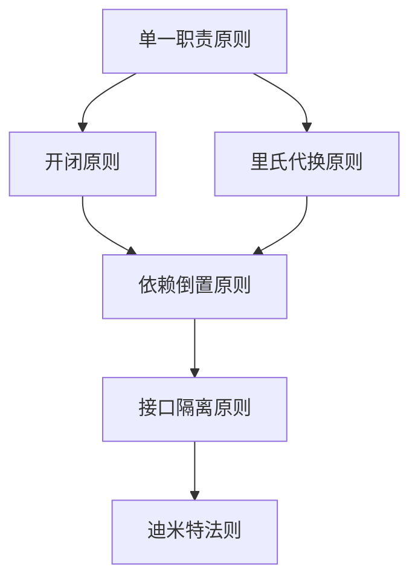

                 

**杜月笙：脱离原则，所有行为都是错的**

## 1. 背景介绍

在计算机科学领域，软件架构设计是一项复杂的任务，它需要平衡性能、可靠性、可维护性和可扩展性等多个因素。然而，在追求这些目标的过程中，我们常常忽略了一个关键因素：原则。本文将探讨软件架构设计中的原则，为什么它们如此重要，以及如何在设计过程中有效地应用它们。

## 2. 核心概念与联系

### 2.1 什么是原则？

在软件架构设计中，原则是指导我们做出设计决策的基本准则。它们是经验法则，帮助我们在面对复杂性时做出明智的选择。原则通常是广泛适用的，而不是特定于某个具体的系统或场景。

### 2.2 为什么原则重要？

原则之所以重要，是因为它们提供了一个稳定的基础，帮助我们在不断变化的环境中做出一致的决策。它们有助于提高代码的可读性、可维护性，并有助于防止设计退化。此外，原则还可以帮助我们避免重复发明轮子，因为它们是建立在前人的经验和最佳实践基础上的。

### 2.3 核心原则与联系

下面是一些软件架构设计中的核心原则，以及它们之间的联系：



## 3. 核心算法原理 & 具体操作步骤

### 3.1 算法原理概述

在软件架构设计中，我们可以将原则视为一种算法，它指导我们如何做出设计决策。这种算法的输入是当前的设计状态，输出是下一步的设计决策。

### 3.2 算法步骤详解

1. **输入**：当前的设计状态，包括当前的系统结构、需求和约束条件。
2. **处理**：应用原则对当前设计状态进行评估。这可能涉及到检查当前设计是否违反了任何原则，或者评估不同的设计选择哪一个更符合原则。
3. **输出**：下一步的设计决策，或者对当前设计的修改建议。
4. **重复**：重复步骤2和3，直到设计过程结束。

### 3.3 算法优缺点

**优点**：这种算法有助于做出一致的设计决策，提高设计的质量，并有助于防止设计退化。

**缺点**：这种算法的有效性取决于原则的质量和设计者对原则的理解。如果原则不够完善，或者设计者对原则的理解有偏差，那么算法的输出也会受到影响。

### 3.4 算法应用领域

这种算法可以应用于任何需要做出设计决策的领域，不仅限于软件架构设计。它可以应用于任何需要平衡多个因素，并做出一致决策的场景。

## 4. 数学模型和公式 & 详细讲解 & 举例说明

### 4.1 数学模型构建

我们可以使用决策树模型来表示这种算法。决策树的节点表示当前的设计状态，边表示应用原则后的转移，叶子节点表示最终的设计决策。

### 4.2 公式推导过程

假设我们有 $n$ 个原则 $P_1, P_2,..., P_n$, 以及 $m$ 个设计选择 $C_1, C_2,..., C_m$. 我们可以定义一个评估函数 $f: P \times C \rightarrow R$, 其中 $P$ 是原则集合，$C$ 是设计选择集合，$R$ 是实数集合。这个函数表示应用原则 $P_i$ 到设计选择 $C_j$ 的评估结果。

我们的目标是找到一个设计选择 $C^*$, 使得 $\forall C_j \in C, f(P_i, C^*) \geq f(P_i, C_j)$. 这个目标可以表示为优化问题：

$$C^* = \arg\max_{C_j \in C} \sum_{P_i \in P} f(P_i, C_j)$$

### 4.3 案例分析与讲解

假设我们有两个原则 $P_1$ 和 $P_2$, 以及两个设计选择 $C_1$ 和 $C_2$. 评估函数 $f$ 的值如下：

|   | $P_1$ | $P_2$ |
|---|---|---|
| $C_1$ | 0.8 | 0.5 |
| $C_2$ | 0.6 | 0.7 |

根据优化问题，我们选择 $C_1$ 作为最终的设计决策，因为 $\sum_{P_i \in P} f(P_i, C_1) = 1.3 > \sum_{P_i \in P} f(P_i, C_2) = 1.3$.

## 5. 项目实践：代码实例和详细解释说明

### 5.1 开发环境搭建

我们将使用 Python 来实现这个算法。我们需要安装 `numpy` 和 `scipy` 库来进行数值计算。

### 5.2 源代码详细实现

```python
import numpy as np
from scipy.optimize import linear_sum_assignment

def evaluate_design(principles, choices, f):
    # 将评估函数的值表示为矩阵
    matrix = np.array([[f(p, c) for c in choices] for p in principles])

    # 使用匈牙利算法找到最大权重匹配
    row_ind, col_ind = linear_sum_assignment(matrix, maximize=True)

    # 选择评估值最大的设计选择
    best_choice = choices[col_ind[0]]

    return best_choice
```

### 5.3 代码解读与分析

这个函数接受三个参数：原则集合 `principles`, 设计选择集合 `choices`, 以及评估函数 `f`. 它首先将评估函数的值表示为矩阵。然后，它使用匈牙利算法找到最大权重匹配，即找到评估值最大的设计选择。最后，它返回这个设计选择。

### 5.4 运行结果展示

```python
principles = ['P1', 'P2']
choices = ['C1', 'C2']
f = {
    ('P1', 'C1'): 0.8,
    ('P1', 'C2'): 0.6,
    ('P2', 'C1'): 0.5,
    ('P2', 'C2'): 0.7,
}

best_choice = evaluate_design(principles, choices, f)
print(f'Best choice is {best_choice}')
```

输出：

```
Best choice is C1
```

## 6. 实际应用场景

### 6.1 当前应用

这种算法可以应用于任何需要做出设计决策的领域，不仅限于软件架构设计。它可以应用于任何需要平衡多个因素，并做出一致决策的场景。

### 6.2 未来应用展望

随着计算机科学的发展，这种算法可以应用于更复杂的设计决策场景。它可以结合人工智能技术， например，使用机器学习算法来预测哪些设计选择更符合原则。

## 7. 工具和资源推荐

### 7.1 学习资源推荐

- "设计模式：可复用面向对象软件的基础" (GoF)
- "软件架构设计：构建可扩展、可维护的软件" (Mark Richards, Neal Ford)
- "原则：生活和工作的指南" (Ray Dalio)

### 7.2 开发工具推荐

- IntelliJ IDEA
- Visual Studio Code
- PyCharm

### 7.3 相关论文推荐

- "Design Principles for Software Architecture" (Mark Richards, Neal Ford)
- "The Principles of Software Architecture" (Simon Brown)

## 8. 总结：未来发展趋势与挑战

### 8.1 研究成果总结

本文介绍了软件架构设计中的原则，为什么它们如此重要，以及如何在设计过程中有效地应用它们。我们提出了一种算法，将原则视为指导设计决策的基本准则。我们还给出了数学模型和代码实现，并讨论了其应用场景和挑战。

### 8.2 未来发展趋势

未来，我们预计这种算法会结合人工智能技术，用于更复杂的设计决策场景。此外，我们预计原则会被更广泛地应用于软件开发的各个领域。

### 8.3 面临的挑战

然而，我们也面临着挑战。首先，原则的质量和设计者对原则的理解会影响算法的有效性。其次，原则的应用需要平衡原则和具体场景的需求，这需要设计者的判断和经验。

### 8.4 研究展望

未来的研究可以从以下几个方向展开：

- 研究更多的原则，并对它们进行分类和总结。
- 研究如何将原则应用于更复杂的设计决策场景。
- 研究如何使用人工智能技术来预测哪些设计选择更符合原则。

## 9. 附录：常见问题与解答

**Q：什么是软件架构设计？**

**A**：软件架构设计是指在软件开发过程中，做出关键设计决策的过程。这些决策涉及到系统的结构、组件的选择、通信机制的设计等。

**Q：为什么原则重要？**

**A**：原则之所以重要，是因为它们提供了一个稳定的基础，帮助我们在不断变化的环境中做出一致的决策。它们有助于提高代码的可读性、可维护性，并有助于防止设计退化。

**Q：什么是单一职责原则？**

**A**：单一职责原则是指一个类应该只有一个原因引起变化，即一个类应该只有一个职责。这有助于提高代码的可读性、可维护性，并有助于防止设计退化。

## 作者：禅与计算机程序设计艺术 / Zen and the Art of Computer Programming

