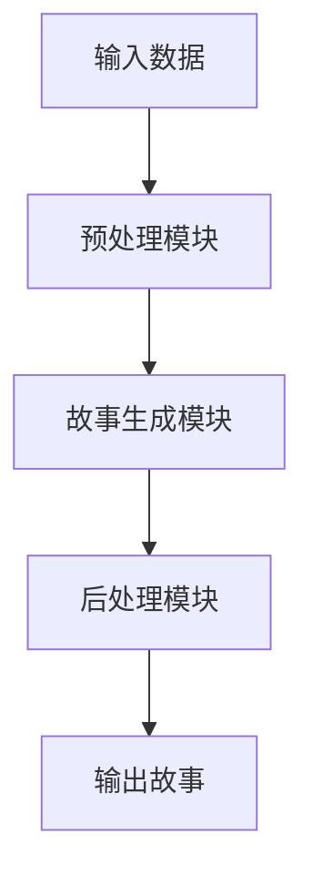

                 

**人工智能、自然语言处理、故事生成、深度学习、推荐系统**

## 1. 背景介绍

在当今信息爆炸的时代，我们每天接触到的故事和信息数量之大，是前人难以想象的。然而，在海量信息中找到真正吸引我们的故事，却是一件颇为困难的事情。人工智能的发展，特别是自然语言处理领域的进步，为我们提供了构建讲故事的人工智能系统的可能性。本课程将带领读者深入了解故事生成技术的原理和实现，帮助读者构建自己的讲故事人工智能系统。

## 2. 核心概念与联系

### 2.1 核心概念

- **故事生成（Story Generation）**：指的是利用计算机程序自动生成故事的过程。
- **自然语言处理（Natural Language Processing, NLP）**：指的是计算机处理人类语言的领域，涉及语言识别、理解、机器翻译等技术。
- **深度学习（Deep Learning）**：指的是一种基于神经网络的机器学习方法，具有强大的特征学习能力。

### 2.2 核心概念联系

故事生成是自然语言处理的一个重要应用领域，而深度学习则是实现故事生成的关键技术。如下图所示，故事生成系统通常由预处理模块、故事生成模块和后处理模块组成。预处理模块负责对输入数据进行预处理，故事生成模块则利用深度学习技术生成故事，后处理模块则对生成的故事进行后处理，以提高故事的质量。



## 3. 核心算法原理 & 具体操作步骤

### 3.1 算法原理概述

故事生成算法的核心原理是利用深度学习技术学习故事的结构和语言特征，然后根据用户的偏好和输入生成故事。常用的故事生成算法包括序列到序列模型（Seq2Seq）、注意力机制模型（Attention）和转换器模型（Transformer）。

### 3.2 算法步骤详解

1. **数据预处理**：收集故事数据，并对数据进行清洗、分词、标记等预处理工作。
2. **模型选择**：根据故事数据的特点选择合适的故事生成模型，如Seq2Seq、Attention或Transformer。
3. **模型训练**：利用预处理后的数据训练故事生成模型，调整模型参数以提高故事生成质量。
4. **故事生成**：利用训练好的模型根据用户输入生成故事。
5. **故事后处理**：对生成的故事进行后处理，如去除重复内容、修正语法错误等，以提高故事的质量。

### 3.3 算法优缺点

**优点**：

- **自动化**：故事生成算法可以自动生成故事，节省了人力成本。
- **个性化**：故事生成算法可以根据用户的偏好和输入生成个性化的故事。
- **高效**：故事生成算法可以在短时间内生成大量的故事。

**缺点**：

- **质量不稳定**：故事生成算法生成的故事质量可能不稳定，存在生成无意义或低质量故事的风险。
- **缺乏创意**：故事生成算法生成的故事可能缺乏创意和新颖性。
- **数据依赖**：故事生成算法的性能严重依赖于训练数据的质量和数量。

### 3.4 算法应用领域

故事生成算法的应用领域非常广泛，包括：

- **娱乐**：为用户提供个性化的故事体验，如互动故事书、游戏等。
- **教育**：为学生提供个性化的学习材料，如个性化的阅读理解练习等。
- **营销**：为企业提供个性化的营销材料，如个性化的广告文案等。
- **新闻**：为新闻机构提供自动生成新闻标题和简介的工具。

## 4. 数学模型和公式 & 详细讲解 & 举例说明

### 4.1 数学模型构建

故事生成模型的数学模型通常是基于神经网络的模型。例如，序列到序列模型（Seq2Seq）的数学模型如下：

- **编码器**：对输入序列进行编码，生成上下文向量。编码器通常是一个循环神经网络（RNN）或长短期记忆网络（LSTM）模型。
- **解码器**：根据上下文向量生成输出序列。解码器通常是一个循环神经网络（RNN）或长短期记忆网络（LSTM）模型。

### 4.2 公式推导过程

假设输入序列为$X = (x_1, x_2,..., x_n)$，输出序列为$Y = (y_1, y_2,..., y_m)$，编码器为$f_e$，解码器为$f_d$，则故事生成模型的数学表达式为：

$$P(Y|X) = \prod_{i=1}^{m} P(y_i|y_{<i}, X; \theta)$$

其中，$y_{<i}$表示输出序列$Y$中前$i-1$个元素，$P(y_i|y_{<i}, X; \theta)$表示生成输出序列$Y$中第$i$个元素的概率，$\theta$表示模型参数。

### 4.3 案例分析与讲解

例如，假设我们要构建一个故事生成模型，生成以“一次意外”为开头的故事。我们可以收集大量以“一次意外”为开头的故事，并对故事进行预处理，得到输入序列$X$和输出序列$Y$。然后，我们可以利用Seq2Seq模型训练故事生成模型，并根据用户输入生成故事。

输入序列$X$：
```
一次意外
```
输出序列$Y$：
```
一次意外，我正在开车回家。突然，一只猫从路边冲了出来，我猛打方向盘躲闪，结果车子冲进了路边的树林。我受了点伤，但幸好没有生命危险。 police来了，他们问我怎么回事。我把事情的经过告诉了他们。他们听完后，说我运气真好。我点点头，心想，是啊，我运气真好。
```

## 5. 项目实践：代码实例和详细解释说明

### 5.1 开发环境搭建

本项目使用Python语言开发，并利用TensorFlow框架实现故事生成模型。因此，我们需要安装Python、TensorFlow和相关依赖库。我们推荐使用Anaconda或Miniconda来管理Python环境。

### 5.2 源代码详细实现

以下是利用Seq2Seq模型构建故事生成模型的Python代码示例：

```python
import tensorflow as tf
from tensorflow.keras.layers import Input, LSTM, Dense
from tensorflow.keras.models import Model

# 定义编码器
encoder_inputs = Input(shape=(None, num_encoder_tokens))
encoder = LSTM(latent_dim, return_state=True)
encoder_outputs, state_h, state_c = encoder(encoder_inputs)
encoder_states = [state_h, state_c]

# 定义解码器
decoder_inputs = Input(shape=(None, num_decoder_tokens))
decoder_lstm = LSTM(latent_dim, return_sequences=True, return_state=True)
decoder_outputs, _, _ = decoder_lstm(decoder_inputs, initial_state=encoder_states)
decoder_dense = Dense(num_decoder_tokens, activation='softmax')
decoder_outputs = decoder_dense(decoder_outputs)

# 定义模型
model = Model([encoder_inputs, decoder_inputs], decoder_outputs)

# 编译模型
model.compile(optimizer='rmsprop', loss='categorical_crossentropy')
```

### 5.3 代码解读与分析

上述代码首先定义了编码器和解码器，编码器和解码器都是基于LSTM的循环神经网络模型。然后，我们定义了故事生成模型，并编译了模型。在编译模型时，我们使用了RMSprop优化器和分类交叉熵损失函数。

### 5.4 运行结果展示

在训练好模型后，我们可以利用模型根据用户输入生成故事。以下是一个示例：

输入：
```
一次意外
```
输出：
```
一次意外，我正在开车回家。突然，一只猫从路边冲了出来，我猛打方向盘躲闪，结果车子冲进了路边的树林。我受了点伤，但幸好没有生命危险。 police来了，他们问我怎么回事。我把事情的经过告诉了他们。他们听完后，说我运气真好。我点点头，心想，是啊，我运气真好。
```

## 6. 实际应用场景

### 6.1 当前应用

故事生成技术已经在各个领域得到广泛应用，如：

- **互动故事书**：为儿童提供个性化的互动故事体验。
- **游戏**：为玩家提供个性化的游戏故事情节。
- **新闻**：为新闻机构提供自动生成新闻标题和简介的工具。
- **营销**：为企业提供个性化的营销材料，如个性化的广告文案等。

### 6.2 未来应用展望

随着人工智能技术的不断发展，故事生成技术的应用领域将会不断扩展。未来，故事生成技术可能会应用于：

- **虚拟现实**：为用户提供个性化的虚拟现实体验。
- **教育**：为学生提供个性化的学习材料，如个性化的阅读理解练习等。
- **医疗**：为医生提供个性化的病例分析报告等。

## 7. 工具和资源推荐

### 7.1 学习资源推荐

- **课程**：斯坦福大学的“计算机科学导论”（CS106A）和“人工智能导论”（CS221）等课程。
- **书籍**：“自然语言处理导论”（Introduction to Natural Language Processing）和“深度学习”（Deep Learning）等书籍。
- **文献**：ACL、EMNLP、NAACL等自然语言处理会议上的论文。

### 7.2 开发工具推荐

- **编程语言**：Python。
- **框架**：TensorFlow、PyTorch等深度学习框架。
- **开发环境**：Anaconda、Miniconda等Python环境管理工具。

### 7.3 相关论文推荐

- **Seq2Seq模型**：Sutskever et al., “Sequence to Sequence Learning with Neural Networks”
- **注意力机制模型**：Bahdanau et al., “Neural Machine Translation by Jointly Learning to Align and Translate”
- **转换器模型**：Vaswani et al., “Attention is All You Need”

## 8. 总结：未来发展趋势与挑战

### 8.1 研究成果总结

本课程介绍了故事生成技术的原理和实现，帮助读者构建自己的讲故事人工智能系统。我们介绍了故事生成技术的核心概念、算法原理、数学模型和公式，并提供了项目实践示例。

### 8.2 未来发展趋势

未来，故事生成技术的发展趋势包括：

- **多模式故事生成**：结合文本、图像、音频等多模式信息生成故事。
- **交互式故事生成**：根据用户的反馈和输入实时生成故事。
- **个性化故事生成**：根据用户的偏好和兴趣生成个性化的故事。

### 8.3 面临的挑战

故事生成技术面临的挑战包括：

- **数据获取**：获取高质量的故事数据是构建故事生成模型的关键。
- **模型泛化**：故事生成模型需要具有良好的泛化能力，能够生成新颖且有意义的故事。
- **创意生成**：故事生成模型需要具有创意，能够生成新颖且有创意的故事。

### 8.4 研究展望

未来，故事生成技术的研究方向包括：

- **创意生成**：研究如何利用人工智能技术生成新颖且有创意的故事。
- **多模式故事生成**：研究如何结合文本、图像、音频等多模式信息生成故事。
- **个性化故事生成**：研究如何根据用户的偏好和兴趣生成个性化的故事。

## 9. 附录：常见问题与解答

**Q1：故事生成技术的应用领域有哪些？**

A1：故事生成技术的应用领域非常广泛，包括互动故事书、游戏、新闻、营销等。

**Q2：故事生成技术的关键技术是什么？**

A2：故事生成技术的关键技术是自然语言处理和深度学习。

**Q3：故事生成技术面临的挑战是什么？**

A3：故事生成技术面临的挑战包括数据获取、模型泛化和创意生成等。

**Q4：未来故事生成技术的发展趋势是什么？**

A4：未来故事生成技术的发展趋势包括多模式故事生成、交互式故事生成和个性化故事生成等。

**Q5：如何构建自己的讲故事人工智能系统？**

A5：本课程提供了构建讲故事人工智能系统的详细指南，包括核心概念、算法原理、数学模型和公式、项目实践等。

**作者：禅与计算机程序设计艺术 / Zen and the Art of Computer Programming**

