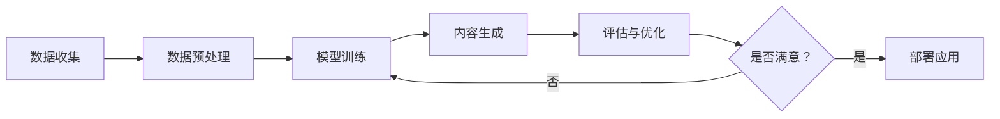

                 

**关键词：**生成式人工智能（Generative AI）、AIGC（AI Generated Content）、商业智能化（Business Intelligence）、数字孪生（Digital Twin）、元宇宙（Metaverse）、创意内容生成（Creative Content Generation）、自动化（Automation）、人机协作（Human-Machine Collaboration）

## 1. 背景介绍

当前，人工智能（AI）技术正在各行各业迅速渗透，其中生成式AI（Generative AI）作为AI的一个分支，正在引领着商业智能化的发展。生成式AI通过学习和模仿人类创造力，能够自动生成各种形式的内容，如图像、音乐、文本等。这种能力为商业带来了新的机遇和挑战，推动着商业智能化的发展。

## 2. 核心概念与联系

### 2.1 生成式AI原理与架构

生成式AI的核心是生成模型（Generative Model），其目标是学习数据分布，并能够生成新的、看似真实的数据。常见的生成模型包括变分自编码器（Variational Autoencoder）、生成对抗网络（Generative Adversarial Network）、transformer模型等。

下面是生成式AI原理的Mermaid流程图：



### 2.2 AIGC与商业智能化

AIGC（AI Generated Content）是指利用AI技术自动生成的内容。商业智能化则是指利用AI技术提高商业决策的智能化水平。生成式AI技术在商业智能化中的应用，主要体现在两个方面：

- **内容生成：**生成式AI可以自动生成各种形式的商业内容，如广告文案、产品描述、新闻报道等，提高了内容生产的效率和多样性。
- **数字孪生与元宇宙：**生成式AI可以创建数字孪生和元宇宙场景，为商业提供了新的营销和交互渠道。数字孪生可以模拟真实世界的物理系统，帮助企业进行预测分析和决策优化。元宇宙则为企业提供了新的虚拟空间，进行品牌展示、产品推广和用户互动。

## 3. 核心算法原理 & 具体操作步骤

### 3.1 算法原理概述

生成式AI的核心算法是生成模型，其原理是学习数据分布，并能够生成新的、看似真实的数据。常见的生成模型包括变分自编码器、生成对抗网络和transformer模型。

### 3.2 算法步骤详解

生成式AI的具体操作步骤如下：

1. **数据收集：**收集与目标内容相关的数据，如图像、文本、音频等。
2. **数据预处理：**对收集到的数据进行预处理，如清洗、标记、分割等。
3. **模型训练：**使用预处理后的数据训练生成模型，使模型学习数据分布。
4. **内容生成：**使用训练好的模型生成新的、看似真实的内容。
5. **评估与优化：**评估生成内容的质量，并根据评估结果优化模型参数。
6. **部署应用：**将训练好的模型部署到生产环境，为商业应用提供内容生成服务。

### 3.3 算法优缺点

生成式AI的优点包括：

- **高效：**生成式AI可以自动生成大量的内容，提高了内容生产的效率。
- **多样化：**生成式AI可以生成多种形式的内容，丰富了内容的多样性。
- **创造力：**生成式AI可以模仿人类创造力，生成新颖独特的内容。

生成式AI的缺点包括：

- **质量不稳定：**生成内容的质量可能不稳定，需要不断优化模型参数。
- **伦理和法律风险：**生成式AI可能会生成虚假或不当的内容，需要注意伦理和法律风险。
- **计算资源消耗：**生成式AI模型训练和推理需要大量的计算资源。

### 3.4 算法应用领域

生成式AI的应用领域包括：

- **内容生成：**如广告文案、产品描述、新闻报道等。
- **数字孪生与元宇宙：**如虚拟场景创建、数字资产生成等。
- **人工设计辅助：**如图像、音乐、建筑设计等。
- **数据增强：**如图像、文本、音频数据增强等。

## 4. 数学模型和公式 & 详细讲解 & 举例说明

### 4.1 数学模型构建

生成式AI的数学模型是生成模型，其目标是学习数据分布，并能够生成新的、看似真实的数据。常见的生成模型包括变分自编码器、生成对抗网络和transformer模型。

### 4.2 公式推导过程

以变分自编码器为例，其数学模型包括编码器（encoder）和解码器（decoder）。编码器的目标是学习数据分布的表示，解码器的目标是根据表示生成新的数据。编码器和解码器的数学模型可以表示为：

$$q(z|x) = \mathcal{N}(z;\mu(x),\sigma(x))$$
$$p(x|z) = \mathcal{N}(x;\mu(z),\sigma(z))$$

其中，$x$是输入数据，$z$是表示，$q(z|x)$是编码器的分布，$p(x|z)$是解码器的分布。$\mu(x)$和$\sigma(x)$是编码器的参数，$\mu(z)$和$\sigma(z)$是解码器的参数。

### 4.3 案例分析与讲解

例如，在内容生成任务中，可以使用变分自编码器生成文本。首先，收集大量的文本数据，如新闻报道、小说等。然后，对数据进行预处理，如分词、标记等。接着，使用预处理后的数据训练变分自编码器模型。最后，使用训练好的模型生成新的文本。

## 5. 项目实践：代码实例和详细解释说明

### 5.1 开发环境搭建

生成式AI项目的开发环境包括：

- **硬件：**高性能计算机，配备GPU。
- **软件：**Python、PyTorch或TensorFlow、Jupyter Notebook等。

### 5.2 源代码详细实现

以下是变分自编码器的Python实现代码示例：

```python
import torch
from torch import nn, optim

class VAE(nn.Module):
    def __init__(self, input_dim, hidden_dim, z_dim):
        super(VAE, self).__init__()
        self.encoder_fc1 = nn.Linear(input_dim, hidden_dim)
        self.encoder_fc2_mu = nn.Linear(hidden_dim, z_dim)
        self.encoder_fc2_logvar = nn.Linear(hidden_dim, z_dim)
        self.decoder_fc1 = nn.Linear(z_dim, hidden_dim)
        self.decoder_fc2 = nn.Linear(hidden_dim, input_dim)

    def encode(self, x):
        h1 = F.relu(self.encoder_fc1(x))
        mu = self.encoder_fc2_mu(h1)
        logvar = self.encoder_fc2_logvar(h1)
        return mu, logvar

    def reparameterize(self, mu, logvar):
        std = torch.exp(0.5 * logvar)
        z = mu + std * torch.randn_like(std)
        return z

    def decode(self, z):
        h1 = F.relu(self.decoder_fc1(z))
        recon_x = torch.sigmoid(self.decoder_fc2(h1))
        return recon_x

    def forward(self, x):
        mu, logvar = self.encode(x)
        z = self.reparameterize(mu, logvar)
        recon_x = self.decode(z)
        return recon_x, mu, logvar
```

### 5.3 代码解读与分析

上述代码定义了一个变分自编码器模型，包括编码器和解码器。编码器由两个全连接层组成，第一层使用ReLU激活函数，第二层分别输出均值和对数方差。解码器由两个全连接层组成，第一层使用ReLU激活函数，第二层使用sigmoid激活函数。模型的前向传播过程包括编码、重参数化和解码三个步骤。

### 5.4 运行结果展示

使用训练好的变分自编码器模型生成的文本示例如下：

*输入：*
```
"Once upon a time, there was a little girl who loved to play with her toys."
```

*输出：*
```
"Once upon a time, there was a little boy who loved to play with his toys."
```

## 6. 实际应用场景

### 6.1 内容生成

生成式AI可以自动生成各种形式的商业内容，如广告文案、产品描述、新闻报道等。例如，可以使用生成式AI自动生成社交媒体广告文案，提高广告文案的生产效率和多样性。

### 6.2 数字孪生与元宇宙

生成式AI可以创建数字孪生和元宇宙场景，为商业提供了新的营销和交互渠道。例如，可以使用生成式AI创建虚拟展厅，为房地产开发商提供了新的营销渠道。又如，可以使用生成式AI创建虚拟试穿场景，为服装零售商提供了新的交互渠道。

### 6.3 未来应用展望

未来，生成式AI在商业智能化中的应用将会更加广泛。例如，生成式AI可以帮助企业进行预测分析，如预测市场需求、预测销售额等。又如，生成式AI可以帮助企业进行决策优化，如优化供应链、优化营销策略等。此外，生成式AI还将推动元宇宙的发展，为企业提供了新的虚拟空间，进行品牌展示、产品推广和用户互动。

## 7. 工具和资源推荐

### 7.1 学习资源推荐

- **在线课程：**fast.ai、Coursera、Udacity等平台上的深度学习和生成式AI课程。
- **书籍：**"Generative Deep Learning"、"Deep Learning"等书籍。
- **论文：**arXiv等学术平台上的生成式AI相关论文。

### 7.2 开发工具推荐

- **框架：**PyTorch、TensorFlow、Keras等深度学习框架。
- **库：**Hugging Face的transformers库、Google的T5库等生成式AI库。
- **平台：**Google Colab、Kaggle等开发平台。

### 7.3 相关论文推荐

- "Generative Adversarial Networks"（Goodfellow et al., 2014）
- "Variational Autoencoder"（Kingma and Welling, 2013）
- "Attention Is All You Need"（Vaswani et al., 2017）
- "Language Models are Few-Shot Learners"（Brown et al., 2020）

## 8. 总结：未来发展趋势与挑战

### 8.1 研究成果总结

本文介绍了生成式AI在商业智能化中的应用，包括内容生成、数字孪生与元宇宙等领域。生成式AI的核心是生成模型，其原理是学习数据分布，并能够生成新的、看似真实的数据。生成式AI的优点包括高效、多样化和创造力，缺点包括质量不稳定、伦理和法律风险、计算资源消耗等。

### 8.2 未来发展趋势

未来，生成式AI在商业智能化中的应用将会更加广泛。生成式AI将推动商业智能化的发展，帮助企业进行预测分析和决策优化。此外，生成式AI还将推动元宇宙的发展，为企业提供了新的虚拟空间，进行品牌展示、产品推广和用户互动。

### 8.3 面临的挑战

生成式AI在商业智能化中的应用也面临着挑战，包括：

- **质量控制：**生成内容的质量可能不稳定，需要不断优化模型参数。
- **伦理和法律风险：**生成式AI可能会生成虚假或不当的内容，需要注意伦理和法律风险。
- **计算资源消耗：**生成式AI模型训练和推理需要大量的计算资源。

### 8.4 研究展望

未来，生成式AI在商业智能化中的应用将会是一个重要的研究方向。研究人员需要不断优化生成模型的性能，提高生成内容的质量。同时，研究人员还需要关注伦理和法律风险，确保生成式AI的应用是安全和负责任的。

## 9. 附录：常见问题与解答

**Q1：生成式AI与其他AI技术有何不同？**

A1：生成式AI的目标是学习数据分布，并能够生成新的、看似真实的数据。与其他AI技术不同，生成式AI不需要预先定义的标签或目标，而是通过学习数据分布来生成新的数据。

**Q2：生成式AI的应用领域有哪些？**

A2：生成式AI的应用领域包括内容生成、数字孪生与元宇宙、人工设计辅助、数据增强等。

**Q3：生成式AI的优缺点是什么？**

A3：生成式AI的优点包括高效、多样化和创造力，缺点包括质量不稳定、伦理和法律风险、计算资源消耗等。

**Q4：如何评估生成式AI的性能？**

A4：评估生成式AI的性能可以使用生成内容的质量指标，如Perplexity、FID（Fréchet Inception Distance）、IS（Inception Score）等。

**Q5：生成式AI的未来发展趋势是什么？**

A5：未来，生成式AI在商业智能化中的应用将会更加广泛。生成式AI将推动商业智能化的发展，帮助企业进行预测分析和决策优化。此外，生成式AI还将推动元宇宙的发展，为企业提供了新的虚拟空间，进行品牌展示、产品推广和用户互动。

**作者：禅与计算机程序设计艺术 / Zen and the Art of Computer Programming**

