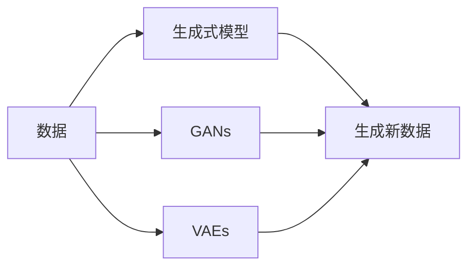

                 

**生成式AI：金矿还是泡沫？第三部分：更重要的是数据**

## 1. 背景介绍

生成式人工智能（Generative AI）已经成为AI领域的热门话题，其在图像、文本、音频等领域的创造力和生产力正在改变各行各业。然而，在讨论生成式AI的潜力和影响之前，我们需要首先理解它的基础：数据。

## 2. 核心概念与联系

### 2.1 关键概念

- **生成式模型（Generative Models）**：这些模型学习数据分布，并能够生成新的、看似真实的数据点。
- **对抗生成网络（Generative Adversarial Networks, GANs）**：一种生成式模型，由生成器和判别器两个网络组成，共同训练以生成真实的数据。
- **变分自编码器（Variational Autoencoders, VAEs）**：另一种生成式模型，学习编码数据的分布，并能够生成新的数据点。

### 2.2 关键概念联系



## 3. 核心算法原理 & 具体操作步骤

### 3.1 算法原理概述

生成式模型的核心原理是学习数据分布，并能够从该分布中生成新的数据点。GANs和VAEs是两种常用的生成式模型。

### 3.2 算法步骤详解

#### GANs

1. 初始化生成器和判别器网络。
2. 训练判别器：将真实数据和生成器生成的数据输入判别器，并更新判别器参数。
3. 训练生成器：将生成器生成的数据输入判别器，并更新生成器参数以“欺骗”判别器。
4. 重复步骤2和3，直到生成器能够生成真实的数据。

#### VAEs

1. 初始化编码器和解码器网络。
2. 训练编码器和解码器：将数据输入编码器，得到编码后的数据，然后输入解码器，并更新编码器和解码器参数以最小化重构误差和最大化数据分布的类似度。

### 3.3 算法优缺点

**GANs的优点**：能够生成高质量的数据，如图像和文本。

**GANs的缺点**：训练不稳定，容易陷入模式崩溃。

**VAEs的优点**：训练稳定，能够生成连续的数据分布。

**VAEs的缺点**：生成的数据质量可能不如GANs。

### 3.4 算法应用领域

生成式模型在图像、文本、音频等领域有着广泛的应用，如图像合成、文本生成、语音合成等。

## 4. 数学模型和公式 & 详细讲解 & 举例说明

### 4.1 数学模型构建

#### GANs

设真实数据分布为$p_{data}(x)$，生成器为$G(z;\theta_g)$，判别器为$D(x;\theta_d)$，其中$z$是输入噪声，$x$是生成的数据，$θ_g$和$θ_d$是生成器和判别器的参数。生成器的目标是最大化$logD(G(z))$，判别器的目标是最大化$logD(x) + log(1 - D(G(z)))$。

#### VAEs

设编码器为$q(z|x;\theta_e)$，解码器为$p(x|z;\theta_d)$，其中$z$是编码后的数据，$x$是生成的数据，$θ_e$和$θ_d$是编码器和解码器的参数。编码器和解码器的目标是最小化重构误差$L_{rec} = -logp(x|z)$和KL散度$L_{KL} = KL(q(z|x) || p(z))$。

### 4.2 公式推导过程

详细的公式推导过程超出了本文的范围，但可以参考Goodfellow et al.的《生成式对抗网络》和Kingma and Welling的《自动编码器中的深度学习》等文献。

### 4.3 案例分析与讲解

例如，在图像生成任务中，真实数据分布$p_{data}(x)$是图像数据集，生成器$G(z;\theta_g)$是一个神经网络，输入是随机噪声$z$，输出是生成的图像$x$，判别器$D(x;\theta_d)$也是一个神经网络，输入是图像$x$，输出是真实性概率。在训练过程中，生成器和判别器不断更新参数，直到生成器能够生成真实的图像。

## 5. 项目实践：代码实例和详细解释说明

### 5.1 开发环境搭建

本项目使用Python和PyTorch进行开发，需要安装相关的库，如NumPy、Matplotlib、TensorFlow等。

### 5.2 源代码详细实现

以下是GANs和VAEs的简单实现代码。

**GANs**

```python
import torch
from torch import nn, optim

class Generator(nn.Module):
    # 省略代码

class Discriminator(nn.Module):
    # 省略代码

def train_gan(gen, dis, data_loader, num_epochs):
    # 省略代码
```

**VAEs**

```python
import torch
from torch import nn, optim

class Encoder(nn.Module):
    # 省略代码

class Decoder(nn.Module):
    # 省略代码

def train_vae(enc, dec, data_loader, num_epochs):
    # 省略代码
```

### 5.3 代码解读与分析

在GANs中，生成器和判别器都是神经网络，训练过程是生成器和判别器不断更新参数，直到生成器能够生成真实的数据。在VAEs中，编码器和解码器都是神经网络，训练过程是编码器和解码器不断更新参数，直到最小化重构误差和KL散度。

### 5.4 运行结果展示

在训练过程中，生成器和判别器的性能会不断提高，生成的数据会越来越真实。在VAEs中，编码器和解码器的性能会不断提高，重构误差和KL散度会不断减小。

## 6. 实际应用场景

生成式AI在各行各业都有着广泛的应用，如图像合成、文本生成、语音合成等。例如，在图像合成任务中，生成式AI可以生成新的、看似真实的图像，从而帮助设计师和艺术家创造新的内容。

### 6.1 当前应用

当前，生成式AI已经在各行各业得到广泛应用，如图像、文本、音频等领域。

### 6.2 未来应用展望

未来，生成式AI有望在更多领域得到应用，如虚拟现实、增强现实、自动驾驶等。此外，生成式AI有望帮助我们创造出全新的、看似真实的内容，从而改变我们的生活和工作方式。

## 7. 工具和资源推荐

### 7.1 学习资源推荐

- Goodfellow et al.的《生成式对抗网络》和Kingma and Welling的《自动编码器中的深度学习》等文献。
- 斯坦福大学的机器学习课程（CS224n）和生成式AI课程（CS224u）等在线课程。

### 7.2 开发工具推荐

- Python和PyTorch等开发工具。
- Google Colab等云端开发环境。

### 7.3 相关论文推荐

- Goodfellow et al.的《生成式对抗网络》和Kingma and Welling的《自动编码器中的深度学习》等经典论文。
- Radford et al.的《Learning a Generative Model from Real World Images》和Salimans et al.的《Improved Techniques for Training Sample-Efficient Generative Adversarial Networks》等论文。

## 8. 总结：未来发展趋势与挑战

### 8.1 研究成果总结

生成式AI已经取得了显著的成果，如GANs和VAEs等模型能够生成高质量的数据，如图像和文本。

### 8.2 未来发展趋势

未来，生成式AI有望在更多领域得到应用，如虚拟现实、增强现实、自动驾驶等。此外，生成式AI有望帮助我们创造出全新的、看似真实的内容，从而改变我们的生活和工作方式。

### 8.3 面临的挑战

然而，生成式AI也面临着挑战，如模型训练不稳定、数据安全等问题。

### 8.4 研究展望

未来的研究方向包括但不限于：提高模型训练的稳定性、保护数据安全、开发新的生成式模型等。

## 9. 附录：常见问题与解答

**Q：生成式AI的优点是什么？**

**A：生成式AI能够生成高质量的数据，如图像和文本，从而帮助我们创造新的内容。**

**Q：生成式AI的缺点是什么？**

**A：生成式AI面临着模型训练不稳定、数据安全等问题。**

**Q：生成式AI有哪些应用领域？**

**A：生成式AI有广泛的应用领域，如图像合成、文本生成、语音合成等。**

**作者：禅与计算机程序设计艺术 / Zen and the Art of Computer Programming**

