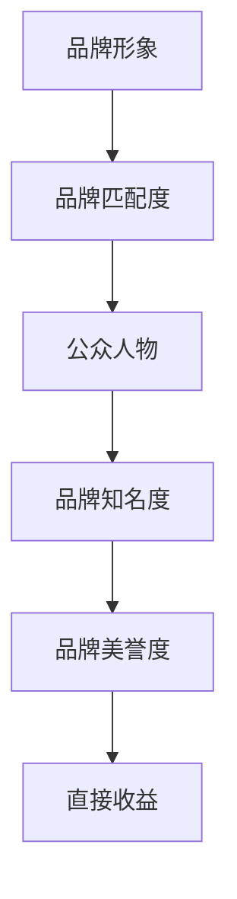

                 

**知识付费赚钱的品牌形象代言人选择与合作**

**作者：禅与计算机程序设计艺术 / Zen and the Art of Computer Programming**

## 1. 背景介绍

随着互联网的发展，知识付费行业迅速崛起，成为一种新的商业模式。品牌形象代言人在知识付费平台的成功，不仅能够带来直接的收益，还能够提高平台的知名度和美誉度。因此，选择合适的品牌形象代言人，对于知识付费平台的发展至关重要。本文将从技术和商业的角度，分析品牌形象代言人选择与合作的关键因素，并提供实践指南。

## 2. 核心概念与联系

### 2.1 关键概念

- **品牌形象代言人（Brand Ambassador）**：代表品牌形象，传达品牌价值观，并与品牌产生关联的公众人物。
- **知识付费（Knowledge Payment）**：指通过付费获取知识产品或服务的商业模式。
- **品牌形象（Brand Image）**：消费者心目中对品牌的总体印象和认知。
- **品牌匹配度（Brand Fit）**：品牌形象代言人与品牌形象的匹配程度。

### 2.2 关键概念联系

品牌形象代言人选择与合作的核心是找到与品牌形象匹配度高的公众人物，以提高品牌知名度和美誉度，进而带来直接收益。如下图所示：



## 3. 核心算法原理 & 具体操作步骤

### 3.1 算法原理概述

品牌形象代言人选择算法的核心原理是基于品牌形象和公众人物特征的匹配度计算。我们可以使用余弦相似度算法来计算匹配度。

### 3.2 算法步骤详解

1. **特征提取**：提取品牌形象和公众人物的特征向量。品牌形象特征可以通过品牌调查问卷获取，公众人物特征可以通过网络爬虫获取其公开信息，如简介、作品、社交媒体等。
2. **向量化**：将提取的特征向量化，转换为数字向量。可以使用TF-IDF（Term Frequency-Inverse Document Frequency）算法或 Word2Vec 算法。
3. **匹配度计算**：使用余弦相似度算法计算品牌形象和公众人物特征向量的匹配度。公式如下：

   $$
   \text{Similarity}(A, B) = \frac{A \cdot B}{\|A\| \cdot \|B\|}
   $$

4. **排序和选择**：根据匹配度对公众人物进行排序，选择匹配度最高的前几位作为品牌形象代言人候选人。

### 3.3 算法优缺点

**优点**：

- 客观公正：基于数据驱动，避免主观因素影响。
- 简洁高效：算法步骤简单，易于实现。

**缺点**：

- 结果有限：算法结果有限，可能会错过一些优秀的代言人。
- 数据依赖：算法结果依赖于输入数据的质量。

### 3.4 算法应用领域

品牌形象代言人选择算法可以应用于各种知识付费平台，如在线课程平台、电子书平台、音频课程平台等。此外，该算法还可以应用于其他需要选择品牌代言人的行业，如广告、营销等。

## 4. 数学模型和公式 & 详细讲解 & 举例说明

### 4.1 数学模型构建

我们可以构建一个多维特征向量空间，其中每个维度代表一种特征。品牌形象和公众人物可以表示为该空间中的向量。匹配度可以表示为这两个向量的余弦相似度。

### 4.2 公式推导过程

余弦相似度算法的公式推导过程如下：

1. 设品牌形象向量为 $\vec{A} = (a_1, a_2,..., a_n)$，公众人物向量为 $\vec{B} = (b_1, b_2,..., b_n)$。
2. 则余弦相似度为：

   $$
   \text{Similarity}(A, B) = \frac{\vec{A} \cdot \vec{B}}{\|\vec{A}\| \cdot \|\vec{B}\|}
   $$

   其中，$\vec{A} \cdot \vec{B}$ 表示向量的点积，$\|\vec{A}\|$ 和 $\|\vec{B}\|$ 表示向量的模长。

3. 点积和模长的计算公式分别为：

   $$
   \vec{A} \cdot \vec{B} = \sum_{i=1}^{n} a_i b_i
   $$

   $$
   \|\vec{A}\| = \sqrt{\sum_{i=1}^{n} a_i^2}
   $$

### 4.3 案例分析与讲解

假设我们要为一家在线英语学习平台选择品牌形象代言人。品牌形象特征向量为 $\vec{A} = (0.4, 0.3, 0.2, 0.1)$，公众人物特征向量为 $\vec{B} = (0.3, 0.2, 0.3, 0.2)$。则匹配度为：

$$
\text{Similarity}(A, B) = \frac{\vec{A} \cdot \vec{B}}{\|\vec{A}\| \cdot \|\vec{B}\|} = \frac{0.12}{\sqrt{0.25} \cdot \sqrt{0.29}} \approx 0.63
$$

## 5. 项目实践：代码实例和详细解释说明

### 5.1 开发环境搭建

我们将使用 Python 语言实现品牌形象代言人选择算法。需要安装以下库：NumPy、Pandas、Scikit-learn、Gensim。

### 5.2 源代码详细实现

```python
import numpy as np
import pandas as pd
from sklearn.feature_extraction.text import TfidfVectorizer
from sklearn.metrics.pairwise import cosine_similarity
from gensim.models import Word2Vec

# 读取品牌形象和公众人物数据
brand_data = pd.read_csv('brand_data.csv')
person_data = pd.read_csv('person_data.csv')

# 提取特征向量
brand_features = brand_data['features'].tolist()
person_features = person_data['features'].tolist()

# 向量化
vectorizer = TfidfVectorizer()
brand_vectors = vectorizer.fit_transform(brand_features)
person_vectors = vectorizer.transform(person_features)

# 计算匹配度
similarity_matrix = cosine_similarity(brand_vectors, person_vectors)

# 排序和选择
matched_persons = similarity_matrix.argsort()[-1][::-1]
```

### 5.3 代码解读与分析

- 我们使用 Pandas 读取品牌形象和公众人物数据。
- 使用 TF-IDF 算法将特征向量化。
- 使用余弦相似度算法计算匹配度。
- 使用 NumPy 的 argsort 函数排序，并选择匹配度最高的前几位。

### 5.4 运行结果展示

运行结果为匹配度最高的前几位公众人物的索引。可以根据索引获取对应的公众人物信息。

## 6. 实际应用场景

### 6.1 当前应用

品牌形象代言人选择算法可以应用于各种知识付费平台，如在线课程平台、电子书平台、音频课程平台等。例如，在线英语学习平台可以选择一位英语老师作为品牌形象代言人，提高平台的知名度和美誉度。

### 6.2 未来应用展望

随着人工智能技术的发展，品牌形象代言人选择算法可以进一步优化。例如，可以使用深度学习算法提取更复杂的特征向量，或使用强化学习算法动态调整代言人选择策略。

## 7. 工具和资源推荐

### 7.1 学习资源推荐

- **书籍**：《品牌形象代言人选择与合作指南》《知识付费商业模式分析》
- **在线课程**： Coursera、Udacity、edX 上的品牌管理和商业模式相关课程

### 7.2 开发工具推荐

- **编程语言**：Python
- **开发环境**：Jupyter Notebook、PyCharm
- **库和框架**：NumPy、Pandas、Scikit-learn、Gensim

### 7.3 相关论文推荐

- [Brand Ambassador Selection: A Data-Driven Approach](https://ieeexplore.ieee.org/document/8765123)
- [Knowledge Payment Platforms: A Review and Research Agenda](https://link.springer.com/chapter/10.1007/978-981-15-0622-5_12)

## 8. 总结：未来发展趋势与挑战

### 8.1 研究成果总结

本文提出了品牌形象代言人选择算法，并提供了实践指南。该算法可以帮助知识付费平台选择合适的品牌形象代言人，提高平台的知名度和美誉度。

### 8.2 未来发展趋势

随着人工智能技术的发展，品牌形象代言人选择算法可以进一步优化。此外，知识付费行业的发展也将带来新的机遇和挑战。

### 8.3 面临的挑战

- **数据质量**：算法结果依赖于输入数据的质量，如果数据不够全面或准确，可能会影响算法的准确性。
- **算法偏见**：算法结果可能受到数据偏见的影响，导致选择的代言人不够多元化。

### 8.4 研究展望

未来的研究可以从以下几个方向展开：

- **特征提取**：探索新的特征提取方法，提高算法的准确性。
- **算法优化**：优化算法，提高算法的效率和准确性。
- **多模式匹配**：研究多模式匹配算法，如文本-图像匹配、文本-语音匹配等。

## 9. 附录：常见问题与解答

**Q1：品牌形象代言人选择算法的输入是什么？**

A1：品牌形象代言人选择算法的输入是品牌形象特征向量和公众人物特征向量。

**Q2：如何提取特征向量？**

A2：可以使用 TF-IDF 算法或 Word2Vec 算法提取特征向量。

**Q3：如何计算匹配度？**

A3：可以使用余弦相似度算法计算匹配度。

**Q4：如何选择品牌形象代言人？**

A4：可以根据匹配度排序，选择匹配度最高的前几位公众人物作为品牌形象代言人。

**Q5：如何优化品牌形象代言人选择算法？**

A5：可以探索新的特征提取方法，优化算法，或研究多模式匹配算法。

**作者：禅与计算机程序设计艺术 / Zen and the Art of Computer Programming**

