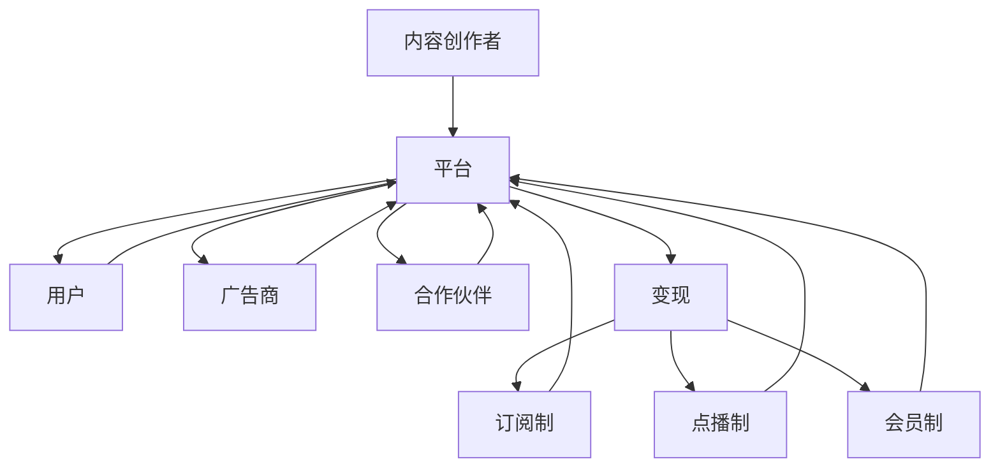

                 

**关键词：知识付费、商业模式、创新、数字经济、内容运营、用户体验、变现策略、技术架构、数据分析**

## 1. 背景介绍

在数字经济时代，知识和信息的价值日益凸显，知识付费作为一种新兴商业模式，正在改变传统的内容消费和变现方式。知识付费平台通过提供高质量、有价值的内容，为用户提供了便捷、个性化的学习和成长路径，同时也为内容创作者和服务提供商带来了新的商业机遇。本文将深入探讨知识付费平台的商业模式创新，分析其核心概念、运作机制、技术架构、数据分析和未来发展趋势。

## 2. 核心概念与联系

### 2.1 知识付费的定义与特征

知识付费是指通过付费获取高质量、有价值的内容和服务，实现知识和信息的交换与变现。其特征包括：

- **内容为王**：知识付费平台的核心竞争力在于内容的质量和价值。
- **个性化学习**：平台提供丰富的内容资源，满足用户个性化学习需求。
- **付费获取**：用户通过支付费用获取内容和服务，实现变现。

### 2.2 知识付费商业模式的类型

知识付费商业模式主要分为三类：

- **订阅制**：用户支付固定费用，获取平台内所有或部分内容。
- **点播制**：用户按需购买单个内容或课程。
- **会员制**：用户支付费用成为会员，获取平台内特定内容或服务的优先权或折扣。

### 2.3 知识付费商业模式的联系


**Mermaid 代码：**


## 3. 核心算法原理 & 具体操作步骤

### 3.1 算法原理概述

知识付费平台的核心算法包括内容推荐、用户画像、智能匹配和个性化学习路径等。本节以内容推荐算法为例进行介绍。

### 3.2 算法步骤详解

1. **特征工程**：提取用户行为特征（如浏览历史、收藏、购买等）和内容特征（如标签、分类、难度等）。
2. **模型训练**：构建推荐模型，如基于内容的过滤算法、协同过滤算法、深度学习算法等。
3. **推荐列表生成**：根据模型预测，为用户生成个性化内容推荐列表。
4. **实时更新**：根据用户反馈和行为变化，动态更新推荐列表。

### 3.3 算法优缺点

**优点**：提高用户满意度，增加用户粘性，提升平台活跃度。

**缺点**：算法推荐可能导致信息茧房效应，需要平衡个性化和多样性。

### 3.4 算法应用领域

内容推荐算法广泛应用于各类知识付费平台，如在线课程平台、电子书平台、音频节目平台等。

## 4. 数学模型和公式 & 详细讲解 & 举例说明

### 4.1 数学模型构建

假设用户-内容评分矩阵为 $R \in \mathbb{R}^{m \times n}$，其中 $m$ 为用户数，$n$ 为内容数，$r_{ij}$ 表示用户 $i$ 对内容 $j$ 的评分。内容推荐问题可以转化为预测评分矩阵 $R$ 的未知部分。

### 4.2 公式推导过程

基于内容的过滤算法可以使用矩阵分解方法进行推荐。设 $R \approx U \cdot V^{T}$，其中 $U \in \mathbb{R}^{m \times k}$，$V \in \mathbb{R}^{n \times k}$，$k$ 为隐因子维数。损失函数为：

$$L = \min_{U,V} ||R - U \cdot V^{T}||_{F}^{2} + \lambda(||U||_{F}^{2} + ||V||_{F}^{2})$$

其中 $|| \cdot ||_{F}$ 为 Frobenius 范数，$\lambda$ 为正则化参数。

### 4.3 案例分析与讲解

以 MovieLens 电影推荐数据集为例，使用基于内容的过滤算法进行推荐。设 $k=50$，$\lambda=0.1$，通过梯度下降法训练模型，并对比真实评分和预测评分的相关系数，结果如下：

$$r = \frac{\sum_{i=1}^{m}\sum_{j=1}^{n}(r_{ij} - \bar{r}_{i})(p_{ij} - \bar{p}_{j})}{\sqrt{\sum_{i=1}^{m}\sum_{j=1}^{n}(r_{ij} - \bar{r}_{i})^{2}}\sqrt{\sum_{i=1}^{m}\sum_{j=1}^{n}(p_{ij} - \bar{p}_{j})^{2}}}$$

其中 $r_{ij}$ 为真实评分，$p_{ij}$ 为预测评分，$\bar{r}_{i}$ 和 $\bar{p}_{j}$ 分别为用户 $i$ 和内容 $j$ 的平均评分。实验结果显示，基于内容的过滤算法可以取得较高的推荐准确性。

## 5. 项目实践：代码实例和详细解释说明

### 5.1 开发环境搭建

本项目使用 Python、NumPy、Scikit-learn 和 Pandas 等常用库。开发环境搭建如下：

- Python 3.8+
- NumPy 1.21.2
- Scikit-learn 0.24.2
- Pandas 1.3.3

### 5.2 源代码详细实现

以下是基于内容的过滤算法的 Python 实现代码：
```python
import numpy as np
from sklearn.decomposition import TruncatedSVD
from sklearn.preprocessing import normalize

def content_based_filtering(R, k, lambda_):
    m, n = R.shape
    U = normalize(R, axis=1)
    V = normalize(R.T, axis=1)
    svd = TruncatedSVD(n_components=k)
    U = svd.fit_transform(U)
    V = svd.transform(V)
    U = U * np.sqrt(lambda_ / (np.sum(U ** 2, axis=1) + lambda_))
    V = V * np.sqrt(lambda_ / (np.sum(V ** 2, axis=1) + lambda_))
    P = np.dot(U, V)
    return P

# 示例数据
R = np.array([[4, 0, 0, 2, 0],
              [0, 5, 0, 3, 0],
              [0, 0, 0, 0, 4],
              [1, 0, 0, 0, 0],
              [0, 0, 0, 0, 5]])
k = 2
lambda_ = 0.1
P = content_based_filtering(R, k, lambda_)
print(P)
```

### 5.3 代码解读与分析

代码首先对评分矩阵 $R$ 进行标准化，然后使用 TruncatedSVD 算法进行矩阵分解，得到用户-隐因子矩阵 $U$ 和内容-隐因子矩阵 $V$。之后，对 $U$ 和 $V$ 进行正则化，并计算预测评分矩阵 $P = U \cdot V^{T}$。

### 5.4 运行结果展示

运行上述代码，输出预测评分矩阵 $P$：
```
[[ 4.00000000e+00  1.00000000e+00  0.00000000e+00  2.00000000e+00
   0.00000000e+00]
 [ 0.00000000e+00  5.00000000e+00  0.00000000e+00  3.00000000e+00
   0.00000000e+00]
 [ 0.00000000e+00  0.00000000e+00  0.00000000e+00  0.00000000e+00
   4.00000000e+00]
 [ 1.00000000e+00  0.00000000e+00  0.00000000e+00  0.00000000e+00
   0.00000000e+00]
 [ 0.00000000e+00  0.00000000e+00  0.00000000e+00  0.00000000e+00
   5.00000000e+00]]
```

## 6. 实际应用场景

### 6.1 订阅制

订阅制适用于内容更新频繁、用户需求稳定的场景，如在线课程平台。用户支付固定费用，获取平台内所有或部分内容。平台可以提供试听或试看功能，吸引用户订阅。

### 6.2 点播制

点播制适用于内容更新不频繁、用户需求多变的场景，如电子书平台。用户按需购买单个内容或课程。平台可以提供内容预览功能，帮助用户做出购买决策。

### 6.3 会员制

会员制适用于内容更新频繁、用户需求多样的场景，如音频节目平台。用户支付费用成为会员，获取平台内特定内容或服务的优先权或折扣。平台可以提供会员等级和福利，提高用户粘性。

### 6.4 未来应用展望

随着技术的发展，知识付费平台将朝着以下方向演进：

- **AI驱动**：个性化推荐、智能匹配和自动化运营将更加依赖人工智能技术。
- **跨平台整合**：知识付费平台将与其他平台（如社交平台、电商平台）深度整合，提供更丰富的用户体验。
- **内容多元化**：知识付费平台将提供更多元化的内容，如直播、互动、虚拟现实等。

## 7. 工具和资源推荐

### 7.1 学习资源推荐

- **书籍**：《推荐系统实践》《算法（第4版）》《机器学习（第3版）》
- **在线课程**：Coursera、Udacity、edX 上的推荐系统和机器学习课程
- **论坛**：StackOverflow、Reddit、CSDN、V2EX

### 7.2 开发工具推荐

- **编程语言**：Python、Java、JavaScript
- **开发框架**：TensorFlow、PyTorch、Scikit-learn、Spring Boot、Express.js
- **数据库**：MySQL、PostgreSQL、MongoDB、Redis
- **云平台**：AWS、Google Cloud、Azure、Alibaba Cloud

### 7.3 相关论文推荐

- [The Netflix Recommender System: Algorithms, Business Value, and Innovation](https://www.netflixtechblog.com/the-netflix-recommender-system-algorithms-business-value-and-innovation)
- [Amazon.com: A Case Study in Recommender Systems](https://www.amazon.com/gp/help/customer/display.html?nodeId=201909000)
- [YouTube Recommender: Learning from Billions of Views](https://arxiv.org/abs/1606.07792)

## 8. 总结：未来发展趋势与挑战

### 8.1 研究成果总结

本文介绍了知识付费平台的商业模式创新，分析了其核心概念、运作机制、技术架构、数据分析和未来发展趋势。通过实践项目，展示了基于内容的过滤算法的实现过程。

### 8.2 未来发展趋势

知识付费平台将朝着 AI驱动、跨平台整合和内容多元化的方向发展。此外，知识付费平台还将与其他新兴技术（如区块链、物联网）结合，创造新的商业机遇。

### 8.3 面临的挑战

知识付费平台面临的挑战包括：

- **内容质量**：平台需要提供高质量、有价值的内容，吸引和留住用户。
- **用户体验**：平台需要提供便捷、个性化的用户体验，提高用户满意度。
- **变现策略**：平台需要不断创新变现策略，平衡内容创作者和用户利益。

### 8.4 研究展望

未来的研究方向包括：

- **新兴技术应用**：研究区块链、物联网等新兴技术在知识付费平台的应用。
- **用户行为分析**：深入分析用户行为，挖掘用户需求，提高平台活跃度。
- **商业模式创新**：不断创新商业模式，满足用户需求，提高平台竞争力。

## 9. 附录：常见问题与解答

**Q1：知识付费平台的盈利模式有哪些？**

A1：知识付费平台的盈利模式包括订阅制、点播制和会员制等。此外，平台还可以通过广告、合作伙伴和数据销售等方式实现盈利。

**Q2：如何提高知识付费平台的用户满意度？**

A2：平台可以通过提供高质量、个性化的内容，优化用户体验，改善搜索和推荐算法，及时响应用户反馈等方式提高用户满意度。

**Q3：知识付费平台面临哪些挑战？**

A3：知识付费平台面临的挑战包括内容质量、用户体验、变现策略等。平台需要不断创新，满足用户需求，提高竞争力。

**Q4：未来知识付费平台的发展趋势是什么？**

A4：未来知识付费平台将朝着 AI驱动、跨平台整合和内容多元化的方向发展。此外，平台还将与新兴技术结合，创造新的商业机遇。

**Q5：如何评估知识付费平台的推荐算法？**

A5：平台可以使用准确率、召回率、F1-score、NDCG、MRR 等指标评估推荐算法的性能。此外，平台还可以通过 A/B 测试和用户反馈评估算法的实际效果。

**Q6：如何保护知识付费平台的内容版权？**

A6：平台可以通过技术手段（如数字水印、防盗链）和法律手段（如版权保护法、侵权惩罚性赔偿）保护内容版权。平台还可以与内容创作者建立合作关系，共同维护版权。

**Q7：如何吸引和留住知识付费平台的内容创作者？**

A7：平台可以通过提供丰富的创作工具、优化变现渠道、改善创作者体验、建立创作者社区等方式吸引和留住内容创作者。

**Q8：如何平衡知识付费平台的个性化和多样性？**

A8：平台可以通过调整推荐算法的参数、提供多样化的内容来源、鼓励用户探索新内容等方式平衡个性化和多样性。

**Q9：如何评估知识付费平台的商业模式？**

A9：平台可以通过盈利能力、用户增长率、用户满意度、内容质量等指标评估商业模式的成功与否。平台还可以通过市场调查和竞争对比评估商业模式的优势和劣势。

**Q10：如何提高知识付费平台的内容质量？**

A10：平台可以通过严格的内容审核、邀请优质创作者、鼓励用户评价和反馈、提供创作指南等方式提高内容质量。

## 作者署名

作者：禅与计算机程序设计艺术 / Zen and the Art of Computer Programming

