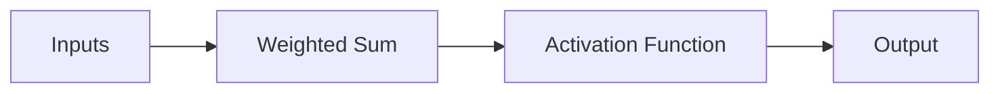
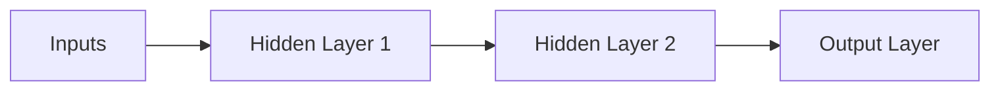

                 

## 1. 背景介绍

神经网络（Neural Network）是一种模拟人类神经系统进行信息处理的计算模型，它在人工智能领域扮演着至关重要的角色。自从1943年Warren McCulloch和Walter Pitts首次提出神经元模型以来，神经网络已经发展成为一个庞大而复杂的领域，为计算机视觉、自然语言处理、机器学习等多个领域带来了革命性的变化。

## 2. 核心概念与联系

### 2.1 神经元模型

神经网络的基本单位是神经元（Neuron），它接受输入信号，进行加权求和，并通过激活函数输出结果。下图是一个简单的神经元模型：



### 2.2 神经网络架构

神经网络由多层神经元组成，可以分为输入层、隐藏层和输出层。最简单的神经网络是单层感知机（Perceptron），而更复杂的网络则包含多层隐藏层，如下图所示：



## 3. 核心算法原理 & 具体操作步骤

### 3.1 算法原理概述

神经网络的学习过程主要分为两个阶段：前向传播（Forward Propagation）和反向传播（Backpropagation）。前向传播用于计算网络的输出，而反向传播则用于调整网络的权重，以最小化预测误差。

### 3.2 算法步骤详解

1. **前向传播**：输入数据通过输入层进入网络，然后依次通过各层隐藏层，最后由输出层生成输出结果。
2. **计算误差**：将网络输出与真实值进行比较，计算误差。
3. **反向传播**：从输出层开始，计算每层神经元的误差项，并根据误差项调整权重。
4. **重复步骤1-3**：直到误差小于预设阈值或达到最大迭代次数。

### 3.3 算法优缺点

**优点**：神经网络可以学习复杂的非线性关系，具有很强的适应能力和泛化能力。

**缺点**：神经网络易于陷入局部最小值，训练过程需要大量的数据和计算资源。

### 3.4 算法应用领域

神经网络广泛应用于图像识别、语音识别、自然语言处理等领域。例如，Convolutional Neural Networks（CNN）在计算机视觉领域取得了突出的成就，而Recurrent Neural Networks（RNN）和Long Short-Term Memory（LSTM）则在处理序列数据时表现出色。

## 4. 数学模型和公式 & 详细讲解 & 举例说明

### 4.1 数学模型构建

神经网络的数学模型可以表示为：

$$y = f(w \cdot x + b)$$

其中，$x$是输入向量，$w$是权重向量，$b$是偏置项，$f$是激活函数，$y$是输出结果。

### 4.2 公式推导过程

神经网络的学习过程可以通过最小化预测误差来实现。误差函数通常选择均方误差（Mean Squared Error，MSE），其公式为：

$$E = \frac{1}{2} \sum (y - t)^2$$

其中，$y$是网络输出，$t$是真实值。通过梯度下降法，可以计算出权重和偏置项的梯度，并更新它们的值。

### 4.3 案例分析与讲解

例如，考虑一个单层感知机，其数学模型为：

$$y = \begin{cases} 1, & \text{if } w \cdot x + b \geq 0 \\ 0, & \text{otherwise} \end{cases}$$

如果我们要使用这个感知机来识别XOR逻辑门，则需要设置权重和偏置项的值为：

$$w = \begin{bmatrix} 1 & 1 \end{bmatrix}, \quad b = -1.5$$

## 5. 项目实践：代码实例和详细解释说明

### 5.1 开发环境搭建

我们将使用Python和TensorFlow来实现一个简单的神经网络。首先，安装必要的库：

```bash
pip install tensorflow numpy
```

### 5.2 源代码详细实现

以下是一个简单的单层感知机实现：

```python
import numpy as np
import tensorflow as tf

# 定义输入数据和真实值
X = np.array([[0, 0], [0, 1], [1, 0], [1, 1]])
y = np.array([[0], [1], [1], [0]])

# 定义模型参数
w = tf.Variable(tf.random.normal([2, 1]))
b = tf.Variable(tf.zeros([1]))

# 定义前向传播过程
def forward(x):
    return tf.sign(tf.matmul(x, w) + b)

# 定义误差函数
def loss(y_true, y_pred):
    return tf.reduce_mean(tf.square(y_true - y_pred))

# 定义反向传播过程
optimizer = tf.train.GradientDescentOptimizer(learning_rate=0.1)
train_op = optimizer.minimize(loss)

# 训练模型
for i in range(1000):
    with tf.GradientTape() as tape:
        y_pred = forward(X)
        loss_value = loss(y, y_pred)
    gradients = tape.gradient(loss_value, [w, b])
    optimizer.apply_gradients(zip(gradients, [w, b]))
    if i % 100 == 0:
        print(f"Loss at step {i}: {loss_value.numpy()}")
```

### 5.3 代码解读与分析

在代码中，我们首先定义输入数据和真实值。然后，我们初始化模型参数权重和偏置项。前向传播过程使用sigmoid函数作为激活函数，误差函数选择均方误差。我们使用梯度下降法来优化模型参数。

### 5.4 运行结果展示

运行代码后，模型的损失值会逐渐减小，直到收敛。最终，模型应该能够正确地识别XOR逻辑门。

## 6. 实际应用场景

神经网络在各种实际应用场景中都发挥着重要作用。例如：

### 6.1 图像识别

CNN在计算机视觉领域取得了突出的成就，可以用于图像分类、目标检测、图像分割等任务。

### 6.2 自然语言处理

RNN和LSTM等序列模型可以用于文本分类、机器翻译、语言模型等任务。

### 6.3 自动驾驶

神经网络可以用于感知环境、规划路径、控制车辆等任务，为自动驾驶提供了关键技术。

### 6.4 未来应用展望

未来，神经网络将继续在人工智能领域扮演关键角色，并可能会出现新的架构和算法，进一步提高神经网络的性能和泛化能力。

## 7. 工具和资源推荐

### 7.1 学习资源推荐

* "神经网络与深度学习"（Goodfellow, Bengio, & Courville, 2016）
* "深度学习"（LeCun, Bengio, & Hinton, 2015）
* 斯坦福大学的在线课程"机器学习"（Andrew Ng）

### 7.2 开发工具推荐

* TensorFlow
* PyTorch
* Keras

### 7.3 相关论文推荐

* "ImageNet Classification with Deep Convolutional Neural Networks"（Krizhevsky et al., 2012）
* "Long Short-Term Memory"（Hochreiter & Schmidhuber, 1997）
* "Attention Is All You Need"（Vaswani et al., 2017）

## 8. 总结：未来发展趋势与挑战

### 8.1 研究成果总结

神经网络已经取得了巨大的成功，并为计算机视觉、自然语言处理等领域带来了革命性的变化。

### 8.2 未来发展趋势

未来，神经网络将继续发展，出现新的架构和算法，并可能会出现新的应用领域。

### 8.3 面临的挑战

神经网络面临的挑战包括：如何避免过拟合，如何处理小样本学习，如何提高模型的解释性等。

### 8.4 研究展望

未来的研究方向包括：生成式对抗网络（Generative Adversarial Networks，GAN）、变分自编码器（Variational Autoencoders，VAE）、注意力机制（Attention Mechanisms）等。

## 9. 附录：常见问题与解答

**Q：神经网络的隐藏层有多少层比较合适？**

**A：这取决于具体的任务和数据。通常，更深的网络可以学习更复杂的模式，但也更容易过拟合。因此，需要通过交叉验证来选择合适的层数。**

**Q：如何避免神经网络的过拟合？**

**A：常用的方法包括：数据增强、正则化（如L1、L2正则化）、 dropout、早停（Early Stopping）等。**

**Q：神经网络的权重初始化有什么要求？**

**A：权重初始化的目的是为了避免梯度消失或梯度爆炸。常用的初始化方法包括：Xavier初始化、He初始化等。**

## 作者：禅与计算机程序设计艺术 / Zen and the Art of Computer Programming

