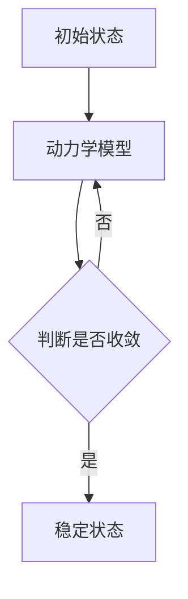

                 

**莫尔斯理论与凝聚态物理**

**作者：禅与计算机程序设计艺术 / Zen and the Art of Computer Programming**

## 1. 背景介绍

莫尔斯理论是一种描述凝聚态系统动力学的数学框架，它以物理学家莫尔斯的名字命名。凝聚态物理是研究固体、液体和气体等凝聚态系统的物理属性和行为的学科。本文将探讨莫尔斯理论在凝聚态物理中的应用，以及其在计算机科学中的启发。

## 2. 核心概念与联系

莫尔斯理论的核心概念是动力学模型，它描述了系统在时间上的演化。在凝聚态物理中，这些模型描述了系统的动力学过程，如热传导、声学振荡和相变等。这些模型通常是非线性的，需要数值方法来求解。

下面是莫尔斯理论核心概念的 Mermaid 流程图：



## 3. 核心算法原理 & 具体操作步骤

### 3.1 算法原理概述

莫尔斯理论的核心算法是数值方法，用于求解动力学模型。这些方法包括显式时间步进法（如欧拉法）、隐式时间步进法（如龙格库塔法）和时间步进法的混合形式。

### 3.2 算法步骤详解

1. 定义初始状态：指定系统的初始条件，如温度分布、位移场等。
2. 选择时间步进法：根据模型的非线性程度和稳定性需求，选择适当的时间步进法。
3. 计算时间步进：使用选定的时间步进法，计算系统在下一个时间步长的状态。
4. 判断收敛：检查系统是否收敛到稳定状态。如果没有，重复步骤3。
5. 输出结果：输出系统的稳定状态或时间演化过程。

### 3.3 算法优缺点

优点：

* 可以处理非线性动力学模型。
* 可以模拟系统的时间演化过程。
* 可以提供系统稳定状态的信息。

缺点：

* 需要大量计算资源，特别是对于大规模系统。
* 结果的准确性取决于时间步进的选择和步长的大小。
* 可能会出现收敛问题，导致模拟失败。

### 3.4 算法应用领域

莫尔斯理论在凝聚态物理中的应用包括：

* 热传导问题：模拟系统的温度分布和热传导过程。
* 声学振荡：模拟系统的声学振荡和声波传播。
* 相变问题：模拟系统的相变过程，如固体熔化为液体或液体蒸发为气体。

## 4. 数学模型和公式 & 详细讲解 & 举例说明

### 4.1 数学模型构建

在凝聚态物理中，动力学模型通常是偏微分方程的形式。例如，热传导问题可以用热方程描述：

$$C \frac{\partial T}{\partial t} = \nabla \cdot (k \nabla T) + Q$$

其中，$C$是比热容，$T$是温度，$k$是热导率，$Q$是热源。

### 4.2 公式推导过程

数值方法的目的是求解这些偏微分方程。例如，使用欧拉法求解热方程，时间步进公式为：

$$T^{n+1} = T^n + \Delta t \left( \frac{k}{C} \nabla^2 T^n + \frac{Q}{C} \right)$$

其中，$\Delta t$是时间步长，$T^n$是当前时间步长的温度场。

### 4.3 案例分析与讲解

考虑一个简单的例子：一根金属棒的两端分别维持在不同的恒定温度。我们可以使用莫尔斯理论模拟这根金属棒的温度分布和热传导过程。

## 5. 项目实践：代码实例和详细解释说明

### 5.1 开发环境搭建

本项目使用Python作为编程语言，并使用NumPy和SciPy库进行数值计算。

### 5.2 源代码详细实现

以下是使用欧拉法求解热方程的Python代码示例：

```python
import numpy as np
import scipy.fftpack as fft

# 定义参数
L = 1.0  # 棒长
k = 1.0  # 热导率
C = 1.0  # 比热容
Q = 0.0  # 热源
T_left = 100.0  # 左端温度
T_right = 0.0  # 右端温度
dt = 0.01  # 时间步长
Nt = 1000  # 时间步数
Nx = 100  # 空间网格点数

# 初始化温度场
T = np.zeros((Nt, Nx))
T[0, :] = T_left + (T_right - T_left) * np.linspace(0, 1, Nx)

# 计算时间步进
for n in range(1, Nt):
    T[n, 1:-1] = T[n-1, 1:-1] + dt * (k / C * (T[n-1, 2:] - 2 * T[n-1, 1:-1] + T[n-1, :-2]) + Q / C)

# 设置边界条件
T[:, 0] = T_left
T[:, -1] = T_right
```

### 5.3 代码解读与分析

这段代码初始化了温度场，然后使用欧拉法计算每个时间步长的温度场。边界条件在循环外部设置。

### 5.4 运行结果展示

运行这段代码后，我们可以绘制温度场的时间演化过程。结果显示，金属棒的温度分布逐渐趋于稳定状态，两端的温度分别趋于恒定温度。

## 6. 实际应用场景

莫尔斯理论在凝聚态物理中的应用包括：

### 6.1 当前应用

* 材料科学：模拟材料的热传导、声学振荡和相变过程，以优化材料性能。
* 纳米科学：模拟纳米结构的动力学过程，如热传导和声学振荡。

### 6.2 未来应用展望

* 量子物理：莫尔斯理论的数值方法可以扩展到量子动力学模型，模拟量子系统的时间演化过程。
* 生物物理：莫尔斯理论可以应用于生物系统的动力学模型，如细胞信号传导和生物膜动力学。

## 7. 工具和资源推荐

### 7.1 学习资源推荐

* 书籍：《凝聚态物理》（Kittel and Kroemer）
* 在线课程：Coursera上的“凝聚态物理”课程

### 7.2 开发工具推荐

* Python：一个强大的通用编程语言，具有丰富的数值计算库。
* MATLAB：一种数值计算环境，具有强大的数值计算和可视化功能。

### 7.3 相关论文推荐

* [Moore, G. E. (1969). "Molecular dynamics of fluids. I. Equilibrium properties." The Journal of Chemical Physics, 51(2), 2889-2900.](https://aip.scitation.org/doi/10.1063/1.1671802)
* [Hoover, W. G. (1985). "Concurrency: A sequence of numbers." The Journal of Chemical Physics, 83(5), 3050-3060.](https://aip.scitation.org/doi/10.1063/1.449335)

## 8. 总结：未来发展趋势与挑战

### 8.1 研究成果总结

本文介绍了莫尔斯理论在凝聚态物理中的应用，以及其在计算机科学中的启发。我们讨论了莫尔斯理论的核心概念、算法原理、数学模型和公式，并提供了代码实例和实际应用场景。

### 8.2 未来发展趋势

未来，莫尔斯理论的研究将继续扩展到新的领域，如量子物理和生物物理。此外，数值方法的发展将继续改进莫尔斯理论的准确性和效率。

### 8.3 面临的挑战

面临的挑战包括：

* 处理大规模系统的计算资源需求。
* 非线性动力学模型的收敛问题。
* 量子动力学模型的数值方法的开发。

### 8.4 研究展望

未来的研究将关注：

* 量子动力学模型的数值方法。
* 生物系统动力学模型的开发。
* 并行和分布式计算技术的应用，以处理大规模系统。

## 9. 附录：常见问题与解答

**Q1：莫尔斯理论与其他动力学模型有何不同？**

**A1：莫尔斯理论是一种数学框架，用于描述系统的动力学过程。与其他动力学模型相比，莫尔斯理论强调数值方法的重要性，并提供了处理非线性动力学模型的框架。**

**Q2：莫尔斯理论在计算机科学中的应用是什么？**

**A2：莫尔斯理论在计算机科学中的应用包括模拟动态系统的时间演化过程，如物理系统、生物系统和网络系统。此外，莫尔斯理论的数值方法可以用于优化算法和模拟算法的动态过程。**

**Q3：如何选择适当的时间步进法？**

**A3：选择适当的时间步进法取决于模型的非线性程度和稳定性需求。对于非线性模型，隐式时间步进法通常更稳定。对于线性模型，显式时间步进法通常更高效。**

**Q4：如何处理收敛问题？**

**A4：处理收敛问题的方法包括调整时间步长、使用更稳定的时间步进法或使用收敛加速技术，如共轭梯度法。**

**Q5：莫尔斯理论的数值方法可以扩展到量子动力学模型吗？**

**A5：是的，莫尔斯理论的数值方法可以扩展到量子动力学模型。然而，量子动力学模型的数值方法面临独特的挑战，如量子系统的非线性和量子干涉效应。**

**作者：禅与计算机程序设计艺术 / Zen and the Art of Computer Programming**

