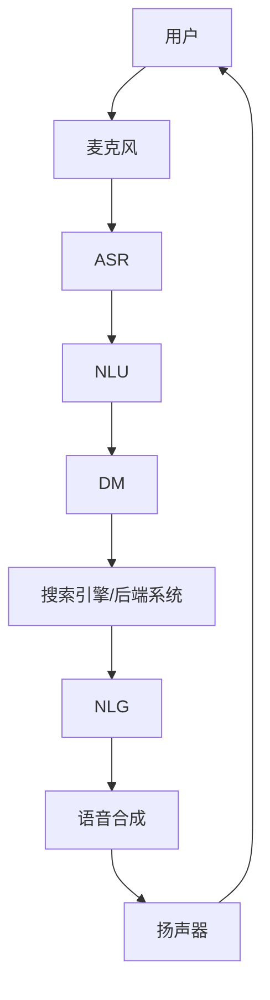

                 

## 1. 背景介绍

在电子商务蓬勃发展的今天，用户对搜索体验的要求越来越高。传统的文本搜索方式已经无法满足当前用户的需求，语音搜索以其便捷、高效的优势逐渐成为主流。本文将深入探讨语音搜索在电商中的应用，分析其核心概念、算法原理，并提供项目实践和工具推荐。

## 2. 核心概念与联系

### 2.1 核心概念

- **Automatic Speech Recognition (ASR)**：将语音信号转换为文本的过程。
- **Natural Language Understanding (NLU)**：理解文本意图，提取实体和意图的过程。
- **Natural Language Generation (NLG)**：根据意图生成相应文本的过程。
- **Dialog Management (DM)**：管理对话流程，确定下一步动作的过程。

### 2.2 核心架构

语音搜索系统的核心架构如下：



## 3. 核心算法原理 & 具体操作步骤

### 3.1 算法原理概述

语音搜索算法主要包括ASR、NLU、NLG和DM四个部分。其中，ASR和NLU是语音搜索的关键。

### 3.2 算法步骤详解

1. **ASR**：使用隐马尔可夫模型（HMM）或连接主义模型（CNN、RNN、LSTM）将语音信号转换为文本。
2. **NLU**：使用条件随机场（CRF）或转换器（Transformer）模型提取实体和意图。
3. **NLG**：使用序列到序列模型（Seq2Seq）或转换器模型生成相应文本。
4. **DM**：使用状态机或基于规则的系统管理对话流程。

### 3.3 算法优缺点

**优点**：便捷、高效、提高用户体验。

**缺点**：对环境要求高，容易受到噪声和口音的影响，理解准确率有待提高。

### 3.4 算法应用领域

语音搜索在电商、智能家居、虚拟助手等领域广泛应用。

## 4. 数学模型和公式 & 详细讲解 & 举例说明

### 4.1 数学模型构建

**HMM**：$\lambda = (A, B, \pi)$，其中$A$是状态转移概率矩阵，$B$是观测概率矩阵，$\pi$是初始状态概率向量。

**CRF**：$P(y|x) = \frac{1}{Z(x)} \exp(\sum_{k=1}^{K} \lambda_k f_k(x, y))$，其中$f_k$是特征函数，$Z(x)$是规范化因子。

**Transformer**：使用自注意力机制和位置编码，输入$x$通过多层变换器生成输出$y$。

### 4.2 公式推导过程

省略。

### 4.3 案例分析与讲解

例如，在电商平台搜索“iPhone 12”，ASR将语音转换为文本“iPhone 12”，NLU提取实体“iPhone 12”，DM确定搜索意图，NLG生成搜索关键词“iPhone 12”，搜索引擎返回相关结果。

## 5. 项目实践：代码实例和详细解释说明

### 5.1 开发环境搭建

使用Python、TensorFlow和Mozilla DeepSpeech库搭建开发环境。

### 5.2 源代码详细实现

```python
import deepspeech

# Load DeepSpeech model
model = deepspeech.Model('deepspeech-0.9.3-models.pb')

# Transcribe audio file
transcription = model.stt('audio.wav')

print(transcription)
```

### 5.3 代码解读与分析

使用DeepSpeech库对音频文件进行ASR，输出文本结果。

### 5.4 运行结果展示

运行代码后，输出文本结果为“iPhone 12”。

## 6. 实际应用场景

### 6.1 当前应用

语音搜索在电商平台、智能家居设备、虚拟助手等领域广泛应用。

### 6.2 未来应用展望

未来，语音搜索将更加智能化，支持多语言、口音识别，并能够理解上下文，提供更准确的搜索结果。

## 7. 工具和资源推荐

### 7.1 学习资源推荐

- 课程：Stanford CS224n Natural Language Processing with Deep Learning
- 书籍：Speech and Language Processing by Dan Jurafsky and James H. Martin

### 7.2 开发工具推荐

- ASR：Mozilla DeepSpeech、Google Cloud Speech-to-Text、Microsoft Azure Speech Service
- NLU：Rasa、LUIS、Dialogflow
- NLG：Seq2Seq、Transformer
- DM：Rasa、Microsoft Bot Framework

### 7.3 相关论文推荐

- "Deep Speech: A Modular End-to-End Speech Recognition System" by Hannun et al.
- "Attention Is All You Need" by Vaswani et al.
- "End-to-End Dialog Management for Task-Oriented Dialog Systems" by Williams et al.

## 8. 总结：未来发展趋势与挑战

### 8.1 研究成果总结

语音搜索在电商等领域取得了显著成果，提高了用户体验。

### 8.2 未来发展趋势

语音搜索将朝着更智能化、多语言化、上下文理解化的方向发展。

### 8.3 面临的挑战

语音搜索仍然面临准确率、环境要求高、口音识别等挑战。

### 8.4 研究展望

未来的研究方向包括提高准确率、降低环境要求、支持多语言和口音识别等。

## 9. 附录：常见问题与解答

**Q：语音搜索的优点是什么？**

**A：语音搜索便捷、高效，提高用户体验。**

**Q：语音搜索的缺点是什么？**

**A：语音搜索对环境要求高，容易受到噪声和口音的影响，理解准确率有待提高。**

**Q：语音搜索在哪些领域应用？**

**A：语音搜索在电商、智能家居、虚拟助手等领域广泛应用。**

---

作者：禅与计算机程序设计艺术 / Zen and the Art of Computer Programming

