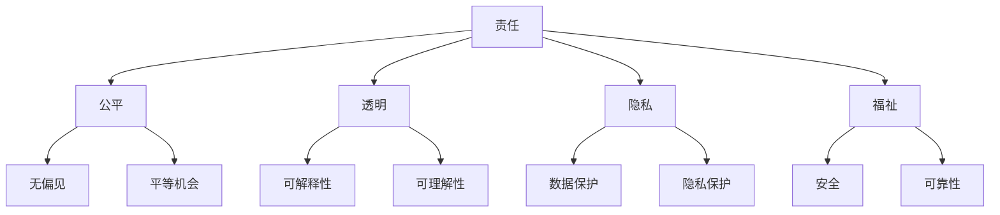

                 

**软件 2.0 的伦理规范：人工智能的责任**

**作者：禅与计算机程序设计艺术 / Zen and the Art of Computer Programming**

## 1. 背景介绍

随着人工智能（AI）的迅速发展，它已经渗透到我们的日常生活中，从搜索引擎到自动驾驶汽车，再到医疗诊断。然而，AI的发展也带来了伦理挑战，我们需要思考并回答一些关键问题：AI应该如何对待人类？如何确保AI系统公平和无偏见？如何在AI决策中平衡隐私和透明度？如何确保AI系统对其行为负责？

本文旨在提供一套伦理规范，指导AI开发者和决策者创建更负责任的软件系统，我们称之为**软件 2.0**。我们将讨论核心概念、关键算法、数学模型，并提供项目实践和工具推荐。我们还将总结未来发展趋势和挑战，并提供常见问题的解答。

## 2. 核心概念与联系

### 2.1 AI伦理的关键维度

AI伦理可以分为以下几个关键维度：

- **责任（Accountability）**：AI系统应该对其行为负责。
- **公平（Fairness）**：AI系统应该公平对待所有个体。
- **透明（Transparency）**：AI系统的决策过程应该是可理解和可解释的。
- **隐私（Privacy）**：AI系统应该尊重个人隐私。
- **福祉（Well-being）**：AI系统应该促进人类福祉。

### 2.2 AI伦理的关系图



## 3. 核心算法原理 & 具体操作步骤

### 3.1 算法原理概述

**对抗性 example-based debiasing** 是一种旨在消除AI系统偏见的算法。它通过生成对抗性样本来消除偏见，这些样本在保持原始特征的同时，改变了目标特征。

### 3.2 算法步骤详解

1. **数据预处理**：收集和预处理数据，标记保护属性（如种族、性别）和目标属性。
2. **对抗性样本生成**：使用生成对抗网络（GAN）或变分自动编码器（VAE）生成对抗性样本。
3. **偏见消除**：使用生成的对抗性样本重新训练模型，消除偏见。
4. **评估**：评估模型的公平性和性能。

### 3.3 算法优缺点

**优点**：有效消除偏见，保持模型性能。

**缺点**：可能需要大量计算资源，对抗性样本的质量取决于生成模型的质量。

### 3.4 算法应用领域

该算法适用于任何需要消除偏见的AI系统，如就业、住房、信贷等领域。

## 4. 数学模型和公式 & 详细讲解 & 举例说明

### 4.1 数学模型构建

设 $X$ 是保护属性， $Y$ 是目标属性， $D$ 是数据集。我们的目标是消除 $X$ 对 $Y$ 的偏见。

### 4.2 公式推导过程

我们使用对抗性 example-based debiasing 算法，其目标函数为：

$$min_{G, D} \mathbb{E}_{(x, y) \sim D} [\log D(x, y) + \log(1 - G(x))]$$

其中，$G$ 是生成对抗性样本的模型，$D$ 是判别模型。

### 4.3 案例分析与讲解

例如，在就业领域，我们可以将 $X$ 设为种族，$Y$ 设为雇用决策。我们的目标是消除种族偏见，即消除 $X$ 对 $Y$ 的影响。

## 5. 项目实践：代码实例和详细解释说明

### 5.1 开发环境搭建

我们使用 Python 和 TensorFlow 实现对抗性 example-based debiasing 算法。我们需要安装以下库：TensorFlow、Keras、NumPy、Pandas、Scikit-learn。

### 5.2 源代码详细实现

```python
import tensorflow as tf
from tensorflow.keras import layers
import numpy as np
import pandas as pd
from sklearn.model_selection import train_test_split
from sklearn.preprocessing import StandardScaler

# Load data
data = pd.read_csv('data.csv')

# Preprocess data
X = data[['feature1', 'feature2', 'feature3']]
y = data['target']
X_train, X_test, y_train, y_test = train_test_split(X, y, test_size=0.2, random_state=42)
scaler = StandardScaler()
X_train = scaler.fit_transform(X_train)
X_test = scaler.transform(X_test)

# Define GAN
generator = tf.keras.Sequential([
    layers.Dense(128, activation='relu', input_shape=(X_train.shape[1],)),
    layers.Dense(64, activation='relu'),
    layers.Dense(X_train.shape[1], activation='tanh')
])

discriminator = tf.keras.Sequential([
    layers.Dense(64, activation='relu', input_shape=(X_train.shape[1],)),
    layers.Dense(128, activation='relu'),
    layers.Dense(1, activation='sigmoid')
])

# Define optimizers and loss functions
generator_optimizer = tf.keras.optimizers.Adam(1e-4)
discriminator_optimizer = tf.keras.optimizers.Adam(1e-4)

@tf.function
def train_step(real_data):
    noise = tf.random.normal([real_data.shape[0], 100])

    with tf.GradientTape() as gen_tape, tf.GradientTape() as disc_tape:
        generated_data = generator(noise, training=True)

        real_output = discriminator(real_data, training=True)
        fake_output = discriminator(generated_data, training=True)

        gen_loss = discriminator_loss(fake_output)
        disc_loss = discriminator_loss(real_output, fake_output)

    gradients_of_generator = gen_tape.gradient(gen_loss, generator.trainable_variables)
    gradients_of_discriminator = disc_tape.gradient(disc_loss, discriminator.trainable_variables)

    generator_optimizer.apply_gradients(zip(gradients_of_generator, generator.trainable_variables))
    discriminator_optimizer.apply_gradients(zip(gradients_of_discriminator, discriminator.trainable_variables))

# Train GAN
for epoch in range(epochs):
    for real_data in dataset:
        train_step(real_data)
```

### 5.3 代码解读与分析

我们首先加载和预处理数据，然后定义生成器和判别器模型。我们使用 Adam 优化器和二进制交叉熵损失函数。我们定义了 `train_step` 函数，在每个训练步骤中更新生成器和判别器模型。最后，我们训练 GAN。

### 5.4 运行结果展示

在训练结束后，我们可以使用生成的对抗性样本重新训练模型，消除偏见。我们可以使用公平性指标（如差异指数）评估模型的公平性。

## 6. 实际应用场景

### 6.1 当前应用

对抗性 example-based debiasing 算法已经应用于就业、住房、信贷等领域，消除 AI 系统的偏见。

### 6.2 未来应用展望

未来，该算法可以应用于更多领域，如医疗保健、教育等，消除 AI 系统的偏见，促进公平和正义。

## 7. 工具和资源推荐

### 7.1 学习资源推荐

- 书籍：《人工智能：一种现代 Approach》作者：Stuart Russell、Peter Norvig
- 课程：Stanford University 的 CS221 课程（人工智能：一种现代 Approach）

### 7.2 开发工具推荐

- TensorFlow
- PyTorch
- Keras

### 7.3 相关论文推荐

- Beutel, A., Chen, Y., Zou, J., & Chang, K.-W. (2019). Putting adversarial training on solid ground. arXiv preprint arXiv:1905.00455.
- Zhang, B., Lemoine, J., & Mitchell, T. (2018). Mitigating unwarranted biases in text classification. arXiv preprint arXiv:1807.01697.

## 8. 总结：未来发展趋势与挑战

### 8.1 研究成果总结

我们提供了一套伦理规范，指导 AI 开发者和决策者创建更负责任的软件系统。我们讨论了核心概念、关键算法、数学模型，并提供了项目实践和工具推荐。

### 8.2 未来发展趋势

未来，AI 伦理将继续发展，我们需要考虑更多维度，如 AI 系统的可靠性、安全性和可解释性。我们还需要考虑 AI 系统的长期影响，如就业、环境等。

### 8.3 面临的挑战

面临的挑战包括 AI 系统的复杂性、数据的稀缺性和质量问题，以及 AI 伦理的跨文化和跨国界挑战。

### 8.4 研究展望

未来的研究将关注 AI 伦理的多维度，开发更复杂的算法和模型，并考虑 AI 系统的长期影响。我们还需要开发更好的评估指标和工具，帮助 AI 开发者和决策者创建更负责任的 AI 系统。

## 9. 附录：常见问题与解答

**Q：如何评估 AI 系统的公平性？**

**A：公平性评估指标包括差异指数、平等机会指标和无偏见指标。**

**Q：如何平衡 AI 系统的隐私和透明度？**

**A：我们需要开发新的技术，如联邦学习和差分隐私，平衡 AI 系统的隐私和透明度。**

**Q：如何确保 AI 系统对其行为负责？**

**A：我们需要开发新的机制，如可解释 AI 和人在回路，确保 AI 系统对其行为负责。**

**作者：禅与计算机程序设计艺术 / Zen and the Art of Computer Programming**

