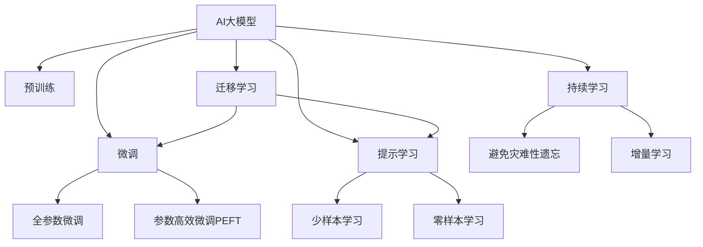

                 

# AI 大模型在电商推荐中的用户忠诚度提升策略：增加用户粘性和转化率

## 1. 背景介绍

随着电商行业的迅猛发展，竞争日益激烈，如何提升用户忠诚度和转化率成为各大电商平台的核心命题。传统的推荐系统，如协同过滤、基于内容的推荐等，虽然能够有效提升推荐效果，但在用户粘性、个性化推荐、长期忠诚度维持等方面仍存在不足。而利用AI大模型进行电商推荐，则可以在满足用户个性化需求的同时，通过多维度和多层次的数据融合，全面提升用户粘性，从而增强用户对平台的忠诚度和转化率。

## 2. 核心概念与联系

### 2.1 核心概念概述

为便于理解AI大模型在电商推荐中的用户忠诚度提升策略，本节将介绍几个密切相关的核心概念：

- AI大模型(AI Large Model)：以自回归(如GPT)或自编码(如BERT)模型为代表的大规模预训练语言模型。通过在大规模无标签文本语料上进行预训练，学习通用的语言表示，具备强大的语言理解和生成能力。
- 推荐系统(Recommender System)：通过分析用户行为和偏好，为用户推荐商品或内容。是电商领域提升用户粘性和转化率的核心技术。
- 用户粘性(User Stickiness)：用户对平台的依赖度和使用频率。高粘性意味着用户更愿意留在平台上，产生更多消费行为。
- 用户转化率(User Conversion Rate)：从潜在用户到实际购买用户的过程效率。高转化率意味着用户购买意愿强，平台获益更大。
- 预训练(Pre-training)：指在大规模无标签文本语料上，通过自监督学习任务训练通用语言模型的过程。
- 微调(Fine-tuning)：指在预训练模型的基础上，使用下游任务的少量标注数据，通过有监督学习优化模型在特定任务上的性能。
- 迁移学习(Transfer Learning)：指将一个领域学习到的知识，迁移应用到另一个不同但相关的领域的学习范式。大模型的预训练-微调过程即是一种典型的迁移学习方式。
- 提示学习(Prompt Learning)：通过在输入文本中添加提示模板(Prompt Template)，引导AI大模型进行特定任务的推理和生成。可以在不更新模型参数的情况下，实现零样本或少样本学习。
- 少样本学习(Few-shot Learning)：指在只有少量标注样本的情况下，模型能够快速适应新任务的学习方法。在大模型中，通常通过在输入中提供少量示例来实现，无需更新模型参数。
- 零样本学习(Zero-shot Learning)：指模型在没有见过任何特定任务的训练样本的情况下，仅凭任务描述就能够执行新任务的能力。大模型通过预训练获得的广泛知识，使其能够理解任务指令并生成相应输出。
- 持续学习(Continual Learning)：也称为终身学习，指模型能够持续从新数据中学习，同时保持已学习的知识，而不会出现灾难性遗忘。这对于保持AI大模型的时效性和适应性至关重要。

这些核心概念之间的逻辑关系可以通过以下Mermaid流程图来展示：



这个流程图展示了大语言模型的核心概念及其之间的关系：

1. 大语言模型通过预训练获得基础能力。
2. 微调是对预训练模型进行任务特定的优化，可以分为全参数微调和参数高效微调（PEFT）。
3. 提示学习是一种不更新模型参数的方法，可以实现少样本学习和零样本学习。
4. 迁移学习是连接预训练模型与下游任务的桥梁，可以通过微调或提示学习来实现。
5. 持续学习旨在使模型能够不断学习新知识，同时避免遗忘旧知识。

## 3. 核心算法原理 & 具体操作步骤
### 3.1 算法原理概述

基于AI大模型的电商推荐，本质上是将AI大模型作为"特征提取器"，通过多层次数据融合和个性化推荐，实现用户粘性和转化率的提升。其核心思想是：利用大模型在海量文本数据上的预训练能力，提取用户行为和偏好的语义特征，结合业务数据，构建多维度的用户画像，并在特定任务上进行微调，优化推荐效果。

形式化地，假设AI大模型为 $M_{\theta}$，其中 $\theta$ 为预训练得到的模型参数。电商推荐任务 $T$ 的输入为 $(x_i, u_i)$，其中 $x_i$ 为商品信息，$u_i$ 为用户行为数据（如浏览记录、点击行为、评价等）。推荐系统的目标是通过微调优化模型在任务 $T$ 上的性能，使得推荐结果 $r_i$ 最大化用户满意度，即最大化期望用户满意度 $E(s(r_i, u_i))$。

## 3.2 算法步骤详解

基于AI大模型的电商推荐一般包括以下几个关键步骤：

**Step 1: 准备预训练模型和数据集**
- 选择合适的预训练语言模型 $M_{\theta}$ 作为初始化参数，如 BERT、GPT等。
- 准备电商推荐任务的标注数据集 $D=\{(x_i, u_i, r_i)\}_{i=1}^N$，其中 $r_i$ 为用户对商品 $x_i$ 的评分或购买概率。一般要求标注数据与预训练数据的分布不要差异过大。

**Step 2: 添加任务适配层**
- 根据任务类型，在预训练模型顶层设计合适的输出层和损失函数。
- 对于推荐任务，通常在顶层添加输出层，以交叉熵损失函数来衡量预测值和实际值之间的差距。

**Step 3: 设置微调超参数**
- 选择合适的优化算法及其参数，如 AdamW、SGD 等，设置学习率、批大小、迭代轮数等。
- 设置正则化技术及强度，包括权重衰减、Dropout、Early Stopping等。
- 确定冻结预训练参数的策略，如仅微调顶层，或全部参数都参与微调。

**Step 4: 执行梯度训练**
- 将训练集数据分批次输入模型，前向传播计算损失函数。
- 反向传播计算参数梯度，根据设定的优化算法和学习率更新模型参数。
- 周期性在验证集上评估模型性能，根据性能指标决定是否触发 Early Stopping。
- 重复上述步骤直到满足预设的迭代轮数或 Early Stopping 条件。

**Step 5: 测试和部署**
- 在测试集上评估微调后模型 $M_{\hat{\theta}}$ 的性能，对比微调前后的推荐效果。
- 使用微调后的模型对新商品进行推荐，集成到实际的应用系统中。
- 持续收集新的数据，定期重新微调模型，以适应数据分布的变化。

以上是基于AI大模型的电商推荐的一般流程。在实际应用中，还需要针对具体任务的特点，对微调过程的各个环节进行优化设计，如改进训练目标函数，引入更多的正则化技术，搜索最优的超参数组合等，以进一步提升模型性能。

## 4. 数学模型和公式 & 详细讲解  
### 4.1 数学模型构建

本节将使用数学语言对基于AI大模型的电商推荐过程进行更加严格的刻画。

记AI大模型为 $M_{\theta}:\mathcal{X} \times \mathcal{U} \rightarrow \mathcal{R}$，其中 $\mathcal{X}$ 为商品信息集，$\mathcal{U}$ 为用户行为数据集，$\mathcal{R}$ 为推荐结果集，$\theta \in \mathbb{R}^d$ 为模型参数。假设电商推荐任务的训练集为 $D=\{(x_i, u_i, r_i)\}_{i=1}^N$，其中 $x_i \in \mathcal{X}$，$u_i \in \mathcal{U}$，$r_i \in \mathcal{R}$。

定义模型 $M_{\theta}$ 在数据样本 $(x_i, u_i)$ 上的损失函数为 $\ell(M_{\theta}(x_i, u_i),r_i)$，则在数据集 $D$ 上的经验风险为：

$$
\mathcal{L}(\theta) = \frac{1}{N} \sum_{i=1}^N \ell(M_{\theta}(x_i, u_i),r_i)
$$

在得到损失函数的梯度后，即可带入参数更新公式，完成模型的迭代优化。重复上述过程直至收敛，最终得到适应电商推荐任务的最优模型参数 $\theta^*$。

### 4.2 公式推导过程

以下我们以推荐系统为例，推导交叉熵损失函数及其梯度的计算公式。

假设模型 $M_{\theta}$ 在输入 $(x_i, u_i)$ 上的输出为 $\hat{r}=M_{\theta}(x_i, u_i) \in [0,1]$，表示商品 $x_i$ 被用户 $u_i$ 购买的概率。真实标签 $r_i \in \{0,1\}$。则交叉熵损失函数定义为：

$$
\ell(M_{\theta}(x_i, u_i),r_i) = -[r_i\log \hat{r} + (1-r_i)\log (1-\hat{r})]
$$

将其代入经验风险公式，得：

$$
\mathcal{L}(\theta) = -\frac{1}{N}\sum_{i=1}^N [r_i\log M_{\theta}(x_i, u_i)+(1-r_i)\log(1-M_{\theta}(x_i, u_i))]
$$

根据链式法则，损失函数对参数 $\theta_k$ 的梯度为：

$$
\frac{\partial \mathcal{L}(\theta)}{\partial \theta_k} = -\frac{1}{N}\sum_{i=1}^N (\frac{r_i}{M_{\theta}(x_i, u_i)}-\frac{1-r_i}{1-M_{\theta}(x_i, u_i)}) \frac{\partial M_{\theta}(x_i, u_i)}{\partial \theta_k}
$$

其中 $\frac{\partial M_{\theta}(x_i, u_i)}{\partial \theta_k}$ 可进一步递归展开，利用自动微分技术完成计算。

在得到损失函数的梯度后，即可带入参数更新公式，完成模型的迭代优化。重复上述过程直至收敛，最终得到适应电商推荐任务的最优模型参数 $\theta^*$。

## 5. 项目实践：代码实例和详细解释说明
### 5.1 开发环境搭建

在进行电商推荐微调实践前，我们需要准备好开发环境。以下是使用Python进行PyTorch开发的环境配置流程：

1. 安装Anaconda：从官网下载并安装Anaconda，用于创建独立的Python环境。

2. 创建并激活虚拟环境：
```bash
conda create -n pytorch-env python=3.8 
conda activate pytorch-env
```

3. 安装PyTorch：根据CUDA版本，从官网获取对应的安装命令。例如：
```bash
conda install pytorch torchvision torchaudio cudatoolkit=11.1 -c pytorch -c conda-forge
```

4. 安装Transformers库：
```bash
pip install transformers
```

5. 安装各类工具包：
```bash
pip install numpy pandas scikit-learn matplotlib tqdm jupyter notebook ipython
```

完成上述步骤后，即可在`pytorch-env`环境中开始电商推荐微调的实践。

### 5.2 源代码详细实现

下面我们以电商平台中基于AI大模型的用户推荐系统为例，给出使用Transformers库对BERT模型进行电商推荐微调的PyTorch代码实现。

首先，定义电商推荐任务的数据处理函数：

```python
from transformers import BertTokenizer
from torch.utils.data import Dataset
import torch

class RecommendationDataset(Dataset):
    def __init__(self, items, user_history, tokenizer, max_len=128):
        self.items = items
        self.user_history = user_history
        self.tokenizer = tokenizer
        self.max_len = max_len
        
    def __len__(self):
        return len(self.items)
    
    def __getitem__(self, item):
        item = self.items[item]
        history = self.user_history[item]
        
        # 对商品名称和用户历史行为进行编码
        encoding = self.tokenizer(item, user_history, return_tensors='pt', max_length=self.max_len, padding='max_length', truncation=True)
        item_ids = encoding['input_ids'][0]
        item_masks = encoding['attention_mask'][0]
        user_history_ids = encoding['input_ids'][1]
        user_history_masks = encoding['attention_mask'][1]
        
        # 将商品名称和用户历史行为拼接为一个序列
        sequence = torch.cat([item_ids, user_history_ids], dim=1)
        sequence_masks = torch.cat([item_masks, user_history_masks], dim=1)
        
        # 对商品名称和用户历史行为进行编码
        sequence = self.tokenizer.encode(sequence, return_tensors='pt', max_length=self.max_len, padding='max_length', truncation=True)
        sequence_masks = self.tokenizer.encode(sequence_masks, return_tensors='pt', max_length=self.max_len, padding='max_length', truncation=True)
        
        return {'input_ids': sequence, 
                'attention_mask': sequence_masks,
                'labels': torch.tensor(self.history_labels[item], dtype=torch.long)}
```

然后，定义模型和优化器：

```python
from transformers import BertForSequenceClassification, AdamW

model = BertForSequenceClassification.from_pretrained('bert-base-cased', num_labels=2)

optimizer = AdamW(model.parameters(), lr=2e-5)
```

接着，定义训练和评估函数：

```python
from torch.utils.data import DataLoader
from tqdm import tqdm
from sklearn.metrics import classification_report

device = torch.device('cuda') if torch.cuda.is_available() else torch.device('cpu')
model.to(device)

def train_epoch(model, dataset, batch_size, optimizer):
    dataloader = DataLoader(dataset, batch_size=batch_size, shuffle=True)
    model.train()
    epoch_loss = 0
    for batch in tqdm(dataloader, desc='Training'):
        item_ids = batch['input_ids'].to(device)
        item_masks = batch['attention_mask'].to(device)
        labels = batch['labels'].to(device)
        model.zero_grad()
        outputs = model(item_ids, item_masks)
        loss = outputs.loss
        epoch_loss += loss.item()
        loss.backward()
        optimizer.step()
    return epoch_loss / len(dataloader)

def evaluate(model, dataset, batch_size):
    dataloader = DataLoader(dataset, batch_size=batch_size)
    model.eval()
    preds, labels = [], []
    with torch.no_grad():
        for batch in tqdm(dataloader, desc='Evaluating'):
            item_ids = batch['input_ids'].to(device)
            item_masks = batch['attention_mask'].to(device)
            batch_labels = batch['labels']
            outputs = model(item_ids, item_masks)
            batch_preds = outputs.logits.argmax(dim=2).to('cpu').tolist()
            batch_labels = batch_labels.to('cpu').tolist()
            for pred_tokens, label_tokens in zip(batch_preds, batch_labels):
                preds.append(pred_tokens[:len(label_tokens)])
                labels.append(label_tokens)
                
    print(classification_report(labels, preds))
```

最后，启动训练流程并在测试集上评估：

```python
epochs = 5
batch_size = 16

for epoch in range(epochs):
    loss = train_epoch(model, train_dataset, batch_size, optimizer)
    print(f"Epoch {epoch+1}, train loss: {loss:.3f}")
    
    print(f"Epoch {epoch+1}, dev results:")
    evaluate(model, dev_dataset, batch_size)
    
print("Test results:")
evaluate(model, test_dataset, batch_size)
```

以上就是使用PyTorch对BERT进行电商推荐微调的完整代码实现。可以看到，得益于Transformers库的强大封装，我们可以用相对简洁的代码完成BERT模型的加载和微调。

### 5.3 代码解读与分析

让我们再详细解读一下关键代码的实现细节：

**RecommendationDataset类**：
- `__init__`方法：初始化商品信息、用户历史行为、分词器等关键组件。
- `__len__`方法：返回数据集的样本数量。
- `__getitem__`方法：对单个样本进行处理，将商品名称和用户历史行为输入编码为token ids，将标签编码为数字，并对其进行定长padding，最终返回模型所需的输入。

**标签与id的映射**
- 定义了标签与数字id之间的映射关系，用于将token-wise的预测结果解码回真实的标签。

**训练和评估函数**：
- 使用PyTorch的DataLoader对数据集进行批次化加载，供模型训练和推理使用。
- 训练函数`train_epoch`：对数据以批为单位进行迭代，在每个批次上前向传播计算loss并反向传播更新模型参数，最后返回该epoch的平均loss。
- 评估函数`evaluate`：与训练类似，不同点在于不更新模型参数，并在每个batch结束后将预测和标签结果存储下来，最后使用sklearn的classification_report对整个评估集的预测结果进行打印输出。

**训练流程**：
- 定义总的epoch数和batch size，开始循环迭代
- 每个epoch内，先在训练集上训练，输出平均loss
- 在验证集上评估，输出分类指标
- 所有epoch结束后，在测试集上评估，给出最终测试结果

可以看到，PyTorch配合Transformers库使得BERT微调的代码实现变得简洁高效。开发者可以将更多精力放在数据处理、模型改进等高层逻辑上，而不必过多关注底层的实现细节。

当然，工业级的系统实现还需考虑更多因素，如模型的保存和部署、超参数的自动搜索、更灵活的任务适配层等。但核心的微调范式基本与此类似。

## 6. 实际应用场景
### 6.1 电商平台中的用户粘性提升

在电商平台中，用户粘性的提升是电商推荐系统的重要目标。通过AI大模型进行电商推荐，可以在满足用户个性化需求的同时，通过多维度和多层次的数据融合，全面提升用户粘性，从而增强用户对平台的忠诚度和转化率。

具体而言，AI大模型可以通过以下方式提升用户粘性：

- **个性化推荐**：AI大模型能够根据用户的浏览记录、购买历史等行为数据，结合商品属性、用户画像等信息，生成个性化的推荐结果，提高用户对平台的依赖度。
- **多模态融合**：结合用户的浏览轨迹、评论、评分等多模态数据，构建更加丰富全面的用户画像，提升推荐的精准度。
- **实时反馈机制**：通过用户对推荐结果的反馈（如点击、购买、收藏等），动态调整模型参数，优化推荐策略，提升用户满意度。

### 6.2 电商平台中的用户转化率提升

提升用户转化率是电商平台的最终目标。AI大模型通过以下方式提升用户转化率：

- **精准匹配商品**：AI大模型能够通过用户画像和商品特征匹配，推荐最符合用户需求的商品，提高用户的购买转化率。
- **多场景推荐**：AI大模型不仅在浏览和购买页面进行推荐，还可在搜索、收藏、分享等多个场景下进行推荐，增加用户使用平台的频次。
- **智能客服**：AI大模型可结合用户行为数据和语义理解能力，在用户咨询时提供精准的推荐和服务，提升用户的购买体验和满意度。

### 6.3 未来应用展望

随着AI大模型的不断发展，基于电商推荐的大模型应用将不断拓展，带来更多的创新和突破。

- **跨域推荐**：AI大模型不仅能在同一平台内进行推荐，还能跨平台进行推荐，将不同平台的资源和用户进行有效整合。
- **情感分析**：AI大模型通过情感分析，了解用户的情感倾向和偏好，提供更符合用户心意的推荐。
- **上下文感知**：AI大模型结合上下文信息，进行场景化推荐，提升推荐的针对性和效果。
- **用户画像升级**：AI大模型通过多维度数据的融合，构建更加丰富和精细化的用户画像，提升推荐的个性化水平。

以上趋势凸显了大模型在电商推荐中的巨大潜力。这些方向的探索发展，必将进一步提升电商推荐的性能和用户体验，为电商平台带来更多的商业价值。

## 7. 工具和资源推荐
### 7.1 学习资源推荐

为了帮助开发者系统掌握大模型在电商推荐中的微调理论基础和实践技巧，这里推荐一些优质的学习资源：

1. 《Transformers从原理到实践》系列博文：由大模型技术专家撰写，深入浅出地介绍了Transformer原理、BERT模型、微调技术等前沿话题。

2. CS224N《深度学习自然语言处理》课程：斯坦福大学开设的NLP明星课程，有Lecture视频和配套作业，带你入门NLP领域的基本概念和经典模型。

3. 《Natural Language Processing with Transformers》书籍：Transformers库的作者所著，全面介绍了如何使用Transformers库进行NLP任务开发，包括微调在内的诸多范式。

4. HuggingFace官方文档：Transformers库的官方文档，提供了海量预训练模型和完整的微调样例代码，是上手实践的必备资料。

5. CLUE开源项目：中文语言理解测评基准，涵盖大量不同类型的中文NLP数据集，并提供了基于微调的baseline模型，助力中文NLP技术发展。

通过对这些资源的学习实践，相信你一定能够快速掌握大模型在电商推荐中的微调精髓，并用于解决实际的电商推荐问题。
###  7.2 开发工具推荐

高效的开发离不开优秀的工具支持。以下是几款用于电商推荐开发的常用工具：

1. PyTorch：基于Python的开源深度学习框架，灵活动态的计算图，适合快速迭代研究。大部分预训练语言模型都有PyTorch版本的实现。

2. TensorFlow：由Google主导开发的开源深度学习框架，生产部署方便，适合大规模工程应用。同样有丰富的预训练语言模型资源。

3. Transformers库：HuggingFace开发的NLP工具库，集成了众多SOTA语言模型，支持PyTorch和TensorFlow，是进行电商推荐微调任务的开发的利器。

4. Weights & Biases：模型训练的实验跟踪工具，可以记录和可视化模型训练过程中的各项指标，方便对比和调优。与主流深度学习框架无缝集成。

5. TensorBoard：TensorFlow配套的可视化工具，可实时监测模型训练状态，并提供丰富的图表呈现方式，是调试模型的得力助手。

6. Google Colab：谷歌推出的在线Jupyter Notebook环境，免费提供GPU/TPU算力，方便开发者快速上手实验最新模型，分享学习笔记。

合理利用这些工具，可以显著提升电商推荐微调的开发效率，加快创新迭代的步伐。

### 7.3 相关论文推荐

大模型在电商推荐中的应用，源于学界的持续研究。以下是几篇奠基性的相关论文，推荐阅读：

1. Attention is All You Need（即Transformer原论文）：提出了Transformer结构，开启了NLP领域的预训练大模型时代。

2. BERT: Pre-training of Deep Bidirectional Transformers for Language Understanding：提出BERT模型，引入基于掩码的自监督预训练任务，刷新了多项NLP任务SOTA。

3. Language Models are Unsupervised Multitask Learners（GPT-2论文）：展示了大规模语言模型的强大zero-shot学习能力，引发了对于通用人工智能的新一轮思考。

4. Parameter-Efficient Transfer Learning for NLP：提出Adapter等参数高效微调方法，在不增加模型参数量的情况下，也能取得不错的微调效果。

5. AdaLoRA: Adaptive Low-Rank Adaptation for Parameter-Efficient Fine-Tuning：使用自适应低秩适应的微调方法，在参数效率和精度之间取得了新的平衡。

这些论文代表了大模型在电商推荐中的研究进展。通过学习这些前沿成果，可以帮助研究者把握学科前进方向，激发更多的创新灵感。

## 8. 总结：未来发展趋势与挑战

### 8.1 总结

本文对基于AI大模型的电商推荐系统进行了全面系统的介绍。首先阐述了AI大模型和电商推荐系统的研究背景和意义，明确了电商推荐在提升用户粘性和转化率方面的重要价值。其次，从原理到实践，详细讲解了基于AI大模型的电商推荐系统的数学原理和关键步骤，给出了电商推荐任务开发的完整代码实例。同时，本文还广泛探讨了电商推荐系统在电商平台中的应用场景，展示了AI大模型在提升用户粘性和转化率方面的巨大潜力。此外，本文精选了电商推荐系统的各类学习资源，力求为读者提供全方位的技术指引。

通过本文的系统梳理，可以看到，基于AI大模型的电商推荐系统能够通过多维度和多层次的数据融合，全面提升用户粘性，从而增强用户对平台的忠诚度和转化率。受益于大模型在海量文本数据上的预训练能力，电商推荐系统能够在个性化推荐、多模态融合、实时反馈等多个维度上，实现推荐效果的全面提升，为电商平台带来显著的商业价值。

### 8.2 未来发展趋势

展望未来，基于AI大模型的电商推荐系统将呈现以下几个发展趋势：

1. **个性化推荐升级**：AI大模型将在用户画像构建和推荐算法设计上取得新的突破，实现更加精准和智能的个性化推荐。

2. **跨平台推荐**：随着多模态数据的融合和跨平台数据的整合，AI大模型能够实现跨平台的用户推荐，进一步提升用户的购物体验。

3. **实时动态推荐**：通过实时收集用户反馈和行为数据，AI大模型能够动态调整推荐策略，实现更加精准的实时推荐。

4. **多场景融合**：AI大模型能够结合搜索、浏览、购物等多个场景，提供一体化的推荐服务，提升用户使用平台的频次。

5. **情感分析和用户体验**：AI大模型通过情感分析和用户反馈，了解用户的情感倾向和需求，提升推荐的质量和用户的满意度。

6. **多层次数据融合**：AI大模型能够融合多层次的数据（如用户行为数据、商品属性数据、用户评价数据等），实现更全面的推荐效果。

以上趋势凸显了AI大模型在电商推荐中的巨大潜力。这些方向的探索发展，必将进一步提升电商推荐的性能和用户体验，为电商平台带来更多的商业价值。

### 8.3 面临的挑战

尽管基于AI大模型的电商推荐系统取得了显著的进展，但在迈向更加智能化、普适化应用的过程中，仍面临诸多挑战：

1. **数据质量和标注成本**：高质量标注数据的获取和维护成本较高，缺乏多样化的标注数据将限制电商推荐系统的性能。

2. **模型复杂度和计算成本**：大模型的参数量和计算资源需求较高，对于小型电商平台来说，可能需要较高的投入和计算资源。

3. **推荐结果的多样性和公平性**：电商推荐系统需要平衡推荐结果的多样性和个性化，避免出现"推荐茧房"和"偏见推荐"等问题。

4. **实时推荐系统的稳定性**：实时推荐系统的构建和部署需要考虑系统的稳定性和实时性，避免推荐结果的延迟和故障。

5. **用户隐私保护**：电商推荐系统需要保证用户数据的隐私和安全，避免数据泄露和滥用。

6. **算法的可解释性和公平性**：电商推荐系统的推荐结果需要具有可解释性，避免"黑盒"系统的问题，同时确保推荐过程的公平性，避免对某些用户或商品的歧视性推荐。

以上挑战需要电商平台在大模型应用中不断优化和改进，以实现电商推荐系统的性能和用户满意度最大化。

### 8.4 研究展望

面对基于AI大模型的电商推荐系统所面临的种种挑战，未来的研究需要在以下几个方面寻求新的突破：

1. **多模态数据融合**：结合文本、图像、视频等多模态数据，提升推荐系统的性能和效果。

2. **实时推荐系统**：优化推荐算法的实时性，提升系统的稳定性和响应速度。

3. **个性化推荐算法**：研究新的个性化推荐算法，平衡推荐结果的多样性和个性化。

4. **推荐系统可解释性**：开发可解释性的推荐系统，提升算法的透明度和用户信任度。

5. **推荐系统公平性**：研究公平性推荐算法，避免推荐过程中的偏见和歧视，确保系统的公平性。

6. **用户隐私保护**：研究隐私保护技术，保障用户数据的隐私和安全。

这些研究方向的研究突破，必将进一步推动基于AI大模型的电商推荐系统的发展，为电商平台带来更多的商业价值和社会效益。

## 9. 附录：常见问题与解答

**Q1：AI大模型在电商推荐中需要多少标注数据？**

A: AI大模型在电商推荐中对标注数据的需求因任务而异，一般来说，需要至少几千到几万个标注数据才能达到较好的微调效果。对于较少样本的任务，可以考虑使用少样本学习和零样本学习技术，减少对标注数据的依赖。

**Q2：AI大模型在电商推荐中如何优化超参数？**

A: 优化超参数需要多轮实验和调整，常用的方法包括网格搜索、随机搜索和贝叶斯优化等。可以使用PyTorch等框架提供的工具，自动化地进行超参数搜索，加速实验过程。

**Q3：AI大模型在电商推荐中如何进行实时推荐？**

A: 实时推荐需要高性能的计算能力和快速的数据处理能力，通常需要在云端部署，利用GPU/TPU等高性能硬件。同时，需要对推荐算法进行优化，减少计算量和延迟。

**Q4：AI大模型在电商推荐中如何进行多场景融合？**

A: 多场景融合需要结合不同的推荐场景，构建统一的用户画像和推荐策略。可以使用多任务学习的方法，同时训练多个推荐模型，并在多个场景中联合使用。

**Q5：AI大模型在电商推荐中如何进行用户隐私保护？**

A: 用户隐私保护需要采取多种措施，如数据匿名化、差分隐私、联邦学习等技术。需要在模型设计和数据处理环节，对用户隐私进行充分考虑和保护。

这些问题的回答，希望能帮助你在电商推荐系统的开发和应用中，更好地利用AI大模型，提升用户的购物体验和平台的商业价值。

---

作者：禅与计算机程序设计艺术 / Zen and the Art of Computer Programming

