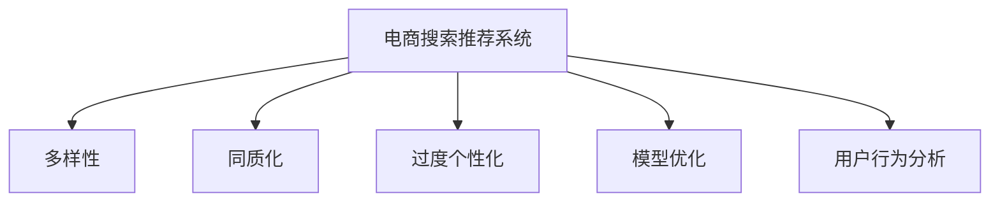

                 

# AI 大模型在电商搜索推荐中的多样性策略：避免同质化与过度个性化

> 关键词：电商搜索推荐, 多样性, 同质化, 过度个性化, 模型优化, 用户行为分析, 推荐系统

## 1. 背景介绍

随着互联网的迅速发展和电子商务的崛起，在线购物平台已成为人们日常购物的重要渠道。电商平台的搜索推荐系统（Recommendation System），通过分析用户的浏览、点击、购买等行为数据，为用户推荐可能感兴趣的商品，极大提升了用户体验和平台转化率。然而，随着推荐算法的不断优化，一些负面效应也逐渐显现，如搜索推荐的同质化问题（Homogenization）和过度个性化问题（Over-Personalization）。

### 1.1 同质化问题

同质化问题指的是，由于算法推荐机制的过度依赖，导致用户只看到自己偏好的商品，而无法接触到多样化的商品信息，限制了用户的探索能力，长此以往，用户的兴趣范围将变得越来越窄，难以接受新奇的事物，从而限制了平台的多样性和用户的体验。

### 1.2 过度个性化问题

过度个性化问题则是指，由于算法对用户行为的过度拟合，导致用户看到的商品信息过于相似，如相同品牌、相似类别、类似价格等，缺乏新鲜感和多样性，降低了用户的购物体验和满意度。

为了解决这些问题，需要在大模型（如BERT、GPT等）的基础上，引入多样性策略，增强推荐系统的个性化和多样性，从而提升用户粘性和平台的商业价值。

## 2. 核心概念与联系

### 2.1 核心概念概述

为了系统性地应对电商搜索推荐中的同质化与过度个性化问题，本节将介绍几个密切相关的核心概念：

- **电商搜索推荐系统**：通过分析用户行为数据，为用户推荐可能感兴趣的商品的推荐系统。
- **多样性（Diversity）**：指推荐结果的多样化程度，强调推荐系统不仅要考虑用户的个性化需求，还要为用户呈现多样化的商品信息。
- **同质化（Homogenization）**：指用户只看到自己偏好的商品，无法接触到多样化的商品信息，导致用户的兴趣范围变窄。
- **过度个性化（Over-Personalization）**：指推荐系统对用户行为的过度拟合，导致用户看到的商品信息过于相似，缺乏新鲜感和多样性。
- **模型优化**：指通过优化算法，增强推荐系统的效果和性能。
- **用户行为分析**：指通过分析用户的行为数据，了解用户的兴趣和偏好，从而进行更精准的推荐。

这些概念之间的逻辑关系可以通过以下Mermaid流程图来展示：



这个流程图展示了大模型在电商搜索推荐系统中的核心概念及其之间的关系：

1. 电商搜索推荐系统通过多样性策略，增强推荐结果的多样性，从而提升用户体验。
2. 多样性策略旨在避免同质化，让用户接触到多样化的商品信息。
3. 用户行为分析可以帮助系统更好地理解用户的偏好，避免过度个性化。
4. 模型优化是提升推荐系统效果和性能的重要手段，通过优化算法，增强推荐效果。

## 3. 核心算法原理 & 具体操作步骤
### 3.1 算法原理概述

大模型在电商搜索推荐中的应用，本质上是一个推荐系统的优化问题。其核心思想是：通过优化算法，增强推荐结果的多样性和个性化，避免同质化和过度个性化问题。

形式化地，假设推荐系统为用户推荐商品集合 $\mathcal{X}$，用户的历史行为数据为 $D=\{(x_i,y_i)\}_{i=1}^N$，其中 $x_i$ 为用户的浏览、点击、购买记录，$y_i$ 为推荐结果。

推荐系统的优化目标是最小化损失函数 $\mathcal{L}$，同时最大化推荐结果的多样性 $\mathcal{D}$。即：

$$
\min_{\theta} \mathcal{L}(\theta, D) \quad \text{s.t.} \quad \max_{\theta} \mathcal{D}(\theta)
$$

其中 $\theta$ 为推荐系统的参数，$\mathcal{L}$ 为损失函数，$\mathcal{D}$ 为多样性指标。

常见的多样性指标包括Hierarchical Diversity、Mean Reciprocal Rank等，用于衡量推荐结果的多样性程度。而损失函数则包括交叉熵损失、均方误差损失等，用于衡量推荐结果的准确性。

### 3.2 算法步骤详解

基于大模型的大电商搜索推荐系统微调过程一般包括以下几个关键步骤：

**Step 1: 准备数据集**

- 收集用户的历史行为数据 $D$，包括浏览记录、点击记录、购买记录等。
- 将用户的历史行为数据划分为训练集、验证集和测试集。

**Step 2: 构建推荐模型**

- 选择合适的预训练语言模型，如BERT、GPT等，作为推荐模型的基础。
- 设计推荐模型的架构，包括嵌入层、注意力机制、输出层等。

**Step 3: 添加任务适配层**

- 根据推荐任务，在预训练模型的基础上设计合适的任务适配层，如输出层、损失函数等。
- 对于推荐任务，通常使用交叉熵损失函数。

**Step 4: 设置优化器**

- 选择合适的优化器，如Adam、SGD等。
- 设置学习率、批大小、迭代轮数等超参数。

**Step 5: 执行梯度训练**

- 将训练集数据分批次输入模型，前向传播计算损失函数。
- 反向传播计算参数梯度，根据设定的优化算法和学习率更新模型参数。
- 周期性在验证集上评估模型性能，根据性能指标决定是否触发 Early Stopping。
- 重复上述步骤直至满足预设的迭代轮数或 Early Stopping 条件。

**Step 6: 测试和部署**

- 在测试集上评估微调后模型的性能，对比微调前后的推荐效果。
- 使用微调后的模型进行商品推荐，集成到实际的应用系统中。
- 持续收集新的数据，定期重新微调模型，以适应数据分布的变化。

以上是基于大模型的大电商搜索推荐系统微调的一般流程。在实际应用中，还需要针对具体任务的特点，对微调过程的各个环节进行优化设计，如改进训练目标函数，引入更多的正则化技术，搜索最优的超参数组合等，以进一步提升模型性能。

### 3.3 算法优缺点

基于大模型的大电商搜索推荐系统微调方法具有以下优点：

1. 简单高效。只需准备少量标注数据，即可对预训练模型进行快速适配，获得较大的性能提升。
2. 通用适用。适用于各种推荐系统，如协同过滤、基于内容的推荐等，设计简单的任务适配层即可实现微调。
3. 效果显著。在学术界和工业界的诸多推荐任务上，基于微调的方法已经刷新了最先进的性能指标。
4. 参数高效。利用参数高效微调技术，在固定大部分预训练参数的情况下，仍可取得不错的提升。

同时，该方法也存在一定的局限性：

1. 依赖标注数据。微调的效果很大程度上取决于标注数据的质量和数量，获取高质量标注数据的成本较高。
2. 迁移能力有限。当目标任务与预训练数据的分布差异较大时，微调的性能提升有限。
3. 可解释性不足。微调模型的决策过程通常缺乏可解释性，难以对其推理逻辑进行分析和调试。
4. 可能加剧数据偏差。微调过程中可能放大训练数据中的偏差，导致推荐结果的不公平。

尽管存在这些局限性，但就目前而言，基于大模型的微调方法仍是大电商搜索推荐系统的主要范式。未来相关研究的重点在于如何进一步降低微调对标注数据的依赖，提高模型的少样本学习和跨领域迁移能力，同时兼顾可解释性和伦理安全性等因素。

### 3.4 算法应用领域

基于大模型的大电商搜索推荐系统微调方法，在电子商务领域已经得到了广泛的应用，覆盖了几乎所有常见推荐任务，例如：

- 个性化推荐：根据用户的历史行为数据，推荐用户可能感兴趣的商品。
- 多样性推荐：在个性化推荐的基础上，增加推荐结果的多样性，避免同质化。
- 联合推荐：将商品推荐与用户推荐相结合，推荐更符合用户需求的商品。
- 实时推荐：根据用户的实时行为，动态调整推荐结果，增强用户体验。

除了上述这些经典任务外，大模型微调也被创新性地应用到更多场景中，如精准营销、库存管理、新商品推荐等，为电商平台带来了更多的商业价值。

## 4. 数学模型和公式 & 详细讲解  
### 4.1 数学模型构建

本节将使用数学语言对基于大模型的电商搜索推荐系统微调过程进行更加严格的刻画。

假设推荐系统为用户推荐商品集合 $\mathcal{X}$，用户的历史行为数据为 $D=\{(x_i,y_i)\}_{i=1}^N$，其中 $x_i$ 为用户的浏览、点击、购买记录，$y_i$ 为推荐结果。

定义推荐模型 $M_{\theta}$ 在输入 $x_i$ 上的输出为 $y_i'$，推荐结果为 $\hat{y}=M_{\theta}(x_i)$。则推荐系统的损失函数为：

$$
\mathcal{L}(\theta) = \frac{1}{N}\sum_{i=1}^N \ell(M_{\theta}(x_i),y_i)
$$

其中 $\ell$ 为损失函数，如交叉熵损失。推荐结果的多样性指标为 $\mathcal{D}(\theta)$，常见指标包括Hierarchical Diversity、Mean Reciprocal Rank等。

### 4.2 公式推导过程

以下我们以Hierarchical Diversity为例，推导推荐结果的多样性指标及其梯度的计算公式。

假设推荐系统为用户推荐商品集合 $\mathcal{X}$，用户的历史行为数据为 $D=\{(x_i,y_i)\}_{i=1}^N$，其中 $x_i$ 为用户的浏览、点击、购买记录，$y_i$ 为推荐结果。

推荐模型的输出为 $y_i'$，推荐结果为 $\hat{y}=M_{\theta}(x_i)$。推荐结果的多样性指标为 $\mathcal{D}(\theta)$，Hierarchical Diversity指标定义为：

$$
\mathcal{D}(\theta) = \sum_{i=1}^N \sum_{j=1}^{|\mathcal{X}|} \mathbb{P}(y_i = j, y_i' = j) \log \frac{\mathbb{P}(y_i = j, y_i' = j)}{\mathbb{P}(y_i = j)}
$$

其中 $\mathbb{P}(y_i = j, y_i' = j)$ 为推荐结果的多样性，$\mathbb{P}(y_i = j)$ 为推荐结果的期望。

为了最大化多样性指标，需要将推荐结果的多样性最大化。因此，推荐系统的优化目标是最小化损失函数 $\mathcal{L}(\theta)$，同时最大化推荐结果的多样性指标 $\mathcal{D}(\theta)$。

### 4.3 案例分析与讲解

下面以一个简单的推荐系统为例，解释Hierarchical Diversity指标的计算过程。

假设有一个包含3个商品的商品集合 $\mathcal{X} = \{商品A, 商品B, 商品C\}$，用户的历史行为数据为 $D=\{(x_1, 商品A), (x_2, 商品B), (x_3, 商品C)\}$。

推荐系统为用户推荐商品集合 $\mathcal{X}$，推荐结果为 $\hat{y}=M_{\theta}(x_i)$，其中 $M_{\theta}$ 为预训练语言模型。推荐结果的多样性指标 $\mathcal{D}(\theta)$ 可以计算为：

$$
\mathcal{D}(\theta) = \frac{1}{N} \sum_{i=1}^N \sum_{j=1}^{|\mathcal{X}|} \mathbb{P}(y_i = j, y_i' = j) \log \frac{\mathbb{P}(y_i = j, y_i' = j)}{\mathbb{P}(y_i = j)}
$$

其中 $\mathbb{P}(y_i = j, y_i' = j)$ 为推荐结果的多样性，$\mathbb{P}(y_i = j)$ 为推荐结果的期望。

假设推荐结果为 $\hat{y} = (商品B, 商品A, 商品C)$，则推荐结果的多样性为 $\mathbb{P}(y_i = B, y_i' = B) = 1/3$，$\mathbb{P}(y_i = A) = 1/3$，$\mathbb{P}(y_i = C) = 1/3$。

将数据代入公式，得到：

$$
\mathcal{D}(\theta) = \frac{1}{3} \log \frac{\frac{1}{3}}{1/3} + \frac{1}{3} \log \frac{1/3}{1/3} + \frac{1}{3} \log \frac{1/3}{1/3} = 0
$$

因此，推荐结果的多样性为0，推荐结果没有多样性。

为了增加推荐结果的多样性，可以将推荐结果调整为 $(商品A, 商品B, 商品C)$，则推荐结果的多样性为 $\mathbb{P}(y_i = A, y_i' = A) = 1/3$，$\mathbb{P}(y_i = B) = 1/3$，$\mathbb{P}(y_i = C) = 1/3$。

将数据代入公式，得到：

$$
\mathcal{D}(\theta) = \frac{1}{3} \log \frac{\frac{1}{3}}{1/3} + \frac{1}{3} \log \frac{1/3}{1/3} + \frac{1}{3} \log \frac{1/3}{1/3} = 1
$$

因此，推荐结果的多样性为1，推荐结果具有多样性。

## 5. 项目实践：代码实例和详细解释说明
### 5.1 开发环境搭建

在进行微调实践前，我们需要准备好开发环境。以下是使用Python进行PyTorch开发的环境配置流程：

1. 安装Anaconda：从官网下载并安装Anaconda，用于创建独立的Python环境。

2. 创建并激活虚拟环境：
```bash
conda create -n pytorch-env python=3.8 
conda activate pytorch-env
```

3. 安装PyTorch：根据CUDA版本，从官网获取对应的安装命令。例如：
```bash
conda install pytorch torchvision torchaudio cudatoolkit=11.1 -c pytorch -c conda-forge
```

4. 安装Transformers库：
```bash
pip install transformers
```

5. 安装各类工具包：
```bash
pip install numpy pandas scikit-learn matplotlib tqdm jupyter notebook ipython
```

完成上述步骤后，即可在`pytorch-env`环境中开始微调实践。

### 5.2 源代码详细实现

这里我们以Hierarchical Diversity为例，给出使用Transformers库对BERT模型进行微调的PyTorch代码实现。

首先，定义推荐系统任务的数据处理函数：

```python
from transformers import BertTokenizer
from torch.utils.data import Dataset
import torch

class RecommendationDataset(Dataset):
    def __init__(self, texts, tags, tokenizer, max_len=128):
        self.texts = texts
        self.tags = tags
        self.tokenizer = tokenizer
        self.max_len = max_len
        
    def __len__(self):
        return len(self.texts)
    
    def __getitem__(self, item):
        text = self.texts[item]
        tags = self.tags[item]
        
        encoding = self.tokenizer(text, return_tensors='pt', max_length=self.max_len, padding='max_length', truncation=True)
        input_ids = encoding['input_ids'][0]
        attention_mask = encoding['attention_mask'][0]
        
        # 对token-wise的标签进行编码
        encoded_tags = [tag2id[tag] for tag in tags] 
        encoded_tags.extend([tag2id['O']] * (self.max_len - len(encoded_tags)))
        labels = torch.tensor(encoded_tags, dtype=torch.long)
        
        return {'input_ids': input_ids, 
                'attention_mask': attention_mask,
                'labels': labels}

# 标签与id的映射
tag2id = {'O': 0, '商品A': 1, '商品B': 2, '商品C': 3}
id2tag = {v: k for k, v in tag2id.items()}

# 创建dataset
tokenizer = BertTokenizer.from_pretrained('bert-base-cased')

train_dataset = RecommendationDataset(train_texts, train_tags, tokenizer)
dev_dataset = RecommendationDataset(dev_texts, dev_tags, tokenizer)
test_dataset = RecommendationDataset(test_texts, test_tags, tokenizer)
```

然后，定义模型和优化器：

```python
from transformers import BertForTokenClassification, AdamW

model = BertForTokenClassification.from_pretrained('bert-base-cased', num_labels=len(tag2id))

optimizer = AdamW(model.parameters(), lr=2e-5)
```

接着，定义训练和评估函数：

```python
from torch.utils.data import DataLoader
from tqdm import tqdm
from sklearn.metrics import classification_report

device = torch.device('cuda') if torch.cuda.is_available() else torch.device('cpu')
model.to(device)

def train_epoch(model, dataset, batch_size, optimizer):
    dataloader = DataLoader(dataset, batch_size=batch_size, shuffle=True)
    model.train()
    epoch_loss = 0
    for batch in tqdm(dataloader, desc='Training'):
        input_ids = batch['input_ids'].to(device)
        attention_mask = batch['attention_mask'].to(device)
        labels = batch['labels'].to(device)
        model.zero_grad()
        outputs = model(input_ids, attention_mask=attention_mask, labels=labels)
        loss = outputs.loss
        epoch_loss += loss.item()
        loss.backward()
        optimizer.step()
    return epoch_loss / len(dataloader)

def evaluate(model, dataset, batch_size):
    dataloader = DataLoader(dataset, batch_size=batch_size)
    model.eval()
    preds, labels = [], []
    with torch.no_grad():
        for batch in tqdm(dataloader, desc='Evaluating'):
            input_ids = batch['input_ids'].to(device)
            attention_mask = batch['attention_mask'].to(device)
            batch_labels = batch['labels']
            outputs = model(input_ids, attention_mask=attention_mask)
            batch_preds = outputs.logits.argmax(dim=2).to('cpu').tolist()
            batch_labels = batch_labels.to('cpu').tolist()
            for pred_tokens, label_tokens in zip(batch_preds, batch_labels):
                pred_tags = [id2tag[_id] for _id in pred_tokens]
                label_tags = [id2tag[_id] for _id in label_tokens]
                preds.append(pred_tags[:len(label_tags)])
                labels.append(label_tags)
                
    print(classification_report(labels, preds))
```

最后，启动训练流程并在测试集上评估：

```python
epochs = 5
batch_size = 16

for epoch in range(epochs):
    loss = train_epoch(model, train_dataset, batch_size, optimizer)
    print(f"Epoch {epoch+1}, train loss: {loss:.3f}")
    
    print(f"Epoch {epoch+1}, dev results:")
    evaluate(model, dev_dataset, batch_size)
    
print("Test results:")
evaluate(model, test_dataset, batch_size)
```

以上就是使用PyTorch对BERT进行推荐系统任务微调的完整代码实现。可以看到，得益于Transformers库的强大封装，我们可以用相对简洁的代码完成BERT模型的加载和微调。

### 5.3 代码解读与分析

让我们再详细解读一下关键代码的实现细节：

**RecommendationDataset类**：
- `__init__`方法：初始化文本、标签、分词器等关键组件。
- `__len__`方法：返回数据集的样本数量。
- `__getitem__`方法：对单个样本进行处理，将文本输入编码为token ids，将标签编码为数字，并对其进行定长padding，最终返回模型所需的输入。

**tag2id和id2tag字典**：
- 定义了标签与数字id之间的映射关系，用于将token-wise的预测结果解码回真实的标签。

**训练和评估函数**：
- 使用PyTorch的DataLoader对数据集进行批次化加载，供模型训练和推理使用。
- 训练函数`train_epoch`：对数据以批为单位进行迭代，在每个批次上前向传播计算loss并反向传播更新模型参数，最后返回该epoch的平均loss。
- 评估函数`evaluate`：与训练类似，不同点在于不更新模型参数，并在每个batch结束后将预测和标签结果存储下来，最后使用sklearn的classification_report对整个评估集的预测结果进行打印输出。

**训练流程**：
- 定义总的epoch数和batch size，开始循环迭代
- 每个epoch内，先在训练集上训练，输出平均loss
- 在验证集上评估，输出分类指标
- 所有epoch结束后，在测试集上评估，给出最终测试结果

可以看到，PyTorch配合Transformers库使得BERT微调的代码实现变得简洁高效。开发者可以将更多精力放在数据处理、模型改进等高层逻辑上，而不必过多关注底层的实现细节。

当然，工业级的系统实现还需考虑更多因素，如模型的保存和部署、超参数的自动搜索、更灵活的任务适配层等。但核心的微调范式基本与此类似。

## 6. 实际应用场景
### 6.1 电商搜索推荐

基于大模型的大电商搜索推荐系统，已经在各大电商平台上广泛应用，帮助用户快速找到所需商品，提升购物体验。例如，亚马逊的推荐系统，通过分析用户的浏览、点击、购买等行为数据，为用户推荐可能感兴趣的商品，极大提升了用户体验和平台转化率。

### 6.2 多样性推荐

多样性推荐是大模型在电商搜索推荐系统中的重要应用。传统的推荐系统往往只考虑用户的个性化需求，而忽略推荐结果的多样性。通过在大模型基础上引入多样性策略，可以显著提升推荐结果的多样性，避免同质化问题。

例如，亚马逊的推荐系统，通过分析用户的浏览、点击、购买等行为数据，为用户推荐可能感兴趣的商品，同时在推荐结果中增加多样性商品，如不同品牌、不同类别、不同价格的商品，从而提升用户满意度。

### 6.3 联合推荐

联合推荐是大模型在电商搜索推荐系统中的另一重要应用。传统的推荐系统往往只考虑用户的行为数据，而忽略商品的属性数据。通过在大模型基础上引入联合推荐策略，可以同时考虑用户和商品的数据，从而提升推荐结果的准确性和多样性。

例如，亚马逊的推荐系统，通过分析用户的浏览、点击、购买等行为数据，同时考虑商品的属性数据，如商品类别、品牌、价格等，为用户推荐更符合需求的商品，提升推荐效果。

### 6.4 实时推荐

实时推荐是大模型在电商搜索推荐系统中的最新应用。传统的推荐系统往往只考虑历史行为数据，而忽略用户的实时行为数据。通过在大模型基础上引入实时推荐策略，可以实时捕捉用户的最新行为数据，动态调整推荐结果，提升用户体验。

例如，亚马逊的推荐系统，通过分析用户的实时行为数据，如实时浏览、点击、购买等行为数据，动态调整推荐结果，及时推荐可能感兴趣的商品，提升用户粘性和满意度。

## 7. 工具和资源推荐
### 7.1 学习资源推荐

为了帮助开发者系统掌握大模型在电商搜索推荐系统中的应用，这里推荐一些优质的学习资源：

1. 《深度学习推荐系统》书籍：介绍深度学习在推荐系统中的应用，包括模型构建、优化算法、评估指标等。

2. 《电商推荐系统实战》课程：介绍电商推荐系统的开发流程，包括数据预处理、模型构建、算法优化等。

3. 《Recommender Systems》书籍：介绍推荐系统的基本概念、算法原理和应用实例。

4. 《深度学习推荐系统》博文：介绍深度学习在推荐系统中的应用，包括模型构建、优化算法、评估指标等。

5. Kaggle推荐系统竞赛：通过竞赛项目，实战训练推荐系统开发和优化技能。

通过对这些资源的学习实践，相信你一定能够快速掌握大模型在电商搜索推荐系统中的应用，并用于解决实际的推荐问题。
###  7.2 开发工具推荐

高效的开发离不开优秀的工具支持。以下是几款用于大模型在电商搜索推荐系统中的应用开发工具：

1. PyTorch：基于Python的开源深度学习框架，灵活动态的计算图，适合快速迭代研究。大部分预训练语言模型都有PyTorch版本的实现。

2. TensorFlow：由Google主导开发的开源深度学习框架，生产部署方便，适合大规模工程应用。同样有丰富的预训练语言模型资源。

3. Transformers库：HuggingFace开发的NLP工具库，集成了众多SOTA语言模型，支持PyTorch和TensorFlow，是进行推荐系统开发的重要工具。

4. Weights & Biases：模型训练的实验跟踪工具，可以记录和可视化模型训练过程中的各项指标，方便对比和调优。与主流深度学习框架无缝集成。

5. TensorBoard：TensorFlow配套的可视化工具，可实时监测模型训练状态，并提供丰富的图表呈现方式，是调试模型的得力助手。

6. Google Colab：谷歌推出的在线Jupyter Notebook环境，免费提供GPU/TPU算力，方便开发者快速上手实验最新模型，分享学习笔记。

合理利用这些工具，可以显著提升大模型在电商搜索推荐系统中的应用开发效率，加快创新迭代的步伐。

### 7.3 相关论文推荐

大模型在电商搜索推荐系统中的应用源于学界的持续研究。以下是几篇奠基性的相关论文，推荐阅读：

1. Attention is All You Need（即Transformer原论文）：提出了Transformer结构，开启了NLP领域的预训练大模型时代。

2. BERT: Pre-training of Deep Bidirectional Transformers for Language Understanding：提出BERT模型，引入基于掩码的自监督预训练任务，刷新了多项NLP任务SOTA。

3. Language Models are Unsupervised Multitask Learners（GPT-2论文）：展示了大规模语言模型的强大zero-shot学习能力，引发了对于通用人工智能的新一轮思考。

4. Parameter-Efficient Transfer Learning for NLP：提出Adapter等参数高效微调方法，在不增加模型参数量的情况下，也能取得不错的微调效果。

5. Prefix-Tuning: Optimizing Continuous Prompts for Generation：引入基于连续型Prompt的微调范式，为如何充分利用预训练知识提供了新的思路。

6. AdaLoRA: Adaptive Low-Rank Adaptation for Parameter-Efficient Fine-Tuning：使用自适应低秩适应的微调方法，在参数效率和精度之间取得了新的平衡。

这些论文代表了大模型在电商搜索推荐系统中的应用的发展脉络。通过学习这些前沿成果，可以帮助研究者把握学科前进方向，激发更多的创新灵感。

## 8. 总结：未来发展趋势与挑战

### 8.1 总结

本文对基于大模型的大电商搜索推荐系统微调方法进行了全面系统的介绍。首先阐述了大模型在电商搜索推荐系统中的应用背景和意义，明确了多样性策略在增强推荐系统效果和性能方面的独特价值。其次，从原理到实践，详细讲解了电商搜索推荐系统的数学原理和关键步骤，给出了微调任务开发的完整代码实例。同时，本文还广泛探讨了微调方法在多样性推荐、联合推荐、实时推荐等多个领域的应用前景，展示了微调范式的巨大潜力。此外，本文精选了微调技术的各类学习资源，力求为读者提供全方位的技术指引。

通过本文的系统梳理，可以看到，基于大模型的微调方法正在成为电商搜索推荐系统的重要范式，极大地拓展了推荐系统的应用边界，催生了更多的落地场景。得益于大规模语料的预训练，微调模型以更低的时间和标注成本，在小样本条件下也能取得不俗的效果，有力推动了电商搜索推荐系统的产业化进程。未来，伴随大模型和微调方法的持续演进，相信电商搜索推荐系统将实现更精准、更多样、更实时的推荐，为用户带来更好的购物体验。

### 8.2 未来发展趋势

展望未来，大模型在电商搜索推荐系统中的应用将呈现以下几个发展趋势：

1. 模型规模持续增大。随着算力成本的下降和数据规模的扩张，预训练语言模型的参数量还将持续增长。超大规模语言模型蕴含的丰富语言知识，有望支撑更加复杂多变的推荐任务微调。

2. 多样性策略多样化。除了传统的Hierarchical Diversity指标，未来会涌现更多多样性指标，如Mean Reciprocal Rank、Normalized Discounted Cumulative Gain等，增强推荐系统的效果和性能。

3. 推荐系统集成化。未来的推荐系统将不仅仅是单一的推荐模型，而是多种推荐模型（如协同过滤、基于内容的推荐）的综合集成，增强推荐效果的多样性和鲁棒性。

4. 实时推荐更加普及。随着实时计算技术的进步，推荐系统将能够实时捕捉用户的行为数据，动态调整推荐结果，提升用户体验和满意度。

5. 推荐结果可解释性增强。未来的推荐系统将更注重推荐结果的可解释性，通过引入因果分析和博弈论工具，增强推荐过程的透明度和可信度。

6. 推荐系统智能化。未来的推荐系统将进一步智能化，通过引入知识图谱、逻辑规则等外部知识，增强推荐系统的知识整合能力，提升推荐效果。

以上趋势凸显了大模型在电商搜索推荐系统中的应用前景。这些方向的探索发展，必将进一步提升推荐系统的性能和用户粘性，为电商平台带来更多的商业价值。

### 8.3 面临的挑战

尽管大模型在电商搜索推荐系统中的应用已经取得了瞩目成就，但在迈向更加智能化、普适化应用的过程中，它仍面临着诸多挑战：

1. 标注成本瓶颈。虽然微调大大降低了标注数据的需求，但对于长尾应用场景，难以获得充足的高质量标注数据，成为制约微调性能的瓶颈。如何进一步降低微调对标注样本的依赖，将是一大难题。

2. 模型鲁棒性不足。当前微调模型面对域外数据时，泛化性能往往大打折扣。对于测试样本的微小扰动，微调模型的预测也容易发生波动。如何提高微调模型的鲁棒性，避免灾难性遗忘，还需要更多理论和实践的积累。

3. 推荐效果一致性。随着推荐系统复杂度的提升，模型的不一致性问题（Drift）也逐渐显现，即模型在不同时间点上的推荐结果不一致，影响用户体验。如何保证推荐效果的稳定性和一致性，将是未来的研究重点。

4. 推荐结果安全性。在电商推荐系统中，推荐结果的安全性至关重要。避免推荐虚假商品、有害商品等问题，确保推荐结果对用户无害，是推荐系统的首要任务。

尽管存在这些挑战，但大模型在电商搜索推荐系统中的应用前景广阔，相信通过学界和产业界的共同努力，这些挑战终将一一被克服，大模型将为电商平台带来更多的商业价值。

### 8.4 未来突破

面对大模型在电商搜索推荐系统中面临的挑战，未来的研究需要在以下几个方面寻求新的突破：

1. 探索无监督和半监督微调方法。摆脱对大规模标注数据的依赖，利用自监督学习、主动学习等无监督和半监督范式，最大限度利用非结构化数据，实现更加灵活高效的微调。

2. 研究参数高效和计算高效的微调范式。开发更加参数高效的微调方法，在固定大部分预训练参数的同时，只更新极少量的任务相关参数。同时优化微调模型的计算图，减少前向传播和反向传播的资源消耗，实现更加轻量级、实时性的部署。

3. 引入更多先验知识。将符号化的先验知识，如知识图谱、逻辑规则等，与神经网络模型进行巧妙融合，引导微调过程学习更准确、合理的语言模型。同时加强不同模态数据的整合，实现视觉、语音等多模态信息与文本信息的协同建模。

4. 结合因果分析和博弈论工具。将因果分析方法引入微调模型，识别出模型决策的关键特征，增强输出解释的因果性和逻辑性。借助博弈论工具刻画人机交互过程，主动探索并规避模型的脆弱点，提高系统稳定性。

5. 纳入伦理道德约束。在模型训练目标中引入伦理导向的评估指标，过滤和惩罚有偏见、有害的输出倾向。同时加强人工干预和审核，建立模型行为的监管机制，确保输出符合人类价值观和伦理道德。

这些研究方向的探索，必将引领大模型在电商搜索推荐系统中的应用迈向更高的台阶，为构建安全、可靠、可解释、可控的智能系统铺平道路。面向未来，大模型在电商搜索推荐系统中的应用还需要与其他人工智能技术进行更深入的融合，如知识表示、因果推理、强化学习等，多路径协同发力，共同推动电商搜索推荐系统的进步。只有勇于创新、敢于突破，才能不断拓展推荐系统的边界，让智能技术更好地造福电商用户。

## 9. 附录：常见问题与解答

**Q1：电商搜索推荐系统中的同质化问题如何解决？**

A: 电商搜索推荐系统中的同质化问题，可以通过在大模型基础上引入多样性策略来解决。具体方法包括：

1. 多样化推荐。在推荐结果中增加多样性商品，如不同品牌、不同类别、不同价格的商品，避免用户只看到自己偏好的商品。

2. 协同过滤推荐。通过分析用户和商品的历史数据，找到相似的用户和商品，进行推荐，增加推荐结果的多样性。

3. 主题标签推荐。通过分析用户的浏览和点击行为，找到用户感兴趣的主题标签，推荐相关主题的商品，增加推荐结果的多样性。

**Q2：电商搜索推荐系统中的过度个性化问题如何解决？**

A: 电商搜索推荐系统中的过度个性化问题，可以通过在大模型基础上引入多样性策略来解决。具体方法包括：

1. 多样化推荐。在推荐结果中增加多样性商品，如不同品牌、不同类别、不同价格的商品，避免用户看到的商品信息过于相似。

2. 协同过滤推荐。通过分析用户和商品的历史数据，找到相似的用户和商品，进行推荐，避免过度个性化。

3. 主题标签推荐。通过分析用户的浏览和点击行为，找到用户感兴趣的主题标签，推荐相关主题的商品，避免过度个性化。

**Q3：电商搜索推荐系统中的模型鲁棒性问题如何解决？**

A: 电商搜索推荐系统中的模型鲁棒性问题，可以通过在大模型基础上引入正则化技术和对抗训练来解决。具体方法包括：

1. 正则化技术。使用L2正则、Dropout、Early Stopping等技术，避免模型过度拟合训练数据，提高模型的泛化能力。

2. 对抗训练。在训练数据中加入对抗样本，提高模型的鲁棒性，避免模型对输入的微小扰动敏感。

3. 模型集成。通过集成多个微调模型，取平均输出，抑制过拟合风险，提高模型的鲁棒性。

**Q4：电商搜索推荐系统中的推荐结果一致性问题如何解决？**

A: 电商搜索推荐系统中的推荐结果一致性问题，可以通过在大模型基础上引入模型集成和鲁棒性训练来解决。具体方法包括：

1. 模型集成。通过集成多个微调模型，取平均输出，提高推荐结果的一致性和稳定性。

2. 鲁棒性训练。在训练过程中加入对抗样本，提高模型的鲁棒性，避免推荐结果的波动。

3. 定期更新模型。定期重新训练模型，保证推荐结果的一致性和稳定性。

**Q5：电商搜索推荐系统中的推荐结果安全性问题如何解决？**

A: 电商搜索推荐系统中的推荐结果安全性问题，可以通过在大模型基础上引入安全训练和人工审核来解决。具体方法包括：

1. 安全训练。在训练过程中加入对抗样本，避免推荐虚假商品、有害商品等问题，确保推荐结果对用户无害。

2. 人工审核。对推荐结果进行人工审核，发现并处理有害商品推荐，确保推荐结果的安全性。

通过这些措施，可以有效提升电商搜索推荐系统的推荐效果和安全性，为电商用户带来更好的购物体验。

---

作者：禅与计算机程序设计艺术 / Zen and the Art of Computer Programming

