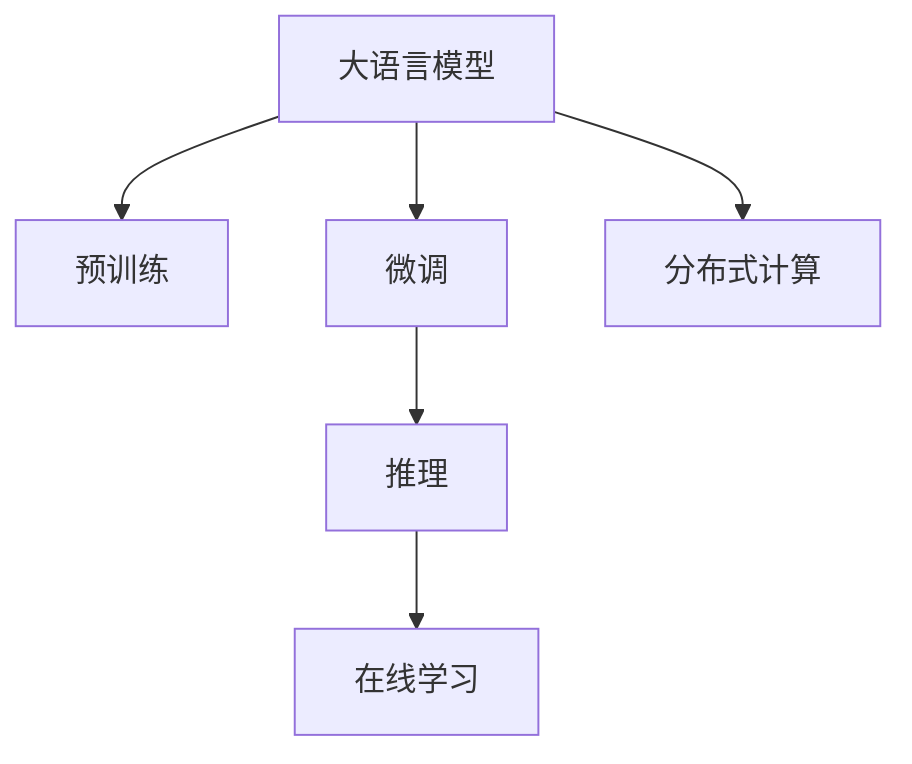

                 

# AI 大模型在电商搜索推荐中的实时处理技术：应对大规模数据与复杂计算

## 1. 背景介绍

### 1.1 问题由来
近年来，随着电子商务的飞速发展，用户对商品搜索和推荐的需求日益增长，且呈现出高度个性化和实时化的特征。传统的基于规则的推荐系统难以适应这种动态变化的需求，需要借助深度学习等先进技术来提升推荐系统的精准性和时效性。

特别是随着用户行为数据的快速积累，搜索推荐系统所面临的数据规模已经达到数十亿甚至上百亿级别。在这样的背景下，如何高效地处理海量数据并实现实时推荐，成为了电商搜索推荐系统的主要挑战之一。

### 1.2 问题核心关键点
为了应对大规模数据与复杂计算的挑战，电子商务平台在搜索推荐系统中广泛应用了深度学习和大模型技术。其中，基于Transformer的大语言模型在搜索推荐系统中的应用尤为引人注目。这些模型通过在大规模语料上进行预训练，学习到丰富的语言表示，可以高效地处理和推理文本数据，为搜索推荐系统提供强大的文本理解能力。

但同时，大规模语料上的预训练模型参数量庞大，对计算资源和存储空间的需求较高。如何在电商搜索推荐系统中实现大模型的实时处理，成为了当前研究的重点。

## 2. 核心概念与联系

### 2.1 核心概念概述

为更好地理解AI大模型在电商搜索推荐中的实时处理技术，本节将介绍几个密切相关的核心概念：

- 大语言模型(Large Language Model, LLM)：指基于Transformer架构，在大规模无标签文本语料上进行的自监督预训练，学习到丰富的语言表示的深度学习模型。如GPT-3、BERT等。
- 预训练(Pre-training)：指在大规模无标签文本数据上，通过自监督学习任务（如掩码语言模型、自回归预测等）训练通用语言模型的过程。
- 微调(Fine-tuning)：指在预训练模型的基础上，使用下游任务的少量标注数据进行有监督学习，优化模型在特定任务上的性能。
- 推理(Inferring)：指模型根据输入数据，推断出相应的输出结果。在电商搜索推荐系统中，需要高效地进行模型推理，以便实时响应用户请求。
- 在线学习(Online Learning)：指模型在运行过程中，不断从新的输入数据中学习和调整模型参数，以保持模型的实时性和适应性。
- 分布式计算(Distributed Computing)：指将计算任务分配到多台计算机上并行执行，以提高计算效率。

这些核心概念之间的逻辑关系可以通过以下Mermaid流程图来展示：



这个流程图展示了大语言模型的工作原理和相关概念之间的关系：

1. 大语言模型通过预训练获得基础能力。
2. 微调对预训练模型进行任务特定的优化，提高模型在特定任务上的性能。
3. 推理实现模型输入输出转换，为实时推荐提供支持。
4. 在线学习使得模型能够不断适应新数据，保持实时性。
5. 分布式计算提高计算效率，支持实时处理大规模数据。

## 3. 核心算法原理 & 具体操作步骤

### 3.1 算法原理概述

基于大模型的电商搜索推荐系统，其核心算法原理主要包括以下几个方面：

1. **预训练模型**：选择大规模无标签文本语料（如维基百科、新闻、小说等），使用自监督学习任务训练通用语言模型。例如，使用掩码语言模型（Masked Language Model, MLM）、自回归预测（Autoregressive Prediction）等。预训练模型在大规模语料上学习到丰富的语言知识，具备强大的文本理解能力。

2. **微调模型**：在预训练模型的基础上，使用下游任务的少量标注数据进行微调。例如，针对电商搜索推荐任务，可以将用户查询、商品描述等文本数据作为输入，商品类别、购买记录等作为标签，使用交叉熵损失函数进行微调。微调后的模型能够更好地理解电商领域特定的语义和规则。

3. **推理引擎**：将微调后的模型部署为推理引擎，用于实时处理用户查询，并给出推荐结果。推理过程包括输入文本向量的编码、注意力机制的计算、解码器的输出等步骤。

4. **在线学习**：在实时推荐过程中，模型会根据新的用户行为数据进行在线学习，不断更新模型参数，以适应数据分布的变化。在线学习机制使得模型能够持续优化，保持实时性和适应性。

5. **分布式计算**：由于电商搜索推荐系统所处理的数据量巨大，单个模型往往无法处理。通过分布式计算技术，将模型和数据分布到多台计算机上并行处理，以提高计算效率，支持实时推荐。

### 3.2 算法步骤详解

基于大模型的电商搜索推荐系统的算法步骤主要包括以下几个关键步骤：

**Step 1: 数据准备**
- 收集电商领域的文本数据，如商品描述、用户评论、用户查询等。
- 标注数据集，用于微调模型。标注数据可以包括用户行为数据、商品类别、购买记录等。
- 对数据进行预处理，如文本清洗、分词、标记等。

**Step 2: 模型选择与微调**
- 选择合适的预训练模型，如BERT、GPT等。
- 在预训练模型的基础上，使用微调任务的数据集进行微调。通常使用交叉熵损失函数。
- 确定微调的超参数，如学习率、批大小、迭代轮数等。

**Step 3: 推理引擎部署**
- 将微调后的模型部署为推理引擎，使用分布式计算技术进行并行处理。
- 将查询文本输入模型，进行推理计算，生成推荐结果。
- 使用在线学习机制，不断更新模型参数，保持实时性和适应性。

**Step 4: 实时推荐系统**
- 将推理引擎集成到电商搜索推荐系统中，实时响应用户查询。
- 根据用户的历史行为数据和当前查询，生成推荐列表。
- 实时更新模型参数，以应对数据分布的变化。

### 3.3 算法优缺点

基于大模型的电商搜索推荐系统具有以下优点：
1. 强大的语言理解能力：大模型通过预训练学习到了丰富的语言表示，能够高效地处理和理解电商领域的文本数据。
2. 高精度推荐：通过微调和在线学习，模型能够不断优化，提供更高精度的推荐结果。
3. 实时性：分布式计算技术使得模型能够高效地处理大规模数据，支持实时推荐。
4. 扩展性：分布式计算和在线学习机制使得模型能够适应数据分布的变化，具有较好的扩展性。

但同时，该方法也存在一些局限性：
1. 计算资源需求高：大规模语料上的预训练模型参数量庞大，对计算资源和存储空间的需求较高。
2. 推理计算复杂：基于Transformer的推理过程较为复杂，计算量较大。
3. 模型更新频繁：在线学习机制需要频繁更新模型参数，增加了系统维护的复杂性。
4. 数据隐私问题：电商领域涉及用户隐私数据，模型的训练和推理过程需要严格遵守数据隐私保护规定。

尽管存在这些局限性，但就目前而言，基于大模型的电商搜索推荐系统仍是最主流的推荐范式之一。未来相关研究的重点在于如何进一步降低计算资源需求，提高推理效率，同时兼顾数据隐私和安全等因素。

### 3.4 算法应用领域

基于大模型的电商搜索推荐系统已经在多个电商平台上得到了广泛的应用，包括但不限于以下领域：

- 商品搜索：用户输入搜索词，系统返回匹配的商品列表。通过微调模型，提高搜索相关性。
- 个性化推荐：根据用户历史行为数据和当前查询，生成个性化推荐列表。通过微调模型，提高推荐准确性和多样性。
- 购物车推荐：根据用户浏览记录和商品特征，推荐添加到购物车中的商品。通过微调模型，提高推荐效果。
- 新用户引导：根据用户行为数据，推荐新手用户购买商品。通过微调模型，提高新手用户转化率。
- 价格调整：根据市场趋势和用户行为数据，调整商品价格。通过微调模型，提高价格调整的精准度。

除了上述这些经典应用外，基于大模型的搜索推荐系统还被创新性地应用到更多场景中，如基于用户评论的情感分析、基于商品标签的关联推荐等，为电商平台的个性化和智能化提供了新的技术路径。

## 4. 数学模型和公式 & 详细讲解 & 举例说明

### 4.1 数学模型构建

本节将使用数学语言对基于大模型的电商搜索推荐系统进行更加严格的刻画。

假设电商搜索推荐系统涉及的商品数量为 $N$，用户行为数据为 $\mathcal{D} = \{(\mathbf{x}_i, y_i)\}_{i=1}^M$，其中 $\mathbf{x}_i$ 表示用户行为特征向量，$y_i$ 表示商品类别标签。

定义预训练模型为 $M_{\theta}$，其中 $\theta$ 为模型参数。微调任务的目标是学习到商品分类器 $f(x; \theta)$，使得在给定用户行为特征 $x$ 的情况下，输出的商品类别 $y$ 与真实标签 $y_i$ 尽量一致。因此，微调任务可以表示为：

$$
\min_{\theta} \mathcal{L}(\theta) = \frac{1}{M} \sum_{i=1}^M \ell(f(\mathbf{x}_i; \theta), y_i)
$$

其中 $\ell$ 为交叉熵损失函数，$f(\mathbf{x}_i; \theta) = \text{softmax}(M_{\theta}(\mathbf{x}_i))$ 为模型的预测概率分布。

### 4.2 公式推导过程

以下我们以电商商品搜索任务为例，推导基于大模型的推荐模型及其损失函数的计算公式。

假设预训练模型为BERT，微调任务为商品分类。具体而言，输入为商品描述文本 $\mathbf{x}_i$，输出为商品类别 $y_i$。微调过程可以表示为：

1. 文本编码：将输入文本 $\mathbf{x}_i$ 编码成向量表示 $z_i = M_{\theta}(\mathbf{x}_i)$。
2. 分类输出：将编码后的向量 $z_i$ 输入到分类器 $f(z; \theta)$，得到分类概率分布 $p(y_i; \theta)$。
3. 损失计算：使用交叉熵损失函数 $\ell = -\frac{1}{M} \sum_{i=1}^M \log p(y_i; \theta)$ 计算损失，并根据梯度下降等优化算法更新模型参数 $\theta$。

上述过程可以用数学公式表示为：

$$
\begin{aligned}
f(\mathbf{x}_i; \theta) &= \text{softmax}(M_{\theta}(\mathbf{x}_i)) \\
\ell(f(\mathbf{x}_i; \theta), y_i) &= -y_i \log p(y_i; \theta) - (1 - y_i) \log (1 - p(y_i; \theta)) \\
\mathcal{L}(\theta) &= \frac{1}{M} \sum_{i=1}^M \ell(f(\mathbf{x}_i; \theta), y_i)
\end{aligned}
$$

### 4.3 案例分析与讲解

考虑一个简单的电商商品搜索任务，输入为商品描述文本 $\mathbf{x}_i$，输出为商品类别 $y_i$。具体推导过程如下：

1. **文本编码**：假设商品描述文本 $\mathbf{x}_i = [w_1, w_2, \ldots, w_n]$，其中 $w_j$ 表示第 $j$ 个单词。使用BERT模型将文本编码成向量表示 $z_i = M_{\theta}(\mathbf{x}_i)$。

2. **分类输出**：将编码后的向量 $z_i$ 输入到分类器 $f(z; \theta)$，得到分类概率分布 $p(y_i; \theta)$。假设分类器使用线性回归模型，输出为 $z_i$ 的线性变换 $z_i \mathbf{W} + b$。

3. **损失计算**：使用交叉熵损失函数 $\ell = -y_i \log p(y_i; \theta) - (1 - y_i) \log (1 - p(y_i; \theta))$ 计算损失。

具体计算过程如下：

$$
\begin{aligned}
z_i &= M_{\theta}(\mathbf{x}_i) \\
f(z_i; \theta) &= z_i \mathbf{W} + b \\
p(y_i; \theta) &= \sigma(f(z_i; \theta)) \\
\ell(f(z_i; \theta), y_i) &= -y_i \log p(y_i; \theta) - (1 - y_i) \log (1 - p(y_i; \theta)) \\
\mathcal{L}(\theta) &= \frac{1}{M} \sum_{i=1}^M \ell(f(z_i; \theta), y_i)
\end{aligned}
$$

其中 $\sigma$ 为sigmoid函数，$\mathbf{W}$ 和 $b$ 为分类器的参数。

## 5. 项目实践：代码实例和详细解释说明

### 5.1 开发环境搭建

在进行基于大模型的电商搜索推荐系统开发前，我们需要准备好开发环境。以下是使用Python进行PyTorch开发的环境配置流程：

1. 安装Anaconda：从官网下载并安装Anaconda，用于创建独立的Python环境。

2. 创建并激活虚拟环境：
```bash
conda create -n pytorch-env python=3.8 
conda activate pytorch-env
```

3. 安装PyTorch：根据CUDA版本，从官网获取对应的安装命令。例如：
```bash
conda install pytorch torchvision torchaudio cudatoolkit=11.1 -c pytorch -c conda-forge
```

4. 安装TensorFlow：
```bash
pip install tensorflow
```

5. 安装各类工具包：
```bash
pip install numpy pandas scikit-learn matplotlib tqdm jupyter notebook ipython
```

完成上述步骤后，即可在`pytorch-env`环境中开始开发。

### 5.2 源代码详细实现

这里我们以电商商品分类任务为例，给出使用PyTorch进行BERT微调的PyTorch代码实现。

首先，定义商品分类任务的数据处理函数：

```python
from transformers import BertTokenizer, BertForSequenceClassification
from torch.utils.data import Dataset
import torch

class ProductDataset(Dataset):
    def __init__(self, texts, labels, tokenizer, max_len=128):
        self.texts = texts
        self.labels = labels
        self.tokenizer = tokenizer
        self.max_len = max_len
        
    def __len__(self):
        return len(self.texts)
    
    def __getitem__(self, item):
        text = self.texts[item]
        label = self.labels[item]
        
        encoding = self.tokenizer(text, return_tensors='pt', max_length=self.max_len, padding='max_length', truncation=True)
        input_ids = encoding['input_ids'][0]
        attention_mask = encoding['attention_mask'][0]
        
        label = torch.tensor(label, dtype=torch.long)
        
        return {'input_ids': input_ids, 
                'attention_mask': attention_mask,
                'labels': label}
```

然后，定义模型和优化器：

```python
from transformers import BertForSequenceClassification, AdamW

model = BertForSequenceClassification.from_pretrained('bert-base-uncased', num_labels=10)

optimizer = AdamW(model.parameters(), lr=2e-5)
```

接着，定义训练和评估函数：

```python
from torch.utils.data import DataLoader
from tqdm import tqdm
from sklearn.metrics import accuracy_score

device = torch.device('cuda') if torch.cuda.is_available() else torch.device('cpu')
model.to(device)

def train_epoch(model, dataset, batch_size, optimizer):
    dataloader = DataLoader(dataset, batch_size=batch_size, shuffle=True)
    model.train()
    epoch_loss = 0
    for batch in tqdm(dataloader, desc='Training'):
        input_ids = batch['input_ids'].to(device)
        attention_mask = batch['attention_mask'].to(device)
        labels = batch['labels'].to(device)
        model.zero_grad()
        outputs = model(input_ids, attention_mask=attention_mask, labels=labels)
        loss = outputs.loss
        epoch_loss += loss.item()
        loss.backward()
        optimizer.step()
    return epoch_loss / len(dataloader)

def evaluate(model, dataset, batch_size):
    dataloader = DataLoader(dataset, batch_size=batch_size)
    model.eval()
    preds, labels = [], []
    with torch.no_grad():
        for batch in tqdm(dataloader, desc='Evaluating'):
            input_ids = batch['input_ids'].to(device)
            attention_mask = batch['attention_mask'].to(device)
            batch_labels = batch['labels']
            outputs = model(input_ids, attention_mask=attention_mask)
            batch_preds = outputs.predictions.argmax(dim=1).to('cpu').tolist()
            batch_labels = batch_labels.to('cpu').tolist()
            for pred, label in zip(batch_preds, batch_labels):
                preds.append(pred)
                labels.append(label)
                
    print(accuracy_score(labels, preds))
```

最后，启动训练流程并在测试集上评估：

```python
epochs = 5
batch_size = 16

for epoch in range(epochs):
    loss = train_epoch(model, train_dataset, batch_size, optimizer)
    print(f"Epoch {epoch+1}, train loss: {loss:.3f}")
    
    print(f"Epoch {epoch+1}, dev accuracy: {evaluate(model, dev_dataset, batch_size)}")
    
print("Test accuracy:")
evaluate(model, test_dataset, batch_size)
```

以上就是使用PyTorch对BERT进行电商商品分类任务微调的完整代码实现。可以看到，得益于Transformers库的强大封装，我们可以用相对简洁的代码完成BERT模型的加载和微调。

### 5.3 代码解读与分析

让我们再详细解读一下关键代码的实现细节：

**ProductDataset类**：
- `__init__`方法：初始化文本、标签、分词器等关键组件。
- `__len__`方法：返回数据集的样本数量。
- `__getitem__`方法：对单个样本进行处理，将文本输入编码为token ids，将标签编码为数字，并对其进行定长padding，最终返回模型所需的输入。

**模型选择与微调**：
- 使用`BertForSequenceClassification`类从预训练模型中加载模型。
- 使用AdamW优化器进行模型参数的更新。

**训练和评估函数**：
- 使用PyTorch的DataLoader对数据集进行批次化加载，供模型训练和推理使用。
- 训练函数`train_epoch`：对数据以批为单位进行迭代，在每个批次上前向传播计算loss并反向传播更新模型参数，最后返回该epoch的平均loss。
- 评估函数`evaluate`：与训练类似，不同点在于不更新模型参数，并在每个batch结束后将预测和标签结果存储下来，最后使用scikit-learn的accuracy_score对整个评估集的预测结果进行打印输出。

**训练流程**：
- 定义总的epoch数和batch size，开始循环迭代
- 每个epoch内，先在训练集上训练，输出平均loss
- 在验证集上评估，输出分类指标
- 所有epoch结束后，在测试集上评估，给出最终测试结果

可以看到，PyTorch配合Transformers库使得BERT微调的代码实现变得简洁高效。开发者可以将更多精力放在数据处理、模型改进等高层逻辑上，而不必过多关注底层的实现细节。

当然，工业级的系统实现还需考虑更多因素，如模型的保存和部署、超参数的自动搜索、更灵活的任务适配层等。但核心的微调范式基本与此类似。

## 6. 实际应用场景

### 6.1 智能客服系统

基于大模型的电商搜索推荐系统，可以广泛应用于智能客服系统的构建。传统客服往往需要配备大量人力，高峰期响应缓慢，且一致性和专业性难以保证。而使用基于大模型的电商搜索推荐系统，可以7x24小时不间断服务，快速响应客户咨询，用自然流畅的语言解答各类常见问题。

在技术实现上，可以收集企业内部的历史客服对话记录，将问题和最佳答复构建成监督数据，在此基础上对预训练大模型进行微调。微调后的模型能够自动理解用户意图，匹配最合适的答复模板进行回复。对于客户提出的新问题，还可以接入检索系统实时搜索相关内容，动态组织生成回答。如此构建的智能客服系统，能大幅提升客户咨询体验和问题解决效率。

### 6.2 金融舆情监测

金融机构需要实时监测市场舆论动向，以便及时应对负面信息传播，规避金融风险。传统的人工监测方式成本高、效率低，难以应对网络时代海量信息爆发的挑战。基于大模型的电商搜索推荐系统，可以用于金融舆情监测。

具体而言，可以收集金融领域相关的新闻、报道、评论等文本数据，并对其进行主题标注和情感标注。在此基础上对预训练语言模型进行微调，使其能够自动判断文本属于何种主题，情感倾向是正面、中性还是负面。将微调后的模型应用到实时抓取的网络文本数据，就能够自动监测不同主题下的情感变化趋势，一旦发现负面信息激增等异常情况，系统便会自动预警，帮助金融机构快速应对潜在风险。

### 6.3 个性化推荐系统

当前的推荐系统往往只依赖用户的历史行为数据进行物品推荐，无法深入理解用户的真实兴趣偏好。基于大模型的电商搜索推荐系统，可以更好地挖掘用户行为背后的语义信息，从而提供更精准、多样的推荐内容。

在实践中，可以收集用户浏览、点击、评论、分享等行为数据，提取和用户交互的物品标题、描述、标签等文本内容。将文本内容作为模型输入，用户的后续行为（如是否点击、购买等）作为监督信号，在此基础上微调预训练语言模型。微调后的模型能够从文本内容中准确把握用户的兴趣点。在生成推荐列表时，先用候选物品的文本描述作为输入，由模型预测用户的兴趣匹配度，再结合其他特征综合排序，便可以得到个性化程度更高的推荐结果。

### 6.4 未来应用展望

随着大语言模型和微调方法的不断发展，基于微调范式将在更多领域得到应用，为传统行业带来变革性影响。

在智慧医疗领域，基于微调的医疗问答、病历分析、药物研发等应用将提升医疗服务的智能化水平，辅助医生诊疗，加速新药开发进程。

在智能教育领域，微调技术可应用于作业批改、学情分析、知识推荐等方面，因材施教，促进教育公平，提高教学质量。

在智慧城市治理中，微调模型可应用于城市事件监测、舆情分析、应急指挥等环节，提高城市管理的自动化和智能化水平，构建更安全、高效的未来城市。

此外，在企业生产、社会治理、文娱传媒等众多领域，基于大模型微调的人工智能应用也将不断涌现，为经济社会发展注入新的动力。相信随着技术的日益成熟，微调方法将成为人工智能落地应用的重要范式，推动人工智能技术在更广阔的应用领域大放异彩。

## 7. 工具和资源推荐
### 7.1 学习资源推荐

为了帮助开发者系统掌握大模型在电商搜索推荐中的应用，这里推荐一些优质的学习资源：

1. 《Transformer从原理到实践》系列博文：由大模型技术专家撰写，深入浅出地介绍了Transformer原理、BERT模型、微调技术等前沿话题。

2. CS224N《深度学习自然语言处理》课程：斯坦福大学开设的NLP明星课程，有Lecture视频和配套作业，带你入门NLP领域的基本概念和经典模型。

3. 《Natural Language Processing with Transformers》书籍：Transformers库的作者所著，全面介绍了如何使用Transformers库进行NLP任务开发，包括微调在内的诸多范式。

4. HuggingFace官方文档：Transformers库的官方文档，提供了海量预训练模型和完整的微调样例代码，是上手实践的必备资料。

5. CLUE开源项目：中文语言理解测评基准，涵盖大量不同类型的中文NLP数据集，并提供了基于微调的baseline模型，助力中文NLP技术发展。

通过对这些资源的学习实践，相信你一定能够快速掌握大模型在电商搜索推荐中的应用，并用于解决实际的NLP问题。
###  7.2 开发工具推荐

高效的开发离不开优秀的工具支持。以下是几款用于大模型在电商搜索推荐系统中开发常用的工具：

1. PyTorch：基于Python的开源深度学习框架，灵活动态的计算图，适合快速迭代研究。大部分预训练语言模型都有PyTorch版本的实现。

2. TensorFlow：由Google主导开发的开源深度学习框架，生产部署方便，适合大规模工程应用。同样有丰富的预训练语言模型资源。

3. Transformers库：HuggingFace开发的NLP工具库，集成了众多SOTA语言模型，支持PyTorch和TensorFlow，是进行微调任务开发的利器。

4. Weights & Biases：模型训练的实验跟踪工具，可以记录和可视化模型训练过程中的各项指标，方便对比和调优。与主流深度学习框架无缝集成。

5. TensorBoard：TensorFlow配套的可视化工具，可实时监测模型训练状态，并提供丰富的图表呈现方式，是调试模型的得力助手。

6. Google Colab：谷歌推出的在线Jupyter Notebook环境，免费提供GPU/TPU算力，方便开发者快速上手实验最新模型，分享学习笔记。

合理利用这些工具，可以显著提升大模型在电商搜索推荐系统中的开发效率，加快创新迭代的步伐。

### 7.3 相关论文推荐

大语言模型和微调技术的发展源于学界的持续研究。以下是几篇奠基性的相关论文，推荐阅读：

1. Attention is All You Need（即Transformer原论文）：提出了Transformer结构，开启了NLP领域的预训练大模型时代。

2. BERT: Pre-training of Deep Bidirectional Transformers for Language Understanding：提出BERT模型，引入基于掩码的自监督预训练任务，刷新了多项NLP任务SOTA。

3. Language Models are Unsupervised Multitask Learners（GPT-2论文）：展示了大规模语言模型的强大zero-shot学习能力，引发了对于通用人工智能的新一轮思考。

4. Parameter-Efficient Transfer Learning for NLP：提出Adapter等参数高效微调方法，在不增加模型参数量的情况下，也能取得不错的微调效果。

5. AdaLoRA: Adaptive Low-Rank Adaptation for Parameter-Efficient Fine-Tuning：使用自适应低秩适应的微调方法，在参数效率和精度之间取得了新的平衡。

这些论文代表了大语言模型微调技术的发展脉络。通过学习这些前沿成果，可以帮助研究者把握学科前进方向，激发更多的创新灵感。

## 8. 总结：未来发展趋势与挑战

### 8.1 总结

本文对基于大模型的电商搜索推荐系统进行了全面系统的介绍。首先阐述了大语言模型和微调技术的研究背景和意义，明确了微调在拓展预训练模型应用、提升下游任务性能方面的独特价值。其次，从原理到实践，详细讲解了微调的数学原理和关键步骤，给出了电商搜索推荐系统开发的完整代码实例。同时，本文还广泛探讨了微调方法在智能客服、金融舆情、个性化推荐等多个电商领域的应用前景，展示了微调范式的巨大潜力。此外，本文精选了微调技术的各类学习资源，力求为读者提供全方位的技术指引。

通过本文的系统梳理，可以看到，基于大模型的电商搜索推荐系统正在成为电商推荐领域的重要范式，极大地拓展了预训练语言模型的应用边界，催生了更多的落地场景。得益于大规模语料的预训练，微调模型以更低的时间和标注成本，在小样本条件下也能取得不俗的效果，有力推动了电商推荐技术的产业化进程。未来，伴随预训练语言模型和微调方法的持续演进，相信NLP技术将在更广阔的应用领域大放异彩，深刻影响人类的生产生活方式。

### 8.2 未来发展趋势

展望未来，大语言模型微调技术将呈现以下几个发展趋势：

1. 模型规模持续增大。随着算力成本的下降和数据规模的扩张，预训练语言模型的参数量还将持续增长。超大规模语言模型蕴含的丰富语言知识，有望支撑更加复杂多变的电商推荐任务微调。

2. 微调方法日趋多样。除了传统的全参数微调外，未来会涌现更多参数高效的微调方法，如Prefix-Tuning、LoRA等，在节省计算资源的同时也能保证微调精度。

3. 持续学习成为常态。随着电商推荐领域数据分布的不断变化，微调模型也需要持续学习新知识以保持性能。如何在不遗忘原有知识的同时，高效吸收新样本信息，将成为重要的研究课题。

4. 标注样本需求降低。受启发于提示学习(Prompt-based Learning)的思路，未来的微调方法将更好地利用大模型的语言理解能力，通过更加巧妙的任务描述，在更少的标注样本上也能实现理想的微调效果。

5. 多模态微调崛起。当前的微调主要聚焦于纯文本数据，未来会进一步拓展到图像、视频、语音等多模态数据微调。多模态信息的融合，将显著提升语言模型对现实世界的理解和建模能力。

6. 模型通用性增强。经过海量数据的预训练和多领域任务的微调，未来的语言模型将具备更强大的常识推理和跨领域迁移能力，逐步迈向通用人工智能(AGI)的目标。

以上趋势凸显了大语言模型微调技术的广阔前景。这些方向的探索发展，必将进一步提升电商推荐系统的性能和应用范围，为电商平台的个性化和智能化提供新的技术路径。

### 8.3 面临的挑战

尽管大语言模型微调技术已经取得了瞩目成就，但在迈向更加智能化、普适化应用的过程中，它仍面临着诸多挑战：

1. 标注成本瓶颈。虽然微调大大降低了标注数据的需求，但对于长尾应用场景，难以获得充足的高质量标注数据，成为制约微调性能的瓶颈。如何进一步降低微调对标注样本的依赖，将是一大难题。

2. 模型鲁棒性不足。当前微调模型面对域外数据时，泛化性能往往大打折扣。对于测试样本的微小扰动，微调模型的预测也容易发生波动。如何提高微调模型的鲁棒性，避免灾难性遗忘，还需要更多理论和实践的积累。

3. 推理效率有待提高。大规模语料上的预训练模型参数量庞大，对计算资源和存储空间的需求较高。推理计算复杂，需要优化计算图和推理算法，以提高效率。

4. 模型更新频繁。在线学习机制需要频繁更新模型参数，增加了系统维护的复杂性。如何优化在线学习算法，减少参数更新频率，是重要的研究方向。

5. 数据隐私问题。电商领域涉及用户隐私数据，模型的训练和推理过程需要严格遵守数据隐私保护规定。如何在使用数据训练模型的同时，保障数据隐私安全，是重要的研究方向。

尽管存在这些局限性，但就目前而言，基于大模型的电商搜索推荐系统仍是最主流的推荐范式之一。未来相关研究的重点在于如何进一步降低计算资源需求，提高推理效率，同时兼顾数据隐私和安全等因素。

### 8.4 研究展望

面对大语言模型微调所面临的种种挑战，未来的研究需要在以下几个方面寻求新的突破：

1. 探索无监督和半监督微调方法。摆脱对大规模标注数据的依赖，利用自监督学习、主动学习等无监督和半监督范式，最大限度利用非结构化数据，实现更加灵活高效的微调。

2. 研究参数高效和计算高效的微调范式。开发更加参数高效的微调方法，在固定大部分预训练参数的同时，只更新极少量的任务相关参数。同时优化微调模型的计算图，减少前向传播和反向传播的资源消耗，实现更加轻量级、实时性的部署。

3. 融合因果和对比学习范式。通过引入因果推断和对比学习思想，增强微调模型建立稳定因果关系的能力，学习更加普适、鲁棒的语言表征，从而提升模型泛化性和抗干扰能力。

4. 引入更多先验知识。将符号化的先验知识，如知识图谱、逻辑规则等，与神经网络模型进行巧妙融合，引导微调过程学习更准确、合理的语言模型。同时加强不同模态数据的整合，实现视觉、语音等多模态信息与文本信息的协同建模。

5. 结合因果分析和博弈论工具。将因果分析方法引入微调模型，识别出模型决策的关键特征，增强输出解释的因果性和逻辑性。借助博弈论工具刻画人机交互过程，主动探索并规避模型的脆弱点，提高系统稳定性。

6. 纳入伦理道德约束。在模型训练目标中引入伦理导向的评估指标，过滤和惩罚有偏见、有害的输出倾向。同时加强人工干预和审核，建立模型行为的监管机制，确保输出符合人类价值观和伦理道德。

这些研究方向的探索，必将引领大语言模型微调技术迈向更高的台阶，为构建安全、可靠、可解释、可控的智能系统铺平道路。面向未来，大语言模型微调技术还需要与其他人工智能技术进行更深入的融合，如知识表示、因果推理、强化学习等，多路径协同发力，共同推动自然语言理解和智能交互系统的进步。只有勇于创新、敢于突破，才能不断拓展语言模型的边界，让智能技术更好地造福人类社会。

## 9. 附录：常见问题与解答

**Q1：电商搜索推荐系统中的大模型微调需要哪些关键步骤？**

A: 电商搜索推荐系统中的大模型微调需要以下关键步骤：

1. 数据准备：收集电商领域的文本数据，标注数据集，并对数据进行预处理。
2. 模型选择与微调：选择合适的预训练模型，使用微调任务的数据集进行微调，确定微调的超参数。
3. 推理引擎部署：将微调后的模型部署为推理引擎，使用分布式计算技术进行并行处理。
4. 实时推荐系统：将推理引擎集成到电商搜索推荐系统中，实时响应用户查询，根据用户行为数据和当前查询生成推荐结果。

**Q2：电商搜索推荐系统中的大模型微调对计算资源有什么要求？**

A: 电商搜索推荐系统中的大模型微调对计算资源有较高的要求，主要体现在以下几个方面：

1. 预训练模型的参数量巨大，需要高效的计算资源和存储空间。
2. 推理过程复杂，计算量大，需要优化计算图和推理算法，提高效率。
3. 在线学习机制需要频繁更新模型参数，增加了系统维护的复杂性。

**Q3：电商搜索推荐系统中的大模型微调需要注意哪些数据隐私问题？**

A: 电商搜索推荐系统中的大模型微调需要注意以下数据隐私问题：

1. 用户隐私数据的使用需要严格遵守数据隐私保护规定，如GDPR、CCPA等。
2. 在使用数据训练模型的同时，需要采取数据脱敏、匿名化等措施，保护用户隐私。
3. 模型的推理过程需要防止数据泄露，避免对用户数据进行敏感分析。
4. 模型的训练和部署需要建立严格的访问控制机制，确保只有授权人员能够访问数据和模型。

**Q4：电商搜索推荐系统中的大模型微调如何降低计算资源需求？**

A: 电商搜索推荐系统中的大模型微调可以通过以下方法降低计算资源需求：

1. 参数高效的微调方法：使用少参数的微调方法，如Prefix-Tuning、LoRA等，减少模型参数量，降低计算资源需求。
2. 分布式计算：将模型和数据分布到多台计算机上并行处理，提高计算效率。
3. 模型压缩和稀疏化：使用模型压缩、稀疏化存储等方法，减小模型尺寸，降低计算资源需求。
4. 高效的计算图优化：优化模型计算图，减少计算量，提高计算效率。

这些方法可以有效降低计算资源需求，同时保证微调模型的精度和性能。

---

作者：禅与计算机程序设计艺术 / Zen and the Art of Computer Programming

