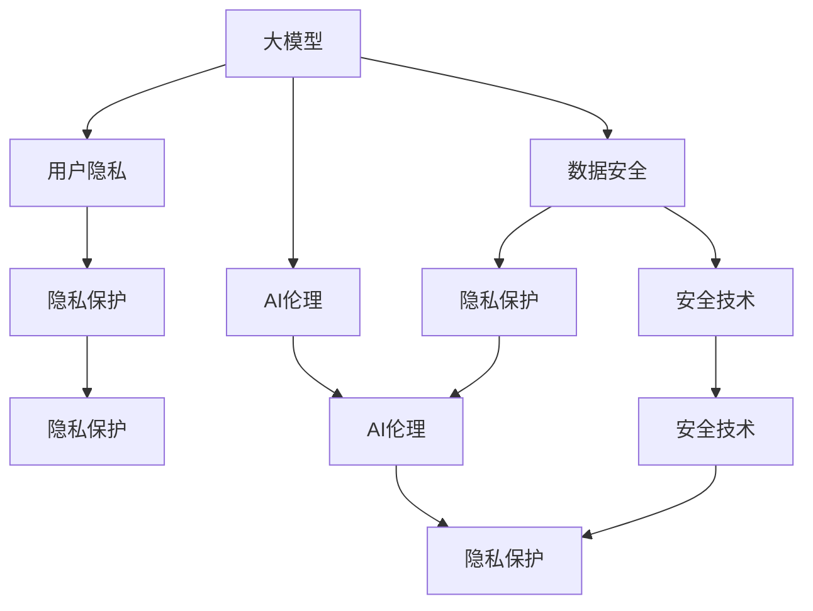

                 

# AI 大模型在电商搜索推荐中的数据安全策略：保障数据安全与用户隐私

> 关键词：大模型，电商搜索推荐，数据安全，用户隐私，隐私保护，安全技术，AI伦理

## 1. 背景介绍

随着电商平台的迅速发展，基于AI的大模型在电商搜索推荐系统中的应用日益广泛。这些系统通过分析用户行为数据，为用户提供个性化的商品推荐，极大提升了用户体验和平台转化率。然而，在用户数据收集、存储和处理过程中，如何保障用户隐私和数据安全成为了一个重要的议题。

### 1.1 数据安全与隐私保护的重要性

电商搜索推荐系统处理大量的用户数据，包括浏览历史、点击记录、购买行为等。这些数据不仅对电商平台而言极为宝贵，同时也可能包含敏感个人信息，如年龄、性别、地理位置等。若数据被泄露或滥用，将直接威胁到用户隐私和个人安全，甚至可能引发严重社会问题。因此，如何在保障推荐效果的同时，确保数据的安全与隐私，是构建电商搜索推荐系统不可或缺的一环。

### 1.2 当前数据安全与隐私保护的挑战

尽管数据安全与隐私保护在技术上有所突破，但面临的挑战依然严峻：

1. **数据泄露风险**：电商平台的数据库、API接口等容易被攻击者非法侵入，导致数据泄露。
2. **数据滥用风险**：数据分析人员和模型工程师在处理数据时，可能滥用数据，生成不公平或不准确的推荐结果。
3. **法律合规风险**：各地区对数据隐私和数据保护的法律法规不尽相同，电商平台需应对多地的合规要求，增加复杂性。

## 2. 核心概念与联系

### 2.1 核心概念概述

- **大模型（Large Model）**：指基于大规模数据集预训练的深度学习模型，如BERT、GPT等。这些模型具有强大的学习和表示能力，能够处理复杂的电商搜索推荐任务。
- **数据安全（Data Security）**：指保护数据免受非法访问、泄露、损坏和滥用的措施，确保数据机密性、完整性和可用性。
- **用户隐私（User Privacy）**：指用户在使用电商平台时，对其个人信息的保护。电商平台需遵守法律法规，防止数据被滥用。
- **隐私保护（Privacy Protection）**：指采取技术手段和管理措施，保护用户数据不被泄露和滥用。
- **安全技术（Security Technology）**：指用于保障数据安全和隐私保护的技术手段，如加密、访问控制、匿名化等。
- **AI伦理（AI Ethics）**：指在AI技术应用中，遵循道德规范和伦理标准，确保技术应用的安全、公平、透明和可控。

这些核心概念通过逻辑和技术的联系，构成了电商搜索推荐系统中的数据安全与隐私保护框架。

### 2.2 核心概念联系（Mermaid 流程图）



此流程图展示了大模型在电商搜索推荐中的数据安全与隐私保护流程：大模型作为数据处理的核心，通过数据安全与隐私保护措施，结合AI伦理指导，最终实现隐私保护和安全技术的应用。

## 3. 核心算法原理 & 具体操作步骤

### 3.1 算法原理概述

在电商搜索推荐中，数据安全与隐私保护的核心目标是确保用户数据的安全性和隐私性，同时提升推荐系统的性能。为此，我们将通过以下核心算法和操作步骤来实现数据安全与隐私保护：

- **数据加密（Data Encryption）**：在数据传输和存储过程中，使用加密技术保护数据机密性。
- **匿名化（Anonymization）**：在数据分析和处理过程中，去除或模糊化敏感个人信息，防止数据滥用。
- **访问控制（Access Control）**：通过严格的访问控制策略，限制数据访问权限，保障数据安全。
- **差分隐私（Differential Privacy）**：在数据分析和模型训练过程中，加入噪声，防止数据泄露和滥用。

### 3.2 算法步骤详解

1. **数据加密**：
    - **数据传输加密**：在数据传输过程中，使用SSL/TLS协议加密数据包，防止数据被窃取。
    - **数据存储加密**：在数据存储过程中，使用AES或RSA等加密算法保护数据安全。
    
    ```python
    import ssl
    from cryptography.fernet import Fernet
    
    # 生成密钥
    key = Fernet.generate_key()
    
    # 加密数据
    cipher_suite = Fernet(key)
    data = b"Example data"
    encrypted_data = cipher_suite.encrypt(data)
    
    # 解密数据
    decrypted_data = cipher_suite.decrypt(encrypted_data)
    ```

2. **匿名化**：
    - **数据去标识化**：在用户数据中去除或模糊化标识信息，如IP地址、地理位置等。
    - **差分隐私**：在数据分析和模型训练过程中，加入噪声，防止数据泄露。
    
    ```python
    from differential_privacy import GaussianMechanism
    
    # 生成差分隐私机制
    mechanism = GaussianMechanism(sensitivity=1, epsilon=1.0)
    
    # 对数据添加噪声
    data = [1, 2, 3, 4]
    noisy_data = mechanism.add_noise(data)
    ```

3. **访问控制**：
    - **角色基访问控制（RBAC）**：根据用户角色分配权限，限制数据访问范围。
    - **细粒度访问控制（ABAC）**：根据具体请求和数据属性，动态调整访问权限。
    
    ```python
    from role_based_access_control import RBAC
    
    # 定义角色和权限
    rbac = RBAC()
    rbac.add_role("admin", ["read", "write"])
    rbac.add_role("user", ["read"])
    
    # 检查用户权限
    is_admin = rbac.check_permission("admin", "read")
    is_user = rbac.check_permission("user", "write")
    ```

4. **差分隐私**：
    - **Laplace机制**：通过添加Laplace噪声，保护数据隐私。
    - **Gaussian机制**：通过添加Gaussian噪声，保护数据隐私。
    
    ```python
    from differential_privacy import GaussianMechanism
    
    # 生成差分隐私机制
    mechanism = GaussianMechanism(sensitivity=1, epsilon=1.0)
    
    # 对数据添加噪声
    data = [1, 2, 3, 4]
    noisy_data = mechanism.add_noise(data)
    ```

### 3.3 算法优缺点

#### 优点

1. **数据机密性**：通过数据加密技术，有效保护数据在传输和存储过程中的机密性。
2. **数据匿名化**：通过匿名化处理，去除或模糊化敏感信息，防止数据滥用。
3. **访问控制**：通过严格的访问控制策略，确保数据访问的安全性。
4. **差分隐私**：通过差分隐私技术，保护用户数据不被泄露和滥用。

#### 缺点

1. **计算开销**：加密、匿名化、差分隐私等技术可能会增加计算开销，影响系统性能。
2. **复杂性**：多层次的安全策略和复杂的算法实现，增加了系统设计和维护的难度。
3. **可解释性**：某些安全措施可能降低模型的可解释性，影响用户信任和系统透明性。

### 3.4 算法应用领域

这些安全技术在电商搜索推荐中具有广泛的应用领域：

- **用户数据保护**：在用户数据收集和存储过程中，使用数据加密和匿名化技术，保护用户隐私。
- **数据分析与模型训练**：在数据处理和模型训练过程中，使用差分隐私技术，防止数据泄露和滥用。
- **访问控制与权限管理**：在数据访问过程中，使用访问控制技术，限制数据访问权限。

## 4. 数学模型和公式 & 详细讲解 & 举例说明

### 4.1 数学模型构建

在电商搜索推荐中，数据安全与隐私保护涉及多个数学模型和技术手段。以下我们将详细构建几个关键模型：

- **差分隐私模型**：定义差分隐私的概念和计算公式，确保用户数据在分析过程中的隐私保护。
- **访问控制模型**：定义RBAC和ABAC模型的基本概念和计算公式，限制数据访问权限。

### 4.2 公式推导过程

1. **差分隐私模型**：

   差分隐私的目标是在数据分析过程中，尽可能保护个体数据隐私。常用的差分隐私技术包括Laplace机制和Gaussian机制。以Laplace机制为例，其核心思想是在数据中添加噪声，从而保护数据隐私。公式如下：

   $$
   y = f(x) + \mathcal{N}(0, \sigma^2)
   $$

   其中，$f(x)$为原始数据处理函数，$\mathcal{N}(0, \sigma^2)$为Laplace噪声，$\sigma$为噪声标准差。

   Laplace机制的具体实现过程如下：

   ```python
   from differential_privacy import LaplaceMechanism
    
   # 生成差分隐私机制
   mechanism = LaplaceMechanism(sensitivity=1, epsilon=1.0)
    
   # 对数据添加噪声
   data = [1, 2, 3, 4]
   noisy_data = mechanism.add_noise(data)
   ```

2. **访问控制模型**：

   访问控制模型分为RBAC和ABAC两种。RBAC通过角色和权限的映射关系，限制数据访问权限。ABAC则根据具体请求和数据属性，动态调整访问权限。以下是RBAC的基本计算公式：

   $$
   \text{Permission}(User, Resource) = \bigwedge_{R \in Role(User)} Permission(R, Resource)
   $$

   其中，$User$为用户，$Resource$为资源，$Role(User)$为用户所拥有的角色集合，$Permission(R, Resource)$为角色$R$对资源$Resource$的访问权限。

   RBAC的具体实现过程如下：

   ```python
   from role_based_access_control import RBAC
    
   # 定义角色和权限
   rbac = RBAC()
   rbac.add_role("admin", ["read", "write"])
   rbac.add_role("user", ["read"])
    
   # 检查用户权限
   is_admin = rbac.check_permission("admin", "read")
   is_user = rbac.check_permission("user", "write")
   ```

### 4.3 案例分析与讲解

以电商搜索推荐系统为例，用户数据在收集、存储和分析过程中，需要采取以下措施：

1. **数据传输加密**：在用户数据传输过程中，使用SSL/TLS协议加密数据包，防止数据被窃取。
2. **数据存储加密**：在用户数据存储过程中，使用AES或RSA等加密算法保护数据安全。
3. **数据去标识化**：在用户数据中去除或模糊化标识信息，如IP地址、地理位置等。
4. **差分隐私**：在数据分析和模型训练过程中，加入噪声，防止数据泄露和滥用。
5. **访问控制**：在数据访问过程中，使用访问控制技术，限制数据访问权限。

这些措施通过具体的算法和操作，实现对用户数据的安全保护和隐私保护。

## 5. 项目实践：代码实例和详细解释说明

### 5.1 开发环境搭建

在进行数据安全与隐私保护实践前，我们需要准备好开发环境。以下是使用Python进行PyTorch开发的环境配置流程：

1. 安装Anaconda：从官网下载并安装Anaconda，用于创建独立的Python环境。

2. 创建并激活虚拟环境：
```bash
conda create -n pytorch-env python=3.8 
conda activate pytorch-env
```

3. 安装PyTorch：根据CUDA版本，从官网获取对应的安装命令。例如：
```bash
conda install pytorch torchvision torchaudio cudatoolkit=11.1 -c pytorch -c conda-forge
```

4. 安装Transformers库：
```bash
pip install transformers
```

5. 安装各类工具包：
```bash
pip install numpy pandas scikit-learn matplotlib tqdm jupyter notebook ipython
```

完成上述步骤后，即可在`pytorch-env`环境中开始开发实践。

### 5.2 源代码详细实现

下面我们以差分隐私和访问控制为例，给出使用PyTorch进行电商搜索推荐系统的代码实现。

首先，定义差分隐私的实现：

```python
from differential_privacy import GaussianMechanism, LaplaceMechanism

def differential_privacy(data, sensitivity, epsilon):
    # 生成差分隐私机制
    mechanism = LaplaceMechanism(sensitivity=sensitivity, epsilon=epsilon)
    
    # 对数据添加噪声
    noisy_data = mechanism.add_noise(data)
    
    return noisy_data
```

接着，定义访问控制的实现：

```python
from role_based_access_control import RBAC

def access_control(user, resource, roles):
    # 定义角色和权限
    rbac = RBAC()
    for role, permissions in roles.items():
        rbac.add_role(role, permissions)
    
    # 检查用户权限
    is_accessible = rbac.check_permission(user, resource)
    
    return is_accessible
```

最后，启动数据处理流程：

```python
# 模拟用户数据
data = [1, 2, 3, 4]

# 添加噪声进行差分隐私处理
noisy_data = differential_privacy(data, sensitivity=1, epsilon=1.0)

# 定义角色和权限
roles = {
    "admin": ["read", "write"],
    "user": ["read"]
}

# 检查用户权限
is_admin_accessible = access_control("admin", "read", roles)
is_user_accessible = access_control("user", "write", roles)

print(f"Is admin accessible? {is_admin_accessible}")
print(f"Is user accessible? {is_user_accessible}")
```

### 5.3 代码解读与分析

让我们再详细解读一下关键代码的实现细节：

**differential_privacy函数**：
- 定义差分隐私机制
- 对数据添加Laplace噪声
- 返回添加噪声后的数据

**access_control函数**：
- 定义角色和权限
- 检查用户权限是否可访问资源

这些函数通过简单的逻辑实现，展示了差分隐私和访问控制的基本功能。在实际应用中，需要根据具体场景进行优化和扩展。

## 6. 实际应用场景

### 6.1 电商搜索推荐系统

在电商搜索推荐系统中，用户数据的安全保护和隐私保护至关重要。通过差分隐私和访问控制，可以有效保护用户数据隐私，防止数据泄露和滥用。具体应用场景包括：

- **用户数据加密**：在数据传输和存储过程中，使用SSL/TLS和AES加密技术，保护用户数据机密性。
- **数据匿名化**：在数据处理和分析过程中，使用差分隐私技术，保护用户数据隐私。
- **访问控制**：在数据访问过程中，使用访问控制技术，限制数据访问权限。

### 6.2 金融交易系统

在金融交易系统中，用户交易数据的安全保护和隐私保护同样重要。通过差分隐私和访问控制，可以有效保护用户数据隐私，防止数据泄露和滥用。具体应用场景包括：

- **交易数据加密**：在数据传输和存储过程中，使用SSL/TLS和AES加密技术，保护交易数据机密性。
- **数据匿名化**：在数据处理和分析过程中，使用差分隐私技术，保护用户数据隐私。
- **访问控制**：在数据访问过程中，使用访问控制技术，限制数据访问权限。

### 6.3 医疗数据系统

在医疗数据系统中，患者数据的安全保护和隐私保护至关重要。通过差分隐私和访问控制，可以有效保护患者数据隐私，防止数据泄露和滥用。具体应用场景包括：

- **医疗数据加密**：在数据传输和存储过程中，使用SSL/TLS和AES加密技术，保护医疗数据机密性。
- **数据匿名化**：在数据处理和分析过程中，使用差分隐私技术，保护患者数据隐私。
- **访问控制**：在数据访问过程中，使用访问控制技术，限制数据访问权限。

## 7. 工具和资源推荐

### 7.1 学习资源推荐

为了帮助开发者系统掌握大模型在电商搜索推荐中的数据安全与隐私保护的理论基础和实践技巧，这里推荐一些优质的学习资源：

1. **《数据安全与隐私保护》系列书籍**：详细介绍了数据安全与隐私保护的基本概念、技术和应用场景，适合入门和进阶学习。
2. **《差分隐私理论与实践》课程**：由Coursera开设的差分隐私课程，系统讲解差分隐私的理论和实现技术，适合深度学习开发者。
3. **《访问控制技术与实践》课程**：由Udacity开设的访问控制课程，深入讲解访问控制的基本概念和实现技术，适合安全工程师和架构师。

### 7.2 开发工具推荐

高效的开发离不开优秀的工具支持。以下是几款用于电商搜索推荐系统开发的常用工具：

1. **PyTorch**：基于Python的开源深度学习框架，灵活高效，适合快速迭代研究。
2. **TensorFlow**：由Google主导开发的开源深度学习框架，生产部署方便，适合大规模工程应用。
3. **HuggingFace Transformers库**：提供了丰富的预训练语言模型和微调技术，适合电商搜索推荐系统开发。
4. **Weights & Biases**：模型训练的实验跟踪工具，可以记录和可视化模型训练过程中的各项指标，方便对比和调优。
5. **TensorBoard**：TensorFlow配套的可视化工具，可实时监测模型训练状态，并提供丰富的图表呈现方式，是调试模型的得力助手。

### 7.3 相关论文推荐

大模型和数据安全与隐私保护的发展源于学界的持续研究。以下是几篇奠基性的相关论文，推荐阅读：

1. **《差分隐私：理论、算法与实践》**：差分隐私的奠基之作，介绍了差分隐私的基本概念、理论基础和实现技术。
2. **《访问控制：原理与设计》**：访问控制技术的经典著作，详细讲解了访问控制的基本概念和实现技术。
3. **《数据安全与隐私保护技术》**：系统介绍数据安全与隐私保护的基本概念、技术和应用场景。

这些论文代表了大模型在电商搜索推荐系统中的数据安全与隐私保护的研究脉络。通过学习这些前沿成果，可以帮助研究者把握学科前进方向，激发更多的创新灵感。

## 8. 总结：未来发展趋势与挑战

### 8.1 总结

本文对大模型在电商搜索推荐系统中的数据安全与隐私保护进行了全面系统的介绍。首先阐述了数据安全与隐私保护的重要性，明确了在电商搜索推荐系统中，用户数据的安全性和隐私性是不可或缺的一环。其次，从原理到实践，详细讲解了差分隐私和访问控制的核心算法和具体操作步骤，给出了电商搜索推荐系统开发的完整代码实例。同时，本文还探讨了差分隐私和访问控制技术在电商搜索推荐系统中的实际应用场景，展示了这些技术的广阔前景。最后，本文精选了数据安全与隐私保护的学习资源，力求为读者提供全方位的技术指引。

通过本文的系统梳理，可以看到，大模型在电商搜索推荐系统中的应用，不仅需要高性能的推荐算法，更需要安全、隐私保护的技术保障。未来，伴随技术的不断进步和应用场景的扩展，电商搜索推荐系统必将进入更安全和智能化的发展阶段。

### 8.2 未来发展趋势

展望未来，大模型在电商搜索推荐系统中的数据安全与隐私保护将呈现以下几个发展趋势：

1. **隐私保护技术不断进步**：随着差分隐私和访问控制技术的不断发展，未来将出现更加高效、灵活的隐私保护方案，确保用户数据隐私。
2. **联邦学习成为主流**：联邦学习将数据分散存储在多个设备上，无需集中处理，有效保护用户隐私。
3. **零知识证明技术应用**：零知识证明技术可以在不泄露数据的情况下，验证数据的正确性，保护数据隐私。
4. **区块链技术的应用**：区块链技术提供去中心化、透明的数据存储和访问方式，保障数据安全。

以上趋势凸显了数据安全与隐私保护的广阔前景。这些方向的探索发展，将进一步提升电商搜索推荐系统的安全性和用户信任度。

### 8.3 面临的挑战

尽管大模型在电商搜索推荐系统中的数据安全与隐私保护技术已经取得一定进展，但在迈向更加智能化、普适化应用的过程中，仍面临诸多挑战：

1. **计算资源消耗大**：差分隐私和访问控制技术需要大量的计算资源，如何优化算法和实现，降低计算开销，是未来需要解决的问题。
2. **多租户数据隔离**：电商平台需要支持多租户数据隔离，如何在不同租户间保障数据安全和隐私保护，是一个复杂且重要的课题。
3. **法规合规复杂**：各地区对数据隐私和数据保护的法律法规不尽相同，电商平台需应对多地的合规要求，增加复杂性。
4. **用户体验和安全性平衡**：如何在保障数据安全的同时，提升用户体验，是一个需要权衡的难题。

### 8.4 研究展望

面对大模型在电商搜索推荐系统中的数据安全与隐私保护所面临的挑战，未来的研究需要在以下几个方面寻求新的突破：

1. **优化算法和实现**：开发更加高效、轻量级的差分隐私和访问控制算法，降低计算资源消耗。
2. **支持多租户数据隔离**：研究多租户数据隔离技术，保障不同租户间的数据安全和隐私保护。
3. **应对法规合规要求**：开发合规性检测和自动调整工具，确保平台符合各地法律法规要求。
4. **提升用户体验**：探索如何在保障数据安全的同时，提升用户体验，增强用户信任和系统透明度。

这些研究方向的探索，将推动大模型在电商搜索推荐系统中的数据安全与隐私保护技术不断进步，为构建更安全、智能化的电商平台提供有力支持。

## 9. 附录：常见问题与解答

**Q1：电商搜索推荐系统中如何实现差分隐私？**

A: 在电商搜索推荐系统中，差分隐私可以通过以下步骤实现：

1. **数据收集与预处理**：收集用户行为数据，并进行去标识化处理。
2. **差分隐私机制**：在数据处理和模型训练过程中，加入噪声，保护用户数据隐私。
3. **差分隐私评估**：对差分隐私效果进行评估，确保用户数据隐私。

**Q2：电商搜索推荐系统中的访问控制如何实现？**

A: 在电商搜索推荐系统中，访问控制可以通过以下步骤实现：

1. **角色定义与权限分配**：定义角色和权限，限制数据访问权限。
2. **访问控制策略**：根据用户角色和资源属性，动态调整访问权限。
3. **访问控制检测**：在数据访问过程中，检查访问权限，防止数据滥用。

**Q3：电商搜索推荐系统中的数据加密如何实现？**

A: 在电商搜索推荐系统中，数据加密可以通过以下步骤实现：

1. **数据传输加密**：在数据传输过程中，使用SSL/TLS协议加密数据包，防止数据被窃取。
2. **数据存储加密**：在数据存储过程中，使用AES或RSA等加密算法保护数据安全。

**Q4：电商搜索推荐系统中的匿名化如何实现？**

A: 在电商搜索推荐系统中，数据匿名化可以通过以下步骤实现：

1. **数据去标识化**：在用户数据中去除或模糊化标识信息，如IP地址、地理位置等。
2. **差分隐私**：在数据分析和模型训练过程中，加入噪声，防止数据泄露和滥用。

这些措施通过具体的算法和操作，实现对用户数据的安全保护和隐私保护。

---

作者：禅与计算机程序设计艺术 / Zen and the Art of Computer Programming

