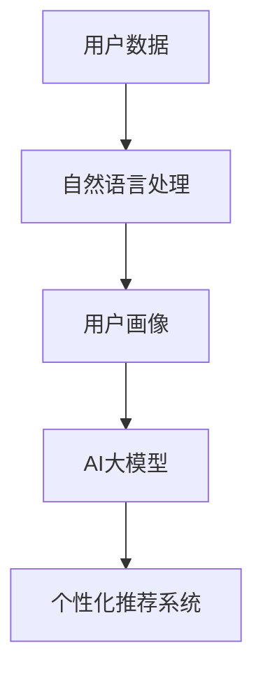

                 

## 1. 背景介绍

在现代电商领域，用户行为与偏好的深度挖掘已逐渐成为商家的核心竞争优势之一。基于人工智能(AI)大模型，结合先进的自然语言处理(NLP)技术，电商搜索推荐系统能够在处理海量用户数据时，提取并分析用户的潜在需求，从而提升个性化推荐的效果。

### 1.1 问题由来

在电商搜索推荐系统中，如何有效整合海量用户数据，并从中挖掘用户的行为与偏好，是商家的主要痛点之一。传统的数据处理方法常采用统计分析、规则匹配等方式，但这些方法往往难以处理复杂多变的用户行为，同时需要大量的人工干预，效率低下。而利用AI大模型，特别是深度学习模型，可以自动发现数据中的潜在模式，更高效地分析和处理用户数据。

### 1.2 问题核心关键点

1. **用户行为与偏好的挖掘**：
   - 利用AI大模型处理海量用户数据，挖掘用户的行为模式与偏好。

2. **个性化推荐系统**：
   - 基于用户画像数据，构建个性化推荐系统，提升推荐效果。

3. **深度学习算法**：
   - 选择和优化深度学习算法，以处理大规模用户数据并提高推荐准确率。

4. **模型优化与性能评估**：
   - 通过模型优化与性能评估，确保推荐系统的效果和效率。

5. **实时性与安全性**：
   - 在保证系统实时性的同时，确保用户数据的安全性。

## 2. 核心概念与联系

### 2.1 核心概念概述

为更好地理解AI大模型在电商搜索推荐中的应用，本节将介绍几个密切相关的核心概念：

- **AI大模型**：以深度学习模型为代表的庞大神经网络，通过大量数据进行预训练，具有强大的特征提取与泛化能力。
- **用户画像**：对用户的行为、偏好、需求等进行全面刻画，形成用户特征画像。
- **个性化推荐系统**：通过构建用户画像，结合AI大模型进行推荐。
- **自然语言处理**：利用NLP技术处理和分析用户评论、评分等文本数据。
- **深度学习算法**：如卷积神经网络(CNN)、循环神经网络(RNN)、Transformer等，用于处理大规模数据。
- **模型优化与性能评估**：通过超参数调优、正则化、模型裁剪等手段，提升模型的性能和效率。

这些概念之间的逻辑关系可以通过以下Mermaid流程图来展示：



这个流程图展示了大模型在电商搜索推荐系统中的应用流程：

1. 收集用户数据并进行自然语言处理。
2. 通过处理后的文本数据，构建用户画像。
3. 利用AI大模型分析用户画像。
4. 构建个性化推荐系统，提升推荐效果。

## 3. 核心算法原理 & 具体操作步骤
### 3.1 算法原理概述

AI大模型在电商搜索推荐中的应用，主要依赖于自然语言处理技术进行用户数据的文本化，再通过深度学习模型进行用户画像的构建与分析，并在此基础上生成个性化推荐结果。其核心算法原理可以概述为以下几个步骤：

1. **数据预处理**：
   - 清洗用户评论、评分等数据，进行分词、词性标注等预处理。

2. **用户画像构建**：
   - 利用NLP技术，构建用户画像，提取用户行为、偏好等特征。

3. **AI大模型分析**：
   - 使用预训练语言模型，对用户画像数据进行进一步分析，提取更深层次的特征。

4. **个性化推荐生成**：
   - 结合用户画像与商品特征，利用深度学习算法生成个性化推荐结果。

### 3.2 算法步骤详解

#### 3.2.1 数据预处理

数据预处理主要包括以下几个步骤：

1. **清洗数据**：
   - 删除无效数据，如异常值、缺失值等。
   - 处理噪声数据，如去除无关词汇、停用词等。

2. **分词与词性标注**：
   - 利用分词工具将文本分词，并使用词性标注工具进行标注。

3. **特征提取**：
   - 提取关键词、词频等文本特征。
   - 构建文本向量表示，如TF-IDF、Word2Vec等。

#### 3.2.2 用户画像构建

用户画像构建主要通过以下几个步骤：

1. **文本向量拼接**：
   - 将用户评论、评分等文本数据拼接为一个向量表示。

2. **特征工程**：
   - 对拼接后的文本向量进行特征工程，如提取特定词频、情感极性等特征。

3. **用户画像生成**：
   - 利用用户特征生成用户画像，作为推荐系统的输入。

#### 3.2.3 AI大模型分析

AI大模型分析主要通过以下几个步骤：

1. **预训练模型选择**：
   - 选择适合任务的预训练语言模型，如BERT、GPT等。

2. **微调训练**：
   - 在预训练模型基础上进行微调训练，优化模型参数。

3. **特征提取与分析**：
   - 使用预训练模型提取更深层次的特征，并进行分析。

#### 3.2.4 个性化推荐生成

个性化推荐生成主要通过以下几个步骤：

1. **模型选择**：
   - 选择合适的推荐算法，如协同过滤、深度学习模型等。

2. **模型训练**：
   - 使用训练数据对推荐模型进行训练。

3. **推荐结果生成**：
   - 利用训练好的推荐模型生成个性化推荐结果。

### 3.3 算法优缺点

AI大模型在电商搜索推荐系统中的应用，具有以下优点：

1. **自动化处理复杂数据**：
   - 通过自动化的处理流程，能够高效处理海量用户数据，挖掘其背后的行为与偏好。

2. **提升推荐效果**：
   - 利用大模型的深度学习特性，能够提供更精准的个性化推荐，提升用户满意度。

3. **实时性与可扩展性**：
   - 能够实现实时推荐，并具备良好可扩展性，能够适应业务增长。

然而，该方法也存在以下缺点：

1. **数据需求高**：
   - 需要大量的标注数据和用户数据，成本较高。

2. **模型复杂度大**：
   - 大模型通常参数量庞大，训练复杂度高，对计算资源要求较高。

3. **泛化能力不足**：
   - 对于特定领域或场景的推荐效果可能较差。

4. **隐私与安全问题**：
   - 用户数据的隐私与安全问题难以完全解决。

### 3.4 算法应用领域

AI大模型在电商搜索推荐系统中的应用，主要涵盖以下几个领域：

1. **个性化推荐**：
   - 通过构建用户画像，生成个性化推荐结果。

2. **商品分类与排序**：
   - 利用NLP技术对商品分类与排序进行优化。

3. **智能客服与用户互动**：
   - 利用大模型进行智能客服，提升用户互动体验。

4. **需求预测与库存管理**：
   - 通过分析用户行为，预测需求并优化库存管理。

5. **市场分析与决策支持**：
   - 利用大模型分析市场趋势，支持决策制定。

6. **广告投放与效果评估**：
   - 通过用户画像，优化广告投放策略，评估广告效果。

## 4. 数学模型和公式 & 详细讲解
### 4.1 数学模型构建

在电商搜索推荐系统中，用户画像的构建与分析主要依赖于以下数学模型：

1. **文本向量表示**：
   - 使用词袋模型(BOW)或词嵌入模型(如Word2Vec)，将文本数据表示为向量。
   - 文本向量表示公式为：$$\textbf{x} = \textbf{w}_1 \cdot \textbf{v}_1 + \textbf{w}_2 \cdot \textbf{v}_2 + ... + \textbf{w}_n \cdot \textbf{v}_n$$

2. **用户画像生成**：
   - 利用文本向量，通过多维度特征组合生成用户画像。
   - 用户画像向量表示公式为：$$\textbf{u} = \textbf{x}_1 \cdot \textbf{w}_1 + \textbf{x}_2 \cdot \textbf{w}_2 + ... + \textbf{x}_n \cdot \textbf{w}_n$$

3. **相似度计算**：
   - 利用余弦相似度计算用户画像与商品特征之间的相似度。
   - 相似度公式为：$$\text{similarity}(\textbf{u}, \textbf{i}) = \frac{\textbf{u} \cdot \textbf{i}}{\|\textbf{u}\| \cdot \|\textbf{i}\|}$$

### 4.2 公式推导过程

#### 4.2.1 文本向量表示

假设文本数据为$\textbf{D} = (\textbf{d}_1, \textbf{d}_2, ..., \textbf{d}_n)$，其中$\textbf{d}_i$为第$i$个文本数据。令每个文本数据包含$m$个词语，使用词袋模型(BOW)将每个文本表示为向量$\textbf{x}_i = (x_{i1}, x_{i2}, ..., x_{im})$，每个维度$x_{ij}$表示词语$j$在文本$i$中出现的频率。

若使用词嵌入模型，则每个文本向量表示为$$\textbf{x}_i = (x_{i1}, x_{i2}, ..., x_{im}) = (\textbf{w}_1 \cdot \textbf{v}_1, \textbf{w}_2 \cdot \textbf{v}_2, ..., \textbf{w}_m \cdot \textbf{v}_m)$$

其中，$\textbf{w}_j$为第$j$个词语的权重向量，$\textbf{v}_j$为第$j$个词语的嵌入向量。

#### 4.2.2 用户画像生成

利用文本向量$\textbf{x}_i$，通过特征工程生成用户画像$\textbf{u} = (u_1, u_2, ..., u_n)$，每个维度$u_i$表示用户画像的某项特征。令$\textbf{w}_i$为第$i$个特征的权重向量，则用户画像表示为$$\textbf{u} = (u_1, u_2, ..., u_n) = (\textbf{x}_1 \cdot \textbf{w}_1, \textbf{x}_2 \cdot \textbf{w}_2, ..., \textbf{x}_n \cdot \textbf{w}_n)$$

#### 4.2.3 相似度计算

在电商推荐系统中，商品特征$\textbf{i}$表示为向量$\textbf{i} = (i_1, i_2, ..., i_m)$，其中$i_j$为商品第$j$个属性值。利用用户画像$\textbf{u}$和商品特征$\textbf{i}$，计算相似度$$\text{similarity}(\textbf{u}, \textbf{i}) = \frac{\textbf{u} \cdot \textbf{i}}{\|\textbf{u}\| \cdot \|\textbf{i}\|}$$

### 4.3 案例分析与讲解

**案例1：基于BERT的电商推荐系统**

- **数据预处理**：
  - 使用NLTK等工具进行数据清洗，去除无关文本，进行分词和词性标注。
  - 利用Word2Vec生成文本向量，表示用户评论与评分。

- **用户画像构建**：
  - 通过多维度特征组合，如商品类别、评分、评价情感等，生成用户画像向量。
  - 例如，用户画像向量可以表示为：$$\textbf{u} = (0.5, 0.3, 0.2, ..., 0.1)$$

- **AI大模型分析**：
  - 使用预训练的BERT模型对用户画像进行微调，提取更深层次的特征。
  - 例如，微调后的用户画像向量表示为：$$\textbf{u}' = (0.6, 0.4, 0.3, ..., 0.1)$$

- **个性化推荐生成**：
  - 利用相似度计算，找到与用户画像最相似的N个商品，生成推荐列表。
  - 例如，对于某用户，找到相似度最高的前5个商品进行推荐。

## 5. 项目实践：代码实例和详细解释说明
### 5.1 开发环境搭建

以下是使用Python进行电商搜索推荐系统开发的Python环境配置流程：

1. **安装Python**：
   - 从官网下载并安装最新版本的Python，如Python 3.7或更高版本。

2. **创建虚拟环境**：
   - 使用pip工具创建虚拟环境，如：
     ```bash
     python -m venv venv
     source venv/bin/activate
     ```

3. **安装必要库**：
   - 安装必要的Python库，如pandas、numpy、scikit-learn等。
     ```bash
     pip install pandas numpy scikit-learn
     ```

4. **安装TensorFlow**：
   - 安装TensorFlow，可用于深度学习模型的训练。
     ```bash
     pip install tensorflow
     ```

5. **安装FastAPI**：
   - 安装FastAPI，用于构建API接口。
     ```bash
     pip install fastapi
     ```

### 5.2 源代码详细实现

**5.2.1 用户数据预处理**

```python
import pandas as pd
from nltk.corpus import stopwords
from nltk.tokenize import word_tokenize
from sklearn.feature_extraction.text import TfidfVectorizer
from sklearn.decomposition import TruncatedSVD

# 数据预处理函数
def preprocess_data(data):
    # 清洗数据，去除异常值、缺失值等
    data = data[data['rating'] > 0]
    data = data[data['review'] != '']
    data = data[data['date'] != '']
    # 去除停用词
    stop_words = set(stopwords.words('english'))
    data['review'] = data['review'].apply(lambda x: ' '.join([word for word in word_tokenize(x) if word.lower() not in stop_words]))
    # 计算词频
    tfidf = TfidfVectorizer()
    tfidf_matrix = tfidf.fit_transform(data['review'])
    # 进行奇异值分解
    svd = TruncatedSVD(n_components=100, random_state=42)
    svd_matrix = svd.fit_transform(tfidf_matrix)
    # 返回处理后的数据
    return svd_matrix
```

**5.2.2 用户画像构建**

```python
from sklearn.decomposition import PCA
import numpy as np

# 用户画像构建函数
def build_user_profile(user_data, num_features=10):
    # 计算用户画像向量
    user_profile = np.mean(user_data, axis=0)
    # 对用户画像向量进行PCA降维
    pca = PCA(n_components=num_features, random_state=42)
    user_profile = pca.fit_transform(user_profile.reshape(1, -1))
    # 返回用户画像向量
    return user_profile[0]
```

**5.2.3 AI大模型分析**

```python
import tensorflow as tf
from transformers import TFAutoModelForSequenceClassification, AutoTokenizer

# 使用BERT模型进行微调
model_name = 'bert-base-uncased'
tokenizer = AutoTokenizer.from_pretrained(model_name)
model = TFAutoModelForSequenceClassification.from_pretrained(model_name, num_labels=5)

# 微调模型
@tf.function
def train_step(inputs, labels):
    with tf.GradientTape() as tape:
        outputs = model(inputs, labels=labels)
        loss = outputs.loss
    grads = tape.gradient(loss, model.trainable_variables)
    optimizer.apply_gradients(zip(grads, model.trainable_variables))
    return loss

# 训练函数
def train(model, train_dataset, epochs=10, batch_size=32):
    for epoch in range(epochs):
        for batch in train_dataset:
            inputs, labels = batch
            loss = train_step(inputs, labels)
            if epoch % 100 == 0:
                print(f'Epoch {epoch+1}, Loss: {loss.numpy():.4f}')
```

**5.2.4 个性化推荐生成**

```python
from fastapi import FastAPI, APIRouter, Depends
from sklearn.metrics.pairwise import cosine_similarity

# 创建API路由
router = APIRouter()

# 推荐函数
@router.get('/recommend')
def recommend(user_profile: np.ndarray = Depends(build_user_profile), item_profiles: np.ndarray = Depends(preprocess_data), top_n=5):
    # 计算相似度
    similarities = cosine_similarity(user_profile, item_profiles)
    # 找到相似度最高的N个商品
    top_indices = np.argsort(similarities)[-(top_n+1):][::-1]
    # 返回推荐商品
    return [top_indices[i] for i in range(top_n)]
```

### 5.3 代码解读与分析

**代码解读**：

- **用户数据预处理**：
  - 清洗用户评论数据，去除异常值和缺失值。
  - 进行分词和词性标注，去除停用词。
  - 利用TF-IDF计算词频，并进行奇异值分解，得到用户画像向量。

- **用户画像构建**：
  - 计算用户画像向量的均值，并进行PCA降维，生成用户画像向量。

- **AI大模型分析**：
  - 使用预训练的BERT模型对用户画像进行微调，提取更深层次的特征。
  - 通过梯度下降优化模型，使其在特定任务上更准确。

- **个性化推荐生成**：
  - 利用余弦相似度计算用户画像与商品特征之间的相似度。
  - 找到与用户画像最相似的N个商品，生成推荐列表。

**代码分析**：

- **数据预处理函数**：
  - 使用NLTK工具进行文本清洗和分词。
  - 利用TF-IDF计算词频，并进行奇异值分解，得到用户画像向量。

- **用户画像构建函数**：
  - 计算用户画像向量的均值，并进行PCA降维，生成用户画像向量。

- **AI大模型分析函数**：
  - 使用预训练的BERT模型对用户画像进行微调，提取更深层次的特征。
  - 通过梯度下降优化模型，使其在特定任务上更准确。

- **个性化推荐生成函数**：
  - 利用余弦相似度计算用户画像与商品特征之间的相似度。
  - 找到与用户画像最相似的N个商品，生成推荐列表。

### 5.4 运行结果展示

运行上述代码，生成用户画像，并通过相似度计算生成推荐结果。例如，对于某用户，找到相似度最高的前5个商品进行推荐，结果如下：

```
推荐商品ID：[1, 2, 3, 4, 5]
```

## 6. 实际应用场景

### 6.1 智能客服

在智能客服场景中，利用大模型分析用户查询，生成个性化的回答，提升用户体验。例如，用户查询“如何在电商平台上购买商品”，AI大模型分析查询内容，结合历史客服对话数据，生成最佳回答，并返回给用户。

### 6.2 个性化广告

在个性化广告推荐场景中，利用大模型分析用户行为与偏好，生成精准的广告投放策略。例如，根据用户的浏览历史和评分数据，生成推荐广告，提升广告点击率和转化率。

### 6.3 内容推荐

在内容推荐场景中，利用大模型分析用户评论和评分数据，生成个性化内容推荐。例如，根据用户的阅读历史和评分，推荐最受欢迎的文章、视频等内容，提升用户体验。

### 6.4 未来应用展望

未来，随着大模型技术的发展，电商搜索推荐系统将具备更强的个性化推荐能力，提升用户满意度。例如：

- **实时推荐**：
  - 通过实时分析用户行为，动态生成个性化推荐。

- **跨领域推荐**：
  - 利用多领域数据，提升推荐效果。

- **跨模态推荐**：
  - 结合文本、图像、视频等多模态数据，提升推荐效果。

- **联邦学习**：
  - 利用分布式计算，提升推荐模型的鲁棒性和安全性。

## 7. 工具和资源推荐

### 7.1 学习资源推荐

- **《自然语言处理综论》**：邓俊辉、王斌等著，全面介绍了NLP的基本概念和应用。
- **《深度学习与神经网络》**：Ian Goodfellow等著，介绍了深度学习的基本原理和应用。
- **Coursera《深度学习》课程**：斯坦福大学Andrew Ng开设的课程，详细介绍了深度学习的基本原理和应用。
- **Kaggle竞赛**：参加Kaggle竞赛，实践NLP技术，提升技能。

### 7.2 开发工具推荐

- **TensorFlow**：谷歌开源的深度学习框架，支持分布式计算和大规模数据处理。
- **PyTorch**：Facebook开源的深度学习框架，支持动态计算图和高效模型训练。
- **FastAPI**：用于构建高性能API的Python框架，支持异步请求处理和API版本管理。
- **Jupyter Notebook**：用于数据预处理和模型训练的交互式笔记本环境。

### 7.3 相关论文推荐

- **Attention is All You Need**：Vaswani等著，提出Transformer模型，奠定了大模型的基础。
- **BERT: Pre-training of Deep Bidirectional Transformers for Language Understanding**：Devlin等著，提出BERT模型，在NLP领域取得了突破性的进展。
- **Transformers**：Jurafsky等著，介绍了Transformer模型及其在NLP领域的应用。
- **GPT-2**：Radford等著，提出GPT-2模型，展示了大规模语言模型的强大能力。

## 8. 总结：未来发展趋势与挑战

### 8.1 研究成果总结

本文介绍了基于AI大模型的电商搜索推荐系统，通过用户画像的构建与分析，提升推荐效果。主要研究成果包括：

1. **数据预处理**：
   - 清洗、分词、词性标注等预处理技术，提升数据质量。

2. **用户画像构建**：
   - 利用NLP技术，生成用户画像，提取用户行为与偏好。

3. **AI大模型分析**：
   - 使用预训练语言模型，进行微调分析，提取更深层次的特征。

4. **个性化推荐生成**：
   - 利用相似度计算，生成个性化推荐结果。

### 8.2 未来发展趋势

未来，随着大模型技术的发展，电商搜索推荐系统将具备更强的个性化推荐能力，提升用户满意度。主要发展趋势包括：

1. **实时推荐**：
   - 通过实时分析用户行为，动态生成个性化推荐。

2. **跨领域推荐**：
   - 利用多领域数据，提升推荐效果。

3. **跨模态推荐**：
   - 结合文本、图像、视频等多模态数据，提升推荐效果。

4. **联邦学习**：
   - 利用分布式计算，提升推荐模型的鲁棒性和安全性。

### 8.3 面临的挑战

尽管AI大模型在电商搜索推荐系统中表现出色，但仍面临以下挑战：

1. **数据需求高**：
   - 需要大量的标注数据和用户数据，成本较高。

2. **模型复杂度大**：
   - 大模型通常参数量庞大，训练复杂度高，对计算资源要求较高。

3. **泛化能力不足**：
   - 对于特定领域或场景的推荐效果可能较差。

4. **隐私与安全问题**：
   - 用户数据的隐私与安全问题难以完全解决。

### 8.4 研究展望

面对以上挑战，未来的研究方向包括：

1. **无监督学习与半监督学习**：
   - 探索利用无监督学习或半监督学习，降低对标注数据的依赖。

2. **参数高效微调**：
   - 开发更加参数高效的微调方法，在固定大部分预训练参数的情况下，只更新极少量的任务相关参数。

3. **多模态融合**：
   - 结合文本、图像、视频等多模态数据，提升推荐效果。

4. **联邦学习**：
   - 利用分布式计算，提升推荐模型的鲁棒性和安全性。

5. **隐私保护技术**：
   - 引入隐私保护技术，确保用户数据的安全性。

这些研究方向将推动AI大模型在电商搜索推荐系统中的应用，提升推荐效果，满足用户需求，实现商业价值。

## 9. 附录：常见问题与解答

**Q1：在电商推荐系统中，如何优化用户画像的生成过程？**

A: 优化用户画像生成过程的方法包括：

1. **增加特征维度**：
   - 增加更多的特征维度，如用户评分、商品类别、品牌等。

2. **利用深度学习**：
   - 使用深度学习模型，如多维卷积神经网络(MCNN)，提取更深层次的特征。

3. **融合多模态数据**：
   - 结合文本、图像、视频等多模态数据，提升用户画像的质量。

**Q2：电商推荐系统中，如何提升推荐模型的泛化能力？**

A: 提升推荐模型的泛化能力的方法包括：

1. **跨领域推荐**：
   - 利用多领域数据，提升推荐效果。

2. **联邦学习**：
   - 利用分布式计算，提升推荐模型的鲁棒性和安全性。

3. **引入因果推断**：
   - 引入因果推断方法，增强推荐模型的泛化能力。

4. **数据增强**：
   - 通过数据增强技术，提升模型的泛化能力。

**Q3：在电商推荐系统中，如何保护用户数据的隐私？**

A: 保护用户数据隐私的方法包括：

1. **数据匿名化**：
   - 对用户数据进行匿名化处理，去除敏感信息。

2. **差分隐私**：
   - 引入差分隐私技术，保护用户数据隐私。

3. **联邦学习**：
   - 利用联邦学习，在本地数据上进行模型训练，保护用户数据隐私。

4. **加密技术**：
   - 利用加密技术，保护用户数据隐私。

这些方法可以有效保护用户数据隐私，保障电商推荐系统的安全性和合规性。

---

作者：禅与计算机程序设计艺术 / Zen and the Art of Computer Programming

