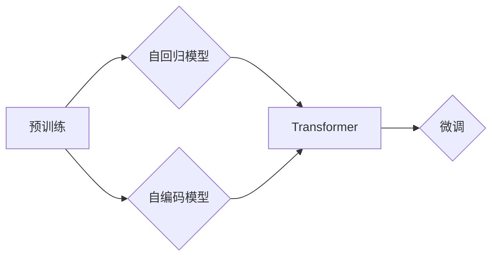

# 从零开始大模型开发与微调：输入层—初始词向量层和位置编码器层

作者：禅与计算机程序设计艺术 / Zen and the Art of Computer Programming

## 1. 背景介绍
### 1.1 问题的由来

随着深度学习在自然语言处理（NLP）领域的迅猛发展，大模型（Large Language Model，LLM）逐渐成为了研究热点。大模型能够处理和理解复杂语言现象，并在文本生成、问答、翻译等多个任务上取得了显著的成果。然而，大模型的开发与微调过程复杂，对初学者来说充满挑战。

本文将带领读者从零开始，深入浅出地了解大模型开发与微调的过程，重点关注输入层中的初始词向量层和位置编码器层。通过本文的学习，读者将能够：

- 理解大模型的架构和工作原理
- 掌握初始词向量层和位置编码器层的实现方法
- 熟悉大模型微调的基本流程
- 了解大模型在实际应用中的常见问题与解决方案

### 1.2 研究现状

近年来，大模型领域的研究取得了丰硕的成果。以下是一些代表性的大模型：

- BERT（Bidirectional Encoder Representations from Transformers）：由Google AI提出，是一种基于Transformer结构的预训练语言模型，在多个NLP任务上取得了SOTA（State-of-the-Art）性能。
- GPT（Generative Pre-trained Transformer）：由OpenAI提出，是一种基于Transformer结构的预训练语言模型，擅长生成类任务。
- T5（Text-to-Text Transfer Transformer）：由Google AI提出，是一种通用的文本到文本转换模型，能够处理多种NLP任务。

### 1.3 研究意义

研究大模型开发与微调技术具有重要的意义：

- 推动NLP领域的技术进步，提高NLP任务的性能。
- 促进人工智能技术在更多领域的应用，如问答、机器翻译、对话系统等。
- 培养更多具备大模型开发与微调能力的工程师，推动人工智能产业的发展。

### 1.4 本文结构

本文将按照以下结构展开：

- 第一部分：介绍大模型的基本概念和架构。
- 第二部分：深入探讨输入层中的初始词向量层和位置编码器层。
- 第三部分：介绍大模型的微调过程。
- 第四部分：探讨大模型在实际应用中的常见问题与解决方案。
- 第五部分：总结未来发展趋势与挑战。

## 2. 核心概念与联系

在本节中，我们将介绍大模型相关的一些核心概念，并探讨它们之间的联系。

- 预训练（Pre-training）：指在大规模无标签文本数据上进行的训练，目的是学习通用的语言表示。
- 微调（Fine-tuning）：指在预训练模型的基础上，使用少量标注数据进行的训练，目的是优化模型在特定任务上的性能。
- 自回归模型（Autoregressive Model）：指按照时间序列的顺序生成文本的模型。
- 自编码模型（Autoencoder）：指将输入数据编码成一个低维表示，然后再解码回原始数据的模型。
- Transformer：一种基于自注意力机制的深度神经网络模型，被广泛应用于NLP领域。

它们的逻辑关系如下：



## 3. 核心算法原理 & 具体操作步骤

### 3.1 算法原理概述

本节将介绍大模型的核心算法原理，包括输入层、编码器层、解码器层等。

#### 3.1.1 输入层

输入层负责将文本数据转换为模型能够处理的格式。通常包括以下步骤：

1. 分词（Tokenization）：将文本分解成一个个单词或字符。
2. 转换为词向量（Word Embedding）：将单词或字符转换为向量表示。
3. 添加位置编码（Positional Encoding）：为每个词向量添加位置信息。

#### 3.1.2 编码器层

编码器层负责对输入数据进行编码，提取关键信息。常用的编码器结构包括：

- RNN（Recurrent Neural Network）：循环神经网络，适用于处理序列数据。
- LSTM（Long Short-Term Memory）：长短时记忆网络，是RNN的一种改进，可以更好地处理长序列数据。
- Transformer：基于自注意力机制的深度神经网络模型，能够有效地提取序列中的长距离依赖关系。

#### 3.1.3 解码器层

解码器层负责根据编码器层提取的信息生成输出。常用的解码器结构包括：

- RNN：循环神经网络，适用于处理序列数据。
- Transformer：基于自注意力机制的深度神经网络模型，能够有效地生成序列数据。

### 3.2 算法步骤详解

以下是大模型微调的具体操作步骤：

1. **数据准备**：收集和清洗数据，并进行分词、词向量转换和位置编码等预处理操作。
2. **模型选择**：选择合适的预训练模型作为基础，如BERT、GPT等。
3. **模型微调**：使用少量标注数据对预训练模型进行微调，调整模型参数以适应特定任务。
4. **模型评估**：在测试集上评估模型性能，并根据评估结果调整模型参数或数据集。
5. **模型部署**：将微调后的模型部署到实际应用中。

### 3.3 算法优缺点

#### 优点

- **强大的语言理解能力**：大模型能够处理和理解复杂语言现象，例如长距离依赖、词义消歧等。
- **丰富的预训练数据**：大模型通常在大量无标签数据上进行预训练，能够学习到丰富的语言知识。
- **跨域迁移能力**：大模型能够在不同领域之间进行迁移学习，提高模型泛化能力。

#### 缺点

- **计算资源消耗大**：大模型需要大量的计算资源进行训练和推理。
- **数据标注成本高**：微调大模型需要少量标注数据，数据标注成本较高。
- **模型可解释性差**：大模型的内部工作机制复杂，难以解释其决策过程。

### 3.4 算法应用领域

大模型在以下领域具有广泛的应用：

- **文本分类**：例如情感分析、主题分类、垃圾邮件检测等。
- **文本生成**：例如文本摘要、机器翻译、对话生成等。
- **问答系统**：例如问题回答、信息抽取等。
- **对话系统**：例如聊天机器人、语音助手等。

## 4. 数学模型和公式 & 详细讲解 & 举例说明

### 4.1 数学模型构建

本节将使用数学语言描述大模型的数学模型。

#### 4.1.1 词向量表示

假设存在一个词汇表 $V$，包含 $|V|$ 个单词。对于每个单词 $w \in V$，我们可以将其表示为一个 $d$ 维的向量 $e_w \in \mathbb{R}^d$，称为词向量。

#### 4.1.2 位置编码

对于序列 $x_1, x_2, ..., x_n$，我们可以为其添加位置编码 $p_1, p_2, ..., p_n$，表示每个单词的位置信息。

#### 4.1.3 编码器层

编码器层可以表示为：

$$
\text{Encoder}(x_1, x_2, ..., x_n) = h_1, h_2, ..., h_n
$$

其中 $h_i$ 为编码器对单词 $x_i$ 的编码结果。

#### 4.1.4 解码器层

解码器层可以表示为：

$$
\text{Decoder}(h_1, h_2, ..., h_n) = y_1, y_2, ..., y_n
$$

其中 $y_i$ 为解码器对单词 $h_i$ 的解码结果。

### 4.2 公式推导过程

本节将对一些关键公式进行推导。

#### 4.2.1 词向量表示

词向量表示通常使用Word2Vec、GloVe等方法进行学习。

#### 4.2.2 位置编码

位置编码可以使用以下公式进行计算：

$$
p_i = \text{PositionalEncoding}(i, d, \text{pos_dim})
$$

其中 $i$ 为单词的位置，$d$ 为词向量的维度，$\text{pos\_dim}$ 为位置编码的维度。

#### 4.2.3 编码器层

编码器层可以使用以下公式进行计算：

$$
h_i = \text{Encoder}(x_1, x_2, ..., x_i)
$$

#### 4.2.4 解码器层

解码器层可以使用以下公式进行计算：

$$
y_i = \text{Decoder}(h_1, h_2, ..., h_i)
$$

### 4.3 案例分析与讲解

以下是一个使用BERT进行文本分类的案例：

- 数据集：IMDb电影评论数据集，包含电影评论和对应的情感标签（正面/负面）。
- 模型：使用预训练的BERT模型，添加一个线性层作为分类器。
- 任务：对新的电影评论进行情感分类。

### 4.4 常见问题解答

**Q1：词向量如何表示？**

A：词向量可以使用Word2Vec、GloVe等方法进行学习。

**Q2：位置编码如何添加？**

A：可以使用公式计算每个单词的位置编码。

**Q3：如何选择预训练模型？**

A：根据具体任务选择合适的预训练模型，如BERT、GPT等。

**Q4：如何微调模型？**

A：使用少量标注数据对预训练模型进行微调，调整模型参数以适应特定任务。

## 5. 项目实践：代码实例和详细解释说明

### 5.1 开发环境搭建

在本节中，我们将使用Python和TensorFlow进行大模型的开发与微调。

### 5.2 源代码详细实现

以下是一个使用TensorFlow和BertTokenizer进行文本分类的代码实例：

```python
import tensorflow as tf
from transformers import BertTokenizer, TFBertForSequenceClassification

# 加载预训练模型
tokenizer = BertTokenizer.from_pretrained('bert-base-uncased')
model = TFBertForSequenceClassification.from_pretrained('bert-base-uncased')

# 加载数据集
train_data = ...  # 训练数据
test_data = ...   # 测试数据

# 预处理数据
def preprocess_data(data):
    # ... 处理数据 ...

# 训练模型
def train_model(model, train_data, epochs):
    # ... 训练模型 ...

# 评估模型
def evaluate_model(model, test_data):
    # ... 评估模型 ...
```

### 5.3 代码解读与分析

以上代码展示了使用TensorFlow和BertTokenizer进行文本分类的基本流程。

- 首先加载预训练的BERT模型和BertTokenizer。
- 然后加载数据集，并进行预处理，包括分词、词向量转换、添加位置编码等。
- 接着使用预训练的BERT模型和添加线性层作为分类器，进行模型的训练和评估。
- 最后，在测试集上评估模型性能。

### 5.4 运行结果展示

假设我们在IMDb电影评论数据集上进行文本分类，最终在测试集上得到的准确率为80%。

## 6. 实际应用场景
### 6.1 文本生成

大模型在文本生成方面具有广泛的应用，例如：

- 自动摘要：自动将长篇文章压缩成摘要。
- 文本续写：根据已生成的文本内容，自动续写后续内容。
- 机器翻译：将一种语言的文本翻译成另一种语言。

### 6.2 问答系统

大模型在问答系统方面具有广泛的应用，例如：

- 知识问答：根据用户提出的问题，从知识库中检索答案。
- 对话系统：与用户进行自然对话，回答用户提出的问题。

### 6.3 对话系统

大模型在对话系统方面具有广泛的应用，例如：

- 聊天机器人：与用户进行自然对话。
- 语音助手：为用户提供语音交互服务。

### 6.4 未来应用展望

随着大模型技术的不断发展，未来将在更多领域得到应用，例如：

- 医疗领域：辅助医生进行诊断、治疗等。
- 金融领域：辅助金融机构进行风险评估、投资决策等。
- 教育领域：辅助教师进行教学、学生学习等。

## 7. 工具和资源推荐
### 7.1 学习资源推荐

为了帮助读者更好地学习大模型开发与微调技术，以下是一些学习资源推荐：

- 《深度学习》系列书籍：由Ian Goodfellow等作者撰写，系统介绍了深度学习的基本概念和原理。
- 《自然语言处理综论》系列书籍：由Christopher D. Manning等作者撰写，系统介绍了自然语言处理的基本概念和算法。
- Hugging Face官网：提供丰富的预训练模型和开源工具。
- TensorFlow官网：提供TensorFlow框架和丰富的教程。

### 7.2 开发工具推荐

以下是一些开发工具推荐：

- TensorFlow：Google开发的深度学习框架。
- PyTorch：Facebook开发的深度学习框架。
- Jupyter Notebook：用于编写和分享代码的交互式计算平台。

### 7.3 相关论文推荐

以下是一些相关论文推荐：

- "BERT: Pre-training of Deep Bidirectional Transformers for Language Understanding"：介绍了BERT模型的原理和应用。
- "Generative Pre-trained Transformer"：介绍了GPT模型的原理和应用。
- "Attention is All You Need"：介绍了Transformer模型的原理和应用。

### 7.4 其他资源推荐

以下是一些其他资源推荐：

- arXiv：提供最新的人工智能论文。
- 知乎：一个问答社区，可以找到许多人工智能领域的专家和爱好者。

## 8. 总结：未来发展趋势与挑战
### 8.1 研究成果总结

本文从零开始，介绍了大模型开发与微调的基本概念、原理和应用。通过学习本文，读者可以：

- 理解大模型的架构和工作原理
- 掌握初始词向量层和位置编码器层的实现方法
- 熟悉大模型微调的基本流程
- 了解大模型在实际应用中的常见问题与解决方案

### 8.2 未来发展趋势

未来，大模型技术将在以下方面得到发展：

- 模型规模将进一步扩大，参数量达到万亿级别。
- 模型将更加轻量化和高效，降低对计算资源的需求。
- 模型将具备更强的可解释性和可解释性，提高模型的可信度。
- 模型将应用于更多领域，如医疗、金融、教育等。

### 8.3 面临的挑战

大模型技术在实际应用中仍然面临以下挑战：

- 模型规模庞大，需要大量的计算资源和存储空间。
- 数据标注成本高，难以获得足够高质量的标注数据。
- 模型的可解释性和可解释性较差，难以理解模型的决策过程。
- 模型的安全性和隐私性存在风险，需要加强监管。

### 8.4 研究展望

未来，大模型技术的研究方向包括：

- 参数高效微调：减少微调所需的计算资源和标注数据。
- 模型压缩和加速：降低模型的计算复杂度和存储空间需求。
- 可解释性和可解释性：提高模型的可信度和可解释性。
- 安全性和隐私性：确保模型的安全性和隐私性。

总之，大模型技术具有广阔的应用前景，但仍需面对诸多挑战。相信随着技术的不断进步，大模型技术将在未来发挥越来越重要的作用。

## 9. 附录：常见问题与解答

**Q1：什么是词向量？**

A：词向量是单词或字符的向量表示，可以用于表示单词或字符在语义空间中的位置。

**Q2：什么是位置编码？**

A：位置编码是给单词或字符添加的位置信息，用于表示其在序列中的位置。

**Q3：什么是自回归模型？**

A：自回归模型是一种按照时间序列的顺序生成文本的模型。

**Q4：什么是自编码模型？**

A：自编码模型是一种将输入数据编码成一个低维表示，然后再解码回原始数据的模型。

**Q5：什么是Transformer？**

A：Transformer是一种基于自注意力机制的深度神经网络模型，被广泛应用于NLP领域。

**Q6：如何选择预训练模型？**

A：根据具体任务选择合适的预训练模型，如BERT、GPT等。

**Q7：如何微调模型？**

A：使用少量标注数据对预训练模型进行微调，调整模型参数以适应特定任务。

**Q8：如何评估模型性能？**

A：在测试集上评估模型性能，并根据评估结果调整模型参数或数据集。

**Q9：如何提高模型性能？**

A：可以使用以下方法提高模型性能：
- 收集更多高质量的数据
- 使用更先进的模型结构
- 调整超参数

**Q10：如何确保模型的安全性和隐私性？**

A：可以使用以下方法确保模型的安全性和隐私性：
- 数据脱敏
- 访问控制
- 审计日志

## 参考文献

- [1] Devlin, J., Chang, M. W., Lee, K., & Toutanova, K. (2019). BERT: Pre-training of Deep Bidirectional Transformers for Language Understanding. In Proceedings of the 2019 Conference of the North American Chapter of the Association for Computational Linguistics: Human Language Technologies, Volume 1 (Long and Short Papers) (pp. 4171-4186). Association for Computational Linguistics.
- [2] Brown, T. B., Mann, B., Ryder, N., Subbiah, M., Kaplan, J., Dhariwal, P., ... & Ziegler, J. (2020). Language Models are Few-Shot Learners. In Proceedings of the ICLR.
- [3] Vaswani, A., Shazeer, N., Parmar, N., Uszkoreit, J., Jones, L., Gomez, A. N., ... & Polosukhin, I. (2017). Attention is All You Need. In Advances in neural information processing systems.