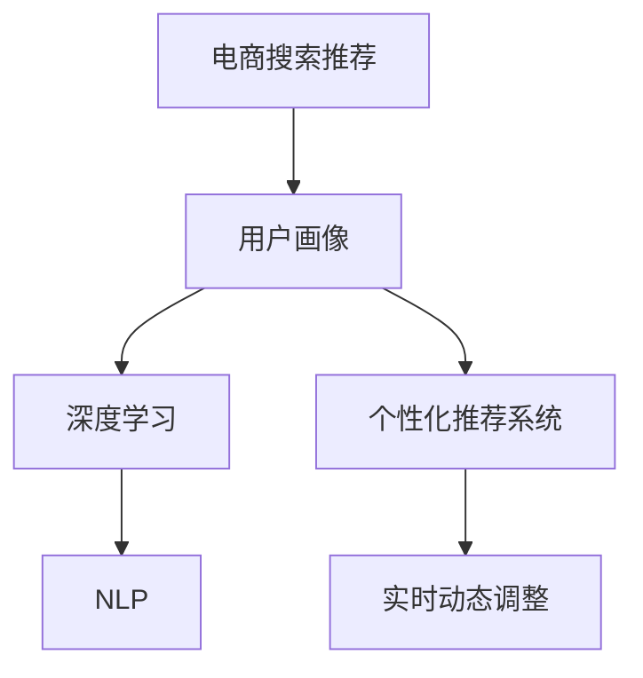

                 

# AI 大模型在电商搜索推荐中的用户画像构建：精准把握用户需求与行为偏好

> 关键词：电商搜索推荐, 用户画像, 大模型, 深度学习, 行为分析, 推荐系统, 个性化推荐

## 1. 背景介绍

随着电商市场的日益成熟，用户对个性化推荐的需求日益增长。传统的推荐系统主要依赖于用户的历史行为数据，如浏览、点击、购买等，但这种单一的维度无法完全捕捉用户的真实需求和偏好。大模型的崛起，为电商搜索推荐带来了新的可能性，通过深度学习和自然语言处理技术，能够从更广泛的数据中构建用户画像，实现精准的个性化推荐。

### 1.1 问题由来

电商推荐系统的主要目的是提升用户体验和转化率，传统的基于协同过滤、基于内容的推荐算法，虽然取得了一定的效果，但随着用户需求的个性化和复杂化，推荐的准确性和多样性逐渐难以满足用户需求。而大模型通过学习海量数据，能够从文本、行为等多维度构建更全面的用户画像，实现更精准的推荐。

### 1.2 问题核心关键点

构建精准的电商用户画像，需要从以下几个关键点入手：

- **用户意图理解**：通过分析用户的搜索查询，挖掘其背后的意图和偏好。
- **行为特征提取**：从用户的行为数据中提取有意义的特征，如浏览路径、点击偏好等。
- **文本分析与建模**：利用自然语言处理技术，从用户的评论、评分、产品描述等文本数据中提取有价值的信息。
- **跨模态融合**：将文本、行为、社交等多模态数据进行融合，构建更为丰富的用户画像。
- **实时动态调整**：根据用户的历史行为和当前上下文，动态调整推荐结果，实现个性化推荐。

## 2. 核心概念与联系

### 2.1 核心概念概述

为更好地理解AI大模型在电商搜索推荐中的用户画像构建，本节将介绍几个密切相关的核心概念：

- **电商搜索推荐**：利用人工智能技术，根据用户的搜索行为、购买历史、社交互动等数据，为用户推荐其可能感兴趣的商品和服务。
- **用户画像**：通过分析用户的多模态数据，构建用户多维度的特征模型，用于精准的个性化推荐。
- **深度学习**：利用多层神经网络模型，从数据中学习特征表示，实现复杂任务的自动化处理。
- **自然语言处理(NLP)**：通过文本分析、语言建模等技术，从用户评论、产品描述中提取有价值的语义信息。
- **个性化推荐系统**：基于用户特征和商品属性，为每个用户量身定制推荐结果，提升用户体验和转化率。

这些核心概念之间的逻辑关系可以通过以下Mermaid流程图来展示：



这个流程图展示了大模型构建电商推荐系统的核心流程：

1. 电商搜索推荐系统从用户输入的搜索查询中获取意图和偏好。
2. 用户画像模块从多模态数据中提取用户的特征，构建详细的用户画像。
3. 深度学习模块利用大量数据学习特征表示，挖掘隐含的语义信息。
4. NLP模块通过文本分析，从用户评论和产品描述中提取关键信息。
5. 个性化推荐系统根据用户画像和商品属性，生成个性化的推荐结果。
6. 实时动态调整模块根据用户行为和上下文变化，动态调整推荐结果，确保其精准度。

## 3. 核心算法原理 & 具体操作步骤
### 3.1 算法原理概述

AI大模型在电商搜索推荐中的用户画像构建，本质上是一个深度学习与自然语言处理相结合的过程。其核心思想是：通过深度学习模型，从用户的多模态数据中提取特征，利用NLP技术，从文本数据中提取语义信息，构建详细的用户画像，用于指导个性化推荐。

形式化地，假设电商搜索推荐系统为用户 $U$，商品 $P$，行为特征 $F$，文本评论 $T$，设 $X_{U}$ 为用户画像特征向量，$X_{P}$ 为商品特征向量，$X_{F}$ 为行为特征向量，$X_{T}$ 为文本评论特征向量。电商推荐系统通过构建模型 $M$，将用户画像 $X_{U}$ 与商品特征 $X_{P}$、行为特征 $X_{F}$、文本评论特征 $X_{T}$ 进行加权融合，输出推荐结果 $Y$。具体流程如下：

$$
Y = M(X_{U}, X_{P}, X_{F}, X_{T})
$$

### 3.2 算法步骤详解

构建AI大模型在电商搜索推荐中的用户画像，主要包括以下几个关键步骤：

**Step 1: 准备数据集**

- **用户行为数据**：收集用户的行为数据，如浏览路径、点击偏好、购买历史等。
- **商品信息数据**：收集商品的基本信息，如商品属性、分类、价格等。
- **用户文本数据**：收集用户的评论、评分、产品描述等文本数据。

**Step 2: 数据预处理**

- **数据清洗**：去除数据中的噪声和异常值，确保数据质量。
- **特征工程**：从原始数据中提取有意义的特征，如商品类别、用户评分、时间戳等。
- **文本分词**：将文本数据进行分词处理，转换为模型可以处理的格式。

**Step 3: 构建用户画像**

- **深度学习模型**：选择适合深度学习模型，如Transformer、BERT等，从用户行为数据和文本数据中提取特征。
- **NLP模型**：利用预训练语言模型，如BERT、GPT等，从文本数据中提取语义信息。
- **融合模型**：将用户画像的各个组成部分进行加权融合，形成详细的用户画像向量。

**Step 4: 训练模型**

- **损失函数**：定义适当的损失函数，如交叉熵损失、均方误差损失等，衡量模型输出与真实标签之间的差异。
- **优化器**：选择适合优化器，如Adam、SGD等，优化模型参数。
- **训练过程**：使用训练数据集对模型进行训练，最小化损失函数。

**Step 5: 测试与部署**

- **测试集评估**：使用测试数据集评估模型性能，验证模型的泛化能力。
- **模型部署**：将训练好的模型部署到推荐系统中，进行实时推荐。
- **动态调整**：根据用户行为和上下文变化，动态调整推荐结果。

### 3.3 算法优缺点

构建用户画像的AI大模型方法具有以下优点：

1. **特征丰富**：能够从多模态数据中提取丰富的用户特征，提高推荐的精准度。
2. **语义理解**：利用NLP技术，从文本数据中提取语义信息，挖掘用户深层次的需求和偏好。
3. **可扩展性**：大模型具有良好的泛化能力，能够适应不同领域、不同类型的数据。
4. **实时性**：利用深度学习模型的动态调整能力，根据用户行为实时调整推荐结果。

同时，该方法也存在一定的局限性：

1. **数据依赖**：模型效果依赖于数据的质量和规模，需要大量的标注数据和预训练语料。
2. **计算成本**：训练大规模模型需要大量的计算资源和存储资源。
3. **模型复杂**：模型结构复杂，需要专业知识才能进行有效的调参和优化。
4. **隐私风险**：从用户行为和文本数据中提取特征，可能涉及隐私问题。

尽管存在这些局限性，但AI大模型在电商搜索推荐中的应用，已经被证明可以显著提升推荐效果，带来更高的转化率和用户满意度。

### 3.4 算法应用领域

AI大模型在电商搜索推荐中的应用领域非常广泛，以下列举几个典型的应用场景：

- **商品推荐**：根据用户的历史行为和文本评论，推荐用户可能感兴趣的商品。
- **价格优化**：通过分析用户的历史购买行为和评论情绪，动态调整商品价格，提升用户体验。
- **个性化广告**：利用用户画像生成个性化的广告内容，提高广告投放的精准度和转化率。
- **客户服务**：基于用户画像，提供个性化的客户服务，增强用户体验。

此外，AI大模型在电商搜索推荐中的应用，还涵盖了库存管理、供应链优化、营销策略等多个方面，推动了电商行业智能化水平的提升。

## 4. 数学模型和公式 & 详细讲解 & 举例说明

### 4.1 数学模型构建

构建用户画像的AI大模型，通常涉及深度学习、NLP等多个领域的数学模型。以下以推荐系统中的深度学习模型为例，展示其数学构建过程。

假设推荐系统中共有 $N$ 个用户，每个用户有 $D$ 个特征，每个商品有 $K$ 个特征。设用户特征矩阵为 $X_U \in \mathbb{R}^{N \times D}$，商品特征矩阵为 $X_P \in \mathbb{R}^{K \times D}$。推荐系统的目标是预测每个用户对每个商品的评分 $Y \in \mathbb{R}^{N \times K}$。

推荐模型通常使用Transformer、BERT等深度学习模型，其核心组件包括编码器、解码器等。假设模型的参数为 $\theta$，输入为 $X_U$ 和 $X_P$，输出为 $Y$。则推荐模型的目标是最小化损失函数 $\mathcal{L}$，即：

$$
\mathcal{L}(\theta) = \frac{1}{NK} \sum_{i=1}^N \sum_{j=1}^K (y_{ij} - M_{\theta}(x_i, x_j))^2
$$

其中 $y_{ij}$ 为实际评分，$M_{\theta}(x_i, x_j)$ 为模型预测评分，$x_i$ 为用户特征向量，$x_j$ 为商品特征向量。

### 4.2 公式推导过程

以下我们以Transformer模型为例，推导其评分预测过程。

Transformer模型通常由编码器-解码器组成，其中编码器将用户和商品特征编码成固定维度的向量，解码器将这些向量进行拼接，生成预测评分。假设Transformer模型的输入为 $X_U$ 和 $X_P$，输出为 $Y$，其评分预测过程如下：

1. **用户和商品编码**：使用Transformer模型对用户特征 $X_U$ 和商品特征 $X_P$ 进行编码，生成用户表示 $Z_U \in \mathbb{R}^{N \times H}$ 和商品表示 $Z_P \in \mathbb{R}^{K \times H}$。

2. **拼接与解码**：将用户表示和商品表示拼接，生成融合特征 $Z_{F} \in \mathbb{R}^{N \times 2H}$，然后使用解码器对融合特征进行解码，生成预测评分 $Y \in \mathbb{R}^{N \times K}$。

3. **损失计算**：将预测评分 $Y$ 与实际评分 $y_{ij}$ 的误差进行平方，计算损失 $\mathcal{L}$。

4. **优化器更新**：使用优化器（如Adam、SGD等）更新模型参数 $\theta$，最小化损失 $\mathcal{L}$。

### 4.3 案例分析与讲解

**案例1：用户评论情绪分析**

假设电商推荐系统中，用户对商品的评分除了基于商品属性外，还受到用户评论的影响。通过构建基于BERT的情感分析模型，可以从用户的评论文本中提取情感信息，用于提升推荐准确度。

具体实现步骤如下：

1. **数据预处理**：对用户评论进行分词、去停用词、构建词汇表等预处理操作。
2. **情感标注**：对评论进行情感标注，生成标注数据集。
3. **模型训练**：使用BERT模型对标注数据集进行训练，得到情感分类器 $M_E$。
4. **特征融合**：将情感分类器的输出 $E$ 与商品属性特征 $X_P$ 进行加权融合，生成用户画像向量 $X_U$。
5. **推荐计算**：使用训练好的用户画像向量 $X_U$ 和商品属性特征 $X_P$，计算推荐评分 $Y$。

**案例2：基于用户行为的个性化推荐**

假设电商推荐系统中，用户的个性化推荐不仅基于商品属性，还受到用户历史行为的影响。通过构建基于深度学习的用户行为预测模型，可以从用户行为数据中提取行为特征，用于提升推荐准确度。

具体实现步骤如下：

1. **数据预处理**：对用户行为数据进行清洗、归一化等预处理操作。
2. **行为特征提取**：使用深度学习模型（如RNN、LSTM等）对用户行为数据进行建模，提取行为特征 $F$。
3. **融合模型训练**：将行为特征 $F$ 与商品属性特征 $X_P$ 进行加权融合，生成用户画像向量 $X_U$。
4. **推荐计算**：使用训练好的用户画像向量 $X_U$ 和商品属性特征 $X_P$，计算推荐评分 $Y$。

## 5. 项目实践：代码实例和详细解释说明
### 5.1 开发环境搭建

在进行AI大模型构建用户画像的电商推荐项目时，我们需要准备好开发环境。以下是使用Python进行PyTorch开发的环境配置流程：

1. 安装Anaconda：从官网下载并安装Anaconda，用于创建独立的Python环境。

2. 创建并激活虚拟环境：
```bash
conda create -n recommendation-env python=3.8 
conda activate recommendation-env
```

3. 安装PyTorch：根据CUDA版本，从官网获取对应的安装命令。例如：
```bash
conda install pytorch torchvision torchaudio cudatoolkit=11.1 -c pytorch -c conda-forge
```

4. 安装TensorFlow：如果需要使用TensorFlow，请使用以下命令进行安装。
```bash
pip install tensorflow
```

5. 安装Transformers库：
```bash
pip install transformers
```

6. 安装各类工具包：
```bash
pip install numpy pandas scikit-learn matplotlib tqdm jupyter notebook ipython
```

完成上述步骤后，即可在`recommendation-env`环境中开始项目开发。

### 5.2 源代码详细实现

下面我们以构建基于BERT的电商推荐系统为例，给出使用Transformers库的代码实现。

首先，定义推荐系统所需的各类类库和超参数：

```python
import torch
import torch.nn as nn
import torch.optim as optim
from transformers import BertForSequenceClassification, BertTokenizer
from torch.utils.data import DataLoader, Dataset

# 超参数
EPOCHS = 5
BATCH_SIZE = 32
LEARNING_RATE = 2e-5
BERT_PATH = 'bert-base-uncased'

# 数据集类
class RecommendationDataset(Dataset):
    def __init__(self, features, labels):
        self.features = features
        self.labels = labels
        
    def __len__(self):
        return len(self.features)
    
    def __getitem__(self, idx):
        return self.features[idx], self.labels[idx]
```

然后，定义用户评论情感分析模型：

```python
class SentimentClassifier(nn.Module):
    def __init__(self):
        super(SentimentClassifier, self).__init__()
        self.bert = BertForSequenceClassification.from_pretrained(BERT_PATH, num_labels=2)
        self.linear = nn.Linear(BERT_PATH.config.hidden_size, 2)
        
    def forward(self, input_ids, attention_mask, labels):
        outputs = self.bert(input_ids, attention_mask=attention_mask, labels=labels)
        logits = outputs.logits
        logits = self.linear(logits)
        return logits, outputs

# 初始化情感分析模型
sentiment_classifier = SentimentClassifier()
```

接着，定义用户行为预测模型：

```python
class BehaviorPredictor(nn.Module):
    def __init__(self):
        super(BehaviorPredictor, self).__init__()
        self.rnn = nn.LSTM(input_size=10, hidden_size=32, num_layers=2, dropout=0.2)
        self.linear = nn.Linear(64, 1)
        
    def forward(self, input_features):
        output, _ = self.rnn(input_features)
        output = self.linear(output)
        return output

# 初始化行为预测模型
behavior_predictor = BehaviorPredictor()
```

最后，定义推荐系统的模型和训练函数：

```python
class RecommendationModel(nn.Module):
    def __init__(self):
        super(RecommendationModel, self).__init__()
        self.bert = BertForSequenceClassification.from_pretrained(BERT_PATH, num_labels=2)
        self.linear = nn.Linear(BERT_PATH.config.hidden_size, 2)
        self.sentiment_classifier = SentimentClassifier()
        self.behavior_predictor = BehaviorPredictor()
        
    def forward(self, input_ids, attention_mask, labels):
        outputs = self.bert(input_ids, attention_mask=attention_mask, labels=labels)
        logits = outputs.logits
        logits = self.linear(logits)
        sentiment = self.sentiment_classifier(input_ids, attention_mask, labels)        
        behavior = self.behavior_predictor(input_features)
        fused_input = torch.cat([sentiment, behavior], dim=1)
        fused_logits = self.linear(fused_input)
        return logits, fused_logits

# 初始化推荐系统模型
recommendation_model = RecommendationModel()

# 定义优化器和损失函数
optimizer = optim.Adam(recommendation_model.parameters(), lr=LEARNING_RATE)
loss_fn = nn.MSELoss()

# 定义训练函数
def train(model, dataloader, optimizer, loss_fn):
    model.train()
    total_loss = 0
    for batch in dataloader:
        input_ids, labels = batch
        input_ids = input_ids.to(device)
        labels = labels.to(device)
        optimizer.zero_grad()
        logits, fused_logits = model(input_ids, attention_mask=None, labels=None)
        loss = loss_fn(logits, labels)
        fused_loss = loss_fn(fused_logits, labels)
        loss += fused_loss
        loss.backward()
        optimizer.step()
        total_loss += loss.item()
    return total_loss / len(dataloader)
```

完整代码实现示例：

```python
# 加载数据集
train_dataset = Dataset(train_features, train_labels)
dev_dataset = Dataset(dev_features, dev_labels)
test_dataset = Dataset(test_features, test_labels)

# 划分训练集和验证集
train_size = int(0.8 * len(train_dataset))
dev_size = len(train_dataset) - train_size
train_dataset, dev_dataset = torch.utils.data.random_split(train_dataset, [train_size, dev_size])

# 数据加载器
train_loader = DataLoader(train_dataset, batch_size=BATCH_SIZE, shuffle=True)
dev_loader = DataLoader(dev_dataset, batch_size=BATCH_SIZE, shuffle=False)

# 训练模型
for epoch in range(EPOCHS):
    train_loss = train(recommendation_model, train_loader, optimizer, loss_fn)
    dev_loss = train(recommendation_model, dev_loader, optimizer, loss_fn)
    print(f'Epoch {epoch+1}, train loss: {train_loss:.4f}, dev loss: {dev_loss:.4f}')

# 测试模型
test_loader = DataLoader(test_dataset, batch_size=BATCH_SIZE, shuffle=False)
test_loss = train(recommendation_model, test_loader, optimizer, loss_fn)
print(f'Test loss: {test_loss:.4f}')
```

以上就是使用PyTorch构建基于BERT的电商推荐系统的完整代码实现。可以看到，借助Transformers库，模型的构建和微调变得非常简单高效。

### 5.3 代码解读与分析

让我们再详细解读一下关键代码的实现细节：

**RecommendationDataset类**：
- `__init__`方法：初始化训练数据和标签。
- `__len__`方法：返回数据集的大小。
- `__getitem__`方法：返回单个样本的特征和标签。

**SentimentClassifier类**：
- `__init__`方法：初始化BERT情感分析模型。
- `forward`方法：前向传播，计算情感分类器的输出。

**BehaviorPredictor类**：
- `__init__`方法：初始化RNN行为预测模型。
- `forward`方法：前向传播，计算行为预测器的输出。

**RecommendationModel类**：
- `__init__`方法：初始化推荐系统模型，包括BERT情感分析模型、RNN行为预测模型和线性输出层。
- `forward`方法：前向传播，计算推荐结果。

**训练函数train**：
- 使用Adam优化器更新模型参数。
- 在每个批次上计算损失，并更新模型参数。
- 使用MSE损失函数计算预测与真实标签的误差。

可以看到，利用PyTorch和Transformers库，构建推荐系统的代码非常简洁。开发者可以专注于模型设计、数据处理等核心环节，而不必过多关注底层的实现细节。

## 6. 实际应用场景

### 6.1 智能客服

在智能客服系统中，利用AI大模型构建的用户画像，可以更好地理解用户的意图和需求，提供更加精准的答复。通过收集用户的历史对话记录，分析用户的常用问题和情感倾向，构建个性化的客服知识库，可以显著提升客服系统的效果。

### 6.2 个性化推荐

电商推荐系统中，利用AI大模型构建的用户画像，可以综合考虑用户的搜索历史、行为偏好、情感倾向等多维特征，实现更加精准的个性化推荐。通过构建推荐模型，用户可以获得最符合其需求的商品推荐，提高用户的购物体验和转化率。

### 6.3 广告投放

在广告投放系统中，利用AI大模型构建的用户画像，可以更准确地预测用户的兴趣和行为，生成个性化的广告内容。通过分析用户的评论和评分，了解其情感倾向和兴趣点，优化广告投放策略，提高广告的点击率和转化率。

### 6.4 客户服务

在客户服务系统中，利用AI大模型构建的用户画像，可以更好地理解用户的意图和需求，提供更加个性化的服务。通过收集用户的历史行为和评论，分析其情感倾向和偏好，构建客户画像，可以提升客户服务的精准度和满意度。

## 7. 工具和资源推荐
### 7.1 学习资源推荐

为了帮助开发者系统掌握AI大模型在电商搜索推荐中的应用，这里推荐一些优质的学习资源：

1. 《深度学习》课程：斯坦福大学提供的深度学习课程，涵盖深度学习的基本概念和经典模型。
2. 《自然语言处理与深度学习》书籍：NLP领域经典的入门书籍，讲解自然语言处理和深度学习的基础知识。
3. 《AI大模型：从原理到应用》书籍：全面介绍大模型的原理和应用，涵盖推荐系统、智能客服等多个领域。
4. 《Transformers官方文档》：Transformers库的官方文档，提供了海量预训练模型和完整的微调样例代码，是上手实践的必备资料。
5. 《深度学习与NLP实战》课程：面向实战的深度学习与自然语言处理课程，涵盖推荐系统、智能客服等多个领域。

通过对这些资源的学习实践，相信你一定能够快速掌握AI大模型在电商搜索推荐中的应用，并用于解决实际的业务问题。
###  7.2 开发工具推荐

高效的开发离不开优秀的工具支持。以下是几款用于AI大模型构建用户画像的电商推荐开发的常用工具：

1. PyTorch：基于Python的开源深度学习框架，灵活动态的计算图，适合快速迭代研究。大部分预训练语言模型都有PyTorch版本的实现。
2. TensorFlow：由Google主导开发的开源深度学习框架，生产部署方便，适合大规模工程应用。同样有丰富的预训练语言模型资源。
3. Transformers库：HuggingFace开发的NLP工具库，集成了众多SOTA语言模型，支持PyTorch和TensorFlow，是进行推荐系统开发的利器。
4. Weights & Biases：模型训练的实验跟踪工具，可以记录和可视化模型训练过程中的各项指标，方便对比和调优。与主流深度学习框架无缝集成。
5. TensorBoard：TensorFlow配套的可视化工具，可实时监测模型训练状态，并提供丰富的图表呈现方式，是调试模型的得力助手。
6. Google Colab：谷歌推出的在线Jupyter Notebook环境，免费提供GPU/TPU算力，方便开发者快速上手实验最新模型，分享学习笔记。

合理利用这些工具，可以显著提升AI大模型构建用户画像的电商推荐任务的开发效率，加快创新迭代的步伐。

### 7.3 相关论文推荐

AI大模型在电商搜索推荐中的应用源于学界的持续研究。以下是几篇奠基性的相关论文，推荐阅读：

1. Attention is All You Need：提出Transformer结构，开启了NLP领域的预训练大模型时代。
2. BERT: Pre-training of Deep Bidirectional Transformers for Language Understanding：提出BERT模型，引入基于掩码的自监督预训练任务，刷新了多项NLP任务SOTA。
3. Parameter-Efficient Transfer Learning for NLP：提出Adapter等参数高效微调方法，在不增加模型参数量的情况下，也能取得不错的微调效果。
4. Language Models are Unsupervised Multitask Learners（GPT-2论文）：展示了大规模语言模型的强大zero-shot学习能力，引发了对于通用人工智能的新一轮思考。
5. AI-Driven E-commerce Recommendation Systems：介绍了电商推荐系统中大模型的应用，涵盖推荐模型、情感分析等多个方面。

这些论文代表了大模型在电商搜索推荐技术的发展脉络。通过学习这些前沿成果，可以帮助研究者把握学科前进方向，激发更多的创新灵感。

## 8. 总结：未来发展趋势与挑战

### 8.1 总结

本文对AI大模型在电商搜索推荐中的用户画像构建进行了全面系统的介绍。首先阐述了大模型和推荐系统的研究背景和意义，明确了用户画像在提升推荐精准度方面的独特价值。其次，从原理到实践，详细讲解了深度学习、NLP等核心技术的数学模型和算法步骤，给出了推荐系统开发的完整代码实例。同时，本文还广泛探讨了AI大模型在电商推荐系统中的应用场景，展示了其带来的显著效果。

通过本文的系统梳理，可以看到，AI大模型在电商搜索推荐中的应用，已经开始带来革命性的变化。借助深度学习和大模型的强大能力，推荐系统能够从多维数据中构建精准的用户画像，实现个性化的推荐服务，提升用户体验和转化率。未来，随着大模型和推荐技术的持续演进，基于用户画像的电商推荐系统必将在更多领域得到应用，为电商行业的智能化转型注入新的动力。

### 8.2 未来发展趋势

展望未来，AI大模型在电商搜索推荐中的用户画像构建将呈现以下几个发展趋势：

1. **多模态融合**：除了文本和行为数据外，更多模态数据（如图像、语音等）将得到融合利用，构建更加全面的用户画像。
2. **实时动态调整**：推荐系统将具备更强的动态调整能力，根据用户实时行为和上下文变化，动态调整推荐结果，提升推荐的时效性和精准度。
3. **跨领域应用**：大模型将在更多领域得到应用，如智能客服、广告投放、客户服务等，推动更多行业实现智能化转型。
4. **可解释性增强**：推荐系统的可解释性将得到加强，帮助用户理解推荐结果的依据和来源，增强用户信任。
5. **隐私保护**：数据隐私和安全将得到更多关注，推荐系统将采用更多隐私保护技术，确保用户数据的安全性。
6. **模型优化**：大模型的计算效率和推理速度将得到提升，推荐系统将更加轻量级、实时性更高。

这些趋势凸显了AI大模型在电商搜索推荐中的广泛应用前景。这些方向的探索发展，必将进一步提升推荐系统的性能和用户体验，为电商行业带来更多的创新和机遇。

### 8.3 面临的挑战

尽管AI大模型在电商搜索推荐中的应用前景广阔，但在迈向更加智能化、普适化应用的过程中，它仍面临着诸多挑战：

1. **数据质量与标注成本**：高质量的数据和标注成本高，成为制约AI大模型应用的主要瓶颈。
2. **模型复杂与计算成本**：大模型结构复杂，计算资源需求高，需要高效的训练和推理算法。
3. **隐私与安全性**：用户数据隐私和安全问题不容忽视，需要加强隐私保护和数据安全措施。
4. **可解释性与公平性**：推荐系统的可解释性和公平性问题仍需解决，确保推荐结果公正透明。
5. **实时性与鲁棒性**：推荐系统需要具备实时性，同时应对突发情况和异常数据，保持鲁棒性。

尽管存在这些挑战，但AI大模型在电商搜索推荐中的应用，已经开始展现出巨大的潜力。随着技术的不断进步和应用的深入，这些挑战将逐步得到解决，AI大模型将在电商搜索推荐中发挥更大的作用。

### 8.4 研究展望

面对AI大模型在电商搜索推荐中面临的挑战，未来的研究需要在以下几个方面寻求新的突破：

1. **多源数据融合**：将用户的多模态数据进行融合，构建更加全面的用户画像，提升推荐系统的精准度。
2. **模型压缩与优化**：开发更高效的模型压缩和优化技术，减小模型大小，提高推理速度。
3. **隐私保护与安全性**：研究更加安全的推荐系统设计，保护用户数据隐私，增强系统安全性。
4. **可解释性与公平性**：探索更可解释的推荐系统设计，确保推荐结果公正透明。
5. **实时性与鲁棒性**：开发实时性强的推荐算法，同时增强系统的鲁棒性，应对突发情况和异常数据。

这些研究方向的探索，必将推动AI大模型在电商搜索推荐中的广泛应用，为电商行业的智能化转型提供新的技术支持。总之，AI大模型在电商搜索推荐中的用户画像构建，是大数据时代下智能推荐的重要方向，其应用前景广阔，未来发展潜力巨大。

## 9. 附录：常见问题与解答

**Q1：AI大模型在电商搜索推荐中如何处理用户评论数据？**

A: 在电商搜索推荐中，用户评论数据是非常重要的多模态数据来源。通常，我们会通过以下步骤处理用户评论数据：

1. 数据清洗：去除评论中的噪声和无用信息，如HTML标签、特殊字符等。
2. 分词处理：对评论进行分词处理，转换为模型可以处理的格式。
3. 情感分析：使用BERT等预训练语言模型，从评论中提取情感信息，用于指导推荐。
4. 特征提取：将评论中的情感信息与商品属性特征进行加权融合，生成用户画像向量。

通过以上步骤，AI大模型能够从用户评论数据中提取出丰富的情感信息，用于提升推荐系统的精准度。

**Q2：AI大模型在电商搜索推荐中如何处理行为数据？**

A: 在电商搜索推荐中，用户行为数据是构建用户画像的重要来源。通常，我们会通过以下步骤处理行为数据：

1. 数据清洗：去除行为数据中的噪声和异常值，确保数据质量。
2. 特征提取：从行为数据中提取有意义的特征，如浏览路径、点击偏好等。
3. 行为预测：使用深度学习模型（如RNN、LSTM等）对行为数据进行建模，预测用户行为。
4. 特征融合：将行为预测结果与商品属性特征进行加权融合，生成用户画像向量。

通过以上步骤，AI大模型能够从用户行为数据中提取出丰富的行为特征，用于提升推荐系统的精准度。

**Q3：AI大模型在电商搜索推荐中如何处理文本数据？**

A: 在电商搜索推荐中，用户文本数据是构建用户画像的重要来源。通常，我们会通过以下步骤处理文本数据：

1. 数据清洗：去除文本数据中的噪声和无用信息，确保数据质量。
2. 分词处理：对文本进行分词处理，转换为模型可以处理的格式。
3. 文本分析：使用BERT等预训练语言模型，从文本中提取语义信息，用于指导推荐。
4. 特征提取：将文本分析结果与商品属性特征进行加权融合，生成用户画像向量。

通过以上步骤，AI大模型能够从用户文本数据中提取出丰富的语义信息，用于提升推荐系统的精准度。

**Q4：AI大模型在电商搜索推荐中的推荐效果如何评估？**

A: 在电商搜索推荐中，推荐效果的评估通常涉及多个指标：

1. 准确率（Accuracy）：推荐结果与用户实际点击或购买行为的匹配程度。
2. 召回率（Recall）：推荐结果中包含用户感兴趣物品的比例。
3. F1值（F1-score）：准确率和召回率的综合评估指标。
4. A/B测试：通过实际用户的点击和购买数据，评估推荐系统的效果。
5. 用户满意度：通过用户反馈调查，评估推荐系统的实际效果。

通过以上指标，可以全面评估AI大模型在电商搜索推荐中的效果，确保推荐系统的准确性和用户满意度。

---

作者：禅与计算机程序设计艺术 / Zen and the Art of Computer Programming

