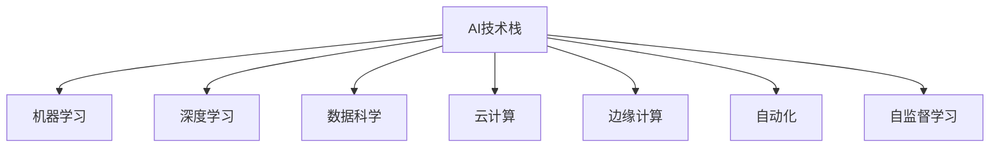

                 

# AI 时代的竞争：保持领先地位

## 1. 背景介绍

### 1.1 问题由来

随着人工智能(AI)技术的发展，企业和组织已经迎来了前所未有的变革机遇。AI技术的应用范围涵盖了自动驾驶、智能制造、医疗健康、金融服务等诸多领域，深刻改变了人类的生产生活方式。然而，这种变革并非一帆风顺，AI技术也带来了新的挑战和竞争，如何保持技术领先地位成为每一个企业都面临的重要课题。

AI技术的核心竞争优势在于其高效的数据处理能力和强大的算法模型，特别是深度学习、自然语言处理、计算机视觉等领域的突破，使得AI系统能够处理海量数据，生成高精度的预测和决策。然而，随着AI技术应用的广泛和深入，市场上出现了越来越多的参与者，竞争也随之变得异常激烈。在这种情况下，企业需要不断提升自身AI能力，以确保在激烈的市场竞争中占据优势地位。

### 1.2 问题核心关键点

在AI时代，保持领先地位的关键在于：

- 数据资源优势：能够获取并处理海量高质量数据是AI技术的核心竞争力之一。企业需要构建强大而完备的数据采集、存储和处理体系，保障数据的安全性和时效性。
- 算法模型创新：AI算法的迭代更新速度非常快，企业需要持续关注最新的研究进展，并快速将其应用到实际场景中，保持技术的前沿性。
- 技术集成能力：AI技术的应用往往是跨领域、跨行业的，企业需要将多种AI技术进行深度集成，形成综合性解决方案。
- 人才培养与团队建设：AI技术发展迅速，人才需求巨大，企业需要建立完善的培养机制，吸引并留住优秀人才。
- 行业应用深度：AI技术最终落地于具体行业，企业需要在特定应用场景中进行深度定制和优化，确保技术的效果和适用性。

### 1.3 问题研究意义

保持AI技术的领先地位，对于企业而言具有重要的战略意义：

- 提高竞争优势：AI技术的深度应用可以显著提升企业运营效率和产品竞争力，增强市场竞争力。
- 驱动创新发展：AI技术的应用可以推动传统产业的数字化转型，带来新的业务增长点和商业模式。
- 响应市场需求：随着消费者需求的多样化，AI技术能够提供个性化、精准化的服务，提升客户满意度和忠诚度。
- 应对外部环境变化：AI技术能够帮助企业更好地应对市场变化、经济波动和行业竞争，增强风险抵御能力。
- 促进企业可持续发展：AI技术的应用能够提升资源利用效率，减少浪费，推动绿色可持续发展。

## 2. 核心概念与联系

### 2.1 核心概念概述

为更好地理解如何保持AI技术的领先地位，本节将介绍几个密切相关的核心概念：

- AI技术栈：包括数据获取与处理、模型训练与优化、算法与架构设计、部署与运维等各个环节，形成完整的AI系统构建流程。
- 机器学习与深度学习：基于统计学原理构建的算法模型，能够自动从数据中提取特征并进行预测或决策。
- 数据科学与大数据技术：数据科学与大数据技术的结合，使得AI系统能够高效处理海量数据，挖掘数据背后的价值。
- 云计算与边缘计算：云计算提供强大的计算资源，边缘计算则提供实时数据处理能力，两者结合可以支持大范围、多样化的AI应用。
- 自动化与自监督学习：自动化技术能够自动优化AI系统，自监督学习则在不依赖标注数据的情况下训练高效模型。

这些核心概念之间的逻辑关系可以通过以下Mermaid流程图来展示：



这个流程图展示了大规模AI系统构建的核心组件及其之间的关系：

1. AI技术栈是构建AI系统的整体框架，包括各个环节的相互依赖与协同。
2. 机器学习和深度学习是AI技术的核心算法基础。
3. 数据科学与大数据技术为AI系统提供数据支持。
4. 云计算与边缘计算提供计算与存储资源，支持大规模AI应用的运行。
5. 自动化和自监督学习技术提高系统自适应能力和训练效率。

这些核心概念共同构成了AI技术系统的构建和运行基础，为企业保持技术领先地位提供了重要保障。

## 3. 核心算法原理 & 具体操作步骤

### 3.1 算法原理概述

保持AI技术的领先地位，核心在于算法模型的持续优化和应用创新。具体来说，企业需要：

- 构建高效的数据处理流程，快速获取和清洗数据。
- 选择合适的算法模型，并基于现有数据进行训练和调优。
- 应用最新的AI研究进展，更新模型和算法。
- 集成多种AI技术，形成综合解决方案。
- 实现AI技术的落地应用，并持续优化与升级。

### 3.2 算法步骤详解

保持AI技术领先地位的具体步骤包括：

1. **数据获取与处理**：
   - 建立数据采集体系，收集高质量数据。
   - 清洗和预处理数据，去除噪音和异常值。
   - 利用数据增强技术，扩充数据集规模和多样性。

2. **算法模型训练与优化**：
   - 选择适合的机器学习和深度学习算法。
   - 构建训练框架，设计损失函数和优化器。
   - 训练模型，调整超参数以提升模型性能。
   - 应用正则化技术，防止模型过拟合。
   - 使用迁移学习和微调技术，提高模型泛化能力。

3. **技术集成与深度应用**：
   - 将多种AI技术进行深度集成，形成综合性解决方案。
   - 开发AI应用，实现落地效果。
   - 持续监控应用效果，进行优化与迭代。
   - 扩展应用场景，推动业务创新。

4. **持续优化与升级**：
   - 跟踪最新的AI研究成果，快速应用到现有系统中。
   - 引入自动化技术，提高系统运维效率。
   - 利用自监督学习技术，增强模型自适应能力。
   - 定期更新和优化算法模型，提升性能和鲁棒性。

### 3.3 算法优缺点

保持AI技术领先地位的算法模型具有以下优点：

- 高效性：通过优化算法，提高模型处理数据的能力。
- 普适性：多种算法模型的深度集成，适应不同的应用场景。
- 可扩展性：支持大规模数据处理和分布式计算。
- 易用性：自动化工具和自监督学习方法，降低技术门槛。

但这些算法模型也存在一些局限：

- 依赖数据质量：数据质量对模型性能有重大影响，数据采集与清洗的复杂性增加了开发成本。
- 计算资源需求高：大规模模型的训练和推理需要高性能计算资源。
- 算法复杂度高：算法模型的优化和调参需要较高的专业水平。
- 应用难度大：将AI技术应用到实际业务中，需要整合多种技术和经验。
- 风险管理难：AI模型可能存在偏见或错误预测，影响决策。

### 3.4 算法应用领域

AI技术在多个领域的应用已经取得了显著成效，具体包括：

- **自动驾驶**：利用计算机视觉和深度学习技术，实现自动驾驶汽车。
- **智能制造**：通过AI优化生产流程，提高生产效率和质量。
- **医疗健康**：利用AI进行疾病诊断、基因分析等，提升医疗水平。
- **金融服务**：应用AI进行风险评估、欺诈检测、投资策略优化等。
- **零售电商**：利用AI进行个性化推荐、库存管理、客户行为分析等。
- **能源管理**：通过AI优化能源消耗和分配，实现可持续发展。

这些应用场景展示了AI技术在各行各业中发挥的巨大潜力，为企业提供了一系列技术创新的方向。

## 4. 数学模型和公式 & 详细讲解 & 举例说明

### 4.1 数学模型构建

为了更好地理解AI技术的应用，这里给出一些常见的数学模型及其构建方法。

### 4.2 公式推导过程

以下是几个典型AI算法的数学推导过程，以供参考：

1. **线性回归模型**：
   - 假设自变量为 $x_1, x_2, ..., x_n$，因变量为 $y$。
   - 线性回归模型为 $y = \theta_0 + \theta_1 x_1 + \theta_2 x_2 + ... + \theta_n x_n$。
   - 最小化均方误差 $J(\theta) = \frac{1}{2m} \sum_{i=1}^{m} (y^{(i)} - \theta_0 - \theta_1 x_1^{(i)} - \theta_2 x_2^{(i)} - ... - \theta_n x_n^{(i)})^2$。

2. **卷积神经网络(CNN)**：
   - CNN 的卷积层公式为 $f_\theta (x) = \sum_k \sum_l \theta_{k,l} * g_\theta (x; h_{k,l})$。
   - 池化层的公式为 $f_\theta (x) = \max_k g_\theta (x; h_k)$。
   - 全连接层的公式为 $f_\theta (x) = \sum_k \theta_k * g_\theta (x; h_k)$。

3. **深度学习中的BP算法**：
   - 前向传播公式为 $y = g_\theta (x; W)$。
   - 反向传播公式为 $\frac{\partial L}{\partial \theta} = \frac{\partial L}{\partial y} \frac{\partial y}{\partial \theta}$。

### 4.3 案例分析与讲解

这里以一个简单的图像分类问题为例，说明如何使用CNN进行图像分类。

假设我们的数据集包含两类图片，分别是猫和狗。

- **数据准备**：将每张图片转换为数字矩阵 $x_1, x_2, ..., x_n$，并将标签转化为 $y_1, y_2, ..., y_n$，其中 $y_i = 0$ 表示猫，$y_i = 1$ 表示狗。

- **模型构建**：
  - 定义一个包含两个卷积层和一个全连接层的CNN模型。
  - 第一层卷积核大小为 3x3，步幅为 1，填充方式为 'Same'。
  - 第二层卷积核大小为 3x3，步幅为 2，填充方式为 'Valid'。
  - 全连接层有 128 个神经元。

- **模型训练**：
  - 定义损失函数为交叉熵损失，优化器为 Adam。
  - 设置学习率为 0.001，训练 10 个epoch。
  - 在每个epoch结束后，打印训练损失和验证损失。

- **模型评估**：
  - 使用测试集进行模型评估，计算准确率、召回率等指标。

通过上述步骤，我们可以构建一个简单的CNN模型，并通过训练和评估，得到一个初步的图像分类器。

## 5. 项目实践：代码实例和详细解释说明

### 5.1 开发环境搭建

在进行AI项目实践前，我们需要准备好开发环境。以下是使用Python进行TensorFlow开发的环境配置流程：

1. 安装Anaconda：从官网下载并安装Anaconda，用于创建独立的Python环境。

2. 创建并激活虚拟环境：
```bash
conda create -n tensorflow-env python=3.8 
conda activate tensorflow-env
```

3. 安装TensorFlow：
```bash
pip install tensorflow
```

4. 安装各类工具包：
```bash
pip install numpy pandas scikit-learn matplotlib tqdm jupyter notebook ipython
```

完成上述步骤后，即可在`tensorflow-env`环境中开始AI项目实践。

### 5.2 源代码详细实现

这里以一个简单的图像分类问题为例，展示如何使用TensorFlow进行CNN模型的构建和训练。

首先，定义数据集处理函数：

```python
import tensorflow as tf
from tensorflow.keras.preprocessing.image import ImageDataGenerator

def load_data():
    train_generator = ImageDataGenerator(
        rescale=1./255,
        validation_split=0.2
    ).flow_from_directory(
        'path/to/data',
        target_size=(128, 128),
        batch_size=32,
        class_mode='binary'
    )
    return train_generator
```

然后，定义模型：

```python
model = tf.keras.Sequential([
    tf.keras.layers.Conv2D(32, (3, 3), activation='relu', input_shape=(128, 128, 3)),
    tf.keras.layers.MaxPooling2D((2, 2)),
    tf.keras.layers.Conv2D(64, (3, 3), activation='relu'),
    tf.keras.layers.MaxPooling2D((2, 2)),
    tf.keras.layers.Flatten(),
    tf.keras.layers.Dense(128, activation='relu'),
    tf.keras.layers.Dense(1, activation='sigmoid')
])
```

接着，定义训练函数：

```python
def train(model, train_generator):
    model.compile(optimizer='adam', loss='binary_crossentropy', metrics=['accuracy'])
    model.fit(train_generator, epochs=10, validation_data=val_generator)
    model.save('path/to/model.h5')
```

最后，启动训练流程：

```python
train_generator = load_data()
val_generator = load_data(split='validation')
train(model, train_generator)
```

以上就是使用TensorFlow进行CNN模型训练的完整代码实现。可以看到，TensorFlow提供了一整套高效的数据处理和模型训练机制，使得AI项目的开发和部署变得相对简单。

### 5.3 代码解读与分析

让我们再详细解读一下关键代码的实现细节：

**load_data函数**：
- 定义了ImageDataGenerator类，用于加载和处理图像数据。
- 设置了数据增强参数，如缩放、翻转等，以及验证集分割比例。
- 使用flow_from_directory方法从指定目录下读取数据，并生成批次化的数据集。

**model定义**：
- 构建了一个包含两个卷积层和一个全连接层的CNN模型。
- 卷积层使用32和64个过滤器，卷积核大小为3x3，激活函数为ReLU。
- 全连接层有128个神经元，使用sigmoid激活函数进行二分类预测。

**train函数**：
- 使用compile方法设置模型的优化器和损失函数。
- 使用fit方法训练模型，设置epoch数和验证集。
- 在每个epoch结束后，打印训练和验证的损失和准确率。
- 使用save方法将模型保存到指定路径。

**训练流程**：
- 加载训练和验证数据集。
- 调用train函数进行模型训练。

可以看出，TensorFlow提供了强大的工具和库支持，使得AI模型的构建和训练变得相对简单和高效。开发者可以将更多精力放在模型优化和应用场景的实现上，而不必过多关注底层技术细节。

## 6. 实际应用场景

### 6.1 智能制造

在智能制造领域，AI技术可以显著提升生产效率和产品质量。通过AI算法对生产流程进行优化，能够实现设备的自动化维护、故障预测和实时监控。例如，利用计算机视觉技术对生产设备进行图像识别，及时发现设备故障和异常情况，并自动发出维修指令，从而降低生产停机时间和维修成本。

### 6.2 金融风险管理

在金融领域，AI技术可以帮助银行和金融机构进行风险评估和管理。通过构建AI模型，对客户的信用记录、交易行为等进行分析，预测客户的违约概率，并进行风险预警和贷前评估。AI技术还可以帮助金融机构进行欺诈检测和反洗钱，提升金融系统的安全性。

### 6.3 个性化推荐

在电商和娱乐领域，AI技术可以实现个性化推荐。通过分析用户的行为数据和偏好，构建推荐模型，为用户推荐符合其兴趣的商品或内容。这不仅可以提高用户满意度，还能提升销售额和用户留存率。例如，Amazon和Netflix等平台都广泛应用了AI推荐技术。

### 6.4 未来应用展望

随着AI技术的不断进步，未来的应用场景将更加广泛和多样化。以下列举几个潜在的发展方向：

- **自动驾驶**：随着自动驾驶技术的成熟，AI系统将广泛应用于交通和物流领域，提升道路安全和运输效率。
- **智能医疗**：AI技术可以帮助医生进行疾病诊断、基因分析等，提升医疗水平，降低医疗成本。
- **智能家居**：通过AI技术，智能家居设备可以实现语音控制、场景识别等功能，提升用户的生活体验。
- **智能客服**：利用AI技术，智能客服系统可以24小时不间断提供服务，提升客户满意度和服务质量。
- **金融科技**：AI技术在金融领域的应用将更加深入，涵盖贷款审批、信用评分、风险管理等多个环节。

这些应用场景展示了AI技术的广阔前景，预示着未来的经济和社会发展将受益于AI技术的普及和应用。

## 7. 工具和资源推荐

### 7.1 学习资源推荐

为了帮助开发者系统掌握AI技术，这里推荐一些优质的学习资源：

1. **Coursera和edX**：提供在线课程，涵盖机器学习、深度学习、计算机视觉等多个领域的经典课程。
2. **Deep Learning Specialization by Andrew Ng**：由斯坦福大学Andrew Ng教授讲授的深度学习系列课程，详细讲解了深度学习的基础知识和应用案例。
3. **CS231n: Convolutional Neural Networks for Visual Recognition**：斯坦福大学计算机视觉课程，讲解计算机视觉算法和应用。
4. **Google AI Blog**：Google AI团队定期发布的最新研究进展和应用案例，涵盖深度学习、自然语言处理等多个方向。
5. **arXiv.org**：学术论文和预印本平台，可以获取最新的AI研究成果和技术进展。

### 7.2 开发工具推荐

高效的开发离不开优秀的工具支持。以下是几款用于AI开发的工具：

1. **TensorFlow**：由Google主导开发的深度学习框架，支持分布式计算和自动微分，适用于大规模模型训练和推理。
2. **PyTorch**：Facebook开源的深度学习框架，支持动态计算图和GPU加速，适用于研究和快速迭代。
3. **Scikit-Learn**：基于Python的机器学习库，包含多种经典机器学习算法和工具。
4. **Keras**：基于TensorFlow和Theano等框架的高层API，适合快速构建和训练深度学习模型。
5. **Jupyter Notebook**：交互式数据科学平台，支持Python、R等多种编程语言，便于开发者编写和分享代码。

### 7.3 相关论文推荐

AI技术的研究进展不断，以下是几篇奠基性的相关论文，推荐阅读：

1. **AlexNet: ImageNet Classification with Deep Convolutional Neural Networks**：ImageNet竞赛中 winning的深度学习模型，标志着深度学习在计算机视觉领域的应用。
2. **GoogleNet: Going Deeper with Convolutions**：Google提出的深度卷积神经网络模型，大幅提升了深度学习模型的性能和速度。
3. **ResNet: Deep Residual Learning for Image Recognition**：Microsoft提出的残差网络模型，解决了深度神经网络中的梯度消失问题，使得模型可以更深更大。
4. **Attention is All You Need**：Transformer模型的提出，标志着自然语言处理领域的一大突破，推动了预训练语言模型的发展。
5. **BERT: Pre-training of Deep Bidirectional Transformers for Language Understanding**：Google提出的BERT模型，基于自监督学习，实现了自然语言处理的SOTA效果。

这些论文代表了大规模AI技术的发展脉络，通过学习这些前沿成果，可以帮助研究者把握学科前进方向，激发更多的创新灵感。

## 8. 总结：未来发展趋势与挑战

### 8.1 研究成果总结

本文对保持AI技术领先地位的方法进行了全面系统的介绍。首先阐述了AI技术的重要性和企业保持技术领先地位的必要性。其次，从原理到实践，详细讲解了AI技术的应用流程和核心算法。最后，给出了AI技术在实际应用中的典型场景和未来发展方向。

通过本文的系统梳理，可以看到，AI技术的发展已经成为推动各行各业变革的重要力量，对企业保持竞争优势具有重要意义。未来，随着AI技术的不断进步和应用领域的不断扩展，企业需要持续关注AI技术的最新进展，不断优化和提升自身AI能力，才能在激烈的市场竞争中保持领先地位。

### 8.2 未来发展趋势

展望未来，AI技术的发展将呈现以下几个趋势：

1. **自动化与自监督学习**：自动化工具和自监督学习技术将不断提高AI系统的自适应能力和训练效率，降低技术门槛。
2. **多模态学习**：AI系统将实现视觉、语音、文本等多模态数据的深度融合，提升对现实世界的理解和建模能力。
3. **跨领域应用**：AI技术将在更多领域中得到应用，如自动驾驶、智能制造、医疗健康等，带来广泛的社会效益和经济价值。
4. **联邦学习**：联邦学习技术可以实现分布式计算，保护数据隐私，增强模型的鲁棒性和安全性。
5. **增强学习**：增强学习技术将使AI系统具备自主学习和决策能力，推动智能代理和自主系统的研究。
6. **可解释性与透明度**：AI系统的可解释性和透明度将不断提升，增强用户对系统的信任和接受度。

### 8.3 面临的挑战

尽管AI技术已经取得了显著进展，但在其发展的过程中仍然面临着诸多挑战：

1. **数据隐私和安全**：AI系统需要大量数据进行训练，数据隐私和安全问题日益凸显。如何保护用户隐私和数据安全，是AI技术应用中的重要课题。
2. **伦理和社会影响**：AI系统的决策过程和结果可能带来伦理和社会问题，如偏见、歧视等。如何确保AI系统的公平性和公正性，是亟待解决的问题。
3. **资源和成本**：大规模AI系统的构建和运行需要大量计算资源和成本，如何降低资源消耗和成本，是AI技术普及的关键。
4. **跨领域合作**：AI技术的应用往往涉及多个学科和领域，如何实现跨领域的协同合作，是推动AI技术发展的关键。
5. **技术标准和规范**：AI技术的应用需要统一的技术标准和规范，如何制定和实施这些标准，是行业发展中的重要课题。

### 8.4 研究展望

未来的研究需要在以下几个方面寻求新的突破：

1. **数据隐私保护**：开发隐私保护技术，如差分隐私、联邦学习等，确保数据安全。
2. **公平性与公正性**：构建公平和公正的AI系统，减少偏见和歧视，提升社会公信度。
3. **资源优化**：开发高效的算法和工具，降低AI系统的计算资源消耗，提升运行效率。
4. **跨领域协作**：推动跨领域的协同合作，形成多学科融合的AI技术体系。
5. **伦理与监管**：加强AI技术的伦理和监管研究，确保技术应用符合社会价值和法律规范。

这些研究方向将有助于推动AI技术的健康发展，保障其在各行业中的应用效果和公平性。未来，AI技术将成为推动社会进步和经济发展的重要力量，为人类带来更加智能和高效的生产生活方式。

## 9. 附录：常见问题与解答

**Q1：AI技术在应用中需要注意哪些问题？**

A: 在应用AI技术时，需要注意以下问题：

1. **数据质量**：确保数据的准确性和完整性，避免数据偏差对模型性能的影响。
2. **算法复杂性**：选择合适的算法模型，避免复杂模型带来的计算和存储负担。
3. **模型解释性**：确保模型的决策过程透明可解释，增强用户对系统的信任。
4. **隐私和安全**：保护用户隐私和数据安全，避免数据泄露和滥用。
5. **伦理和社会影响**：确保AI系统的决策过程符合伦理和社会规范，避免偏见和歧视。

**Q2：如何提升AI系统的鲁棒性？**

A: 提升AI系统的鲁棒性，可以从以下几个方面入手：

1. **数据多样性**：使用多样化的数据进行训练，增强模型的泛化能力。
2. **对抗训练**：引入对抗样本进行训练，增强模型对攻击的抵抗能力。
3. **正则化技术**：应用L2正则、Dropout等技术，防止模型过拟合。
4. **模型集成**：通过模型集成技术，结合多个模型的决策结果，提高系统的鲁棒性。
5. **自监督学习**：利用自监督学习技术，增强模型对未知数据的适应能力。

**Q3：AI技术在医疗领域的应用前景如何？**

A: AI技术在医疗领域具有广阔的应用前景：

1. **疾病诊断**：利用AI技术进行医学影像分析、病理切片识别等，提升疾病诊断的准确性和效率。
2. **基因分析**：AI技术可以对基因序列进行分析和预测，帮助发现潜在的疾病基因和治疗方法。
3. **健康管理**：通过分析患者的健康数据，AI技术可以提供个性化的健康建议和治疗方案。
4. **药物研发**：AI技术可以加速药物研发过程，筛选候选药物，预测药物效果和副作用。

总之，AI技术在医疗领域的应用将极大地提升医疗水平，改善患者体验，推动医疗行业的数字化转型。

**Q4：如何构建高效的AI系统？**

A: 构建高效的AI系统，需要考虑以下几个关键要素：

1. **数据采集与预处理**：确保数据的质量和多样性，进行数据增强和预处理。
2. **算法选择与优化**：选择合适的算法模型，进行高效的参数优化和调参。
3. **模型集成与部署**：将多种AI技术进行深度集成，实现高效部署和运行。
4. **性能监控与优化**：持续监控系统性能，进行优化和升级。
5. **跨领域协作**：推动跨领域的协同合作，形成多学科融合的AI技术体系。

通过综合考虑以上要素，可以构建高效、可靠的AI系统，推动各行业的数字化转型和创新发展。

---

作者：禅与计算机程序设计艺术 / Zen and the Art of Computer Programming

