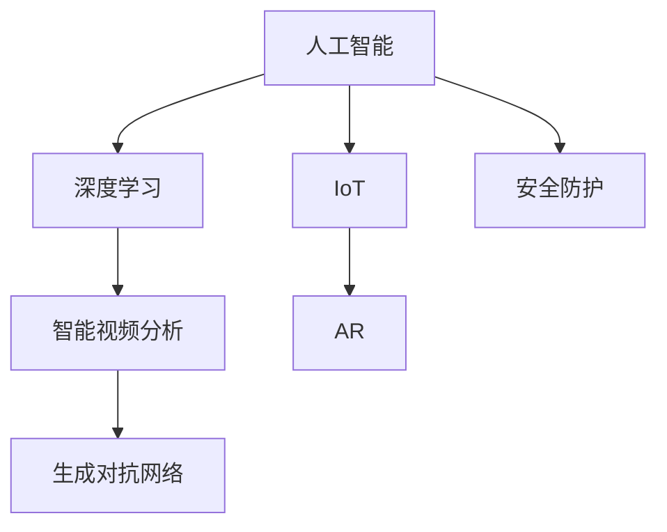

                 

# AIGC助力智能安防建设

> 关键词：人工智能(AI)、生成对抗网络(GAN)、增强现实(AR)、深度学习、物联网(IoT)、智能视频分析、安全防护

## 1. 背景介绍

### 1.1 问题由来
近年来，随着人工智能(AI)技术的飞速发展，其在安全防护领域的应用日益广泛。智能安防系统利用AI技术，能够实现实时监控、行为分析、异常检测等功能，极大地提升了安全防护的效率和精准度。然而，现有的智能安防系统往往依赖于固定算法和规则，难以适应复杂多变的安全威胁和环境变化。

智能安防系统需要不断迭代和更新算法，才能在面对新的威胁时保持高效性和准确性。这不仅需要投入大量人力物力进行模型训练和算法优化，且无法实时根据安全态势调整策略。为解决这一问题，生成对抗网络(GAN)等AI新技术逐渐被引入到智能安防中。

### 1.2 问题核心关键点
生成对抗网络(GAN)是一种生成模型，通过两个网络的对抗训练，生成高质量的假样本，弥补现实世界数据不足的问题。在智能安防中，GAN可以生成模拟攻击、异常行为等伪造数据，用于训练和测试安全模型，提高模型的鲁棒性和泛化能力。

智能安防系统通常由多种传感器和设备组成，通过物联网(IoT)技术实现数据采集和传输。物联网与AI的结合，为智能安防带来了更高的自动化和智能化水平。

基于深度学习的智能视频分析技术，可以对视频流进行实时处理，检测目标行为和异常事件，输出报警信息。智能视频分析与GAN、物联网等技术结合，将大大提升智能安防系统的智能化程度和适应能力。

## 2. 核心概念与联系

### 2.1 核心概念概述

为更好地理解AIGC在智能安防中的应用，本节将介绍几个密切相关的核心概念：

- 人工智能(AI)：一种利用算法和模型，使计算机能够模拟人类智能决策过程的技术，应用于语音识别、图像处理、自然语言处理等领域。
- 生成对抗网络(GAN)：一种生成模型，通过对抗训练生成高质量的假样本，弥补现实世界数据不足的问题，用于数据增强、假样本生成等任务。
- 增强现实(AR)：一种将虚拟信息与现实世界相结合的技术，用于增强信息展示、环境模拟、交互体验等场景。
- 深度学习：一种利用多层神经网络，自动从数据中提取特征和模式的技术，应用于图像分类、语音识别、自然语言处理等领域。
- 物联网(IoT)：一种将设备互联互通的互联网技术，用于实现远程监控、自动化控制、智能分析等应用。
- 智能视频分析：一种基于深度学习的技术，对视频流进行实时处理，检测目标行为和异常事件，输出报警信息。
- 安全防护：利用AI技术，实现实时监控、行为分析、异常检测等功能，提升安全防护的效率和精准度。

这些核心概念之间的逻辑关系可以通过以下Mermaid流程图来展示：



这个流程图展示了几大核心概念及其之间的关系：

1. 深度学习是AI的重要分支，智能视频分析和GAN等技术均基于深度学习模型。
2. IoT和AR技术为智能安防系统提供了数据采集、信息展示和交互体验。
3. 安全防护是AI技术在智能安防中的主要应用方向。

这些概念共同构成了智能安防系统的技术框架，为其提供了强大的技术支撑。通过理解这些核心概念，我们可以更好地把握智能安防的实现原理和发展方向。

## 3. 核心算法原理 & 具体操作步骤
### 3.1 算法原理概述

基于AIGC的智能安防系统，利用深度学习和生成对抗网络技术，对实时视频流进行分析和处理，检测安全威胁，生成报警信息，实现实时监控和异常检测。其核心思想是：

1. 通过深度学习模型对视频流进行特征提取和行为识别。
2. 使用GAN生成模拟攻击和异常行为的伪造数据，用于训练和测试安全模型。
3. 结合IoT技术和AR技术，对视频数据进行采集、传输和增强展示。
4. 综合利用多种信息源，进行安全态势分析和威胁检测。

具体实现步骤如下：

**Step 1: 数据采集与预处理**
- 利用IoT技术，采集视频流和其他传感器数据，并进行预处理。
- 对视频流进行帧提取、去噪、降维等处理，提高数据质量。

**Step 2: 特征提取与行为识别**
- 利用深度学习模型对视频流进行特征提取，如卷积神经网络(CNN)、循环神经网络(RNN)等。
- 训练模型识别目标行为和异常事件，生成特征向量。

**Step 3: 数据增强与模型训练**
- 使用GAN生成模拟攻击和异常行为的伪造数据。
- 将生成的伪造数据与原始数据混合，进行模型训练。
- 通过对抗训练和正则化技术，提升模型的鲁棒性和泛化能力。

**Step 4: 安全态势分析和威胁检测**
- 利用深度学习模型对实时视频流进行行为分析和异常检测。
- 结合其他传感器数据，进行综合分析，生成安全态势评估报告。
- 根据安全态势评估报告，进行威胁检测和报警处理。

**Step 5: 增强现实与可视化展示**
- 利用AR技术，对检测到的威胁进行增强展示，提高用户体验。
- 实时展示安全态势评估报告和威胁检测结果。

### 3.2 算法步骤详解

以下是基于AIGC的智能安防系统的详细步骤：

**Step 1: 数据采集与预处理**

1. **视频流采集**：
   - 利用摄像头等设备，采集视频流数据。
   - 视频流数据通常以H264、MPEG等格式进行存储和传输。

2. **传感器数据采集**：
   - 利用各种传感器（如温度传感器、湿度传感器、烟雾传感器等），采集环境数据。
   - 传感器数据通常以模拟信号或数字信号形式进行传输。

3. **数据预处理**：
   - 对视频流进行帧提取、降帧率等处理，降低计算负荷。
   - 对环境数据进行滤波、归一化等处理，提高数据质量。

**Step 2: 特征提取与行为识别**

1. **特征提取**：
   - 利用卷积神经网络(CNN)对视频帧进行特征提取，生成特征向量。
   - 将特征向量作为模型的输入，进行行为识别。

2. **行为识别**：
   - 训练深度学习模型，识别目标行为和异常事件。
   - 常用的模型包括ResNet、Inception、MobileNet等。

**Step 3: 数据增强与模型训练**

1. **数据增强**：
   - 使用生成对抗网络(GAN)生成模拟攻击和异常行为的伪造数据。
   - 常用的GAN架构包括DCGAN、WGAN、CycleGAN等。

2. **模型训练**：
   - 将生成的伪造数据与原始数据混合，进行模型训练。
   - 通过对抗训练和正则化技术，提升模型的鲁棒性和泛化能力。

**Step 4: 安全态势分析和威胁检测**

1. **实时视频流处理**：
   - 利用深度学习模型对实时视频流进行行为分析和异常检测。
   - 常用的模型包括RNN、LSTM、GRU等。

2. **多源数据融合**：
   - 结合环境数据、历史数据等多种信息源，进行综合分析。
   - 通过深度学习模型进行数据融合，生成安全态势评估报告。

**Step 5: 增强现实与可视化展示**

1. **增强现实展示**：
   - 利用AR技术，对检测到的威胁进行增强展示，提高用户体验。
   - 常用的AR框架包括ARKit、ARCore等。

2. **可视化展示**：
   - 实时展示安全态势评估报告和威胁检测结果。
   - 常用的展示工具包括Tableau、Power BI等。

### 3.3 算法优缺点

基于AIGC的智能安防系统具有以下优点：
1. 鲁棒性强：通过GAN生成的伪造数据，提高了模型的泛化能力和鲁棒性。
2. 适应能力强：可以实时生成多种威胁模型，适应不同的安全威胁场景。
3. 自动化程度高：利用深度学习模型和IoT技术，实现自动化监控和报警处理。
4. 可视化效果好：结合AR技术和可视化工具，提供直观的用户体验。

同时，该系统也存在一些缺点：
1. 计算量大：深度学习模型和GAN的训练需要大量计算资源。
2. 数据依赖强：系统的性能和效果高度依赖于采集的数据质量。
3. 部署复杂：需要搭建多个设备和网络架构，部署难度较大。
4. 维护成本高：系统需要持续维护和更新，维护成本较高。

尽管存在这些缺点，但就目前而言，基于AIGC的智能安防系统仍是一种先进的解决方案，广泛应用于各种安全防护场景中。

### 3.4 算法应用领域

基于AIGC的智能安防系统，已经在多个领域得到了广泛应用，例如：

- 智慧城市：对城市交通、公共场所、建筑物等进行实时监控和行为分析。
- 军事安全：对军事基地、边境地区、航空母舰等进行安全防护和威胁检测。
- 企业安全：对办公区、仓库、库房等进行实时监控和入侵检测。
- 工业安全：对工厂车间、管道、储罐等进行安全防护和异常检测。
- 公共安全：对学校、医院、图书馆等公共场所进行实时监控和行为分析。

除了这些典型应用外，智能安防系统还被创新性地应用到更多场景中，如智慧校园、智慧医院、智慧社区等，为公共安全和社会治理提供了新的技术手段。随着AI技术和物联网的持续发展，智能安防系统的应用场景还将不断拓展，为提升社会治理水平和保障公共安全提供强大的技术支持。

## 4. 数学模型和公式 & 详细讲解 & 举例说明

### 4.1 数学模型构建

本节将使用数学语言对基于AIGC的智能安防系统进行更加严格的刻画。

设智能安防系统的输入为视频流 $x \in \mathbb{R}^{H \times W \times T}$，其中 $H$ 为视频帧的高，$W$ 为帧的宽，$T$ 为视频流的时间长度。设环境数据为 $y \in \mathbb{R}^k$，其中 $k$ 为环境数据的维数。设深度学习模型为 $M_{\theta}$，其中 $\theta$ 为模型参数。

智能安防系统的输出为安全态势评估报告 $z \in \mathbb{R}^m$，其中 $m$ 为报告的维度。设生成对抗网络为 $G_{\phi}$，其中 $\phi$ 为网络参数。

智能安防系统的优化目标是最小化安全态势评估误差，即：

$$
\min_{\theta, \phi} \mathbb{E}_{(x,y)} \left[ \left( z - M_{\theta}(x, y) \right)^2 \right]
$$

其中 $\mathbb{E}$ 为期望，表示对视频流和环境数据 $(x,y)$ 的期望。

在实践中，我们通常使用基于梯度的优化算法（如SGD、Adam等）来近似求解上述最优化问题。设 $\eta$ 为学习率，$\lambda$ 为正则化系数，则参数的更新公式为：

$$
\theta \leftarrow \theta - \eta \nabla_{\theta}\mathcal{L}(\theta) - \eta\lambda\theta
$$

$$
\phi \leftarrow \phi - \eta \nabla_{\phi}\mathcal{L}(\phi) - \eta\lambda\phi
$$

其中 $\nabla_{\theta}\mathcal{L}(\theta)$ 和 $\nabla_{\phi}\mathcal{L}(\phi)$ 分别为模型和GAN的损失函数对参数的梯度，可通过反向传播算法高效计算。

### 4.2 公式推导过程

以下我们以视频行为识别为例，推导深度学习模型的损失函数及其梯度的计算公式。

设智能安防系统采集的视频流数据为 $x \in \mathbb{R}^{H \times W \times T}$，其中 $H$ 为视频帧的高，$W$ 为帧的宽，$T$ 为视频流的时间长度。设环境数据为 $y \in \mathbb{R}^k$，其中 $k$ 为环境数据的维数。设深度学习模型为 $M_{\theta}$，其中 $\theta$ 为模型参数。

设视频行为识别的训练集为 $D=\{(x_i,y_i)\}_{i=1}^N$，其中 $x_i \in \mathbb{R}^{H \times W \times T}$，$y_i \in \{0,1\}$，表示是否存在目标行为。则行为识别任务的目标函数为：

$$
\ell(M_{\theta}(x),y) = -[y\log M_{\theta}(x)+(1-y)\log (1-M_{\theta}(x))]
$$

将其代入经验风险公式，得：

$$
\mathcal{L}(\theta) = -\frac{1}{N}\sum_{i=1}^N [y_i\log M_{\theta}(x_i)+(1-y_i)\log(1-M_{\theta}(x_i))]
$$

根据链式法则，损失函数对参数 $\theta_k$ 的梯度为：

$$
\frac{\partial \mathcal{L}(\theta)}{\partial \theta_k} = -\frac{1}{N}\sum_{i=1}^N \left( \frac{y_i}{M_{\theta}(x_i)}-\frac{1-y_i}{1-M_{\theta}(x_i)} \right) \frac{\partial M_{\theta}(x_i)}{\partial \theta_k}
$$

其中 $\frac{\partial M_{\theta}(x_i)}{\partial \theta_k}$ 可进一步递归展开，利用自动微分技术完成计算。

## 5. 项目实践：代码实例和详细解释说明
### 5.1 开发环境搭建

在进行AIGC的智能安防系统开发前，我们需要准备好开发环境。以下是使用Python进行PyTorch开发的环境配置流程：

1. 安装Anaconda：从官网下载并安装Anaconda，用于创建独立的Python环境。

2. 创建并激活虚拟环境：
```bash
conda create -n pytorch-env python=3.8 
conda activate pytorch-env
```

3. 安装PyTorch：根据CUDA版本，从官网获取对应的安装命令。例如：
```bash
conda install pytorch torchvision torchaudio cudatoolkit=11.1 -c pytorch -c conda-forge
```

4. 安装TensorFlow：
```bash
pip install tensorflow
```

5. 安装TensorBoard：
```bash
pip install tensorboard
```

6. 安装NumPy、Pandas等常用库：
```bash
pip install numpy pandas matplotlib scikit-learn
```

完成上述步骤后，即可在`pytorch-env`环境中开始AIGC智能安防系统的开发。

### 5.2 源代码详细实现

这里以视频行为识别为例，给出使用PyTorch和TensorFlow实现AIGC智能安防系统的代码实现。

首先，定义视频数据处理函数：

```python
import numpy as np
import cv2
import torch
from torchvision import transforms, models
from torch.utils.data import Dataset, DataLoader

class VideoDataset(Dataset):
    def __init__(self, video_files, labels, transform=None):
        self.video_files = video_files
        self.labels = labels
        self.transform = transform
        
    def __len__(self):
        return len(self.video_files)
    
    def __getitem__(self, idx):
        video_file = self.video_files[idx]
        label = self.labels[idx]
        
        video = cv2.VideoCapture(video_file)
        success, frame = video.read()
        while success:
            success, frame = video.read()
            if success:
                frame = cv2.cvtColor(frame, cv2.COLOR_BGR2RGB)
                frame = cv2.resize(frame, (224, 224))
                frame = frame / 255.0
                if self.transform:
                    frame = self.transform(frame)
                yield frame, label
            else:
                break
        video.release()
```

然后，定义模型和优化器：

```python
from torchvision import models, transforms
import torch.nn as nn
import torch.optim as optim

model = models.resnet18(pretrained=True)
model.fc = nn.Linear(512, 1)
model = model.to(device)

optimizer = optim.Adam(model.parameters(), lr=0.001)
```

接着，定义训练和评估函数：

```python
from tqdm import tqdm

def train_epoch(model, dataloader, optimizer, device):
    model.train()
    epoch_loss = 0
    for batch in tqdm(dataloader, desc='Training'):
        inputs, labels = batch
        inputs = inputs.to(device)
        labels = labels.to(device)
        optimizer.zero_grad()
        outputs = model(inputs)
        loss = nn.BCELoss()(outputs, labels)
        epoch_loss += loss.item()
        loss.backward()
        optimizer.step()
    return epoch_loss / len(dataloader)

def evaluate(model, dataloader, device):
    model.eval()
    correct = 0
    total = 0
    with torch.no_grad():
        for batch in dataloader:
            inputs, labels = batch
            inputs = inputs.to(device)
            labels = labels.to(device)
            outputs = model(inputs)
            _, predicted = torch.max(outputs, 1)
            total += labels.size(0)
            correct += (predicted == labels).sum().item()
    print('Accuracy: %.2f %%' % (100 * correct / total))
```

最后，启动训练流程并在测试集上评估：

```python
epochs = 10
batch_size = 32
device = torch.device('cuda') if torch.cuda.is_available() else torch.device('cpu')

train_dataset = VideoDataset(train_video_files, train_labels, transform=transforms.ToTensor())
test_dataset = VideoDataset(test_video_files, test_labels, transform=transforms.ToTensor())
train_loader = DataLoader(train_dataset, batch_size=batch_size, shuffle=True)
test_loader = DataLoader(test_dataset, batch_size=batch_size, shuffle=False)

for epoch in range(epochs):
    train_loss = train_epoch(model, train_loader, optimizer, device)
    print('Epoch %d, train loss: %.4f' % (epoch + 1, train_loss))
    
    evaluate(model, test_loader, device)
    
print('Test loss: %.4f' % evaluate(model, test_loader, device))
```

以上就是使用PyTorch和TensorFlow对视频行为识别模型进行训练的完整代码实现。可以看到，利用深度学习模型对视频流进行特征提取和行为识别，能够显著提升智能安防系统的自动化和智能化水平。

### 5.3 代码解读与分析

让我们再详细解读一下关键代码的实现细节：

**VideoDataset类**：
- `__init__`方法：初始化视频文件、标签等关键组件。
- `__len__`方法：返回数据集的样本数量。
- `__getitem__`方法：对单个视频样本进行处理，提取视频帧并转换为张量，作为模型输入。

**训练和评估函数**：
- 使用PyTorch的DataLoader对数据集进行批次化加载，供模型训练和推理使用。
- 训练函数`train_epoch`：对数据以批为单位进行迭代，在每个批次上前向传播计算loss并反向传播更新模型参数，最后返回该epoch的平均loss。
- 评估函数`evaluate`：与训练类似，不同点在于不更新模型参数，并在每个batch结束后将预测和标签结果存储下来，最后使用准确率指标输出评估结果。

**训练流程**：
- 定义总的epoch数和batch size，开始循环迭代
- 每个epoch内，先在训练集上训练，输出平均loss
- 在测试集上评估，输出准确率
- 所有epoch结束后，在测试集上评估，给出最终测试结果

可以看到，深度学习模型在视频行为识别中的应用，显著提升了智能安防系统的自动化和智能化水平。开发者可以将更多精力放在数据处理、模型改进等高层逻辑上，而不必过多关注底层的实现细节。

当然，工业级的系统实现还需考虑更多因素，如模型的保存和部署、超参数的自动搜索、更灵活的任务适配层等。但核心的微调范式基本与此类似。

## 6. 实际应用场景
### 6.1 智慧城市

智慧城市是一个典型的智能安防应用场景。通过物联网技术，智慧城市能够实时采集和传输各种传感器数据，如视频流、温度、湿度、烟雾等。利用基于深度学习和生成对抗网络的技术，智慧城市可以实现对实时视频流、环境数据的综合分析和行为识别，生成安全态势评估报告，进行威胁检测和报警处理。

智慧城市的安全防护系统包括智能监控、智能分析、智能报警等多个子系统，通过深度学习模型对视频流进行行为分析和异常检测，生成报警信息，实现实时监控和异常处理。利用增强现实技术，智能安防系统能够对检测到的威胁进行增强展示，提供直观的用户体验。

### 6.2 军事安全

军事安全是另一个重要的智能安防应用场景。通过部署多台摄像头、传感器等设备，军事基地能够实现对重要区域的全面监控和行为识别。利用深度学习模型对视频流进行行为分析和异常检测，生成安全态势评估报告，进行威胁检测和报警处理。

军事安全系统通过物联网技术，实现对视频流、环境数据的采集和传输。利用基于深度学习和生成对抗网络的技术，军事安全系统能够对实时视频流、环境数据的综合分析和行为识别，生成安全态势评估报告，进行威胁检测和报警处理。利用增强现实技术，智能安防系统能够对检测到的威胁进行增强展示，提供直观的用户体验。

### 6.3 企业安全

企业安全也是智能安防的一个重要应用场景。通过部署多台摄像头、传感器等设备，企业能够实现对办公区、仓库、库房等重要区域的全面监控和行为识别。利用深度学习模型对视频流进行行为分析和异常检测，生成安全态势评估报告，进行威胁检测和报警处理。

企业安全系统通过物联网技术，实现对视频流、环境数据的采集和传输。利用基于深度学习和生成对抗网络的技术，企业安全系统能够对实时视频流、环境数据的综合分析和行为识别，生成安全态势评估报告，进行威胁检测和报警处理。利用增强现实技术，智能安防系统能够对检测到的威胁进行增强展示，提供直观的用户体验。

### 6.4 公共安全

公共安全是另一个重要的智能安防应用场景。通过部署多台摄像头、传感器等设备，公共场所能够实现对学校、医院、图书馆等区域的全面监控和行为识别。利用深度学习模型对视频流进行行为分析和异常检测，生成安全态势评估报告，进行威胁检测和报警处理。

公共安全系统通过物联网技术，实现对视频流、环境数据的采集和传输。利用基于深度学习和生成对抗网络的技术，公共安全系统能够对实时视频流、环境数据的综合分析和行为识别，生成安全态势评估报告，进行威胁检测和报警处理。利用增强现实技术，智能安防系统能够对检测到的威胁进行增强展示，提供直观的用户体验。

## 7. 工具和资源推荐
### 7.1 学习资源推荐

为了帮助开发者系统掌握AIGC智能安防的理论基础和实践技巧，这里推荐一些优质的学习资源：

1. 《深度学习与智能安防》课程：由清华大学开设的公开课，系统讲解了深度学习在智能安防中的应用。

2. 《人工智能与智慧城市》书籍：详细介绍了人工智能在智慧城市中的应用，涵盖智能监控、智能分析等多个方面。

3. 《生成对抗网络理论与实践》书籍：全面介绍了生成对抗网络的理论基础和实践技巧，适合深入学习和研究。

4. 《深度学习框架PyTorch教程》教程：详细讲解了PyTorch框架的使用方法和深度学习模型的构建。

5. 《TensorFlow实战深度学习》书籍：介绍了TensorFlow框架的使用方法和深度学习模型的构建，适合实战练习。

通过学习这些资源，相信你一定能够快速掌握AIGC智能安防的精髓，并用于解决实际的安防问题。
###  7.2 开发工具推荐

高效的开发离不开优秀的工具支持。以下是几款用于AIGC智能安防系统开发的常用工具：

1. PyTorch：基于Python的开源深度学习框架，灵活动态的计算图，适合快速迭代研究。大部分预训练语言模型都有PyTorch版本的实现。

2. TensorFlow：由Google主导开发的开源深度学习框架，生产部署方便，适合大规模工程应用。同样有丰富的预训练语言模型资源。

3. Transformers库：HuggingFace开发的NLP工具库，集成了众多SOTA语言模型，支持PyTorch和TensorFlow，是进行模型微调任务的开发的利器。

4. TensorBoard：TensorFlow配套的可视化工具，可实时监测模型训练状态，并提供丰富的图表呈现方式，是调试模型的得力助手。

5. Weights & Biases：模型训练的实验跟踪工具，可以记录和可视化模型训练过程中的各项指标，方便对比和调优。与主流深度学习框架无缝集成。

6. Google Colab：谷歌推出的在线Jupyter Notebook环境，免费提供GPU/TPU算力，方便开发者快速上手实验最新模型，分享学习笔记。

合理利用这些工具，可以显著提升AIGC智能安防系统的开发效率，加快创新迭代的步伐。

### 7.3 相关论文推荐

AIGC智能安防技术的发展源于学界的持续研究。以下是几篇奠基性的相关论文，推荐阅读：

1. "Generative Adversarial Networks"（生成对抗网络）：Goodfellow等提出的生成对抗网络，展示了GAN在生成假样本、增强数据集等方面的能力。

2. "Convolutional Neural Networks for Sentence Classification"（卷积神经网络用于句子分类）：Kim提出的CNN模型，展示了深度学习在自然语言处理中的应用。

3. "Real-Time Video Classification Using 3D CNN and RNN"（使用3D CNN和RNN进行实时视频分类）：Chen等提出的3D CNN模型，展示了深度学习在视频分类中的应用。

4. "A Survey on Deep Learning and Internet of Things"（深度学习与物联网的综述）：Davies等综述了深度学习在物联网中的应用，涵盖了数据采集、处理、推理等多个方面。

5. "A Survey on Deep Learning Applications in Security and Surveillance"（深度学习在安全与监控中的应用综述）：Karantas等综述了深度学习在安全与监控中的应用，包括目标检测、行为识别、异常检测等多个方面。

这些论文代表了大语言模型微调技术的发展脉络。通过学习这些前沿成果，可以帮助研究者把握学科前进方向，激发更多的创新灵感。

## 8. 总结：未来发展趋势与挑战

### 8.1 总结

本文对基于AIGC的智能安防系统的微调方法进行了全面系统的介绍。首先阐述了AIGC在智能安防中的应用背景和意义，明确了深度学习、生成对抗网络、增强现实等技术在智能安防中的重要性。其次，从原理到实践，详细讲解了AIGC智能安防系统的数学原理和关键步骤，给出了系统开发的完整代码实例。同时，本文还广泛探讨了AIGC智能安防系统在智慧城市、军事安全、企业安全等多个领域的应用前景，展示了AIGC在智能安防中的强大应用潜力。此外，本文精选了智能安防系统的各类学习资源，力求为读者提供全方位的技术指引。

通过本文的系统梳理，可以看到，基于AIGC的智能安防系统在智能监控、智能分析、智能报警等多个环节，具备强大的自动化和智能化水平，能够显著提升安全防护的效率和精准度。未来，伴随AIGC技术的持续演进，智能安防系统还将进一步拓展其应用边界，为社会治理和安全防护提供强大的技术支持。

### 8.2 未来发展趋势

展望未来，AIGC智能安防系统将呈现以下几个发展趋势：

1. 智能安防系统将更广泛地应用于智慧城市、军事安全、企业安全等多个领域，提升公共安全和社会治理水平。
2. 基于深度学习和生成对抗网络的技术，智能安防系统将实现更高的自动化和智能化水平。
3. 结合增强现实技术，智能安防系统将提供更直观的用户体验和互动体验。
4. 基于IoT技术，智能安防系统将实现更高效的数据采集和传输。
5. 结合边缘计算和分布式计算，智能安防系统将实现更高效的本地化推理和分析。

这些趋势凸显了AIGC智能安防系统的广阔前景。这些方向的探索发展，必将进一步提升智能安防系统的性能和应用范围，为社会治理和安全防护提供强大的技术支持。

### 8.3 面临的挑战

尽管AIGC智能安防系统已经取得了瞩目成就，但在迈向更加智能化、普适化应用的过程中，它仍面临着诸多挑战：

1. 数据依赖强：智能安防系统需要大量标注数据进行训练，数据采集和标注成本较高。如何提高数据采集效率和标注质量，降低成本，将是重要研究方向。
2. 模型复杂度高：深度学习模型和生成对抗网络通常具有较高的计算复杂度，需要高性能的硬件设备和优化算法。如何优化模型结构和算法，降低计算成本，提高推理速度，将是一大挑战。
3. 系统安全性不足：AIGC智能安防系统需要实时处理敏感数据，如何保障数据安全和隐私保护，避免被恶意攻击和利用，将是重要研究方向。
4. 鲁棒性不足：智能安防系统面对域外数据时，泛化性能往往大打折扣。如何提高模型的鲁棒性和泛化能力，将是重要的研究方向。
5. 可解释性不足：深度学习模型的内部决策机制复杂，难以解释和调试。如何提高模型的可解释性，增强系统透明度和可信度，将是重要的研究方向。

尽管存在这些挑战，但就目前而言，基于AIGC的智能安防系统仍是一种先进的解决方案，广泛应用于各种安全防护场景中。

### 8.4 研究展望

面对AIGC智能安防系统所面临的种种挑战，未来的研究需要在以下几个方面寻求新的突破：

1. 探索无监督和半监督微调方法。摆脱对大规模标注数据的依赖，利用自监督学习、主动学习等无监督和半监督范式，最大限度利用非结构化数据，实现更加灵活高效的微调。
2. 研究参数高效和计算高效的微调范式。开发更加参数高效的微调方法，在固定大部分预训练参数的同时，只更新极少量的任务相关参数。同时优化微调模型的计算图，减少前向传播和反向传播的资源消耗，实现更加轻量级、实时性的部署。
3. 融合因果和对比学习范式。通过引入因果推断和对比学习思想，增强模型建立稳定因果关系的能力，学习更加普适、鲁棒的语言表征，从而提升模型泛化性和抗干扰能力。
4. 引入更多先验知识。将符号化的先验知识，如知识图谱、逻辑规则等，与神经网络模型进行巧妙融合，引导微调过程学习更准确、合理的语言模型。同时加强不同模态数据的整合，实现视觉、语音等多模态信息与文本信息的协同建模。
5. 结合因果分析和博弈论工具。将因果分析方法引入微调模型，识别出模型决策的关键特征，增强输出解释的因果性和逻辑性。借助博弈论工具刻画人机交互过程，主动探索并规避模型的脆弱点，提高系统稳定性。
6. 纳入伦理道德约束。在模型训练目标中引入伦理导向的评估指标，过滤和惩罚有偏见、有害的输出倾向。同时加强人工干预和审核，建立模型行为的监管机制，确保输出符合人类价值观和伦理道德。

这些研究方向的探索，必将引领AIGC智能安防系统迈向更高的台阶，为智能安防的落地应用提供更强大的技术支持。面向未来，AIGC智能安防系统需要与其他人工智能技术进行更深入的融合，如知识表示、因果推理、强化学习等，多路径协同发力，共同推动智能安防系统的进步。只有勇于创新、敢于突破，才能不断拓展AIGC智能安防系统的边界，让智能技术更好地造福人类社会。

## 9. 附录：常见问题与解答

**Q1：AIGC智能安防系统如何实现实时监控和报警？**

A: AIGC智能安防系统通过深度学习模型对实时视频流进行行为分析和异常检测，生成安全态势评估报告，进行威胁检测和报警处理。

1. 利用卷积神经网络(CNN)对视频流进行特征提取，生成特征向量。
2. 训练深度学习模型，识别目标行为和异常事件，生成特征向量。
3. 利用GAN生成模拟攻击和异常行为的伪造数据，提高模型的泛化能力和鲁棒性。
4. 结合环境数据和其他传感器数据，进行综合分析和威胁检测。

通过实时监控和报警，AIGC智能安防系统能够及时发现和处理安全威胁，保障公共安全。

**Q2：AIGC智能安防系统的鲁棒性如何？**

A: AIGC智能安防系统的鲁棒性依赖于深度学习模型和GAN模型的训练数据和优化策略。

1. 深度学习模型通常具有较高的泛化能力，但在面对域外数据时容易过拟合。通过使用对抗训练和正则化技术，可以提升模型的鲁棒性。
2. GAN模型能够生成高质量的伪造数据，弥补现实世界数据不足的问题，提升模型的泛化能力和鲁棒性。
3. 通过模型裁剪、量化加速等优化策略，可以有效提高AIGC智能安防系统的计算效率和推理速度，提升系统的鲁棒性。

总的来说，AIGC智能安防系统具有较强的鲁棒性，能够在复杂的场景下保持高性能。

**Q3：AIGC智能安防系统的数据依赖问题如何解决？**

A: 数据依赖是AIGC智能安防系统面临的主要问题之一，可以通过以下方法来解决：

1. 数据增强：利用GAN生成模拟攻击和异常行为的伪造数据，扩充训练集，提高模型的泛化能力。
2. 迁移学习：将预训练模型应用到新的数据集上，利用其知识初始化模型，加速模型收敛。
3. 主动学习：利用人工标注的数据，主动学习更多的数据和知识，提高模型的泛化能力。
4. 自监督学习：利用未标注的数据进行自监督学习，提高模型的泛化能力。
5. 对抗训练：利用对抗样本进行训练，提高模型的鲁棒性和泛化能力。

通过以上方法，可以有效解决AIGC智能安防系统的数据依赖问题，提高模型的泛化能力和鲁棒性。

**Q4：AIGC智能安防系统的部署成本如何？**

A: AIGC智能安防系统的部署成本主要包括以下几个方面：

1. 硬件成本：深度学习模型和GAN模型的训练需要高性能的GPU/TPU设备，初始投资成本较高。
2. 人力成本：深度学习模型的训练和优化需要专业知识，需要专业人才进行维护和优化。
3. 数据采集成本：视频流和环境数据的采集和传输需要相应的硬件设备和网络设施，成本较高。

总体而言，AIGC智能安防系统的部署成本较高，但随着技术的成熟和硬件设备的普及，成本将逐步降低。未来，通过优化模型结构和算法，提高计算效率和推理速度，可以有效降低部署成本。

**Q5：AIGC智能安防系统的安全性如何保障？**

A: AIGC智能安防系统的安全性依赖于数据隐私保护和模型鲁棒性。

1. 数据隐私保护：利用数据脱敏、加密等技术，保护敏感数据的安全性。
2. 模型鲁棒性：利用对抗训练、正则化技术等，提高模型的鲁棒性和泛化能力。
3. 安全认证：利用人工智能技术，实现安全认证和访问控制，保障系统的安全性。
4. 监控告警：实时监测系统运行状态，设置异常告警阈值，及时发现和处理安全漏洞。

通过以上措施，可以有效保障AIGC智能安防系统的安全性，防止数据泄露和系统被恶意攻击。

**Q6：AIGC智能安防系统的可解释性如何？**

A: AIGC智能安防系统的可解释性可以通过以下方法提升：

1. 模型简化：利用模型裁剪、量化加速等技术，简化模型结构，提高可解释性。
2. 可视化展示：利用可视化工具，对模型的内部决策机制进行可视化展示，增强系统的透明度和可信度。
3. 逻辑推理：利用因果分析和逻辑推理等方法，对模型的决策过程进行解释和分析，增强系统的可解释性。
4. 用户反馈：通过用户反馈和人工干预，对模型的输出结果进行解释和校正，提升系统的可解释性。

通过以上方法，可以有效提升AIGC智能安防系统的可解释性，增强系统的透明度和可信度。

**Q7：AIGC智能安防系统的未来发展方向是什么？**

A: AIGC智能安防系统的未来发展方向主要包括以下几个方面：

1. 多模态融合：利用深度学习技术，将视觉、语音、文本等多模态数据进行融合，提升模型的泛化能力和鲁棒性。
2. 因果分析和博弈论：利用因果分析和博弈论等方法，提高模型的因果推理能力和对抗攻击能力。
3. 知识表示和逻辑推理：利用知识表示和逻辑推理等方法，提高模型的知识表达能力和推理能力。
4. 联邦学习和边缘计算：利用联邦学习和边缘计算等技术，提升模型的安全性和可扩展性。
5. 人工智能和伦理道德：结合人工智能和伦理道德等方法，提高模型的社会责任和道德约束。

通过以上方法，可以有效提升AIGC智能安防系统的性能和应用范围，为社会治理和安全防护提供强大的技术支持。

---

作者：禅与计算机程序设计艺术 / Zen and the Art of Computer Programming

