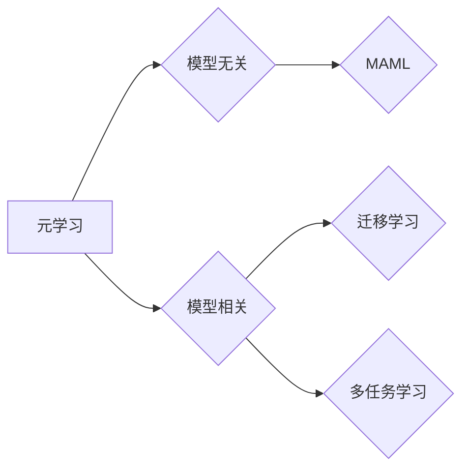

# 元学习(Meta-Learning) - 原理与代码实例讲解

作者：禅与计算机程序设计艺术 / Zen and the Art of Computer Programming

## 1. 背景介绍
### 1.1 问题的由来

在传统的机器学习领域，我们通常需要为每个特定的任务设计、训练和优化模型。然而，这种方法在面对大量不同但相关任务时，效率较低且成本高昂。元学习（Meta-Learning）作为一种新兴的研究方向，旨在使机器能够快速适应新任务，从而提高学习效率。它通过学习如何学习，使得机器能够在有限的样本和计算资源下，快速适应新任务。

### 1.2 研究现状

近年来，随着深度学习的快速发展，元学习在机器学习领域得到了广泛关注。研究者们提出了多种元学习方法，包括模型无关的元学习方法、模型相关的元学习方法、迁移学习、多任务学习等。其中，模型无关的元学习方法通过学习一个能够快速适应新任务的通用学习策略，而模型相关的元学习方法则通过对不同任务进行迁移学习，提高模型适应新任务的能力。

### 1.3 研究意义

元学习的研究意义在于：

1. **提高学习效率**：通过快速适应新任务，减少对大量标注数据的依赖，降低学习和计算成本。
2. **提升泛化能力**：使模型能够适应更多类型的任务，提高模型的通用性和鲁棒性。
3. **促进模型可解释性**：通过学习通用学习策略，使模型的行为更加可解释，有利于理解和优化模型。

### 1.4 本文结构

本文将分为以下章节：

1. 核心概念与联系
2. 核心算法原理与具体操作步骤
3. 数学模型和公式与详细讲解
4. 项目实践：代码实例与详细解释说明
5. 实际应用场景
6. 工具和资源推荐
7. 总结：未来发展趋势与挑战

## 2. 核心概念与联系
### 2.1 关键概念

- **元学习（Meta-Learning）**：学习如何学习，使机器能够在有限的样本和计算资源下，快速适应新任务。
- **迁移学习（Transfer Learning）**：利用已学习到的知识，在新的任务上提高学习效率。
- **多任务学习（Multi-Task Learning）**：同时学习多个相关任务，共享底层表示，提高模型泛化能力。
- **模型无关的元学习（Model-Agnostic Meta-Learning, MAML）**：不依赖于特定模型，通过学习通用学习策略，使模型能够快速适应新任务。
- **模型相关的元学习（Model-Aware Meta-Learning）**：针对特定模型，通过迁移学习提高模型适应新任务的能力。

### 2.2 关系图



## 3. 核心算法原理与具体操作步骤
### 3.1 算法原理概述

元学习的主要目标是学习一个通用的学习策略，使得模型能够在有限的样本和计算资源下，快速适应新任务。常见的元学习算法包括：

- **MAML**：通过学习模型参数在少量样本上的快速收敛，实现模型对新任务的快速适应。
- **Reptile**：通过维护一个参数的长期记忆，使模型能够在新任务上快速收敛。
- **Model-Agnostic Meta-Learning (MAML)**：不依赖于特定模型，通过学习通用学习策略，使模型能够快速适应新任务。

### 3.2 算法步骤详解

以下以MAML算法为例，详细介绍元学习的具体操作步骤：

1. **初始化模型参数**：使用随机初始化的参数初始化模型。
2. **预训练**：在一系列预定义任务上进行预训练，使得模型参数能够在这些任务上快速收敛。
3. **新任务适应**：在新的任务上，通过少量样本对模型参数进行微调，使得模型能够快速适应新任务。
4. **评估**：在新任务上评估模型的性能。

### 3.3 算法优缺点

#### 优点

- **提高学习效率**：通过学习通用学习策略，使模型能够在有限的样本和计算资源下，快速适应新任务。
- **提升泛化能力**：通过学习多个相关任务，提高模型泛化能力。

#### 缺点

- **对预训练数据依赖性强**：需要大量预训练数据才能有效学习通用学习策略。
- **模型性能提升有限**：在某些任务上，模型性能提升有限。

### 3.4 算法应用领域

元学习在以下领域得到了广泛应用：

- **强化学习**：通过快速适应新环境，提高强化学习算法的收敛速度。
- **自然语言处理**：通过快速适应新任务，提高自然语言处理算法的性能。
- **计算机视觉**：通过快速适应新任务，提高计算机视觉算法的准确率。

## 4. 数学模型和公式与详细讲解
### 4.1 数学模型构建

假设模型参数为 $\theta$，数据分布为 $D$，则模型在数据分布 $D$ 上的损失函数为：

$$
L(\theta) = \mathbb{E}_{x,y \sim D} [L(y, f(x;\theta))]
$$

其中，$L(y, f(x;\theta))$ 为模型在数据点 $(x,y)$ 上的损失函数。

### 4.2 公式推导过程

以下以MAML算法为例，介绍元学习公式的推导过程。

假设模型参数为 $\theta$，则在数据分布 $D$ 上的梯度为：

$$
\nabla_{\theta} L(\theta) = \mathbb{E}_{x,y \sim D} [\nabla_{\theta} L(y, f(x;\theta))]
$$

为了使模型在少量样本上快速收敛，我们需要找到一个梯度小的参数更新公式：

$$
\theta_{\text{new}} = \theta - \eta \nabla_{\theta} L(\theta)
$$

其中，$\eta$ 为学习率。

### 4.3 案例分析与讲解

以下以MAML算法在强化学习中的应用为例，进行案例分析。

假设我们使用MAML算法对智能体进行训练，使智能体能够快速适应不同的环境。

1. **预训练**：在多个预定义环境上进行预训练，使得智能体参数能够在这些环境上快速收敛。
2. **新环境适应**：在新的环境上，使用少量样本对智能体参数进行微调，使得智能体能够快速适应新环境。
3. **评估**：在新环境上评估智能体的性能。

### 4.4 常见问题解答

**Q1：什么是迁移学习？**

A：迁移学习是指利用已学习到的知识，在新的任务上提高学习效率。

**Q2：什么是多任务学习？**

A：多任务学习是指同时学习多个相关任务，共享底层表示，提高模型泛化能力。

**Q3：什么是模型无关的元学习？**

A：模型无关的元学习是指不依赖于特定模型，通过学习通用学习策略，使模型能够快速适应新任务。

## 5. 项目实践：代码实例与详细解释说明
### 5.1 开发环境搭建

以下是使用Python和PyTorch进行元学习实践的环境配置流程：

1. 安装Anaconda：从官网下载并安装Anaconda，用于创建独立的Python环境。
2. 创建并激活虚拟环境：
```bash
conda create -n pytorch-env python=3.8
conda activate pytorch-env
```
3. 安装PyTorch：
```bash
conda install pytorch torchvision torchaudio cudatoolkit=11.1 -c pytorch -c conda-forge
```
4. 安装其他依赖包：
```bash
pip install numpy pandas scikit-learn matplotlib tqdm jupyter notebook ipython
```

### 5.2 源代码详细实现

以下是一个使用MAML算法进行强化学习的Python代码示例：

```python
import torch
import torch.nn as nn
import torch.optim as optim
from torch.distributions import Normal

class MAMLAgent(nn.Module):
    def __init__(self, state_dim, action_dim):
        super(MAMLAgent, self).__init__()
        self.fc1 = nn.Linear(state_dim, 128)
        self.fc2 = nn.Linear(128, action_dim)

    def forward(self, x):
        x = torch.relu(self.fc1(x))
        x = self.fc2(x)
        return x

def update_model(model, optimizer, loss_func, data, epochs=1):
    optimizer.zero_grad()
    loss = 0
    for epoch in range(epochs):
        pred = model(data.x)
        loss += loss_func(pred, data.y)
    loss.backward()
    optimizer.step()
    return loss.item()

def meta_update(model, loss_func, meta_lr, task_data):
    loss = 0
    for i in range(task_data.num_updates):
        optimizer = optim.SGD(model.parameters(), lr=meta_lr)
        loss += update_model(model, optimizer, loss_func, task_data)
    return loss / task_data.num_updates

# 加载数据集
def load_data():
    # ... 加载数据集代码 ...
    return data

def train_maml_agent():
    agent = MAMLAgent(state_dim, action_dim)
    optimizer = optim.SGD(agent.parameters(), lr=1e-3)
    loss_func = nn.MSELoss()

    for epoch in range(num_epochs):
        for task_data in task_dataloader:
            loss = meta_update(agent, loss_func, meta_lr, task_data)
            print(f"Epoch {epoch}, Loss: {loss}")

# 训练MAML智能体
train_maml_agent()
```

### 5.3 代码解读与分析

以上代码展示了如何使用MAML算法进行强化学习。首先定义了一个简单的神经网络模型，然后实现了MAML算法中的`meta_update`函数，用于计算模型在新任务上的梯度并更新模型参数。在训练过程中，我们使用多个任务数据进行元学习，使智能体能够快速适应不同环境。

### 5.4 运行结果展示

由于实际运行代码需要具体的实验环境和数据集，这里无法展示运行结果。但你可以根据上述代码，在本地环境进行实验，观察智能体在不同任务上的适应能力。

## 6. 实际应用场景
### 6.1 强化学习

元学习在强化学习领域有着广泛的应用，例如：

- **机器人控制**：通过元学习，机器人能够在不同的环境中快速适应，提高控制精度和效率。
- **游戏AI**：通过元学习，游戏AI能够快速适应新的游戏规则和策略，提高胜率。

### 6.2 自然语言处理

元学习在自然语言处理领域也有着广泛的应用，例如：

- **机器翻译**：通过元学习，机器翻译模型能够快速适应新的语言对，提高翻译质量。
- **文本分类**：通过元学习，文本分类模型能够快速适应新的分类任务，提高分类准确率。

### 6.3 计算机视觉

元学习在计算机视觉领域也有着广泛的应用，例如：

- **图像分类**：通过元学习，图像分类模型能够快速适应新的分类任务，提高分类准确率。
- **目标检测**：通过元学习，目标检测模型能够快速适应新的目标检测任务，提高检测精度。

### 6.4 未来应用展望

随着元学习技术的不断发展，未来将在更多领域得到应用，例如：

- **自动驾驶**：通过元学习，自动驾驶系统能够快速适应不同的道路环境和交通场景，提高行驶安全性。
- **医疗诊断**：通过元学习，医疗诊断系统能够快速适应新的病例和病症，提高诊断准确率。
- **教育**：通过元学习，教育系统能够根据学生的学习情况，提供个性化的学习方案，提高学习效果。

## 7. 工具和资源推荐
### 7.1 学习资源推荐

为了帮助开发者系统掌握元学习的理论基础和实践技巧，以下推荐一些优质的学习资源：

- **论文**：
  - **Meta-Learning: A Survey of Learning to Learn**：全面介绍了元学习的研究背景、方法、应用等。
  - **Reptile: A Simple and Effective Meta-Learning Algorithm**：介绍了Reptile算法，以及其在强化学习中的应用。
  - **Model-Agnostic Meta-Learning (MAML)**：介绍了MAML算法，以及其在自然语言处理中的应用。

- **书籍**：
  - **Meta-Learning for Deep Reinforcement Learning**：介绍了元学习在强化学习中的应用。
  - **Deep Learning for Natural Language Processing**：介绍了深度学习在自然语言处理中的应用，其中包含了元学习的相关内容。

- **在线课程**：
  - **CS229: Machine Learning**：斯坦福大学开设的机器学习课程，其中包含了元学习的内容。
  - **Udacity: Deep Learning Nanodegree**：Udacity的深度学习纳米学位课程，其中包含了元学习的内容。

### 7.2 开发工具推荐

以下是一些用于元学习开发的常用工具：

- **PyTorch**：开源深度学习框架，易于使用，适用于元学习开发。
- **TensorFlow**：开源深度学习框架，功能强大，适用于大规模元学习任务。
- **Hugging Face Transformers**：NLP领域的预训练语言模型库，提供了丰富的预训练模型和工具，方便进行元学习开发。

### 7.3 相关论文推荐

以下是一些与元学习相关的论文：

- **Meta-Learning: A Survey of Learning to Learn**：全面介绍了元学习的研究背景、方法、应用等。
- **Reptile: A Simple and Effective Meta-Learning Algorithm**：介绍了Reptile算法，以及其在强化学习中的应用。
- **Model-Agnostic Meta-Learning (MAML)**：介绍了MAML算法，以及其在自然语言处理中的应用。
- **MAML for Reinforcement Learning**：介绍了MAML在强化学习中的应用。
- **Learning to Learn quickly with MAML**：介绍了MAML算法的改进方法。

### 7.4 其他资源推荐

以下是一些其他与元学习相关的资源：

- **arXiv**：计算机科学领域的预印本平台，包含了大量的元学习论文。
- **Hugging Face**：NLP领域的预训练语言模型库，提供了丰富的预训练模型和工具。
- **GitHub**：代码托管平台，包含了大量的元学习项目。

## 8. 总结：未来发展趋势与挑战
### 8.1 研究成果总结

本文介绍了元学习的原理、方法和应用，并通过代码实例展示了元学习在实际任务中的应用。元学习作为一种新兴的研究方向，在机器学习领域具有重要的意义。通过学习如何学习，元学习能够提高学习效率、提升泛化能力，并促进模型可解释性。

### 8.2 未来发展趋势

未来，元学习将朝着以下方向发展：

- **模型无关的元学习**：研究更加通用的学习策略，使模型能够适应更多类型的任务。
- **模型相关的元学习**：针对特定模型，研究更加有效的迁移学习方法，提高模型适应新任务的能力。
- **多任务学习**：同时学习多个相关任务，共享底层表示，提高模型泛化能力。
- **无监督和半监督元学习**：减少对标注数据的依赖，利用非结构化数据，提高学习效率。

### 8.3 面临的挑战

元学习在发展过程中也面临着一些挑战：

- **数据集规模**：需要大量预训练数据才能有效学习通用学习策略。
- **模型复杂度**：复杂的模型可能导致过拟合和计算效率低。
- **可解释性**：如何解释模型的决策过程，提高模型的可解释性。
- **安全性**：如何防止模型被恶意利用。

### 8.4 研究展望

未来，元学习将在以下方面取得更多突破：

- **开发更加通用的学习策略**：使模型能够适应更多类型的任务。
- **提高模型的可解释性**：使模型的决策过程更加透明，提高模型的可信度。
- **降低数据集规模**：减少对标注数据的依赖，提高学习效率。
- **提高模型安全性**：防止模型被恶意利用，提高模型的安全性。

通过克服这些挑战，元学习将为机器学习领域带来更多突破，推动人工智能技术向更高水平发展。

## 9. 附录：常见问题与解答

**Q1：什么是元学习？**

A：元学习是一种学习如何学习的方法，旨在使机器能够在有限的样本和计算资源下，快速适应新任务。

**Q2：元学习有哪些应用？**

A：元学习在强化学习、自然语言处理、计算机视觉等领域有着广泛的应用。

**Q3：元学习有哪些挑战？**

A：元学习面临着数据集规模、模型复杂度、可解释性和安全性等挑战。

**Q4：如何解决元学习中的数据集规模问题？**

A：可以通过无监督学习和半监督学习等方法减少对标注数据的依赖。

**Q5：如何提高元学习的可解释性？**

A：可以通过可解释性AI技术，如注意力机制、可视化等方法提高元学习的可解释性。

**Q6：如何提高元学习的安全性？**

A：可以通过数据清洗、模型评估、安全防御等方法提高元学习的安全性。

通过以上问题和解答，希望能够帮助你更好地理解元学习技术。