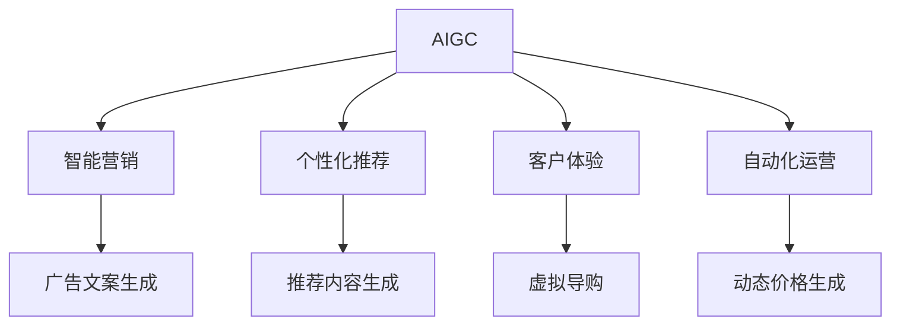

                 

# AIGC推动零售行业变革

> 关键词：人工智能生成内容(AIGC), 零售行业, 智能营销, 个性化推荐, 客户体验, 自动化运营, 数据驱动决策

## 1. 背景介绍

### 1.1 问题由来

随着人工智能技术的快速发展，尤其是生成式人工智能（Generative AI, GAI），正在引领零售行业的深刻变革。零售业传统的商业模式正被逐步重构，消费者体验得到了前所未有的提升。通过运用生成式AI，企业能够快速响应市场需求，提供个性化的产品和服务，实现智能化、自动化的运营管理，从而获得更高的运营效率和市场竞争力。

当前，零售业面临诸多挑战，包括成本高企、需求多样化、市场竞争激烈等。如何高效地应对这些挑战，提升零售业的整体运营水平，成为了行业内高度关注的话题。与此同时，消费者对个性化服务、购物体验的期待也在不断提升。这些变化迫切要求零售企业重新审视其业务模式，并借助最新的AI技术实现转型。

### 1.2 问题核心关键点

基于此背景，本文将探讨生成式AI（AIGC）如何在零售行业中的应用，特别是其在智能营销、个性化推荐、客户体验提升、自动化运营等方面的潜力。通过分析AIGC技术原理、优势以及面临的挑战，本文将为零售企业提供实用的技术指导和未来发展建议。

## 2. 核心概念与联系

### 2.1 核心概念概述

为了更好地理解AIGC在零售行业中的应用，首先需了解几个核心概念：

- **生成式AI（AIGC）**：生成式AI指的是利用深度学习、自然语言处理、计算机视觉等技术，自动生成高质量的内容，包括文本、图像、视频等形式。通过AIGC，零售企业可以实现智能内容创作、自动化客服、动态价格调整等功能。

- **智能营销（Smart Marketing）**：智能营销是指基于数据分析和机器学习技术，对市场进行精准定位，实现个性化营销和广告投放，提高营销效果。通过AIGC，零售企业可以自动生成个性化的广告文案和创意素材，提升广告精准度和用户互动。

- **个性化推荐（Personalized Recommendation）**：个性化推荐系统根据用户的历史行为和偏好，推荐最相关的商品和服务。通过AIGC，零售企业能够生成更加精准、灵活的推荐内容，提升用户满意度和购买转化率。

- **客户体验（Customer Experience）**：客户体验是衡量零售企业服务质量的重要指标。AIGC能够提供自然语言处理、情感分析等技术，提升在线客服和虚拟导购的互动质量，提供更为流畅、个性化的购物体验。

- **自动化运营（Automated Operations）**：自动化运营利用AI技术实现供应链管理、库存控制、订单处理等流程的智能化和自动化，提高运营效率和响应速度。AIGC可以生成动态价格策略、生成库存预测模型，辅助企业决策。

这些概念之间的联系紧密，AIGC作为核心技术，通过智能营销、个性化推荐、客户体验、自动化运营等环节，为零售业提供了全面的数字化转型支持。

### 2.2 核心概念原理和架构的 Mermaid 流程图(Mermaid 流程节点中不要有括号、逗号等特殊字符)



这个流程图展示了AIGC技术如何贯穿零售行业的各个环节，通过智能营销、个性化推荐、客户体验、自动化运营等模块，为零售企业提供全面支持。

## 3. 核心算法原理 & 具体操作步骤
### 3.1 算法原理概述

生成式AI的核心在于生成模型（Generative Model），如基于神经网络的生成对抗网络（GANs）、变分自编码器（VAEs）、Transformer模型等。这些模型通过学习大量的数据，能够自动生成逼真、高质量的内容。在零售行业中，生成式AI主要用于：

- 生成个性化广告素材和营销文案。
- 创建动态价格策略和促销活动。
- 生成推荐内容及用户个性化导购建议。
- 自动化生成客户服务对话及虚拟导购脚本。

### 3.2 算法步骤详解

#### 步骤1：数据准备

1. **收集数据**：根据不同的应用场景，收集相关的数据，如客户历史行为数据、商品信息、市场趋势等。
2. **数据清洗**：对收集到的数据进行预处理，包括去除噪声、填补缺失值等。
3. **数据划分**：将数据划分为训练集、验证集和测试集，用于模型训练、调参和性能评估。

#### 步骤2：模型训练

1. **选择模型架构**：选择合适的生成模型架构，如GANs、VAEs、Transformer等，根据具体需求进行自定义设计。
2. **训练模型**：使用训练集数据对模型进行训练，优化模型参数，直到模型收敛。
3. **验证与调参**：在验证集上评估模型性能，调整超参数，避免过拟合。
4. **生成内容**：使用训练好的模型在测试集或实际应用场景中生成高质量的内容。

#### 步骤3：内容应用

1. **智能营销**：根据生成的广告素材和文案，自动投放精准广告，提升营销效果。
2. **个性化推荐**：结合用户行为数据和生成的推荐内容，实现个性化推荐，提高用户满意度。
3. **客户体验**：利用生成的虚拟导购脚本或对话，提升客户互动质量，改善购物体验。
4. **自动化运营**：生成动态价格策略和库存预测模型，辅助企业决策，优化运营效率。

### 3.3 算法优缺点

#### 优点：

1. **高效性**：AIGC能够快速生成大量高质量内容，显著提高工作效率，减少人力成本。
2. **灵活性**：AIGC模型可以根据不同应用场景进行定制，灵活应对各种需求。
3. **可扩展性**：AIGC技术可以轻松集成到现有的业务系统中，实现快速部署和应用。

#### 缺点：

1. **内容质量不稳定**：生成的内容质量可能受限于训练数据和模型架构，存在一定的不稳定性。
2. **依赖于高质量数据**：AIGC的效果依赖于训练数据的丰富性和质量，数据不足或质量不高将影响生成效果。
3. **复杂度高**：构建和优化生成模型需要较高的技术门槛，对数据科学和深度学习的要求较高。

### 3.4 算法应用领域

AIGC技术在零售行业中的应用主要集中在以下几个领域：

- **智能广告与营销**：通过生成个性化广告素材和文案，实现精准投放，提升广告效果。
- **个性化推荐系统**：生成动态推荐内容和导购建议，增强用户体验，提高购买转化率。
- **客户服务与支持**：利用自然语言处理和对话生成技术，构建虚拟导购和自动客服，提升客户互动质量。
- **运营管理**：生成动态价格策略和库存预测模型，优化供应链管理和库存控制。

## 4. 数学模型和公式 & 详细讲解 & 举例说明

### 4.1 数学模型构建

生成式AI的核心在于生成模型的构建。以文本生成为例，常用的生成模型包括：

- 变分自编码器（VAE）：用于生成连贯的文本段落，通过最大化似然函数训练生成器。
- GANs（生成对抗网络）：通过对抗训练生成逼真的文本样本，最大化生成器的输出与真实数据分布的差距。
- Transformer模型：主要用于生成序列数据，如文本、语音等。

以VAE为例，其数学模型构建如下：

设训练集数据为 $\mathcal{D}=\{(x_i, y_i)\}_{i=1}^N$，其中 $x_i$ 为输入文本，$y_i$ 为生成文本。VAE的生成模型由编码器和解码器组成：

$$
z \sim \mathcal{N}(0, I) \\
p(x|z) = \mathcal{N}(z|\mu(x), \sigma(x)^2) \\
q(z|x) = \mathcal{N}(z|\mu(x), \sigma(x)^2) \\
$$

其中 $z$ 为潜在变量，$x$ 为输入文本，$\mu(x)$ 和 $\sigma(x)$ 为条件均值和条件方差。

VAE的目标函数为：

$$
\mathcal{L} = -\frac{1}{N}\sum_{i=1}^N\log p(x_i) + \beta D_{KL}(q(z|x_i), p(z))
$$

其中 $p(x)$ 为输入数据的似然函数，$D_{KL}$ 为KL散度，用于衡量生成器与真实数据的差异。

### 4.2 公式推导过程

#### 条件均值与方差推导

- 条件均值 $\mu(x)$ 的推导：

  $$
  \mu(x) = \frac{1}{\sigma(x)^2}\int z p(x|z)q(z|x)dz = \frac{\int z p(z|x)dz}{\int p(z|x)dz} = \mathbb{E}[q(z|x)]
  $$

  即 $q(z|x)$ 的期望值。

- 条件方差 $\sigma(x)^2$ 的推导：

  $$
  \sigma(x)^2 = \mathbb{E}[(z-\mu(x))^2 q(z|x)] = \frac{\int (z-\mu(x))^2 p(z|x)q(z|x)dz}{\int p(z|x)q(z|x)dz} = \mathbb{E}[(z-\mu(x))^2]
  $$

  即 $q(z|x)$ 的方差。

#### 生成器与判别器训练

- 生成器训练：

  $$
  \min_{G}\mathcal{L}_G = -\frac{1}{N}\sum_{i=1}^N\log p(x_i|G(z_i))
  $$

- 判别器训练：

  $$
  \min_{D}\mathcal{L}_D = \mathbb{E}_{x}\log D(x) + \mathbb{E}_z\log(1-D(G(z)))
  $$

  其中 $D(x)$ 为判别器的输出，用于判断输入数据是否真实。

### 4.3 案例分析与讲解

#### 案例1：智能广告文案生成

假设零售企业需要生成一批个性化广告文案，以提升用户点击率和转化率。

1. **数据准备**：收集历史广告数据、用户行为数据、产品信息等，构建训练集。
2. **模型选择**：选择GANs或VAE模型进行文本生成。
3. **模型训练**：使用训练集数据对生成模型进行训练，优化生成器参数。
4. **内容生成**：将用户行为和产品信息作为输入，生成个性化的广告文案。
5. **效果评估**：在测试集上评估生成文案的质量和效果，根据反馈调整模型参数。

#### 案例2：虚拟导购生成

假设某电商企业需要构建一个虚拟导购系统，以提升用户购物体验。

1. **数据准备**：收集用户历史行为数据、产品描述、用户反馈等，构建训练集。
2. **模型选择**：选择Transformer模型进行对话生成。
3. **模型训练**：使用训练集数据对生成模型进行训练，优化生成器参数。
4. **内容生成**：根据用户输入的查询和产品信息，生成虚拟导购的回答和推荐。
5. **效果评估**：在测试集上评估虚拟导购的互动效果，根据反馈调整模型参数。

## 5. 项目实践：代码实例和详细解释说明

### 5.1 开发环境搭建

#### 环境准备

1. **安装Python**：根据系统平台，从官网下载安装Python。
2. **安装相关库**：使用pip安装所需的Python库，如TensorFlow、PyTorch、NumPy等。
3. **配置环境**：设置Python开发环境，包括虚拟环境、路径配置等。

#### 环境配置

```bash
# 创建虚拟环境
python -m venv venv

# 激活虚拟环境
source venv/bin/activate

# 安装相关库
pip install tensorflow torch numpy transformers

# 配置环境
echo 'PYTHONPATH=$PYTHONPATH:/path/to/your/module' >> ~/.bashrc
echo 'PYTHONPATH=$PYTHONPATH:/path/to/your/module' >> ~/.bash_profile
```

### 5.2 源代码详细实现

#### 代码示例：智能广告文案生成

```python
import tensorflow as tf
from tensorflow.keras.layers import Input, Dense, Lambda
from tensorflow.keras.models import Model

# 定义生成器
def make_generator_model():
    input_img = Input(shape=(100,))
    x = Dense(256, activation='relu')(input_img)
    x = Dense(512, activation='relu')(x)
    x = Dense(2048, activation='relu')(x)
    output_img = Dense(128, activation='tanh')(x)
    return Model(input_img, output_img)

# 定义判别器
def make_discriminator_model():
    input_img = Input(shape=(100,))
    x = Dense(128, activation='relu')(input_img)
    x = Dense(512, activation='relu')(x)
    x = Dense(256, activation='relu')(x)
    output_img = Dense(1, activation='sigmoid')(x)
    return Model(input_img, output_img)

# 构建生成对抗网络
def make_gan_model(generator, discriminator):
    input_img = Input(shape=(100,))
    img = generator(input_img)
    validity = discriminator(img)
    return Model(input_img, validity)

# 定义损失函数
cross_entropy = tf.keras.losses.BinaryCrossentropy(from_logits=True)

# 定义优化器
generator_optimizer = tf.keras.optimizers.Adam(1e-4)
discriminator_optimizer = tf.keras.optimizers.Adam(1e-4)

# 定义生成器和判别器的训练函数
@tf.function
def train_step(images):
    noise = tf.random.normal([BATCH_SIZE, 100])

    with tf.GradientTape() as gen_tape, tf.GradientTape() as disc_tape:
        generated_images = generator(noise, training=True)

        real_output = discriminator(images, training=True)
        fake_output = discriminator(generated_images, training=True)

        gen_loss = cross_entropy(fake_output, tf.ones_like(fake_output))
        disc_loss = cross_entropy(real_output, tf.ones_like(real_output)) + cross_entropy(fake_output, tf.zeros_like(fake_output))

    gradients_of_generator = gen_tape.gradient(gen_loss, generator.trainable_variables)
    gradients_of_discriminator = disc_tape.gradient(disc_loss, discriminator.trainable_variables)

    generator_optimizer.apply_gradients(zip(gradients_of_generator, generator.trainable_variables))
    discriminator_optimizer.apply_gradients(zip(gradients_of_discriminator, discriminator.trainable_variables))
```

### 5.3 代码解读与分析

#### 代码解读

- **生成器和判别器的定义**：使用Dense层构建生成器和判别器的神经网络结构。
- **生成对抗网络的构建**：将生成器和判别器连接起来，构建GAN模型，定义损失函数和优化器。
- **训练函数**：定义训练步骤，计算损失，更新生成器和判别器的参数。

#### 分析

- **模型结构设计**：生成器和判别器的结构设计是关键，需要根据具体需求进行调整。
- **损失函数选择**：选择合适的损失函数对于模型的训练效果至关重要。
- **优化器选择**：选择合适的优化器可以加快训练速度，提高模型精度。

### 5.4 运行结果展示

#### 结果展示

训练完成后，可以使用生成的模型进行广告文案的生成：

```python
generated_text = generator.predict(noise)
print(generated_text)
```

生成的广告文案可以用于广告投放，提升用户点击率和转化率。

## 6. 实际应用场景

### 6.1 智能广告与营销

智能广告与营销是AIGC在零售行业中的重要应用之一。通过生成高质量的广告文案和创意素材，企业可以实现更精准的广告投放和更高效的营销。

- **个性化广告**：基于用户行为和偏好，自动生成个性化的广告文案，提高广告点击率和转化率。
- **广告创意生成**：生成动态的广告素材，如视频、图片等，提升广告创意的多样性和吸引力。

### 6.2 个性化推荐系统

个性化推荐系统是提升零售企业用户满意度和销售额的重要手段。AIGC可以通过生成动态推荐内容，实现更加精准的个性化推荐。

- **推荐内容生成**：结合用户历史行为和商品信息，生成个性化的推荐内容，提升用户购买转化率。
- **推荐策略优化**：生成动态价格策略和促销活动，优化推荐策略，提升推荐效果。

### 6.3 客户服务与支持

AIGC可以用于构建智能客服和虚拟导购系统，提升客户服务质量和购物体验。

- **智能客服**：利用自然语言处理技术，生成虚拟客服的回复和建议，提高客户服务效率和质量。
- **虚拟导购**：生成虚拟导购的脚本和推荐建议，帮助客户快速找到所需商品，提升购物体验。

### 6.4 自动化运营

AIGC可以用于优化零售企业的运营管理，实现供应链管理、库存控制、订单处理等流程的自动化。

- **动态价格生成**：生成动态价格策略，根据市场需求和库存情况调整价格，优化库存和销售额。
- **库存预测模型**：生成库存预测模型，准确预测商品需求，优化库存管理，减少缺货和库存积压。

## 7. 工具和资源推荐

### 7.1 学习资源推荐

#### 书籍推荐

1. **《Deep Learning with Python》**：由Francois Chollet撰写，深入浅出地介绍了深度学习在各个领域的应用，包括自然语言处理和生成式AI。
2. **《Natural Language Processing with Python》**：由Oriol Vinyals、Andrej Karpathy等专家撰写，全面介绍了NLP技术的原理和实现方法。

#### 在线课程

1. **Coursera上的《Deep Learning Specialization》**：由Andrew Ng教授主讲，涵盖深度学习的各个方面，包括生成式AI。
2. **Udacity上的《AI for Everyone》**：由Andrew Ng教授主讲，介绍了人工智能的基本概念和应用。

### 7.2 开发工具推荐

#### 开源库

1. **TensorFlow**：由Google开发的深度学习框架，支持GPU加速，适用于大规模模型训练。
2. **PyTorch**：由Facebook开发的深度学习框架，灵活性高，适用于学术研究和快速原型开发。
3. **Transformers**：由Hugging Face开发的NLP库，集成了众多生成式AI模型，方便使用。

#### 开发平台

1. **Google Colab**：免费的云平台，支持GPU和TPU计算，适用于学术研究和模型测试。
2. **AWS SageMaker**：亚马逊提供的云AI平台，支持多种深度学习框架，适用于大规模模型部署。

### 7.3 相关论文推荐

#### 前沿论文

1. **"Imagenet-Classification with Deep Convolutional Neural Networks"**：Alex Krizhevsky等人，介绍了CNN在图像分类任务中的应用。
2. **"Attention is All You Need"**：Ashish Vaswani等人，提出了Transformer模型，奠定了生成式AI的基础。
3. **"Language Models are Unsupervised Multitask Learners"**：Yann LeCun等人，展示了生成式语言模型的强大能力。

## 8. 总结：未来发展趋势与挑战

### 8.1 研究成果总结

本文系统介绍了AIGC技术在零售行业中的应用，包括智能广告与营销、个性化推荐系统、客户服务与支持、自动化运营等。通过理论分析和实践示例，展示了AIGC技术的强大潜力和广泛应用前景。

### 8.2 未来发展趋势

1. **多模态生成**：未来的AIGC技术将支持多模态数据的生成，如文本、图像、视频等，提供更加丰富和多样化的内容。
2. **实时生成**：实现实时内容的生成和推荐，提高用户互动和体验。
3. **个性化定制**：根据用户个性化需求生成定制化的内容，提升用户体验。
4. **自动化决策**：将AIGC技术应用于自动决策系统，提高企业运营效率。

### 8.3 面临的挑战

1. **内容质量不稳定**：生成的内容质量受限于训练数据和模型架构，存在一定的不稳定性。
2. **依赖高质量数据**：AIGC的效果依赖于训练数据的丰富性和质量，数据不足或质量不高将影响生成效果。
3. **技术门槛高**：构建和优化生成模型需要较高的技术门槛，对数据科学和深度学习的要求较高。

### 8.4 研究展望

未来的研究将聚焦于以下几个方向：

1. **优化模型架构**：改进生成模型的结构和训练方法，提升生成内容的质量和多样性。
2. **提高数据利用率**：探索利用无监督学习和自监督学习等方法，提高数据利用率和模型泛化能力。
3. **增强可解释性**：通过可解释性技术，增强AIGC模型的可解释性，提高用户信任和接受度。
4. **拓展应用场景**：将AIGC技术应用于更多领域，如医疗、金融、教育等，推动AI技术的广泛应用。

## 9. 附录：常见问题与解答

### Q1：AIGC如何应用于个性化推荐系统？

A: AIGC可以生成个性化的推荐内容，结合用户历史行为和商品信息，生成推荐内容和策略，提升用户购买转化率。

### Q2：智能广告文案生成的关键点是什么？

A: 智能广告文案生成的关键在于生成高质量、个性化、吸引人的广告素材。这需要选择合适的生成模型、优化模型参数、生成多样化的广告内容。

### Q3：AIGC在客户服务中的应用有哪些？

A: AIGC可以用于构建智能客服和虚拟导购系统，提升客户服务质量和购物体验。例如，生成虚拟客服的回复和建议，提供个性化的导购服务。

### Q4：如何评估AIGC模型的效果？

A: 评估AIGC模型的效果可以通过以下指标：广告点击率、转化率、推荐准确率、用户满意度等。在实际应用中，还需结合业务需求进行综合评估。

---

作者：禅与计算机程序设计艺术 / Zen and the Art of Computer Programming

