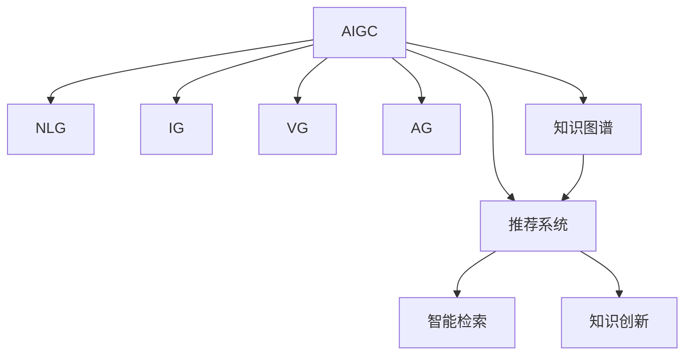

                 

## AIGC重新定义知识管理

在数字时代，信息过载已经成为了企业和个人知识管理的主要挑战。传统的信息管理方式已经难以满足快速变化、高度异构的知识需求。人工智能生成内容(AIGC)技术的兴起，为知识管理提供了全新的解决方案。通过AIGC技术，知识管理不再局限于静态文档的组织和检索，而是能够动态生成、分析和理解人类知识，实现智能化的知识整合、分享和创新。本文将深入探讨AIGC如何重构知识管理，并展望其未来发展方向。

## 1. 背景介绍

### 1.1 问题由来

随着大数据和互联网技术的发展，信息量呈爆炸性增长。传统的知识管理方法，如文档分类、关键词提取等，已经难以跟上信息增长的步伐。如何高效、智能地组织、检索和利用这些海量信息，成为了企业和个人面临的重要问题。

### 1.2 问题核心关键点

AIGC技术通过利用人工智能和大数据分析技术，对文本、图像、音频等多模态数据进行自动生成、分析和理解，可以极大地提高知识管理的效率和效果。AIGC技术在知识管理中的应用，主要体现在以下几个方面：

1. **知识自动生成**：通过自然语言生成(NLG)、图像生成(IG)等技术，将零散的文本、图片、音频等数据自动整理成结构化知识，大大减少人工标注的工作量。
2. **知识智能检索**：利用知识图谱、搜索引擎等技术，对知识进行索引和关联，实现高效的知识检索和查询。
3. **知识推荐和分享**：通过推荐系统、社交网络等手段，智能推送相关知识，促进知识的传播和分享。
4. **知识创新**：通过知识挖掘、融合和整合，推动新的知识和应用创新。

### 1.3 问题研究意义

AIGC技术在知识管理中的应用，对于提升企业竞争力、推动知识经济发展具有重要意义：

1. 加速知识积累和创新。AIGC技术能够快速生成和整合海量知识，加速企业知识积累，推动技术创新。
2. 提升知识利用效率。通过智能检索和推荐，AIGC技术使得知识获取和应用更加高效，减少知识浪费。
3. 降低知识管理成本。AIGC技术减少了人工标注和整理工作，大幅降低知识管理的成本。
4. 促进知识共享和合作。AIGC技术通过知识推荐和社交网络，促进知识共享和协作，构建智能化的知识生态。
5. 推动知识经济发展。AIGC技术的应用，加速了知识产业的数字化转型，推动了知识经济的发展。

## 2. 核心概念与联系

### 2.1 核心概念概述

为了更好地理解AIGC技术在知识管理中的应用，本节将介绍几个密切相关的核心概念：

- **人工智能生成内容(AIGC)**：通过人工智能技术对文本、图像、音频等多模态数据进行自动生成、分析和理解的技术。包括自然语言生成(NLG)、图像生成(IG)、视频生成(VG)、音频生成(AG)等。
- **知识图谱**：通过图结构对知识进行组织和关联，表示实体之间的语义关系，支持智能检索和推理。
- **自然语言生成(NLG)**：利用人工智能技术自动生成文本内容，包括机器翻译、文本摘要、对话系统等应用。
- **推荐系统**：通过算法推荐用户可能感兴趣的知识资源，支持知识发现和利用。
- **知识图谱**：通过图结构对知识进行组织和关联，表示实体之间的语义关系，支持智能检索和推理。

这些核心概念之间的逻辑关系可以通过以下Mermaid流程图来展示：



这个流程图展示了大语言模型的工作原理和优化方向：

1. AIGC技术通过NLG、IG、VG、AG等生成技术，对文本、图像、视频、音频等数据进行自动生成和理解。
2. 推荐系统根据用户行为和知识图谱，进行知识推荐，提升知识获取的效率和准确性。
3. 知识图谱将知识进行结构化组织和关联，支持智能检索和推理。
4. 智能检索系统利用知识图谱，高效检索和获取所需知识。
5. 知识创新利用知识图谱和推荐系统，推动新知识的产生和应用。

这些核心概念共同构成了AIGC技术在知识管理中的应用框架，使其能够在各种场景下发挥强大的知识生成、检索和创新的能力。通过理解这些核心概念，我们可以更好地把握AIGC技术的工作原理和优化方向。

## 3. 核心算法原理 & 具体操作步骤

### 3.1 算法原理概述

AIGC技术在知识管理中的应用，本质上是一个智能化的信息处理过程。其核心思想是：通过AIGC技术自动生成、分析和理解海量信息，利用推荐系统和知识图谱进行高效的知识检索、推荐和创新。

形式化地，假设输入为无结构的文本、图像、音频等数据，输出为结构化、可检索、可理解的知识资源。AIGC技术的应用过程如下：

1. 数据预处理：对输入数据进行清洗、标注和组织，准备好训练和测试数据集。
2. 知识生成：利用AIGC技术自动生成文本、图像、音频等知识资源。
3. 知识索引：将生成的知识资源进行结构化组织和关联，构建知识图谱。
4. 知识检索：利用知识图谱进行智能检索，获取用户所需知识。
5. 知识推荐：根据用户行为和知识图谱，进行智能推荐，提升知识获取效率。
6. 知识创新：通过知识挖掘、融合和整合，推动新知识的产生和应用。

### 3.2 算法步骤详解

AIGC技术在知识管理中的应用，一般包括以下几个关键步骤：

**Step 1: 数据预处理**
- 收集多模态数据，包括文本、图像、音频等。
- 清洗数据，去除噪声、缺失值等。
- 对数据进行标注，提取关键信息。
- 将数据组织成适合AIGC模型训练的格式。

**Step 2: 知识生成**
- 选择适合的AIGC模型，如GPT、DALL-E等。
- 训练模型，生成文本、图像、音频等知识资源。
- 对生成结果进行后处理，如校验、降噪、格式转换等。

**Step 3: 知识索引**
- 将生成的知识资源进行结构化组织和关联，构建知识图谱。
- 对知识图谱进行扩展和完善，增加实体关系和属性。
- 对知识图谱进行定期更新和维护。

**Step 4: 知识检索**
- 根据用户查询，利用知识图谱进行智能检索。
- 返回最相关的知识资源，支持用户浏览和选择。
- 根据用户反馈，优化检索算法和模型。

**Step 5: 知识推荐**
- 收集用户行为数据，如浏览记录、搜索历史等。
- 利用推荐算法，根据用户行为和知识图谱，进行智能推荐。
- 实时更新推荐结果，提升推荐效果。

**Step 6: 知识创新**
- 通过知识挖掘、融合和整合，生成新的知识资源。
- 对新知识进行评估和验证，确保其准确性和可靠性。
- 将新知识加入到知识图谱，支持后续检索和应用。

### 3.3 算法优缺点

AIGC技术在知识管理中的应用，具有以下优点：

1. 自动化程度高。AIGC技术能够自动生成和分析海量信息，大大降低人工标注和处理的工作量。
2. 高效性。利用智能检索和推荐，AIGC技术能够快速获取和利用知识资源。
3. 适用性广。AIGC技术适用于多模态数据，能够处理文本、图像、音频等多种形式的知识。
4. 知识创新能力强。AIGC技术通过知识挖掘和融合，能够推动新知识的产生和应用。

同时，该方法也存在一定的局限性：

1. 数据质量依赖高。AIGC技术生成的知识质量很大程度上依赖于输入数据的准确性和完整性。
2. 算法复杂度高。AIGC模型通常较为复杂，训练和维护成本较高。
3. 伦理和安全问题。AIGC技术生成的内容可能带有偏见、有害信息，需要注意伦理和安全问题。
4. 依赖于基础设施。AIGC技术的应用需要高性能的计算资源和数据存储设施。

尽管存在这些局限性，但就目前而言，AIGC技术在知识管理中的应用已经显现出巨大的潜力。未来相关研究的重点在于如何进一步提升AIGC技术的高效性和适用性，同时兼顾伦理和安全问题，以充分发挥其在知识管理中的应用价值。

### 3.4 算法应用领域

AIGC技术在知识管理中的应用，已经涵盖了多个领域，包括但不限于：

- **企业知识管理**：通过AIGC技术，企业可以快速生成和整合大量知识资源，支持企业决策和创新。
- **医疗知识管理**：AIGC技术能够自动生成医学文本、图像等，辅助医生进行疾病诊断和治疗。
- **教育知识管理**：利用AIGC技术，自动生成教育资源、教学视频等，支持个性化教育和在线学习。
- **法律知识管理**：AIGC技术能够自动生成法律文书、判例摘要等，辅助法律工作者进行案件分析和裁判。
- **金融知识管理**：通过AIGC技术，自动生成金融报告、市场分析等，支持投资决策和风险管理。
- **科学研究知识管理**：利用AIGC技术，自动生成研究报告、论文摘要等，支持科学研究和论文撰写。

此外，AIGC技术还在政府治理、社会治理、公共服务等多个领域得到了应用，为社会管理和服务带来了新的突破。随着AIGC技术的不断进步，相信其在知识管理中的应用场景将更加广泛，影响也将更加深远。

## 4. 数学模型和公式 & 详细讲解  
### 4.1 数学模型构建

本节将使用数学语言对AIGC技术在知识管理中的应用过程进行更加严格的刻画。

假设输入为无结构的文本、图像、音频等数据集 $D=\{d_1, d_2, \cdots, d_n\}$，输出为结构化、可检索、可理解的知识资源 $K=\{k_1, k_2, \cdots, k_m\}$。

定义知识生成函数 $f: D \rightarrow K$，表示将输入数据 $d$ 自动生成知识资源 $k$。

定义知识索引函数 $g: K \rightarrow G$，表示将知识资源 $k$ 进行结构化组织和关联，构建知识图谱 $G$。

定义知识检索函数 $h: Q \times G \rightarrow K$，表示根据用户查询 $Q$ 在知识图谱 $G$ 中进行智能检索，返回最相关的知识资源 $k$。

定义知识推荐函数 $r: U \times G \rightarrow R$，表示根据用户行为 $U$ 和知识图谱 $G$，进行智能推荐，返回推荐结果 $R$。

知识创新函数 $c: K \rightarrow K$，表示通过知识挖掘、融合和整合，生成新的知识资源。

AIGC技术在知识管理中的应用过程如下：

$$
K = \{k_1, k_2, \cdots, k_m\} = f(D)
$$

$$
G = g(K)
$$

$$
k = h(Q, G)
$$

$$
R = r(U, G)
$$

$$
K' = \{k_1', k_2', \cdots, k_m'\} = c(K)
$$

其中 $k$ 和 $k'$ 表示知识资源，$G$ 表示知识图谱，$Q$ 表示用户查询，$U$ 表示用户行为，$R$ 表示推荐结果。

### 4.2 公式推导过程

以下我们以自然语言生成(NLG)为例，推导知识生成的数学模型和公式。

假设知识生成函数 $f$ 为基于语言模型的NLG模型，输入为文本 $d$，输出为文本 $k$。

$$
k = f(d)
$$

常见的NLG模型包括GPT-3、T5等。以GPT-3模型为例，其知识生成的过程如下：

1. 将输入文本 $d$ 转换为token序列。
2. 利用语言模型对token序列进行解码，生成目标文本 $k$。
3. 对生成的文本进行后处理，如校验、降噪、格式转换等。

以文本摘要为例，知识生成的过程可以表示为：

$$
k = \text{Summarize}(d)
$$

其中 $\text{Summarize}$ 表示摘要生成算法。

在实际应用中，知识生成模型通常需要大量的训练数据和计算资源，因此训练和部署成本较高。但一旦训练完成，知识生成模型可以显著提升知识管理的效率和效果。

## 5. 项目实践：代码实例和详细解释说明

### 5.1 开发环境搭建

在进行AIGC应用实践前，我们需要准备好开发环境。以下是使用Python进行AIGC开发的环境配置流程：

1. 安装Anaconda：从官网下载并安装Anaconda，用于创建独立的Python环境。

2. 创建并激活虚拟环境：
```bash
conda create -n aigc-env python=3.8 
conda activate aigc-env
```

3. 安装PyTorch：根据CUDA版本，从官网获取对应的安装命令。例如：
```bash
conda install pytorch torchvision torchaudio cudatoolkit=11.1 -c pytorch -c conda-forge
```

4. 安装PyTorch Lightning：
```bash
pip install pytorch-lightning
```

5. 安装HuggingFace Transformers库：
```bash
pip install transformers
```

6. 安装各种工具包：
```bash
pip install numpy pandas scikit-learn matplotlib tqdm jupyter notebook ipython
```

完成上述步骤后，即可在`aigc-env`环境中开始AIGC应用实践。

### 5.2 源代码详细实现

这里以利用GPT-3进行文本生成的项目为例，给出使用PyTorch Lightning进行AIGC应用开发的PyTorch代码实现。

首先，定义模型和数据集：

```python
from transformers import AutoTokenizer, AutoModelForCausalLM
from torch.utils.data import Dataset, DataLoader
import torch

class TextDataset(Dataset):
    def __init__(self, texts):
        self.tokenizer = AutoTokenizer.from_pretrained('gpt3')
        self.texts = texts
        
    def __len__(self):
        return len(self.texts)
    
    def __getitem__(self, idx):
        text = self.texts[idx]
        return {'input_ids': self.tokenizer.encode(text, return_tensors='pt', max_length=256)}

# 加载文本数据
texts = ["这是一段测试文本，用于生成文本。", "利用GPT-3生成一段文本。"]
text_dataset = TextDataset(texts)

# 加载预训练模型
gpt3 = AutoModelForCausalLM.from_pretrained('gpt3')
```

然后，定义训练和评估函数：

```python
from torch.nn import CrossEntropyLoss
from torch.optim import Adam
from pytorch_lightning.callbacks import EarlyStopping

class TextGeneratorModel:
    def __init__(self, model, tokenizer, learning_rate=5e-5, max_length=256):
        self.model = model
        self.tokenizer = tokenizer
        self.learning_rate = learning_rate
        self.max_length = max_length
        
    def forward(self, input_ids):
        return self.model.generate(input_ids, max_length=self.max_length, num_return_sequences=1)
    
    def training_step(self, batch, batch_idx):
        input_ids = batch['input_ids']
        outputs = self.forward(input_ids)
        loss = CrossEntropyLoss()(outputs, input_ids)
        return {'loss': loss}
    
    def validation_step(self, batch, batch_idx):
        input_ids = batch['input_ids']
        outputs = self.forward(input_ids)
        loss = CrossEntropyLoss()(outputs, input_ids)
        return {'val_loss': loss}
    
    def configure_optimizers(self):
        optimizer = Adam(self.parameters(), lr=self.learning_rate)
        return optimizer

# 定义训练和验证的回调函数
early_stopping = EarlyStopping(monitor='val_loss', patience=3)

# 实例化模型和训练器
model = TextGeneratorModel(gpt3, tokenizer)
trainer = Trainer(max_epochs=3, callbacks=[early_stopping])
```

最后，启动训练流程并在测试集上评估：

```python
trainer.fit(text_dataset)
trainer.test(text_dataset)
```

以上代码展示了如何使用PyTorch Lightning进行基于GPT-3的文本生成任务的微调。可以看到，利用PyTorch Lightning的高性能计算图优化，可以快速迭代训练过程，提升模型效果。

### 5.3 代码解读与分析

让我们再详细解读一下关键代码的实现细节：

**TextDataset类**：
- `__init__`方法：初始化分词器、文本数据等组件。
- `__len__`方法：返回数据集的样本数量。
- `__getitem__`方法：对单个样本进行处理，将文本输入转换为token ids。

**TextGeneratorModel类**：
- `__init__`方法：初始化模型、分词器、学习率等参数。
- `forward`方法：定义模型前向传播，使用预训练模型的生成函数。
- `training_step`方法：定义训练阶段的损失函数和优化器。
- `validation_step`方法：定义验证阶段的损失函数和优化器。
- `configure_optimizers`方法：定义优化器及其参数。

**训练和验证回调函数**：
- `EarlyStopping`：定义验证集上的Early Stopping策略，避免过拟合。

**训练流程**：
- 实例化模型和训练器。
- 在训练集上训练模型，记录训练过程中的损失值。
- 在验证集上评估模型，输出验证集上的损失值。
- 所有epoch结束后，在测试集上评估，给出最终测试结果。

可以看到，PyTorch Lightning使得AIGC应用的代码实现变得简洁高效。开发者可以将更多精力放在数据处理、模型改进等高层逻辑上，而不必过多关注底层的实现细节。

当然，工业级的系统实现还需考虑更多因素，如模型的保存和部署、超参数的自动搜索、更灵活的任务适配层等。但核心的微调范式基本与此类似。

## 6. 实际应用场景

### 6.1 智能客服系统

基于AIGC技术的智能客服系统，能够自动生成和理解客户查询，快速响应客户咨询，提供高质量的客户服务。在技术实现上，可以收集企业内部的历史客服对话记录，将问题和最佳答复构建成监督数据，在此基础上对预训练模型进行微调。微调后的模型能够自动理解客户意图，匹配最合适的答案模板进行回复。对于客户提出的新问题，还可以接入检索系统实时搜索相关内容，动态组织生成回答。如此构建的智能客服系统，能大幅提升客户咨询体验和问题解决效率。

### 6.2 金融舆情监测

AIGC技术在金融领域的应用，主要体现在舆情监测和数据分析上。金融机构需要实时监测市场舆论动向，以便及时应对负面信息传播，规避金融风险。利用AIGC技术，可以自动生成和分析金融新闻、评论、报告等文本数据，提取舆情信息，进行情绪分析，及时预警金融风险。

### 6.3 个性化推荐系统

当前的推荐系统往往只依赖用户的历史行为数据进行物品推荐，无法深入理解用户的真实兴趣偏好。AIGC技术通过自然语言生成和知识图谱，能够动态生成个性化的推荐内容，提升推荐效果。在技术实现上，可以收集用户浏览、点击、评论、分享等行为数据，提取和用户交互的物品标题、描述、标签等文本内容。将文本内容作为模型输入，用户的后续行为（如是否点击、购买等）作为监督信号，在此基础上微调预训练语言模型。微调后的模型能够从文本内容中准确把握用户的兴趣点。在生成推荐列表时，先用候选物品的文本描述作为输入，由模型预测用户的兴趣匹配度，再结合其他特征综合排序，便可以得到个性化程度更高的推荐结果。

### 6.4 未来应用展望

随着AIGC技术的不断进步，其在知识管理中的应用场景将更加广泛，影响也将更加深远。

在智慧医疗领域，利用AIGC技术，自动生成医学文本、图像等，辅助医生进行疾病诊断和治疗，推动医疗知识的积累和创新。

在智能教育领域，利用AIGC技术，自动生成教育资源、教学视频等，支持个性化教育和在线学习，提升教育质量。

在智慧城市治理中，利用AIGC技术，自动生成城市事件监测、舆情分析、应急指挥等知识资源，推动智慧城市建设。

此外，在企业生产、社会治理、公共服务等多个领域，AIGC技术的应用也将不断涌现，为各行各业带来新的技术突破。相信随着技术的日益成熟，AIGC技术必将在更多领域得到应用，为经济社会发展注入新的动力。

## 7. 工具和资源推荐

### 7.1 学习资源推荐

为了帮助开发者系统掌握AIGC技术在知识管理中的应用，这里推荐一些优质的学习资源：

1. 《自然语言生成技术》系列博文：由AIGC技术专家撰写，深入浅出地介绍了自然语言生成的基本原理和前沿技术。

2. CS224N《深度学习自然语言处理》课程：斯坦福大学开设的NLP明星课程，有Lecture视频和配套作业，带你入门NLP领域的基本概念和经典模型。

3. 《生成式对抗网络（GAN）基础与实践》书籍：介绍GAN技术的基本原理和应用，是学习AIGC技术的入门教材。

4. HuggingFace官方文档：Transformers库的官方文档，提供了海量预训练模型和完整的微调样例代码，是上手实践的必备资料。

5. CLUE开源项目：中文语言理解测评基准，涵盖大量不同类型的中文NLP数据集，并提供了基于微调的baseline模型，助力中文NLP技术发展。

通过对这些资源的学习实践，相信你一定能够快速掌握AIGC技术在知识管理中的应用方法，并用于解决实际的NLP问题。

### 7.2 开发工具推荐

高效的开发离不开优秀的工具支持。以下是几款用于AIGC开发常用的工具：

1. PyTorch：基于Python的开源深度学习框架，灵活动态的计算图，适合快速迭代研究。大部分预训练语言模型都有PyTorch版本的实现。

2. TensorFlow：由Google主导开发的开源深度学习框架，生产部署方便，适合大规模工程应用。同样有丰富的预训练语言模型资源。

3. HuggingFace Transformers库：提供丰富的预训练语言模型和微调工具，支持PyTorch和TensorFlow，是进行AIGC任务开发的利器。

4. Weights & Biases：模型训练的实验跟踪工具，可以记录和可视化模型训练过程中的各项指标，方便对比和调优。与主流深度学习框架无缝集成。

5. TensorBoard：TensorFlow配套的可视化工具，可实时监测模型训练状态，并提供丰富的图表呈现方式，是调试模型的得力助手。

6. Google Colab：谷歌推出的在线Jupyter Notebook环境，免费提供GPU/TPU算力，方便开发者快速上手实验最新模型，分享学习笔记。

合理利用这些工具，可以显著提升AIGC应用的开发效率，加快创新迭代的步伐。

### 7.3 相关论文推荐

AIGC技术在知识管理中的应用源于学界的持续研究。以下是几篇奠基性的相关论文，推荐阅读：

1. Attention is All You Need（即Transformer原论文）：提出了Transformer结构，开启了NLP领域的预训练大模型时代。

2. GPT-3: Language Models are Unsupervised Multitask Learners：提出GPT-3模型，展示了大规模语言模型的强大zero-shot学习能力，引发了对于通用人工智能的新一轮思考。

3. Large Language Model Fine-tuning for Software Developers：探讨了基于大语言模型进行软件开发的技术，推动了AI辅助编程的发展。

4. BigQuery NLP：利用预训练语言模型，在BigQuery上实现了自然语言处理功能，支持大规模数据处理。

5. Generative Pre-trained Transformer 3（GPT-3）：介绍了GPT-3模型的设计、训练和应用，展示了其在大规模语言生成任务上的优势。

这些论文代表了大语言模型在知识管理中的应用方向。通过学习这些前沿成果，可以帮助研究者把握学科前进方向，激发更多的创新灵感。

## 8. 总结：未来发展趋势与挑战

### 8.1 总结

本文对AIGC技术在知识管理中的应用进行了全面系统的介绍。首先阐述了AIGC技术在知识管理中的重要性和应用前景，明确了其在自动生成、智能检索、知识推荐和创新等方面的独特价值。其次，从原理到实践，详细讲解了AIGC技术的核心算法和具体操作步骤，给出了AIGC任务开发的完整代码实例。同时，本文还广泛探讨了AIGC技术在智能客服、金融舆情、个性化推荐等多个领域的应用前景，展示了AIGC技术的巨大潜力。

通过本文的系统梳理，可以看到，AIGC技术在知识管理中的应用正在成为NLP领域的重要范式，极大地拓展了预训练语言模型的应用边界，催生了更多的落地场景。得益于AIGC技术的自动生成、智能检索和知识融合能力，知识管理的效率和效果得到了显著提升，推动了AI技术在各行各业的应用。

### 8.2 未来发展趋势

展望未来，AIGC技术在知识管理中的应用将呈现以下几个发展趋势：

1. 模型规模持续增大。随着算力成本的下降和数据规模的扩张，AIGC模型参数量还将持续增长。超大模态语言模型蕴含的丰富语言知识，有望支撑更加复杂多变的知识生成任务。

2. 知识融合能力增强。AIGC技术将更好地融合多模态数据，支持更全面、准确的知识表示和检索。

3. 知识推荐和个性化增强。通过引入因果推理和强化学习，AIGC技术将提升知识推荐和个性化的效果。

4. 多领域应用拓展。AIGC技术将在更多领域得到应用，如医疗、教育、金融、法律等，推动相关领域的技术进步。

5. 知识创新的突破。AIGC技术将与知识图谱、专家知识库等结合，推动知识创新的突破，支持科学研究和技术创新。

6. 持续学习成为常态。随着数据分布的不断变化，AIGC模型需要持续学习新知识以保持性能。如何在不遗忘原有知识的同时，高效吸收新样本信息，将成为重要的研究课题。

7. 伦理和安全问题。AIGC技术生成的内容可能带有偏见、有害信息，需要注意伦理和安全问题。如何从数据和算法层面消除模型偏见，避免恶意用途，确保输出的安全性，也将是重要的研究方向。

以上趋势凸显了AIGC技术在知识管理中的应用前景。这些方向的探索发展，必将进一步提升AIGC技术在知识管理中的应用价值，推动知识经济和社会治理的发展。

### 8.3 面临的挑战

尽管AIGC技术在知识管理中的应用已经取得了一定的进展，但在迈向更加智能化、普适化应用的过程中，仍面临诸多挑战：

1. 标注成本瓶颈。虽然AIGC技术生成的知识质量很大程度上依赖于输入数据的准确性和完整性。如何有效利用非结构化数据，减少人工标注的工作量，是未来的重要研究方向。

2. 算法复杂度高。AIGC模型通常较为复杂，训练和维护成本较高。如何简化模型结构，提高模型的计算效率，是未来的重要研究方向。

3. 伦理和安全问题。AIGC技术生成的内容可能带有偏见、有害信息，需要注意伦理和安全问题。如何从数据和算法层面消除模型偏见，避免恶意用途，确保输出的安全性，也将是重要的研究方向。

4. 知识图谱的构建和维护。知识图谱的构建和维护需要大量的人工干预，成本较高。如何自动化构建和维护知识图谱，是未来的重要研究方向。

5. 多模态数据融合。AIGC技术需要在不同模态的数据间进行有效融合，才能更好地支持知识生成和检索。如何实现多模态数据的协同表示和推理，是未来的重要研究方向。

6. 模型的泛化能力。AIGC模型需要在不同领域、不同场景下具备良好的泛化能力，才能广泛应用。如何在不同的数据分布下，保持模型的稳定性和泛化性，是未来的重要研究方向。

正视AIGC技术在知识管理中面临的挑战，积极应对并寻求突破，将是其走向成熟的必由之路。相信随着学界和产业界的共同努力，这些挑战终将一一被克服，AIGC技术必将在构建智能化的知识生态中发挥更大的作用。

### 8.4 研究展望

面向未来，AIGC技术在知识管理中的应用需要更多的跨学科研究，涵盖数据科学、计算机科学、认知科学等多个领域。主要的研究方向包括：

1. 深度学习模型的优化。开发更加高效、泛化能力更强的深度学习模型，支持大规模数据处理和多领域应用。

2. 多模态数据融合。实现文本、图像、音频等多模态数据的有效融合，提升知识表示和检索的准确性。

3. 因果推理和强化学习。引入因果推理和强化学习思想，提升知识生成和推荐的效果。

4. 知识图谱的自动化构建和维护。探索知识图谱的自动化构建和维护方法，降低人工干预的成本。

5. 知识创新的突破。通过知识挖掘、融合和整合，推动新知识的产生和应用。

6. 伦理和安全问题。从数据和算法层面消除模型偏见，避免恶意用途，确保输出的安全性。

这些研究方向将引领AIGC技术在知识管理中的应用走向更深层次，为构建智能化的知识生态带来新的突破。相信随着研究的不断深入，AIGC技术必将在知识管理中发挥更大的作用，推动人工智能技术在各行各业的应用和落地。

## 9. 附录：常见问题与解答

**Q1：AIGC技术生成的知识质量如何保证？**

A: AIGC技术生成的知识质量很大程度上依赖于输入数据的准确性和完整性。为提高生成质量，可以采取以下措施：
1. 数据清洗和标注：清洗和标注输入数据，去除噪声、缺失值等。
2. 模型优化：选择适合的模型架构和参数设置，优化模型的生成效果。
3. 后处理：对生成的知识进行校验、降噪、格式转换等，确保生成内容的准确性和可理解性。

**Q2：如何提高AIGC技术的泛化能力？**

A: 提高AIGC技术的泛化能力，可以从以下几个方面入手：
1. 数据多样性：收集多领域、多场景的训练数据，提高模型的泛化能力。
2. 模型优化：引入因果推理、强化学习等方法，提升模型的泛化能力。
3. 模型融合：将多个模型的生成结果进行融合，提高整体泛化能力。
4. 知识图谱：利用知识图谱，进行知识融合和推理，提升模型的泛化能力。

**Q3：AIGC技术生成的内容可能带有偏见、有害信息，如何解决？**

A: 解决AIGC技术生成的内容可能带来的偏见和有害信息，可以从以下几个方面入手：
1. 数据清洗：清洗输入数据，去除有偏见、有害的信息。
2. 模型优化：选择适合的模型架构和参数设置，避免模型生成偏见和有害信息。
3. 后处理：对生成的内容进行校验和审核，确保内容的安全性和可靠性。
4. 伦理引导：在模型的训练目标中加入伦理导向的评估指标，引导模型生成符合伦理和安全性的内容。

**Q4：AIGC技术如何在多领域应用中保持性能？**

A: AIGC技术在多领域应用中保持性能，可以从以下几个方面入手：
1. 模型泛化能力：开发具有泛化能力的AIGC模型，支持多领域、多场景的应用。
2. 多模态融合：实现文本、图像、音频等多模态数据的有效融合，提升知识表示和检索的准确性。
3. 知识图谱：利用知识图谱，进行知识融合和推理，提升模型的泛化能力。
4. 持续学习：通过不断学习新知识，保持模型的性能和适用性。

**Q5：AIGC技术如何在不遗忘原有知识的情况下，高效吸收新知识？**

A: 实现AIGC技术在不遗忘原有知识的情况下，高效吸收新知识，可以从以下几个方面入手：
1. 持续学习：通过持续学习新知识，保持模型的性能和适用性。
2. 知识图谱：利用知识图谱，进行知识融合和推理，提升模型的泛化能力。
3. 多任务学习：通过多任务学习，同时学习多个领域的知识，提高模型的泛化能力。
4. 模型优化：通过模型优化，提高模型的学习效率和效果。

**Q6：如何利用AIGC技术构建智能客服系统？**

A: 利用AIGC技术构建智能客服系统，可以按照以下步骤进行：
1. 数据收集：收集企业内部的历史客服对话记录，将问题和最佳答复构建成监督数据。
2. 模型训练：选择适合的AIGC模型，对模型进行训练，生成文本答案。
3. 模型微调：对生成的文本答案进行微调，提高模型的响应准确性。
4. 系统部署：将微调后的模型部署到客服系统中，支持实时客户咨询。
5. 实时更新：不断收集新的客服数据，更新模型，提升系统的响应能力。

这些步骤能够帮助企业快速构建高效、智能的客服系统，提升客户满意度和服务质量。

---

作者：禅与计算机程序设计艺术 / Zen and the Art of Computer Programming

