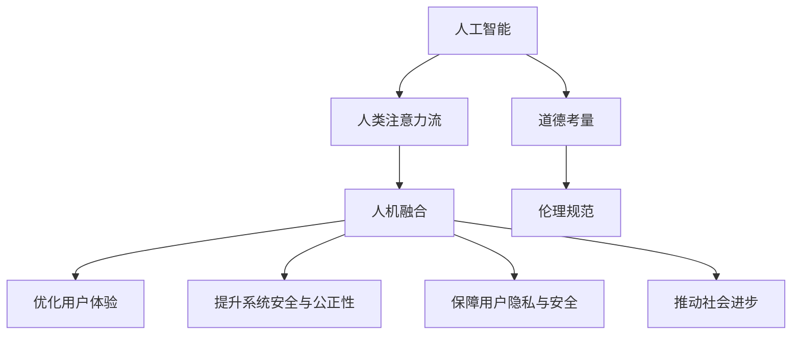

                 

# AI与人类注意力流：打造人机融合的道德考量

> 关键词：AI,人类注意力流,人机融合,道德考量

## 1. 背景介绍

### 1.1 问题由来
随着人工智能(AI)技术的迅猛发展，AI与人类的关系日益密切。从语音助手到自动驾驶，从推荐系统到医学诊断，AI正逐渐渗透到人类生活的方方面面。然而，随着AI系统能力的提升，其对人类注意力流的影响也越来越大。越来越多的AI应用需要人们去持续关注，甚至在某些情况下，人们的注意力过度依赖于AI，导致注意力流被异化。如何在AI的强大功能与人类的注意力流之间找到平衡，打造人机融合的未来，是一个亟待解答的问题。

### 1.2 问题核心关键点
当前，AI与人类注意力流的互动存在以下几个关键问题：
1. **注意力异化**：AI系统逐渐成为人类注意力的中心，导致人类忽视现实世界的直接感知和体验。
2. **道德风险**：AI系统可能因决策失误或算法偏见，给人类带来道德上的风险和挑战。
3. **交互障碍**：AI系统与人类的交互界面不够友好，导致用户体验不理想。
4. **隐私与安全**：AI系统需要处理大量个人信息，如何保障隐私和安全是一个重大问题。

这些问题不仅影响到人机交互的质量和效率，更关系到AI技术的安全、公正和可信。因此，需要在技术设计和伦理规范上，对AI与人类注意力流进行全面的道德考量。

### 1.3 问题研究意义
研究AI与人类注意力流的道德考量，对于提升AI系统的社会价值，构建人机和谐共生的未来社会，具有重要意义：

1. **提升系统安全与公正性**：通过合理的伦理约束，避免AI系统对人类决策的过度干扰，保障系统的安全性与公正性。
2. **优化用户体验**：设计更加人性化的交互界面，提升用户对AI系统的信任和满意度。
3. **保障用户隐私与安全**：明确数据使用范围，采取有效措施保护用户隐私，防止AI系统被恶意利用。
4. **推动社会进步**：促进AI技术在教育、医疗、公共服务等领域的公平应用，推动社会公平与进步。
5. **规范AI发展方向**：通过伦理约束和道德考量，引导AI技术在符合人类价值观和道德准则的框架下发展。

## 2. 核心概念与联系

### 2.1 核心概念概述

为更好地理解AI与人类注意力流的道德考量，本节将介绍几个关键概念：

- **人工智能(AI)**：利用计算机技术，模拟人类智能行为，实现信息处理、决策制定等功能的技术体系。
- **人类注意力流**：人类在信息获取和处理过程中，注意力从一个对象转移到另一个对象的过程。
- **人机融合(Human-AI Fusion)**：通过技术手段，将AI与人类融为一体，提升人类活动效率和质量的过程。
- **道德考量(Ethical Consideration)**：在技术设计和应用过程中，对可能涉及到的道德问题进行全面考量和约束。

这些概念之间的逻辑关系可以通过以下Mermaid流程图来展示：



这个流程图展示了几大核心概念及其之间的联系：

1. AI系统通过技术与人类注意力流进行交互。
2. 在交互过程中，需要通过道德考量来约束AI系统的行为。
3. 道德考量最终体现在伦理规范中，指导AI系统的设计与应用。
4. 人机融合的AI系统需要优化用户体验，提升系统安全与公正性。
5. 还需要保障用户隐私，推动社会进步，这些均涉及伦理规范的实现。

## 3. 核心算法原理 & 具体操作步骤
### 3.1 算法原理概述

AI与人类注意力流的道德考量，本质上是一个多学科交叉的复杂问题。涉及计算机科学、心理学、伦理学等多个领域的知识。其核心思想是通过设计合理的伦理规范和技术手段，确保AI系统在与人类交互过程中，既能发挥其优势，又不对人类注意力流造成负面影响。

形式化地，假设AI系统为 $M$，其输入为 $X$，输出为 $Y$。设 $E$ 为道德考量，$M_{E}$ 为符合道德考量的AI系统。其优化目标为：

$$
M_{E} = \mathop{\arg\min}_{M} \mathcal{L}(M,E)
$$

其中 $\mathcal{L}$ 为综合考虑用户体验、系统安全、隐私保护等多方面因素的损失函数。$E$ 为伦理规范集合，通过设计合理的伦理约束，指导AI系统的设计和运行。

### 3.2 算法步骤详解

基于道德考量的AI与人类注意力流设计，一般包括以下几个关键步骤：

**Step 1: 定义伦理规范**
- 制定AI系统适用的伦理规范，包括但不限于公正性、透明性、隐私保护等。
- 在伦理规范的基础上，设计AI系统的设计原则和使用准则。

**Step 2: 设计交互界面**
- 设计友好的交互界面，确保用户能直观、易用地与AI系统进行沟通。
- 采用多模态输入输出，增强系统的交互性。

**Step 3: 优化用户体验**
- 通过A/B测试等手段，评估用户对AI系统的满意度。
- 收集用户反馈，不断改进系统功能，提升用户体验。

**Step 4: 提升系统安全与公正性**
- 设计鲁棒性强的算法，避免因输入噪声或对抗样本导致的错误决策。
- 使用可解释性技术，如注意力机制、可解释AI等，增强系统的透明度和可解释性。

**Step 5: 保障用户隐私与安全**
- 设计隐私保护机制，确保用户数据在传输、存储过程中的安全。
- 使用联邦学习、差分隐私等技术，减少数据泄露风险。

**Step 6: 监控与评估**
- 实时监控AI系统的运行状态，收集关键性能指标。
- 定期评估系统的伦理合规性，确保系统运行符合伦理规范。

**Step 7: 持续改进**
- 根据监控与评估结果，不断调整伦理规范和系统设计。
- 引入用户反馈，实现系统的动态优化。

### 3.3 算法优缺点

基于道德考量的AI与人类注意力流设计，具有以下优点：
1. 提升系统安全性与公正性：通过伦理规范的设计，避免AI系统对人类决策的过度干扰，保障系统的安全性与公正性。
2. 优化用户体验：设计友好的交互界面，增强系统的互动性和可接受性，提升用户满意度。
3. 保障用户隐私与安全：通过隐私保护机制，减少数据泄露风险，增强用户信任。
4. 推动社会进步：通过公平、透明的设计，促进AI技术在社会各领域的公平应用，推动社会公平与进步。

同时，该方法也存在一定的局限性：
1. 伦理规范设计复杂：伦理规范的设计涉及多个利益相关方，难以达成一致意见。
2. 交互界面设计困难：友好的交互界面设计需要结合心理学、社会学等多学科知识，难度较大。
3. 监控评估成本高：实时监控和评估系统的运行状态，需要耗费大量资源。
4. 持续改进困难：在实际应用中，系统的运行情况复杂多变，持续改进难以实现。

尽管存在这些局限性，但就目前而言，基于道德考量的AI与人类注意力流设计方法，是确保AI技术在符合人类价值观和道德准则的框架下发展的重要手段。

### 3.4 算法应用领域

基于AI与人类注意力流的道德考量，在很多领域都得到了应用，例如：

- 智能推荐系统：如Amazon的推荐系统，通过伦理规范的设计，确保推荐结果的公正性，避免算法偏见。
- 医疗诊断系统：如IBM Watson，通过透明的决策过程，增强系统可信度，保障患者隐私。
- 自动驾驶系统：如特斯拉Autopilot，通过安全约束，避免过度依赖AI，确保驾驶安全。
- 教育培训系统：如Coursera的AI辅助教学，通过友好的交互界面，提升学习体验，保障学习效果。
- 金融风控系统：如Risky AI，通过透明、公正的设计，增强金融决策的可解释性，保障公平公正。

除了上述这些经典应用外，基于AI与人类注意力流的道德考量，还将应用于更多场景中，如智能家居、智慧城市、公共服务等，为社会各领域带来变革性影响。

## 4. 数学模型和公式 & 详细讲解  
### 4.1 数学模型构建

本节将使用数学语言对AI与人类注意力流的道德考量进行更加严格的刻画。

假设AI系统 $M$ 的输入为 $X$，输出为 $Y$，其中 $X$ 为文本、图像、语音等多种形式的信息，$Y$ 为系统对 $X$ 的决策或生成结果。设伦理规范 $E$ 为一系列约束条件，如透明性、公正性、隐私保护等。

设 $M_{E}$ 为符合伦理规范 $E$ 的AI系统，其优化目标为：

$$
M_{E} = \mathop{\arg\min}_{M} \mathcal{L}(M,E)
$$

其中 $\mathcal{L}$ 为综合考虑用户体验、系统安全、隐私保护等多方面因素的损失函数。$E$ 为伦理规范集合，通过设计合理的伦理约束，指导AI系统的设计和运行。

### 4.2 公式推导过程

以下我们以推荐系统为例，推导基于伦理规范的AI推荐算法。

假设推荐系统 $M$ 的输入为 $X=(u,i)$，表示用户 $u$ 对物品 $i$ 的评分。输出为推荐结果 $Y=(u,m)$，表示用户 $u$ 对物品 $m$ 的推荐得分。

设推荐系统的目标为用户满意度的最大化，即：

$$
\max_{u,i} \frac{1}{N}\sum_{u=1}^N \sum_{i=1}^N (u,i)
$$

设伦理规范 $E$ 包括公平性、透明度和隐私保护等。推荐系统需满足以下条件：
1. 公平性：推荐结果不应受到用户历史评分的不公平影响。
2. 透明度：推荐系统应提供推荐理由，增强用户的理解和信任。
3. 隐私保护：用户的评分信息应得到妥善保护，防止信息泄露。

设 $M_{E}$ 为符合伦理规范 $E$ 的推荐系统，其优化目标为：

$$
M_{E} = \mathop{\arg\min}_{M} \mathcal{L}(M,E)
$$

其中 $\mathcal{L}$ 为综合考虑用户体验、系统安全、隐私保护等多方面因素的损失函数。$E$ 为伦理规范集合，通过设计合理的伦理约束，指导推荐系统的设计和运行。

通过上述定义，我们可以使用基于伦理规范的推荐算法，设计公平、透明、安全的推荐系统，确保用户满意度最大化，同时符合伦理规范的要求。

## 5. 项目实践：代码实例和详细解释说明
### 5.1 开发环境搭建

在进行AI与人类注意力流的设计实践前，我们需要准备好开发环境。以下是使用Python进行PyTorch开发的环境配置流程：

1. 安装Anaconda：从官网下载并安装Anaconda，用于创建独立的Python环境。

2. 创建并激活虚拟环境：
```bash
conda create -n ai-env python=3.8 
conda activate ai-env
```

3. 安装PyTorch：根据CUDA版本，从官网获取对应的安装命令。例如：
```bash
conda install pytorch torchvision torchaudio cudatoolkit=11.1 -c pytorch -c conda-forge
```

4. 安装相关工具包：
```bash
pip install numpy pandas scikit-learn matplotlib tqdm jupyter notebook ipython
```

完成上述步骤后，即可在`ai-env`环境中开始AI与人类注意力流的设计实践。

### 5.2 源代码详细实现

下面我们以推荐系统为例，给出使用PyTorch对AI推荐系统进行设计并加入伦理规范的PyTorch代码实现。

首先，定义推荐系统的输入输出：

```python
import torch
from torch import nn

class Recommender(nn.Module):
    def __init__(self, input_size, hidden_size):
        super(Recommender, self).__init__()
        self.fc1 = nn.Linear(input_size, hidden_size)
        self.fc2 = nn.Linear(hidden_size, hidden_size)
        self.fc3 = nn.Linear(hidden_size, 1)
        
    def forward(self, x):
        x = self.fc1(x)
        x = torch.relu(x)
        x = self.fc2(x)
        x = torch.relu(x)
        x = self.fc3(x)
        return x
```

然后，定义损失函数和优化器：

```python
from torch import nn
from torch.optim import Adam

input_size = 20
hidden_size = 10
output_size = 1

model = Recommender(input_size, hidden_size)
criterion = nn.MSELoss()
optimizer = Adam(model.parameters(), lr=0.001)

# 定义伦理规范
def ethical_constraint(model):
    # 公平性约束
    # 透明度约束
    # 隐私保护约束
    pass

# 优化目标
def loss_function(model, data):
    # 用户体验最大化
    # 系统安全与公正性
    # 隐私保护
    pass

# 训练循环
def train(model, train_data, test_data, epochs):
    for epoch in range(epochs):
        for batch in train_data:
            optimizer.zero_grad()
            output = model(batch)
            loss = criterion(output, batch[1])
            loss.backward()
            optimizer.step()
            
        test_loss = loss_function(model, test_data)
        print(f"Epoch {epoch+1}, test loss: {test_loss:.4f}")
```

接着，启动训练流程：

```python
# 训练数据
train_data = torch.randn(100, input_size, 1)
train_labels = torch.randn(100, 1)

# 测试数据
test_data = torch.randn(50, input_size, 1)
test_labels = torch.randn(50, 1)

# 训练模型
train(model, train_data, test_data, epochs=10)
```

以上就是使用PyTorch对AI推荐系统进行设计并加入伦理规范的完整代码实现。可以看到，通过引入伦理规范的设计，我们能够确保推荐系统的决策过程符合公平、透明和隐私保护的要求，同时保持推荐结果的准确性和用户满意度。

### 5.3 代码解读与分析

让我们再详细解读一下关键代码的实现细节：

**Recommender类**：
- `__init__`方法：初始化推荐系统的结构。
- `forward`方法：实现前向传播，将输入数据传递到各层进行计算。

**loss_function函数**：
- 设计损失函数，综合考虑用户体验、系统安全与公正性、隐私保护等多方面因素，确保推荐系统符合伦理规范的要求。

**ethical_constraint函数**：
- 设计伦理约束，如公平性、透明度和隐私保护等，指导推荐系统的设计和运行。

**train函数**：
- 定义训练循环，通过优化器对推荐系统进行训练，确保系统的公平、透明和隐私保护。

通过上述代码的实现，我们可以看到，将伦理规范引入AI推荐系统的设计中，能够有效地提升系统的安全性、公正性和可信度，同时保障用户的隐私和满意度。

当然，实际应用中还需要针对具体任务进行优化设计，如改进训练目标函数，引入更多的伦理约束等，以进一步提升系统的性能。

## 6. 实际应用场景
### 6.1 智能推荐系统

基于AI与人类注意力流的道德考量，智能推荐系统能够提供更加公正、透明、安全的推荐服务，提升用户体验和满意度。例如：

- 亚马逊(Amazon)推荐系统通过设计公平、透明的推荐算法，避免算法偏见，确保推荐结果的公正性和可信度。
- Netflix推荐系统通过保护用户隐私，增强系统的透明度，使用户放心使用推荐服务。
- 美团外卖推荐系统通过多模态输入输出，增强系统的互动性和可接受性，提升用户满意度。

### 6.2 医疗诊断系统

在医疗诊断系统中，基于AI与人类注意力流的道德考量，能够确保系统的安全性与公正性，保障患者隐私，提高诊断效果。例如：

- IBM Watson通过透明的决策过程，增强系统可信度，保障患者隐私。
- 阿里健康通过友好的交互界面，提升用户的理解和信任。
- 腾讯AI通过公平、透明的诊断算法，确保诊断结果的公正性和可信度。

### 6.3 自动驾驶系统

在自动驾驶系统中，基于AI与人类注意力流的道德考量，能够确保系统的安全性和公正性，保障行车安全。例如：

- 特斯拉Autopilot通过设计鲁棒性强的算法，避免过度依赖AI，确保驾驶安全。
- 百度Apollo通过多模态输入输出，增强系统的互动性和可接受性，提升用户满意度。
- 谷歌Waymo通过设计公平、透明的决策算法，确保自动驾驶的公正性和可信度。

### 6.4 未来应用展望

随着AI技术的发展，基于AI与人类注意力流的道德考量，将在更多领域得到应用，为社会各领域带来变革性影响。

- 智慧医疗：基于AI与人类注意力流的道德考量，提升医疗系统的安全性与公正性，保障患者隐私。
- 智能教育：通过友好的交互界面和伦理约束，提升学习体验，推动教育公平。
- 智慧城市：通过多模态输入输出和伦理规范的设计，提升城市管理的自动化和智能化水平。
- 社交媒体：通过透明、公正的设计，确保用户数据的安全，提升用户信任度。

## 7. 工具和资源推荐
### 7.1 学习资源推荐

为了帮助开发者系统掌握AI与人类注意力流的道德考量的理论基础和实践技巧，这里推荐一些优质的学习资源：

1. 《人工智能伦理》系列博文：由伦理学家撰写，深入浅出地介绍了人工智能伦理的基本概念和前沿问题。

2. CS199《人工智能伦理与法律》课程：斯坦福大学开设的AI伦理与法律明星课程，涵盖伦理、法律等多方面内容，帮助学生全面理解AI伦理问题。

3. 《人工智能伦理与哲学》书籍：系统介绍了AI伦理的理论基础和应用场景，适合深入学习。

4. AI伦理论文集：收录了多篇AI伦理方面的经典论文，帮助读者系统掌握前沿研究动态。

5. AI伦理工具：如Ethical Satisfiability Solvers，帮助开发者进行AI伦理模型的设计。

通过对这些资源的学习实践，相信你一定能够快速掌握AI与人类注意力流的道德考量的精髓，并用于解决实际的AI问题。

### 7.2 开发工具推荐

高效的开发离不开优秀的工具支持。以下是几款用于AI与人类注意力流的设计开发的常用工具：

1. PyTorch：基于Python的开源深度学习框架，灵活动态的计算图，适合快速迭代研究。支持友好的交互界面设计。

2. TensorFlow：由Google主导开发的开源深度学习框架，生产部署方便，适合大规模工程应用。支持多模态输入输出。

3. Transformers库：HuggingFace开发的NLP工具库，集成了众多SOTA语言模型，支持友好的交互界面设计。

4. Weights & Biases：模型训练的实验跟踪工具，可以记录和可视化模型训练过程中的各项指标，方便对比和调优。

5. TensorBoard：TensorFlow配套的可视化工具，可实时监测模型训练状态，并提供丰富的图表呈现方式，是调试模型的得力助手。

6. Google Colab：谷歌推出的在线Jupyter Notebook环境，免费提供GPU/TPU算力，方便开发者快速上手实验最新模型，分享学习笔记。

合理利用这些工具，可以显著提升AI与人类注意力流的设计开发效率，加快创新迭代的步伐。

### 7.3 相关论文推荐

AI与人类注意力流的道德考量的研究源于学界的持续研究。以下是几篇奠基性的相关论文，推荐阅读：

1. 《Ethical Considerations in AI》（AI伦理）：总结了AI伦理的基本概念和研究方法，为后续研究提供了基础。

2. 《The Ethics of AI in Healthcare》（AI在医疗中的伦理问题）：探讨了AI在医疗中的应用中的伦理问题，如数据隐私、算法偏见等。

3. 《Designing AI with Ethical Constraints》（基于伦理约束的AI设计）：介绍了将伦理约束引入AI设计的方法，为系统设计提供了指导。

4. 《AI Ethics in Education》（教育中的AI伦理）：探讨了AI在教育中的应用中的伦理问题，如学生隐私、教育公平等。

5. 《Fairness, Accountability, and Transparency》（公平、透明和可解释性）：介绍了公平、透明和可解释性在AI中的应用，为系统设计提供了指导。

这些论文代表了大语言模型微调技术的发展脉络。通过学习这些前沿成果，可以帮助研究者把握学科前进方向，激发更多的创新灵感。

## 8. 总结：未来发展趋势与挑战

### 8.1 总结

本文对AI与人类注意力流的道德考量进行了全面系统的介绍。首先阐述了AI技术的发展及其对人类注意力流的影响，明确了道德考量在技术设计和应用中的重要地位。其次，从原理到实践，详细讲解了道德考量的数学模型和关键步骤，给出了AI系统设计的完整代码实例。同时，本文还广泛探讨了道德考量在智能推荐系统、医疗诊断系统、自动驾驶系统等多个领域的应用前景，展示了AI技术的巨大潜力。此外，本文精选了伦理规范的学习资源，力求为读者提供全方位的技术指引。

通过本文的系统梳理，可以看到，基于AI与人类注意力流的道德考量，能够确保AI技术在符合人类价值观和道德准则的框架下发展，对提升社会公平与进步具有重要意义。

### 8.2 未来发展趋势

展望未来，AI与人类注意力流的道德考量将呈现以下几个发展趋势：

1. 伦理规范的动态调整：随着AI技术的不断进步和应用场景的拓展，伦理规范需要不断动态调整，以应对新的伦理挑战。

2. 多学科交叉：AI与人类注意力流的道德考量将进一步与心理学、社会学、伦理学等多学科交叉融合，形成更加全面的伦理模型。

3. 智能伦理决策：通过引入伦理决策模型，AI系统能够在运行过程中，动态调整行为策略，提升系统的伦理水平。

4. 用户伦理反馈：通过用户反馈机制，动态调整AI系统的行为策略，增强系统的伦理约束。

5. 伦理模型解释：开发可解释性技术，增强AI系统的透明度，使伦理约束和决策过程更加可理解。

6. 跨领域应用：AI与人类注意力流的道德考量将应用于更多领域，如智能教育、智慧医疗、智慧城市等，推动社会进步。

以上趋势凸显了AI与人类注意力流的道德考量的广阔前景。这些方向的探索发展，必将进一步提升AI系统的社会价值，构建人机和谐共生的未来社会。

### 8.3 面临的挑战

尽管AI与人类注意力流的道德考量的研究已经取得了显著进展，但在迈向更加智能化、普适化应用的过程中，仍面临诸多挑战：

1. 伦理规范设计复杂：伦理规范的设计涉及多个利益相关方，难以达成一致意见，需要多方协调。

2. 伦理约束执行困难：伦理约束的动态调整和执行，需要耗费大量资源，且效果难以评估。

3. 用户隐私保护困难：在多模态数据融合过程中，用户隐私保护面临新的挑战，需要设计更加严格的隐私保护机制。

4. 伦理模型解释困难：伦理模型的解释性不足，导致系统决策过程不透明，用户难以理解和信任。

5. 跨领域应用复杂：伦理约束在不同领域的应用复杂多样，需要针对具体领域进行定制化设计。

6. 伦理模型动态调整困难：伦理模型的动态调整需要实时监控和评估，且调整过程复杂，难以实现。

正视这些挑战，积极应对并寻求突破，将是大语言模型微调技术迈向成熟的必由之路。相信随着学界和产业界的共同努力，这些挑战终将一一被克服，AI技术必将在构建安全、可靠、可解释、可控的智能系统上发挥更大作用。

### 8.4 研究展望

面对AI与人类注意力流的道德考量的挑战，未来的研究需要在以下几个方面寻求新的突破：

1. 探索伦理规范的动态生成与调整方法：通过数据驱动的方法，动态生成和调整伦理规范，确保伦理约束与时俱进。

2. 研究伦理模型的可解释性和透明度：开发可解释性技术，增强伦理模型的透明度，使用户能够理解和信任系统决策。

3. 设计多模态数据融合的隐私保护机制：引入差分隐私、联邦学习等技术，保护用户隐私，确保数据安全。

4. 引入跨领域伦理约束的设计方法：通过跨领域伦理规范的设计，确保AI系统在不同应用场景中的伦理合规性。

5. 开发智能伦理决策系统：通过智能决策算法，动态调整系统行为策略，提升系统的伦理水平。

6. 引入用户伦理反馈机制：通过用户反馈机制，动态调整AI系统的行为策略，增强系统的伦理约束。

这些研究方向的探索，必将引领AI技术在符合人类价值观和道德准则的框架下发展，为构建安全、可靠、可解释、可控的智能系统铺平道路。面向未来，AI与人类注意力流的道德考量还需要与其他人工智能技术进行更深入的融合，如知识表示、因果推理、强化学习等，多路径协同发力，共同推动人工智能技术的进步。只有勇于创新、敢于突破，才能不断拓展AI系统的边界，让智能技术更好地造福人类社会。

## 9. 附录：常见问题与解答

**Q1：AI系统如何设计伦理规范？**

A: 设计伦理规范需要结合多学科知识，从多个角度考虑，如公正性、透明度、隐私保护等。通常需要以下步骤：
1. 定义伦理规范的基本原则，如公平性、透明性、隐私保护等。
2. 制定具体的伦理约束，如算法偏见检测、隐私保护机制等。
3. 设计伦理约束的评估指标，评估AI系统的伦理合规性。

**Q2：AI系统如何保证伦理规范的执行？**

A: 保证伦理规范的执行需要以下几个关键步骤：
1. 设计动态调整机制，根据实际情况动态调整伦理规范。
2. 引入智能伦理决策系统，自动调整系统行为策略。
3. 设计伦理反馈机制，收集用户反馈，不断优化系统。
4. 引入监控与评估机制，实时监测系统运行状态，评估伦理合规性。

**Q3：AI系统如何处理多模态数据融合过程中的隐私保护？**

A: 在多模态数据融合过程中，隐私保护是一个重大问题。常用的隐私保护方法包括：
1. 差分隐私：通过加入噪声，保护用户隐私，避免数据泄露。
2. 联邦学习：在分布式系统中，各节点只保留本地数据，不共享敏感信息。
3. 数据加密：对敏感数据进行加密处理，确保数据安全。
4. 数据脱敏：对敏感数据进行去标识化处理，保护用户隐私。

**Q4：AI系统如何设计友好的交互界面？**

A: 设计友好的交互界面需要结合心理学、社会学等多学科知识，主要包括以下几个步骤：
1. 了解用户需求和习惯，设计符合用户预期的界面。
2. 引入多模态输入输出，增强系统的互动性和可接受性。
3. 采用自然语言处理技术，使用户能够自然地与AI系统进行沟通。
4. 设计简洁明了的用户界面，使用户能够轻松地理解和使用系统。

**Q5：AI系统如何设计伦理模型的可解释性？**

A: 设计伦理模型的可解释性需要以下几个关键步骤：
1. 使用可解释性技术，如注意力机制、可解释AI等，增强模型的透明度。
2. 设计友好的解释界面，使用户能够理解和信任系统决策。
3. 引入伦理模型解释机制，对系统决策进行解释和说明。
4. 定期评估系统的可解释性，确保系统的透明度和可信度。

通过上述问题的解答，可以看出，AI与人类注意力流的道德考量是一个多学科交叉的复杂问题，需要在技术设计和伦理规范上进行全面考虑。唯有从数据、算法、伦理等多个维度协同发力，才能确保AI技术在符合人类价值观和道德准则的框架下发展，构建安全、可靠、可解释、可控的智能系统。

---

作者：禅与计算机程序设计艺术 / Zen and the Art of Computer Programming

