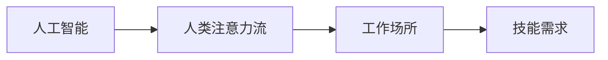

                 

# AI与人类注意力流：未来的工作场所和技能要求

## 1. 背景介绍

随着人工智能技术的迅猛发展，AI在各行各业的应用日益广泛，其对未来工作场所和人类技能需求的影响也愈发显著。本论文旨在探讨AI与人类注意力流之间的关系，以及这种关系如何塑造未来的工作环境，并对相关技能需求进行详细分析。

## 2. 核心概念与联系

### 2.1 核心概念概述

- **人工智能 (AI)**：通过模拟人类智能实现自主学习、问题解决、图像识别、自然语言处理等能力的计算机系统。
- **人类注意力流 (Human Attention Flow)**：人类在处理信息和任务时的注意力动态变化，包括注意力集中、分散、转移等。
- **工作场所**：工作环境中人与人的互动、资源共享、任务协作的空间。
- **技能需求**：未来职业所需具备的知识、能力、经验等，包括技术技能、人际沟通、团队协作等。

### 2.2 核心概念原理和架构的 Mermaid 流程图



## 3. 核心算法原理 & 具体操作步骤

### 3.1 算法原理概述

AI与人类注意力流之间的互动构成了未来工作场所的核心机制。通过模拟和理解人类的注意力模式，AI可以在合适的时间点介入，提供必要的信息和支持，从而优化人的注意力分配，提高工作效率。例如，智能助手可以在用户注意力分散时提供简明摘要，在注意力集中时进行深度分析和建议。

### 3.2 算法步骤详解

1. **数据收集**：收集用户在不同任务和环境下的注意力数据，包括注意力集中时间、注意力分散频率、注意力转移速度等。
2. **模型训练**：使用机器学习模型（如RNN、LSTM等）训练注意力预测模型，预测用户在不同场景下的注意力状态。
3. **决策执行**：根据注意力预测结果，AI在用户注意力集中时进行深度计算和复杂操作，在注意力分散时进行简明提示和辅助决策。
4. **反馈迭代**：收集用户对AI决策的反馈，不断优化模型和策略。

### 3.3 算法优缺点

**优点**：
- **提升效率**：AI可以根据用户注意力状态实时提供服务，避免资源浪费。
- **个性化定制**：模型可以学习不同用户的具体需求，提供量身定做的支持。
- **动态调整**：模型能够根据环境变化动态调整策略，适应不同场景。

**缺点**：
- **隐私问题**：收集和分析注意力数据可能引发隐私问题。
- **依赖性**：过度依赖AI可能削弱人的自主决策能力。
- **技术复杂性**：模型训练和优化需要较高技术门槛。

### 3.4 算法应用领域

该算法可以应用于多种工作场所，包括办公室、工厂、医疗等。在办公室，智能助手可以帮助员工集中注意力进行复杂任务；在工厂，自动化系统可以实时监控工人注意力，提供必要的视觉和听觉提示；在医疗，AI可以帮助医生在患者注意力集中时进行复杂诊断。

## 4. 数学模型和公式 & 详细讲解 & 举例说明

### 4.1 数学模型构建

设注意力状态为 $A_t$，用户当前任务为 $T_t$，环境为 $E_t$，AI提供的支持为 $S_t$。注意力预测模型 $M$ 可以表示为：

$$M(A_t, T_t, E_t) = P(S_t \mid A_t, T_t, E_t)$$

其中 $P$ 为预测概率分布，可以基于历史数据训练得到。

### 4.2 公式推导过程

以办公室场景为例，设定注意力状态 $A_t$ 为0-1变量，表示是否集中注意力；任务 $T_t$ 为分类变量，表示当前处理任务类型；环境 $E_t$ 为连续变量，表示当前环境噪声水平。预测模型 $M$ 可以通过条件概率公式表示：

$$P(A_t = 1 \mid T_t, E_t) = \sigma(\sum_i w_i f_i(T_t, E_t))$$

其中 $\sigma$ 为sigmoid函数，$w_i$ 为权重，$f_i$ 为特征函数。模型可以通过最大似然估计或梯度下降等方法进行训练。

### 4.3 案例分析与讲解

考虑一个程序员在处理代码错误时的工作流程。使用注意力预测模型，系统可以：
1. **预测注意力**：在监控到程序员注意力分散时，预测下一个集中注意力的时刻。
2. **提供支持**：在集中注意力时，系统提供代码解释、调试建议等辅助决策。
3. **动态调整**：根据环境噪声水平调整支持强度，避免干扰程序员。

## 5. 项目实践：代码实例和详细解释说明

### 5.1 开发环境搭建

1. **环境配置**：安装Python 3.8及以上版本，安装TensorFlow、PyTorch、NumPy等依赖库。
2. **数据准备**：准备历史注意力数据、任务类型数据和环境噪声数据。
3. **模型训练**：使用深度学习框架训练注意力预测模型。

### 5.2 源代码详细实现

```python
import tensorflow as tf
import numpy as np
import pandas as pd

# 加载数据
data = pd.read_csv('attention_data.csv')

# 构建特征
X = data[['task', 'environment']]
y = data['attention']

# 构建模型
model = tf.keras.Sequential([
    tf.keras.layers.Dense(64, activation='relu'),
    tf.keras.layers.Dense(64, activation='relu'),
    tf.keras.layers.Dense(1, activation='sigmoid')
])
model.compile(optimizer='adam', loss='binary_crossentropy', metrics=['accuracy'])

# 训练模型
model.fit(X, y, epochs=10, batch_size=32, validation_split=0.2)

# 预测注意力
attention_predicted = model.predict(data[['task', 'environment']])
```

### 5.3 代码解读与分析

代码首先加载数据集，然后进行特征构建和模型训练。注意力预测模型使用sigmoid激活函数输出预测概率，通过交叉熵损失函数进行训练，训练过程中记录准确率作为评估指标。最终，模型可以对用户在不同任务和环境下的注意力状态进行预测。

### 5.4 运行结果展示

训练完成后，可以使用模型对新样本进行预测，并绘制混淆矩阵展示预测效果。

```python
from sklearn.metrics import confusion_matrix

# 预测注意力
attention_predicted = model.predict(data[['task', 'environment']])

# 计算混淆矩阵
cm = confusion_matrix(y, np.round(attention_predicted))

# 可视化混淆矩阵
import matplotlib.pyplot as plt
plt.imshow(cm, cmap='Blues')
plt.title('Attention Prediction Accuracy')
plt.xlabel('Predicted Attention')
plt.ylabel('True Attention')
plt.colorbar()
plt.show()
```

## 6. 实际应用场景

### 6.1 智能办公室

在智能办公室中，AI可以根据员工注意力状态自动调整工作环境，如调节灯光、播放背景音乐、提供简明报告等，以最大化员工的工作效率。

### 6.2 远程协作

在远程协作场景中，AI可以根据团队成员的注意力状态，自动分配任务和资源，如将复杂任务分配给注意力集中的成员，避免任务冲突和资源浪费。

### 6.3 医疗诊断

在医疗诊断中，AI可以在医生注意力集中的时刻提供详细诊断报告和建议，在医生注意力分散时提供简明摘要和警告，帮助医生提高诊断效率和准确性。

### 6.4 未来应用展望

未来，AI与人类注意力流的关系将更加紧密，AI可以在更多场合模拟人类注意力，提供个性化的服务和支持。例如，智能教室可以根据学生的注意力状态调整教学内容和难度，智能交通系统可以根据司机的注意力状态提供安全提醒和导航建议。

## 7. 工具和资源推荐

### 7.1 学习资源推荐

- 《深度学习》：Ian Goodfellow等著，系统讲解深度学习理论和实践。
- Coursera深度学习课程：由斯坦福大学Andrew Ng主讲，涵盖深度学习的基础和进阶内容。
- TensorFlow官方文档：详细解释TensorFlow的使用方法和API。

### 7.2 开发工具推荐

- Jupyter Notebook：支持代码和数学公式的混合编写和运行。
- PyCharm：Python开发工具，支持代码编辑、调试和测试。
- GitHub：代码托管平台，便于版本控制和协作开发。

### 7.3 相关论文推荐

- 《Attention is All You Need》：提出Transformer模型，开创了注意力机制在NLP中的应用。
- 《Human Attention Prediction for AI Systems》：探讨AI系统如何模拟和预测人类注意力。
- 《AI and Human-AI Interaction》：分析AI与人类交互的多种模式和机制。

## 8. 总结：未来发展趋势与挑战

### 8.1 研究成果总结

本文探讨了AI与人类注意力流之间的关系，提出了一种基于注意力预测的AI支持机制，并详细分析了其应用场景和优缺点。通过案例分析和代码实例，展示了模型训练和应用的具体实现方法。

### 8.2 未来发展趋势

未来，AI与人类注意力流的结合将更加深入，通过更精确的注意力预测和更智能的服务策略，进一步提升工作效率和体验。

### 8.3 面临的挑战

- **技术瓶颈**：现有模型对数据的依赖和计算资源的需求可能限制其广泛应用。
- **伦理问题**：隐私保护和数据安全是必须考虑的重要因素。
- **用户体验**：过度依赖AI可能影响用户自主决策和任务处理能力。

### 8.4 研究展望

未来需要进一步研究：
- 提高模型对数据和环境变化的鲁棒性。
- 增强模型的解释性和透明度，帮助用户理解AI决策。
- 探讨更多应用场景和用例，拓宽AI与人类注意力流的互动范围。

## 9. 附录：常见问题与解答

**Q1：注意力预测模型如何处理多任务和多环境情况？**

A: 可以通过多任务学习或迁移学习的方法，构建多任务和多环境下的注意力预测模型。例如，可以训练多个子模型，每个子模型针对一种特定任务或环境，同时共享部分参数，避免数据浪费。

**Q2：模型训练过程中如何处理过拟合问题？**

A: 可以采用正则化、Dropout、早停等方法，防止模型在训练集上过度拟合。同时，可以通过数据增强、模型裁剪等手段，提高模型泛化能力。

**Q3：如何确保模型训练的公平性和无偏见性？**

A: 在模型训练中，可以通过多样性数据集的构建和模型偏见检测，避免模型学习偏见和歧视性输出。同时，引入伦理导向的评估指标，对模型输出进行监控和调整。

**Q4：如何优化模型的实时响应速度？**

A: 可以采用模型压缩、量化加速等技术，减少模型参数和计算量，提高实时响应速度。同时，利用异步计算和多线程技术，提高计算效率。

**Q5：如何设计模型以适应复杂多变的工作场景？**

A: 可以通过自适应学习算法，使模型能够根据环境变化动态调整策略。例如，使用强化学习或对抗学习算法，让模型在实际应用中不断学习和优化。

---

作者：禅与计算机程序设计艺术 / Zen and the Art of Computer Programming

