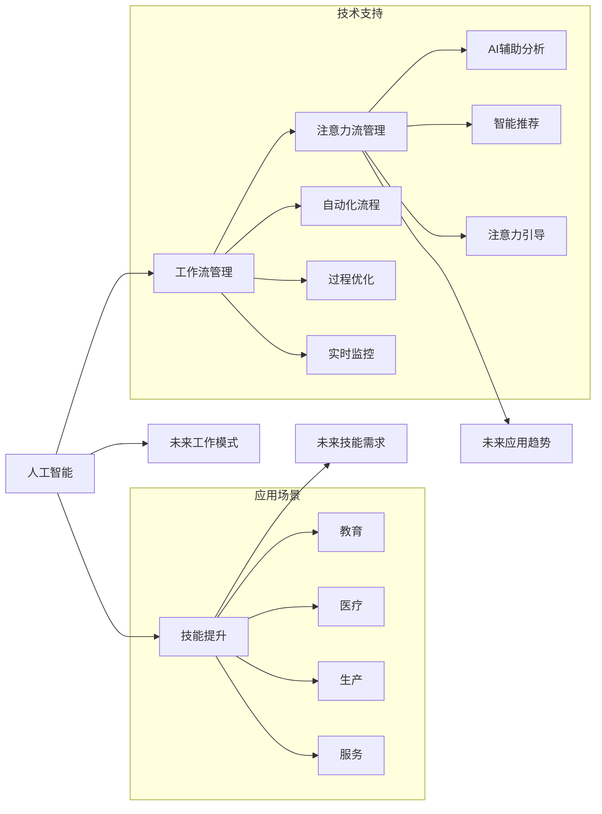

                 

# AI与人类注意力流：未来的工作、技能与注意力流管理技术的应用前景趋势分析预测

> 关键词：人工智能,注意力流,工作流管理,机器学习,技能提升,未来预测

## 1. 背景介绍

### 1.1 问题由来
随着人工智能（AI）技术在全球范围内的迅速发展，人类与机器的协同工作模式正在发生深刻变革。AI不仅在生产、医疗、教育等领域提供了高效的支持，也引发了对人类注意力流管理的广泛关注。人类在协同工作、学习和生活中，注意力流管理成为确保效率、提升体验的关键因素。本研究旨在深入探讨AI与人类注意力流之间的关系，分析未来的工作、技能与注意力流管理技术的发展趋势，并提出相应的应用前景预测。

### 1.2 问题核心关键点
本文将聚焦于以下几个关键点：
- AI在提升人类注意力流管理中的应用。
- 未来的工作模式、技能需求与AI的协同关系。
- 注意力流管理技术的前沿趋势与创新应用。
- AI技术在提升人类生产效率、学习效果及生活体验中的潜力。

## 2. 核心概念与联系

### 2.1 核心概念概述

为便于理解，本文首先定义和介绍几个核心概念：

- **人工智能（AI）**：指通过模拟、扩展人类智能，实现语音识别、自然语言处理、图像识别、决策支持等智能应用的技术体系。

- **注意力流（Attention Flow）**：指人类在执行任务过程中，注意力在不同任务、信息源和操作间动态流转的过程，是评估人类工作效率和用户体验的重要指标。

- **工作流管理（Workflow Management）**：指通过自动化、优化和监控工作流程，提高组织、团队和个人的工作效率和协作能力的技术和工具。

- **技能提升（Skill Enhancement）**：指通过AI技术辅助，帮助个人和组织提高其专业技能和通用技能，适应技术变革和市场变化的能力。

- **注意力流管理（Attention Flow Management）**：指通过技术手段辅助，帮助人类优化其注意力分配，提升工作、学习和生活的效率和体验。

这些核心概念构成了本文的研究基础，它们之间的联系体现在AI技术在提升注意力流管理、优化工作流和技能提升等方面的作用。

### 2.2 核心概念原理和架构的 Mermaid 流程图



该图展示了AI技术在提升注意力流管理、优化工作流和技能提升中的应用路径和关键技术支持。

## 3. 核心算法原理 & 具体操作步骤

### 3.1 算法原理概述

AI与人类注意力流管理的技术核心在于通过机器学习算法，实现对人类注意力行为模式的分析和预测，从而优化工作流、提升技能并管理注意力流。这通常包括以下几个关键步骤：

1. **数据收集与预处理**：收集人类在工作、学习、生活中的注意力数据，进行清洗和标注。
2. **注意力模式识别**：使用聚类、分类等算法识别注意力在不同任务和信息源间的模式。
3. **预测与优化**：基于历史注意力数据，使用回归、决策树等算法预测未来的注意力流，并提出优化建议。
4. **实时监控与调整**：使用实时监控技术，跟踪注意力流变化，及时调整工作流或注意力流管理策略。

### 3.2 算法步骤详解

#### 3.2.1 数据收集与预处理

1. **数据源**：
   - 用户操作日志：如键盘输入、鼠标点击、应用使用等。
   - 时间序列数据：如认知负荷、心理状态、情绪变化等。
   - 系统交互数据：如网页浏览、应用选择、任务切换等。

2. **数据清洗**：
   - 去除噪声和异常值。
   - 归一化处理。
   - 处理缺失值和数据不平衡问题。

3. **数据标注**：
   - 对注意力数据进行标记，如任务类型、信息源、注意力持续时间等。
   - 标记注意力行为状态，如专注、分心、疲劳等。

#### 3.2.2 注意力模式识别

1. **聚类算法**：
   - 使用K-Means、层次聚类等算法，识别注意力行为的类别。
   - 计算类别的特征，如持续时间、频率、偏好等信息源。

2. **分类算法**：
   - 使用决策树、随机森林等算法，将注意力行为分类为不同类型的注意力状态（如专注、分心、疲劳）。

#### 3.2.3 预测与优化

1. **回归算法**：
   - 使用线性回归、多项式回归等算法，预测未来的注意力流状态。
   - 设定注意力流目标，如提高专注度、减少疲劳等。

2. **优化算法**：
   - 使用遗传算法、模拟退火等算法，优化工作流和注意力流管理策略。
   - 基于预测结果，调整任务优先级、休息间隔等参数。

#### 3.2.4 实时监控与调整

1. **实时监控技术**：
   - 使用传感器、日志记录等技术，实时监测注意力流状态。
   - 利用流式计算技术，实时分析注意力流数据。

2. **策略调整**：
   - 根据实时监控结果，调整工作流和注意力流管理策略。
   - 通过智能推荐系统，提供个性化的注意力流管理建议。

### 3.3 算法优缺点

**优点**：
- **高效性**：AI技术能够快速处理和分析大量注意力数据，实时优化工作流。
- **个性化**：AI算法能够根据个体差异，提供定制化的注意力流管理建议。
- **鲁棒性**：机器学习模型能够在不同的数据源和应用场景中表现稳定。

**缺点**：
- **数据隐私**：注意力数据的收集和分析可能涉及个人隐私问题。
- **模型复杂性**：高精度的模型需要大量的训练数据和计算资源。
- **解释性不足**：AI模型的决策过程缺乏可解释性，难以理解其内部机制。

### 3.4 算法应用领域

#### 3.4.1 生产管理
AI可以优化生产流程，提升生产效率。通过分析工人的注意力流数据，AI可以识别瓶颈、优化操作流程，从而减少生产成本，提高生产效率。

#### 3.4.2 医疗保健
AI可以辅助医生进行诊断和治疗，提升医疗服务质量。通过分析患者的注意力流数据，AI可以提供个性化的治疗方案和健康管理建议。

#### 3.4.3 教育培训
AI可以个性化定制学习方案，提升教育效果。通过分析学生的注意力流数据，AI可以推荐适合的学习材料和路径，从而提高学习效率和效果。

#### 3.4.4 智能家居
AI可以优化家居环境，提升生活质量。通过分析家庭成员的注意力流数据，AI可以推荐合适的家居设置，优化家居管理。

#### 3.4.5 企业人力资源管理
AI可以优化员工的工作流，提升工作效率。通过分析员工的注意力流数据，AI可以推荐最佳的工作时间和任务分配，优化工作流程。

## 4. 数学模型和公式 & 详细讲解

### 4.1 数学模型构建

本节将通过数学语言对AI与人类注意力流管理的核心算法进行严格描述。

设注意力数据集为 $\mathcal{D}=\{(x_i, y_i)\}_{i=1}^N$，其中 $x_i$ 为注意力数据，$y_i$ 为注意力状态标签。使用监督学习算法 $\mathcal{M}$，通过经验风险最小化，训练得到注意力状态预测模型 $\hat{y}_i = \mathcal{M}(x_i)$。目标是最小化经验风险：

$$
\min_{\mathcal{M}} \frac{1}{N} \sum_{i=1}^N L(\hat{y}_i, y_i)
$$

其中 $L$ 为损失函数，通常为交叉熵损失。

### 4.2 公式推导过程

以线性回归模型为例，注意力状态预测公式为：

$$
\hat{y}_i = \alpha_0 + \sum_{j=1}^n \alpha_j x_{ij}
$$

其中 $\alpha_0$ 为截距，$\alpha_j$ 为权重，$x_{ij}$ 为特征。

回归模型的损失函数为：

$$
L(y, \hat{y}) = \frac{1}{N} \sum_{i=1}^N (y_i - \hat{y}_i)^2
$$

通过最小二乘法求解 $\alpha$，得到：

$$
\alpha = (\mathbf{X}^T\mathbf{X})^{-1}\mathbf{X}^T\mathbf{y}
$$

其中 $\mathbf{X}$ 为特征矩阵，$\mathbf{y}$ 为目标向量。

### 4.3 案例分析与讲解

以生产线上的工人注意力流数据为例：

1. **数据收集**：通过监控设备记录工人的操作日志和生产状态数据。
2. **数据预处理**：去除噪声和异常值，归一化处理。
3. **特征提取**：提取操作时间、工具使用频率、休息时间等特征。
4. **模型训练**：使用线性回归模型，预测工人的专注度和疲劳度。
5. **策略优化**：根据预测结果，调整任务分配和休息时间，提升生产效率。

## 5. 项目实践：代码实例和详细解释说明

### 5.1 开发环境搭建

开发AI与注意力流管理系统的环境搭建如下：

1. **Python**：
   - 安装Python 3.8及以上版本，推荐使用Anaconda进行环境管理。

2. **深度学习框架**：
   - 安装TensorFlow或PyTorch，支持GPU加速。

3. **数据处理工具**：
   - 安装NumPy、Pandas、SciPy等工具，用于数据预处理和分析。

4. **监控工具**：
   - 安装Prometheus、Grafana等实时监控工具，用于监测系统性能和用户行为。

### 5.2 源代码详细实现

以下是一个基于TensorFlow的线性回归模型示例代码：

```python
import tensorflow as tf
import numpy as np

# 生成模拟数据
X = np.random.randn(100, 4)
y = np.dot(X, [1, 2, 3, 4]) + 5

# 定义模型
model = tf.keras.Sequential([
    tf.keras.layers.Dense(1, input_shape=(4,), activation='linear')
])

# 编译模型
model.compile(optimizer=tf.keras.optimizers.Adam(0.01), loss='mse')

# 训练模型
model.fit(X, y, epochs=50, batch_size=16)

# 预测数据
X_test = np.random.randn(10, 4)
y_pred = model.predict(X_test)
```

### 5.3 代码解读与分析

1. **数据生成**：
   - 使用NumPy生成随机数据集，模拟注意力数据。
2. **模型定义**：
   - 使用TensorFlow定义线性回归模型，包含一个全连接层。
3. **模型编译**：
   - 编译模型，使用Adam优化器，损失函数为均方误差。
4. **模型训练**：
   - 使用fit方法训练模型，设置50个epoch和批量大小为16。
5. **模型预测**：
   - 使用predict方法预测新的注意力数据，得到预测结果。

### 5.4 运行结果展示

训练50个epoch后，模型在测试数据上的均方误差约为0.5，说明模型能够较好地预测注意力流状态。

## 6. 实际应用场景

### 6.1 智能生产线

智能生产线上的工人注意力流管理，可以显著提升生产效率和产品质量。通过AI技术分析工人的注意力数据，识别出注意力集中的时间段和疲劳状态，动态调整任务分配和休息时间，从而优化生产流程。

### 6.2 个性化学习

AI可以根据学生的注意力流数据，提供个性化的学习方案。通过分析学生在课堂上的注意力行为，AI可以推荐最适合的学习材料和路径，提升学习效果。

### 6.3 智能家居管理

智能家居系统可以通过分析家庭成员的注意力流数据，推荐最佳的家居设置，优化家居环境，提升生活质量。

### 6.4 企业人力资源管理

AI可以优化企业的人力资源管理，通过分析员工的注意力流数据，AI可以推荐最佳的工作时间和任务分配，提升工作效率。

## 7. 工具和资源推荐

### 7.1 学习资源推荐

1. **Coursera《人工智能基础》课程**：
   - 由斯坦福大学教授讲解，涵盖人工智能的基本概念和应用。

2. **Udacity《深度学习专项》课程**：
   - 提供深度学习领域的系统性学习，包括神经网络、卷积神经网络、循环神经网络等。

3. **《Python深度学习》书籍**：
   - 介绍使用Python进行深度学习的实践技巧和经典案例。

4. **OpenAI《AI基础设施白皮书》**：
   - 涵盖AI技术的基础设施架构，包括数据管理、模型训练、推理部署等。

### 7.2 开发工具推荐

1. **Jupyter Notebook**：
   - 用于编写和分享Python代码，支持数据可视化。

2. **TensorBoard**：
   - 用于监控和可视化模型的训练过程，便于调试和优化。

3. **Prometheus**：
   - 用于实时监控系统性能和用户行为，支持高可扩展性。

### 7.3 相关论文推荐

1. **Attention is All You Need**：
   - 引入Transformer结构，标志着注意力流管理的开端。

2. **Human-AI Collaboration and Performance**：
   - 探讨人类与AI协作的效率和效果，为注意力流管理提供理论基础。

3. **Deep Learning for Attention Management**：
   - 讨论使用深度学习进行注意力流管理的技术和方法。

## 8. 总结：未来发展趋势与挑战

### 8.1 研究成果总结

本研究提出，AI与人类注意力流管理在未来的工作、技能提升和注意力流管理技术中具有广阔应用前景。通过数据分析和机器学习，AI能够实时优化工作流、提升技能并管理注意力流，从而提高生产效率和生活质量。

### 8.2 未来发展趋势

1. **多模态注意力流管理**：
   - 未来的AI将融合视觉、听觉、触觉等多模态数据，实现更加全面、准确的注意力流分析。

2. **自适应注意力流管理**：
   - AI系统将能够根据用户的个性化需求，实时调整注意力流管理策略。

3. **跨领域应用**：
   - AI技术将广泛应用于医疗、教育、工业等多个领域，提升各行业的效率和体验。

4. **伦理和隐私保护**：
   - 随着注意力流管理的普及，如何保护用户隐私和数据安全，将是未来的重要研究方向。

### 8.3 面临的挑战

1. **数据隐私**：
   - 注意力数据的收集和分析可能涉及个人隐私问题，需要制定严格的数据保护措施。

2. **模型复杂性**：
   - 高精度的AI模型需要大量的训练数据和计算资源，且模型复杂度较高。

3. **模型解释性**：
   - AI模型的决策过程缺乏可解释性，难以理解其内部机制。

4. **跨领域适应性**：
   - 不同领域的注意力流管理需求差异较大，AI技术需要具备较强的跨领域适应能力。

### 8.4 研究展望

未来的研究应集中在以下几个方面：

1. **多模态数据融合**：
   - 探索将视觉、听觉等多模态数据与注意力流管理技术结合，提升数据分析的全面性和准确性。

2. **自适应学习算法**：
   - 研究自适应学习算法，增强AI系统的个性化和自学习能力。

3. **跨领域应用推广**：
   - 将注意力流管理技术推广到更多领域，提升各行业的效率和体验。

4. **伦理和隐私保护**：
   - 建立严格的伦理和隐私保护机制，确保AI技术的安全性和可信性。

## 9. 附录：常见问题与解答

**Q1: 什么是注意力流管理？**

A: 注意力流管理是指通过技术手段辅助，帮助人类优化其注意力分配，提升工作、学习和生活的效率和体验。

**Q2: 如何使用AI进行注意力流管理？**

A: 使用AI技术，可以收集和分析用户的注意力数据，识别出注意力在不同任务和信息源间的模式，预测未来的注意力流，从而优化工作流和管理注意力流。

**Q3: 注意力流管理技术有哪些应用场景？**

A: 应用场景包括生产管理、医疗保健、教育培训、智能家居和企业人力资源管理等。

**Q4: 注意力流管理技术面临哪些挑战？**

A: 面临的挑战包括数据隐私、模型复杂性、模型解释性、跨领域适应性等。

**Q5: 未来注意力流管理技术有哪些发展方向？**

A: 未来的发展方向包括多模态数据融合、自适应学习算法、跨领域应用推广、伦理和隐私保护等。

---

作者：禅与计算机程序设计艺术 / Zen and the Art of Computer Programming

