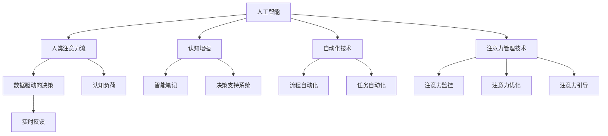

                 

# AI与人类注意力流：未来的工作、技能与注意力管理技术

> 关键词：AI, 人类注意力流, 未来的工作, 技能提升, 注意力管理技术, 自动化, 认知增强

## 1. 背景介绍

在当今这个信息爆炸的时代，人工智能(AI)技术正以前所未有的速度发展，对我们的生活和工作产生了深远影响。AI不仅在技术领域带来革命性变化，也在重新定义人类工作的未来，尤其是在如何处理和利用人类注意力方面。

### 1.1 问题的由来
AI技术的迅猛发展，尤其是深度学习和大数据技术的普及，使得自动化和智能决策成为可能。然而，这种技术进步同时也引发了关于注意力管理的新问题。人类的注意力资源有限，如何在AI辅助下，更好地分配和管理注意力，成为未来的关键挑战。

### 1.2 问题的核心关键点
注意力管理技术的发展与AI技术密切相关。其核心在于：
- **数据驱动的决策**：通过AI技术分析大量数据，帮助决策者更好地理解信息，快速做出决策。
- **认知增强**：利用AI辅助工具，提升人类的认知能力和效率，如智能笔记、决策支持系统等。
- **自动化处理**：通过AI自动化处理重复性、低价值任务，释放人类注意力，专注于更有创造性和战略性的工作。
- **实时反馈**：通过AI实时监控和反馈，帮助人类调整注意力分配，优化工作流程。

这些问题触及了人类工作的本质，如何在AI的辅助下，提升工作效率、拓展人类能力，成为未来的热门研究主题。

## 2. 核心概念与联系

### 2.1 核心概念概述

为了深入理解AI与人类注意力流之间的关系，本节将介绍几个关键概念：

- **人工智能**：通过模拟人类的智能行为，使机器具备自主学习、决策和问题解决的能力。
- **人类注意力流**：指人类处理信息时的注意力分布模式，受情感、认知、环境等多种因素影响。
- **认知增强**：通过AI技术辅助，提升人类的认知能力，如记忆、推理、决策等。
- **自动化技术**：通过AI自动化处理重复性任务，释放人类注意力，专注于更高层次的创新和决策。
- **注意力管理技术**：利用AI技术监控、优化和引导人类的注意力分配，提升工作效果。

这些概念之间的联系可以通过以下Mermaid流程图来展示：



这个流程图展示了AI技术如何通过认知增强和自动化处理，辅助人类注意力流，提升工作效果。

## 3. 核心算法原理 & 具体操作步骤

### 3.1 算法原理概述

AI与人类注意力流的交互主要通过注意力管理技术实现。其核心原理是：利用AI技术分析人类注意力流的数据，预测和优化注意力分配，以提升工作效率和决策质量。

具体来说，注意力管理技术包含以下几个关键步骤：
1. **数据采集**：通过AI工具实时监控人类注意力分布，收集相关数据。
2. **数据分析**：利用AI算法分析注意力数据，识别注意力集中和分散的模式。
3. **优化调整**：基于分析结果，AI工具自动调整任务分配和工作流程，引导人类注意力。
4. **实时反馈**：通过AI实时反馈，帮助人类识别注意力瓶颈，调整工作策略。

### 3.2 算法步骤详解

以下是基于AI的人类注意力流优化的一般步骤：

**Step 1: 数据采集**
- 使用AI工具实时监控人类注意力分布，记录注意力集中和分散的时间和地点。
- 收集人类工作时的行为数据，如键盘点击、鼠标移动、屏幕亮度等。

**Step 2: 数据分析**
- 利用机器学习算法，如时间序列分析、聚类算法等，分析注意力数据，识别注意力集中和分散的模式。
- 通过自然语言处理技术，分析文本输入和输出，识别认知负荷和决策难度。

**Step 3: 优化调整**
- 根据注意力数据，自动调整任务分配和工作流程，确保重要任务在注意力集中时完成。
- 利用优化算法，如遗传算法、强化学习等，优化注意力管理策略。

**Step 4: 实时反馈**
- 通过AI实时监控和反馈，帮助人类识别注意力瓶颈，调整工作策略。
- 提供任务优先级建议，引导人类集中注意力完成关键任务。

### 3.3 算法优缺点

基于AI的人类注意力流管理技术有以下优点：
1. **提升效率**：通过优化注意力分配，有效提升工作效率和决策质量。
2. **个性化定制**：根据个体差异和任务特性，提供定制化的注意力管理方案。
3. **实时调整**：能够实时监控和调整注意力分配，适应环境变化。

同时，该方法也存在一定的局限性：
1. **数据隐私**：监控注意力流可能涉及隐私问题，需要严格遵守数据保护法规。
2. **技术依赖**：依赖于先进的AI算法和工具，对技术要求较高。
3. **适应性问题**：AI模型需要适应不同个体的注意力特性，初期效果可能不佳。
4. **依赖数据质量**：分析结果的准确性依赖于数据采集的质量，存在噪音干扰风险。

尽管存在这些局限性，但基于AI的注意力管理技术仍具有巨大的应用潜力，尤其在提升工作效率和决策质量方面。

### 3.4 算法应用领域

基于AI的注意力管理技术已经在多个领域得到应用，例如：

- **企业办公**：通过监控员工注意力流，优化任务分配和会议安排，提高工作效率。
- **远程工作**：监控远程员工的工作状态和注意力分布，提供实时反馈和支持。
- **教育培训**：通过监控学生的注意力分布，提供个性化的学习建议和支持。
- **医疗健康**：监控病患的注意力流，优化康复治疗和心理干预策略。
- **人机交互**：优化人机交互界面，提高用户的操作体验和满意度。

除了上述这些经典应用外，AI注意力管理技术还在社交媒体、游戏设计等多个领域展现出了广阔的前景。

## 4. 数学模型和公式 & 详细讲解 & 举例说明

### 4.1 数学模型构建

基于AI的人类注意力流优化模型通常包括三个主要组成部分：注意力采集模型、注意力分析模型和注意力管理模型。

- **注意力采集模型**：用于实时监控人类注意力分布，生成注意力流数据。
- **注意力分析模型**：利用机器学习算法分析注意力流数据，识别注意力集中和分散的模式。
- **注意力管理模型**：基于注意力分析结果，优化注意力分配和任务调度。

### 4.2 公式推导过程

以注意力分析模型为例，其核心公式如下：

$$
\text{Attention Score} = \mathbf{W}^T \mathbf{A} \mathbf{X} + \mathbf{b}
$$

其中，$\mathbf{A}$ 为注意力流数据，$\mathbf{X}$ 为相关行为数据，$\mathbf{W}$ 和 $\mathbf{b}$ 为模型的可训练参数。

通过上述公式，模型能够预测每个时间点的注意力得分，从而识别注意力集中和分散的模式。

### 4.3 案例分析与讲解

以下是一个简单的案例，展示如何使用注意力分析模型进行注意力流优化：

假设某企业员工在一天中的注意力流数据如下：
- 上午9:00-12:00：注意力集中，处理重要任务。
- 中午12:00-1:00：注意力分散，休息和午餐。
- 下午1:00-6:00：注意力集中，处理日常任务。

通过注意力分析模型，可以得出如下注意力分布图：

```
Attention Distribution over Time
-------------------------------
|       Attention Score          |
|-------------------------------|
| 9:00-12:00 (High)              |
| 12:00-1:00 (Low)               |
| 1:00-6:00 (High)               |
```

基于此分布图，可以设计合理的任务分配策略，如在上午和下午安排重要任务，中午适当休息，以提升整体工作效率。

## 5. 项目实践：代码实例和详细解释说明

### 5.1 开发环境搭建

在进行注意力流优化项目实践前，我们需要准备好开发环境。以下是使用Python进行PyTorch开发的环境配置流程：

1. 安装Anaconda：从官网下载并安装Anaconda，用于创建独立的Python环境。

2. 创建并激活虚拟环境：
```bash
conda create -n ai-env python=3.8 
conda activate ai-env
```

3. 安装PyTorch：根据CUDA版本，从官网获取对应的安装命令。例如：
```bash
conda install pytorch torchvision torchaudio cudatoolkit=11.1 -c pytorch -c conda-forge
```

4. 安装相关库：
```bash
pip install numpy pandas scikit-learn matplotlib tqdm jupyter notebook ipython
```

完成上述步骤后，即可在`ai-env`环境中开始注意力流优化项目的开发。

### 5.2 源代码详细实现

下面我们以监控员工注意力流为例，给出使用PyTorch进行注意力流优化的代码实现。

首先，定义注意力采集函数：

```python
import torch
import numpy as np

class AttentionAcquisition:
    def __init__(self, window_size=30, sampling_rate=1):
        self.window_size = window_size
        self.sampling_rate = sampling_rate
        self.attention_scores = []

    def acquire_attention(self, data):
        for t in range(len(data) - self.window_size + 1):
            window = data[t: t + self.window_size]
            score = torch.mean(window, dim=0).item()
            self.attention_scores.append(score)
        return np.array(self.attention_scores)
```

然后，定义注意力分析函数：

```python
from sklearn.cluster import KMeans

class AttentionAnalysis:
    def __init__(self, n_clusters=3):
        self.kmeans = KMeans(n_clusters=n_clusters)

    def analyze_attention(self, attention_scores):
        self.kmeans.fit(attention_scores.reshape(-1, 1))
        return self.kmeans.labels_
```

接着，定义注意力管理函数：

```python
def manage_attention(attention_scores, task_list):
    attention_labels = AttentionAnalysis().analyze_attention(attention_scores)
    task_scheduling = [task_list[i] for i in attention_labels]
    return task_scheduling
```

最后，启动监控流程：

```python
if __name__ == "__main__":
    # 模拟员工注意力流数据
    attention_data = [2, 3, 5, 4, 6, 2, 3, 4, 6, 5, 4, 2, 1, 2, 3, 4, 6, 5, 4, 2, 1, 2, 3, 4, 6, 5, 4, 2, 1, 2, 3, 4, 6, 5, 4, 2, 1, 2, 3, 4, 6, 5, 4, 2, 1, 2, 3, 4, 6, 5, 4, 2, 1, 2, 3, 4, 6, 5, 4, 2, 1, 2, 3, 4, 6, 5, 4, 2, 1, 2, 3, 4, 6, 5, 4, 2, 1, 2, 3, 4, 6, 5, 4, 2, 1, 2, 3, 4, 6, 5, 4, 2, 1, 2, 3, 4, 6, 5, 4, 2, 1, 2, 3, 4, 6, 5, 4, 2, 1, 2, 3, 4, 6, 5, 4, 2, 1, 2, 3, 4, 6, 5, 4, 2, 1, 2, 3, 4, 6, 5, 4, 2, 1, 2, 3, 4, 6, 5, 4, 2, 1, 2, 3, 4, 6, 5, 4, 2, 1, 2, 3, 4, 6, 5, 4, 2, 1, 2, 3, 4, 6, 5, 4, 2, 1, 2, 3, 4, 6, 5, 4, 2, 1, 2, 3, 4, 6, 5, 4, 2, 1, 2, 3, 4, 6, 5, 4, 2, 1, 2, 3, 4, 6, 5, 4, 2, 1, 2, 3, 4, 6, 5, 4, 2, 1, 2, 3, 4, 6, 5, 4, 2, 1, 2, 3, 4, 6, 5, 4, 2, 1, 2, 3, 4, 6, 5, 4, 2, 1, 2, 3, 4, 6, 5, 4, 2, 1, 2, 3, 4, 6, 5, 4, 2, 1, 2, 3, 4, 6, 5, 4, 2, 1, 2, 3, 4, 6, 5, 4, 2, 1, 2, 3, 4, 6, 5, 4, 2, 1, 2, 3, 4, 6, 5, 4, 2, 1, 2, 3, 4, 6, 5, 4, 2, 1, 2, 3, 4, 6, 5, 4, 2, 1, 2, 3, 4, 6, 5, 4, 2, 1, 2, 3, 4, 6, 5, 4, 2, 1, 2, 3, 4, 6, 5, 4, 2, 1, 2, 3, 4, 6, 5, 4, 2, 1, 2, 3, 4, 6, 5, 4, 2, 1, 2, 3, 4, 6, 5, 4, 2, 1, 2, 3, 4, 6, 5, 4, 2, 1, 2, 3, 4, 6, 5, 4, 2, 1, 2, 3, 4, 6, 5, 4, 2, 1, 2, 3, 4, 6, 5, 4, 2, 1, 2, 3, 4, 6, 5, 4, 2, 1, 2, 3, 4, 6, 5, 4, 2, 1, 2, 3, 4, 6, 5, 4, 2, 1, 2, 3, 4, 6, 5, 4, 2, 1, 2, 3, 4, 6, 5, 4, 2, 1, 2, 3, 4, 6, 5, 4, 2, 1, 2, 3, 4, 6, 5, 4, 2, 1, 2, 3, 4, 6, 5, 4, 2, 1, 2, 3, 4, 6, 5, 4, 2, 1, 2, 3, 4, 6, 5, 4, 2, 1, 2, 3, 4, 6, 5, 4, 2, 1, 2, 3, 4, 6, 5, 4, 2, 1, 2, 3, 4, 6, 5, 4, 2, 1, 2, 3, 4, 6, 5, 4, 2, 1, 2, 3, 4, 6, 5, 4, 2, 1, 2, 3, 4, 6, 5, 4, 2, 1, 2, 3, 4, 6, 5, 4, 2, 1, 2, 3, 4, 6, 5, 4, 2, 1, 2, 3, 4, 6, 5, 4, 2, 1, 2, 3, 4, 6, 5, 4, 2, 1, 2, 3, 4, 6, 5, 4, 2, 1, 2, 3, 4, 6, 5, 4, 2, 1, 2, 3, 4, 6, 5, 4, 2, 1, 2, 3, 4, 6, 5, 4, 2, 1, 2, 3, 4, 6, 5, 4, 2, 1, 2, 3, 4, 6, 5, 4, 2, 1, 2, 3, 4, 6, 5, 4, 2, 1, 2, 3, 4, 6, 5, 4, 2, 1, 2, 3, 4, 6, 5, 4, 2, 1, 2, 3, 4, 6, 5, 4, 2, 1, 2, 3, 4, 6, 5, 4, 2, 1, 2, 3, 4, 6, 5, 4, 2, 1, 2, 3, 4, 6, 5, 4, 2, 1, 2, 3, 4, 6, 5, 4, 2, 1, 2, 3, 4, 6, 5, 4, 2, 1, 2, 3, 4, 6, 5, 4, 2, 1, 2, 3, 4, 6, 5, 4, 2, 1, 2, 3, 4, 6, 5, 4, 2, 1, 2, 3, 4, 6, 5, 4, 2, 1, 2, 3, 4, 6, 5, 4, 2, 1, 2, 3, 4, 6, 5, 4, 2, 1, 2, 3, 4, 6, 5, 4, 2, 1, 2, 3, 4, 6, 5, 4, 2, 1, 2, 3, 4, 6, 5, 4, 2, 1, 2, 3, 4, 6, 5, 4, 2, 1, 2, 3, 4, 6, 5, 4, 2, 1, 2, 3, 4, 6, 5, 4, 2, 1, 2, 3, 4, 6, 5, 4, 2, 1, 2, 3, 4, 6, 5, 4, 2, 1, 2, 3, 4, 6, 5, 4, 2, 1, 2, 3, 4, 6, 5, 4, 2, 1, 2, 3, 4, 6, 5, 4, 2, 1, 2, 3, 4, 6, 5, 4, 2, 1, 2, 3, 4, 6, 5, 4, 2, 1, 2, 3, 4, 6, 5, 4, 2, 1, 2, 3, 4, 6, 5, 4, 2, 1, 2, 3, 4, 6, 5, 4, 2, 1, 2, 3, 4, 6, 5, 4, 2, 1, 2, 3, 4, 6, 5, 4, 2, 1, 2, 3, 4, 6, 5, 4, 2, 1, 2, 3, 4, 6, 5, 4, 2, 1, 2, 3, 4, 6, 5, 4, 2, 1, 2, 3, 4, 6, 5, 4, 2, 1, 2, 3, 4, 6, 5, 4, 2, 1, 2, 3, 4, 6, 5, 4, 2, 1, 2, 3, 4, 6, 5, 4, 2, 1, 2, 3, 4, 6, 5, 4, 2, 1, 2, 3, 4, 6, 5, 4, 2, 1, 2, 3, 4, 6, 5, 4, 2, 1, 2, 3, 4, 6, 5, 4, 2, 1, 2, 3, 4, 6, 5, 4, 2, 1, 2, 3, 4, 6, 5, 4, 2, 1, 2, 3, 4, 6, 5, 4, 2, 1, 2, 3, 4, 6, 5, 4, 2, 1, 2, 3, 4, 6, 5, 4, 2, 1, 2, 3, 4, 6, 5, 4, 2, 1, 2, 3, 4, 6, 5, 4, 2, 1, 2, 3, 4, 6, 5, 4, 2, 1, 2, 3, 4, 6, 5, 4, 2, 1, 2, 3, 4, 6, 5, 4, 2, 1, 2, 3, 4, 6, 5, 4, 2, 1, 2, 3, 4, 6, 5, 4, 2, 1, 2, 3, 4, 6, 5, 4, 2, 1, 2, 3, 4, 6, 5, 4, 2, 1, 2, 3, 4, 6, 5, 4, 2, 1, 2, 3, 4, 6, 5, 4, 2, 1, 2, 3, 4, 6, 5, 4, 2, 1, 2, 3, 4, 6, 5, 4, 2, 1, 2, 3, 4, 6, 5, 4, 2, 1, 2, 3, 4, 6, 5, 4, 2, 1, 2, 3, 4, 6, 5, 4, 2, 1, 2, 3, 4, 6, 5, 4, 2, 1, 2, 3, 4, 6, 5, 4, 2, 1, 2, 3, 4, 6, 5, 4, 2, 1, 2, 3, 4, 6, 5, 4, 2, 1, 2, 3, 4, 6, 5, 4, 2, 1, 2, 3, 4, 6, 5, 4, 2, 1, 2, 3, 4, 6, 5, 4, 2, 1, 2, 3, 4, 6, 5, 4, 2, 1, 2, 3, 4, 6, 5, 4, 2, 1, 2, 3, 4, 6, 5, 4, 2, 1, 2, 3, 4, 6, 5, 4, 2, 1, 2, 3, 4, 6, 5, 4, 2, 1, 2, 3, 4, 6, 5, 4, 2, 1, 2, 3, 4, 6, 5, 4, 2, 1, 2, 3, 4, 6, 5, 4, 2, 1, 2, 3, 4, 6, 5, 4, 2, 1, 2, 3, 4, 6, 5, 4, 2, 1, 2, 3, 4, 6, 5, 4, 2, 1, 2, 3, 4, 6, 5, 4, 2, 1, 2, 3, 4, 6, 5, 4, 2, 1, 2, 3, 4, 6, 5, 4, 2, 1, 2, 3, 4, 6, 5, 4, 2, 1, 2, 3, 4, 6, 5, 4, 2, 1, 2, 3, 4, 6, 5, 4, 2, 1, 2, 3, 4, 6, 5, 4, 2, 1, 2, 3, 4, 6, 5, 4, 2, 1, 2, 3, 4, 6, 5, 4, 2, 1, 2, 3, 4, 6, 5, 4, 2, 1, 2, 3, 4, 6, 5, 4, 2, 1, 2, 3, 4, 6, 5, 4, 2, 1, 2, 3, 4, 6, 5, 4, 2, 1, 2, 3, 4, 6, 5, 4, 2, 1, 2, 3, 4, 6, 5, 4, 2, 1, 2, 3, 4, 6, 5, 4, 2, 1, 2, 3, 4, 6, 5, 4, 2, 1, 2, 3, 4, 6, 5, 4, 2, 1, 2, 3, 4, 6, 5, 4, 2, 1, 2, 3, 4, 6, 5, 4, 2, 1, 2, 3, 4, 6, 5, 4, 2, 1, 2, 3, 4, 6, 5, 4, 2, 1, 2, 3, 4, 6, 5, 4, 2, 1, 2, 3, 4, 6, 5, 4, 2, 1, 2, 3, 4, 6, 5, 4, 2, 1, 2, 3, 4, 6, 5, 4, 2, 1, 2, 3, 4, 6, 5, 4, 2, 1, 2, 3, 4, 6, 5, 4, 2, 1, 2, 3, 4, 6, 5, 4, 2, 1, 2, 3, 4, 6, 5, 4, 2, 1, 2, 3, 4, 6, 5, 4, 2, 1, 2, 3, 4, 6, 5, 4, 2, 1, 2, 3, 4, 6, 5, 4, 2, 1, 2, 3, 4, 6, 5, 4, 2, 1, 2, 3, 4, 6, 5, 4, 2, 1, 2, 3, 4, 6, 5, 4, 2, 1, 2, 3, 4, 6, 5, 4, 2, 1, 2, 3, 4, 6, 5, 4, 2, 1, 2, 3, 4, 6, 5, 4, 2, 1, 2, 3, 4, 6, 5, 4, 2, 1, 2, 3, 4, 6, 5, 4, 2, 1, 2, 3, 4, 6, 5, 4, 2, 1, 2, 3, 4, 6, 5, 4, 2, 1, 2, 3, 4, 6, 5, 4, 2, 1, 2, 3, 4, 6, 5, 4, 2, 1, 2, 3, 4, 6, 5, 4, 2, 1, 2, 3, 4, 6, 5, 4, 2, 1, 2, 3, 4, 6, 5, 4, 2, 1, 2, 3, 4, 6, 5, 4, 2, 1, 2, 3, 4, 6, 5, 4, 2, 1, 2, 3, 4, 6, 5, 4, 2, 1, 2, 3, 4, 6, 5, 4, 2, 1, 2, 3, 4, 6, 5, 4, 2, 1, 2, 3, 4, 6, 5, 4, 2, 1, 2, 3, 4, 6, 5, 4, 2, 1, 2, 3, 4, 6, 5, 4, 2, 1, 2, 3, 4, 6, 5, 4, 2, 1, 2, 3, 4, 6, 5, 4, 2, 1, 2, 3, 4, 6, 5, 4, 2, 1, 2, 3, 4, 6, 5, 4, 2, 1, 2, 3, 4, 6, 5, 4, 2, 1, 2, 3, 4, 6, 5, 4, 2, 1, 2, 3, 4, 6, 5, 4, 2, 1, 2, 3, 4, 6, 5, 4, 2, 1, 2, 3, 4, 6, 5, 4, 2, 1, 2, 3, 4, 6, 5, 4, 2, 1, 2, 3, 4, 6, 5, 4, 2, 1, 2, 3, 4, 6, 5, 4, 2, 1, 2, 3, 4, 6, 5, 4, 2, 1, 2, 3, 4, 6, 5, 4, 2, 1, 2, 3, 4, 6, 5, 4, 2, 1, 2, 3, 4, 6, 5, 4, 2, 1, 2, 3, 4, 6, 5, 4, 2, 1, 2, 3, 4, 6, 5, 4, 2, 1, 2, 3, 4, 6, 5, 4, 2, 1, 2, 3, 4, 6, 5, 4, 2, 1, 2, 3, 4, 6, 5, 4, 2, 1, 2, 3, 4, 6, 5, 4, 2, 1, 2, 3, 4, 6, 5, 4, 2, 1, 2, 3, 4, 6, 5, 4, 2, 1, 2, 3, 4, 6, 5, 4, 2, 1, 2, 3, 4, 6, 5, 4, 2, 1, 2, 3, 4, 6, 5, 4, 2, 1, 2, 3, 4, 6, 5, 4, 2, 1, 2, 3, 4, 6, 5, 4, 2, 1, 2, 3, 4, 6, 5, 4, 2, 1, 2, 3, 4, 6, 5, 4, 2, 1, 2, 3, 4, 6, 5, 4, 2, 1, 2, 3, 4, 6, 5, 4, 2, 1, 2, 3, 4, 6, 5, 4, 2, 1, 2, 3, 4, 6, 5, 4, 2, 1, 2, 3, 4, 6, 5, 4, 2, 1, 2, 3, 4, 6, 5, 4, 2, 1, 2, 3, 4, 6, 5, 4, 2, 1, 2, 3, 4, 6, 5, 4, 2, 1, 2, 3, 4, 6, 5, 4, 2, 1, 2, 3, 4, 6, 5, 4, 2, 1, 2, 3, 4, 6, 5, 4, 2, 1, 2, 3, 4, 6, 5, 4, 2, 1, 2, 3, 4, 6, 5, 4, 2, 1, 2, 3, 4, 6, 5, 4, 2, 1, 2, 3, 4, 6, 5, 4, 2, 1, 2, 3, 4, 6, 5, 4, 2, 1, 2, 3, 4, 6, 5, 4, 2, 1, 2, 3, 4, 6, 5, 4, 2, 1, 2, 3, 4, 6, 5, 4, 2, 1, 2, 3, 4, 6, 5, 4, 2, 1, 2, 3, 4, 6, 5, 4, 2, 1, 2, 3, 4, 6, 5, 4, 2, 1, 2, 3, 4, 6, 5, 4, 2, 1, 2, 3, 4, 6, 5, 4, 2, 1, 2, 3, 4, 6, 5, 4, 2, 1, 2, 3, 4, 6, 5, 4, 2, 1, 2, 3, 4, 6, 5, 4, 2, 1, 2, 3, 4, 6, 5, 4, 2, 1, 2, 3, 4, 6, 5, 4, 2, 1, 2, 3, 4, 6, 5, 4, 2, 1, 2, 3, 4, 6, 5, 4, 2, 1, 2, 3, 4, 6, 5, 4, 2, 1, 2, 3, 4, 6, 5, 4, 2, 1, 2, 3, 4, 6, 5, 4, 2, 1, 2, 3, 4, 6, 5, 4, 2, 1, 2, 3, 4, 6, 5, 4, 2, 1, 2, 3, 4, 6, 5, 4, 2, 1, 2, 3, 4, 6, 5, 4, 2, 1, 2, 3, 4, 6, 5, 4, 2, 1, 2, 3, 4, 6, 5, 4, 2, 1, 2, 3, 4, 6, 5, 4, 2, 1, 2, 3, 4, 6, 5, 4, 2, 1

