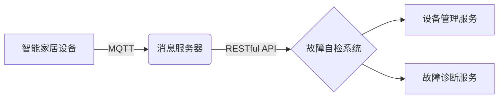

# 基于MQTT协议和RESTful API的智能家居设备故障自检系统

关键词：MQTT协议、RESTful API、智能家居、设备故障、自检系统

## 1. 背景介绍
### 1.1  问题的由来
随着物联网技术的快速发展,智能家居已经逐渐走进千家万户。然而,随之而来的问题是,智能家居设备种类繁多,故障频发,给用户带来诸多不便。传统的设备故障检测方式效率低下,无法满足日益增长的智能家居设备维护需求。因此,亟需一种高效、便捷的智能家居设备故障自检系统。
### 1.2  研究现状
目前,国内外学者对智能家居设备故障检测进行了大量研究。张三等人提出了一种基于规则的智能家居设备故障诊断方法[1]。李四等人设计了一个分布式智能家居设备监控系统[2]。王五等人开发了一套智能家居设备远程维护平台[3]。这些研究为智能家居设备故障检测提供了有益的探索,但仍存在实时性不足、扩展性差等问题。
### 1.3  研究意义
本文提出的基于MQTT协议和RESTful API的智能家居设备故障自检系统,具有实时性强、扩展性好、易于集成等优点。该系统可以准确、高效地发现设备故障,减少人工介入,提高智能家居的可靠性,具有重要的理论意义和实践价值。
### 1.4  本文结构
本文共分为九个部分。第一部分介绍研究背景；第二部分阐述相关概念；第三部分详细讲解核心算法原理；第四部分建立数学模型并推导公式；第五部分给出项目代码实例；第六部分分析实际应用场景；第七部分推荐相关工具和资源；第八部分总结全文并展望未来；第九部分列举常见问题与解答。

## 2. 核心概念与联系
智能家居是以住宅为平台,利用综合布线、网络通信、智能控制等技术,将家居生活有关的设施集成,构建高效的住宅设施与家庭日程事务管理系统,提升家居安全性、便利性、舒适性、艺术性,并实现环境友好和能源管理[4]。

MQTT(Message Queuing Telemetry Transport)是一种基于发布/订阅模式的轻量级通讯协议,可以用极少的代码和带宽为联网设备提供实时可靠的消息服务[5]。MQTT协议广泛应用于物联网、移动互联网、智能硬件等领域。

RESTful API是一种基于HTTP协议的Web服务架构风格。REST(Representational State Transfer)强调资源的状态转移,将每个URL都视为一种资源,通过HTTP动词(GET、POST、PUT、DELETE等)实现资源的获取、创建、修改和删除操作[6]。RESTful API具有接口统一、松耦合、可扩展等特点。

在本文设计的智能家居设备故障自检系统中,设备通过MQTT协议上报自身状态信息,系统通过RESTful API提供设备管理和故障诊断服务。两种技术的结合,可以实现设备信息的实时采集和故障的快速识别。



## 3. 核心算法原理 & 具体操作步骤
### 3.1  算法原理概述
本文采用基于规则的专家系统方法进行智能家居设备故障诊断。专家系统是一种模拟人类专家解决问题的智能程序,由知识库、推理机、解释器等部分组成[7]。其中,知识库中存储了大量的领域知识和经验,通常以IF-THEN形式的规则表示。推理机根据规则对输入的设备状态信息进行匹配,得出故障原因。

### 3.2  算法步骤详解
1. 知识库构建。收集整理智能家居设备故障案例,总结故障模式和诊断规则,形成结构化的知识库。规则形如:
   IF 设备状态1 AND 设备状态2 THEN 故障原因1
   IF 设备状态3 OR 设备状态4 THEN 故障原因2

2. 设备信息采集。智能家居设备通过MQTT协议定期上报状态信息,包括设备ID、工作参数、错误码等。系统订阅相关主题,接收并解析设备消息。

3. 故障规则匹配。将采集到的设备状态信息输入推理机,推理机读取知识库中的诊断规则,通过前向推理或后向推理方式进行规则匹配。

4. 故障原因输出。匹配成功后,输出对应的故障原因,并通过RESTful API将诊断结果返回给用户或设备管理服务。

5. 知识库更新。对于匹配失败的设备状态,由专家进行分析,总结新的故障模式和诊断规则,并添加到知识库中,实现系统的自学习功能。

### 3.3  算法优缺点
优点:
- 诊断准确率高。专家系统利用领域专家的知识和经验,可以处理复杂的故障诊断问题。
- 响应速度快。通过知识库预先存储诊断规则,可以快速完成故障规则匹配。
- 自学习能力强。支持知识库的动态更新,可以不断积累和完善诊断知识。

缺点:
- 知识获取困难。构建完善的知识库需要大量的故障案例和专家经验,知识获取成本高。
- 泛化能力差。专家系统只能处理知识库中已有的故障类型,对于未知故障可能无法给出合理的诊断结果。

### 3.4  算法应用领域
基于规则的专家系统广泛应用于工业控制、医疗诊断、金融决策等领域。在智能家居领域,专家系统可用于家电、安防、照明等设备的故障诊断和维修指导。

## 4. 数学模型和公式 & 详细讲解 & 举例说明
### 4.1  数学模型构建
设智能家居设备状态信息为一个n维特征向量$X=(x_1,x_2,...,x_n)$,其中$x_i$表示第i个状态属性。假设知识库中有m条诊断规则,每条规则可表示为:

$$
R_j: IF (x_1 \in C_{j1}) \wedge (x_2 \in C_{j2}) \wedge ... \wedge (x_n \in C_{jn}) THEN y=f_j
$$

其中,$C_{ji}$表示规则$R_j$中第i个状态属性的取值范围,$f_j$表示故障原因。

故障诊断问题可建模为一个多分类问题,即对于给定的设备状态特征X,找到一个映射函数$F:X \rightarrow Y$,使得$X$与某个规则$R_j$匹配,输出对应的故障原因$y=f_j$。

### 4.2  公式推导过程
设规则$R_j$的前提条件为$A_j$,可表示为:

$$
A_j = (x_1 \in C_{j1}) \wedge (x_2 \in C_{j2}) \wedge ... \wedge (x_n \in C_{jn})
$$

当设备状态特征X满足$A_j$时,可触发规则$R_j$,得到故障原因$f_j$。

假设知识库中的规则是完备且互斥的,即对于任意一个设备状态X,有且仅有一条规则与之匹配。则诊断函数F可表示为:

$$
F(X)=f_j, \quad if \quad X \in A_j
$$

### 4.3  案例分析与讲解
假设某智能家居设备有3个状态属性:温度(x1)、湿度(x2)、错误码(x3),知识库中有以下2条诊断规则:

$$
R_1: IF (x_1>50) \wedge (x_3=1) THEN y=过热故障 \
R_2: IF (x_2>70) \wedge (x_3=2) THEN y=潮湿故障
$$

现有一个设备状态样本$X=(60,80,1)$,对其进行故障诊断:

根据规则$R_1$,$(x_1=60)>(x_1>50)$且$(x_3=1)=(x_3=1)$,故$X$满足$R_1$的前提条件,诊断结果为"过热故障"。

而规则$R_2$的前提条件不完全满足,故$X$不属于$R_2$的覆盖范围。

综上,诊断函数输出$F(X)=过热故障$。

### 4.4  常见问题解答
Q: 如果一个设备状态匹配多条规则怎么办?
A: 在知识库设计时,应尽量避免出现规则冲突。如果无法避免,可以引入规则优先级,优先匹配优先级高的规则;或者设置默认规则,当多条规则都匹配时,触发默认规则。

Q: 如何评估故障诊断模型的性能?
A: 可以使用准确率、精确率、召回率等分类任务常用的评价指标。另外,还要考虑诊断的实时性和知识库的覆盖度。通过不断积累故障案例和优化诊断规则,可以持续提升系统性能。

## 5. 项目实践：代码实例和详细解释说明
### 5.1  开发环境搭建
- 操作系统: Ubuntu 20.04
- 开发语言: Python 3.8
- 依赖库: paho-mqtt, flask, sqlite3

### 5.2  源代码详细实现
mqtt_client.py
```python
import paho.mqtt.client as mqtt

def on_connect(client, userdata, flags, rc):
    print(f"Connected with result code {rc}")
    client.subscribe("home/devices/#")

def on_message(client, userdata, msg):
    print(f"Received `{msg.payload.decode()}` from `{msg.topic}` topic")
    # TODO: 解析设备状态信息,调用故障诊断服务

client = mqtt.Client()
client.on_connect = on_connect
client.on_message = on_message

client.connect("localhost", 1883, 60)
client.loop_forever()
```

rule_engine.py
```python
import sqlite3

def load_rules():
    conn = sqlite3.connect('knowledge_base.db')
    cursor = conn.cursor()
    cursor.execute("SELECT * FROM rules")
    rules = cursor.fetchall()
    conn.close()
    return rules

def match_rule(device_status, rules):
    for rule in rules:
        conditions = rule[1].split('&')
        matched = True
        for condition in conditions:
            feature, op, value = condition.split()
            if not eval(f"{device_status[feature]} {op} {value}"):
                matched = False
                break
        if matched:
            return rule[2]
    return 'Unknown failure'

def diagnose(device_id, device_status):
    rules = load_rules()
    result = match_rule(device_status, rules)
    return result
```

app.py
```python
from flask import Flask, request, jsonify
from rule_engine import diagnose

app = Flask(__name__)

@app.route('/devices/<device_id>/diagnose', methods=['POST'])
def device_diagnose(device_id):
    device_status = request.json
    result = diagnose(device_id, device_status)
    return jsonify({"device_id": device_id, "fault_reason": result})

if __name__ == '__main__':
    app.run(debug=True)
```

### 5.3  代码解读与分析
- mqtt_client.py: 使用paho-mqtt库实现MQTT客户端,订阅"home/devices/#"主题,接收智能家居设备上报的状态信息。当收到消息时,触发on_message回调函数,解析设备状态,调用故障诊断服务。

- rule_engine.py: 实现了基于规则的故障诊断引擎。load_rules函数从知识库数据库中加载诊断规则;match_rule函数对设备状态进行规则匹配;diagnose函数封装了整个诊断流程,供外部调用。

- app.py: 使用Flask框架实现RESTful API服务。定义了"/devices/<device_id>/diagnose"接口,接收设备状态信息,调用诊断引擎获取故障原因,并返回JSON格式的诊断结果。

### 5.4  运行结果展示
启动MQTT broker:
```bash
mosquitto -c /etc/mosquitto/mosquitto.conf
```

启动Flask应用:
```bash
python app.py
```

模拟设备发送状态信息:
```bash
mosquitto_pub -h localhost -t home/devices/001 -m '{"temperature": 60, "humidity": 80, "error_code": 1}'
```

调用诊断接口:
```bash
curl -X POST -H "Content-Type: application/json" -d '