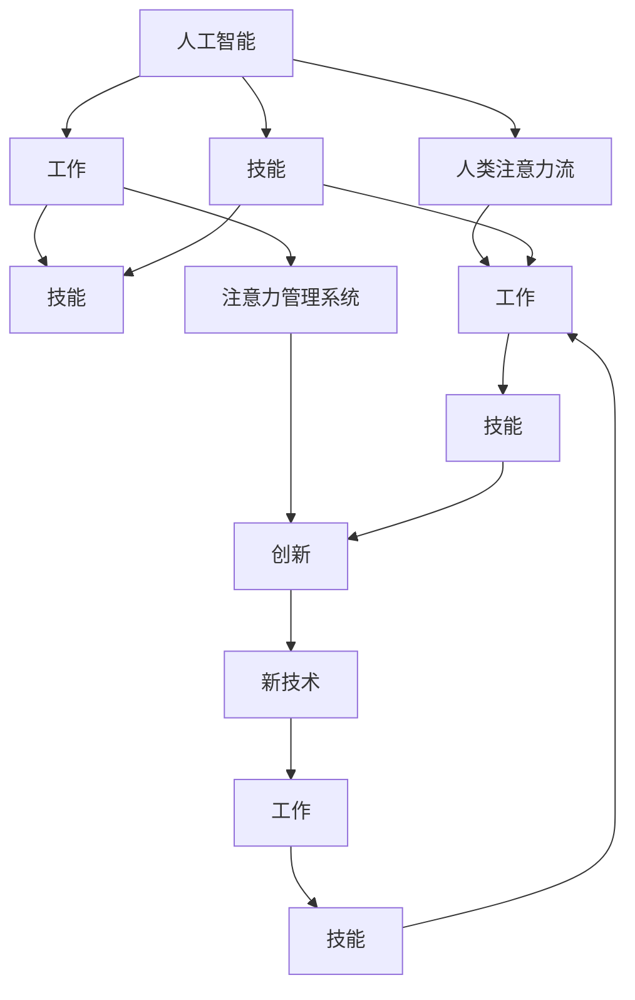

                 

# AI与人类注意力流：未来的工作、技能与注意力管理系统与创新

> 关键词：人工智能,人类注意力流,工作,技能,注意力管理,创新

## 1. 背景介绍

### 1.1 问题由来
随着人工智能（AI）技术的飞速发展，人们已经意识到其对社会生产力和工作方式的影响。AI不仅在自动驾驶、医疗诊断、金融分析等领域展现了巨大的潜力，也开始深入到更为日常的工作和生活中。AI技术能够处理海量数据，优化决策过程，显著提高工作效率。然而，AI技术在提升工作效能的同时，也带来了新的挑战和问题。

AI对人类工作方式的变革最为显著的表现之一是自动化，即通过算法和机器学习替代人类重复性的、规则明确的任务。这虽然在一定程度上减少了人工劳动，但也可能导致就业岗位的变化和减少，尤其是在一些高技能岗位上。与此同时，随着工作复杂性的增加，对人类创造力和问题解决能力的需求也在不断提升，但人类的注意力管理能力却未见显著提升。

### 1.2 问题核心关键点
1. **人类注意力流与AI的融合**：AI技术的引入改变了人类的工作模式，但其对人类注意力流的影响尚不完全明确。
2. **未来的工作形态**：AI的发展将如何改变未来的工作、技能需求和注意力管理机制？
3. **注意力管理系统的创新**：如何利用AI技术提升人类的注意力管理能力？
4. **人工智能与人类创新的互动**：AI如何与人类创新活动互动，共同推动新的技术和理念的诞生？

### 1.3 问题研究意义
研究AI与人类注意力流的互动，对于理解未来工作方式的变迁、技能需求的变化以及注意力管理系统的创新具有重要意义：

1. **工作方式转型**：帮助人们更好地适应AI带来的工作模式变化，确保工作稳定性。
2. **技能升级**：引导人力资源管理策略，进行适时的技能升级和人才培养，以应对AI带来的挑战。
3. **注意力管理**：为提升人类注意力管理能力提供科学依据和技术工具，提升工作效率和生活质量。
4. **创新驱动**：探索AI与人类创新的相互作用，推动新的技术理念和应用场景的产生。

## 2. 核心概念与联系

### 2.1 核心概念概述

为了更好地理解AI与人类注意力流的互动，本节将介绍几个核心概念：

- **人工智能（AI）**：指通过计算机算法和数据处理来模拟人类智能，包括感知、学习、推理和决策等能力。
- **人类注意力流（Attention Flow）**：指人类在处理信息时，注意力在信息流中的分配和流转。人类通过注意力流来完成复杂的认知任务。
- **工作（Work）**：指人类在一定时间和空间内，通过劳动实现目标的行为。
- **技能（Skills）**：指人类完成任务所需的能力和知识，分为硬技能和软技能。
- **注意力管理系统（Attention Management System）**：指利用AI技术辅助人类进行注意力管理，提升工作效率和质量的系统。
- **创新（Innovation）**：指新知识、新方法、新理念的生成和应用，推动社会进步和经济发展。

这些核心概念之间的逻辑关系可以通过以下Mermaid流程图来展示：



这个流程图展示了一系列概念之间的关联和互动关系：

1. AI通过技术手段模拟人类智能，影响人类的工作方式和注意力流。
2. AI驱动的工作变化，需要人类掌握新的技能。
3. 注意力管理系统帮助人类更好地管理注意力流，提升工作效率。
4. AI与人类创新共同推动新知识和新方法的产生。

这些概念共同构成了AI与人类注意力流互动的理论基础，有助于理解未来工作、技能与注意力管理的变革。

## 3. 核心算法原理 & 具体操作步骤
### 3.1 算法原理概述

AI与人类注意力流的互动主要通过两个层面实现：一是通过AI技术优化工作流程，二是通过注意力管理系统提升人类注意力管理能力。

**AI优化工作流程**：AI通过自动化和智能化算法，替代或辅助人类处理信息，提高信息处理的效率和准确性。例如，机器学习算法可以处理大规模数据，识别模式和趋势，帮助人类做出决策。

**注意力管理系统提升注意力管理能力**：AI可以通过数据分析和模型训练，帮助人类识别和预测注意力流中的瓶颈和瓶颈原因，提供优化策略。例如，基于机器学习的注意力预测模型可以分析人类在处理不同任务时的注意力分布，提供最优注意力分配策略。

### 3.2 算法步骤详解

#### AI优化工作流程
1. **数据收集**：收集工作相关的数据，包括任务执行时间、执行步骤、资源消耗等。
2. **算法训练**：使用机器学习算法训练模型，分析数据并发现规律。
3. **模型优化**：根据优化目标调整模型参数，提高模型预测精度和执行效率。
4. **应用部署**：将优化后的模型应用于实际工作流程中，实时监控和反馈优化效果。

#### 注意力管理系统
1. **注意力数据收集**：使用可穿戴设备或传感器收集人类在工作中的注意力数据，如眼动轨迹、脑电波等。
2. **数据分析**：对收集到的数据进行分析，识别注意力流的瓶颈和规律。
3. **模型训练**：使用机器学习模型训练注意力预测模型，预测未来注意力流分布。
4. **优化策略生成**：根据注意力预测模型，生成最优的注意力分配策略。
5. **策略应用**：将注意力优化策略应用到实际工作中，提升注意力管理效果。

### 3.3 算法优缺点
**AI优化工作流程的优缺点**

优点：
1. **效率提升**：AI可以自动处理大量重复性、低价值的工作，提升工作效率。
2. **准确性提高**：AI算法通过数据分析和模式识别，可以提供高精度的决策支持。
3. **实时反馈**：AI系统可以实时监控和调整工作流程，确保任务按时完成。

缺点：
1. **依赖技术**：AI系统的优化效果高度依赖于算法和数据质量。
2. **透明度不足**：AI决策过程复杂，难以解释和理解。
3. **成本高昂**：AI系统开发和维护成本较高，需要专业人才和资源支持。

**注意力管理系统的优缺点**

优点：
1. **个性化优化**：基于个体差异的数据分析，提供个性化的注意力管理策略。
2. **实时调整**：系统可以实时监控注意力流，及时调整注意力分配策略。
3. **提升注意力质量**：帮助人类识别注意力瓶颈，提升注意力集中度。

缺点：
1. **数据隐私**：注意力数据涉及个人隐私，数据收集和处理需要严格保护。
2. **依赖设备**：系统依赖于可穿戴设备或传感器的性能和数据质量。
3. **算法复杂性**：注意力预测模型复杂，需要大量的数据和计算资源。

### 3.4 算法应用领域

AI与人类注意力流的互动在多个领域都有应用，例如：

- **制造业**：通过AI优化生产流程，提升生产效率。
- **金融业**：利用AI进行风险评估和投资决策，提升金融服务质量。
- **医疗健康**：AI辅助诊断和治疗，提升医疗服务水平。
- **教育培训**：利用AI进行个性化教学，提升学习效果。
- **人力资源管理**：AI辅助员工招聘和培训，优化人力资源配置。
- **交通运输**：AI优化交通流量，提升交通安全和效率。

此外，AI与人类注意力流的互动还在更多领域展现其潜力，为各行各业带来变革性影响。

## 4. 数学模型和公式 & 详细讲解 & 举例说明
### 4.1 数学模型构建

为了更好地理解AI与人类注意力流的互动，我们需要构建数学模型来描述这一过程。

假设有一个简单的任务，需要人类执行n个步骤，每个步骤需要注意力集中度为$A_i$，耗时为$T_i$。设人类当前注意力集中度为$A$，任务总耗时为$T$。

**注意力管理系统的优化目标**：

$$
\min_{A} \left\{ \sum_{i=1}^n A_i \right\} \quad \text{subject to} \quad \sum_{i=1}^n A_iT_i \leq T
$$

即在满足总耗时限制的前提下，最小化注意力集中度的总和。

### 4.2 公式推导过程

根据上述优化问题，我们可以推导出注意力管理系统的优化策略。

首先，我们可以将注意力集中度$A$和耗时$T$的关系表示为线性方程：

$$
A = k \cdot T
$$

其中$k$为常数，表示注意力集中度随时间增加的速率。

其次，我们可以根据注意力集中度的总和和总耗时，推导出优化策略：

$$
\min_{T} \left\{ \sum_{i=1}^n kT_i \right\} \quad \text{subject to} \quad k\sum_{i=1}^n T_i \leq T
$$

这意味着我们需要找到一个最优的任务执行时间分配，使得注意力集中度的总和最小，同时满足总耗时限制。

### 4.3 案例分析与讲解

假设一个任务包含三个步骤，每个步骤的耗时分别为5分钟、10分钟和15分钟，注意力集中度分别为2、3和4。如果总耗时限制为30分钟，那么按照上述优化目标，人类最优的注意力分配策略为：

1. 第一步耗时5分钟，注意力集中度为$k \cdot 5 = 2$。
2. 第二步耗时10分钟，注意力集中度为$k \cdot 10 = 3$。
3. 第三步耗时15分钟，注意力集中度为$k \cdot 15 = 4$。

这种分配方式可以最小化注意力集中度的总和，同时满足总耗时限制。

## 5. 项目实践：代码实例和详细解释说明
### 5.1 开发环境搭建

在进行AI与人类注意力流的互动项目实践前，我们需要准备好开发环境。以下是使用Python进行PyTorch开发的环境配置流程：

1. 安装Anaconda：从官网下载并安装Anaconda，用于创建独立的Python环境。

2. 创建并激活虚拟环境：
```bash
conda create -n pytorch-env python=3.8 
conda activate pytorch-env
```

3. 安装PyTorch：根据CUDA版本，从官网获取对应的安装命令。例如：
```bash
conda install pytorch torchvision torchaudio cudatoolkit=11.1 -c pytorch -c conda-forge
```

4. 安装TensorBoard：
```bash
pip install tensorboard
```

5. 安装Matplotlib和Pandas：
```bash
pip install matplotlib pandas
```

完成上述步骤后，即可在`pytorch-env`环境中开始项目实践。

### 5.2 源代码详细实现

下面我们以一个简单的注意力管理系统为例，给出使用PyTorch进行注意力预测的代码实现。

```python
import torch
import torch.nn as nn
import torch.optim as optim
import numpy as np
import matplotlib.pyplot as plt

class AttentionModel(nn.Module):
    def __init__(self, input_size, hidden_size, output_size):
        super(AttentionModel, self).__init__()
        self.hidden_size = hidden_size
        self.W = nn.Linear(input_size, hidden_size)
        self.U = nn.Linear(hidden_size, output_size)
        self.softmax = nn.Softmax(dim=1)
    
    def forward(self, x):
        h = torch.tanh(self.W(x))
        a = self.softmax(torch.bmm(h.unsqueeze(0), h.unsqueeze(1)))
        out = self.U(h)
        return out, a

input_size = 5
hidden_size = 8
output_size = 3

model = AttentionModel(input_size, hidden_size, output_size)
optimizer = optim.Adam(model.parameters(), lr=0.01)

# 假设任务耗时和注意力集中度的数据
task_times = np.array([[5, 10, 15]])
attention_rates = np.array([[2, 3, 4]])

# 将数据转换为tensor
task_times_tensor = torch.FloatTensor(task_times)
attention_rates_tensor = torch.FloatTensor(attention_rates)

# 训练过程
for epoch in range(1000):
    optimizer.zero_grad()
    outputs, attentions = model(task_times_tensor)
    loss = nn.functional.mse_loss(outputs, attention_rates_tensor)
    loss.backward()
    optimizer.step()

    if (epoch + 1) % 100 == 0:
        print(f'Epoch {epoch+1}, Loss: {loss.item()}')

# 测试过程
test_task_times = np.array([[7, 8, 9]])
test_attention_rates = np.array([[3, 3, 3]])

test_task_times_tensor = torch.FloatTensor(test_task_times)
test_attention_rates_tensor = torch.FloatTensor(test_attention_rates)

test_outputs, test_attentions = model(test_task_times_tensor)
test_loss = nn.functional.mse_loss(test_outputs, test_attention_rates_tensor)

print(f'Test Loss: {test_loss.item()}')
```

这段代码实现了一个简单的注意力预测模型，包含一个线性变换层、一个softmax层和一个输出层。在训练过程中，模型通过最小化均方误差损失函数来优化权重，使得预测的注意力集中度尽可能接近真实值。在测试过程中，模型对新的任务耗时和注意力集中度进行预测，并计算预测误差。

### 5.3 代码解读与分析

让我们再详细解读一下关键代码的实现细节：

**AttentionModel类**：
- `__init__`方法：初始化模型的线性变换层、softmax层和输出层。
- `forward`方法：定义前向传播过程，包括线性变换、softmax计算和输出计算。

**优化器选择**：
- 使用Adam优化器进行参数优化，学习率为0.01。

**数据准备**：
- 将任务耗时和注意力集中度的数据转换为tensor，并传入模型进行训练和测试。

**训练过程**：
- 每个epoch中，使用优化器更新模型参数，计算均方误差损失，并输出当前epoch的损失。

**测试过程**：
- 使用训练好的模型对新的任务数据进行预测，计算预测误差。

可以看出，利用PyTorch实现注意力管理系统相对简洁，但实际应用中还需要考虑更多的细节，如模型选择、超参数调优、模型验证等。

## 6. 实际应用场景
### 6.1 智能客服系统

基于AI与人类注意力流的互动，智能客服系统可以实现更高效、更个性化的客户服务。传统的客服系统依赖于人工调度，容易因工作人员注意力分散而影响服务质量。通过AI辅助注意力管理，智能客服系统可以实时监控和调整客户请求的分配，确保客户能够快速得到回应。

### 6.2 医疗健康

在医疗领域，AI可以帮助医生更好地管理患者的注意力，提升诊疗效果。例如，通过监测患者的生理指标，AI可以预测患者的注意力状态，及时提醒医生注意患者的变化，避免误诊或漏诊。

### 6.3 教育培训

在教育领域，AI可以根据学生的注意力状态，调整教学内容和节奏，提升学习效果。通过分析学生的注意力数据，AI可以为每个学生定制个性化的学习计划，确保学生能够专注地学习。

### 6.4 未来应用展望

随着AI与人类注意力流的互动技术不断进步，未来将在更多领域展现其潜力，带来新的工作模式和生活方式。

- **自动化与人类协作**：AI可以在复杂任务中辅助人类，提升工作效率和质量。
- **个性化与定制化**：AI可以根据个体差异，提供个性化的工作、学习和生活方案，提升人类幸福感。
- **创新驱动**：AI与人类创新共同推动新知识和新方法的产生，加速社会进步。

## 7. 工具和资源推荐
### 7.1 学习资源推荐

为了帮助开发者系统掌握AI与人类注意力流的互动技术，这里推荐一些优质的学习资源：

1. **《人工智能基础》**：斯坦福大学吴恩达教授的Coursera课程，全面介绍了AI的基本概念和应用。
2. **《深度学习》**：斯坦福大学Andrew Ng教授的Coursera课程，介绍了深度学习的原理和应用。
3. **《深度学习实战》**：李沐的GitHub项目，提供了深度学习模型实现的代码和案例。
4. **《深度学习与人工智能》**：张志华的博客，系统介绍了深度学习和AI的理论和实践。
5. **《注意力机制在深度学习中的应用》**：李沐的博客，介绍了注意力机制在深度学习中的应用和实现。

通过对这些资源的学习实践，相信你一定能够快速掌握AI与人类注意力流的互动技术的精髓，并用于解决实际的AI问题。

### 7.2 开发工具推荐

高效的开发离不开优秀的工具支持。以下是几款用于AI与人类注意力流互动开发的常用工具：

1. **PyTorch**：基于Python的开源深度学习框架，灵活的计算图设计，适合快速迭代研究。
2. **TensorBoard**：TensorFlow配套的可视化工具，实时监控模型训练过程，提供丰富的图表展示。
3. **Matplotlib**：Python的数据可视化库，可用于绘制注意力分布图和损失曲线图。
4. **Pandas**：Python的数据处理库，可用于数据分析和数据清洗。
5. **TensorFlow**：由Google主导开发的深度学习框架，易于部署，适合大规模工程应用。

合理利用这些工具，可以显著提升AI与人类注意力流互动项目的开发效率，加快创新迭代的步伐。

### 7.3 相关论文推荐

AI与人类注意力流的互动技术的发展源于学界的持续研究。以下是几篇奠基性的相关论文，推荐阅读：

1. **Attention is All You Need**：提出Transformer结构，开启了NLP领域的预训练大模型时代。
2. **Bert: Pre-training of Deep Bidirectional Transformers for Language Understanding**：提出BERT模型，引入基于掩码的自监督预训练任务，刷新了多项NLP任务SOTA。
3. **Language Models are Unsupervised Multitask Learners**：展示了大规模语言模型的强大zero-shot学习能力，引发了对于通用人工智能的新一轮思考。
4. **Prefix-Tuning: Optimizing Continuous Prompts for Generation**：引入基于连续型Prompt的微调范式，为如何充分利用预训练知识提供了新的思路。
5. **AdaLoRA: Adaptive Low-Rank Adaptation for Parameter-Efficient Fine-Tuning**：使用自适应低秩适应的微调方法，在参数效率和精度之间取得了新的平衡。

这些论文代表了大语言模型微调技术的发展脉络。通过学习这些前沿成果，可以帮助研究者把握学科前进方向，激发更多的创新灵感。

## 8. 总结：未来发展趋势与挑战
### 8.1 总结

本文对AI与人类注意力流的互动进行了全面系统的介绍。首先阐述了AI技术的引入如何改变了人类的工作方式，明确了注意力流在其中的关键作用。其次，从原理到实践，详细讲解了AI优化工作流程和注意力管理系统的数学模型和实现过程，给出了具体的代码实例。同时，本文还广泛探讨了AI与人类注意力流的互动在多个领域的应用前景，展示了其广阔的发展潜力。最后，本文精选了相关的学习资源、开发工具和相关论文，力求为读者提供全方位的技术指引。

通过本文的系统梳理，可以看到，AI与人类注意力流的互动技术正在成为AI应用的重要范式，极大地拓展了AI技术的应用边界，推动了社会生产力的提升。未来，伴随AI技术的不断进步，AI与人类注意力流的互动必将在更多领域展现其潜力，为人类工作和生活带来更深刻的变革。

### 8.2 未来发展趋势

展望未来，AI与人类注意力流的互动技术将呈现以下几个发展趋势：

1. **更加智能的辅助工具**：随着AI技术的不断发展，AI辅助工具将更加智能，能够实时监控和调整人类注意力状态，提升工作效率和质量。
2. **个性化定制**：基于AI的注意力管理系统将更加个性化，根据个体差异提供定制化的注意力管理方案，提升人类幸福感。
3. **跨领域融合**：AI与人类注意力流的互动将与更多领域的技术相结合，推动跨领域的协同创新。
4. **持续学习**：AI与人类注意力流的互动系统将具备持续学习的能力，根据新的数据和任务不断优化模型，提升效果。
5. **伦理和安全**：随着AI技术的应用日益广泛，关注AI与人类注意力流的伦理和安全问题将变得越来越重要，如何保护人类隐私和数据安全将成为关注的焦点。

以上趋势凸显了AI与人类注意力流互动技术的广阔前景。这些方向的探索发展，必将进一步提升AI技术的应用效果，推动社会的持续进步。

### 8.3 面临的挑战

尽管AI与人类注意力流的互动技术已经取得了瞩目成就，但在迈向更加智能化、普适化应用的过程中，它仍面临着诸多挑战：

1. **数据隐私问题**：注意力数据涉及个人隐私，如何在数据收集和处理中保护隐私成为一大难题。
2. **技术复杂性**：AI辅助工具和注意力管理系统需要复杂的算法和模型，难以快速部署和维护。
3. **跨领域适配**：不同领域的任务具有不同的注意力需求，如何将通用的注意力管理技术适配到具体领域是一个挑战。
4. **算法透明性**：AI决策过程复杂，难以解释和理解，如何提升算法的透明性和可解释性将是重要的研究方向。
5. **人机协作**：AI与人类协作中的沟通和理解问题，如何建立有效的人机协作机制，确保任务高效完成。

这些挑战需要学界和产业界的共同努力，才能推动AI与人类注意力流互动技术的不断进步和成熟。

### 8.4 研究展望

面对AI与人类注意力流互动所面临的挑战，未来的研究需要在以下几个方面寻求新的突破：

1. **数据隐私保护**：开发更加安全的数据收集和处理技术，确保注意力数据的隐私和安全。
2. **算法透明性**：提升AI决策过程的透明性和可解释性，帮助人类更好地理解和信任AI系统。
3. **跨领域适配**：探索适用于不同领域的注意力管理方法和工具，推动AI技术的普及应用。
4. **人机协作机制**：研究人机协作中的沟通和理解问题，建立高效的人机协作机制。
5. **持续学习**：开发持续学习的AI系统，根据新的数据和任务不断优化模型，提升效果。

这些研究方向的探索，必将推动AI与人类注意力流互动技术的不断进步，为构建安全、可靠、可解释、可控的智能系统铺平道路。面向未来，AI与人类注意力流的互动技术需要与其他人工智能技术进行更深入的融合，多路径协同发力，共同推动自然语言理解和智能交互系统的进步。只有勇于创新、敢于突破，才能不断拓展AI技术的应用范围，为人类社会带来更广泛的变革。

## 9. 附录：常见问题与解答

**Q1：AI与人类注意力流互动的实际应用有哪些？**

A: AI与人类注意力流的互动技术在多个领域都有应用，例如：

- 智能客服系统：通过实时监控和调整客户请求的分配，确保客户能够快速得到回应。
- 医疗健康：监测患者的生理指标，预测患者的注意力状态，提升诊疗效果。
- 教育培训：根据学生的注意力状态，调整教学内容和节奏，提升学习效果。
- 智能家居：根据用户的注意力状态，调整家居设备的设置，提升生活质量。

**Q2：AI与人类注意力流互动技术的优缺点有哪些？**

A: AI与人类注意力流互动技术的优缺点如下：

优点：
1. 提升工作效率：AI可以自动处理大量重复性、低价值的工作，提升工作效率。
2. 个性化定制：根据个体差异提供定制化的注意力管理方案，提升人类幸福感。
3. 实时监控：实时监控人类注意力状态，及时调整任务分配，提升任务完成质量。

缺点：
1. 技术复杂性：需要复杂的算法和模型，难以快速部署和维护。
2. 数据隐私问题：注意力数据涉及个人隐私，数据收集和处理需要严格保护。
3. 跨领域适配：不同领域的任务具有不同的注意力需求，需要适配到具体领域。
4. 算法透明性：AI决策过程复杂，难以解释和理解。

**Q3：未来AI与人类注意力流互动技术的发展方向有哪些？**

A: 未来AI与人类注意力流互动技术的发展方向如下：

1. 更加智能的辅助工具：AI辅助工具将更加智能，能够实时监控和调整人类注意力状态，提升工作效率和质量。
2. 个性化定制：基于AI的注意力管理系统将更加个性化，根据个体差异提供定制化的注意力管理方案。
3. 跨领域融合：AI与人类注意力流的互动将与更多领域的技术相结合，推动跨领域的协同创新。
4. 持续学习：AI与人类注意力流的互动系统将具备持续学习的能力，根据新的数据和任务不断优化模型。
5. 伦理和安全：关注AI与人类注意力流的伦理和安全问题，如何保护人类隐私和数据安全将成为关注的焦点。

这些方向的发展，将进一步提升AI技术的应用效果，推动社会的持续进步。

---

作者：禅与计算机程序设计艺术 / Zen and the Art of Computer Programming

