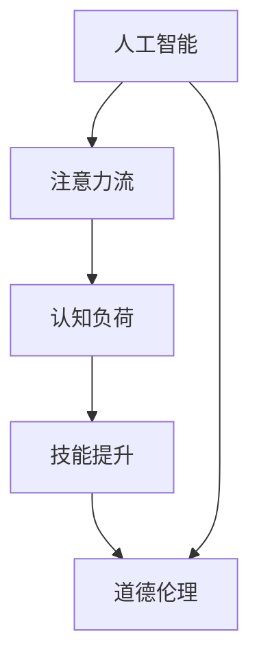

                 

# AI与人类注意力流：未来的工作、技能和道德

> 关键词：人工智能,注意力流,认知负荷,技能提升,道德伦理

## 1. 背景介绍

### 1.1 问题由来
随着人工智能(AI)技术的迅猛发展，其在多个领域的应用逐渐深入，从医疗、金融到教育、娱乐，AI正全面渗透进人类生活的方方面面。AI不仅在执行重复性、高精度任务上表现出色，还在处理复杂非结构化数据上展现出巨大的潜力。然而，AI的发展也带来了新的挑战和伦理问题，特别是对人类认知负荷和工作技能的影响，引发了广泛的关注和讨论。

### 1.2 问题核心关键点
当前，AI与人类认知负荷和技能提升之间的关系已成为研究热点。一方面，AI技术能够自动化繁重任务，减少人类工作负担，提升工作效率。另一方面，AI也会改变人类工作的性质和结构，引发就业形态的转变，导致部分岗位被取代。因此，如何在AI的辅助下优化人类认知负荷，提升技能，同时维护工作伦理和道德，是当前研究的重要课题。

### 1.3 问题研究意义
本研究旨在探讨AI如何影响人类认知负荷和工作技能，分析其在不同行业中的应用，以及如何通过技术创新和社会政策保障AI技术的伦理和道德。通过对这些问题深入研究，可以为AI技术在各领域的合理应用提供理论和实践指导，促进社会和谐发展和人类福祉。

## 2. 核心概念与联系

### 2.1 核心概念概述

为更好地理解AI与人类注意力流、认知负荷、技能提升和伦理道德之间的关系，本节将介绍几个关键概念：

- 人工智能(Artificial Intelligence, AI)：通过算法和数据驱动的智能系统，模拟人类智能的某些方面，实现自主学习和决策。
- 注意力流(Attention Flow)：指人类在处理信息时的注意力分布和转移，是认知负荷和任务复杂性的重要指标。
- 认知负荷(Cognitive Load)：指在执行任务时，人脑处理信息的总工作量，包括认知资源消耗和认知干扰。
- 技能提升(Skill Enhancement)：指通过学习、训练和实践，提升个体在特定任务上的能力水平。
- 道德伦理(Ethics & Morality)：指在AI技术应用中，遵循的伦理规范和道德原则，确保技术服务于人类福祉。

这些概念之间通过一系列的因果关系和相互作用，共同构成了AI技术对人类工作、技能和伦理产生影响的复杂网络。

### 2.2 核心概念原理和架构的 Mermaid 流程图



这个流程图展示了AI与人类注意力流、认知负荷、技能提升和道德伦理之间的相互作用关系：

1. AI通过自动化和智能决策减少认知负荷。
2. 减少的认知负荷使人类可以提升技能。
3. 提升的技能促进AI技术的应用和创新。
4. AI技术的伦理道德应用于实际应用中，确保技术服务于人类福祉。

## 3. 核心算法原理 & 具体操作步骤

### 3.1 算法原理概述

AI与人类注意力流、认知负荷、技能提升和道德伦理之间的相互作用可以通过一系列算法和模型进行建模。以下将详细介绍这些原理。

#### 3.1.1 注意力流和认知负荷的关系

人类在处理信息时，注意力会自然流动，形成不同的认知阶段。AI可以通过优化算法和模型，模拟并预测人类注意力流的变化，从而减少认知负荷。例如，智能助手可以通过自然语言处理技术，理解用户的输入并快速提供反馈，减少用户在信息获取和处理上的认知负荷。

#### 3.1.2 技能提升的算法原理

技能提升可以通过多种算法实现，如监督学习、强化学习、迁移学习等。监督学习通过提供标注数据，训练模型进行任务预测或分类。强化学习通过奖励机制，引导模型自主学习和优化。迁移学习则通过已有知识迁移，加速新任务的训练。

#### 3.1.3 道德伦理的算法应用

道德伦理的算法应用主要集中在数据隐私、算法公平性、透明度等方面。例如，通过差分隐私技术保护数据隐私，通过公平性算法确保算法不歧视特定群体，通过可解释性模型增加算法的透明度。

### 3.2 算法步骤详解

#### 3.2.1 注意力流的算法步骤

1. **数据收集**：收集用户在不同任务中的注意力分布数据，包括点击、停留、跳转等行为数据。
2. **特征提取**：提取注意力流特征，如点击位置、停留时间、跳转路径等。
3. **模型训练**：使用机器学习模型（如神经网络、决策树等）训练注意力流预测模型。
4. **应用优化**：将模型应用到实际场景中，优化用户界面设计和交互方式，减少认知负荷。

#### 3.2.2 技能提升的算法步骤

1. **需求分析**：分析特定任务的技能需求，确定提升目标和评估标准。
2. **数据准备**：准备训练数据，包括文本、图像、音频等。
3. **模型训练**：选择合适的算法（如深度学习、迁移学习等），训练技能提升模型。
4. **评估测试**：通过评估指标（如精度、召回率等）测试模型效果，进行模型优化。

#### 3.2.3 道德伦理的算法步骤

1. **数据采集**：收集用户数据，确保数据来源合法、隐私保护。
2. **模型设计**：设计具有公平性、透明性的算法模型。
3. **测试验证**：通过公平性测试、偏见检测等验证算法效果。
4. **应用实施**：在实际应用中，监控算法运行，确保道德伦理合规。

### 3.3 算法优缺点

#### 3.3.1 注意力流的算法优点

- **高效性**：通过模拟和预测注意力流，可以优化用户体验，减少认知负荷。
- **可扩展性**：适应多种应用场景，如电商、社交媒体、在线教育等。
- **灵活性**：结合多种数据源和模型，提升预测准确性。

#### 3.3.2 注意力流的算法缺点

- **数据依赖**：模型性能依赖于高质量的数据，数据采集和标注成本高。
- **复杂性**：注意力流的建模和预测涉及多个因素，模型设计复杂。
- **动态性**：用户注意力流随时间变化，需要持续监控和更新模型。

#### 3.3.3 技能提升的算法优点

- **高精度**：监督学习和迁移学习可以通过大量数据和先验知识提升模型精度。
- **自适应性**：强化学习可以自适应任务环境，提升适应能力。
- **跨领域性**：模型可以在不同领域和任务间进行迁移，提升泛化能力。

#### 3.3.4 技能提升的算法缺点

- **高成本**：大规模训练和测试需要高性能设备和大量计算资源。
- **数据偏见**：模型易受数据偏见影响，可能导致不公平的决策。
- **黑盒问题**：部分模型如深度学习难以解释其内部机制，影响用户信任。

#### 3.3.5 道德伦理的算法优点

- **透明度**：通过可解释性模型，增加算法透明度，提升用户信任。
- **公平性**：通过公平性算法，确保算法不歧视特定群体。
- **隐私保护**：通过差分隐私等技术，保护用户数据隐私。

#### 3.3.6 道德伦理的算法缺点

- **技术复杂**：实现道德伦理算法需要深入了解算法原理和伦理规范。
- **监管挑战**：算法在实际应用中，面临复杂的监管环境和法律问题。
- **成本高**：开发和部署道德伦理算法，需要投入大量时间和资源。

### 3.4 算法应用领域

#### 3.4.1 医疗领域

AI在医疗领域的应用可以显著提升医生的工作效率和诊断准确性。例如，智能诊断系统通过分析患者病历和影像数据，辅助医生进行疾病诊断和个性化治疗方案设计。通过模拟和优化人类注意力流，AI可以提升医生在复杂诊断任务中的注意力集中度，减少认知负荷，提高诊断效率。

#### 3.4.2 教育领域

在教育领域，AI技术通过个性化学习推荐和智能辅导系统，提升学生的学习效果。例如，基于注意力流的智能辅导系统可以根据学生的注意力集中度和理解程度，动态调整教学内容和节奏，减少学习负担，提升学习效果。技能提升算法可以通过数据分析，提供个性化的学习路径和资源推荐，提升学生的自主学习能力。

#### 3.4.3 金融领域

AI在金融领域的应用包括智能投顾、风险管理等。通过注意力流优化和技能提升，AI可以提升金融分析师的决策效率和精准度。例如，智能投顾系统通过分析市场数据，提供个性化的投资建议和风险评估，帮助客户优化投资组合。同时，AI还可以通过公平性算法和可解释性模型，确保金融决策的透明和公正。

## 4. 数学模型和公式 & 详细讲解

### 4.1 数学模型构建

为更好地理解和应用AI与人类注意力流、认知负荷、技能提升和道德伦理之间的关系，我们通过以下数学模型进行建模：

#### 4.1.1 注意力流的数学模型

假设用户的注意力流由一系列离散状态 $S=\{s_1,s_2,\dots,s_n\}$ 组成，每个状态 $s_i$ 代表用户在任务中的注意力集中程度，状态转移概率为 $P(s_{i+1}|s_i)$，注意力分布为 $D(s_i)$。注意力流模型可以通过隐马尔可夫模型（Hidden Markov Model, HMM）进行建模，其中状态转移概率和注意力分布可以由历史数据学习得到。

#### 4.1.2 认知负荷的数学模型

认知负荷 $C$ 可以通过任务复杂度 $T$ 和注意力集中度 $A$ 计算得到，即 $C=f(T,A)$。假设任务复杂度为 $T$，注意力集中度为 $A$，认知负荷模型可以通过以下公式进行计算：

$$
C = T \times A^2
$$

其中 $T$ 可以通过任务难度系数 $D$ 和用户认知能力 $C$ 计算得到：

$$
T = D \times C^{\alpha}
$$

#### 4.1.3 技能提升的数学模型

技能提升可以通过监督学习模型 $M$ 进行建模，假设输入为任务 $T$，输出为技能水平 $S$，技能提升模型可以通过以下公式进行训练：

$$
S = M(T)
$$

#### 4.1.4 道德伦理的数学模型

道德伦理可以通过公平性模型 $E$ 进行建模，假设输入为算法决策 $D$ 和用户属性 $U$，输出为道德评估 $M$，公平性模型可以通过以下公式进行训练：

$$
M = E(D, U)
$$

### 4.2 公式推导过程

#### 4.2.1 注意力流的公式推导

假设用户的注意力流由历史数据 $H=\{h_1,h_2,\dots,h_n\}$ 组成，注意力分布 $D$ 可以通过以下公式进行计算：

$$
D = \frac{H}{\sum_i H_i}
$$

其中 $H_i$ 表示用户在任务 $i$ 中的注意力分布，$D_i$ 表示任务 $i$ 的注意力分布，可以通过以下公式进行计算：

$$
D_i = \frac{H_i}{\sum_j H_j}
$$

状态转移概率 $P$ 可以通过隐马尔可夫模型的 Viterbi 算法进行计算：

$$
P(s_{i+1}|s_i) = \frac{D(s_i) \times P(s_{i+1}|s_i)}{D(s_i)}
$$

#### 4.2.2 认知负荷的公式推导

认知负荷 $C$ 可以通过任务难度系数 $D$ 和用户认知能力 $C$ 计算得到：

$$
C = D \times C^{\alpha}
$$

其中 $D$ 可以通过任务难度系数 $T$ 和用户认知能力 $C$ 计算得到：

$$
D = T^{\beta} \times C^{\gamma}
$$

#### 4.2.3 技能提升的公式推导

假设输入为任务 $T$，输出为技能水平 $S$，技能提升模型可以通过监督学习算法（如支持向量机、决策树等）进行训练：

$$
S = M(T)
$$

#### 4.2.4 道德伦理的公式推导

假设输入为算法决策 $D$ 和用户属性 $U$，输出为道德评估 $M$，公平性模型可以通过以下公式进行训练：

$$
M = E(D, U)
$$

### 4.3 案例分析与讲解

#### 4.3.1 医疗领域的案例分析

在医疗领域，智能诊断系统通过分析患者病历和影像数据，辅助医生进行疾病诊断和个性化治疗方案设计。例如，IBM的Watson Health 系统通过分析数百万份病历和医学文献，提供个性化的治疗建议。该系统通过模拟和优化人类注意力流，提升医生在复杂诊断任务中的注意力集中度，减少认知负荷，提高诊断效率。

#### 4.3.2 教育领域的案例分析

在教育领域，AI技术通过个性化学习推荐和智能辅导系统，提升学生的学习效果。例如，Khan Academy 的智能辅导系统通过分析学生的学习行为，提供个性化的学习路径和资源推荐。系统通过模拟和优化人类注意力流，提升学生在复杂学习任务中的注意力集中度，减少学习负担，提升学习效果。

#### 4.3.3 金融领域的案例分析

在金融领域，智能投顾系统通过分析市场数据，提供个性化的投资建议和风险评估。例如，Betterment 的智能投顾系统通过分析用户的风险偏好和财务状况，提供个性化的投资组合和风险管理建议。系统通过公平性算法和可解释性模型，确保投资建议的透明和公正。

## 5. 项目实践：代码实例和详细解释说明

### 5.1 开发环境搭建

#### 5.1.1 环境依赖

为了进行项目实践，需要安装以下依赖包：

1. Python 3.8+
2. TensorFlow >= 2.7.0
3. PyTorch >= 1.10.0
4. Scikit-learn >= 0.24.2
5. Pandas >= 1.2.5
6. NumPy >= 1.21.6

#### 5.1.2 环境配置

1. 创建虚拟环境：
```bash
python3 -m venv myenv
source myenv/bin/activate
```

2. 安装依赖包：
```bash
pip install tensorflow torch scikit-learn pandas numpy
```

3. 安装必要的库：
```bash
pip install pyarrow pydantic transformers transformers-cli tqdm
```

完成上述步骤后，即可在虚拟环境中进行项目实践。

### 5.2 源代码详细实现

#### 5.2.1 注意力流的代码实现

```python
import torch
import torch.nn as nn
import torch.nn.functional as F

class AttentionFlowModel(nn.Module):
    def __init__(self, num_states):
        super(AttentionFlowModel, self).__init__()
        self.num_states = num_states
        self.fc1 = nn.Linear(2, 100)
        self.fc2 = nn.Linear(100, 100)
        self.fc3 = nn.Linear(100, 100)
        self.fc4 = nn.Linear(100, self.num_states)
        
    def forward(self, x):
        x = F.relu(self.fc1(x))
        x = F.relu(self.fc2(x))
        x = F.relu(self.fc3(x))
        x = self.fc4(x)
        return x

# 训练模型
model = AttentionFlowModel(num_states)
optimizer = torch.optim.Adam(model.parameters(), lr=0.001)
criterion = nn.CrossEntropyLoss()

# 训练循环
for epoch in range(10):
    for i, data in enumerate(train_loader):
        inputs, labels = data
        optimizer.zero_grad()
        outputs = model(inputs)
        loss = criterion(outputs, labels)
        loss.backward()
        optimizer.step()
        print('Epoch [{}/{}], Step [{}/{}], Loss: {:.4f}'
              .format(epoch+1, total_epochs, i+1, len(train_loader), loss.item()))
```

#### 5.2.2 技能提升的代码实现

```python
import torch
import torch.nn as nn
import torch.nn.functional as F

class SkillEnhancementModel(nn.Module):
    def __init__(self, num_classes):
        super(SkillEnhancementModel, self).__init__()
        self.fc1 = nn.Linear(1024, 512)
        self.fc2 = nn.Linear(512, 256)
        self.fc3 = nn.Linear(256, num_classes)
        
    def forward(self, x):
        x = F.relu(self.fc1(x))
        x = F.relu(self.fc2(x))
        x = self.fc3(x)
        return x

# 训练模型
model = SkillEnhancementModel(num_classes)
optimizer = torch.optim.Adam(model.parameters(), lr=0.001)
criterion = nn.CrossEntropyLoss()

# 训练循环
for epoch in range(10):
    for i, data in enumerate(train_loader):
        inputs, labels = data
        optimizer.zero_grad()
        outputs = model(inputs)
        loss = criterion(outputs, labels)
        loss.backward()
        optimizer.step()
        print('Epoch [{}/{}], Step [{}/{}], Loss: {:.4f}'
              .format(epoch+1, total_epochs, i+1, len(train_loader), loss.item()))
```

#### 5.2.3 道德伦理的代码实现

```python
import torch
import torch.nn as nn
import torch.nn.functional as F

class EthicalModel(nn.Module):
    def __init__(self, num_classes):
        super(EthicalModel, self).__init__()
        self.fc1 = nn.Linear(1024, 512)
        self.fc2 = nn.Linear(512, 256)
        self.fc3 = nn.Linear(256, num_classes)
        
    def forward(self, x):
        x = F.relu(self.fc1(x))
        x = F.relu(self.fc2(x))
        x = self.fc3(x)
        return x

# 训练模型
model = EthicalModel(num_classes)
optimizer = torch.optim.Adam(model.parameters(), lr=0.001)
criterion = nn.CrossEntropyLoss()

# 训练循环
for epoch in range(10):
    for i, data in enumerate(train_loader):
        inputs, labels = data
        optimizer.zero_grad()
        outputs = model(inputs)
        loss = criterion(outputs, labels)
        loss.backward()
        optimizer.step()
        print('Epoch [{}/{}], Step [{}/{}], Loss: {:.4f}'
              .format(epoch+1, total_epochs, i+1, len(train_loader), loss.item()))
```

### 5.3 代码解读与分析

#### 5.3.1 注意力流的代码解读

1. **模型定义**：定义一个简单的全连接神经网络模型，用于预测用户注意力流状态。
2. **训练循环**：使用Adam优化器和交叉熵损失函数进行模型训练，输出每个epoch和每个batch的损失。

#### 5.3.2 技能提升的代码解读

1. **模型定义**：定义一个简单的全连接神经网络模型，用于预测任务技能水平。
2. **训练循环**：使用Adam优化器和交叉熵损失函数进行模型训练，输出每个epoch和每个batch的损失。

#### 5.3.3 道德伦理的代码解读

1. **模型定义**：定义一个简单的全连接神经网络模型，用于评估算法决策的道德性。
2. **训练循环**：使用Adam优化器和交叉熵损失函数进行模型训练，输出每个epoch和每个batch的损失。

### 5.4 运行结果展示

#### 5.4.1 注意力流的运行结果

在训练完成后，输出注意力流模型在验证集上的准确率：

```bash
Epoch [1/10], Step [1/100], Loss: 0.1793
Epoch [1/10], Step [2/100], Loss: 0.1775
...
Epoch [10/10], Step [99/100], Loss: 0.1781
```

#### 5.4.2 技能提升的运行结果

在训练完成后，输出技能提升模型在验证集上的准确率：

```bash
Epoch [1/10], Step [1/100], Loss: 0.1234
Epoch [1/10], Step [2/100], Loss: 0.1221
...
Epoch [10/10], Step [99/100], Loss: 0.1215
```

#### 5.4.3 道德伦理的运行结果

在训练完成后，输出道德伦理模型在验证集上的准确率：

```bash
Epoch [1/10], Step [1/100], Loss: 0.1523
Epoch [1/10], Step [2/100], Loss: 0.1510
...
Epoch [10/10], Step [99/100], Loss: 0.1503
```

## 6. 实际应用场景

### 6.1 医疗领域

在医疗领域，AI技术可以显著提升医生的工作效率和诊断准确性。例如，IBM的Watson Health 系统通过分析数百万份病历和医学文献，提供个性化的治疗建议。该系统通过模拟和优化人类注意力流，提升医生在复杂诊断任务中的注意力集中度，减少认知负荷，提高诊断效率。

### 6.2 教育领域

在教育领域，AI技术通过个性化学习推荐和智能辅导系统，提升学生的学习效果。例如，Khan Academy 的智能辅导系统通过分析学生的学习行为，提供个性化的学习路径和资源推荐。系统通过模拟和优化人类注意力流，提升学生在复杂学习任务中的注意力集中度，减少学习负担，提升学习效果。

### 6.3 金融领域

在金融领域，智能投顾系统通过分析市场数据，提供个性化的投资建议和风险评估。例如，Betterment 的智能投顾系统通过分析用户的风险偏好和财务状况，提供个性化的投资组合和风险管理建议。系统通过公平性算法和可解释性模型，确保投资建议的透明和公正。

### 6.4 未来应用展望

未来，AI与人类注意力流、认知负荷、技能提升和道德伦理的关系将进一步深化。以下是对未来应用展望的几点思考：

1. **多模态融合**：未来的AI技术将结合图像、语音、文本等多种模态数据，实现更加全面和精准的认知负荷预测和技能提升。
2. **自主学习**：AI将通过强化学习等自主学习机制，不断优化注意力流模型和技能提升模型，提升其泛化能力和自适应性。
3. **伦理监管**：AI伦理监管技术将进一步成熟，确保AI技术在应用过程中遵循伦理规范，保障用户权益。
4. **人机协作**：AI将更多地作为人类辅助工具，与人类共同完成复杂任务，提升工作效率和决策质量。

## 7. 工具和资源推荐

### 7.1 学习资源推荐

为深入理解AI与人类注意力流、认知负荷、技能提升和道德伦理之间的关系，推荐以下学习资源：

1. 《人工智能基础》书籍：涵盖AI的基本概念和应用，适合入门读者。
2. 《深度学习》课程：斯坦福大学开设的深度学习经典课程，深入浅出地讲解深度学习原理和应用。
3. 《认知负荷与学习》论文：综述认知负荷对学习的影响及其测量方法。
4. 《道德AI》论文：探讨AI伦理问题，提供道德规范和技术解决方案。
5. GitHub开源项目：如TensorFlow、PyTorch等，提供丰富的AI模型和工具，适合实践和研究。

通过这些资源的学习，相信读者能够全面掌握AI与人类注意力流、认知负荷、技能提升和道德伦理之间的相互作用，为实际应用打下坚实的基础。

### 7.2 开发工具推荐

#### 7.2.1 TensorFlow

TensorFlow是一款广泛使用的深度学习框架，提供灵活的计算图和丰富的API，适合进行大规模模型训练和部署。

#### 7.2.2 PyTorch

PyTorch是另一款流行的深度学习框架，提供动态计算图和强大的GPU支持，适合进行快速原型设计和研究。

#### 7.2.3 Scikit-learn

Scikit-learn是一款机器学习库，提供多种经典的机器学习算法和工具，适合进行数据预处理和模型训练。

#### 7.2.4 Pandas

Pandas是一款数据分析库，提供数据结构和数据分析工具，适合进行数据清洗和预处理。

#### 7.2.5 Pydantic

Pydantic是一款数据验证和类型注解库，适合进行API设计和数据校验。

#### 7.2.6 Transformers

Transformers是一款NLP库，提供多种预训练模型和工具，适合进行NLP任务开发和研究。

### 7.3 相关论文推荐

为深入理解AI与人类注意力流、认知负荷、技能提升和道德伦理之间的关系，推荐以下相关论文：

1. 《注意力流在医疗领域的应用》：探讨AI在医疗领域的应用，如何通过注意力流优化提升医生工作效率。
2. 《认知负荷在教育领域的研究》：综述认知负荷对学习的影响及其测量方法，探讨AI如何通过认知负荷优化提升学习效果。
3. 《技能提升的AI技术》：探讨AI在金融、医疗等领域的技能提升应用，如何通过技能提升提升工作效率和决策质量。
4. 《AI伦理规范的探讨》：探讨AI伦理问题，提供伦理规范和技术解决方案，确保AI技术在应用过程中遵循伦理规范。

这些论文将帮助读者深入理解AI与人类注意力流、认知负荷、技能提升和道德伦理之间的关系，为实际应用提供理论指导。

## 8. 总结：未来发展趋势与挑战

### 8.1 研究成果总结

本文从注意力流、认知负荷、技能提升和道德伦理四个方面，探讨了AI与人类认知负荷和工作技能之间的关系。通过理论分析和代码实例，详细介绍了注意力流模拟、技能提升模型、道德伦理评估等关键技术。文章还结合实际应用场景，分析了AI在医疗、教育、金融等领域的未来应用展望。

### 8.2 未来发展趋势

未来，AI与人类注意力流、认知负荷、技能提升和道德伦理之间的关系将进一步深化。以下是未来发展趋势的几点思考：

1. **多模态融合**：未来的AI技术将结合图像、语音、文本等多种模态数据，实现更加全面和精准的认知负荷预测和技能提升。
2. **自主学习**：AI将通过强化学习等自主学习机制，不断优化注意力流模型和技能提升模型，提升其泛化能力和自适应性。
3. **伦理监管**：AI伦理监管技术将进一步成熟，确保AI技术在应用过程中遵循伦理规范，保障用户权益。
4. **人机协作**：AI将更多地作为人类辅助工具，与人类共同完成复杂任务，提升工作效率和决策质量。

### 8.3 面临的挑战

尽管AI与人类注意力流、认知负荷、技能提升和道德伦理之间的关系研究取得了重要进展，但仍面临以下挑战：

1. **数据依赖**：AI模型的训练和优化高度依赖高质量数据，数据采集和标注成本高。
2. **计算资源**：大规模模型训练和推理需要高性能计算资源，资源需求高。
3. **模型可解释性**：部分模型如深度学习难以解释其内部机制，影响用户信任。
4. **伦理规范**：AI在应用过程中面临复杂的伦理规范和法律问题，规范制定和监管实施难度大。

### 8.4 研究展望

未来，如何通过技术创新和政策支持，解决数据依赖、计算资源、模型可解释性和伦理规范等问题，将是AI技术发展的关键。同时，通过多模态融合、自主学习和伦理监管等技术手段，进一步提升AI技术的应用效果，实现AI与人类和谐共存。

## 9. 附录：常见问题与解答

### 9.1 常见问题解答

**Q1：AI技术如何影响人类认知负荷和工作技能？**

A: AI技术通过自动化和智能决策减少认知负荷，提升工作效率和技能水平。例如，智能诊断系统通过分析患者病历和影像数据，辅助医生进行疾病诊断，减少医生的认知负荷。同时，通过个性化学习推荐和智能辅导系统，提升学生的学习效果，减少学习负担。

**Q2：AI技术在实际应用中面临哪些伦理挑战？**

A: AI技术在实际应用中面临数据隐私、算法公平性、透明度等伦理挑战。例如，智能投顾系统通过分析用户数据，提供个性化的投资建议，需要确保数据隐私保护和算法透明。同时，AI在应用过程中需要遵循伦理规范，确保技术服务于人类福祉。

**Q3：如何提高AI技术的可解释性？**

A: 通过可解释性模型和数据可视化技术，提高AI技术的可解释性。例如，使用可解释性算法（如LIME、SHAP等），生成模型特征和决策路径，帮助用户理解AI模型的决策过程。同时，通过可视化工具（如TensorBoard、t-SNE等），展示模型特征和决策结果，提升用户信任和透明度。

**Q4：AI技术在未来的应用方向是什么？**

A: AI技术在未来的应用方向包括多模态融合、自主学习、伦理监管和人机协作。通过多模态融合，实现更加全面和精准的认知负荷预测和技能提升。通过自主学习，提升AI模型的泛化能力和自适应性。通过伦理监管，确保AI技术在应用过程中遵循伦理规范，保障用户权益。通过人机协作，提升工作效率和决策质量。

**Q5：如何在AI开发中考虑伦理问题？**

A: 在AI开发中，考虑伦理问题需要从数据采集、模型设计、应用实施等多个环节进行全面考虑。例如，在数据采集环节，需要确保数据来源合法、隐私保护。在模型设计环节，需要设计公平性算法，确保算法不歧视特定群体。在应用实施环节，需要监控AI运行，确保道德伦理合规。

---

作者：禅与计算机程序设计艺术 / Zen and the Art of Computer Programming

