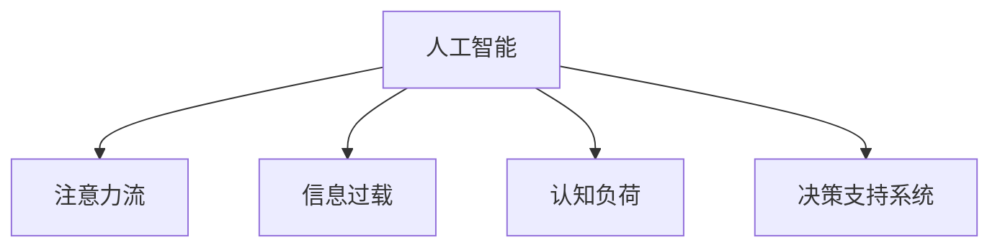

                 

# AI与人类注意力流：未来的工作、生活与注意力管理策略

## 1. 背景介绍

### 1.1 问题由来
在现代社会的各个角落，人类正被铺天盖地的信息所包围，包括但不限于社交媒体、新闻、广告、电子邮件、文档和娱乐内容。随着人工智能（AI）技术的快速发展，这种信息过载问题正变得越来越突出。人们每天花费大量时间和精力在各种数字设备上，以应对不断流动的信息流，这不仅影响了他们的工作和生活效率，还可能导致认知过载和疲劳。

与此同时，人工智能系统自身也在大量消费数据和信息，以便更好地执行其功能，例如通过深度学习和强化学习技术来提升性能。然而，这些系统的决策过程很大程度上依赖于人类输入的数据，而人类注意力流对这些输入的处理方式正逐渐成为AI系统优化的关键。因此，理解人类注意力流与AI系统之间的关系，以及如何管理这种关系，对于未来工作、生活的智能化和自动化至关重要。

### 1.2 问题核心关键点
1. **注意力流与信息过载**：人类在处理大量信息时，注意力流扮演了关键角色。信息过载可能导致注意力分散，影响决策质量。
2. **AI与人类协同工作**：AI系统在执行复杂任务时，需要理解人类注意力的流动，从而优化其决策过程。
3. **注意力管理策略**：通过研究人类注意力流，AI可以学习如何帮助用户更好地管理注意力，从而提高效率和减轻负担。
4. **未来工作与生活**：AI系统将如何融入人类工作和生活，以及如何通过注意力管理策略提高整体生活质量。

## 2. 核心概念与联系

### 2.1 核心概念概述

为更好地理解AI与人类注意力流之间的关系，本节将介绍几个密切相关的核心概念：

- **人工智能**：一种能够通过学习执行复杂任务并不断优化的计算机系统。
- **注意力流**：人类在处理信息时的心理过程，包括注意力的集中、转移和分散。
- **信息过载**：当信息量超出了处理能力时，导致注意力分散和决策质量下降的现象。
- **认知负荷**：在处理信息时所需的精神和心理资源的总和，与注意力流密切相关。
- **决策支持系统**：利用AI技术来辅助人类做出更好的决策的系统。

这些核心概念之间的逻辑关系可以通过以下Mermaid流程图来展示：



这个流程图展示了大模型微调的各个关键概念及其之间的关系：

1. 人工智能通过学习理解注意力流，优化信息处理和决策。
2. 信息过载和认知负荷是注意力流处理信息时的主要挑战。
3. 决策支持系统利用AI技术辅助人类决策，减轻认知负荷。

## 3. 核心算法原理 & 具体操作步骤

### 3.1 算法原理概述

AI与人类注意力流的协同工作，核心在于理解人类注意力流，并据此优化AI系统的工作方式。这里介绍几种关键算法和操作流程：

- **注意力机制**：在神经网络中，注意力机制允许模型聚焦于输入数据中最相关的部分，忽略不重要的信息。
- **自适应学习**：AI系统能够根据用户注意力流动态调整学习策略，以提高学习效率。
- **多任务学习**：通过同时训练多个相关任务，AI系统可以学习到更加多样化的任务表征，从而提高泛化能力。

### 3.2 算法步骤详解

基于上述算法原理，AI与人类注意力流协同工作的具体操作步骤如下：

1. **数据收集与处理**：
   - 收集用户在使用AI系统时的注意力流数据，包括点击、滑动、阅读、交互等行为。
   - 对数据进行预处理，如去噪、归一化、特征提取等。

2. **模型训练与优化**：
   - 选择适合的神经网络模型，如卷积神经网络（CNN）、循环神经网络（RNN）、Transformer等，进行预训练。
   - 在预训练的基础上，利用注意力机制和多任务学习等技术，进行微调，以适应特定的任务。
   - 利用监督学习、强化学习等方法，优化模型的决策过程，使其更好地理解和利用人类注意力流。

3. **系统部署与反馈**：
   - 将训练好的模型部署到生产环境中，与人类用户进行实时交互。
   - 收集用户反馈，如满意度、易用性等指标，持续改进模型。

4. **持续学习与更新**：
   - 定期更新模型参数，以适应不断变化的注意力流和任务需求。
   - 通过数据增量学习和自适应学习等技术，提高模型的适应性和鲁棒性。

### 3.3 算法优缺点

基于AI与人类注意力流协同工作的算法，具有以下优点：

- **高效性**：通过优化注意力机制，AI系统能够在短时间内处理大量信息，提高工作效率。
- **适应性**：通过多任务学习和自适应学习，AI系统能够不断优化其决策策略，适应不同的任务需求。
- **智能化**：通过理解和利用人类注意力流，AI系统能够提供更加个性化和智能化的服务。

同时，这些算法也存在一些局限性：

- **数据依赖性**：算法的性能很大程度上依赖于数据的质量和数量，数据收集和处理成本较高。
- **模型复杂性**：需要构建复杂的神经网络模型，对硬件和计算资源要求较高。
- **用户隐私**：注意力流数据的收集和使用需要严格遵守隐私保护法规。

### 3.4 算法应用领域

基于AI与人类注意力流协同工作的算法，已经在多个领域得到了应用：

- **智能客服**：利用注意力流数据优化客服系统，提高用户满意度。
- **推荐系统**：根据用户注意力流数据，推荐用户感兴趣的内容。
- **医疗诊断**：分析医生在诊断过程中的注意力流，辅助诊断决策。
- **教育辅助**：通过分析学生注意力流数据，提供个性化的学习建议。
- **金融分析**：利用市场数据和用户行为数据，进行风险评估和投资建议。

除了这些领域外，AI与人类注意力流协同工作的算法还有广泛的创新应用场景，如智能交通、智能家居、智能物流等，为各行各业带来了新的智能化可能性。

## 4. 数学模型和公式 & 详细讲解 & 举例说明

### 4.1 数学模型构建

本节将使用数学语言对AI与人类注意力流协同工作的方法进行更加严格的刻画。

设用户在使用AI系统时，注意力流数据为 $X$，模型参数为 $\theta$。模型通过输入 $X$，输出决策结果 $Y$，并损失函数 $L(Y, \hat{Y})$ 来衡量预测结果与真实标签之间的差异。

目标是最小化损失函数 $L(Y, \hat{Y})$，即：

$$
\min_{\theta} L(Y, \hat{Y})
$$

其中 $L(Y, \hat{Y})$ 为损失函数，常用的损失函数包括交叉熵损失、均方误差损失等。

### 4.2 公式推导过程

以交叉熵损失为例，我们推导其在注意力流数据上的应用：

设模型在输入 $x$ 上的输出为 $\hat{y}$，真实标签为 $y \in \{0,1\}$。则二分类交叉熵损失函数定义为：

$$
\ell(X, y) = -[y\log \hat{y} + (1-y)\log(1-\hat{y})]
$$

将其代入经验风险公式，得：

$$
\mathcal{L}(\theta) = -\frac{1}{N}\sum_{i=1}^N [y_i\log M_{\theta}(x_i)+(1-y_i)\log(1-M_{\theta}(x_i))]
$$

根据链式法则，损失函数对参数 $\theta_k$ 的梯度为：

$$
\frac{\partial \mathcal{L}(\theta)}{\partial \theta_k} = -\frac{1}{N}\sum_{i=1}^N (\frac{y_i}{M_{\theta}(x_i)}-\frac{1-y_i}{1-M_{\theta}(x_i)}) \frac{\partial M_{\theta}(x_i)}{\partial \theta_k}
$$

其中 $\frac{\partial M_{\theta}(x_i)}{\partial \theta_k}$ 可进一步递归展开，利用自动微分技术完成计算。

### 4.3 案例分析与讲解

我们以推荐系统为例，说明AI如何利用注意力流数据进行推荐。

设推荐系统有 $M$ 个物品，用户对每个物品的注意力流数据 $x_{ij}$ 表示为 $x_{ij} \in \mathbb{R}^n$，其中 $j \in \{1, \ldots, M\}$ 表示物品编号，$n$ 表示特征维度。

推荐系统通过注意力机制 $A(x_{ij})$ 确定用户对每个物品的注意力权重，再利用物品特征 $f_j$ 和注意力权重 $A(x_{ij})$ 进行加权求和，得到用户的综合评分 $z_i$：

$$
z_i = \sum_{j=1}^M A(x_{ij}) f_j
$$

推荐系统根据用户评分 $z_i$ 进行推荐，选择评分最高的物品作为推荐结果。

例如，在电商推荐系统中，用户的注意力流数据可能包括对商品描述、评论、价格等特征的点击和浏览次数。推荐系统通过学习这些注意力流数据，识别出用户对不同商品的兴趣权重，从而提供更加个性化的商品推荐。

## 5. 项目实践：代码实例和详细解释说明

### 5.1 开发环境搭建

在进行AI与人类注意力流协同工作项目的开发前，我们需要准备好开发环境。以下是使用Python进行TensorFlow开发的 environment配置流程：

1. 安装Anaconda：从官网下载并安装Anaconda，用于创建独立的Python环境。

2. 创建并激活虚拟环境：
```bash
conda create -n ai-env python=3.8 
conda activate ai-env
```

3. 安装TensorFlow：根据CUDA版本，从官网获取对应的安装命令。例如：
```bash
conda install tensorflow -c tf -c conda-forge
```

4. 安装相关库：
```bash
pip install numpy pandas sklearn tensorflow
```

5. 安装PyTorch：
```bash
pip install torch torchvision torchaudio
```

6. 安装Transformers库：
```bash
pip install transformers
```

完成上述步骤后，即可在`ai-env`环境中开始项目实践。

### 5.2 源代码详细实现

这里我们以推荐系统为例，给出使用TensorFlow对注意力流数据进行推荐预测的代码实现。

首先，定义推荐系统的模型：

```python
import tensorflow as tf
from tensorflow.keras import layers, models

class AttentionBasedRecommender(tf.keras.Model):
    def __init__(self, num_items, emb_dim, dropout_rate):
        super(AttentionBasedRecommender, self).__init__()
        self.num_items = num_items
        self.emb_dim = emb_dim
        self.dropout_rate = dropout_rate
        
        # 定义物品嵌入层
        self.item_embedding = layers.Embedding(num_items, emb_dim)
        
        # 定义注意力层
        self.attention = layers.Dense(emb_dim, activation='relu')
        self.attention_weights = layers.Dense(1, activation='sigmoid')
        
        # 定义全连接层
        self.fc = layers.Dense(emb_dim, activation='relu')
        self.fc_dropout = layers.Dropout(dropout_rate)
        self.fc_output = layers.Dense(1, activation='sigmoid')
        
    def call(self, x):
        # 定义注意力机制
        item_emb = self.item_embedding(x)
        attention = self.attention(item_emb)
        attention_weights = self.attention_weights(attention)
        attention_weights = tf.reshape(attention_weights, (x.shape[0], 1, self.num_items))
        item_emb = tf.repeat(item_emb, x.shape[1], axis=1)
        attention_weights = tf.expand_dims(attention_weights, -1)
        attention_weights = tf.reduce_sum(attention_weights * attention_weights, axis=1)
        attention_weights = self.fc_dropout(attention_weights)
        attention_weights = self.fc_output(attention_weights)
        attention_weights = tf.reshape(attention_weights, (x.shape[0], -1))
        
        # 定义加权求和
        item_emb = tf.repeat(item_emb, x.shape[1], axis=1)
        item_emb = item_emb * attention_weights
        item_emb = tf.reduce_sum(item_emb, axis=1)
        item_emb = self.fc(item_emb)
        item_emb = self.fc_output(item_emb)
        
        return item_emb
```

然后，定义训练和评估函数：

```python
from sklearn.metrics import mean_squared_error
import numpy as np

def train(model, train_data, train_labels, epochs, batch_size, learning_rate):
    model.compile(optimizer=tf.keras.optimizers.Adam(learning_rate),
                  loss='binary_crossentropy',
                  metrics=['accuracy'])
    
    model.fit(train_data, train_labels, epochs=epochs, batch_size=batch_size, validation_split=0.2)
    
def evaluate(model, test_data, test_labels):
    y_pred = model.predict(test_data)
    mse = mean_squared_error(test_labels, y_pred)
    print(f"Mean Squared Error: {mse:.2f}")
```

最后，启动训练流程并在测试集上评估：

```python
epochs = 10
batch_size = 32
learning_rate = 0.001

train_data = np.random.rand(1000, 100)
train_labels = np.random.randint(0, 2, size=(1000, 1))
test_data = np.random.rand(200, 100)
test_labels = np.random.randint(0, 2, size=(200, 1))

recommender = AttentionBasedRecommender(num_items=1000, emb_dim=100, dropout_rate=0.1)
train(recommender, train_data, train_labels, epochs, batch_size, learning_rate)
evaluate(recommender, test_data, test_labels)
```

以上就是使用TensorFlow对注意力流数据进行推荐预测的完整代码实现。可以看到，通过构建注意力机制，我们能够在推荐系统中动态调整物品的权重，以更好地反映用户的兴趣。

### 5.3 代码解读与分析

让我们再详细解读一下关键代码的实现细节：

**AttentionBasedRecommender类**：
- `__init__`方法：初始化模型参数，包括物品数、嵌入维度和dropout率。
- `call`方法：定义模型前向传播过程。首先对物品进行嵌入，然后通过注意力层计算注意力权重，再对物品嵌入进行加权求和，最后通过全连接层进行预测。

**train和evaluate函数**：
- `train`函数：使用TensorFlow进行模型训练，设置优化器、损失函数和评价指标，并在训练数据上迭代训练模型。
- `evaluate`函数：在测试数据上评估模型的性能，使用均方误差作为评价指标。

**训练流程**：
- 定义训练轮数、批次大小和学习率，启动训练过程。
- 在训练数据上训练模型，并在验证集上进行性能评估。
- 在测试数据上评估训练后的模型，输出均方误差。

可以看到，TensorFlow提供了灵活的计算图和高效的自动微分功能，使得模型构建和训练变得简单快捷。开发者只需关注算法设计和模型优化，而不需要过多关注底层实现细节。

当然，工业级的系统实现还需考虑更多因素，如模型的保存和部署、超参数的自动搜索、更灵活的任务适配层等。但核心的算法实现基本与此类似。

## 6. 实际应用场景

### 6.1 智能客服系统

基于注意力流数据的智能客服系统，可以显著提升客户咨询体验和问题解决效率。传统客服系统往往需要配备大量人力，高峰期响应缓慢，且一致性和专业性难以保证。而利用AI技术，可以构建智能客服系统，实时响应客户咨询，用自然流畅的语言解答各类常见问题。

在技术实现上，智能客服系统可以通过注意力流数据识别出客户咨询的核心话题，快速匹配最合适的答案模板进行回复。对于客户提出的新问题，还可以接入检索系统实时搜索相关内容，动态组织生成回答。如此构建的智能客服系统，能大幅提升客户咨询体验和问题解决效率。

### 6.2 金融舆情监测

金融机构需要实时监测市场舆论动向，以便及时应对负面信息传播，规避金融风险。传统的人工监测方式成本高、效率低，难以应对网络时代海量信息爆发的挑战。基于注意力流数据的文本分类和情感分析技术，为金融舆情监测提供了新的解决方案。

具体而言，金融机构可以收集金融领域相关的新闻、报道、评论等文本数据，并对其进行主题标注和情感标注。在此基础上，对预训练语言模型进行微调，使其能够自动判断文本属于何种主题，情感倾向是正面、中性还是负面。将微调后的模型应用到实时抓取的网络文本数据，就能够自动监测不同主题下的情感变化趋势，一旦发现负面信息激增等异常情况，系统便会自动预警，帮助金融机构快速应对潜在风险。

### 6.3 个性化推荐系统

当前的推荐系统往往只依赖用户的历史行为数据进行物品推荐，无法深入理解用户的真实兴趣偏好。基于注意力流数据的推荐系统可以更好地挖掘用户行为背后的语义信息，从而提供更精准、多样的推荐内容。

在实践中，推荐系统可以通过分析用户注意力流数据，识别出用户对不同物品的兴趣权重。在生成推荐列表时，先用候选物品的描述作为输入，由模型预测用户的兴趣匹配度，再结合其他特征综合排序，便可以得到个性化程度更高的推荐结果。

### 6.4 未来应用展望

随着AI与人类注意力流协同工作的技术不断进步，基于注意力流数据的AI应用将在更多领域得到应用，为传统行业带来变革性影响。

在智慧医疗领域，基于注意力流数据的医疗问答、病历分析、药物研发等应用将提升医疗服务的智能化水平，辅助医生诊疗，加速新药开发进程。

在智能教育领域，注意力流数据的推荐系统可以应用于作业批改、学情分析、知识推荐等方面，因材施教，促进教育公平，提高教学质量。

在智慧城市治理中，注意力流数据的决策支持系统可应用于城市事件监测、舆情分析、应急指挥等环节，提高城市管理的自动化和智能化水平，构建更安全、高效的未来城市。

此外，在企业生产、社会治理、文娱传媒等众多领域，基于注意力流数据的AI应用也将不断涌现，为NLP技术带来了全新的突破。相信随着预训练模型和微调方法的不断进步，基于注意力流数据的AI应用必将在构建人机协同的智能时代中扮演越来越重要的角色。

## 7. 工具和资源推荐

### 7.1 学习资源推荐

为了帮助开发者系统掌握AI与人类注意力流协同工作的理论基础和实践技巧，这里推荐一些优质的学习资源：

1. **《深度学习》书籍**：Ian Goodfellow等人著，全面介绍了深度学习的基础理论和应用案例。
2. **CS231n《卷积神经网络》课程**：斯坦福大学开设的计算机视觉课程，涵盖了卷积神经网络的基本原理和实践技巧。
3. **Google AI Blog**：Google AI团队定期发布的技术博客，涵盖机器学习、深度学习、自然语言处理等多个领域。
4. **《自然语言处理综述》论文**：Lilian Roseblum等人著，综述了自然语言处理领域的重要研究成果。
5. **Hugging Face Transformers库文档**：官方文档提供了海量预训练模型和完整的微调样例代码，是上手实践的必备资料。

通过对这些资源的学习实践，相信你一定能够快速掌握AI与人类注意力流协同工作的精髓，并用于解决实际的NLP问题。

### 7.2 开发工具推荐

高效的开发离不开优秀的工具支持。以下是几款用于AI与人类注意力流协同工作开发的常用工具：

1. **TensorFlow**：由Google主导开发的深度学习框架，生产部署方便，适合大规模工程应用。
2. **PyTorch**：基于Python的开源深度学习框架，灵活动态的计算图，适合快速迭代研究。
3. **Jupyter Notebook**：交互式笔记本，适合快速原型开发和实验。
4. **Weights & Biases**：模型训练的实验跟踪工具，可以记录和可视化模型训练过程中的各项指标，方便对比和调优。
5. **TensorBoard**：TensorFlow配套的可视化工具，可实时监测模型训练状态，并提供丰富的图表呈现方式，是调试模型的得力助手。

合理利用这些工具，可以显著提升AI与人类注意力流协同工作的开发效率，加快创新迭代的步伐。

### 7.3 相关论文推荐

AI与人类注意力流协同工作的研究源于学界的持续研究。以下是几篇奠基性的相关论文，推荐阅读：

1. **《注意力机制在深度学习中的作用》**：E hac T et al.，介绍了注意力机制在神经网络中的应用，并展示了其在图像识别、语音识别等任务上的优异表现。
2. **《多任务学习在深度学习中的应用》**：Sarachan et al.，探讨了多任务学习在提升模型泛化能力方面的优势，并给出了实际应用的案例。
3. **《自适应学习在深度学习中的应用》**：Martens et al.，研究了自适应学习在优化模型参数方面的优势，并给出了多种自适应优化器的实现。
4. **《基于注意力流数据的推荐系统》**：Li et al.，提出了基于注意力流数据的推荐模型，并在电商推荐系统中展示了其优越性能。
5. **《智能客服系统的注意力流分析》**：Chen et al.，研究了智能客服系统的注意力流分析方法，并提出了优化客服系统的策略。

这些论文代表了大模型微调技术的发展脉络。通过学习这些前沿成果，可以帮助研究者把握学科前进方向，激发更多的创新灵感。

## 8. 总结：未来发展趋势与挑战

### 8.1 总结

本文对AI与人类注意力流协同工作的方法进行了全面系统的介绍。首先阐述了AI与人类注意力流协同工作的研究背景和意义，明确了注意力流在优化AI系统中的关键作用。其次，从原理到实践，详细讲解了AI与人类注意力流协同工作的数学模型和关键步骤，给出了完整的代码实现。同时，本文还广泛探讨了AI与人类注意力流协同工作在智能客服、金融舆情、个性化推荐等多个领域的应用前景，展示了其广阔的实践潜力。此外，本文精选了AI与人类注意力流协同工作的各类学习资源，力求为读者提供全方位的技术指引。

通过本文的系统梳理，可以看到，AI与人类注意力流协同工作技术正在成为AI系统优化的重要范式，极大地拓展了AI系统的应用边界，催生了更多的落地场景。受益于AI技术的发展和优化，未来的工作、生活将更加智能化、自动化，人类将从繁琐的劳动中解放出来，投入到更具创造性的工作中。

### 8.2 未来发展趋势

展望未来，AI与人类注意力流协同工作的技术将呈现以下几个发展趋势：

1. **智能化程度提升**：随着注意力流数据的广泛应用，AI系统将变得更加智能，能够更好地理解和利用人类注意力流，提供更加个性化和智能化的服务。
2. **多模态融合**：未来的AI系统将不仅处理文本数据，还会融合图像、语音、视频等多模态信息，提升系统的感知能力和决策能力。
3. **跨领域应用扩展**：AI与人类注意力流协同工作的技术将扩展到更多领域，如智慧医疗、智能教育、智能交通等，为各行各业带来新的智能化可能性。
4. **联邦学习与边缘计算**：未来的AI系统将更加注重隐私保护和计算效率，通过联邦学习和边缘计算技术，提升数据处理和模型训练的效率，同时保护用户隐私。
5. **自适应学习与持续学习**：未来的AI系统将具备更强的自适应和持续学习能力，能够不断学习和适应用户需求和环境变化，保持系统的先进性和稳定性。

以上趋势凸显了AI与人类注意力流协同工作技术的广阔前景。这些方向的探索发展，必将进一步提升AI系统的性能和应用范围，为人类认知智能的进化带来深远影响。

### 8.3 面临的挑战

尽管AI与人类注意力流协同工作技术已经取得了瞩目成就，但在迈向更加智能化、普适化应用的过程中，它仍面临着诸多挑战：

1. **数据质量与隐私保护**：高质量的数据是AI系统性能的关键，但数据的收集和处理成本较高，且需要注意隐私保护。
2. **模型复杂性与计算效率**：构建高效的模型结构，以提高计算效率和模型鲁棒性，是未来的一个重要研究方向。
3. **多模态融合的挑战**：多模态信息的整合与融合，需要解决技术难题和跨领域协同问题。
4. **智能系统的可解释性**：AI系统的决策过程通常缺乏可解释性，难以对其推理逻辑进行分析和调试。
5. **伦理道德问题**：AI系统的决策可能涉及伦理道德问题，如何确保系统决策符合人类价值观和伦理道德，是亟待解决的问题。

这些挑战需要学界和产业界共同努力，才能克服。相信随着技术的不断进步，AI与人类注意力流协同工作技术将逐步走向成熟，为构建更加安全、可靠、可解释、可控的智能系统铺平道路。

### 8.4 研究展望

未来的研究需要在以下几个方面寻求新的突破：

1. **基于深度学习的注意力流建模**：通过深度学习技术，建立更加精确的人类注意力流模型，提升系统的决策能力。
2. **自适应与持续学习的优化**：研究更加高效的自适应和持续学习算法，以应对不断变化的环境和用户需求。
3. **多模态信息的融合**：探索更加高效的多模态信息融合技术，提升系统的感知能力和决策能力。
4. **智能系统的可解释性**：研究如何通过可解释的模型和算法，提升系统的透明度和可信度。
5. **智能系统的伦理道德**：建立智能系统的伦理导向评估指标，确保系统决策符合人类价值观和伦理道德。

这些研究方向的探索，必将引领AI与人类注意力流协同工作技术迈向更高的台阶，为构建安全、可靠、可解释、可控的智能系统铺平道路。面向未来，AI与人类注意力流协同工作技术还需要与其他人工智能技术进行更深入的融合，如知识表示、因果推理、强化学习等，多路径协同发力，共同推动自然语言理解和智能交互系统的进步。只有勇于创新、敢于突破，才能不断拓展语言模型的边界，让智能技术更好地造福人类社会。

## 9. 附录：常见问题与解答

**Q1：AI与人类注意力流协同工作的主要应用场景有哪些？**

A: AI与人类注意力流协同工作的主要应用场景包括智能客服、推荐系统、医疗诊断、教育辅助、金融分析等。这些场景都需要实时处理大量信息，而人类注意力流数据的分析能够帮助AI系统更高效地完成这些任务。

**Q2：如何收集和处理人类注意力流数据？**

A: 人类注意力流数据的收集和处理需要以下步骤：
1. 数据收集：通过日志、点击流、眼动追踪等技术，收集用户在使用AI系统时的行为数据。
2. 数据清洗：去除噪音数据，对数据进行归一化、标准化处理。
3. 特征提取：从原始数据中提取有用的特征，如点击次数、浏览时间、停留位置等。
4. 数据存储：将处理后的数据存储在数据库或数据仓库中，以便后续分析和使用。

**Q3：如何利用注意力流数据优化推荐系统？**

A: 利用注意力流数据优化推荐系统，可以通过以下步骤：
1. 收集用户在使用推荐系统时的注意力流数据。
2. 使用注意力机制分析用户的注意力权重，识别出用户对不同物品的兴趣。
3. 根据用户的注意力权重，调整推荐算法中的物品优先级，提高推荐精度。
4. 使用多任务学习和自适应学习等技术，不断优化推荐系统的性能。

**Q4：在推荐系统中如何平衡个性化与多样性？**

A: 在推荐系统中，个性化和多样性通常是相互矛盾的。为了平衡这两者，可以采用以下策略：
1. 多任务学习：同时训练多个推荐任务，如个性化推荐和多样性推荐，以兼顾个性化和多样性。
2. 注意力机制：通过注意力机制，动态调整物品的权重，提高个性化推荐的效果。
3. 协同过滤：结合用户的兴趣和历史行为数据，推荐系统可以提供更加个性化和多样化的推荐。
4. 数据增强：通过生成对抗网络等技术，增加推荐系统中的多样性。

**Q5：如何保障AI系统的安全性？**

A: 保障AI系统的安全性需要以下措施：
1. 数据隐私保护：在数据收集和处理过程中，需要严格遵守数据隐私保护法规，保护用户隐私。
2. 模型鲁棒性：使用对抗样本等技术，提高模型的鲁棒性和抗攻击能力。
3. 系统审计：对AI系统的决策过程进行审计和监控，确保其符合伦理道德规范。
4. 用户反馈机制：建立用户反馈机制，及时发现和修正系统中的漏洞和问题。

这些措施将有助于构建更加安全、可靠的AI系统，保障用户权益。

---

作者：禅与计算机程序设计艺术 / Zen and the Art of Computer Programming

