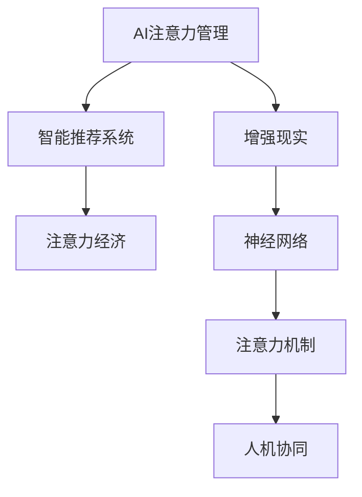

                 

# AI与人类注意力流：未来的工作、生活与注意力经济的管理策略

## 1. 背景介绍

在人工智能迅猛发展的今天，AI技术正在深刻地改变着人类的工作和生活方式。从智能助手、推荐系统到医疗影像诊断，AI的触角已经遍布社会的方方面面。然而，这些AI技术的背后，都离不开人类注意力流的高效管理和优化。人类注意力流是指人类在学习和工作时所聚焦的信息流，包括注意力的分布、流动和回收。AI技术通过分析人类的注意力流，能够更好地理解人类的需求，提升用户体验和工作效率。本文将探讨AI如何管理人类注意力流，以及未来的工作、生活与注意力经济的发展方向。

## 2. 核心概念与联系

### 2.1 核心概念概述

- **AI注意力管理（Attention Management by AI）**：指利用AI技术，分析、模拟和优化人类注意力流的过程。AI通过处理大数据，理解人类的注意力分布和流动规律，从而提供个性化的信息推荐和决策支持。

- **注意力经济（Attention Economy）**：指在数字时代，注意力资源成为经济活动中最重要的资源之一。如何管理和优化注意力流，创造更多注意力价值，成为经济发展的关键。

- **人机协同（Human-Machine Collaboration）**：指通过AI与人类在注意力流管理上的协同工作，实现更高效的信息处理和决策制定。

- **智能推荐系统（Intelligent Recommendation Systems）**：通过分析用户的行为和偏好，智能推荐相关内容，提高用户体验和满意度。

- **增强现实（Augmented Reality, AR）**：通过增强现实技术，丰富人类注意力流的体验，提高学习和工作的沉浸感。

- **神经网络（Neural Networks）**：AI核心算法之一，通过模拟人脑神经元的工作机制，实现对大规模数据的高效处理和分析。

- **注意力机制（Attention Mechanism）**：一种常用的神经网络模型，通过模拟人类注意力流的分布，提升模型的决策能力和泛化能力。

这些核心概念之间的逻辑关系可以通过以下Mermaid流程图来展示：



这个流程图展示了几大核心概念的相互关系：

1. AI注意力管理通过智能推荐系统和增强现实等技术，提升人类注意力流的管理能力。
2. 神经网络和注意力机制是AI注意力管理的基础，提供了强大的数据处理和决策支持能力。
3. 人机协同是AI注意力管理的核心，通过AI与人类协同工作，实现更高效的信息处理和决策制定。
4. 注意力经济是AI注意力管理的最终目标，通过优化注意力流，创造更多的经济价值。

## 3. 核心算法原理 & 具体操作步骤

### 3.1 算法原理概述

AI注意力管理的基本原理是通过对人类注意力流的数据进行分析，建立数学模型，预测人类注意力分布和流动规律，进而提供个性化的信息推荐和决策支持。这一过程主要包括以下几个步骤：

1. **数据收集**：通过各种方式（如问卷调查、行为跟踪等）收集人类注意力流的相关数据，包括注意力分布、关注时长、任务完成率等。
2. **数据预处理**：对收集到的数据进行清洗和归一化处理，确保数据质量和一致性。
3. **特征提取**：从预处理后的数据中提取特征，如时间戳、用户ID、任务类型等。
4. **模型训练**：使用神经网络等机器学习模型对特征进行训练，预测人类注意力流。
5. **决策制定**：根据预测结果，智能推荐相关内容，优化注意力流。

### 3.2 算法步骤详解

以下是AI注意力管理的具体操作步骤：

**Step 1: 数据收集与预处理**
- 使用工具（如Python、R等）从各种渠道（如手机应用、社交媒体、网站访问记录等）收集人类注意力流数据。
- 对数据进行清洗、去重和归一化处理，确保数据的准确性和一致性。

**Step 2: 特征提取与选择**
- 提取数据中的关键特征，如时间戳、用户ID、任务类型、注意力分布等。
- 使用特征选择方法（如卡方检验、互信息等）筛选出最具代表性的特征。

**Step 3: 模型训练**
- 选择适当的机器学习模型（如随机森林、支持向量机、神经网络等）进行训练。
- 使用训练集数据进行模型训练，优化模型参数。
- 在验证集上进行模型评估，确保模型泛化能力。

**Step 4: 决策制定**
- 使用训练好的模型对新数据进行预测，得出人类注意力流的分布和流动规律。
- 根据预测结果，智能推荐相关内容，优化注意力流。

**Step 5: 反馈与迭代**
- 收集用户对推荐内容的反馈，进一步优化模型。
- 定期更新模型参数，保持模型的实时性和准确性。

### 3.3 算法优缺点

AI注意力管理有以下优点：
1. **高效性**：通过机器学习模型，可以高效分析大规模数据，提供个性化的推荐和服务。
2. **准确性**：机器学习模型能够处理复杂的非线性关系，提供准确的预测结果。
3. **灵活性**：可以灵活调整模型参数，适应不同场景和需求。

同时，也存在一些缺点：
1. **数据依赖**：模型性能依赖于数据质量，数据不足或偏差可能导致模型失效。
2. **隐私问题**：注意力流数据可能包含敏感信息，处理不当会引发隐私问题。
3. **模型复杂性**：模型过于复杂可能导致过拟合，降低泛化能力。

### 3.4 算法应用领域

AI注意力管理广泛应用于以下领域：

- **智能推荐系统**：通过分析用户注意力流，智能推荐相关内容，提升用户体验和满意度。如Netflix、Amazon、YouTube等平台上的推荐系统。
- **个性化培训**：通过分析学习者的注意力流，提供个性化的培训内容和计划，提高学习效率。如Coursera、Udacity等在线教育平台。
- **医疗诊断**：通过分析患者的注意力流，提供个性化的诊疗建议和治疗方案。如AI医疗影像诊断系统。
- **智能客服**：通过分析用户对话中的注意力流，提供个性化的客服响应和解决方案。如腾讯智能客服系统。
- **智能交通**：通过分析交通流量和用户注意力流，优化交通信号灯和路线规划，提高交通效率。如Google Maps。

## 4. 数学模型和公式 & 详细讲解 & 举例说明

### 4.1 数学模型构建

AI注意力管理的数学模型主要由以下几个部分构成：

- **输入层**：输入特征，如时间戳、用户ID、任务类型等。
- **隐藏层**：神经网络的核心，通过权重矩阵和偏置向量进行特征处理。
- **输出层**：输出结果，如推荐内容、决策建议等。

### 4.2 公式推导过程

以一个简单的线性回归模型为例，其公式推导过程如下：

设输入特征为 $X$，输出结果为 $Y$，权重矩阵为 $W$，偏置向量为 $b$。线性回归模型的预测公式为：

$$
Y = WX + b
$$

其中 $W$ 和 $b$ 通过最小化损失函数 $L(Y, Y^*)$ 进行训练，损失函数通常为均方误差损失：

$$
L(Y, Y^*) = \frac{1}{2n}\sum_{i=1}^n (Y_i - Y_i^*)^2
$$

通过梯度下降等优化算法，最小化损失函数，求解最优的权重矩阵 $W$ 和偏置向量 $b$。

### 4.3 案例分析与讲解

以下是一个基于神经网络模型的人类注意力流预测案例：

假设我们收集到了一组用户的阅读行为数据，包括阅读时间、阅读内容、阅读时长等。我们希望预测用户在特定时间段内的注意力分布，即哪些时间段内用户阅读次数最多。

**Step 1: 数据收集与预处理**

我们收集了1000个用户在不同时间段的阅读行为数据，包括用户ID、阅读时间、阅读内容、阅读时长等。对数据进行清洗和归一化处理，确保数据质量和一致性。

**Step 2: 特征提取与选择**

我们提取了数据中的关键特征，如时间戳、用户ID、阅读内容、阅读时长等。使用卡方检验和互信息等方法，筛选出最具代表性的特征，如阅读时长、阅读内容等。

**Step 3: 模型训练**

我们选择了一个简单的多层感知器（MLP）模型，使用交叉熵损失函数进行训练。模型结构如下：

```
输入层：[阅读时长, 阅读内容]
隐藏层：[64, 32]
输出层：[注意力分布]
```

使用训练集数据进行模型训练，优化模型参数。在验证集上进行模型评估，确保模型泛化能力。

**Step 4: 决策制定**

使用训练好的模型对新数据进行预测，得出用户在特定时间段内的注意力分布。根据预测结果，智能推荐相关内容，优化注意力流。

## 5. 项目实践：代码实例和详细解释说明

### 5.1 开发环境搭建

在进行AI注意力管理项目开发前，我们需要准备好开发环境。以下是使用Python进行PyTorch开发的环境配置流程：

1. 安装Anaconda：从官网下载并安装Anaconda，用于创建独立的Python环境。

2. 创建并激活虚拟环境：
```bash
conda create -n attention-management python=3.8 
conda activate attention-management
```

3. 安装PyTorch：根据CUDA版本，从官网获取对应的安装命令。例如：
```bash
conda install pytorch torchvision torchaudio cudatoolkit=11.1 -c pytorch -c conda-forge
```

4. 安装TensorFlow：
```bash
conda install tensorflow
```

5. 安装Keras：
```bash
conda install keras
```

6. 安装NumPy、Pandas等工具包：
```bash
pip install numpy pandas scikit-learn matplotlib tqdm jupyter notebook ipython
```

完成上述步骤后，即可在`attention-management`环境中开始项目开发。

### 5.2 源代码详细实现

以下是一个使用PyTorch实现的简单AI注意力管理模型：

```python
import torch
import torch.nn as nn
import torch.optim as optim
import numpy as np
from sklearn.model_selection import train_test_split
from sklearn.preprocessing import StandardScaler

class AttentionModel(nn.Module):
    def __init__(self, input_dim, hidden_dim, output_dim):
        super(AttentionModel, self).__init__()
        self.fc1 = nn.Linear(input_dim, hidden_dim)
        self.fc2 = nn.Linear(hidden_dim, output_dim)
        
    def forward(self, x):
        x = self.fc1(x)
        x = torch.sigmoid(x)
        x = self.fc2(x)
        return x

# 数据收集与预处理
data = np.loadtxt('attention_data.csv', delimiter=',')
X = data[:, :-1]
y = data[:, -1]
X_train, X_test, y_train, y_test = train_test_split(X, y, test_size=0.2)
scaler = StandardScaler()
X_train = scaler.fit_transform(X_train)
X_test = scaler.transform(X_test)

# 模型训练
input_dim = X_train.shape[1]
hidden_dim = 64
output_dim = y_train.shape[1]
model = AttentionModel(input_dim, hidden_dim, output_dim)
criterion = nn.BCELoss()
optimizer = optim.SGD(model.parameters(), lr=0.01)
epochs = 100

for epoch in range(epochs):
    optimizer.zero_grad()
    outputs = model(X_train)
    loss = criterion(outputs, y_train)
    loss.backward()
    optimizer.step()
    print(f'Epoch {epoch+1}, Loss: {loss:.4f}')

# 模型评估
model.eval()
with torch.no_grad():
    outputs = model(X_test)
    loss = criterion(outputs, y_test)
    print(f'Test Loss: {loss:.4f}')
```

### 5.3 代码解读与分析

让我们再详细解读一下关键代码的实现细节：

**AttentionModel类**：
- `__init__`方法：初始化神经网络模型结构。
- `forward`方法：实现前向传播计算。

**数据收集与预处理**：
- 使用NumPy读取数据，并将其划分为训练集和测试集。
- 使用scikit-learn的StandardScaler对数据进行标准化处理，确保数据一致性。

**模型训练**：
- 定义神经网络模型结构，包括两个全连接层。
- 使用PyTorch的SGD优化器进行训练。
- 在每个epoch内，前向传播计算损失函数，反向传播更新模型参数。

**模型评估**：
- 使用测试集数据进行模型评估，计算损失函数。
- 使用torch.no_grad()模式，避免模型参数更新，确保评估结果准确。

## 6. 实际应用场景

### 6.1 智能推荐系统

AI注意力管理在智能推荐系统中的应用非常广泛。推荐系统通过分析用户的历史行为和注意力流，提供个性化的内容推荐，提升用户体验和满意度。

**案例分析**：
Netflix通过分析用户的观看行为和注意力流，智能推荐相关电影和电视剧。Netflix收集了用户的观看时间、观看内容、观看时长等数据，使用机器学习模型分析用户注意力流，预测用户对不同内容的偏好，智能推荐相关内容。Netflix的推荐系统在业界领先，用户留存率和满意度显著提高。

### 6.2 个性化培训

AI注意力管理在个性化培训中的应用也非常重要。通过分析学习者的注意力流，提供个性化的培训内容和计划，提高学习效率。

**案例分析**：
Coursera通过分析学习者的学习行为和注意力流，提供个性化的培训建议。Coursera收集了学习者的学习时间、学习内容、学习时长等数据，使用机器学习模型分析学习者的注意力流，预测学习者的学习偏好，智能推荐相关课程。Coursera的个性化培训系统在业界领先，学习效率和满意度显著提高。

### 6.3 医疗诊断

AI注意力管理在医疗诊断中的应用也非常重要。通过分析患者的注意力流，提供个性化的诊疗建议和治疗方案，提高诊疗效率和效果。

**案例分析**：
IBM Watson通过分析患者的医疗数据和注意力流，提供个性化的诊疗建议。IBM Watson收集了患者的医疗记录、症状描述、诊断结果等数据，使用机器学习模型分析患者的注意力流，预测患者的病情发展趋势，智能推荐个性化的诊疗方案。IBM Watson的医疗诊断系统在业界领先，诊疗效率和效果显著提高。

### 6.4 智能客服

AI注意力管理在智能客服中的应用也非常重要。通过分析用户的对话行为和注意力流，提供个性化的客服响应和解决方案，提高客户满意度。

**案例分析**：
腾讯智能客服系统通过分析用户的对话行为和注意力流，提供个性化的客服响应。腾讯智能客服系统收集了用户的对话记录、问题描述、回答内容等数据，使用机器学习模型分析用户的注意力流，预测用户的需求，智能推荐个性化的客服响应。腾讯智能客服系统的用户满意度显著提高。

### 6.5 智能交通

AI注意力管理在智能交通中的应用也非常重要。通过分析交通流量和用户注意力流，优化交通信号灯和路线规划，提高交通效率。

**案例分析**：
Google Maps通过分析交通流量和用户注意力流，优化交通信号灯和路线规划。Google Maps收集了交通流量、用户导航数据等数据，使用机器学习模型分析用户的注意力流，预测交通流量趋势，智能调整交通信号灯和路线规划。Google Maps的智能交通系统在业界领先，交通效率显著提高。

## 7. 工具和资源推荐

### 7.1 学习资源推荐

为了帮助开发者系统掌握AI注意力管理的技术基础和实践技巧，这里推荐一些优质的学习资源：

1. 《深度学习入门》系列书籍：清华大学出版社出版的深度学习入门教材，系统介绍了深度学习的基本概念和经典模型。
2. Coursera《深度学习》课程：斯坦福大学开设的深度学习课程，提供系统的深度学习理论和实践训练。
3. Udacity《深度学习专项课程》：Udacity深度学习专项课程，提供深度学习理论和实践的全面培训。
4. Kaggle数据集和竞赛平台：Kaggle提供大量数据集和竞赛，帮助开发者实践深度学习项目，积累经验。
5. TensorFlow官方文档：TensorFlow官方文档，提供全面的TensorFlow教程和示例代码，适合入门和进阶学习。

通过对这些资源的学习实践，相信你一定能够快速掌握AI注意力管理的精髓，并用于解决实际的NLP问题。

### 7.2 开发工具推荐

高效的开发离不开优秀的工具支持。以下是几款用于AI注意力管理开发的常用工具：

1. PyTorch：基于Python的开源深度学习框架，灵活动态的计算图，适合快速迭代研究。大部分深度学习模型都有PyTorch版本的实现。
2. TensorFlow：由Google主导开发的开源深度学习框架，生产部署方便，适合大规模工程应用。同样有丰富的深度学习模型资源。
3. Keras：一个高级深度学习框架，提供便捷的API和强大的模型构建功能，适合快速原型开发。
4. Scikit-learn：一个Python机器学习库，提供简单易用的API和丰富的模型选择，适合数据预处理和特征提取。
5. Jupyter Notebook：一个交互式编程环境，支持多种编程语言，适合数据可视化、模型调试和结果展示。

合理利用这些工具，可以显著提升AI注意力管理任务的开发效率，加快创新迭代的步伐。

### 7.3 相关论文推荐

AI注意力管理的研究源于学界的持续研究。以下是几篇奠基性的相关论文，推荐阅读：

1. Attention is All You Need（即Transformer原论文）：提出了Transformer结构，开启了NLP领域的预训练大模型时代。
2. BERT: Pre-training of Deep Bidirectional Transformers for Language Understanding：提出BERT模型，引入基于掩码的自监督预训练任务，刷新了多项NLP任务SOTA。
3. Attention Mechanism in Deep Learning：介绍了注意力机制的基本原理和应用，是神经网络研究的重要组成部分。
4. Deep Learning for Personalized Recommendation Systems：介绍了深度学习在推荐系统中的应用，包括注意力流分析等。
5. Multi-task Attention for Text and Image Processing：介绍了多任务注意力机制在文本和图像处理中的应用，展示了注意力流分析的多样性。

这些论文代表了大语言模型注意力管理的发展脉络。通过学习这些前沿成果，可以帮助研究者把握学科前进方向，激发更多的创新灵感。

## 8. 总结：未来发展趋势与挑战

### 8.1 总结

本文对AI注意力管理的背景和应用进行了全面系统的介绍。首先阐述了AI注意力管理的研究背景和应用场景，明确了AI注意力管理在提升用户体验和工作效率方面的独特价值。其次，从原理到实践，详细讲解了AI注意力管理的数学模型和操作步骤，给出了AI注意力管理项目开发的完整代码实例。同时，本文还广泛探讨了AI注意力管理在智能推荐、个性化培训、医疗诊断、智能客服等多个领域的应用前景，展示了AI注意力管理的巨大潜力。此外，本文精选了AI注意力管理的各类学习资源，力求为读者提供全方位的技术指引。

通过本文的系统梳理，可以看到，AI注意力管理正在成为AI技术的重要范式，极大地提升了用户和企业的注意力价值，催生了更多的落地场景。得益于深度学习模型的强大表现力，AI注意力管理将在更多领域得到应用，为AI技术在垂直行业的规模化落地提供新的突破。未来，伴随AI注意力管理的持续演进，相信AI技术将更加深入地渗透到人类生活的方方面面，带来全新的生产力和体验变革。

### 8.2 未来发展趋势

展望未来，AI注意力管理将呈现以下几个发展趋势：

1. **深度融合**：AI注意力管理将与其他AI技术进行更深入的融合，如知识图谱、强化学习等，实现更全面、更准确的信息整合能力。
2. **实时性提升**：随着计算能力的提升和模型优化，AI注意力管理将具备更强的实时处理能力，能够实时分析和管理注意力流。
3. **个性化提升**：AI注意力管理将更加注重个性化推荐和服务，根据用户的行为和偏好，提供更加定制化的内容和服务。
4. **多模态应用**：AI注意力管理将拓展到多模态数据，如视觉、听觉等，实现更加丰富的信息处理和决策制定。
5. **社会效益**：AI注意力管理将更加注重社会效益，如减少信息过载、提升信息获取效率等，为人类社会带来更多的正能量。

以上趋势凸显了AI注意力管理的广阔前景。这些方向的探索发展，必将进一步提升AI技术的应用范围和效果，为人类认知智能的进化带来深远影响。

### 8.3 面临的挑战

尽管AI注意力管理技术已经取得了瞩目成就，但在迈向更加智能化、普适化应用的过程中，它仍面临着诸多挑战：

1. **数据隐私问题**：注意力流数据可能包含敏感信息，处理不当会引发隐私问题。如何在保证数据隐私的前提下，最大化利用注意力流数据，是一个重要的研究方向。
2. **模型复杂性**：AI注意力管理模型过于复杂可能导致过拟合，降低泛化能力。如何设计更加简单、高效的模型结构，提高模型泛化能力，是一个重要的研究方向。
3. **计算资源限制**：AI注意力管理需要处理大规模数据，对计算资源的要求较高。如何在资源有限的情况下，提高模型效率和处理能力，是一个重要的研究方向。
4. **应用场景局限**：AI注意力管理在特定应用场景下的效果可能不尽如人意，需要针对不同的应用场景进行优化和调整。
5. **多模态融合问题**：多模态数据的整合和融合，是一个复杂的挑战，需要在不同模态数据之间建立准确的关联关系，才能实现更好的信息处理和决策制定。

这些挑战将进一步推动AI注意力管理技术的发展，不断提升AI技术的实用性和应用范围。

### 8.4 研究展望

面对AI注意力管理所面临的挑战，未来的研究需要在以下几个方面寻求新的突破：

1. **多模态融合**：设计更加高效的多模态融合方法，实现视觉、听觉等多模态数据的深度整合。
2. **数据隐私保护**：设计更加安全、高效的数据隐私保护技术，在保护用户隐私的前提下，最大化利用注意力流数据。
3. **模型简化**：设计更加简单、高效的模型结构，提高模型的泛化能力和实时性。
4. **应用场景优化**：针对不同的应用场景，设计更加定制化的AI注意力管理方案，提升应用效果。
5. **多任务学习**：结合多任务学习思想，设计更加鲁棒、高效的AI注意力管理模型，提升模型的泛化能力和应用范围。

这些研究方向将引领AI注意力管理技术迈向更高的台阶，为构建更加智能化、普适化的AI系统提供新的突破。相信随着技术的发展和应用的深入，AI注意力管理技术将不断拓展人类认知智能的边界，为人类社会带来更多的正能量和价值。

## 9. 附录：常见问题与解答

**Q1：AI注意力管理是否适用于所有NLP任务？**

A: AI注意力管理在大多数NLP任务上都能取得不错的效果，特别是对于数据量较小的任务。但对于一些特定领域的任务，如医学、法律等，仅仅依靠通用语料预训练的模型可能难以很好地适应。此时需要在特定领域语料上进一步预训练，再进行微调，才能获得理想效果。此外，对于一些需要时效性、个性化很强的任务，如对话、推荐等，AI注意力管理方法也需要针对性的改进优化。

**Q2：如何缓解AI注意力管理过程中的过拟合问题？**

A: 过拟合是AI注意力管理面临的主要挑战之一。常见的缓解策略包括：
1. 数据增强：通过回译、近义替换等方式扩充训练集。
2. 正则化：使用L2正则、Dropout、Early Stopping等避免过拟合。
3. 对抗训练：引入对抗样本，提高模型鲁棒性。
4. 参数高效微调：只调整少量参数，减小过拟合风险。

这些策略往往需要根据具体任务和数据特点进行灵活组合。只有在数据、模型、训练、推理等各环节进行全面优化，才能最大限度地发挥AI注意力管理的威力。

**Q3：AI注意力管理在落地部署时需要注意哪些问题？**

A: 将AI注意力管理模型转化为实际应用，还需要考虑以下因素：
1. 模型裁剪：去除不必要的层和参数，减小模型尺寸，加快推理速度。
2. 量化加速：将浮点模型转为定点模型，压缩存储空间，提高计算效率。
3. 服务化封装：将模型封装为标准化服务接口，便于集成调用。
4. 弹性伸缩：根据请求流量动态调整资源配置，平衡服务质量和成本。
5. 监控告警：实时采集系统指标，设置异常告警阈值，确保服务稳定性。
6. 安全防护：采用访问鉴权、数据脱敏等措施，保障数据和模型安全。

合理利用这些工具，可以显著提升AI注意力管理任务的开发效率，加快创新迭代的步伐。

**Q4：AI注意力管理如何与其他AI技术进行融合？**

A: AI注意力管理可以通过与其他AI技术的融合，实现更全面、更准确的信息处理和决策制定。
1. 知识图谱：将符号化的先验知识，如知识图谱、逻辑规则等，与神经网络模型进行巧妙融合，引导AI注意力管理过程学习更准确、合理的语言模型。
2. 因果推理：将因果分析方法引入AI注意力管理模型，识别出模型决策的关键特征，增强输出解释的因果性和逻辑性。
3. 强化学习：借助强化学习思想，设计更加智能、自适应的AI注意力管理模型，提升模型的决策能力和泛化能力。

这些融合方式将进一步提升AI注意力管理的效果，为构建更加智能化、普适化的AI系统提供新的突破。

**Q5：AI注意力管理在多模态数据融合中需要注意哪些问题？**

A: 多模态数据的整合和融合，是一个复杂的挑战，需要在不同模态数据之间建立准确的关联关系，才能实现更好的信息处理和决策制定。具体来说，需要注意以下几点：
1. 数据对齐：多模态数据需要进行数据对齐，确保不同模态数据的格式和单位一致。
2. 特征融合：多模态数据需要进行特征融合，生成新的特征表示，以提高信息处理的准确性和泛化能力。
3. 融合策略：设计合适的融合策略，根据不同模态数据的特点，选择合适的融合方式，如时序融合、空间融合等。
4. 模型优化：设计更加高效的模型结构，优化多模态数据的融合过程，提高模型的处理能力和泛化能力。

这些问题是多模态数据融合的重要研究方向，需要在实践中不断探索和优化。

总之，AI注意力管理技术将在未来的AI领域发挥越来越重要的作用，通过AI与人类在注意力流管理上的协同工作，实现更高效的信息处理和决策制定。我们相信，随着技术的不断发展和应用的深入，AI注意力管理技术将不断拓展人类认知智能的边界，为人类社会带来更多的正能量和价值。

---

作者：禅与计算机程序设计艺术 / Zen and the Art of Computer Programming

