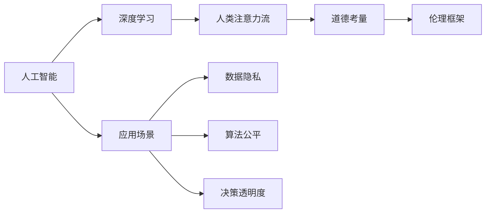

                 

# AI与人类注意力流：道德考量

在人工智能迅速发展的今天，AI技术在各个领域都展现出了巨大的潜力，从自动驾驶、医疗诊断到金融分析，AI的应用无处不在。然而，与此同时，AI的普及也引发了关于道德和伦理的深层次讨论。本文旨在探讨AI技术与人类的注意力流的关系，以及在这一过程中应如何平衡技术进步与社会伦理。

## 1. 背景介绍

### 1.1 人工智能的崛起与影响
人工智能，特别是深度学习技术，已经在图像识别、语音识别、自然语言处理等多个领域取得了突破性进展。AI技术通过模拟人类感知和决策过程，能够处理海量的数据，提供高效的服务。然而，这种技术优势在带来便利的同时，也引发了诸如数据隐私、算法偏见、决策透明度等道德和伦理问题。

### 1.2 人类注意力流的概念
人类注意力流是指在特定任务中，人的注意力如何流动和分配。在认知科学和心理学中，注意力被视为信息处理的窗口，是理解复杂任务的关键。而随着AI技术的发展，注意力流的研究也逐渐扩展到机器学习领域，特别是深度神经网络中。

## 2. 核心概念与联系

### 2.1 核心概念概述

- **人工智能（AI）**：通过计算机模拟人类智能行为的技术，包括感知、学习、推理、决策等能力。
- **深度学习（DL）**：基于神经网络的机器学习方法，通过多层非线性变换提取数据的复杂特征。
- **人类注意力流**：在完成任务过程中，人的注意力如何分配和移动，影响信息处理效率和决策质量。
- **道德考量**：在AI应用中，涉及的数据隐私、算法公平性、决策透明度等问题。
- **伦理框架**：指导AI技术发展与应用的道德原则和规范，如隐私保护、公平正义、责任归属等。

### 2.2 核心概念原理和架构的 Mermaid 流程图


## 3. 核心算法原理 & 具体操作步骤

### 3.1 算法原理概述

在深度学习中，注意力机制是一种用于增强模型选择重要特征的方法，特别是在自然语言处理（NLP）任务中，它能够帮助模型更好地理解文本的语义和语境。注意力机制通过动态地分配权重，将输入序列中的不同部分赋予不同的重要程度。

### 3.2 算法步骤详解

1. **输入表示**：将输入文本或图像等数据转换为模型可以处理的向量形式。
2. **计算注意力权重**：通过计算注意力权重矩阵，确定每个位置对当前位置的贡献程度。
3. **加权求和**：将注意力权重与输入向量加权求和，得到加权后的表示。
4. **输出预测**：根据加权表示进行分类或回归等预测。

### 3.3 算法优缺点

**优点**：
- 能够自适应地选择关键信息，提高模型的泛化能力。
- 在长序列数据处理中，减少了计算复杂度，提高了效率。

**缺点**：
- 注意力权重的选择可能受限于训练数据分布，导致模型偏见。
- 在处理噪声数据时，注意力机制可能产生误导。

### 3.4 算法应用领域

注意力机制广泛应用于机器翻译、文本摘要、问答系统、语音识别等NLP任务，以及在图像识别、视频分析等领域。通过合理设计注意力机制，可以在不同的应用场景中提升模型的性能。

## 4. 数学模型和公式 & 详细讲解 & 举例说明

### 4.1 数学模型构建

以注意力机制在机器翻译中的应用为例，构建注意力模型。假设输入序列为 $x = (x_1, x_2, ..., x_t)$，输出序列为 $y = (y_1, y_2, ..., y_t)$，其中 $t$ 为序列长度。注意力机制通过计算注意力权重 $\alpha_t$，确定 $x$ 中哪些部分对翻译 $y_t$ 影响较大。

### 4.2 公式推导过程

注意力权重 $\alpha_t$ 的计算公式为：

$$
\alpha_t = \frac{exp(v^T tanh(W_{at} x_t + b_{at})}{\sum_{i=1}^t exp(v^T tanh(W_{at} x_i + b_{at}))
$$

其中，$v$ 是注意力向量，$W_{at}$ 和 $b_{at}$ 是注意力层的参数，$x_t$ 和 $x_i$ 分别为输入序列和位置 $t$ 的向量表示。

### 4.3 案例分析与讲解

在实际应用中，注意力机制常常被用于解决长序列数据处理问题，如机器翻译。假设输入序列为一段英语文本，输出序列为目标语言（如中文）的翻译。注意力模型通过计算注意力权重，动态地选择输入序列中的关键部分，生成更加准确的翻译结果。

## 5. 项目实践：代码实例和详细解释说明

### 5.1 开发环境搭建

1. 安装Python和PyTorch。
2. 下载预训练模型，如BERT或Transformer模型。
3. 准备训练数据，并进行预处理。

### 5.2 源代码详细实现

以下是使用PyTorch实现注意力机制的简单示例代码：

```python
import torch
import torch.nn as nn
import torch.nn.functional as F

class Attention(nn.Module):
    def __init__(self, in_dim):
        super(Attention, self).__init__()
        self.W_q = nn.Linear(in_dim, in_dim)
        self.W_k = nn.Linear(in_dim, in_dim)
        self.W_v = nn.Linear(in_dim, in_dim)
        self.V = nn.Linear(in_dim, 1)

    def forward(self, x):
        q = F.relu(self.W_q(x))
        k = F.relu(self.W_k(x))
        v = F.relu(self.W_v(x))
        energy = torch.bmm(q, k.transpose(1, 2))
        attention = F.softmax(energy, dim=-1)
        output = torch.bmm(attention, v)
        return output, attention

# 构建模型
model = Attention(256)
x = torch.randn(32, 256)
output, attention = model(x)
print(output)
```

### 5.3 代码解读与分析

在上述代码中，我们使用PyTorch定义了一个简单的注意力机制模块。通过输入序列 $x$ 计算注意力权重 $\alpha_t$ 和加权向量 $\text{output}$。在训练过程中，注意力权重 $\alpha_t$ 被视为需要优化的参数，通过反向传播更新权重，使模型能够更好地选择重要特征。

### 5.4 运行结果展示

在训练过程中，注意力权重 $\alpha_t$ 会被不断优化，使得模型能够更加准确地选择重要特征。最终的输出向量 $\text{output}$ 将反映输入序列中哪些部分对输出影响最大。

## 6. 实际应用场景

### 6.1 自然语言处理（NLP）

在NLP任务中，注意力机制被广泛应用于机器翻译、文本摘要、问答系统等。例如，在机器翻译中，注意力模型能够动态地选择源语言句子中的关键部分进行翻译，提高翻译质量。

### 6.2 计算机视觉（CV）

在计算机视觉任务中，注意力机制被用于图像识别、目标检测等。例如，在目标检测中，注意力机制可以帮助模型在复杂场景中快速定位重要目标。

### 6.3 推荐系统

在推荐系统中，注意力机制被用于处理用户行为数据，推荐系统能够根据用户的关注点，动态地调整推荐策略。

## 7. 工具和资源推荐

### 7.1 学习资源推荐

1. 《深度学习》（Ian Goodfellow, Yoshua Bengio and Aaron Courville）：深入讲解深度学习的基本原理和应用。
2. 《Python深度学习》（Francois Chollet）：介绍使用Keras进行深度学习建模。
3. 《动手学深度学习》（李沐等人）：包含丰富的代码示例和实践指导。

### 7.2 开发工具推荐

1. PyTorch：开源深度学习框架，提供了丰富的深度学习模型和工具。
2. TensorFlow：Google开发的深度学习框架，支持分布式训练和部署。
3. Keras：高层深度学习API，易于使用和调试。

### 7.3 相关论文推荐

1. Attention is All You Need（Vaswani et al., 2017）：提出Transformer模型，并引入注意力机制。
2. Learning Phrase Representations using RNN Encoder-Decoder for Statistical Machine Translation（Cho et al., 2014）：应用注意力机制改进机器翻译模型。
3. Deep Residual Learning for Image Recognition（He et al., 2016）：应用注意力机制改进卷积神经网络。

## 8. 总结：未来发展趋势与挑战

### 8.1 研究成果总结

随着AI技术的不断发展，注意力机制在多个领域中展现了巨大的潜力。然而，在实际应用中，注意力机制也面临数据偏差、计算复杂度、模型解释性等问题。

### 8.2 未来发展趋势

未来，注意力机制将进一步扩展其应用领域，特别是在多模态数据处理、跨领域知识融合等方面。同时，针对计算效率和模型解释性等问题，也将有更多的研究探索新的解决方案。

### 8.3 面临的挑战

1. 数据偏差：注意力机制可能放大训练数据中的偏见，影响模型公平性。
2. 计算复杂度：在长序列数据处理中，注意力机制的计算开销较大。
3. 模型解释性：注意力权重的选择过程缺乏解释性，难以理解模型决策机制。

### 8.4 研究展望

针对这些挑战，未来的研究方向包括：
1. 设计公平、无偏见的注意力机制。
2. 优化注意力机制的计算效率，降低计算开销。
3. 增强注意力机制的透明度，提高模型解释性。

## 9. 附录：常见问题与解答

### Q1: 注意力机制在深度学习中的作用是什么？

**A**: 注意力机制通过动态分配权重，使得模型能够自适应地选择关键信息，提高模型的泛化能力，特别是在长序列数据处理中，减少了计算复杂度。

### Q2: 注意力机制的计算复杂度如何？

**A**: 注意力机制的计算复杂度主要取决于序列长度和注意力向量的维度。在计算注意力权重时，需要进行矩阵乘法和指数运算，计算开销较大。

### Q3: 注意力机制如何提高模型的泛化能力？

**A**: 通过动态地分配权重，注意力机制能够选择关键信息，减少模型对噪声数据的依赖，提高模型在复杂场景下的泛化能力。

### Q4: 注意力机制在计算机视觉中的应用有哪些？

**A**: 在计算机视觉任务中，注意力机制被用于图像识别、目标检测等。例如，在目标检测中，注意力机制可以帮助模型在复杂场景中快速定位重要目标。

### Q5: 如何增强注意力机制的透明度？

**A**: 可以通过可视化注意力权重矩阵，理解模型在处理输入数据时的注意力分布，或者使用可解释性技术，如LIME、SHAP等，增强模型的透明度。

---

作者：禅与计算机程序设计艺术 / Zen and the Art of Computer Programming

