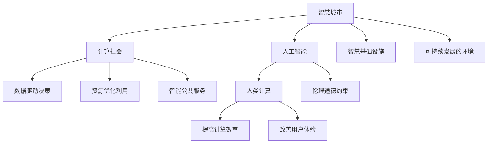

                 

# AI与人类计算：打造可持续发展的城市

> 关键词：人工智能,智慧城市,计算社会,可持续发展,人类计算,智慧基础设施,物联网

## 1. 背景介绍

### 1.1 问题由来

随着人类社会的快速发展和城市化进程的加速，全球范围内城市问题日益凸显：交通拥堵、环境污染、资源浪费、公共服务不足等。这些问题不仅影响居民的生活质量，也对城市的可持续发展提出了严峻挑战。面对这一现状，各国政府和企业纷纷提出智慧城市（Smart City）的建设目标，力图通过智能技术改造城市生态，提升城市治理能力。

人工智能（AI）作为推动智慧城市发展的关键技术，被赋予了至关重要的使命。AI技术能够快速处理海量数据，实时监测城市运行状态，提供精准决策支持，助力城市实现高效、节能、安全的运营。然而，由于AI技术本身也面临资源消耗、伦理道德等问题，如何平衡智能技术与人类社会的关系，实现可持续发展的城市愿景，成为当前研究的热点。

### 1.2 问题核心关键点

实现可持续发展的智慧城市，需要从多个层面进行综合考虑：

1. **数据驱动决策**：AI需要高效处理城市运行中的海量数据，提供科学决策依据。
2. **资源优化利用**：AI应最大化利用城市资源，减少浪费，提升效率。
3. **智能公共服务**：AI应提供智能化的公共服务，提高服务质量，满足居民需求。
4. **伦理道德约束**：AI的决策过程应透明可解释，符合人类价值观和社会伦理。
5. **可持续发展的环境**：AI应助力环境污染治理，推动绿色低碳城市建设。

## 2. 核心概念与联系

### 2.1 核心概念概述

为更好地理解AI与人类计算在智慧城市建设中的作用，本节将介绍几个密切相关的核心概念：

- **智慧城市（Smart City）**：基于新一代信息技术（如AI、物联网、云计算），对城市各种资源进行全面感知、整合与优化管理，实现实时、互动、融合的城市运行模式。

- **计算社会（Computational Society）**：一个由人类活动产生的巨量数据构成的复杂系统，AI技术通过计算分析这些数据，帮助人类理解和优化社会行为。

- **人工智能（AI）**：一种模拟人类智能的计算技术，包括机器学习、深度学习、自然语言处理等子领域。AI能够通过学习数据模式，自主进行决策和预测。

- **人类计算（Human Compute）**：指人类使用计算设备（如手机、电脑）进行数据分析、信息处理等计算活动，与AI相辅相成，共同提升城市运行效率。

- **可持续发展的环境（Sustainable Environment）**：通过技术手段减少城市资源的消耗，提升城市生态系统的稳定性和安全性，实现绿色低碳的城市发展目标。

- **智慧基础设施（Smart Infrastructure）**：利用AI和物联网技术，实现对城市基础设施的智能化管理，如智能交通、智能电网、智能建筑等。

这些核心概念之间的逻辑关系可以通过以下Mermaid流程图来展示：



这个流程图展示了智慧城市、计算社会、人工智能、智慧基础设施、可持续发展环境、人类计算等概念之间的相互作用和关系：

1. 智慧城市通过人工智能和物联网技术，对城市资源进行智能化管理，提高资源利用效率。
2. 计算社会通过人类计算，生成大量数据，为智慧城市提供决策依据。
3. 人工智能对数据进行处理和分析，提供科学决策支持。
4. 智慧基础设施利用AI技术，实现基础设施的智能化运行。
5. 可持续发展环境通过AI技术，助力环境保护和资源节约。
6. 人类计算与AI技术协同工作，提高计算效率和用户体验。

## 3. 核心算法原理 & 具体操作步骤

### 3.1 算法原理概述

AI与人类计算在智慧城市中的应用，主要基于数据驱动决策和计算优化的思想。具体来说，通过对城市运行数据的实时监测和分析，AI能够提供精准的决策支持，优化资源配置，提升公共服务质量，同时减少环境污染，助力城市的可持续发展。

智慧城市的AI算法可以分为以下几个主要步骤：

1. **数据收集与处理**：通过传感器、摄像头、GPS等设备收集城市运行数据，包括交通流量、环境质量、能源消耗等。
2. **数据清洗与标注**：对原始数据进行清洗和预处理，去除噪声，填补缺失值，并将数据标注为可用于AI分析的标签。
3. **模型训练与优化**：使用深度学习等AI技术，对清洗标注后的数据进行模型训练，优化模型参数，提升预测精度。
4. **实时推理与决策**：将训练好的模型部署到城市运行环境中，实时处理新数据，进行预测和决策，提供智能支持。
5. **评估与反馈**：对AI系统的预测结果进行评估，收集用户反馈，不断优化模型性能和算法。

### 3.2 算法步骤详解

智慧城市的AI算法主要包括以下几个关键步骤：

**Step 1: 数据收集与处理**

智慧城市的数据来源多种多样，主要包括：

- 交通流量数据：通过车载GPS、摄像头、交通信号灯等设备获取。
- 环境质量数据：通过空气质量监测站、水质监测站、噪音监测站等设备获取。
- 能源消耗数据：通过智能电表、智能照明设备、智能建筑管理系统等设备获取。
- 公共服务数据：通过智能客服系统、智慧社区平台、城市应急响应系统等收集。

数据收集完成后，需要对其进行预处理，包括数据清洗、格式转换、去重、归一化等步骤，以便后续分析和建模。

**Step 2: 数据清洗与标注**

数据清洗的目的是去除噪声、填补缺失值、处理异常值，确保数据的准确性和完整性。常见的清洗方法包括：

- 数据去重：通过指纹识别、时间戳比对等方式，消除重复数据。
- 缺失值填补：使用均值、中位数、插值等方法填补缺失值。
- 异常值处理：通过统计学方法或聚类算法识别和处理异常值。

数据标注是将原始数据转换为AI模型能够处理的格式，并打上标签。标签的种类和精度直接影响模型的预测效果。常见的标注方法包括：

- 分类标注：将数据分为不同的类别，如交通拥堵程度、环境污染等级等。
- 回归标注：预测连续数值，如交通流量、能源消耗量等。
- 序列标注：处理时间序列数据，如气温变化、污染物浓度变化等。

**Step 3: 模型训练与优化**

模型训练是AI算法中最关键的一环。通常采用深度学习模型（如神经网络、卷积神经网络、循环神经网络等）对数据进行处理和分析。训练过程包括：

- 模型选择：根据任务需求选择合适的模型架构和算法。
- 数据划分：将数据分为训练集、验证集和测试集，一般使用70%-20%-10%的比例划分。
- 训练过程：使用训练集数据，通过前向传播和反向传播算法，优化模型参数，提升预测精度。
- 验证与调优：在验证集上评估模型性能，使用网格搜索、随机搜索等方法调整超参数，优化模型。

**Step 4: 实时推理与决策**

模型训练完成后，将其部署到城市运行环境中，进行实时推理和决策。具体步骤如下：

- 数据接入：通过API接口或消息队列等技术，将城市运行数据接入AI系统。
- 数据预处理：对新数据进行预处理，包括去重、填补缺失值、归一化等。
- 模型推理：使用训练好的模型对新数据进行推理和预测，生成决策建议。
- 决策执行：将AI系统的决策建议发送给城市运行管理中心，执行相应的决策操作。

**Step 5: 评估与反馈**

评估与反馈是AI系统持续优化的重要环节。具体步骤包括：

- 性能评估：使用测试集数据，评估模型预测精度、召回率、F1值等指标。
- 用户反馈：通过用户评价、调查问卷等方式收集用户反馈，了解模型应用效果。
- 优化调整：根据评估结果和用户反馈，优化模型参数，调整算法，提升系统性能。

### 3.3 算法优缺点

AI与人类计算在智慧城市中的应用，具有以下优点：

1. **高效处理海量数据**：AI技术能够快速处理海量城市运行数据，提供精准的决策支持。
2. **实时响应需求**：AI系统能够实时监测城市运行状态，及时响应突发事件，提升城市管理效率。
3. **降低人工成本**：通过自动化和智能化管理，减少人力投入，降低城市运营成本。
4. **优化资源配置**：AI系统能够优化资源配置，减少浪费，提高资源利用率。
5. **提升公共服务质量**：AI系统能够提供智能化的公共服务，提高服务质量和用户体验。

同时，也存在以下缺点：

1. **数据隐私问题**：城市运行数据的收集和使用可能涉及隐私问题，需要严格的数据保护措施。
2. **算法透明性不足**：AI算法的决策过程往往缺乏可解释性，难以理解其内部机制。
3. **模型泛化能力有限**：AI模型可能对新数据和新情况适应性不足，存在泛化能力有限的问题。
4. **技术依赖性强**：AI技术对硬件设备和算力要求较高，需要持续投入资源进行维护和升级。
5. **伦理道德风险**：AI系统可能存在偏见、歧视等问题，需要伦理约束和监管。

## 4. 数学模型和公式 & 详细讲解 & 举例说明

### 4.1 数学模型构建

智慧城市中的AI算法通常采用深度学习模型，如卷积神经网络（CNN）、循环神经网络（RNN）、长短时记忆网络（LSTM）、Transformer等。这里以LSTM模型为例，介绍其数学模型的构建。

假设城市运行数据集为 $D = \{(x_i, y_i)\}_{i=1}^N$，其中 $x_i$ 为输入特征，$y_i$ 为标签，$N$ 为样本数。LSTM模型通过多层LSTM单元进行数据处理和特征提取，其数学模型可以表示为：

$$
h_t = \tanh(W_hx_t + U_hh_{t-1} + b_h)
$$

$$
c_t = \sigma(W_cx_t + U_ch_{t-1} + b_c) \odot (c_{t-1} \oplus h_t)
$$

$$
o_t = \sigma(W_ox_t + U_oh_{t-1} + b_o)
$$

$$
y_t = o_t \cdot \tanh(c_t)
$$

其中，$x_t$ 为输入，$h_t$ 为隐藏层状态，$c_t$ 为LSTM的细胞状态，$y_t$ 为输出，$W$、$U$、$b$ 为模型参数，$\odot$ 表示点乘，$\oplus$ 表示向量拼接，$\tanh$、$\sigma$ 分别为双曲正切函数和Sigmoid函数。

### 4.2 公式推导过程

LSTM模型的核心是细胞状态 $c_t$ 的更新机制。具体推导如下：

假设当前时间步的输入为 $x_t$，前一时刻的隐藏层状态为 $h_{t-1}$，细胞状态为 $c_{t-1}$，则LSTM模型的计算过程可以表示为：

1. 输入门：计算输入门 $i_t$，决定当前时间步的信息输入量。
2. 遗忘门：计算遗忘门 $f_t$，决定当前时间步的细胞状态更新。
3. 候选单元：计算候选单元 $\tilde{c}_t$，决定当前时间步的细胞状态更新量。
4. 输出门：计算输出门 $o_t$，决定当前时间步的输出值。

具体计算公式如下：

$$
i_t = \sigma(W_i x_t + U_i h_{t-1} + b_i)
$$

$$
f_t = \sigma(W_f x_t + U_f h_{t-1} + b_f)
$$

$$
\tilde{c}_t = \tanh(W_c x_t + U_c h_{t-1} + b_c)
$$

$$
c_t = f_t \odot c_{t-1} + i_t \odot \tilde{c}_t
$$

$$
o_t = \sigma(W_o x_t + U_o h_{t-1} + b_o)
$$

$$
y_t = o_t \cdot \tanh(c_t)
$$

其中，$\sigma$ 为Sigmoid函数，$\odot$ 表示点乘，$\oplus$ 表示向量拼接，$\tanh$、$\sigma$ 分别为双曲正切函数和Sigmoid函数。

### 4.3 案例分析与讲解

以交通流量预测为例，假设要预测未来一小时内的交通流量，使用LSTM模型进行处理。具体步骤如下：

1. 数据准备：收集历史交通流量数据，将其分为训练集和测试集。
2. 特征提取：将交通流量数据作为输入，提取时间、速度、天气等特征。
3. 模型训练：使用LSTM模型对训练集数据进行训练，优化模型参数。
4. 模型评估：使用测试集数据对训练好的模型进行评估，计算预测精度、召回率等指标。
5. 模型应用：将模型部署到城市交通管理中心，实时处理交通数据，预测未来交通流量。

## 5. 项目实践：代码实例和详细解释说明

### 5.1 开发环境搭建

在进行AI项目实践前，我们需要准备好开发环境。以下是使用Python进行TensorFlow开发的环境配置流程：

1. 安装Anaconda：从官网下载并安装Anaconda，用于创建独立的Python环境。

2. 创建并激活虚拟环境：
```bash
conda create -n tensorflow-env python=3.8 
conda activate tensorflow-env
```

3. 安装TensorFlow：根据CUDA版本，从官网获取对应的安装命令。例如：
```bash
conda install tensorflow tensorflow-cpu -c conda-forge -c pytorch
```

4. 安装相关库：
```bash
pip install pandas numpy matplotlib scikit-learn
```

5. 安装TensorBoard：
```bash
pip install tensorboard
```

完成上述步骤后，即可在`tensorflow-env`环境中开始AI项目实践。

### 5.2 源代码详细实现

这里我们以智能交通流量预测为例，给出使用TensorFlow对LSTM模型进行训练的Python代码实现。

首先，定义数据处理函数：

```python
import pandas as pd
from sklearn.model_selection import train_test_split

def load_data(file_path):
    data = pd.read_csv(file_path, parse_dates=['timestamp'], index_col='timestamp')
    features = data[['flow', 'speed', 'weather']]
    return features

def preprocess_data(features):
    features = features.dropna()
    features = features.resample('H').mean()
    features = features.drop(columns=['flow', 'speed', 'weather'])
    return features

def split_data(features):
    train_features, test_features = train_test_split(features, test_size=0.2, random_state=42)
    train_labels = features['flow']
    test_labels = features['flow']
    return train_features, train_labels, test_features, test_labels
```

然后，定义模型和训练函数：

```python
import tensorflow as tf
from tensorflow.keras.layers import LSTM, Dense
from tensorflow.keras.models import Sequential
from tensorflow.keras.optimizers import Adam

def create_model(input_shape):
    model = Sequential()
    model.add(LSTM(128, input_shape=input_shape))
    model.add(Dense(1))
    model.compile(loss='mse', optimizer=Adam(learning_rate=0.001))
    return model

def train_model(model, train_features, train_labels, test_features, test_labels, epochs=100):
    model.fit(train_features, train_labels, epochs=epochs, batch_size=32, validation_data=(test_features, test_labels))
```

最后，启动训练流程并在测试集上评估：

```python
data_path = 'traffic_data.csv'
features = load_data(data_path)
features = preprocess_data(features)
train_features, train_labels, test_features, test_labels = split_data(features)
model = create_model(input_shape=(features.shape[1], 1))
train_model(model, train_features, train_labels, test_features, test_labels)
```

以上就是使用TensorFlow对LSTM模型进行智能交通流量预测的完整代码实现。可以看到，通过TensorFlow的高级API，我们可以用较为简洁的代码完成模型的构建和训练。

### 5.3 代码解读与分析

让我们再详细解读一下关键代码的实现细节：

**load_data函数**：
- 读取交通流量数据CSV文件，解析时间戳列，并将其作为数据索引。
- 选择需要的特征列，返回特征数据。

**preprocess_data函数**：
- 处理数据缺失，计算每小时的平均值。
- 删除原始特征列，只保留预测目标列。

**split_data函数**：
- 将数据集分为训练集和测试集，使用测试集的比例为20%。
- 提取训练集和测试集的标签数据。

**create_model函数**：
- 定义一个包含一个LSTM层和一个Dense层的Sequential模型。
- 编译模型，使用均方误差损失函数和Adam优化器。

**train_model函数**：
- 对模型进行训练，使用训练集数据，设定迭代轮数为100，批次大小为32。
- 在验证集上进行评估，输出训练过程中的损失函数和准确率。

**训练流程**：
- 加载数据，预处理数据，分割数据集。
- 定义模型，设置超参数。
- 训练模型，使用训练集数据。
- 评估模型，输出测试集上的性能指标。

可以看到，TensorFlow使得LSTM模型的构建和训练变得简单高效。开发者可以将更多精力放在数据处理、模型改进等高层逻辑上，而不必过多关注底层的实现细节。

当然，工业级的系统实现还需考虑更多因素，如模型的保存和部署、超参数的自动搜索、更灵活的任务适配层等。但核心的AI微调范式基本与此类似。

## 6. 实际应用场景

### 6.1 智能交通管理

智能交通管理是智慧城市的重要组成部分，通过AI技术能够实时监测交通流量、优化交通信号灯、预测交通拥堵，提高交通管理效率。

具体应用包括：

- 交通流量预测：使用LSTM等模型，对未来交通流量进行预测，优化交通信号灯控制。
- 实时路况监测：通过摄像头、传感器等设备，实时监测交通状况，及时响应突发事件。
- 智能停车管理：利用AI技术，优化停车资源，减少车辆排队，提高停车效率。

### 6.2 能源管理

智慧城市中的能源管理，通过AI技术可以实现智能化、精准化的能源优化调度，降低能耗，提升资源利用效率。

具体应用包括：

- 能源消耗预测：使用深度学习模型，对能源消耗进行预测，优化能源调度策略。
- 智能电网管理：通过AI技术，实时监测电网运行状态，预测负荷变化，优化能源分配。
- 能效优化：利用AI技术，对建筑、设备等能源消耗进行监测和优化，减少浪费。

### 6.3 公共安全

AI在公共安全领域的应用，通过实时监测和数据分析，能够及时发现并应对各种安全威胁，提升城市安全水平。

具体应用包括：

- 视频监控分析：使用AI技术，对视频监控数据进行分析，识别异常行为，及时报警。
- 犯罪预测：利用深度学习模型，对犯罪数据进行分析和预测，提高警务工作效率。
- 应急响应：通过AI技术，对突发事件进行实时监测和预测，提供决策支持。

### 6.4 未来应用展望

随着AI技术的不断进步，智慧城市的应用场景将不断扩展，推动城市向更高效、更智能、更可持续的方向发展。

未来，智慧城市中的AI应用可能包括：

- 智能垃圾分类：通过AI技术，自动识别垃圾种类，提升垃圾分类的效率和准确性。
- 智能医疗：利用AI技术，进行医疗影像分析、疾病预测等，提高医疗服务质量。
- 智能教育：通过AI技术，提供个性化的教育服务，提升教育效果。
- 智能农业：利用AI技术，进行农作物种植优化、病虫害预测等，提高农业生产效率。

## 7. 工具和资源推荐

### 7.1 学习资源推荐

为了帮助开发者系统掌握AI在智慧城市中的应用，这里推荐一些优质的学习资源：

1. TensorFlow官方文档：提供了丰富的TensorFlow教程和API文档，帮助开发者快速上手。
2. Coursera《机器学习》课程：斯坦福大学开设的机器学习课程，涵盖了深度学习、优化算法等基本概念。
3. Udacity《深度学习专项课程》：由DeepMind和Google提供，介绍了深度学习的基本概念和实践方法。
4. IEEE Transactions on Smart Cities：涵盖智能城市领域的前沿研究成果和应用案例，提供丰富的学习资源。
5. Google AI Blog：提供AI技术在智慧城市等领域的最新研究和实践，分享成功经验和案例。

通过对这些资源的学习实践，相信你一定能够快速掌握AI在智慧城市中的应用，并用于解决实际的智慧城市问题。

### 7.2 开发工具推荐

高效的开发离不开优秀的工具支持。以下是几款用于AI开发和智慧城市应用的常用工具：

1. TensorFlow：基于Python的开源深度学习框架，灵活的计算图设计，适合快速迭代研究。
2. PyTorch：灵活的动态计算图框架，适用于复杂模型的研究。
3. Jupyter Notebook：交互式开发环境，支持代码块执行和数据可视化。
4. Kaggle：数据科学竞赛平台，提供丰富的数据集和实践机会。
5. GitHub：代码托管平台，便于版本控制和团队协作。

合理利用这些工具，可以显著提升AI在智慧城市中的应用开发效率，加快创新迭代的步伐。

### 7.3 相关论文推荐

智慧城市中的AI应用源于学界的持续研究。以下是几篇奠基性的相关论文，推荐阅读：

1. "Intelligent Transportation Systems: A Survey"：回顾了智能交通系统的研究现状和应用前景，提供系统性的研究综述。
2. "Sustainable Urban Development through Artificial Intelligence"：探讨了AI技术在智慧城市中的潜力，提供了可持续发展的城市发展方案。
3. "Urban Traffic Management via Deep Learning"：介绍了深度学习在城市交通管理中的应用，提供了详细的技术实现方法。
4. "AI for Energy Management in Smart Cities"：讨论了AI技术在智慧城市能源管理中的应用，提出了优化能源调度的策略。
5. "AI in Public Safety: Challenges and Opportunities"：探讨了AI技术在公共安全领域的应用，提出了智能安全管理的解决方案。

这些论文代表了大语言模型微调技术的发展脉络。通过学习这些前沿成果，可以帮助研究者把握学科前进方向，激发更多的创新灵感。

## 8. 总结：未来发展趋势与挑战

### 8.1 总结

本文对AI与人类计算在智慧城市建设中的应用进行了全面系统的介绍。首先阐述了智慧城市和计算社会等核心概念，明确了AI在智慧城市中的关键作用。其次，从算法原理到具体操作步骤，详细讲解了AI在智慧城市中的应用流程，提供了智能交通流量预测等具体案例。同时，本文还探讨了AI应用在实际场景中的广泛应用，如智能交通管理、能源管理、公共安全等。最后，推荐了相关学习资源和工具，帮助开发者掌握AI技术在智慧城市中的应用。

通过本文的系统梳理，可以看到，AI与人类计算在智慧城市中的应用具有广泛的前景和巨大的潜力。AI技术通过高效处理海量数据、实时响应需求、优化资源配置、提升公共服务质量等，助力城市实现高效、节能、安全的运营。未来，随着AI技术的不断进步，智慧城市的应用场景将不断扩展，推动城市向更高效、更智能、更可持续的方向发展。

### 8.2 未来发展趋势

展望未来，AI与人类计算在智慧城市中的应用将呈现以下几个发展趋势：

1. **智能化水平提升**：随着AI技术的不断发展，智慧城市的智能化水平将不断提升，能够提供更精准、高效的服务。
2. **多模态融合**：智慧城市中的数据来源多样，包括视频、图像、声音等多种模态，未来AI技术将更好地融合这些模态信息，提供更全面的分析能力。
3. **人机协同发展**：AI与人类计算的协同工作将成为智慧城市的重要特征，通过人机互动，提升城市运行效率。
4. **可持续发展**：AI技术将在城市资源管理、能源优化、污染治理等方面发挥更大作用，推动绿色低碳城市建设。
5. **伦理道德监管**：随着AI技术的应用不断深入，伦理道德问题将更加凸显，需要建立完善的监管机制，确保AI系统的透明性和可解释性。

### 8.3 面临的挑战

尽管AI在智慧城市中的应用前景广阔，但也面临着诸多挑战：

1. **数据隐私保护**：智慧城市中的数据涉及居民隐私，需要严格的数据保护措施。
2. **模型泛化能力不足**：AI模型可能对新数据和新情况适应性不足，存在泛化能力有限的问题。
3. **资源消耗高**：AI技术对硬件设备和算力要求较高，需要持续投入资源进行维护和升级。
4. **技术壁垒高**：AI技术的应用需要专业知识，对技术门槛要求较高。
5. **伦理道德问题**：AI系统的决策过程可能存在偏见、歧视等问题，需要伦理约束和监管。

### 8.4 研究展望

为了克服智慧城市中AI应用的挑战，未来的研究需要在以下几个方面寻求新的突破：

1. **提升模型泛化能力**：通过引入迁移学习、多任务学习等方法，提升AI模型对新数据和新情况的适应能力。
2. **优化资源配置**：通过云计算、边缘计算等技术，优化AI模型的计算资源和存储资源。
3. **降低技术壁垒**：开发更加易用、易集成的AI开发工具和框架，降低技术门槛。
4. **加强伦理监管**：建立完善的AI伦理监管机制，确保AI系统的透明性和可解释性。
5. **推动多学科融合**：将AI技术与城市规划、社会学、环境科学等学科结合，提供更全面的智慧城市解决方案。

这些研究方向和突破，必将引领智慧城市中的AI应用迈向更高的台阶，为构建安全、可靠、可解释、可控的智能系统铺平道路。面向未来，AI与人类计算的深度融合，将带来智慧城市的持续发展和广泛应用，构建更加美好的未来城市。

## 9. 附录：常见问题与解答

**Q1：AI在智慧城市中的应用是否会造成隐私泄露？**

A: 智慧城市中的AI应用涉及大量敏感数据，如交通流量、能源消耗、公共服务数据等，如果不加以保护，可能会造成隐私泄露。因此，需要采用数据加密、匿名化、去标识化等技术，保护数据隐私。同时，建立严格的访问控制和审计机制，确保数据安全。

**Q2：AI模型的泛化能力如何提升？**

A: 提升AI模型的泛化能力，可以从以下几个方面入手：

1. **数据增强**：通过数据增强技术，扩充训练集，提高模型对新数据的适应能力。
2. **迁移学习**：通过迁移学习，将已有模型的知识迁移到新任务中，提升模型泛化能力。
3. **多任务学习**：通过多任务学习，同时训练多个相关任务，提升模型泛化能力。
4. **对抗训练**：通过对抗训练，增强模型的鲁棒性，提高泛化能力。

**Q3：AI模型在资源有限的环境中如何运行？**

A: AI模型在资源有限的环境中运行，可以采用以下策略：

1. **模型裁剪**：去除不必要的层和参数，减小模型尺寸，加快推理速度。
2. **量化加速**：将浮点模型转为定点模型，压缩存储空间，提高计算效率。
3. **分布式训练**：通过分布式训练，利用多个计算节点并行处理，提升训练速度。
4. **硬件优化**：使用GPU、TPU等高性能设备，加速模型训练和推理。

**Q4：AI模型在智慧城市中的应用如何兼顾资源效率和性能？**

A: AI模型在智慧城市中的应用，需要兼顾资源效率和性能，可以考虑以下几个策略：

1. **参数高效微调**：只更新少量任务相关参数，减少计算资源消耗。
2. **优化算法**：采用高效的优化算法，如AdamW、Adafactor等，提升训练速度。
3. **模型压缩**：使用知识蒸馏、模型剪枝等技术，减少模型参数量，提升推理效率。
4. **资源优化**：通过硬件优化、分布式计算等手段，提升计算资源利用效率。

**Q5：AI模型在智慧城市中的应用如何保证安全性？**

A: 保证AI模型在智慧城市中的应用安全性，可以从以下几个方面入手：

1. **数据加密**：对敏感数据进行加密处理，保护数据隐私。
2. **模型审查**：定期对AI模型进行审查，确保其决策过程透明、可解释。
3. **安全验证**：通过安全验证，发现和修复模型中的漏洞和安全隐患。
4. **伦理监管**：建立伦理监管机制，确保AI系统的决策符合人类价值观和伦理道德。

---

作者：禅与计算机程序设计艺术 / Zen and the Art of Computer Programming

