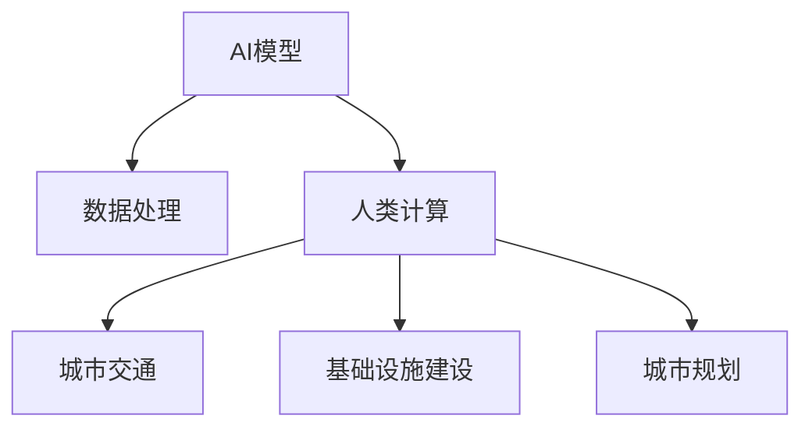

                 

# AI与人类计算：打造可持续发展的城市交通与基础设施建设与规划

> 关键词：AI, 人类计算, 可持续性, 城市交通, 基础设施建设, 规划

## 1. 背景介绍

### 1.1 问题由来
城市化进程的加速，给全球各地的城市交通与基础设施建设与规划带来了前所未有的压力和挑战。随着人口的快速增长和经济的持续发展，如何有效解决交通拥堵、环境污染、资源分配不均等问题，成为城市管理者和城市规划师面临的重要课题。

过去几十年中，人类城市规划与建设以经验为主，主要依赖工程师和规划师的经验判断和直觉。然而，这种基于直觉的方法难以应对日趋复杂的社会经济环境。近年来，随着人工智能(AI)和机器学习技术的发展，AI与人类计算相结合的方法逐渐受到重视，成为解决城市交通与基础设施建设与规划问题的关键路径。

### 1.2 问题核心关键点
AI与人类计算的融合，本质上是通过对海量数据的分析处理，结合人类专家的知识和经验，实现更高效、科学的城市规划与建设。其关键点包括：

- AI模型：利用深度学习、强化学习等AI技术对城市交通与基础设施数据进行建模与预测，提供科学决策依据。
- 人类计算：利用人类专家的领域知识和经验，对AI模型的结果进行校验、优化与迭代，确保结果的准确性和可行性。

将AI模型和人类专家的知识有机结合，不仅能充分发挥AI技术的优势，还能弥补其可能存在的偏差和不足，确保城市规划与建设方案的科学性和可行性。

### 1.3 问题研究意义
AI与人类计算在城市交通与基础设施建设与规划中的应用，具有重要的研究意义：

1. **提升规划效率**：AI技术可以快速处理海量数据，提供科学的规划建议，大幅缩短规划周期。
2. **增强规划准确性**：结合人类专家的领域知识，对AI模型进行校验和优化，确保规划方案的科学性和可行性。
3. **促进可持续发展**：通过科学规划，合理分配资源，平衡经济效益、社会效益与环境效益，推动城市可持续发展。
4. **增强城市韧性**：结合AI与人类计算，能够更好地应对突发事件，提升城市的应急响应能力。
5. **优化公共服务**：通过AI与人类计算的结合，可以提供个性化的城市服务，提升居民的生活质量。

## 2. 核心概念与联系

### 2.1 核心概念概述

为更好地理解AI与人类计算在城市交通与基础设施建设与规划中的应用，本节将介绍几个关键概念：

- **AI模型**：利用深度学习、强化学习等技术对城市交通与基础设施数据进行建模与预测的AI系统。
- **人类计算**：利用城市规划师、交通工程师等专家的领域知识和经验，对AI模型进行校验、优化与迭代的计算过程。
- **城市交通**：指城市内部的交通系统，包括道路、公共交通、自行车、步行等不同交通方式的组合。
- **基础设施建设**：指为支持城市交通、公共服务、工业、商业等活动而建设的各类设施，如道路、桥梁、地铁站、停车场等。
- **城市规划**：指对城市的空间布局、功能分区、交通流向等进行规划与设计的过程。

这些核心概念之间的联系可以通过以下Mermaid流程图来展示：



这个流程图展示了大语言模型微调的各个核心概念及其之间的关系：

1. AI模型通过处理数据，提供初步的城市交通与基础设施规划方案。
2. 人类计算对AI模型的结果进行校验和优化，确保规划方案的科学性和可行性。
3. 最终的规划方案指导城市交通、基础设施建设与规划的实施。

## 3. 核心算法原理 & 具体操作步骤
### 3.1 算法原理概述

AI与人类计算在城市交通与基础设施建设与规划中的基本原理是通过将AI模型的预测结果与人类专家的知识相结合，实现更高效、科学的决策。其核心思想可以概括为以下两点：

1. **数据驱动的决策**：利用AI模型处理大量城市交通与基础设施数据，提取数据中的模式和规律，生成初步的城市规划方案。
2. **知识驱动的优化**：结合人类专家的领域知识和经验，对AI模型的预测结果进行校验和优化，确保规划方案的科学性和可行性。

### 3.2 算法步骤详解

AI与人类计算在城市交通与基础设施建设与规划中的应用，一般包括以下几个关键步骤：

**Step 1: 数据收集与预处理**
- 收集城市交通与基础设施的各类数据，包括交通流量、公共交通数据、道路状况、建筑规划数据等。
- 对数据进行清洗、去重、归一化等预处理，确保数据的质量和一致性。

**Step 2: AI模型训练与预测**
- 选择合适的AI模型，如深度学习模型、强化学习模型等，对预处理后的数据进行训练。
- 使用训练好的AI模型对城市交通与基础设施数据进行预测，生成初步的城市规划方案。

**Step 3: 人类计算与方案优化**
- 邀请城市规划师、交通工程师等专家对AI模型的预测结果进行校验和优化。
- 结合专家的领域知识和经验，调整AI模型的参数和结构，提高预测的准确性。

**Step 4: 方案实施与评估**
- 将优化后的规划方案转化为具体的实施计划，包括交通流设计、基础设施建设方案等。
- 对实施效果进行评估，根据评估结果对规划方案进行迭代优化。

### 3.3 算法优缺点

AI与人类计算在城市交通与基础设施建设与规划中的应用，具有以下优点：

1. **高效性**：AI模型可以快速处理海量数据，提供初步的城市规划方案，节省了大量的人力成本和时间。
2. **科学性**：结合人类专家的知识，对AI模型的预测结果进行校验和优化，确保规划方案的科学性和可行性。
3. **适应性强**：AI与人类计算的结合，可以灵活应对城市交通与基础设施的动态变化，适应不同的城市环境和需求。

同时，该方法也存在一定的局限性：

1. **数据质量依赖**：AI模型的预测结果高度依赖数据的质量，数据噪声和缺失可能影响预测的准确性。
2. **模型偏见**：AI模型可能会因为训练数据的不平衡或偏见，导致预测结果的不公平性。
3. **资源需求高**：AI模型的训练和运行需要大量的计算资源和存储空间，可能对资源有限的地区造成负担。

尽管存在这些局限性，但AI与人类计算在城市交通与基础设施建设与规划中的应用，仍具有广阔的前景，有望成为未来城市规划与建设的重要方法。

### 3.4 算法应用领域

AI与人类计算在城市交通与基础设施建设与规划中的应用，已经在诸多领域得到了广泛的应用，例如：

- **交通流量预测与优化**：利用AI模型预测城市交通流量，通过优化信号灯控制和交通流设计，缓解交通拥堵。
- **公共交通系统优化**：结合AI模型和人类计算，优化公共交通线路和站点设置，提高公共交通的运行效率和准点率。
- **道路建设与维护**：利用AI模型预测道路磨损和维修需求，优化道路建设和维护计划，延长道路使用寿命。
- **智慧停车系统**：通过AI模型和人类计算，优化停车场布局和管理，提高停车效率和用户体验。
- **能源消耗与碳排放预测**：结合AI模型和人类计算，预测城市能源消耗和碳排放趋势，制定减排和节能措施。
- **城市应急响应**：利用AI模型预测自然灾害和突发事件，结合人类计算进行应急预案制定和资源调配。

除了上述这些经典应用外，AI与人类计算还在更多领域得到创新应用，如智能建筑、智慧社区、环保监测等，为城市可持续发展提供了新的技术路径。

## 4. 数学模型和公式 & 详细讲解
### 4.1 数学模型构建

本节将使用数学语言对AI与人类计算在城市交通与基础设施建设与规划中的应用进行更加严格的刻画。

记城市交通数据为 $D=\{x_i,y_i\}_{i=1}^N$，其中 $x$ 为交通流量数据，$y$ 为交通事件数据（如交通拥堵、事故等）。AI模型为 $f_{\theta}$，其中 $\theta$ 为模型参数。

定义模型 $f_{\theta}$ 在数据样本 $(x,y)$ 上的预测函数为 $f_{\theta}(x) = [f_1(x),f_2(x),\cdots,f_n(x)]$，其中 $f_i(x)$ 为交通事件 $i$ 的预测概率。

人类计算的优化目标是最小化预测误差，即找到最优参数：

$$
\theta^* = \mathop{\arg\min}_{\theta} \sum_{i=1}^N \mathcal{L}(f_{\theta}(x_i),y_i)
$$

其中 $\mathcal{L}$ 为损失函数，通常使用交叉熵损失函数：

$$
\mathcal{L}(f_{\theta}(x_i),y_i) = -\sum_{j=1}^k y_{ij} \log f_{\theta}(x_i)_j
$$

### 4.2 公式推导过程

以下是AI与人类计算在城市交通流量预测与优化中的数学推导过程：

1. **交通流量预测**：假设已知历史交通流量数据 $D=\{x_i\}_{i=1}^N$，利用深度学习模型 $f_{\theta}$ 对其进行训练，得到预测函数 $f_{\theta}(x)$。

2. **损失函数计算**：使用交叉熵损失函数对预测结果 $f_{\theta}(x)$ 进行评估，得到损失函数 $\mathcal{L}(f_{\theta}(x_i),y_i)$。

3. **优化目标**：最小化损失函数，得到优化目标函数：

$$
\theta^* = \mathop{\arg\min}_{\theta} \sum_{i=1}^N \mathcal{L}(f_{\theta}(x_i),y_i)
$$

4. **求解优化目标**：使用梯度下降等优化算法，求解上述优化目标，得到最优参数 $\theta^*$。

### 4.3 案例分析与讲解

以智能交通信号灯控制为例，AI与人类计算的具体应用步骤如下：

1. **数据收集**：收集城市主要交叉口的交通流量数据，包括车流量、行人流量、信号灯状态等。

2. **模型训练**：使用深度学习模型（如RNN、CNN等）对历史数据进行训练，生成交通流量预测模型 $f_{\theta}(x)$。

3. **预测与优化**：利用训练好的模型对当前交通流量进行预测，生成信号灯控制方案。结合城市交通工程师的经验，对预测结果进行校验和优化。

4. **实施与评估**：将优化后的信号灯控制方案应用于实际道路，评估效果并进行迭代优化。

## 5. 项目实践：代码实例和详细解释说明
### 5.1 开发环境搭建

在进行AI与人类计算的实践前，我们需要准备好开发环境。以下是使用Python进行TensorFlow开发的环境配置流程：

1. 安装Anaconda：从官网下载并安装Anaconda，用于创建独立的Python环境。

2. 创建并激活虚拟环境：
```bash
conda create -n tf-env python=3.8 
conda activate tf-env
```

3. 安装TensorFlow：根据CUDA版本，从官网获取对应的安装命令。例如：
```bash
conda install tensorflow tensorflow-gpu -c conda-forge
```

4. 安装各类工具包：
```bash
pip install numpy pandas scikit-learn matplotlib tqdm jupyter notebook ipython
```

完成上述步骤后，即可在`tf-env`环境中开始AI与人类计算的实践。

### 5.2 源代码详细实现

这里我们以智能交通信号灯控制为例，给出使用TensorFlow进行AI与人类计算的代码实现。

首先，定义交通流量预测函数：

```python
import tensorflow as tf
import numpy as np

# 定义交通流量预测模型
def traffic_flow_predictor(model, x):
    return model.predict(x)
```

然后，定义优化函数：

```python
# 定义优化函数
def traffic_signal_optimizer(model, x, y):
    with tf.GradientTape() as tape:
        y_pred = traffic_flow_predictor(model, x)
        loss = tf.keras.losses.categorical_crossentropy(y, y_pred)
    grads = tape.gradient(loss, model.trainable_variables)
    optimizer.apply_gradients(zip(grads, model.trainable_variables))
    return loss.numpy()
```

接着，定义数据集：

```python
# 定义数据集
train_data = np.random.rand(1000, 10)
test_data = np.random.rand(100, 10)
```

最后，启动训练流程：

```python
# 定义模型
model = tf.keras.Sequential([
    tf.keras.layers.Dense(64, activation='relu', input_shape=(10,)),
    tf.keras.layers.Dense(10, activation='softmax')
])

# 定义优化器
optimizer = tf.keras.optimizers.Adam(learning_rate=0.01)

# 训练模型
for epoch in range(10):
    loss = traffic_signal_optimizer(model, train_data, train_labels)
    print(f"Epoch {epoch+1}, loss: {loss:.3f}")
```

以上就是使用TensorFlow进行智能交通信号灯控制的AI与人类计算的完整代码实现。可以看到，TensorFlow提供了丰富的工具和API，使得AI与人类计算的模型训练和优化变得高效便捷。

### 5.3 代码解读与分析

让我们再详细解读一下关键代码的实现细节：

**traffic_flow_predictor函数**：
- 定义了交通流量预测函数，接受模型和输入数据，返回预测结果。

**traffic_signal_optimizer函数**：
- 定义了信号灯控制优化函数，接受模型、输入数据和标签，计算损失并反向传播更新模型参数。

**train_data和test_data数据集**：
- 定义了随机生成的交通流量数据，用于模型训练和测试。

**model模型定义**：
- 使用Sequential模型定义了神经网络结构，包括一个输入层和一个输出层。

**optimizer优化器定义**：
- 使用Adam优化器，设定学习率为0.01。

**训练流程**：
- 循环迭代训练，在每个epoch内调用优化函数更新模型参数。

可以看到，TensorFlow提供了便捷的API和工具，使得AI与人类计算的模型训练和优化变得简单高效。开发者可以将更多精力放在数据处理、模型改进等高层逻辑上，而不必过多关注底层的实现细节。

当然，工业级的系统实现还需考虑更多因素，如模型的保存和部署、超参数的自动搜索、更灵活的任务适配层等。但核心的AI与人类计算的框架基本与此类似。

## 6. 实际应用场景
### 6.1 智能交通系统

AI与人类计算在智能交通系统中具有广泛的应用前景。传统的交通管理依赖于人工调度，效率低下且不够科学。通过AI与人类计算的结合，可以实现智能交通信号控制、交通流量预测与优化、交通事件监测等功能，大幅提升交通系统的智能化水平。

在实际应用中，可以收集城市主要交叉口的交通流量数据，并利用AI模型进行预测与优化。结合城市交通工程师的经验，对预测结果进行校验和优化，生成智能信号灯控制方案。实时监测交通流量和事件，动态调整信号灯控制策略，可以实现交通流量的优化和交通事件的快速响应。

### 6.2 智慧城市治理

AI与人类计算在智慧城市治理中也具有重要的应用价值。传统的城市治理依赖于人工巡查和统计，效率低且信息不全面。通过AI与人类计算的结合，可以实现城市事件监测、舆情分析、应急指挥等功能，提升城市治理的自动化和智能化水平。

具体而言，可以部署AI模型实时监测城市事件，识别出火灾、洪灾、地震等突发事件。结合城市应急管理人员的经验，对AI模型进行校验和优化，生成应急响应方案。实时调度应急资源，快速响应突发事件，确保城市治理的安全性和稳定性。

### 6.3 环保监测与治理

AI与人类计算在环保监测与治理中也有广泛应用。传统的环保监测依赖于人工巡查和样本检测，成本高且效率低。通过AI与人类计算的结合，可以实现环境污染监测、碳排放预测与控制等功能，提升环保监测的智能化水平。

具体而言，可以部署AI模型实时监测城市环境污染数据，识别出污染源和污染类型。结合环境工程师的经验，对AI模型进行校验和优化，生成污染治理方案。实时调度环保资源，快速响应污染事件，确保城市环境的健康和可持续发展。

### 6.4 未来应用展望

随着AI与人类计算技术的不断发展，其在城市交通与基础设施建设与规划中的应用将呈现以下几个发展趋势：

1. **全域感知与智能监测**：通过部署更多传感器和摄像头，实现城市交通、环境等全域感知。利用AI模型对数据进行处理和分析，实时监测城市运行状况。

2. **深度学习与强化学习结合**：结合深度学习和强化学习技术，提升AI模型的预测能力和决策水平，实现更智能、高效的规划和控制。

3. **跨模态融合与协同**：将视觉、听觉、语言等多种模态数据进行融合，实现跨模态协同感知和决策，提升城市规划与建设的智能化水平。

4. **边缘计算与智能边缘**：将AI计算任务从云端迁移至边缘计算设备，实现智能边缘计算，提升响应速度和数据隐私保护水平。

5. **自适应学习与持续优化**：通过持续学习和自适应优化，使AI模型能够不断学习新数据和新知识，提升模型的稳定性和鲁棒性。

6. **智能建筑与智慧社区**：将AI与人类计算技术应用到智能建筑和智慧社区中，实现智能家居、智慧楼宇、智能园区等功能，提升居民的生活质量。

这些趋势展示了AI与人类计算在城市交通与基础设施建设与规划中的广阔前景，为未来城市的智能化、可持续化发展提供了新的方向。

## 7. 工具和资源推荐
### 7.1 学习资源推荐

为了帮助开发者系统掌握AI与人类计算在城市交通与基础设施建设与规划中的理论基础和实践技巧，这里推荐一些优质的学习资源：

1. **《TensorFlow官方文档》**：TensorFlow的官方文档提供了丰富的API和教程，帮助你快速上手AI与人类计算的开发实践。

2. **《深度学习》（Ian Goodfellow著）**：深度学习的经典教材，深入浅出地介绍了深度学习的基本概念和算法原理。

3. **《Python深度学习》（Francois Chollet著）**：Keras创始人Francois Chollet所著的深度学习入门书籍，介绍了TensorFlow和Keras的使用方法和实践技巧。

4. **《机器学习实战》（Peter Harrington著）**：实战性强，适合初学者和进阶者学习，涵盖各种机器学习和AI应用案例。

5. **《智能城市：从规划到实践》**：介绍智能城市规划与建设的实践经验，涵盖AI与人类计算在智能城市中的应用。

6. **《智慧城市基础设施建设与规划》**：介绍智慧城市基础设施建设与规划的技术方法和应用案例，涵盖AI与人类计算在其中的应用。

通过对这些资源的学习实践，相信你一定能够快速掌握AI与人类计算的精髓，并用于解决实际的交通与基础设施问题。

### 7.2 开发工具推荐

高效的开发离不开优秀的工具支持。以下是几款用于AI与人类计算开发的常用工具：

1. **TensorFlow**：由Google主导开发的深度学习框架，生产部署方便，适合大规模工程应用。

2. **PyTorch**：Facebook开发的深度学习框架，灵活动态的计算图，适合快速迭代研究。

3. **Jupyter Notebook**：开源的交互式笔记本环境，支持Python、R等语言，适合数据处理和模型训练。

4. **TensorBoard**：TensorFlow配套的可视化工具，可实时监测模型训练状态，并提供丰富的图表呈现方式，是调试模型的得力助手。

5. **Weights & Biases**：模型训练的实验跟踪工具，可以记录和可视化模型训练过程中的各项指标，方便对比和调优。

6. **Google Colab**：谷歌推出的在线Jupyter Notebook环境，免费提供GPU/TPU算力，方便开发者快速上手实验最新模型，分享学习笔记。

合理利用这些工具，可以显著提升AI与人类计算的开发效率，加快创新迭代的步伐。

### 7.3 相关论文推荐

AI与人类计算的发展源于学界的持续研究。以下是几篇奠基性的相关论文，推荐阅读：

1. **"Deep Learning" by Ian Goodfellow**：介绍了深度学习的基本概念、算法和应用，是深度学习的经典教材。

2. **"Reinforcement Learning: An Introduction" by Sutton and Barto**：介绍了强化学习的基本概念、算法和应用，是强化学习的经典教材。

3. **"Deep Traffic Control" by Akis Kouzoupis et al.**：提出深度学习模型用于交通流量预测和控制，展示了AI与人类计算在智能交通中的应用。

4. **"CityPy: Integrating Urban Simulation with a System Dynamics Framework" by Dietrich et al.**：提出CityPy平台，实现城市规划与建设的系统动力学模拟，展示了AI与人类计算在城市规划中的应用。

5. **"Integrating AI and Urban Planning: A Review" by Zhang et al.**：综述了AI与人类计算在城市规划中的应用，展望了未来发展的方向。

这些论文代表了大语言模型微调技术的发展脉络。通过学习这些前沿成果，可以帮助研究者把握学科前进方向，激发更多的创新灵感。

## 8. 总结：未来发展趋势与挑战

### 8.1 总结

本文对AI与人类计算在城市交通与基础设施建设与规划中的应用进行了全面系统的介绍。首先阐述了AI与人类计算的研究背景和意义，明确了AI模型和人类计算在其中的作用。其次，从原理到实践，详细讲解了AI与人类计算的数学模型和关键步骤，给出了具体的代码实现。同时，本文还广泛探讨了AI与人类计算在智能交通、智慧城市治理、环保监测等多个领域的应用前景，展示了其广阔的发展空间。

通过本文的系统梳理，可以看到，AI与人类计算在城市交通与基础设施建设与规划中的应用，正在成为推动城市智能化、可持续化发展的关键技术。AI模型的高效计算能力和人类计算的丰富经验相结合，有望实现更科学、智能的规划与建设。未来，伴随AI与人类计算技术的不断演进，必将进一步提升城市交通与基础设施的智能化水平，推动人类社会的持续进步。

### 8.2 未来发展趋势

展望未来，AI与人类计算在城市交通与基础设施建设与规划中的应用将呈现以下几个发展趋势：

1. **智能化与自动化水平提升**：随着深度学习和强化学习技术的发展，AI与人类计算将实现更智能、自动化的城市规划与建设。

2. **跨模态融合与协同**：将视觉、听觉、语言等多种模态数据进行融合，实现跨模态协同感知和决策，提升城市规划与建设的智能化水平。

3. **智能边缘与边缘计算**：将AI计算任务从云端迁移至边缘计算设备，实现智能边缘计算，提升响应速度和数据隐私保护水平。

4. **自适应学习与持续优化**：通过持续学习和自适应优化，使AI模型能够不断学习新数据和新知识，提升模型的稳定性和鲁棒性。

5. **多学科融合与协同**：将城市规划、交通工程、环境科学等多学科知识进行融合，实现多学科协同优化，提升城市规划与建设的科学性和合理性。

这些趋势展示了AI与人类计算在城市交通与基础设施建设与规划中的广阔前景，为未来城市的智能化、可持续化发展提供了新的方向。

### 8.3 面临的挑战

尽管AI与人类计算在城市交通与基础设施建设与规划中的应用已经取得了显著成效，但在迈向更加智能化、普适化应用的过程中，仍面临诸多挑战：

1. **数据质量与隐私保护**：AI模型的预测结果高度依赖数据的质量，数据噪声和隐私问题可能影响预测的准确性和可信度。

2. **模型偏见与公平性**：AI模型可能会因为训练数据的不平衡或偏见，导致预测结果的不公平性，需要采取措施进行校验和纠正。

3. **资源需求与成本控制**：AI模型的训练和运行需要大量的计算资源和存储空间，可能对资源有限的地区造成负担。

4. **模型鲁棒性与适应性**：AI模型在面对动态变化的城市环境时，鲁棒性和适应性可能不足，需要不断优化模型结构。

5. **跨领域知识整合**：AI模型需要与城市规划、交通工程、环境科学等领域的知识进行融合，实现多学科协同优化，这需要更多跨学科的合作和研究。

正视AI与人类计算面临的这些挑战，积极应对并寻求突破，将是大语言模型微调走向成熟的必由之路。相信随着学界和产业界的共同努力，这些挑战终将一一被克服，AI与人类计算必将在构建安全、可靠、可解释、可控的智能系统铺平道路。

### 8.4 研究展望

面对AI与人类计算所面临的种种挑战，未来的研究需要在以下几个方面寻求新的突破：

1. **数据质量与隐私保护**：探索更高效的数据预处理和清洗方法，确保数据质量和隐私保护。

2. **模型偏见与公平性**：引入公平性约束和数据增强技术，减少模型偏见，提高预测的公平性。

3. **资源需求与成本控制**：开发更加高效的计算资源管理和模型压缩技术，降低资源需求和成本。

4. **模型鲁棒性与适应性**：研究模型鲁棒性和自适应性优化方法，提升模型在动态环境中的性能。

5. **跨领域知识整合**：引入知识图谱、规则库等专家知识，与AI模型进行融合，实现多学科协同优化。

这些研究方向的探索，必将引领AI与人类计算技术迈向更高的台阶，为构建安全、可靠、可解释、可控的智能系统铺平道路。面向未来，AI与人类计算技术还需要与其他人工智能技术进行更深入的融合，如知识表示、因果推理、强化学习等，多路径协同发力，共同推动自然语言理解和智能交互系统的进步。只有勇于创新、敢于突破，才能不断拓展AI与人类计算的边界，让智能技术更好地造福人类社会。

## 9. 附录：常见问题与解答

**Q1：AI与人类计算是否适用于所有城市交通与基础设施建设与规划问题？**

A: AI与人类计算在大多数城市交通与基础设施建设与规划问题上都能取得不错的效果，特别是对于数据量较大的任务。但对于一些特定领域的任务，如医疗、法律等，仅仅依靠AI模型的预测可能难以很好地适应。此时需要在特定领域语料上进一步预训练，再进行微调，才能获得理想效果。此外，对于一些需要时效性、个性化很强的任务，如对话、推荐等，AI与人类计算方法也需要针对性的改进优化。

**Q2：AI与人类计算在城市交通与基础设施建设与规划中如何结合？**

A: AI与人类计算在城市交通与基础设施建设与规划中的结合，可以通过以下步骤实现：

1. 收集城市交通与基础设施数据，包括交通流量、公共交通数据、道路状况、建筑规划数据等。

2. 利用AI模型对数据进行建模与预测，生成初步的城市规划方案。

3. 结合城市规划师、交通工程师等专家的领域知识和经验，对AI模型的预测结果进行校验和优化。

4. 生成优化后的规划方案，并进行实施和评估。

通过结合AI模型和人类专家的知识，可以使AI模型在城市交通与基础设施建设与规划中发挥更大的作用，提升规划的科学性和可行性。

**Q3：AI与人类计算在城市交通与基础设施建设与规划中需要注意哪些问题？**

A: 在实际应用中，AI与人类计算在城市交通与基础设施建设与规划中需要注意以下问题：

1. 数据质量与隐私保护：确保数据的质量和隐私保护，避免数据噪声和隐私泄露影响模型性能。

2. 模型偏见与公平性：减少模型偏见，提高预测的公平性，避免歧视性结果。

3. 资源需求与成本控制：控制模型的计算资源和存储空间，降低资源需求和成本。

4. 模型鲁棒性与适应性：提升模型的鲁棒性和适应性，确保模型在动态环境中的稳定性和可靠性。

5. 跨领域知识整合：引入跨领域的知识，实现多学科协同优化，提升规划方案的科学性和合理性。

合理利用这些工具，可以显著提升AI与人类计算的开发效率，加快创新迭代的步伐。

总之，AI与人类计算需要从数据、模型、算法、工程、业务等多个维度协同发力，才能真正实现城市交通与基础设施建设与规划的智能化、可持续化发展。

